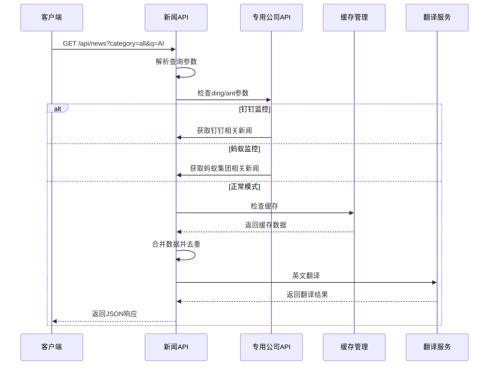
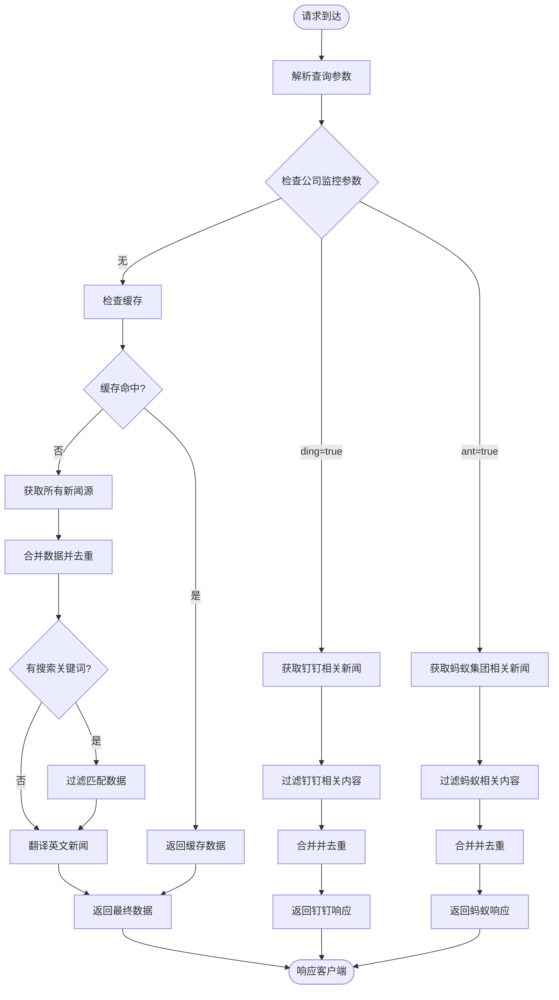
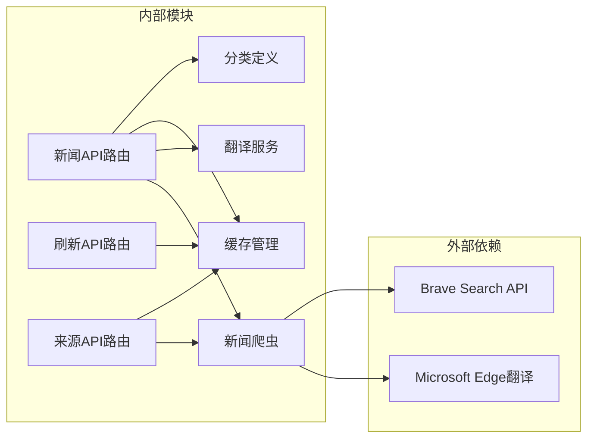

# API接口文档

<cite>
**本文档引用的文件**
- [app/api/news/route.ts](file://app/api/news/route.ts)
- [app/api/news/refresh/route.ts](file://app/api/news/refresh/route.ts)
- [app/api/news/sources/route.ts](file://app/api/news/sources/route.ts)
- [lib/brave-search.ts](file://lib/brave-search.ts)
- [lib/news-scraper.ts](file://lib/news-scraper.ts)
- [lib/mock-data.ts](file://lib/mock-data.ts)
- [lib/news-categories.ts](file://lib/news-categories.ts)
- [lib/favorites.ts](file://lib/favorites.ts)
- [lib/translator.ts](file://lib/translator.ts)
- [app/page.tsx](file://app/page.tsx)
- [components/SearchBar.tsx](file://components/SearchBar.tsx)
- [components/CategoryTabs.tsx](file://components/CategoryTabs.tsx)
- [README.md](file://README.md)
- [package.json](file://package.json)
</cite>

## 更新摘要
**变更内容**
- 新增翻译API端点支持英文新闻自动翻译
- 增强新闻聚合API，支持专用公司监控（蚂蚁集团、钉钉）
- 新增刷新和来源管理端点，提供缓存管理和数据源监控
- 扩展请求参数支持，新增ding和ant专用查询参数
- 增强响应格式，包含fetchTime和数据源统计信息

## 目录
1. [简介](#简介)
2. [项目结构](#项目结构)
3. [核心组件](#核心组件)
4. [架构概览](#架构概览)
5. [详细组件分析](#详细组件分析)
6. [依赖关系分析](#依赖关系分析)
7. [性能考虑](#性能考虑)
8. [故障排除指南](#故障排除指南)
9. [结论](#结论)
10. [附录](#附录)

## 简介

这是一个基于Next.js构建的新闻网站API接口文档，专注于多端点的新闻聚合服务设计与实现。该API提供了丰富的新闻获取、翻译、监控和管理功能，支持分类浏览、关键词搜索、专用公司监控和实时新闻获取。

### 主要特性
- **多源新闻聚合**：Brave Search API + 网络爬虫 + 翻译服务
- **专用公司监控**：蚂蚁集团、钉钉动态实时追踪
- **智能翻译**：英文新闻自动翻译到中文
- **缓存管理**：灵活的缓存刷新和数据源监控
- **实时搜索**：支持关键词精确匹配和分类筛选
- **错误处理**：自动降级机制，确保服务可用性
- **Mock数据**：开发环境下的本地数据模拟

## 项目结构

```mermaid
graph TB
subgraph "前端层"
UI[用户界面]
Components[React组件]
Hooks[自定义Hook]
end
subgraph "API层"
NewsRoute[GET /api/news]
RefreshRoute[POST /api/news/refresh]
SourcesRoute[GET /api/news/sources]
RouteHandler[路由处理器]
end
subgraph "服务层"
BraveSearch[Brave Search API]
NewsScraper[新闻爬虫]
Translator[翻译服务]
MockData[Mock数据]
end
subgraph "数据层"
Categories[新闻分类]
Favorites[收藏功能]
Cache[缓存管理]
end
UI --> Components
Components --> NewsRoute
NewsRoute --> RouteHandler
RouteHandler --> BraveSearch
RouteHandler --> NewsScraper
RouteHandler --> Translator
RouteHandler --> MockData
RouteHandler --> Categories
RouteHandler --> Cache
Components --> Favorites
```



**图表来源**
- [app/api/news/route.ts](file://app/api/news/route.ts#L1-L189)
- [app/api/news/refresh/route.ts](file://app/api/news/refresh/route.ts#L1-L43)
- [app/api/news/sources/route.ts](file://app/api/news/sources/route.ts#L1-L37)
- [lib/brave-search.ts](file://lib/brave-search.ts#L1-L115)
- [lib/news-scraper.ts](file://lib/news-scraper.ts#L1-L873)
- [lib/translator.ts](file://lib/translator.ts#L1-L132)

**章节来源**
- [README.md](file://README.md#L36-L49)
- [package.json](file://package.json#L1-L30)

## 核心组件

### API接口规范

#### 基本信息
- **HTTP方法**: GET/POST
- **URL模式**: `/api/news`、`/api/news/refresh`、`/api/news/sources`
- **请求方式**: 查询参数传递或JSON体
- **响应格式**: JSON

#### 主要端点

**GET /api/news**
- **功能**: 主新闻聚合接口
- **请求参数**:
  - `category` (string, 可选): 新闻分类标识符，默认"all"
  - `q` (string, 可选): 搜索关键词
  - `ding` (boolean, 可选): 是否获取钉钉相关新闻，默认false
  - `ant` (boolean, 可选): 是否获取蚂蚁集团相关新闻，默认false

**POST /api/news/refresh**
- **功能**: 刷新缓存
- **请求体**:
  - `source` (string, 可选): 指定缓存源ID

**GET /api/news/sources**
- **功能**: 获取所有新闻源的实时数据

#### 响应格式

**标准响应结构**：
```json
{
  "news": Array,
  "category": String,
  "query": String,
  "timestamp": String,
  "fetchTime": String,
  "sources": Object,
  "mock": Boolean
}
```

**错误响应结构**：
```json
{
  "error": String
}
```

**翻译服务响应结构**：
```json
{
  "success": Boolean,
  "message": String,
  "timestamp": String
}
```

**章节来源**
- [app/api/news/route.ts](file://app/api/news/route.ts#L5-L189)
- [app/api/news/refresh/route.ts](file://app/api/news/refresh/route.ts#L4-L43)
- [app/api/news/sources/route.ts](file://app/api/news/sources/route.ts#L4-L37)

## 架构概览



**图表来源**
- [app/api/news/route.ts](file://app/api/news/route.ts#L14-L118)
- [lib/news-scraper.ts](file://lib/news-scraper.ts#L813-L873)
- [lib/translator.ts](file://lib/translator.ts#L44-L119)

## 详细组件分析

### API路由处理器

#### 核心功能
- 参数解析与验证
- 多源数据获取
- 专用公司监控（蚂蚁集团、钉钉）
- 数据合并与去重
- 英文新闻自动翻译
- 错误处理与降级

#### 参数处理流程



**图表来源**
- [app/api/news/route.ts](file://app/api/news/route.ts#L14-L189)

**章节来源**
- [app/api/news/route.ts](file://app/api/news/route.ts#L5-L189)

### 数据源组件

#### Brave Search API集成

**数据模型定义**：
```typescript
interface NewsItem {
  id: string;
  title: string;
  description: string;
  url: string;
  source: string;
  publishedAt: string;
  thumbnail?: string;
  category: string;
}
```

**搜索参数配置**：
- `count`: 20 (默认结果数量)
- `freshness`: "pd" (过去一天)
- `text_decorations`: "false" (无装饰)
- `search_lang`: "en" (英语搜索)

**章节来源**
- [lib/brave-search.ts](file://lib/brave-search.ts#L1-L115)

#### 新闻爬虫系统

**爬取策略**：
- **Hacker News**: 抓取热门技术新闻
- **分类支持**: all, politics, business, tech, ding, ant
- **并发处理**: 异步抓取多个源
- **错误恢复**: 单个源失败不影响整体
- **缓存机制**: 内存缓存提高响应速度

**专用公司监控**：
- **蚂蚁集团**: 支持6个专用源（ant1-ant6）
- **钉钉**: 支持5个专用源（dingtalk-dingtalk5）
- **动态更新**: 每2分钟自动刷新

**章节来源**
- [lib/news-scraper.ts](file://lib/news-scraper.ts#L390-L790)

### 翻译服务组件

#### 核心功能
- **Token管理**: 自动获取和刷新Microsoft Edge翻译Token
- **批量翻译**: 支持最多25条文本的批量翻译
- **缓存机制**: 避免重复翻译相同文本
- **智能判断**: 自动识别英文文本进行翻译

#### 翻译流程


**图表来源**
- [lib/translator.ts](file://lib/translator.ts#L44-L119)

**章节来源**
- [lib/translator.ts](file://lib/translator.ts#L1-L132)

### 缓存管理组件

#### 缓存策略
- **普通缓存**: 5分钟TTL
- **短缓存**: 2分钟TTL（用于动态新闻如钉钉、蚂蚁）
- **源缓存**: 按源ID缓存，支持精确清理
- **内存管理**: 自动过期和垃圾回收

#### 刷新机制
- **GET /api/news/refresh**: 清除所有缓存
- **POST /api/news/refresh**: 清除指定源缓存
- **自动刷新**: 每2分钟刷新动态监控数据

**章节来源**
- [lib/news-scraper.ts](file://lib/news-scraper.ts#L25-L34)
- [app/api/news/refresh/route.ts](file://app/api/news/refresh/route.ts#L4-L43)

### Mock数据系统

#### 数据结构
- **分类支持**: all, politics, business, tech
- **每类条目**: 4-6条模拟新闻
- **字段完整性**: 包含所有必需字段

**章节来源**
- [lib/mock-data.ts](file://lib/mock-data.ts#L1-L197)

### 错误处理机制

#### 错误类型与处理策略

| 错误类型 | 触发条件 | 处理策略 |
|----------|----------|----------|
| API密钥缺失 | BRAVE_API_KEY为空 | 自动切换到Mock模式 |
| 分类无效 | 传入未知分类ID | 返回400错误 |
| API调用失败 | Brave Search API异常 | 降级到Mock+爬虫数据 |
| 网络错误 | 爬虫抓取失败 | 返回空数组但不中断 |
| 翻译失败 | 翻译服务异常 | 返回原文但不中断 |

**章节来源**
- [app/api/news/route.ts](file://app/api/news/route.ts#L181-L187)

## 依赖关系分析



**图表来源**
- [app/api/news/route.ts](file://app/api/news/route.ts#L1-L12)
- [app/api/news/refresh/route.ts](file://app/api/news/refresh/route.ts#L1-L2)
- [app/api/news/sources/route.ts](file://app/api/news/sources/route.ts#L1-L2)
- [lib/brave-search.ts](file://lib/brave-search.ts#L27-L28)
- [lib/translator.ts](file://lib/translator.ts#L21-L36)

**章节来源**
- [lib/news-categories.ts](file://lib/news-categories.ts#L1-L45)
- [package.json](file://package.json#L15-L29)

## 性能考虑

### 并发优化
- **并行数据获取**: API搜索和爬虫数据同时获取
- **Promise.all**: 最大化利用网络带宽
- **内存优化**: 及时释放中间结果
- **批量翻译**: 每批最多25条，减少API调用次数

### 缓存策略
- **智能去重**: 基于标题的智能去重
- **数据合并**: 优先保留API数据
- **源标识**: 区分数据来源便于统计
- **TTL管理**: 不同类型的缓存不同过期时间

### 错误恢复
- **渐进式降级**: 从API到爬虫再到Mock
- **容错设计**: 单点故障不影响整体服务
- **超时控制**: 合理的网络请求超时设置
- **翻译降级**: 翻译失败不影响主流程

## 故障排除指南

### 常见问题诊断

#### API密钥配置问题
**症状**: 始终返回Mock数据
**解决方案**: 
1. 检查`.env.local`文件中的`BRAVE_API_KEY`
2. 确认API密钥格式正确
3. 验证API配额是否充足

#### 分类参数错误
**症状**: 返回400错误
**解决方案**:
- 检查分类ID是否在允许范围内
- 确认大小写匹配
- 参考分类定义表

#### 网络连接问题
**症状**: API调用超时或失败
**解决方案**:
- 检查网络连接状态
- 验证Brave Search API可达性
- 查看防火墙设置

#### 翻译服务问题
**症状**: 英文新闻未翻译
**解决方案**:
- 检查Microsoft Edge翻译服务可用性
- 验证Token获取是否正常
- 查看翻译缓存状态

#### 缓存问题
**症状**: 数据不更新或显示过期
**解决方案**:
- 调用`/api/news/refresh`清理缓存
- 检查缓存TTL设置
- 验证缓存键生成逻辑

**章节来源**
- [app/api/news/route.ts](file://app/api/news/route.ts#L82-L88)
- [README.md](file://README.md#L24-L33)

## 结论

该新闻API接口设计合理，具有以下优势：

1. **多源聚合**: 结合专业API和网络爬虫，确保数据丰富性
2. **智能降级**: 完善的错误处理机制保证服务稳定性
3. **专用监控**: 支持蚂蚁集团、钉钉等公司的实时动态追踪
4. **智能翻译**: 英文新闻自动翻译提升用户体验
5. **缓存管理**: 灵活的缓存策略提高系统性能
6. **开发友好**: Mock数据支持离线开发和测试

建议后续改进方向：
- 添加API版本管理
- 实现更精细的缓存策略
- 增加请求限流机制
- 扩展错误监控和日志记录
- 支持更多专用公司监控

## 附录

### API使用示例

#### 基础请求
```
GET /api/news?category=all
GET /api/news?category=tech&q=AI
GET /api/news?q=climate+change
GET /api/news?ding=true
GET /api/news?ant=true
```

#### 专用公司监控
```
GET /api/news?ding=true
GET /api/news?ant=true
```

#### 缓存管理
```
GET /api/news/refresh
POST /api/news/refresh {"source": "36kr"}
GET /api/news/sources
```

#### 响应示例
```json
{
  "news": [
    {
      "id": "mock-all-1",
      "title": "联合国气候峰会达成新协议",
      "description": "在为期两周的紧张谈判后...",
      "url": "https://example.com/climate",
      "source": "Reuters",
      "publishedAt": "2 hours ago",
      "category": "all",
      "fetchedAt": "01-15 10:30"
    }
  ],
  "category": "all",
  "query": "mock",
  "timestamp": "2024-01-15T10:30:00Z",
  "fetchTime": "01-15 10:30",
  "sources": {
    "total": 16,
    "bySource": [
      {
        "id": "36kr",
        "count": 5,
        "ok": true
      }
    ]
  },
  "mock": true
}
```

### 安全考虑

#### 认证机制
- **API密钥保护**: 通过环境变量管理
- **HTTPS强制**: 生产环境必须使用HTTPS
- **输入验证**: 对所有用户输入进行验证
- **缓存隔离**: 不同源的缓存独立管理

#### 速率限制
- **Brave API配额**: 每月2000次免费调用
- **客户端缓存**: 减少重复请求
- **服务端节流**: 防止滥用
- **翻译频率限制**: 避免频繁Token刷新

### 版本管理

当前版本: v1.0.0

**版本演进计划**:
- v1.1.0: 添加分页支持
- v1.2.0: 实现用户个性化推荐
- v2.0.0: 引入GraphQL查询
- v1.3.0: 增加实时推送功能

### 监控与调试

#### 开发工具
- **浏览器开发者工具**: 网络面板监控API调用
- **Postman**: API测试和调试
- **Next.js DevTools**: React组件调试
- **缓存监控**: 查看缓存命中率和TTL

#### 生产监控
- **日志记录**: 错误和性能指标
- **APM工具**: 应用性能监控
- **告警系统**: 异常情况通知
- **翻译统计**: 翻译成功率和耗时统计

#### 常用调试命令
```
# 检查缓存状态
curl http://localhost:3000/api/news/sources

# 清理缓存
curl -X POST http://localhost:3000/api/news/refresh

# 获取钉钉动态
curl "http://localhost:3000/api/news?ding=true"

# 获取蚂蚁集团新闻
curl "http://localhost:3000/api/news?ant=true"
```