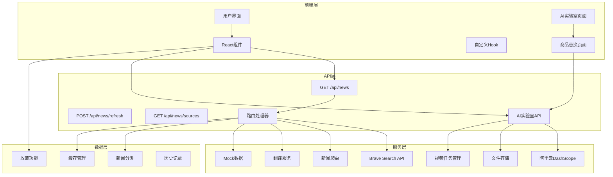
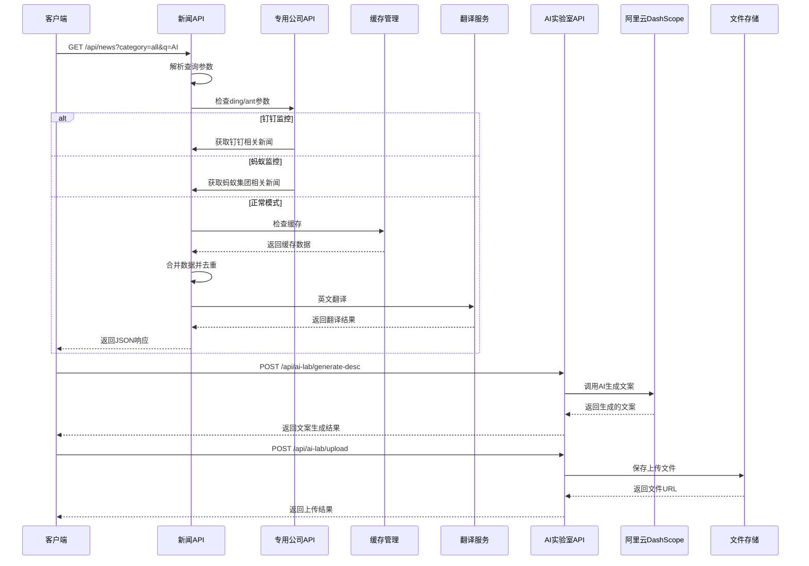
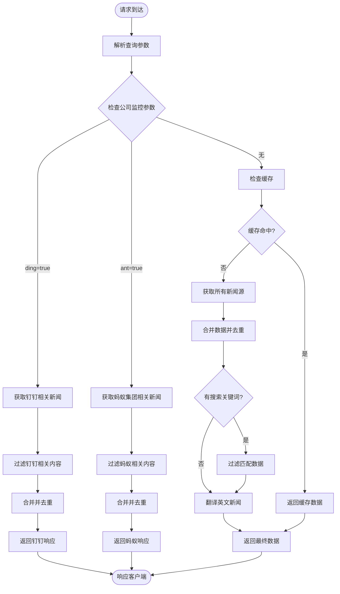
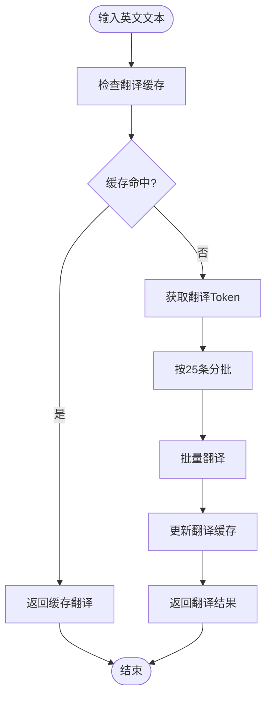
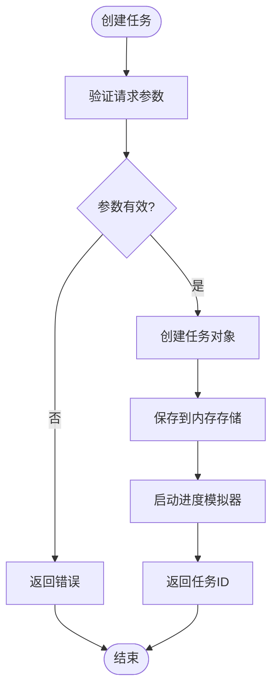
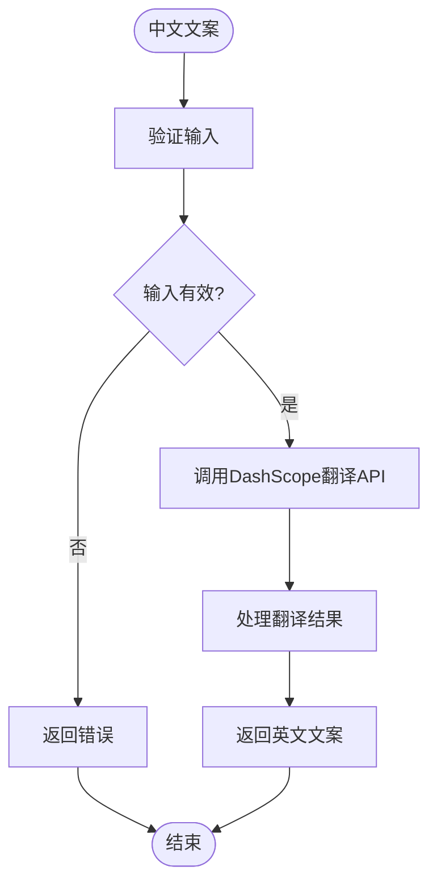
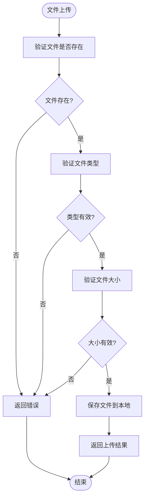
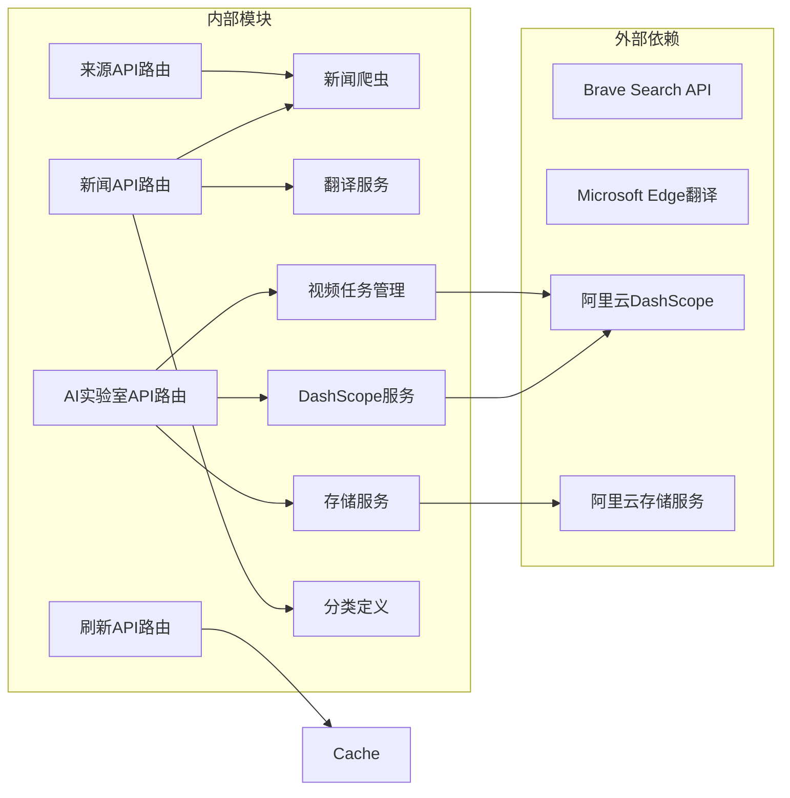

# API接口文档

<cite>
**本文档引用的文件**
- [app/api/news/route.ts](file://app/api/news/route.ts)
- [app/api/news/refresh/route.ts](file://app/api/news/refresh/route.ts)
- [app/api/news/sources/route.ts](file://app/api/news/sources/route.ts)
- [app/api/ai-lab/generate-desc/route.ts](file://app/api/ai-lab/generate-desc/route.ts)
- [app/api/ai-lab/generate-video/route.ts](file://app/api/ai-lab/generate-video/route.ts)
- [app/api/ai-lab/generate-video/status/route.ts](file://app/api/ai-lab/generate-video/status/route.ts)
- [app/api/ai-lab/history/route.ts](file://app/api/ai-lab/history/route.ts)
- [app/api/ai-lab/translate/route.ts](file://app/api/ai-lab/translate/route.ts)
- [app/api/ai-lab/upload/route.ts](file://app/api/ai-lab/upload/route.ts)
- [lib/brave-search.ts](file://lib/brave-search.ts)
- [lib/news-scraper.ts](file://lib/news-scraper.ts)
- [lib/mock-data.ts](file://lib/mock-data.ts)
- [lib/news-categories.ts](file://lib/news-categories.ts)
- [lib/favorites.ts](file://lib/favorites.ts)
- [lib/translator.ts](file://lib/translator.ts)
- [lib/aliyun/dashscope.ts](file://lib/aliyun/dashscope.ts)
- [lib/aliyun/storage.ts](file://lib/aliyun/storage.ts)
- [lib/video-tasks.ts](file://lib/video-tasks.ts)
- [app/page.tsx](file://app/page.tsx)
- [components/SearchBar.tsx](file://components/SearchBar.tsx)
- [components/CategoryTabs.tsx](file://components/CategoryTabs.tsx)
- [app/ai-lab/page.tsx](file://app/ai-lab/page.tsx)
- [app/ai-lab/product-swap/page.tsx](file://app/ai-lab/product-swap/page.tsx)
- [README.md](file://README.md)
- [package.json](file://package.json)
</cite>

## 更新摘要
**变更内容**
- 新增AI实验室API端点：generate-desc、generate-video、generate-video/status、history、translate、upload
- 集成阿里云DashScope AI服务，支持商品文案生成和英文翻译
- 添加视频生成任务管理系统，支持异步进度跟踪
- 实现文件上传功能，支持图片和视频文件
- 扩展历史记录管理，支持视频生成历史保存
- 新增Mock数据系统，支持离线开发和测试

## 目录
1. [简介](#简介)
2. [项目结构](#项目结构)
3. [核心组件](#核心组件)
4. [架构概览](#架构概览)
5. [详细组件分析](#详细组件分析)
6. [AI实验室API端点](#ai实验室api端点)
7. [依赖关系分析](#依赖关系分析)
8. [性能考虑](#性能考虑)
9. [故障排除指南](#故障排除指南)
10. [结论](#结论)
11. [附录](#附录)

## 简介

这是一个基于Next.js构建的新闻网站API接口文档，专注于多端点的新闻聚合服务设计与实现。该API提供了丰富的新闻获取、翻译、监控和管理功能，支持分类浏览、关键词搜索、专用公司监控和实时新闻获取。

**更新** 新增AI实验室功能模块，集成了阿里云DashScope AI服务，提供商品文案生成、视频生成、文件上传等智能化功能。

### 主要特性
- **多源新闻聚合**：Brave Search API + 网络爬虫 + 翻译服务
- **专用公司监控**：蚂蚁集团、钉钉动态实时追踪
- **智能翻译**：英文新闻自动翻译到中文
- **缓存管理**：灵活的缓存刷新和数据源监控
- **实时搜索**：支持关键词精确匹配和分类筛选
- **错误处理**：自动降级机制，确保服务可用性
- **Mock数据**：开发环境下的本地数据模拟
- **AI智能生成**：商品文案生成、视频生成、文件上传
- **任务管理系统**：异步视频生成任务跟踪
- **历史记录**：视频生成历史保存和管理

## 项目结构



**图表来源**
- [app/api/news/route.ts:1-189](file://app/api/news/route.ts#L1-L189)
- [app/api/news/refresh/route.ts:1-43](file://app/api/news/refresh/route.ts#L1-L43)
- [app/api/news/sources/route.ts:1-37](file://app/api/news/sources/route.ts#L1-L37)
- [app/api/ai-lab/generate-desc/route.ts:1-26](file://app/api/ai-lab/generate-desc/route.ts#L1-L26)
- [app/api/ai-lab/generate-video/route.ts:1-68](file://app/api/ai-lab/generate-video/route.ts#L1-L68)
- [lib/brave-search.ts:1-115](file://lib/brave-search.ts#L1-L115)
- [lib/news-scraper.ts:1-873](file://lib/news-scraper.ts#L1-L873)
- [lib/translator.ts:1-132](file://lib/translator.ts#L1-L132)
- [lib/aliyun/dashscope.ts:1-95](file://lib/aliyun/dashscope.ts#L1-L95)
- [lib/aliyun/storage.ts:1-60](file://lib/aliyun/storage.ts#L1-L60)
- [lib/video-tasks.ts:1-31](file://lib/video-tasks.ts#L1-L31)

**章节来源**
- [README.md:36-49](file://README.md#L36-L49)
- [package.json:1-30](file://package.json#L1-L30)

## 核心组件

### API接口规范

#### 基本信息
- **HTTP方法**: GET/POST
- **URL模式**: `/api/news`、`/api/news/refresh`、`/api/news/sources`、`/api/ai-lab/*`
- **请求方式**: 查询参数传递或JSON体
- **响应格式**: JSON

#### 主要端点

**GET /api/news**
- **功能**: 主新闻聚合接口
- **请求参数**:
  - `category` (string, 可选): 新闻分类标识符，默认"all"
  - `q` (string, 可选): 搜索关键词
  - `ding` (boolean, 可选): 是否获取钉钉相关新闻，默认false
  - `ant` (boolean, 可选): 是否获取蚂蚁集团相关新闻，默认false

**POST /api/news/refresh**
- **功能**: 刷新缓存
- **请求体**:
  - `source` (string, 可选): 指定缓存源ID

**GET /api/news/sources**
- **功能**: 获取所有新闻源的实时数据

#### AI实验室端点

**POST /api/ai-lab/generate-desc**
- **功能**: AI生成商品文案
- **请求体**:
  - `swapType` (string, 可选): 替换类型，支持"product"、"clothing"、"model"，默认"product"
  - `imageCount` (number, 可选): 图片数量，默认1
  - `hasVideo` (boolean, 可选): 是否包含视频，默认false

**POST /api/ai-lab/generate-video**
- **功能**: 创建视频生成任务
- **请求体**:
  - `videoUrl` (string, 可选): 原始视频URL
  - `imageUrls` (string[], 必需): 商品图片URL数组
  - `desc` (string, 必需): 商品文案
  - `swapType` (string, 可选): 替换类型，默认"product"
  - `needEnglish` (boolean, 可选): 是否需要英文版本，默认false
  - `englishDesc` (string, 可选): 英文文案

**GET /api/ai-lab/generate-video/status**
- **功能**: 查询视频生成任务状态
- **查询参数**:
  - `taskId` (string, 必需): 任务ID

**GET /api/ai-lab/history**
- **功能**: 获取历史记录列表

**POST /api/ai-lab/history**
- **功能**: 保存历史记录
- **请求体**:
  - `title` (string, 必需): 标题
  - `type` (string, 可选): 类型，默认"product"
  - `duration` (string, 可选): 持续时间，默认"0:30"
  - `status` (string, 可选): 状态，默认"completed"
  - `hasEnglish` (boolean, 可选): 是否包含英文，默认false
  - `desc` (string, 可选): 描述
  - `videoUrl` (string, 可选): 视频URL
  - `imageUrls` (string[], 可选): 图片URL数组
  - `originalVideoUrl` (string, 可选): 原始视频URL

**POST /api/ai-lab/translate**
- **功能**: 中文翻译为英文
- **请求体**:
  - `text` (string, 必需): 需要翻译的中文文本

**POST /api/ai-lab/upload**
- **功能**: 文件上传
- **请求体**:
  - `file` (File, 必需): 上传的文件
  - `type` (string, 可选): 文件类型，"video"或"image"，默认"image"

#### 响应格式

**标准响应结构**：
```json
{
  "news": Array,
  "category": String,
  "query": String,
  "timestamp": String,
  "fetchTime": String,
  "sources": Object,
  "mock": Boolean
}
```

**AI实验室通用响应结构**：
```json
{
  "success": Boolean,
  "message": String,
  "error": String,
  "timestamp": String
}
```

**AI生成文案响应结构**：
```json
{
  "success": Boolean,
  "desc": String
}
```

**视频生成任务响应结构**：
```json
{
  "success": Boolean,
  "taskId": String,
  "message": String
}
```

**任务状态响应结构**：
```json
{
  "taskId": String,
  "status": "pending" | "processing" | "completed" | "failed",
  "progress": Number,
  "resultUrl": String,
  "error": String
}
```

**历史记录响应结构**：
```json
{
  "success": Boolean,
  "history": Array,
  "record": Object
}
```

**文件上传响应结构**：
```json
{
  "success": Boolean,
  "url": String,
  "fileName": String,
  "size": Number,
  "originalName": String
}
```

**错误响应结构**：
```json
{
  "error": String
}
```

**章节来源**
- [app/api/news/route.ts:5-189](file://app/api/news/route.ts#L5-L189)
- [app/api/news/refresh/route.ts:4-43](file://app/api/news/refresh/route.ts#L4-L43)
- [app/api/news/sources/route.ts:4-37](file://app/api/news/sources/route.ts#L4-L37)
- [app/api/ai-lab/generate-desc/route.ts:6-25](file://app/api/ai-lab/generate-desc/route.ts#L6-L25)
- [app/api/ai-lab/generate-video/route.ts:31-67](file://app/api/ai-lab/generate-video/route.ts#L31-L67)
- [app/api/ai-lab/generate-video/status/route.ts:6-26](file://app/api/ai-lab/generate-video/status/route.ts#L6-L26)
- [app/api/ai-lab/history/route.ts:51-118](file://app/api/ai-lab/history/route.ts#L51-L118)
- [app/api/ai-lab/translate/route.ts:6-25](file://app/api/ai-lab/translate/route.ts#L6-L25)
- [app/api/ai-lab/upload/route.ts:6-54](file://app/api/ai-lab/upload/route.ts#L6-L54)

## 架构概览



**图表来源**
- [app/api/news/route.ts:14-118](file://app/api/news/route.ts#L14-L118)
- [lib/news-scraper.ts:813-873](file://lib/news-scraper.ts#L813-L873)
- [lib/translator.ts:44-119](file://lib/translator.ts#L44-L119)
- [app/api/ai-lab/generate-desc/route.ts:15-17](file://app/api/ai-lab/generate-desc/route.ts#L15-L17)
- [lib/aliyun/dashscope.ts:35-70](file://lib/aliyun/dashscope.ts#L35-L70)
- [app/api/ai-lab/upload/route.ts:38-46](file://app/api/ai-lab/upload/route.ts#L38-L46)

## 详细组件分析

### API路由处理器

#### 核心功能
- 参数解析与验证
- 多源数据获取
- 专用公司监控（蚂蚁集团、钉钉）
- 数据合并与去重
- 英文新闻自动翻译
- 错误处理与降级
- **新增** AI实验室功能集成

#### 参数处理流程



**图表来源**
- [app/api/news/route.ts:14-189](file://app/api/news/route.ts#L14-L189)

**章节来源**
- [app/api/news/route.ts:5-189](file://app/api/news/route.ts#L5-L189)

### 数据源组件

#### Brave Search API集成

**数据模型定义**：
```typescript
interface NewsItem {
  id: string;
  title: string;
  description: string;
  url: string;
  source: string;
  publishedAt: string;
  thumbnail?: string;
  category: string;
}
```

**搜索参数配置**：
- `count`: 20 (默认结果数量)
- `freshness`: "pd" (过去一天)
- `text_decorations`: "false" (无装饰)
- `search_lang`: "en" (英语搜索)

**章节来源**
- [lib/brave-search.ts:1-115](file://lib/brave-search.ts#L1-L115)

#### 新闻爬虫系统

**爬取策略**：
- **Hacker News**: 抓取热门技术新闻
- **分类支持**: all, politics, business, tech, ding, ant
- **并发处理**: 异步抓取多个源
- **错误恢复**: 单个源失败不影响整体
- **缓存机制**: 内存缓存提高响应速度

**专用公司监控**：
- **蚂蚁集团**: 支持6个专用源（ant1-ant6）
- **钉钉**: 支持5个专用源（dingtalk-dingtalk5）
- **动态更新**: 每2分钟自动刷新

**章节来源**
- [lib/news-scraper.ts:390-790](file://lib/news-scraper.ts#L390-L790)

### 翻译服务组件

#### 核心功能
- **Token管理**: 自动获取和刷新Microsoft Edge翻译Token
- **批量翻译**: 支持最多25条文本的批量翻译
- **缓存机制**: 避免重复翻译相同文本
- **智能判断**: 自动识别英文文本进行翻译

#### 翻译流程



**图表来源**
- [lib/translator.ts:44-119](file://lib/translator.ts#L44-L119)

**章节来源**
- [lib/translator.ts:1-132](file://lib/translator.ts#L1-L132)

### 缓存管理组件

#### 缓存策略
- **普通缓存**: 5分钟TTL
- **短缓存**: 2分钟TTL（用于动态新闻如钉钉、蚂蚁）
- **源缓存**: 按源ID缓存，支持精确清理
- **内存管理**: 自动过期和垃圾回收

#### 刷新机制
- **GET /api/news/refresh**: 清除所有缓存
- **POST /api/news/refresh**: 清除指定源缓存
- **自动刷新**: 每2分钟刷新动态监控数据

**章节来源**
- [lib/news-scraper.ts:25-34](file://lib/news-scraper.ts#L25-L34)
- [app/api/news/refresh/route.ts:4-43](file://app/api/news/refresh/route.ts#L4-L43)

### Mock数据系统

#### 数据结构
- **分类支持**: all, politics, business, tech
- **每类条目**: 4-6条模拟新闻
- **字段完整性**: 包含所有必需字段

**章节来源**
- [lib/mock-data.ts:1-197](file://lib/mock-data.ts#L1-L197)

### 错误处理机制

#### 错误类型与处理策略

| 错误类型 | 触发条件 | 处理策略 |
|----------|----------|----------|
| API密钥缺失 | BRAVE_API_KEY为空 | 自动切换到Mock模式 |
| 分类无效 | 传入未知分类ID | 返回400错误 |
| API调用失败 | Brave Search API异常 | 降级到Mock+爬虫数据 |
| 网络错误 | 爬虫抓取失败 | 返回空数组但不中断 |
| 翻译失败 | 翻译服务异常 | 返回原文但不中断 |
| **新增** AI服务错误 | DashScope API异常 | 返回错误信息但不中断 |
| **新增** 文件上传失败 | 存储服务异常 | 返回错误信息但不中断 |

**章节来源**
- [app/api/news/route.ts:181-187](file://app/api/news/route.ts#L181-L187)

## AI实验室API端点

### AI生成商品文案

#### 功能概述
基于阿里云DashScope的通义千问模型，为不同类型的电商商品生成吸引人的推广文案。

#### 请求参数
- `swapType` (string, 可选): 替换类型，支持"product"、"clothing"、"model"
- `imageCount` (number, 可选): 商品图片数量，默认1
- `hasVideo` (boolean, 可选): 是否包含展示视频，默认false

#### 响应格式
```json
{
  "success": true,
  "desc": "生成的文案内容"
}
```

#### 错误处理
- 无效的替换类型：返回400错误
- AI服务调用失败：返回500错误

**章节来源**
- [app/api/ai-lab/generate-desc/route.ts:6-25](file://app/api/ai-lab/generate-desc/route.ts#L6-L25)
- [lib/aliyun/dashscope.ts:35-70](file://lib/aliyun/dashscope.ts#L35-L70)

### 视频生成任务管理

#### 功能概述
创建异步视频生成任务，支持商品替换、服饰替换、模特替换等场景。

#### 任务创建流程


**图表来源**
- [app/api/ai-lab/generate-video/route.ts:31-67](file://app/api/ai-lab/generate-video/route.ts#L31-L67)

#### 任务状态管理
- **状态类型**: pending、processing、completed、failed
- **进度范围**: 0-100%
- **结果存储**: 生成完成后存储结果URL

#### 任务查询
- **GET /api/ai-lab/generate-video/status**: 通过taskId查询任务状态
- **轮询机制**: 前端定时轮询获取最新状态

**章节来源**
- [app/api/ai-lab/generate-video/route.ts:31-67](file://app/api/ai-lab/generate-video/route.ts#L31-L67)
- [app/api/ai-lab/generate-video/status/route.ts:6-26](file://app/api/ai-lab/generate-video/status/route.ts#L6-L26)
- [lib/video-tasks.ts:6-31](file://lib/video-tasks.ts#L6-L31)

### 历史记录管理

#### 功能概述
管理AI生成视频的历史记录，支持查询和保存操作。

#### 数据模型
```typescript
interface HistoryRecord {
  id: string;
  title: string,
  type: "product" | "clothing" | "model",
  createdAt: string,
  duration: string,
  status: "completed" | "processing" | "failed",
  hasEnglish: boolean,
  desc: string,
  videoUrl?: string,
  imageUrls?: string[],
  originalVideoUrl?: string,
}
```

#### 操作接口
- **GET /api/ai-lab/history**: 获取历史记录列表
- **POST /api/ai-lab/history**: 保存新的历史记录

#### 文件存储
- **位置**: `data/ai-lab-history.json`
- **格式**: JSON数组
- **排序**: 按创建时间倒序排列

**章节来源**
- [app/api/ai-lab/history/route.ts:12-118](file://app/api/ai-lab/history/route.ts#L12-L118)

### 英文翻译服务

#### 功能概述
使用阿里云DashScope将中文营销文案翻译为英文，保持营销风格和情感表达。

#### 翻译流程


**图表来源**
- [app/api/ai-lab/translate/route.ts:6-25](file://app/api/ai-lab/translate/route.ts#L6-L25)

#### 翻译质量保证
- **专业术语**: 保持营销文案的专业性和吸引力
- **文化适配**: 适应英语市场的表达习惯
- **格式保持**: 维持原文的emoji和格式风格

**章节来源**
- [app/api/ai-lab/translate/route.ts:6-25](file://app/api/ai-lab/translate/route.ts#L6-L25)
- [lib/aliyun/dashscope.ts:75-94](file://lib/aliyun/dashscope.ts#L75-L94)

### 文件上传服务

#### 功能概述
支持图片和视频文件的上传，提供安全的文件类型和大小验证。

#### 支持的文件类型
- **图片**: PNG、JPG、WebP
- **视频**: MP4、MOV、AVI

#### 文件大小限制
- **图片**: 最大10MB
- **视频**: 最大200MB

#### 上传流程


**图表来源**
- [app/api/ai-lab/upload/route.ts:6-54](file://app/api/ai-lab/upload/route.ts#L6-L54)

#### 存储策略
- **目录结构**: `public/uploads/{type}/{filename}`
- **URL映射**: 相对于public目录的可访问URL
- **文件命名**: UUID + 原始扩展名

**章节来源**
- [app/api/ai-lab/upload/route.ts:6-54](file://app/api/ai-lab/upload/route.ts#L6-L54)
- [lib/aliyun/storage.ts:22-40](file://lib/aliyun/storage.ts#L22-L40)

## 依赖关系分析



**图表来源**
- [app/api/news/route.ts:1-12](file://app/api/news/route.ts#L1-L12)
- [app/api/news/refresh/route.ts:1-2](file://app/api/news/refresh/route.ts#L1-L2)
- [app/api/news/sources/route.ts:1-2](file://app/api/news/sources/route.ts#L1-L2)
- [app/api/ai-lab/generate-desc/route.ts:1-4](file://app/api/ai-lab/generate-desc/route.ts#L1-L4)
- [lib/brave-search.ts:27-28](file://lib/brave-search.ts#L27-L28)
- [lib/translator.ts:21-36](file://lib/translator.ts#L21-L36)
- [lib/aliyun/dashscope.ts:3-6](file://lib/aliyun/dashscope.ts#L3-L6)
- [lib/aliyun/storage.ts:1-4](file://lib/aliyun/storage.ts#L1-L4)

**章节来源**
- [lib/news-categories.ts:1-45](file://lib/news-categories.ts#L1-L45)
- [package.json:15-29](file://package.json#L15-L29)

## 性能考虑

### 并发优化
- **并行数据获取**: API搜索和爬虫数据同时获取
- **Promise.all**: 最大化利用网络带宽
- **内存优化**: 及时释放中间结果
- **批量翻译**: 每批最多25条，减少API调用次数
- ****新增** 任务队列**: 视频生成任务异步处理，避免阻塞主线程

### 缓存策略
- **智能去重**: 基于标题的智能去重
- **数据合并**: 优先保留API数据
- **源标识**: 区分数据来源便于统计
- **TTL管理**: 不同类型的缓存不同过期时间
- ****新增** 内存任务存储**: 视频任务状态存储在内存中，支持快速查询

### 错误恢复
- **渐进式降级**: 从API到爬虫再到Mock
- **容错设计**: 单点故障不影响整体服务
- **超时控制**: 合理的网络请求超时设置
- **翻译降级**: 翻译失败不影响主流程
- ****新增** AI服务降级**: DashScope API失败时返回错误信息而非崩溃

### **新增** AI服务性能优化
- ****新增** Token复用**: DashScope API Token复用，避免频繁获取
- ****新增** 任务池管理**: 视频生成任务池化，支持并发处理
- ****新增** 进度模拟**: 内存中模拟进度，减少实际计算开销

## 故障排除指南

### 常见问题诊断

#### API密钥配置问题
**症状**: 始终返回Mock数据
**解决方案**: 
1. 检查`.env.local`文件中的`BRAVE_API_KEY`
2. 确认API密钥格式正确
3. 验证API配额是否充足

#### 分类参数错误
**症状**: 返回400错误
**解决方案**:
- 检查分类ID是否在允许范围内
- 确认大小写匹配
- 参考分类定义表

#### 网络连接问题
**症状**: API调用超时或失败
**解决方案**:
- 检查网络连接状态
- 验证Brave Search API可达性
- 查看防火墙设置

#### 翻译服务问题
**症状**: 英文新闻未翻译
**解决方案**:
- 检查Microsoft Edge翻译服务可用性
- 验证Token获取是否正常
- 查看翻译缓存状态

#### 缓存问题
**症状**: 数据不更新或显示过期
**解决方案**:
- 调用`/api/news/refresh`清理缓存
- 检查缓存TTL设置
- 验证缓存键生成逻辑

#### **新增** AI服务问题
**症状**: AI生成功能不可用
**解决方案**:
- 检查`DASHSCOPE_API_KEY`配置
- 验证DashScope API服务状态
- 查看AI生成任务是否正常创建

#### **新增** 文件上传问题
**症状**: 文件上传失败
**解决方案**:
- 检查文件类型是否在允许范围内
- 验证文件大小是否超过限制
- 确认上传目录权限设置

#### **新增** 视频生成任务问题
**症状**: 任务状态一直pending
**解决方案**:
- 检查任务ID是否正确
- 验证内存存储是否正常工作
- 查看任务创建日志

**章节来源**
- [app/api/news/route.ts:82-88](file://app/api/news/route.ts#L82-L88)
- [README.md:24-33](file://README.md#L24-L33)

## 结论

该新闻API接口设计合理，具有以下优势：

1. **多源聚合**: 结合专业API和网络爬虫，确保数据丰富性
2. **智能降级**: 完善的错误处理机制保证服务稳定性
3. **专用监控**: 支持蚂蚁集团、钉钉等公司的实时动态追踪
4. **智能翻译**: 英文新闻自动翻译提升用户体验
5. **缓存管理**: 灵活的缓存策略提高系统性能
6. **开发友好**: Mock数据支持离线开发和测试
7. ****新增** AI智能功能**: 集成阿里云DashScope提供智能化服务
8. ****新增** 任务管理系统**: 支持异步视频生成和状态跟踪
9. ****新增** 文件管理**: 完整的文件上传和存储解决方案
10. ****新增** 历史记录**: 支持AI生成内容的持久化管理

**建议后续改进方向**：
- 添加API版本管理
- 实现更精细的缓存策略
- 增加请求限流机制
- 扩展错误监控和日志记录
- 支持更多专用公司监控
- **新增** 实现生产环境的任务持久化存储
- **新增** 添加AI服务的监控和统计功能

## 附录

### API使用示例

#### 基础请求
```
GET /api/news?category=all
GET /api/news?category=tech&q=AI
GET /api/news?q=climate+change
GET /api/news?ding=true
GET /api/news?ant=true
```

#### 专用公司监控
```
GET /api/news?ding=true
GET /api/news?ant=true
```

#### 缓存管理
```
GET /api/news/refresh
POST /api/news/refresh {"source": "36kr"}
GET /api/news/sources
```

#### **新增** AI实验室功能
```
# 生成商品文案
POST /api/ai-lab/generate-desc
{
  "swapType": "product",
  "imageCount": 3,
  "hasVideo": true
}

# 上传文件
POST /api/ai-lab/upload
Content-Type: multipart/form-data
Body: file=...&type=image

# 创建视频生成任务
POST /api/ai-lab/generate-video
{
  "imageUrls": ["/uploads/images/xxx.png"],
  "desc": "商品推广文案",
  "swapType": "product"
}

# 查询任务状态
GET /api/ai-lab/generate-video/status?taskId=xxx

# 获取历史记录
GET /api/ai-lab/history

# 保存历史记录
POST /api/ai-lab/history
{
  "title": "商品推广视频",
  "type": "product",
  "desc": "商品描述"
}

# 中文翻译为英文
POST /api/ai-lab/translate
{
  "text": "中文营销文案"
}
```

#### 响应示例
```json
{
  "news": [
    {
      "id": "mock-all-1",
      "title": "联合国气候峰会达成新协议",
      "description": "在为期两周的紧张谈判后...",
      "url": "https://example.com/climate",
      "source": "Reuters",
      "publishedAt": "2 hours ago",
      "category": "all",
      "fetchedAt": "01-15 10:30"
    }
  ],
  "category": "all",
  "query": "mock",
  "timestamp": "2024-01-15T10:30:00Z",
  "fetchTime": "01-15 10:30",
  "sources": {
    "total": 16,
    "bySource": [
      {
        "id": "36kr",
        "count": 5,
        "ok": true
      }
    ]
  },
  "mock": true
}
```

### 安全考虑

#### 认证机制
- **API密钥保护**: 通过环境变量管理
- **HTTPS强制**: 生产环境必须使用HTTPS
- **输入验证**: 对所有用户输入进行验证
- **缓存隔离**: 不同源的缓存独立管理
- ****新增** AI服务密钥**: DashScope API密钥安全存储

#### 速率限制
- **Brave API配额**: 每月2000次免费调用
- **客户端缓存**: 减少重复请求
- **服务端节流**: 防止滥用
- **翻译频率限制**: 避免频繁Token刷新
- ****新增** AI服务配额**: DashScope API调用频率限制
- ****新增** 文件大小限制**: 防止大文件占用存储空间

### 版本管理

当前版本: v1.0.0

**版本演进计划**:
- v1.1.0: 添加分页支持
- v1.2.0: 实现用户个性化推荐
- v2.0.0: 引入GraphQL查询
- v1.3.0: 增加实时推送功能
- **新增** v1.4.0: 实现AI实验室功能稳定版

### 监控与调试

#### 开发工具
- **浏览器开发者工具**: 网络面板监控API调用
- **Postman**: API测试和调试
- **Next.js DevTools**: React组件调试
- **缓存监控**: 查看缓存命中率和TTL
- ****新增** AI服务监控**: DashScope API调用统计

#### 生产监控
- **日志记录**: 错误和性能指标
- **APM工具**: 应用性能监控
- **告警系统**: 异常情况通知
- **翻译统计**: 翻译成功率和耗时统计
- ****新增** AI服务监控**: 生成任务成功率和耗时统计

#### 常用调试命令
```
# 检查缓存状态
curl http://localhost:3000/api/news/sources

# 清理缓存
curl -X POST http://localhost:3000/api/news/refresh

# 获取钉钉动态
curl "http://localhost:3000/api/news?ding=true"

# 获取蚂蚁集团新闻
curl "http://localhost:3000/api/news?ant=true"

# **新增** 生成商品文案
curl -X POST http://localhost:3000/api/ai-lab/generate-desc \
  -H "Content-Type: application/json" \
  -d '{"swapType":"product","imageCount":1}'

# **新增** 上传文件
curl -X POST http://localhost:3000/api/ai-lab/upload \
  -F "file=@/path/to/image.jpg" \
  -F "type=image"

# **新增** 创建视频生成任务
curl -X POST http://localhost:3000/api/ai-lab/generate-video \
  -H "Content-Type: application/json" \
  -d '{"imageUrls":["/uploads/images/test.jpg"],"desc":"商品文案"}'
```