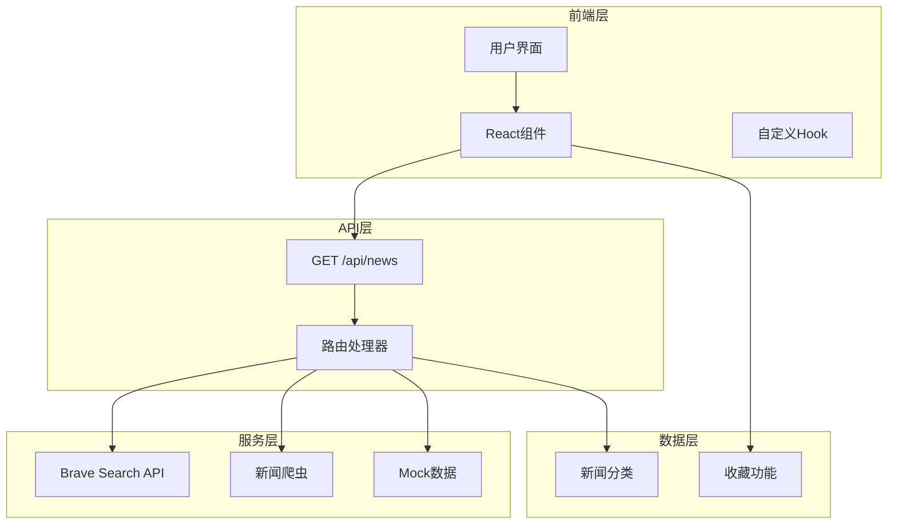
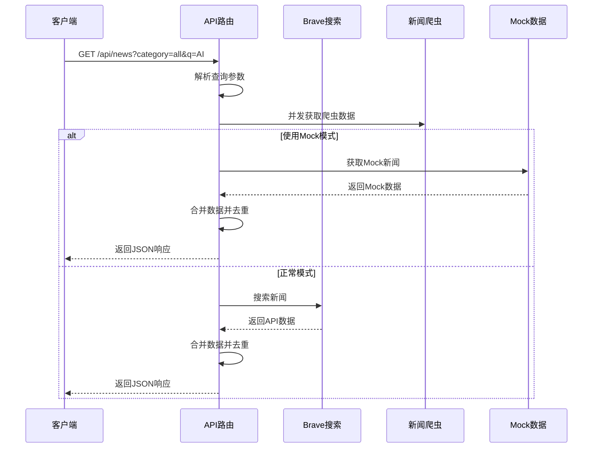
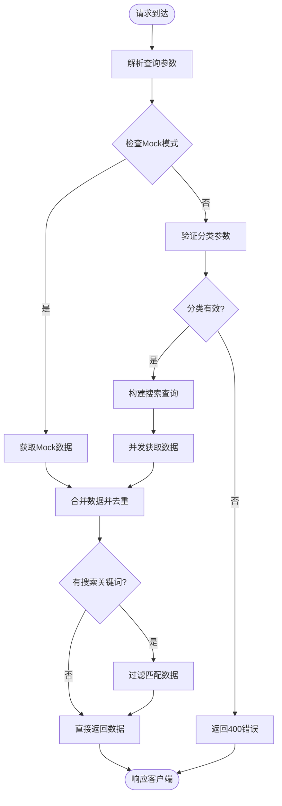
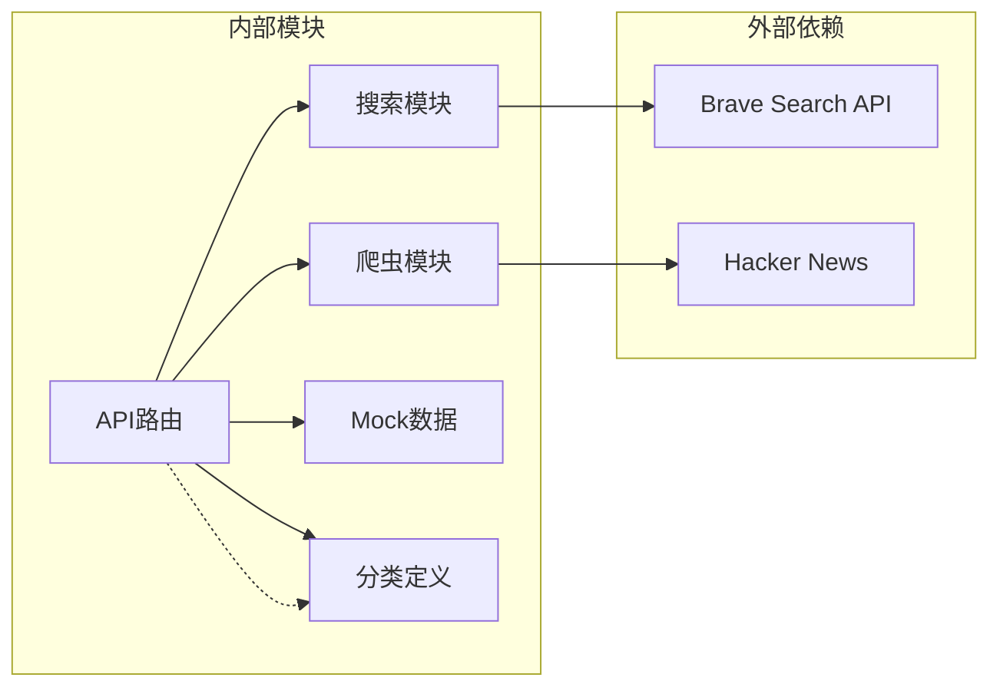

# API接口文档

<cite>
**本文档引用的文件**
- [app/api/news/route.ts](file://app/api/news/route.ts)
- [lib/brave-search.ts](file://lib/brave-search.ts)
- [lib/news-scraper.ts](file://lib/news-scraper.ts)
- [lib/mock-data.ts](file://lib/mock-data.ts)
- [lib/news-categories.ts](file://lib/news-categories.ts)
- [lib/favorites.ts](file://lib/favorites.ts)
- [app/page.tsx](file://app/page.tsx)
- [components/SearchBar.tsx](file://components/SearchBar.tsx)
- [components/CategoryTabs.tsx](file://components/CategoryTabs.tsx)
- [README.md](file://README.md)
- [package.json](file://package.json)
</cite>

## 目录
1. [简介](#简介)
2. [项目结构](#项目结构)
3. [核心组件](#核心组件)
4. [架构概览](#架构概览)
5. [详细组件分析](#详细组件分析)
6. [依赖关系分析](#依赖关系分析)
7. [性能考虑](#性能考虑)
8. [故障排除指南](#故障排除指南)
9. [结论](#结论)
10. [附录](#附录)

## 简介

这是一个基于Next.js构建的新闻网站API接口文档，专注于GET /api/news接口的设计与实现。该API提供了多源新闻聚合功能，支持分类浏览、关键词搜索和实时新闻获取。

### 主要特性
- 多源新闻聚合：Brave Search API + 网络爬虫
- 实时搜索功能：支持关键词精确匹配
- 分类浏览：综合热点、国际时政、财经商业、科技互联网
- 错误处理：自动降级机制，确保服务可用性
- Mock数据：开发环境下的本地数据模拟

## 项目结构



**图表来源**
- [app/api/news/route.ts](file://app/api/news/route.ts#L1-L136)
- [lib/brave-search.ts](file://lib/brave-search.ts#L1-L115)
- [lib/news-scraper.ts](file://lib/news-scraper.ts#L1-L166)

**章节来源**
- [README.md](file://README.md#L36-L49)
- [package.json](file://package.json#L1-L30)

## 核心组件

### API接口规范

#### 基本信息
- **HTTP方法**: GET
- **URL模式**: `/api/news`
- **请求方式**: 查询参数传递
- **响应格式**: JSON

#### 请求参数

| 参数名 | 类型 | 必需 | 默认值 | 描述 |
|--------|------|------|--------|------|
| category | string | 否 | "all" | 新闻分类标识符 |
| q | string | 否 | "" | 搜索关键词 |

#### 响应格式

**标准响应结构**：
```json
{
  "news": Array,
  "category": String,
  "query": String,
  "timestamp": String,
  "sources": Object,
  "mock": Boolean
}
```

**错误响应结构**：
```json
{
  "error": String
}
```

**章节来源**
- [app/api/news/route.ts](file://app/api/news/route.ts#L39-L136)

## 架构概览



**图表来源**
- [app/api/news/route.ts](file://app/api/news/route.ts#L39-L136)
- [lib/brave-search.ts](file://lib/brave-search.ts#L30-L73)

## 详细组件分析

### API路由处理器

#### 核心功能
- 参数解析与验证
- 多源数据获取
- 数据合并与去重
- 错误处理与降级

#### 参数处理流程



**图表来源**
- [app/api/news/route.ts](file://app/api/news/route.ts#L39-L136)

**章节来源**
- [app/api/news/route.ts](file://app/api/news/route.ts#L39-L136)

### 数据源组件

#### Brave Search API集成

**数据模型定义**：
```typescript
interface NewsItem {
  id: string;
  title: string;
  description: string;
  url: string;
  source: string;
  publishedAt: string;
  thumbnail?: string;
  category: string;
}
```

**搜索参数配置**：
- `count`: 20 (默认结果数量)
- `freshness`: "pd" (过去一天)
- `text_decorations`: "false" (无装饰)
- `search_lang`: "en" (英语搜索)

**章节来源**
- [lib/brave-search.ts](file://lib/brave-search.ts#L1-L115)

#### 新闻爬虫系统

**爬取策略**：
- **Hacker News**: 抓取热门技术新闻
- **分类支持**: all, tech, business, politics
- **并发处理**: 异步抓取多个源
- **错误恢复**: 单个源失败不影响整体

**章节来源**
- [lib/news-scraper.ts](file://lib/news-scraper.ts#L1-L166)

### Mock数据系统

#### 数据结构
- **分类支持**: all, politics, business, tech
- **每类条目**: 4-6条模拟新闻
- **字段完整性**: 包含所有必需字段

**章节来源**
- [lib/mock-data.ts](file://lib/mock-data.ts#L1-L197)

### 错误处理机制

#### 错误类型与处理策略

| 错误类型 | 触发条件 | 处理策略 |
|----------|----------|----------|
| API密钥缺失 | BRAVE_API_KEY为空 | 自动切换到Mock模式 |
| 分类无效 | 传入未知分类ID | 返回400错误 |
| API调用失败 | Brave Search API异常 | 降级到Mock+爬虫数据 |
| 网络错误 | 爬虫抓取失败 | 返回空数组但不中断 |

**章节来源**
- [app/api/news/route.ts](file://app/api/news/route.ts#L7-L136)

## 依赖关系分析



**图表来源**
- [app/api/news/route.ts](file://app/api/news/route.ts#L1-L12)
- [lib/brave-search.ts](file://lib/brave-search.ts#L27-L28)

**章节来源**
- [lib/news-categories.ts](file://lib/news-categories.ts#L1-L45)
- [package.json](file://package.json#L15-L29)

## 性能考虑

### 并发优化
- **并行数据获取**: API搜索和爬虫数据同时获取
- **Promise.all**: 最大化利用网络带宽
- **内存优化**: 及时释放中间结果

### 缓存策略
- **去重机制**: 基于标题的智能去重
- **数据合并**: 优先保留API数据
- **源标识**: 区分数据来源便于统计

### 错误恢复
- **渐进式降级**: 从API到爬虫再到Mock
- **容错设计**: 单点故障不影响整体服务
- **超时控制**: 合理的网络请求超时设置

## 故障排除指南

### 常见问题诊断

#### API密钥配置问题
**症状**: 始终返回Mock数据
**解决方案**: 
1. 检查`.env.local`文件中的`BRAVE_API_KEY`
2. 确认API密钥格式正确
3. 验证API配额是否充足

#### 分类参数错误
**症状**: 返回400错误
**解决方案**:
- 检查分类ID是否在允许范围内
- 确认大小写匹配
- 参考分类定义表

#### 网络连接问题
**症状**: API调用超时或失败
**解决方案**:
- 检查网络连接状态
- 验证Brave Search API可达性
- 查看防火墙设置

**章节来源**
- [app/api/news/route.ts](file://app/api/news/route.ts#L82-L88)
- [README.md](file://README.md#L24-L33)

## 结论

该新闻API接口设计合理，具有以下优势：

1. **多源聚合**: 结合专业API和网络爬虫，确保数据丰富性
2. **智能降级**: 完善的错误处理机制保证服务稳定性
3. **性能优化**: 并发处理和去重算法提升用户体验
4. **开发友好**: Mock数据支持离线开发和测试

建议后续改进方向：
- 添加API版本管理
- 实现更精细的缓存策略
- 增加请求限流机制
- 扩展错误监控和日志记录

## 附录

### API使用示例

#### 基础请求
```
GET /api/news?category=all
GET /api/news?category=tech&q=AI
GET /api/news?q=climate+change
```

#### 响应示例
```json
{
  "news": [
    {
      "id": "mock-all-1",
      "title": "联合国气候峰会达成新协议",
      "description": "在为期两周的紧张谈判后...",
      "url": "https://example.com/climate",
      "source": "Reuters",
      "publishedAt": "2 hours ago",
      "category": "all"
    }
  ],
  "category": "all",
  "query": "mock",
  "timestamp": "2024-01-15T10:30:00Z",
  "sources": {
    "mock": 6,
    "scraped": 10,
    "total": 16
  },
  "mock": true
}
```

### 安全考虑

#### 认证机制
- **API密钥保护**: 通过环境变量管理
- **HTTPS强制**: 生产环境必须使用HTTPS
- **输入验证**: 对所有用户输入进行验证

#### 速率限制
- **Brave API配额**: 每月2000次免费调用
- **客户端缓存**: 减少重复请求
- **服务端节流**: 防止滥用

### 版本管理

当前版本: v1.0.0

**版本演进计划**:
- v1.1.0: 添加分页支持
- v1.2.0: 实现用户个性化推荐
- v2.0.0: 引入GraphQL查询

### 监控与调试

#### 开发工具
- **浏览器开发者工具**: 网络面板监控API调用
- **Postman**: API测试和调试
- **Next.js DevTools**: React组件调试

#### 生产监控
- **日志记录**: 错误和性能指标
- **APM工具**: 应用性能监控
- **告警系统**: 异常情况通知