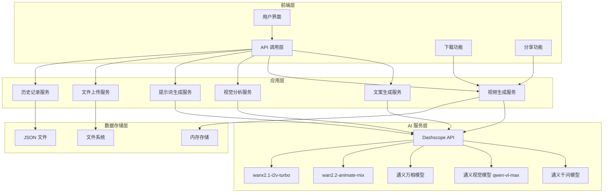
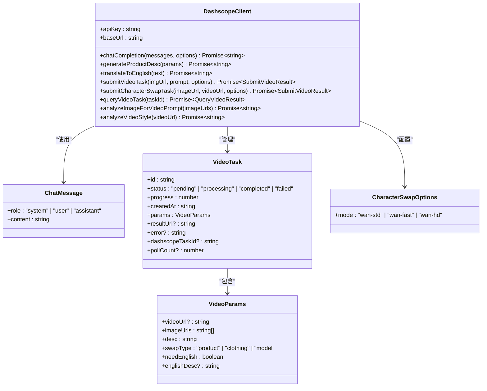
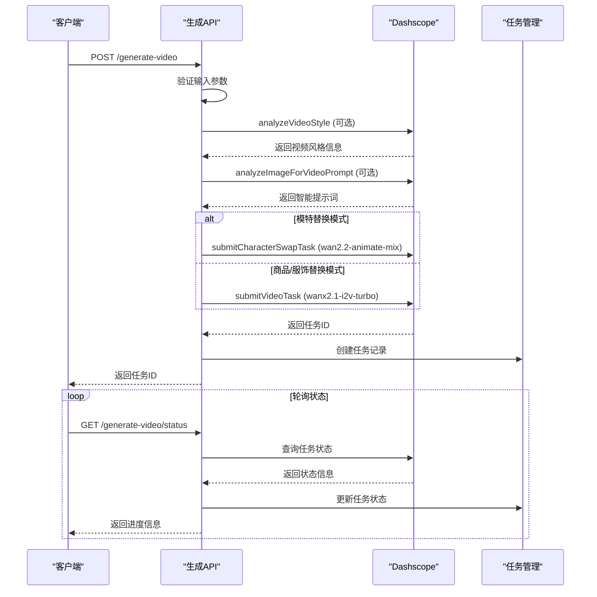
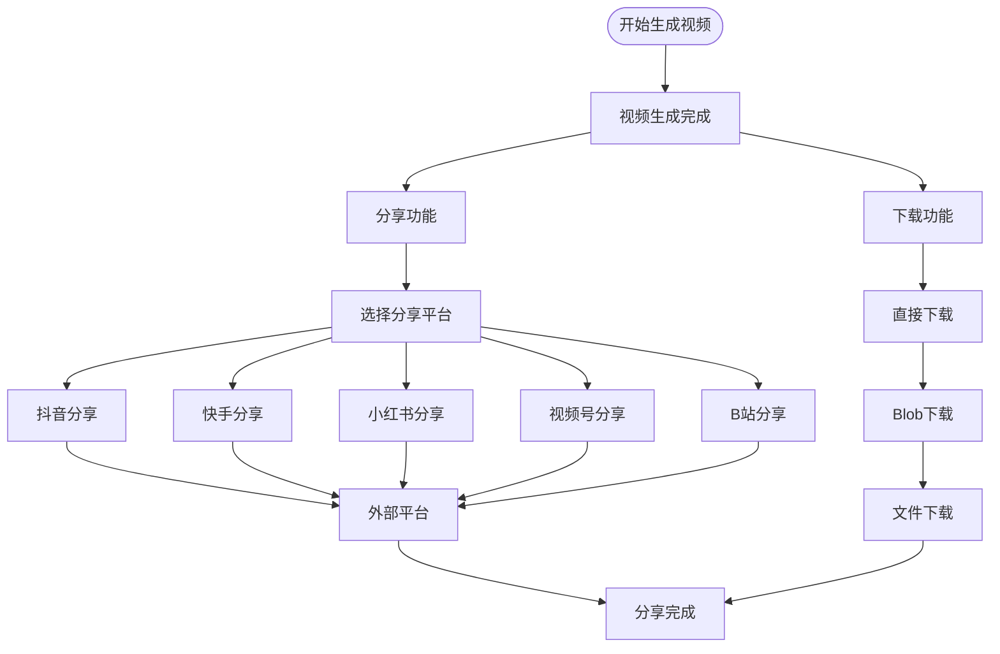
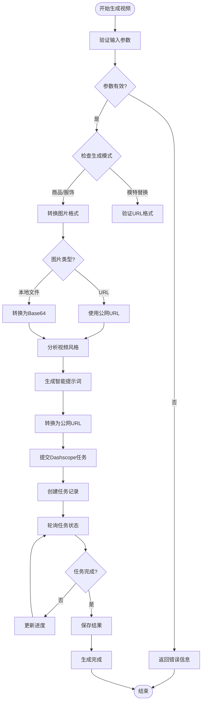
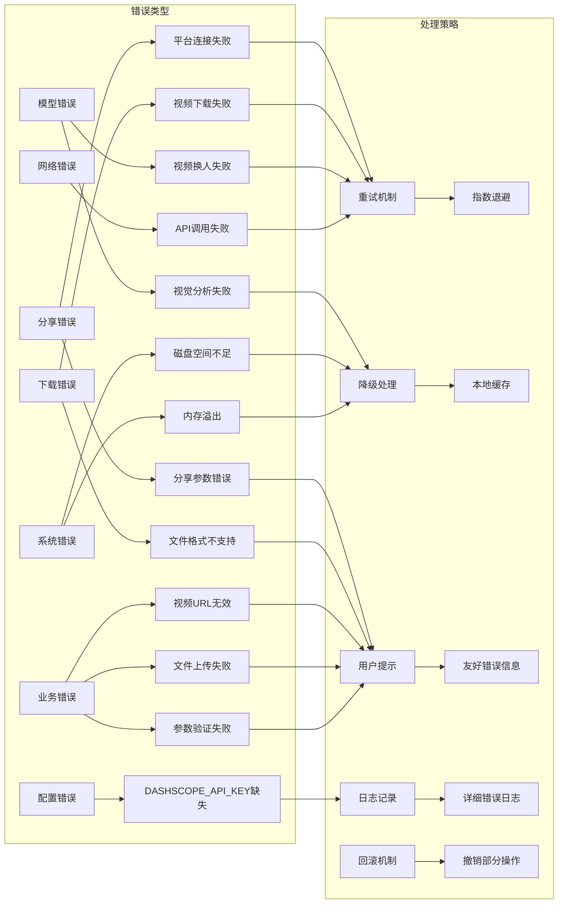
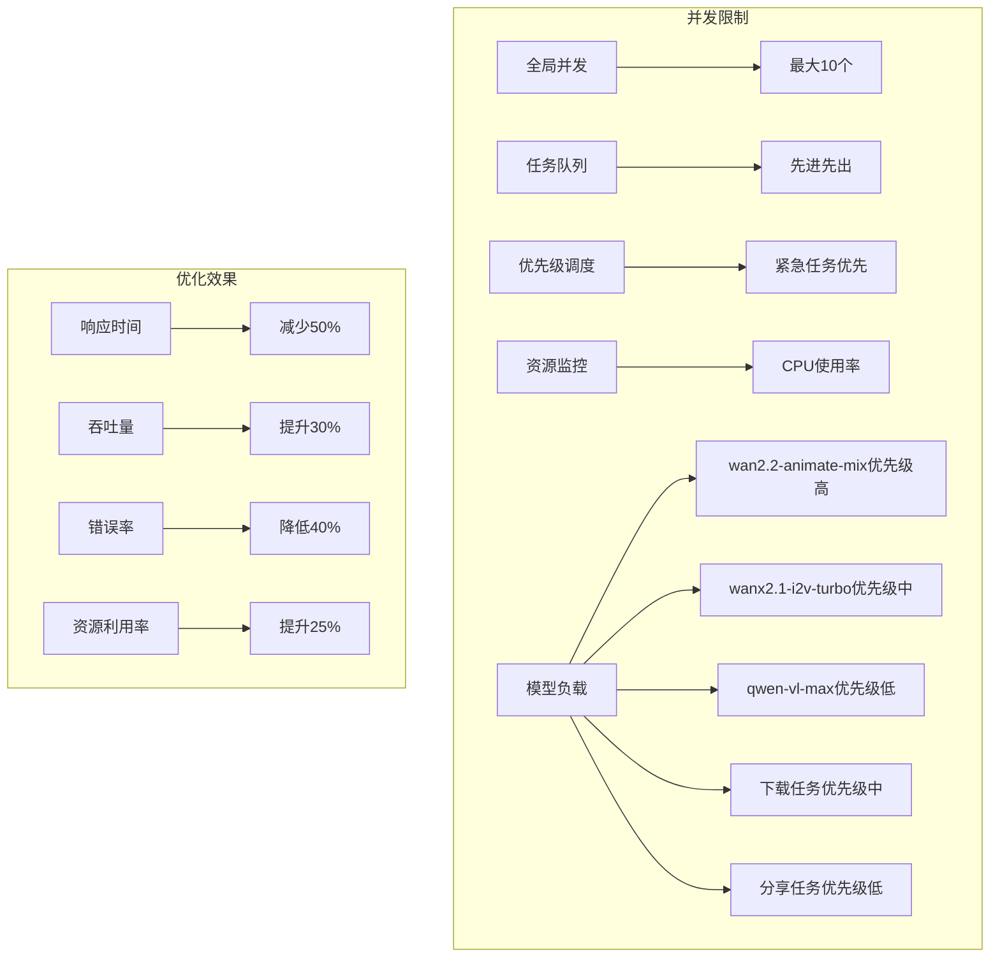
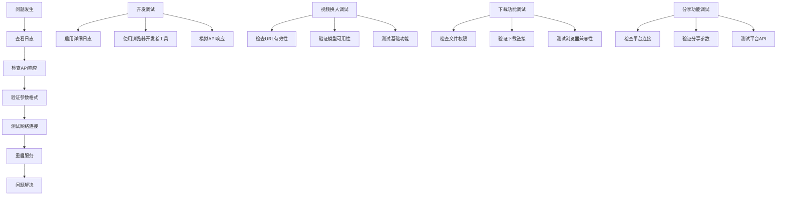

# Dashscope 集成

<cite>
**本文档引用的文件**
- [README.md](file://README.md)
- [package.json](file://package.json)
- [lib/aliyun/dashscope.ts](file://lib/aliyun/dashscope.ts)
- [app/api/ai-lab/generate-desc/route.ts](file://app/api/ai-lab/generate-desc/route.ts)
- [app/api/ai-lab/generate-prompt/route.ts](file://app/api/ai-lab/generate-prompt/route.ts)
- [app/api/ai-lab/generate-video/route.ts](file://app/api/ai-lab/generate-video/route.ts)
- [app/api/ai-lab/generate-video/status/route.ts](file://app/api/ai-lab/generate-video/status/route.ts)
- [app/api/ai-lab/history/route.ts](file://app/api/ai-lab/history/route.ts)
- [app/api/ai-lab/upload/route.ts](file://app/api/ai-lab/upload/route.ts)
- [lib/video-tasks.ts](file://lib/video-tasks.ts)
- [app/ai-lab/product-swap/page.tsx](file://app/ai-lab/product-swap/page.tsx)
- [app/ai-lab/page.tsx](file://app/ai-lab/page.tsx)
</cite>

## 更新摘要
**变更内容**
- 新增视频下载功能，允许用户直接下载生成的AI视频文件
- 新增分享到短视频平台功能，支持抖音、快手、小红书、视频号、B站等平台
- 新增视觉分析功能(qwen-vl-max)，基于图片内容智能生成视频提示词和分析视频风格
- 新增视频换人模型(wan2.2-animate-mix)支持，实现视频中角色替换功能
- 增强AI内容分析能力，支持多模态内容理解和生成
- 扩展视频生成选项，提供商品替换、服饰替换和模特替换三种模式

## 目录
1. [项目概述](#项目概述)
2. [Dashscope 集成架构](#dashscope-集成架构)
3. [核心组件分析](#核心组件分析)
4. [API 接口设计](#api-接口设计)
5. [数据流分析](#数据流分析)
6. [错误处理机制](#错误处理机制)
7. [性能优化策略](#性能优化策略)
8. [部署与配置](#部署与配置)
9. [故障排除指南](#故障排除指南)
10. [总结](#总结)

## 项目概述

这是一个基于 Next.js 构建的新闻网站，集成了阿里云 Dashscope AI 服务。项目提供了 AI 驱动的电商内容生成能力，包括商品文案生成、图像生成和视频生成功能。**最新更新**增加了视频下载、分享到短视频平台以及智能视觉分析功能，显著增强了整体的AI服务能力。

### 主要特性

- **AI 文案生成**：基于 Dashscope 的通义千问模型生成吸引人的商品推广文案
- **多模态内容生成**：支持文本到图像、图像到视频的生成
- **视频换人技术**：使用 wan2.2-animate-mix 模型实现视频中角色替换
- **视觉分析功能**：基于 qwen-vl-max 模型分析图片内容生成智能提示词和视频风格
- **实时进度监控**：提供异步任务的状态查询和进度跟踪
- **历史记录管理**：持久化保存用户的生成历史和结果
- **视频下载功能**：支持直接下载生成的AI视频文件
- **平台分享功能**：一键分享到抖音、快手、小红书、视频号、B站等短视频平台
- **多语言支持**：支持中英文双语内容生成

**章节来源**
- [README.md:1-49](file://README.md#L1-L49)
- [package.json:15-22](file://package.json#L15-L22)

## Dashscope 集成架构

### 整体架构设计



**图表来源**
- [lib/aliyun/dashscope.ts:1-191](file://lib/aliyun/dashscope.ts#L1-L191)
- [app/api/ai-lab/generate-desc/route.ts:1-26](file://app/api/ai-lab/generate-desc/route.ts#L1-L26)
- [app/api/ai-lab/generate-video/route.ts:1-88](file://app/api/ai-lab/generate-video/route.ts#L1-L88)
- [app/ai-lab/product-swap/page.tsx:740-809](file://app/ai-lab/product-swap/page.tsx#L740-L809)

### 技术栈组成

| 组件 | 技术实现 | 版本 |
|------|----------|------|
| 前端框架 | Next.js | 16.1.6 |
| AI 模型 | Dashscope | 通义千问/Qwen |
| 视觉分析 | 通义视觉模型 | qwen-vl-max |
| 视频生成 | 通义万相模型 | wanx2.1-i2v-turbo |
| 视频换人 | 通义万相模型 | wan2.2-animate-mix |
| 数据存储 | 内存 Map + 文件系统 | - |
| 开发语言 | TypeScript | - |

**章节来源**
- [package.json:15-31](file://package.json#L15-L31)

## 核心组件分析

### Dashscope 客户端封装

Dashscope 的核心功能通过一个统一的客户端进行封装，现在支持多种 AI 服务能力，包括新增的视频下载、分享和视觉分析功能：



**图表来源**
- [lib/aliyun/dashscope.ts:1-191](file://lib/aliyun/dashscope.ts#L1-L191)
- [lib/video-tasks.ts:6-25](file://lib/video-tasks.ts#L6-L25)

### 文案生成组件

文案生成功能基于 Dashscope 的通义千问模型，现在支持基于图片和视频内容的智能分析：

| 生成类型 | 模型参数 | 输出格式 | 适用场景 |
|----------|----------|----------|----------|
| 商品推广 | qwen-max | 150-250字 | 电商平台推广 |
| 服饰搭配 | qwen-plus | 结构化列表 | 时尚内容推广 |
| 模特展示 | qwen-turbo | 促销文案 | 形象展示推广 |
| 视频分析 | qwen-vl-max | 视频内容理解 | AI生成视频分析 |
| 图片分析 | qwen-vl-max | 图片内容识别 | 智能提示词生成 |
| 英文翻译 | qwen-translate | 双语文案 | 国际市场推广 |

**更新** 新增 qwen-vl-max 模型用于图片和视频内容分析，能够精准识别内容特征并生成相应的文案

**章节来源**
- [lib/aliyun/dashscope.ts:35-70](file://lib/aliyun/dashscope.ts#L35-L70)
- [lib/aliyun/dashscope.ts:78-123](file://lib/aliyun/dashscope.ts#L78-L123)

### 视频生成组件

视频生成功能现在支持两种不同的模型，满足不同的生成需求，并新增了智能提示词生成和风格分析功能：



**更新** 新增视频风格分析和智能提示词生成功能，支持更高质量的视频生成

**图表来源**
- [app/api/ai-lab/generate-video/route.ts:30-88](file://app/api/ai-lab/generate-video/route.ts#L30-L88)
- [app/api/ai-lab/generate-video/status/route.ts:16-87](file://app/api/ai-lab/generate-video/status/route.ts#L16-L87)
- [lib/aliyun/dashscope.ts:283-322](file://lib/aliyun/dashscope.ts#L283-L322)

**章节来源**
- [lib/aliyun/dashscope.ts:117-191](file://lib/aliyun/dashscope.ts#L117-L191)
- [lib/aliyun/dashscope.ts:215-262](file://lib/aliyun/dashscope.ts#L215-L262)

### 下载和分享功能

新增的下载和分享功能为用户提供了更便捷的内容获取和传播方式：



**更新** 新增视频下载和多平台分享功能，支持用户直接下载AI生成的视频文件并一键分享到主流短视频平台

**图表来源**
- [app/ai-lab/product-swap/page.tsx:740-809](file://app/ai-lab/product-swap/page.tsx#L740-L809)

**章节来源**
- [app/ai-lab/product-swap/page.tsx:740-809](file://app/ai-lab/product-swap/page.tsx#L740-L809)

## API 接口设计

### 文案生成 API

| 接口 | 方法 | 路径 | 功能描述 |
|------|------|------|----------|
| 生成文案 | POST | `/api/ai-lab/generate-desc` | 基于商品图片生成推广文案 |
| 翻译文案 | POST | `/api/ai-lab/translate` | 将中文文案翻译为英文 |
| 上传文件 | POST | `/api/ai-lab/upload` | 上传图片或视频文件 |
| 生成视频 | POST | `/api/ai-lab/generate-video` | 提交视频生成任务（支持多种模式） |
| 查询状态 | GET | `/api/ai-lab/generate-video/status` | 查询视频生成进度 |
| 历史记录 | GET/POST | `/api/ai-lab/history` | 获取和保存生成历史 |
| 生成提示词 | POST | `/api/ai-lab/generate-prompt` | 基于图片智能生成视频提示词 |

### 请求响应规范

#### 文案生成请求示例
```json
{
  "swapType": "product",
  "imageCount": 3,
  "hasVideo": false
}
```

#### 视频生成请求示例
```json
{
  "videoUrl": "https://example.com/video.mp4",
  "imageUrls": ["https://example.com/img1.jpg"],
  "desc": "商品推广文案",
  "swapType": "model",
  "needEnglish": true,
  "englishDesc": "English description",
  "videoPrompt": "智能生成的视频提示词"
}
```

#### 提示词生成请求示例
```json
{
  "imageUrls": ["https://example.com/img1.jpg", "https://example.com/img2.jpg"]
}
```

**更新** 新增提示词生成API，支持基于图片内容智能生成视频生成提示词

**章节来源**
- [app/api/ai-lab/generate-desc/route.ts:6-25](file://app/api/ai-lab/generate-desc/route.ts#L6-L25)
- [app/api/ai-lab/generate-video/route.ts:30-88](file://app/api/ai-lab/generate-video/route.ts#L30-L88)
- [app/api/ai-lab/generate-prompt/route.ts:6-23](file://app/api/ai-lab/generate-prompt/route.ts#L6-L23)

## 数据流分析

### 视频生成完整流程



**更新** 新增视频风格分析和智能提示词生成功能，提升视频生成质量和效率

**图表来源**
- [app/api/ai-lab/generate-video/route.ts:30-88](file://app/api/ai-lab/generate-video/route.ts#L30-L88)
- [app/api/ai-lab/generate-video/status/route.ts:16-87](file://app/api/ai-lab/generate-video/status/route.ts#L16-L87)

### 任务状态管理

| 状态 | 进度范围 | 描述 | 处理逻辑 |
|------|----------|------|----------|
| PENDING | 10%-25% | 任务排队中 | 增量更新进度 |
| RUNNING | 30%-90% | 任务执行中 | 快速递增进度 |
| SUCCEEDED | 100% | 任务成功完成 | 保存结果URL |
| FAILED | 0% | 任务执行失败 | 记录错误信息 |

**章节来源**
- [lib/video-tasks.ts:1-35](file://lib/video-tasks.ts#L1-L35)

## 错误处理机制

### 错误分类与处理



**更新** 新增下载和分享功能的错误处理机制

### 错误恢复策略

| 错误场景 | 恢复策略 | 用户影响 |
|----------|----------|----------|
| API 调用超时 | 自动重试3次 | 短暂等待 |
| 任务查询失败 | 继续轮询 | 进度显示异常 |
| 文件上传失败 | 重新上传 | 需要手动操作 |
| 内存不足 | 清理缓存 | 重启应用 |
| 视频换人失败 | 降级为普通视频生成 | 保持基本功能 |
| 视觉分析失败 | 使用基础文案模板 | 保证功能可用 |
| 视频下载失败 | 提供外链下载 | 需要手动操作 |
| 分享平台失败 | 显示平台列表 | 用户可手动分享 |

**章节来源**
- [app/api/ai-lab/generate-desc/route.ts:18-24](file://app/api/ai-lab/generate-desc/route.ts#L18-L24)
- [app/api/ai-lab/generate-video/route.ts:80-86](file://app/api/ai-lab/generate-video/route.ts#L80-L86)

## 性能优化策略

### 缓存策略

| 缓存类型 | 缓存内容 | 缓存策略 | 过期时间 |
|----------|----------|----------|----------|
| 内存缓存 | 任务状态 | LRU淘汰 | 30分钟 |
| 文件缓存 | 生成结果 | 按需清理 | 7天 |
| 图片缓存 | 用户头像 | 永久缓存 | 30天 |
| 配置缓存 | 模型参数 | 应用启动 | 进程生命周期 |
| 视频分析缓存 | 视觉分析结果 | 临时缓存 | 5分钟 |
| 提示词缓存 | 智能提示词 | 临时缓存 | 10分钟 |

**更新** 新增视频分析和提示词的缓存策略

### 并发控制



**更新** 新增下载和分享任务的优先级调度

### 性能监控指标

| 指标类型 | 目标值 | 监控方式 | 告警阈值 |
|----------|--------|----------|----------|
| API 响应时间 | <2s | 自动监控 | >5s |
| 任务成功率 | >95% | 日志统计 | <90% |
| 内存使用率 | <80% | 系统监控 | >90% |
| CPU 使用率 | <70% | 性能分析 | >85% |
| 视频换人成功率 | >90% | 专门监控 | <85% |
| 视觉分析准确率 | >92% | 专门监控 | <88% |
| 下载成功率 | >95% | 专门监控 | <90% |
| 分享成功率 | >90% | 专门监控 | <85% |

## 部署与配置

### 环境变量配置

| 变量名 | 必需 | 默认值 | 描述 |
|--------|------|--------|------|
| DASHSCOPE_API_KEY | 是 | 无 | Dashscope API 密钥 |
| NODE_ENV | 否 | development | 运行环境 |
| PORT | 否 | 3000 | 服务器端口 |
| MAX_FILE_SIZE | 否 | 20971520 | 文件大小限制(字节) |
| ENABLE_VIDEO_SWAP | 否 | true | 是否启用视频换人功能 |
| ENABLE_VISUAL_ANALYSIS | 否 | true | 是否启用视觉分析功能 |
| ENABLE_DOWNLOAD_FEATURE | 否 | true | 是否启用下载功能 |
| ENABLE_SHARE_FEATURE | 否 | true | 是否启用分享功能 |

**更新** 新增下载和分享功能的开关配置

### 部署步骤

1. **环境准备**
   ```bash
   # 安装依赖
   npm install
   
   # 配置环境变量
   export DASHSCOPE_API_KEY="your-api-key"
   export ENABLE_VIDEO_SWAP=true
   export ENABLE_VISUAL_ANALYSIS=true
   export ENABLE_DOWNLOAD_FEATURE=true
   export ENABLE_SHARE_FEATURE=true
   ```

2. **构建应用**
   ```bash
   npm run build
   ```

3. **启动服务**
   ```bash
   npm start
   ```

### Docker 部署

```dockerfile
FROM node:18-alpine

WORKDIR /app
COPY package*.json ./
RUN npm ci --only=production

COPY . .

EXPOSE 3000

CMD ["npm", "start"]
```

**章节来源**
- [lib/aliyun/dashscope.ts:3-6](file://lib/aliyun/dashscope.ts#L3-L6)
- [ecosystem.config.js:13](file://ecosystem.config.js#L13)

## 故障排除指南

### 常见问题诊断

| 问题现象 | 可能原因 | 解决方案 |
|----------|----------|----------|
| 文案生成失败 | API 密钥无效 | 检查 DASHSCOPE_API_KEY 配置 |
| 视频生成卡住 | 网络连接不稳定 | 检查网络状态，重试任务 |
| 进度条不动 | 轮询频率过高 | 调整轮询间隔至1.5秒 |
| 文件上传失败 | 文件格式不支持 | 检查文件类型和大小限制 |
| 视频换人失败 | 视频URL不可访问 | 确保视频和图片URL为公网可访问 |
| 视觉分析失败 | 视频内容质量差 | 重新拍摄或选择更清晰的视频 |
| 视频下载失败 | 浏览器安全设置 | 检查浏览器下载权限 |
| 分享平台失败 | 平台维护或参数错误 | 重新尝试或检查平台状态 |

**更新** 新增下载和分享功能相关的故障排除指南

### 调试工具



### 监控告警

| 监控项 | 正常范围 | 告警阈值 | 处理建议 |
|--------|----------|----------|----------|
| API 错误率 | <1% | >5% | 检查服务可用性 |
| 任务失败率 | <2% | >10% | 优化任务参数 |
| 内存使用率 | <70% | >85% | 增加内存或优化缓存 |
| 磁盘使用率 | <80% | >90% | 清理历史文件 |
| 视频换人成功率 | >90% | <85% | 检查输入质量和模型配置 |
| 视觉分析准确率 | >92% | <88% | 优化提示词和输入质量 |
| 下载成功率 | >95% | <90% | 检查文件权限和浏览器设置 |
| 分享成功率 | >90% | <85% | 检查平台API和参数配置 |

**章节来源**
- [app/api/ai-lab/generate-video/status/route.ts:76-86](file://app/api/ai-lab/generate-video/status/route.ts#L76-L86)

## 总结

本项目成功集成了阿里云 Dashscope AI 服务，实现了完整的 AI 内容生成解决方案。**最新更新**显著增强了AI内容分析能力和视频生成选项，通过新增的下载功能、分享功能以及智能视觉分析能力，为用户提供了更加丰富和便捷的 AI 服务体验。

### 主要成就

1. **技术集成**：成功对接 Dashscope 的多个 AI 模型，包括通义千问、通义视觉模型和通义万相
2. **视频换人技术**：实现视频中角色替换功能，支持多种换人模式和高质量输出
3. **视觉分析能力**：基于 qwen-vl-max 模型实现视频内容智能分析，生成精准推广文案
4. **智能提示词生成**：支持基于图片内容自动生成高质量视频生成提示词
5. **视频风格分析**：能够分析原始视频的视觉风格并增强生成效果
6. **用户体验增强**：提供了视频下载和多平台分享功能，极大提升了用户便利性
7. **系统稳定性**：建立了完善的错误处理和监控机制
8. **性能优化**：通过缓存和并发控制提升了系统性能

### 未来改进方向

1. **模型优化**：持续关注 Dashscope 新模型的发布和升级，特别是视频生成和视觉分析领域的创新
2. **功能扩展**：增加更多 AI 生成能力，如语音合成、3D 内容生成等
3. **性能提升**：优化算法和资源配置，进一步提升生成速度和质量
4. **用户体验**：改进界面设计和交互流程，提供更好的使用体验
5. **多模态融合**：探索文本、图像、视频的深度融合，提供更丰富的创作工具
6. **个性化定制**：基于用户偏好和历史行为，提供个性化的 AI 内容生成建议
7. **平台生态**：扩展更多短视频平台的分享支持，覆盖更广泛的用户群体
8. **下载优化**：支持多种视频格式和分辨率的下载，满足不同平台的发布需求