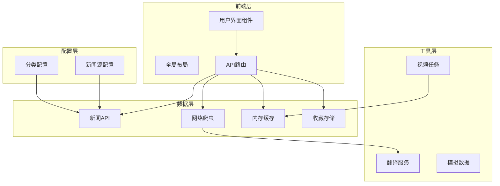
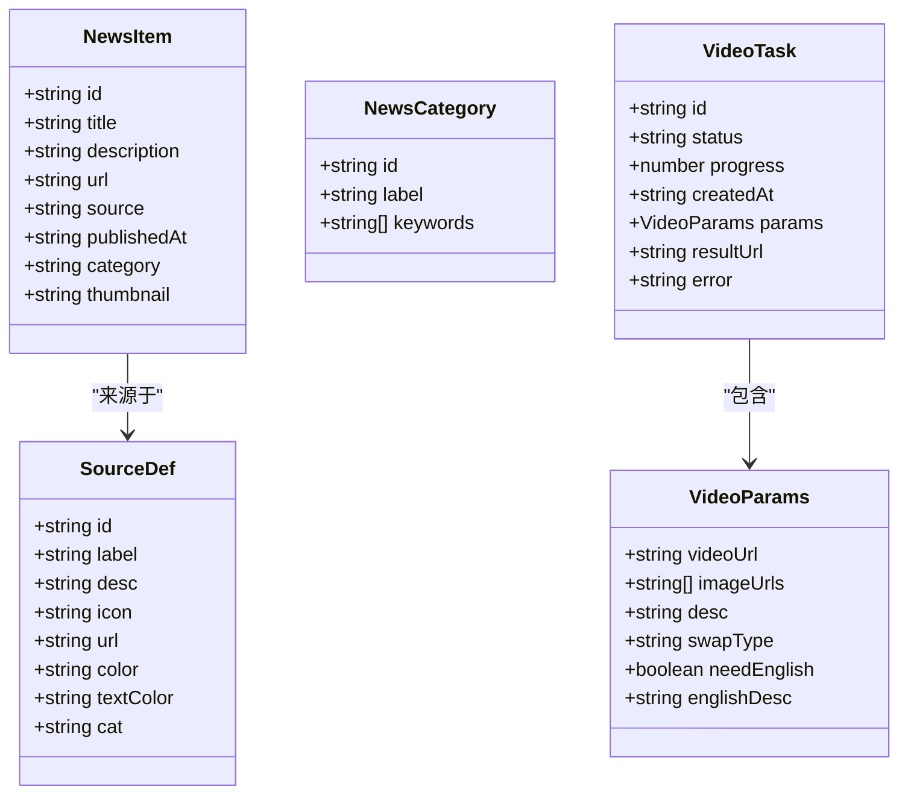
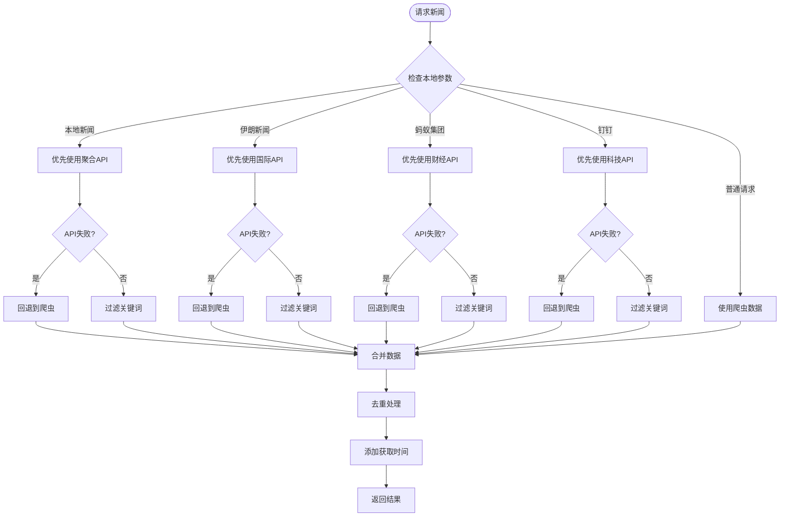
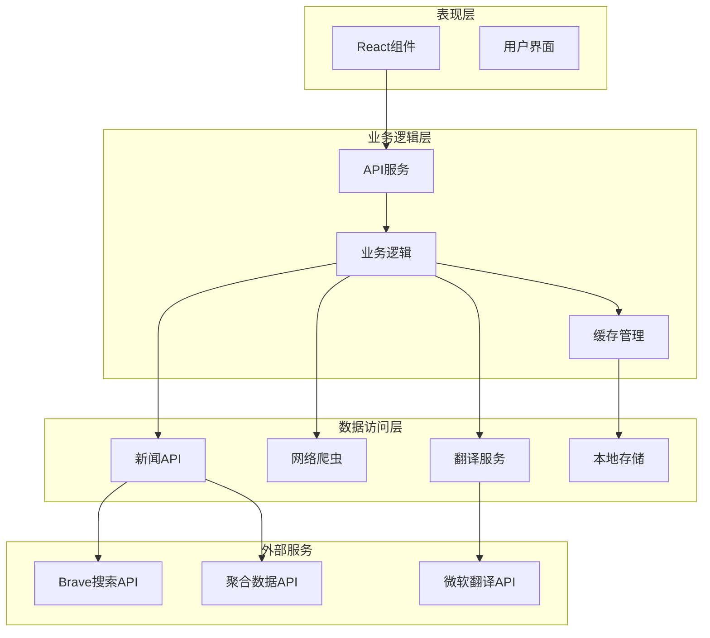
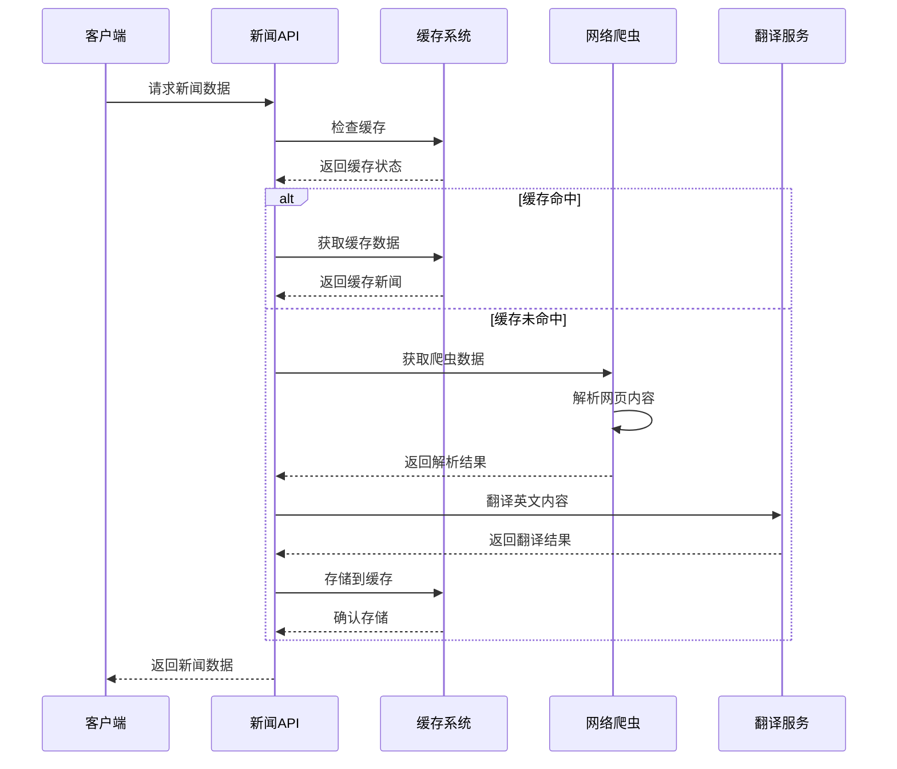
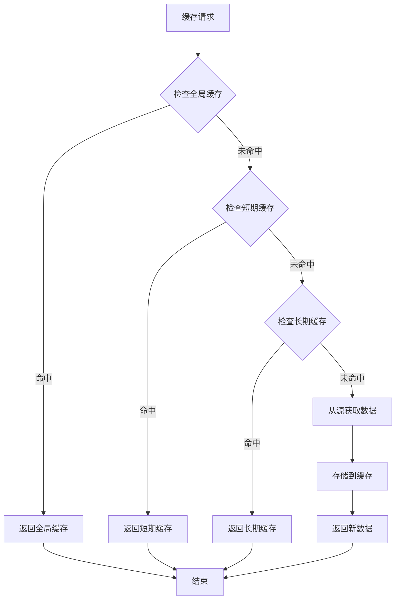
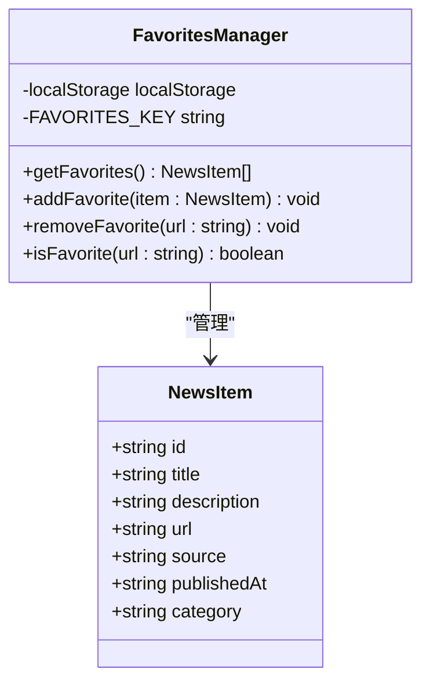
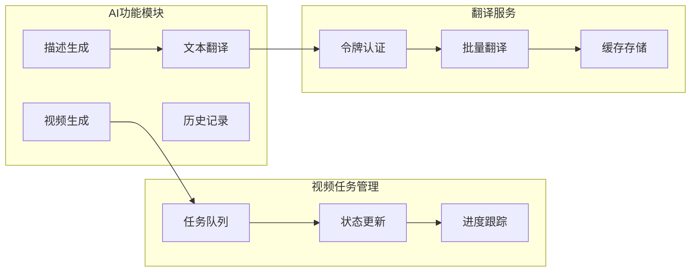
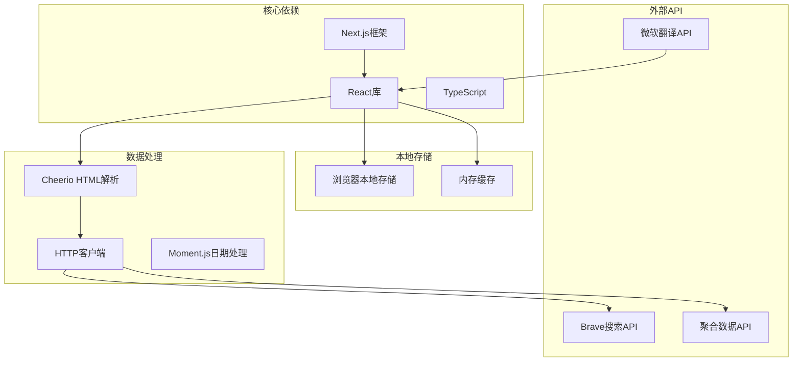
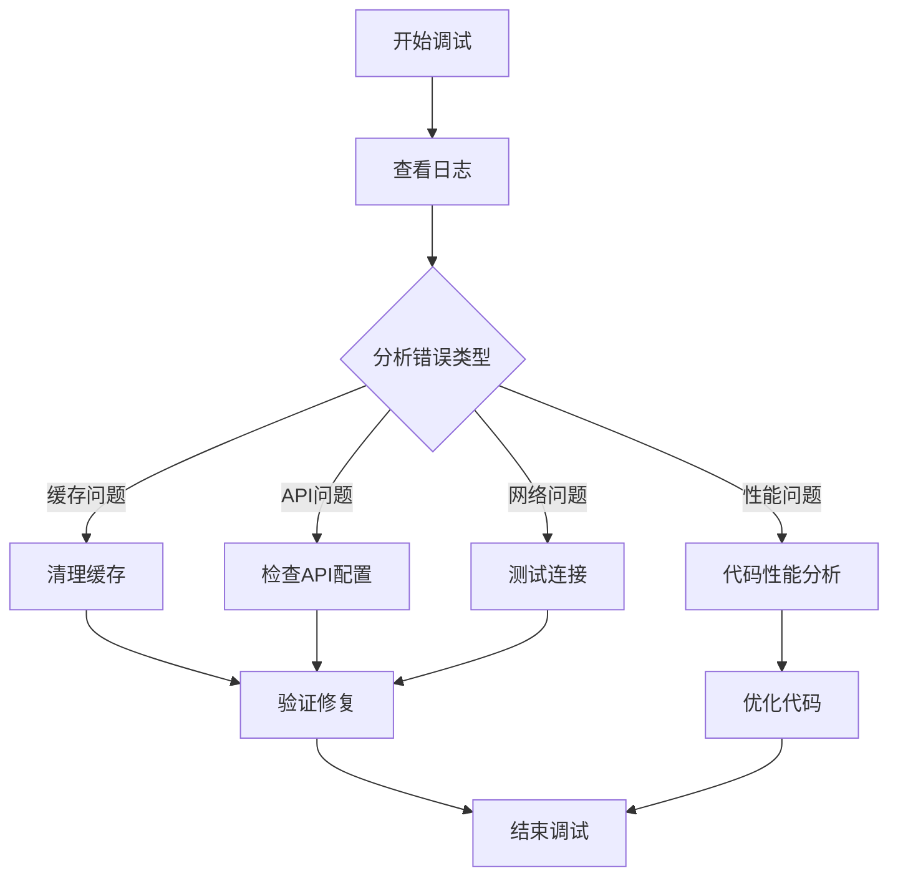

# 数据模型

<cite>
**本文档引用的文件**
- [README.md](file://README.md)
- [config/news-sources.json](file://config/news-sources.json)
- [lib/brave-search.ts](file://lib/brave-search.ts)
- [lib/news-categories.ts](file://lib/news-categories.ts)
- [lib/news-scraper.ts](file://lib/news-scraper.ts)
- [lib/mock-data.ts](file://lib/mock-data.ts)
- [lib/favorites.ts](file://lib/favorites.ts)
- [lib/translator.ts](file://lib/translator.ts)
- [lib/video-tasks.ts](file://lib/video-tasks.ts)
- [app/api/news/route.ts](file://app/api/news/route.ts)
- [app/api/news/sources/route.ts](file://app/api/news/sources/route.ts)
- [app/api/news/refresh/route.ts](file://app/api/news/refresh/route.ts)
</cite>

## 目录
1. [简介](#简介)
2. [项目结构](#项目结构)
3. [核心数据模型](#核心数据模型)
4. [架构概览](#架构概览)
5. [详细组件分析](#详细组件分析)
6. [依赖关系分析](#依赖关系分析)
7. [性能考量](#性能考量)
8. [故障排除指南](#故障排除指南)
9. [结论](#结论)

## 简介

这是一个基于Next.js开发的新闻聚合网站，集成了多种数据源和AI功能。项目采用现代化的前端架构，支持实时新闻聚合、分类浏览、搜索功能和收藏管理。

## 项目结构

项目采用模块化设计，主要分为以下几个核心部分：

**图表来源**
- [app/api/news/route.ts:1-256](file://app/api/news/route.ts#L1-L256)
- [lib/news-scraper.ts:1-971](file://lib/news-scraper.ts#L1-L971)
- [lib/brave-search.ts:1-115](file://lib/brave-search.ts#L1-L115)

**章节来源**
- [README.md:36-49](file://README.md#L36-L49)

## 核心数据模型

### 新闻项目模型

新闻项目是系统中最核心的数据结构，定义了新闻内容的完整信息：

**图表来源**
- [lib/brave-search.ts:1-115](file://lib/brave-search.ts#L1-L115)
- [lib/news-scraper.ts:383-415](file://lib/news-scraper.ts#L383-L415)
- [lib/news-categories.ts:1-45](file://lib/news-categories.ts#L1-L45)
- [lib/video-tasks.ts:6-21](file://lib/video-tasks.ts#L6-L21)

### 数据流模型

系统采用多源数据融合策略，通过以下流程处理新闻数据：

**图表来源**
- [app/api/news/route.ts:59-256](file://app/api/news/route.ts#L59-L256)

**章节来源**
- [lib/brave-search.ts:1-115](file://lib/brave-search.ts#L1-L115)
- [lib/news-scraper.ts:1-971](file://lib/news-scraper.ts#L1-L971)
- [lib/news-categories.ts:1-45](file://lib/news-categories.ts#L1-L45)

## 架构概览

系统采用分层架构设计，实现了数据获取、处理和展示的分离：

**图表来源**
- [app/api/news/route.ts:1-256](file://app/api/news/route.ts#L1-L256)
- [lib/news-scraper.ts:1-971](file://lib/news-scraper.ts#L1-L971)
- [lib/translator.ts:1-132](file://lib/translator.ts#L1-L132)

## 详细组件分析

### 新闻获取组件

新闻获取组件负责从多个数据源收集和处理新闻数据：

**图表来源**
- [app/api/news/route.ts:17-57](file://app/api/news/route.ts#L17-L57)
- [lib/news-scraper.ts:304-353](file://lib/news-scraper.ts#L304-L353)
- [lib/translator.ts:44-119](file://lib/translator.ts#L44-L119)

### 缓存管理系统

系统实现了多层次的缓存策略来优化性能：

**图表来源**
- [lib/news-scraper.ts:14-37](file://lib/news-scraper.ts#L14-L37)

**章节来源**
- [lib/news-scraper.ts:1-971](file://lib/news-scraper.ts#L1-L971)

### 收藏管理组件

收藏功能提供了本地存储机制，支持用户个性化新闻管理：

**图表来源**
- [lib/favorites.ts:1-29](file://lib/favorites.ts#L1-L29)

**章节来源**
- [lib/favorites.ts:1-29](file://lib/favorites.ts#L1-L29)

### AI功能组件

系统集成了多种AI功能，包括视频生成和翻译服务：

**图表来源**
- [lib/video-tasks.ts:1-31](file://lib/video-tasks.ts#L1-L31)
- [lib/translator.ts:1-132](file://lib/translator.ts#L1-L132)

**章节来源**
- [lib/video-tasks.ts:1-31](file://lib/video-tasks.ts#L1-L31)
- [lib/translator.ts:1-132](file://lib/translator.ts#L1-L132)

## 依赖关系分析

系统各组件之间的依赖关系如下：

**图表来源**
- [lib/news-scraper.ts:1-5](file://lib/news-scraper.ts#L1-L5)
- [lib/translator.ts:1-132](file://lib/translator.ts#L1-L132)

**章节来源**
- [lib/news-scraper.ts:1-971](file://lib/news-scraper.ts#L1-L971)
- [lib/translator.ts:1-132](file://lib/translator.ts#L1-L132)

## 性能考量

系统在设计时充分考虑了性能优化：

### 缓存策略
- **短期缓存**：2分钟有效期，适用于动态新闻（如钉钉、蚂蚁集团）
- **长期缓存**：5分钟有效期，适用于静态新闻内容
- **内存缓存**：基于Map的数据结构，提供快速访问

### 并发处理
- **批量翻译**：支持最多25条文本的批量翻译请求
- **并发爬取**：多个新闻源可以并行抓取
- **防抖处理**：避免重复请求相同的新闻内容

### 错误处理
- **优雅降级**：API失败时自动回退到爬虫方案
- **超时控制**：5秒超时限制，防止长时间阻塞
- **错误日志**：详细的错误追踪和日志记录

## 故障排除指南

### 常见问题及解决方案

| 问题类型 | 症状 | 可能原因 | 解决方案 |
|---------|------|----------|----------|
| 缓存问题 | 新闻不更新 | 缓存过期时间过长 | 使用刷新API清除缓存 |
| 翻译失败 | 英文内容未翻译 | 翻译API令牌过期 | 等待令牌自动刷新或重启服务 |
| 爬虫超时 | 新闻加载缓慢 | 网络连接问题 | 检查网络连接和代理设置 |
| API配额不足 | Brave API错误 | 请求次数超限 | 检查API密钥和配额使用情况 |

### 调试工具

系统提供了多种调试和监控工具：

**章节来源**
- [app/api/news/refresh/route.ts:1-49](file://app/api/news/refresh/route.ts#L1-L49)

## 结论

该新闻网站项目展现了现代Web应用的优秀实践，通过合理的数据模型设计、多层次的缓存策略和完善的错误处理机制，实现了高性能的新闻聚合服务。系统的核心优势包括：

1. **模块化设计**：清晰的组件分离和职责划分
2. **性能优化**：智能缓存和并发处理机制
3. **容错能力**：多重回退策略和错误恢复机制
4. **扩展性**：易于添加新的新闻源和功能模块

通过本文档的数据模型分析，开发者可以更好地理解和使用系统的数据结构，为后续的功能扩展和维护提供坚实的基础。