# Homepage Enhancements

<cite>
**本文档引用的文件**
- [app/page.tsx](file://app/page.tsx)
- [app/layout.tsx](file://app/layout.tsx)
- [components/NewsCard.tsx](file://components/NewsCard.tsx)
- [components/CategoryTabs.tsx](file://components/CategoryTabs.tsx)
- [components/SearchBar.tsx](file://components/SearchBar.tsx)
- [lib/news-categories.ts](file://lib/news-categories.ts)
- [lib/brave-search.ts](file://lib/brave-search.ts)
- [lib/news-scraper.ts](file://lib/news-scraper.ts)
- [lib/favorites.ts](file://lib/favorites.ts)
- [app/api/news/route.ts](file://app/api/news/route.ts)
- [app/api/news/sources/route.ts](file://app/api/news/sources/route.ts)
- [config/news-sources.json](file://config/news-sources.json)
- [package.json](file://package.json)
- [README.md](file://README.md)
</cite>

## 目录
1. [项目概述](#项目概述)
2. [主页架构设计](#主页架构设计)
3. [核心组件分析](#核心组件分析)
4. [数据流架构](#数据流架构)
5. [性能优化策略](#性能优化策略)
6. [用户体验增强](#用户体验增强)
7. [技术实现细节](#技术实现细节)
8. [部署与配置](#部署与配置)
9. [故障排除指南](#故障排除指南)
10. [总结](#总结)

## 项目概述

先雄的新闻网站是一个基于Next.js构建的现代化新闻聚合平台，专注于提供实时、多源的新闻内容。该项目采用React客户端组件模式，结合多种新闻源和API服务，为用户提供丰富的新闻浏览体验。

### 主要特性
- **多源新闻聚合**：整合国内外主流新闻源
- **实时更新机制**：每2分钟自动刷新新闻数据
- **智能分类系统**：支持综合热点、国际时政、财经商业、科技互联网四大分类
- **个性化收藏**：本地存储用户收藏的新闻
- **AI实验室集成**：提供AI相关功能模块

## 主页架构设计

### 整体布局结构

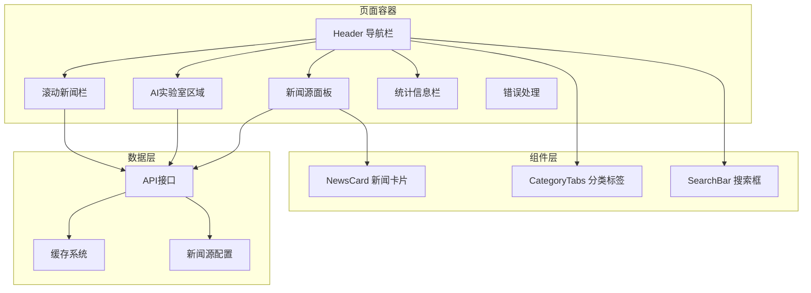

**图表来源**
- [app/page.tsx:194-800](file://app/page.tsx#L194-L800)

### 数据流架构

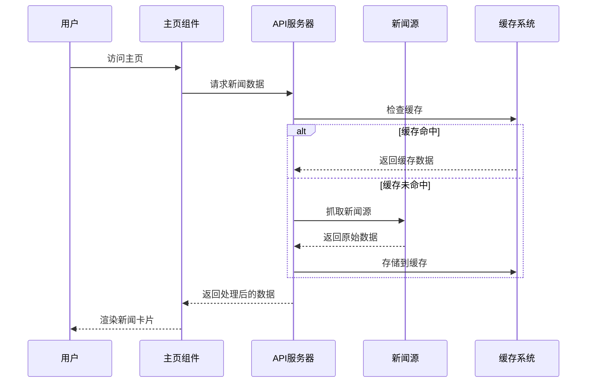

**图表来源**
- [app/page.tsx:41-163](file://app/page.tsx#L41-L163)
- [app/api/news/route.ts:59-255](file://app/api/news/route.ts#L59-L255)

## 核心组件分析

### 1. 主页容器组件

主页容器组件是整个页面的核心，负责管理全局状态和协调各个子组件的工作。

#### 状态管理结构

| 状态类型 | 状态名称 | 数据类型 | 用途 |
|---------|----------|----------|------|
| 新闻数据 | news | NewsItem[] | 主要新闻列表 |
| 加载状态 | loading | boolean | 主新闻加载指示 |
| 分类选择 | category | string | 当前选中的新闻分类 |
| 收藏功能 | favorites | NewsItem[] | 用户收藏的新闻 |
| 错误处理 | error | string \| null | 错误信息显示 |
| 多源新闻 | sources | SourceWithItems[] | 各新闻源的数据 |
| 特定新闻 | iranNews, dingNews, antNews, localNews | NewsItem[] | 特定主题新闻 |

#### 组件生命周期

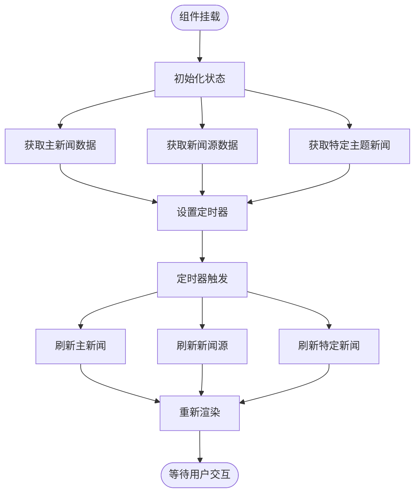

**图表来源**
- [app/page.tsx:62-163](file://app/page.tsx#L62-L163)

### 2. 新闻卡片组件

新闻卡片组件负责展示单条新闻的详细信息，提供完整的新闻浏览体验。

#### 卡片布局结构

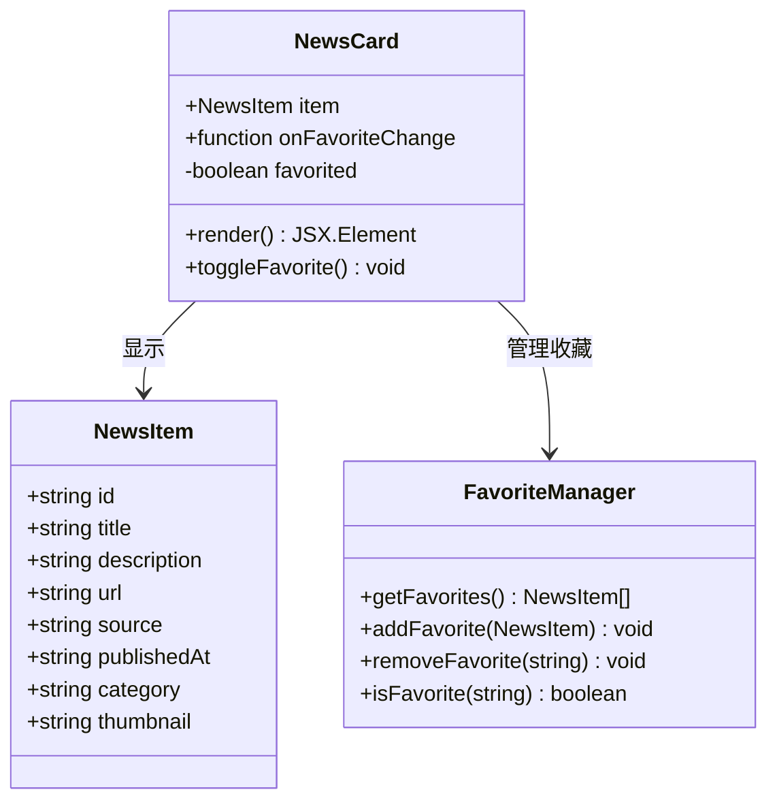

**图表来源**
- [components/NewsCard.tsx:12-97](file://components/NewsCard.tsx#L12-L97)
- [lib/brave-search.ts:1-115](file://lib/brave-search.ts#L1-L115)
- [lib/favorites.ts:7-29](file://lib/favorites.ts#L7-L29)

#### 卡片交互功能

| 功能 | 触发方式 | 实现逻辑 |
|------|----------|----------|
| 收藏切换 | 点击收藏按钮 | 检查收藏状态 -> 添加/移除收藏 -> 更新UI状态 |
| 新闻跳转 | 点击标题或链接 | 打开新窗口访问原文 |
| 鼠标悬停 | 鼠标悬停效果 | 改变颜色和阴影样式 |
| 响应式布局 | 屏幕尺寸变化 | 自适应网格布局 |

### 3. 分类标签组件

分类标签组件提供新闻分类导航功能，支持用户快速切换不同的新闻类别。

#### 分类配置结构

| 分类ID | 标签名称 | 关键词 | 用途 |
|--------|----------|--------|------|
| all | 综合热点 | today world news, global headlines | 全部新闻 |
| politics | 国际时政 | international politics today, world diplomacy | 时政新闻 |
| business | 财经商业 | global economy news today, financial markets | 商业财经 |
| tech | 科技互联网 | technology news today, AI news | 科技新闻 |

#### 交互行为

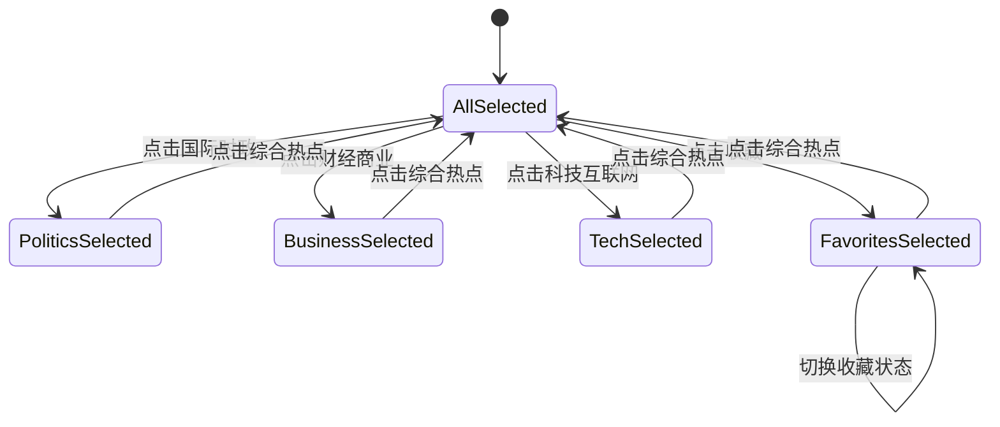

**图表来源**
- [components/CategoryTabs.tsx:12-50](file://components/CategoryTabs.tsx#L12-L50)
- [lib/news-categories.ts:7-45](file://lib/news-categories.ts#L7-L45)

### 4. 搜索栏组件

搜索栏组件提供关键词搜索功能，允许用户根据特定主题查找相关新闻。

#### 搜索流程

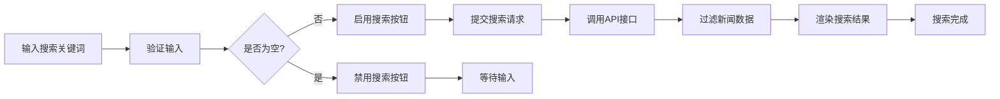

**图表来源**
- [components/SearchBar.tsx:9-41](file://components/SearchBar.tsx#L9-L41)

## 数据流架构

### 1. 新闻获取流程

系统通过多种渠道获取新闻数据，包括API接口、网页爬虫和第三方服务。

#### 数据源层次结构

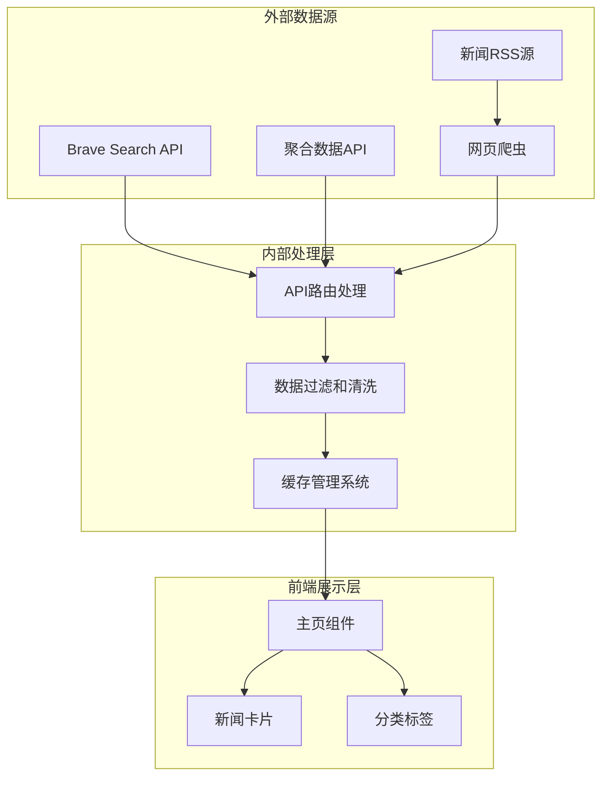

**图表来源**
- [app/api/news/route.ts:16-57](file://app/api/news/route.ts#L16-L57)
- [lib/news-scraper.ts:304-380](file://lib/news-scraper.ts#L304-L380)

### 2. 缓存策略

系统实现了多层次的缓存策略来提升性能和用户体验。

#### 缓存层次结构

| 缓存级别 | TTL时间 | 适用场景 | 清除条件 |
|----------|---------|----------|----------|
| 短期缓存 | 2分钟 | 动态新闻源 | 定时刷新 |
| 标准缓存 | 5分钟 | 静态新闻源 | 手动清除 |
| 永久缓存 | 30天 | 配置数据 | 系统重启 |

#### 缓存管理流程

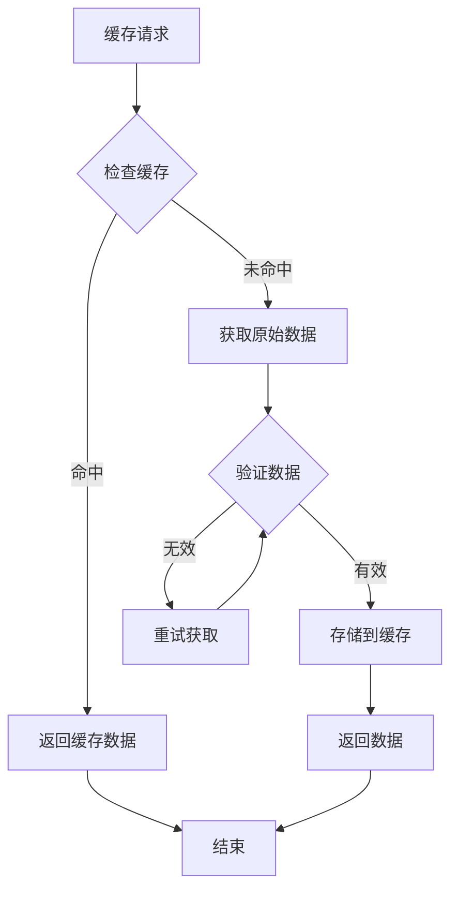

**图表来源**
- [lib/news-scraper.ts:14-37](file://lib/news-scraper.ts#L14-L37)

### 3. 错误处理机制

系统实现了完善的错误处理机制，确保在各种异常情况下都能提供良好的用户体验。

#### 错误处理流程

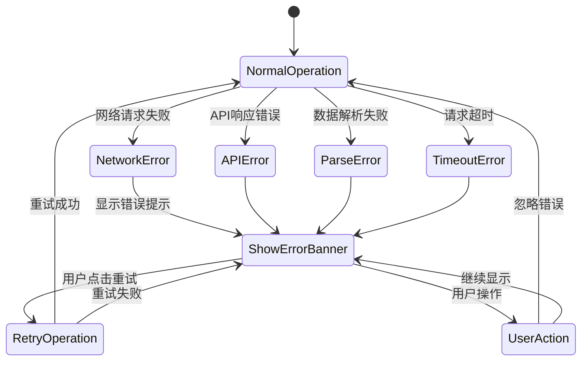

**图表来源**
- [app/page.tsx:41-60](file://app/page.tsx#L41-L60)
- [app/api/news/route.ts:248-255](file://app/api/news/route.ts#L248-L255)

## 性能优化策略

### 1. 并发数据获取

系统采用并发请求策略，同时获取多个数据源的数据，减少整体等待时间。

#### 并发执行策略

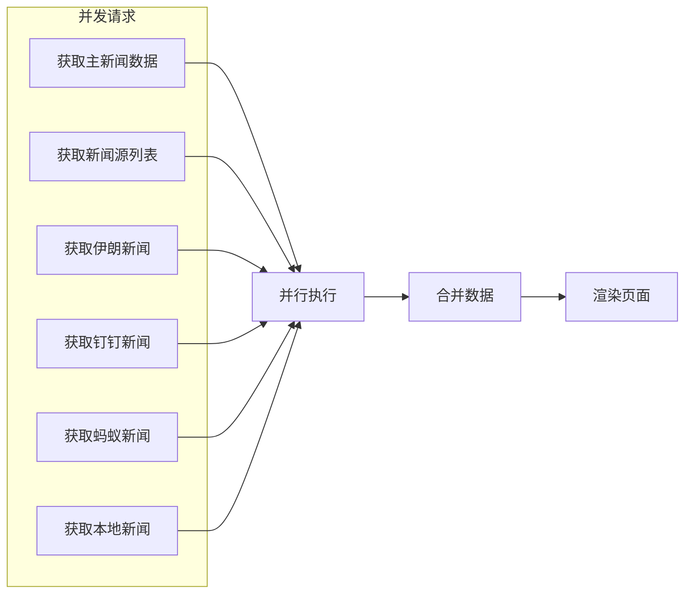

**图表来源**
- [app/page.tsx:67-163](file://app/page.tsx#L67-L163)

### 2. 懒加载和虚拟化

对于大量新闻数据，系统采用懒加载和虚拟化技术，只渲染可视区域内的内容。

#### 性能优化技术

| 优化技术 | 实现方式 | 性能收益 |
|----------|----------|----------|
| 懒加载 | 滚动到可视区域才渲染 | 减少初始渲染时间 |
| 虚拟化 | 只渲染可见新闻卡片 | 提升大数据集性能 |
| 防抖 | 搜索输入防抖处理 | 减少API调用频率 |
| 缓存 | 多级缓存策略 | 提升响应速度 |

### 3. 资源压缩和优化

系统对静态资源进行压缩和优化，减少带宽消耗。

#### 资源优化策略

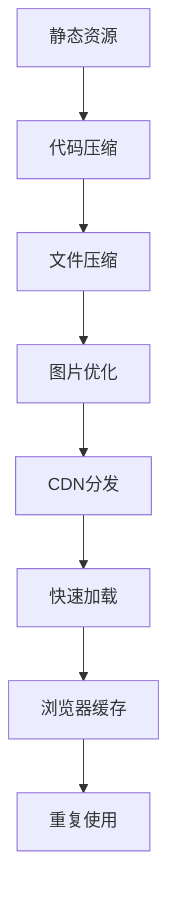

## 用户体验增强

### 1. 视觉设计

系统采用了现代化的设计语言，提供优秀的视觉体验。

#### 设计特色

| 设计元素 | 实现方式 | 用户价值 |
|----------|----------|----------|
| 渐变色彩 | 多彩渐变背景 | 视觉吸引力 |
| 阴影效果 | 层叠阴影设计 | 空间层次感 |
| 动画过渡 | 平滑动画效果 | 流畅体验 |
| 响应式布局 | 自适应设计 | 多设备兼容 |

### 2. 交互反馈

系统提供了丰富的交互反馈，让用户了解当前状态。

#### 交互反馈类型

| 反馈类型 | 触发条件 | 显示方式 |
|----------|----------|----------|
| 加载指示 | 数据请求中 | 旋转动画 |
| 成功状态 | 数据获取成功 | 绿色提示 |
| 错误提示 | 请求失败 | 红色警告 |
| 操作确认 | 用户操作 | 瞬时提示 |

### 3. 无障碍访问

系统考虑了无障碍访问需求，确保所有用户都能正常使用。

#### 无障碍特性

| 特性 | 实现方式 | 用户受益 |
|------|----------|----------|
| 键盘导航 | 支持Tab键导航 | 视障用户 |
| 屏幕阅读 | 语义化HTML结构 | 读屏软件 |
| 高对比度 | 支持深色模式 | 视力障碍 |
| 字体大小 | 可调整字体大小 | 不同需求 |

## 技术实现细节

### 1. API架构

系统采用RESTful API设计，提供清晰的接口规范。

#### API端点设计

| 端点 | 方法 | 参数 | 功能 |
|------|------|------|------|
| /api/news | GET | category, q, ding, ant, iran, local | 获取新闻数据 |
| /api/news/sources | GET | 无 | 获取新闻源列表 |
| /api/news/refresh | GET | 无 | 刷新新闻数据 |

#### 请求参数说明

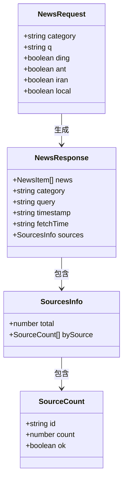

**图表来源**
- [app/api/news/route.ts:59-255](file://app/api/news/route.ts#L59-L255)

### 2. 数据模型

系统定义了标准化的数据模型，确保数据的一致性和完整性。

#### 新闻数据模型

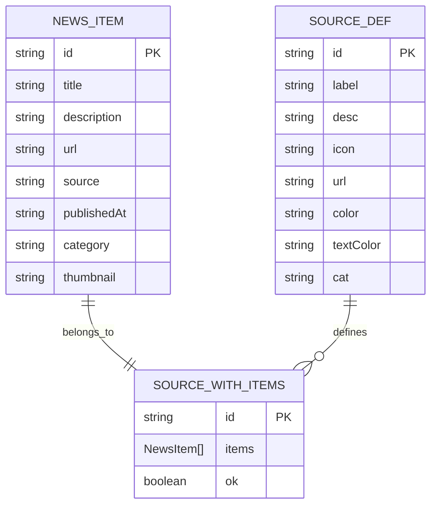

**图表来源**
- [lib/brave-search.ts:1-115](file://lib/brave-search.ts#L1-L115)
- [lib/news-scraper.ts:383-415](file://lib/news-scraper.ts#L383-L415)

### 3. 状态管理

系统采用React Hooks进行状态管理，提供简洁的状态控制机制。

#### 状态管理模式

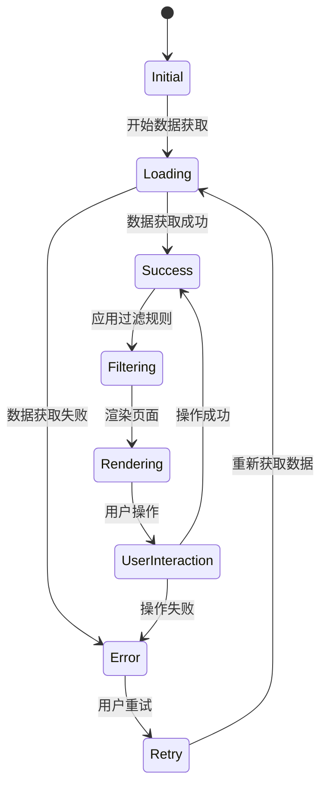

**图表来源**
- [app/page.tsx:18-60](file://app/page.tsx#L18-L60)

## 部署与配置

### 1. 环境配置

系统需要配置相应的环境变量才能正常运行。

#### 必需配置项

| 配置项 | 类型 | 必需 | 默认值 | 说明 |
|--------|------|------|--------|------|
| BRAVE_API_KEY | string | 是 | 无 | Brave Search API密钥 |
| NEXT_PUBLIC_APP_NAME | string | 否 | "Daily News" | 应用名称 |
| NEXT_PUBLIC_API_URL | string | 否 | "/" | API基础URL |

#### 配置文件示例

```json
{
  "BRAVE_API_KEY": "your_brave_api_key_here",
  "NEXT_PUBLIC_APP_NAME": "先雄新闻",
  "NEXT_PUBLIC_API_URL": "http://localhost:3000"
}
```

### 2. 依赖管理

系统使用npm进行包管理，依赖关系清晰明确。

#### 核心依赖

| 依赖包 | 版本 | 用途 |
|--------|------|------|
| next | ^16.1.6 | Web框架 |
| react | ^19.2.4 | UI库 |
| react-dom | ^19.2.4 | DOM渲染 |
| cheerio | ^1.2.0 | HTML解析 |
| tailwindcss | ^4.2.1 | CSS框架 |

### 3. 构建脚本

系统提供完整的构建和开发脚本。

#### NPM脚本

| 脚本 | 用途 | 命令 |
|------|------|------|
| dev | 开发模式 | next dev |
| build | 生产构建 | next build |
| start | 启动服务 | next start |
| lint | 代码检查 | next lint |

## 故障排除指南

### 1. 常见问题诊断

#### API密钥问题

**症状**：新闻无法获取，显示API错误
**原因**：BRAVE_API_KEY未正确配置
**解决方案**：
1. 检查.env.local文件中的API密钥
2. 确认API密钥格式正确
3. 验证API配额是否充足

#### 网络连接问题

**症状**：页面加载缓慢或超时
**原因**：网络不稳定或API服务不可用
**解决方案**：
1. 检查网络连接状态
2. 验证API服务可用性
3. 调整请求超时时间

#### 缓存问题

**症状**：显示过期新闻或数据不更新
**原因**：缓存未正确清除
**解决方案**：
1. 手动清除浏览器缓存
2. 调整缓存TTL设置
3. 实施缓存失效策略

### 2. 性能监控

系统提供了性能监控和调试工具。

#### 性能指标

| 指标 | 目标值 | 监控方法 |
|------|--------|----------|
| 首屏加载时间 | <3秒 | Lighthouse分析 |
| TTFB | <200ms | 浏览器开发者工具 |
| FCP | <2.5秒 | Web Vitals |
| LCP | <4秒 | Web Vitals |

### 3. 日志记录

系统记录详细的日志信息，便于问题排查。

#### 日志级别

| 级别 | 用途 | 示例 |
|------|------|------|
| Info | 正常操作 | 数据获取成功 |
| Warn | 警告信息 | 缓存未命中 |
| Error | 错误信息 | API调用失败 |
| Debug | 调试信息 | 详细请求参数 |

## 总结

先雄的新闻网站通过精心设计的架构和丰富的功能特性，为用户提供了优质的新闻浏览体验。系统的主要优势包括：

### 核心优势

1. **多源聚合**：整合国内外主流新闻源，提供全面的信息覆盖
2. **实时更新**：每2分钟自动刷新，确保新闻时效性
3. **智能分类**：四大分类体系，满足不同用户需求
4. **个性化体验**：收藏功能和搜索能力，提升用户体验
5. **性能优化**：多级缓存和并发处理，保证流畅体验

### 技术亮点

1. **现代化架构**：基于Next.js和React的全栈架构
2. **响应式设计**：适配多设备的现代化界面
3. **可扩展性**：模块化的组件设计，易于功能扩展
4. **可靠性**：完善的错误处理和缓存机制

### 发展方向

未来可以考虑的功能增强：
1. **AI推荐算法**：基于用户偏好的个性化推荐
2. **多语言支持**：国际化功能扩展
3. **离线缓存**：支持离线阅读功能
4. **社交分享**：集成社交媒体分享功能

该系统为新闻聚合领域提供了一个优秀的参考实现，具有良好的可维护性和扩展性。