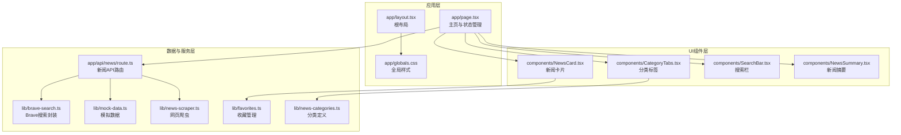
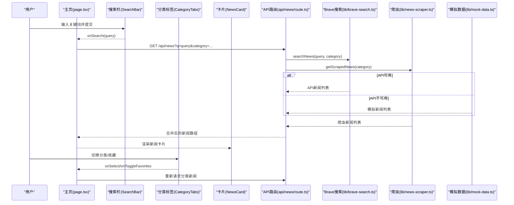
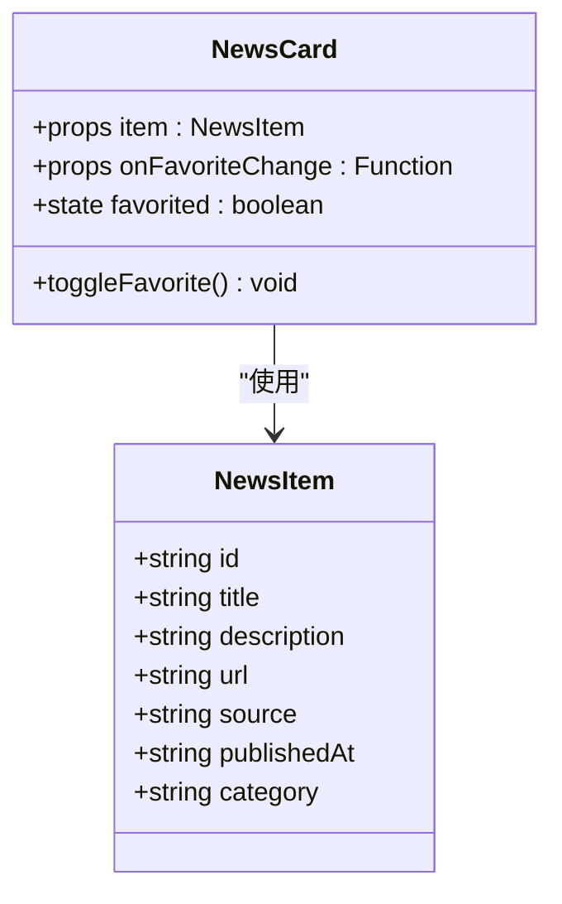
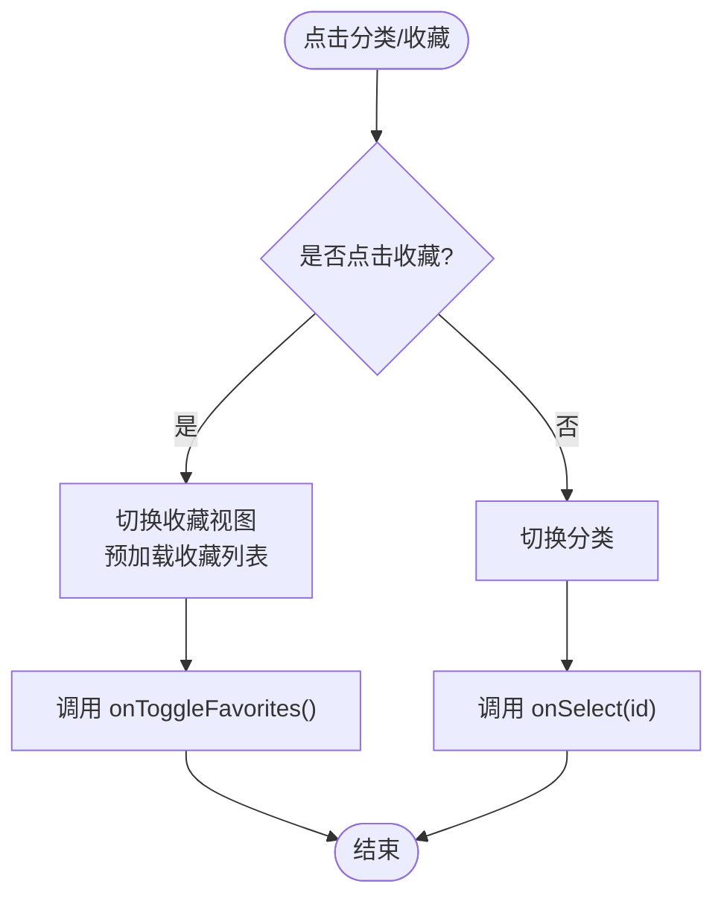
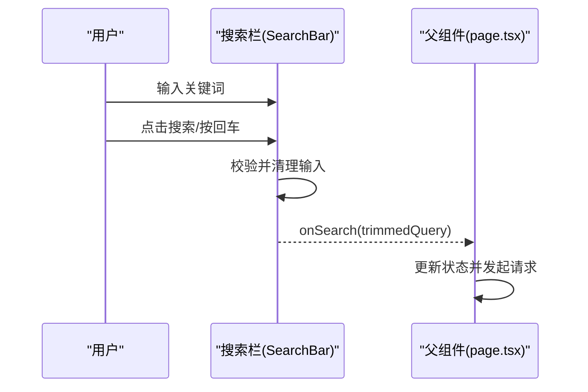
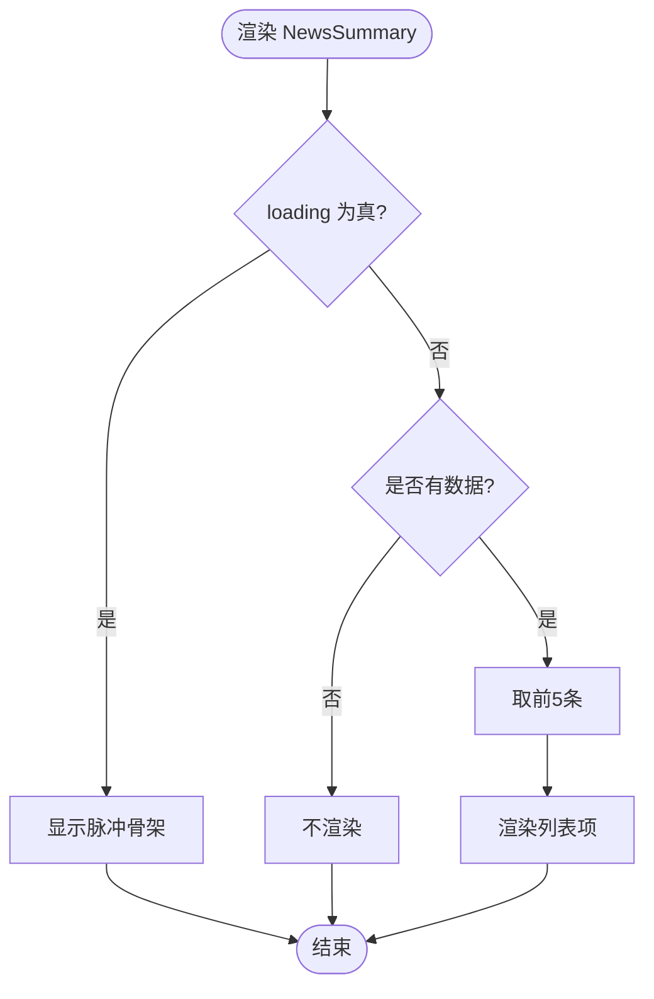
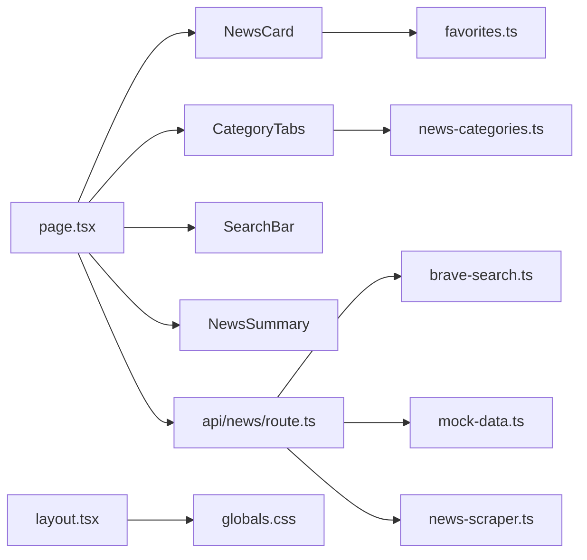

# UI组件系统

<cite>
**本文引用的文件**
- [app/page.tsx](file://app/page.tsx)
- [components/NewsCard.tsx](file://components/NewsCard.tsx)
- [components/CategoryTabs.tsx](file://components/CategoryTabs.tsx)
- [components/SearchBar.tsx](file://components/SearchBar.tsx)
- [components/NewsSummary.tsx](file://components/NewsSummary.tsx)
- [lib/brave-search.ts](file://lib/brave-search.ts)
- [lib/favorites.ts](file://lib/favorites.ts)
- [lib/news-categories.ts](file://lib/news-categories.ts)
- [lib/mock-data.ts](file://lib/mock-data.ts)
- [lib/news-scraper.ts](file://lib/news-scraper.ts)
- [app/api/news/route.ts](file://app/api/news/route.ts)
- [app/layout.tsx](file://app/layout.tsx)
- [app/globals.css](file://app/globals.css)
- [package.json](file://package.json)
- [next.config.mjs](file://next.config.mjs)
</cite>

## 目录
1. [简介](#简介)
2. [项目结构](#项目结构)
3. [核心组件](#核心组件)
4. [架构总览](#架构总览)
5. [组件详细分析](#组件详细分析)
6. [依赖关系分析](#依赖关系分析)
7. [性能考量](#性能考量)
8. [故障排查指南](#故障排查指南)
9. [结论](#结论)
10. [附录](#附录)

## 简介
本文件系统化梳理该新闻网站的UI组件体系，围绕新闻卡片、分类标签、搜索栏、新闻摘要等核心UI元素，阐述其视觉外观、行为模式、交互设计、属性与事件、样式定制与主题支持、响应式设计原则、无障碍访问合规建议以及跨浏览器兼容性要点。文档同时给出组件组合模式与与其它UI元素的集成方法，帮助开发者快速理解与扩展。

## 项目结构
该工程采用Next.js应用结构，UI组件集中在components目录，业务逻辑与数据源位于lib目录，页面级状态管理与布局在app目录。整体采用客户端组件与服务端API结合的方式，通过API路由聚合Brave搜索、本地模拟数据与网页爬虫结果，再由页面组件渲染展示。

图表来源
- [app/page.tsx](file://app/page.tsx#L1-L153)
- [components/NewsCard.tsx](file://components/NewsCard.tsx#L1-L89)
- [components/CategoryTabs.tsx](file://components/CategoryTabs.tsx#L1-L49)
- [components/SearchBar.tsx](file://components/SearchBar.tsx#L1-L37)
- [components/NewsSummary.tsx](file://components/NewsSummary.tsx#L1-L54)
- [app/api/news/route.ts](file://app/api/news/route.ts#L1-L136)
- [lib/brave-search.ts](file://lib/brave-search.ts#L1-L115)
- [lib/mock-data.ts](file://lib/mock-data.ts#L1-L197)
- [lib/news-scraper.ts](file://lib/news-scraper.ts#L1-L166)
- [lib/favorites.ts](file://lib/favorites.ts#L1-L29)
- [lib/news-categories.ts](file://lib/news-categories.ts#L1-L45)
- [app/layout.tsx](file://app/layout.tsx#L1-L20)
- [app/globals.css](file://app/globals.css#L1-L22)

章节来源
- [app/page.tsx](file://app/page.tsx#L1-L153)
- [app/layout.tsx](file://app/layout.tsx#L1-L20)
- [app/globals.css](file://app/globals.css#L1-L22)

## 核心组件
- 新闻卡片组件：用于展示单条新闻的标题、摘要、来源、发布时间与收藏按钮，支持收藏切换与“阅读原文”跳转。
- 分类标签组件：提供分类选择与“我的收藏”切换，支持激活态样式与暗色主题适配。
- 搜索栏组件：提供关键词搜索输入与提交，触发查询更新新闻列表。
- 新闻摘要组件：展示当日Top条目摘要，支持加载态骨架屏与暗色主题。

章节来源
- [components/NewsCard.tsx](file://components/NewsCard.tsx#L1-L89)
- [components/CategoryTabs.tsx](file://components/CategoryTabs.tsx#L1-L49)
- [components/SearchBar.tsx](file://components/SearchBar.tsx#L1-L37)
- [components/NewsSummary.tsx](file://components/NewsSummary.tsx#L1-L54)

## 架构总览
页面组件负责状态管理与数据拉取，API路由统一聚合数据源，组件层完成UI渲染与交互。收藏状态通过本地存储持久化，分类与关键词由分类表驱动。

图表来源
- [app/page.tsx](file://app/page.tsx#L19-L63)
- [components/SearchBar.tsx](file://components/SearchBar.tsx#L9-L36)
- [components/CategoryTabs.tsx](file://components/CategoryTabs.tsx#L12-L48)
- [app/api/news/route.ts](file://app/api/news/route.ts#L39-L134)
- [lib/brave-search.ts](file://lib/brave-search.ts#L30-L73)
- [lib/news-scraper.ts](file://lib/news-scraper.ts#L140-L153)
- [lib/mock-data.ts](file://lib/mock-data.ts#L194-L196)

## 组件详细分析

### 新闻卡片组件（NewsCard）
- 视觉外观
  - 卡片容器圆角边框，悬停阴影增强交互反馈；浅色与深色主题分别对应浅灰背景与深灰背景。
  - 收藏按钮定位在右上角，根据收藏状态切换实心/空心星形图标与颜色。
  - 标题为可点击链接，支持在新窗口打开并设置反爬链接属性；描述文本限制行数以保持版面整洁。
- 行为模式
  - 初始化时根据URL判断是否已收藏，异步切换收藏状态并回调父组件刷新收藏列表。
  - “阅读原文”链接在新窗口打开，防止外部站点通过window.opener访问当前页面。
- 用户交互
  - 点击收藏按钮切换收藏状态；点击标题或“阅读原文”进入详情页。
- 属性与事件
  - 属性：item（新闻对象）、onFavoriteChange（收藏变更回调）。
  - 事件：收藏按钮点击事件。
- 样式定制与主题支持
  - 使用Tailwind类名实现明暗主题切换；颜色变量与过渡动画保证一致的视觉体验。
- 响应式设计
  - 容器采用flex布局，标题与描述自适应不同屏幕宽度；按钮与文字大小在小屏设备上保持可读性。
- 无障碍访问
  - 标题为语义化h3；收藏按钮提供title提示；链接使用rel noopener noreferrer提升安全性。
- 跨浏览器兼容性
  - 使用标准HTML与CSS特性，配合Next.js构建工具链确保兼容性。

图表来源
- [components/NewsCard.tsx](file://components/NewsCard.tsx#L7-L27)
- [lib/brave-search.ts](file://lib/brave-search.ts#L1-L10)

章节来源
- [components/NewsCard.tsx](file://components/NewsCard.tsx#L1-L89)
- [lib/brave-search.ts](file://lib/brave-search.ts#L1-L115)
- [lib/favorites.ts](file://lib/favorites.ts#L1-L29)

### 分类标签组件（CategoryTabs）
- 视觉外观
  - 水平滚动的标签容器，每个标签为圆角胶囊样式；激活态使用强调色背景与白色文字。
  - “我的收藏”标签在收藏模式下高亮显示，使用琥珀色强调。
- 行为模式
  - 点击任一分类触发父组件的分类切换；点击“我的收藏”切换收藏视图并预加载收藏列表。
- 用户交互
  - 点击分类标签或收藏按钮；支持触摸滑动浏览横向溢出内容。
- 属性与事件
  - 属性：active（当前激活分类）、showFavorites（是否显示收藏）、onSelect、onToggleFavorites。
  - 事件：按钮点击事件。
- 样式定制与主题支持
  - 明暗主题下标签颜色与悬停效果一致；滚动条在支持的浏览器中隐藏以提升观感。
- 响应式设计
  - 标签在小屏设备上可横向滚动，避免布局塌陷。
- 无障碍访问
  - 使用button元素承载交互，便于键盘导航与屏幕阅读器识别。
- 跨浏览器兼容性
  - 使用标准CSS与Flex布局，确保主流浏览器一致表现。

图表来源
- [components/CategoryTabs.tsx](file://components/CategoryTabs.tsx#L12-L48)
- [lib/news-categories.ts](file://lib/news-categories.ts#L1-L45)
- [lib/favorites.ts](file://lib/favorites.ts#L1-L29)

章节来源
- [components/CategoryTabs.tsx](file://components/CategoryTabs.tsx#L1-L49)
- [lib/news-categories.ts](file://lib/news-categories.ts#L1-L45)
- [lib/favorites.ts](file://lib/favorites.ts#L1-L29)

### 搜索栏组件（SearchBar）
- 视觉外观
  - 输入框与按钮在同一行，输入框获得焦点时强调边框颜色；按钮使用品牌色背景。
- 行为模式
  - 提交表单时校验输入，去除空白后触发父组件的搜索回调。
- 用户交互
  - 输入关键词并点击搜索按钮；支持回车提交。
- 属性与事件
  - 属性：onSearch（搜索回调）。
  - 事件：表单提交事件。
- 样式定制与主题支持
  - 输入框与占位符在暗色主题下有相应对比度；过渡动画提升交互反馈。
- 响应式设计
  - 在小屏设备上输入框与按钮垂直堆叠，保证移动端可用性。
- 无障碍访问
  - 使用原生表单控件，具备默认的可访问性语义。
- 跨浏览器兼容性
  - 使用标准表单与输入类型，确保广泛兼容。

图表来源
- [components/SearchBar.tsx](file://components/SearchBar.tsx#L9-L36)
- [app/page.tsx](file://app/page.tsx#L49-L52)

章节来源
- [components/SearchBar.tsx](file://components/SearchBar.tsx#L1-L37)
- [app/page.tsx](file://app/page.tsx#L49-L52)

### 新闻摘要组件（NewsSummary）
- 视觉外观
  - 摘要容器带蓝色系背景与边框，标题使用强调色；列表项包含序号与可点击标题。
- 行为模式
  - 加载态显示脉冲动画骨架；无数据时不渲染；仅展示前五条头条。
- 用户交互
  - 点击标题在新窗口打开原文链接。
- 属性与事件
  - 属性：news（新闻数组）、loading（加载状态）。
  - 事件：无。
- 样式定制与主题支持
  - 暗色主题下使用深蓝背景与浅色文字，保持对比度。
- 响应式设计
  - 列表项在窄屏设备上仍保持可读性。
- 无障碍访问
  - 使用语义化标题与链接，支持键盘导航。
- 跨浏览器兼容性
  - 使用标准HTML与CSS，确保兼容性。

图表来源
- [components/NewsSummary.tsx](file://components/NewsSummary.tsx#L10-L53)

章节来源
- [components/NewsSummary.tsx](file://components/NewsSummary.tsx#L1-L54)

## 依赖关系分析
- 页面组件依赖UI组件与API路由；UI组件之间松耦合，通过props与回调通信。
- API路由聚合Brave搜索、模拟数据与网页爬虫，统一去重与合并策略。
- 收藏管理与分类定义为独立模块，被卡片与分类标签组件消费。
- 全局样式与布局提供基础主题与字体设置。

图表来源
- [app/page.tsx](file://app/page.tsx#L1-L153)
- [app/api/news/route.ts](file://app/api/news/route.ts#L1-L136)
- [lib/brave-search.ts](file://lib/brave-search.ts#L1-L115)
- [lib/mock-data.ts](file://lib/mock-data.ts#L1-L197)
- [lib/news-scraper.ts](file://lib/news-scraper.ts#L1-L166)
- [lib/favorites.ts](file://lib/favorites.ts#L1-L29)
- [lib/news-categories.ts](file://lib/news-categories.ts#L1-L45)
- [app/layout.tsx](file://app/layout.tsx#L1-L20)
- [app/globals.css](file://app/globals.css#L1-L22)

章节来源
- [app/page.tsx](file://app/page.tsx#L1-L153)
- [app/api/news/route.ts](file://app/api/news/route.ts#L1-L136)

## 性能考量
- 并发数据获取：API路由同时发起Brave搜索与网页爬虫请求，减少总等待时间。
- 前端骨架屏：新闻网格与摘要组件在加载时使用脉冲动画骨架，改善感知性能。
- 本地收藏缓存：收藏列表使用本地存储，避免重复网络请求。
- 响应式网格：使用CSS Grid在不同断点下自动调整列数，减少重排成本。
- 图片优化：Next.js配置禁用内置图片优化，结合静态资源与简洁布局降低开销。

章节来源
- [app/api/news/route.ts](file://app/api/news/route.ts#L44-L96)
- [app/page.tsx](file://app/page.tsx#L115-L129)
- [lib/favorites.ts](file://lib/favorites.ts#L1-L29)
- [next.config.mjs](file://next.config.mjs#L1-L9)

## 故障排查指南
- API密钥未配置
  - 现象：API路由回退到模拟数据与爬虫数据。
  - 处理：设置环境变量BRAVE_API_KEY或使用模拟数据进行开发。
- Brave搜索API错误
  - 现象：API返回错误时回退到模拟+爬虫数据。
  - 处理：检查网络连通性与密钥有效性；确认分类参数正确。
- 网页爬虫失败
  - 现象：控制台输出爬虫错误日志，但不影响整体数据展示。
  - 处理：检查目标站点可访问性与选择器匹配情况。
- 收藏状态异常
  - 现象：收藏/取消收藏后状态不更新。
  - 处理：确认本地存储可用；检查onFavoriteChange回调是否正确触发。
- 搜索无结果
  - 现象：搜索后新闻列表为空。
  - 处理：确认关键词有效；检查分类与查询参数拼接逻辑。

章节来源
- [app/api/news/route.ts](file://app/api/news/route.ts#L7-L11)
- [app/api/news/route.ts](file://app/api/news/route.ts#L112-L134)
- [lib/news-scraper.ts](file://lib/news-scraper.ts#L132-L135)
- [lib/favorites.ts](file://lib/favorites.ts#L1-L29)
- [app/page.tsx](file://app/page.tsx#L49-L52)

## 结论
该UI组件系统以清晰的职责分离与松耦合设计实现了新闻浏览的核心功能：分类筛选、关键词搜索、收藏管理与摘要展示。通过并发数据聚合与骨架屏优化，兼顾了性能与用户体验。组件具备良好的主题适配与可扩展性，适合进一步引入更多新闻源与个性化功能。

## 附录

### 组件组合模式与集成方法
- 页面容器（page.tsx）作为状态中心，协调各组件的数据流与事件流。
- 新闻卡片与摘要组件可独立复用于其他页面或侧边栏。
- 分类标签与搜索栏常组合使用，形成“筛选+搜索”的信息架构。
- 收藏功能通过本地存储与回调机制与卡片组件解耦，便于扩展为用户账户系统。

章节来源
- [app/page.tsx](file://app/page.tsx#L73-L151)
- [components/NewsCard.tsx](file://components/NewsCard.tsx#L12-L27)
- [components/CategoryTabs.tsx](file://components/CategoryTabs.tsx#L12-L48)
- [components/SearchBar.tsx](file://components/SearchBar.tsx#L9-L36)
- [components/NewsSummary.tsx](file://components/NewsSummary.tsx#L10-L53)

### 响应式设计原则
- 断点与网格：在小屏使用单列，中屏双列，大屏三列；卡片容器自适应宽度。
- 字体与间距：使用相对单位与行高，保证在不同字号下可读性。
- 交互元素：按钮与输入框在小屏设备上增大触控面积，提高可用性。

章节来源
- [app/page.tsx](file://app/page.tsx#L115-L144)
- [components/SearchBar.tsx](file://components/SearchBar.tsx#L19-L36)
- [components/NewsCard.tsx](file://components/NewsCard.tsx#L29-L86)

### 无障碍访问合规指南
- 语义化标签：使用h3作为标题，列表项使用语义化列表。
- 键盘导航：按钮与链接支持Tab键顺序访问与Enter键激活。
- 屏幕阅读器：按钮与链接具备可读性文本；收藏按钮提供title提示。
- 对比度：明暗主题下关键文本与背景满足对比度要求。

章节来源
- [components/NewsCard.tsx](file://components/NewsCard.tsx#L30-L86)
- [components/CategoryTabs.tsx](file://components/CategoryTabs.tsx#L19-L46)
- [app/globals.css](file://app/globals.css#L1-L22)

### 跨浏览器兼容性说明
- 浏览器支持：基于Next.js与现代CSS特性，面向主流桌面与移动浏览器。
- 功能降级：若某些CSS动画或特性不受支持，组件仍保持基本功能与可读性。
- 开发工具：使用PostCSS与Tailwind，确保编译产物在目标浏览器稳定运行。

章节来源
- [package.json](file://package.json#L15-L29)
- [next.config.mjs](file://next.config.mjs#L1-L9)