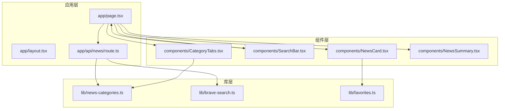
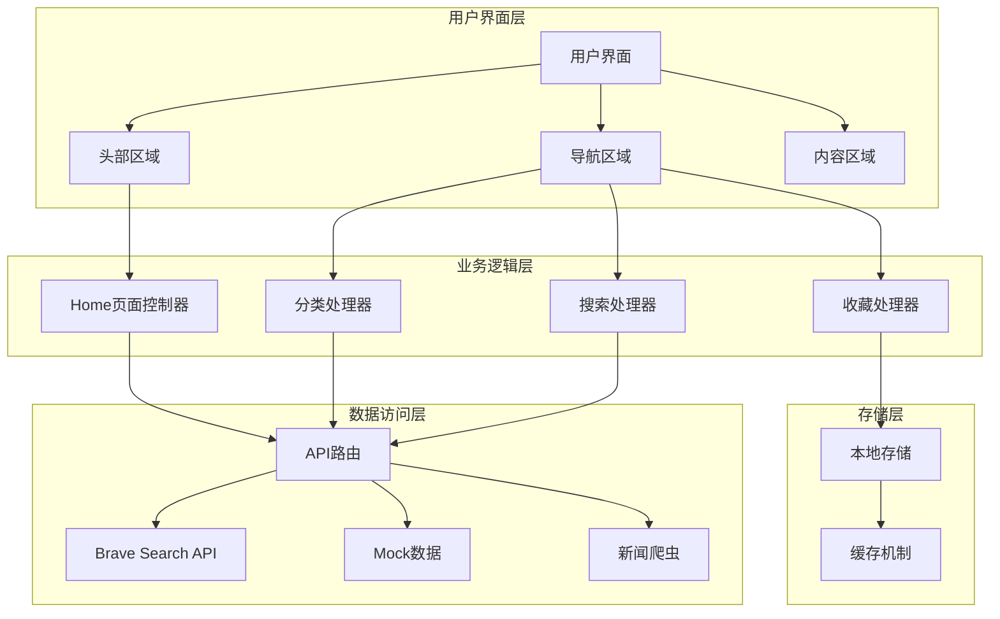
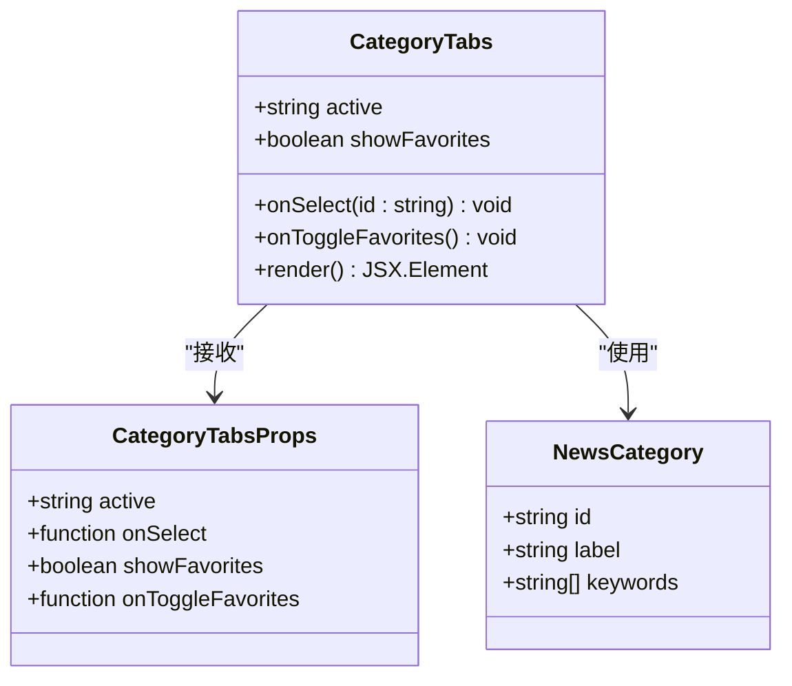
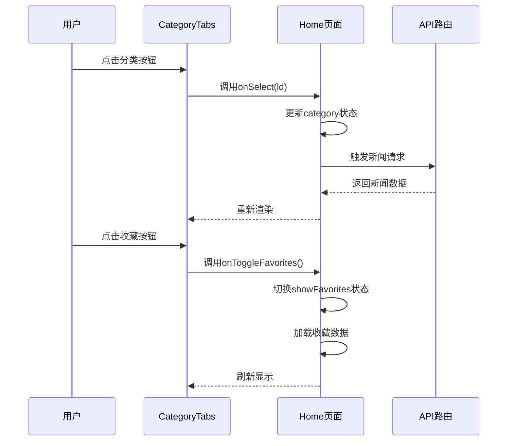
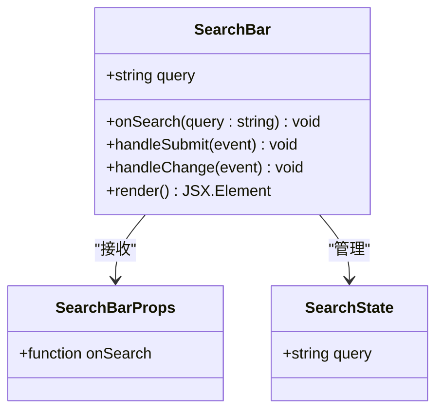
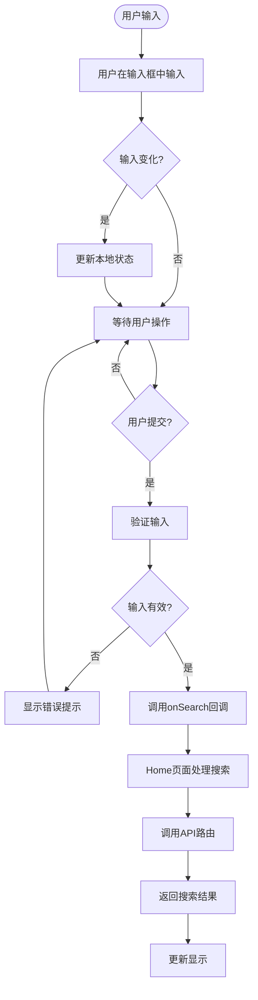
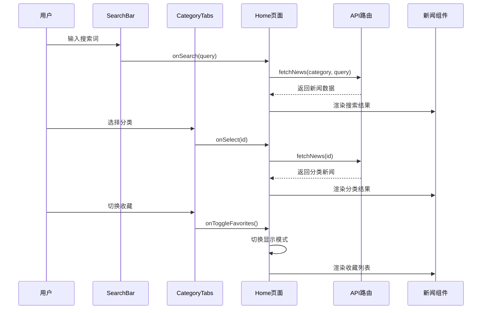
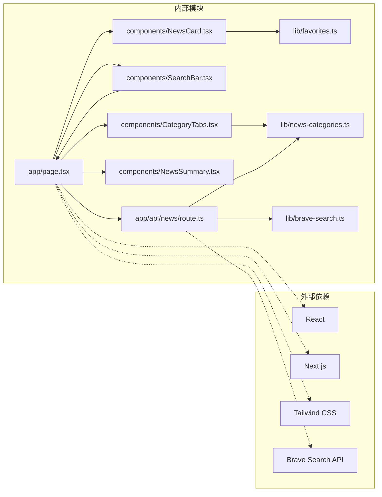

# 导航和搜索组件

<cite>
**本文档引用的文件**
- [components/CategoryTabs.tsx](file://components/CategoryTabs.tsx)
- [components/SearchBar.tsx](file://components/SearchBar.tsx)
- [app/page.tsx](file://app/page.tsx)
- [lib/news-categories.ts](file://lib/news-categories.ts)
- [lib/brave-search.ts](file://lib/brave-search.ts)
- [lib/favorites.ts](file://lib/favorites.ts)
- [app/api/news/route.ts](file://app/api/news/route.ts)
- [components/NewsCard.tsx](file://components/NewsCard.tsx)
- [components/NewsSummary.tsx](file://components/NewsSummary.tsx)
- [app/layout.tsx](file://app/layout.tsx)
</cite>

## 目录
1. [简介](#简介)
2. [项目结构](#项目结构)
3. [核心组件](#核心组件)
4. [架构概览](#架构概览)
5. [详细组件分析](#详细组件分析)
6. [依赖关系分析](#依赖关系分析)
7. [性能考虑](#性能考虑)
8. [故障排除指南](#故障排除指南)
9. [结论](#结论)

## 简介

本项目是一个基于Next.js构建的新闻聚合网站，专注于提供全球新闻的实时聚合和分类浏览功能。本文档深入分析导航和搜索组件的设计与实现，重点介绍分类标签组件和搜索栏组件的功能特性、状态管理、用户交互设计以及与主页面的数据通信机制。

该系统采用现代化的前端技术栈，包括React Hooks、TypeScript、Tailwind CSS样式框架，以及Brave Search API作为新闻数据源。组件设计遵循响应式布局原则，支持深色模式切换，并提供了完整的收藏功能。

## 项目结构

项目采用模块化的文件组织方式，主要目录结构如下：

**图表来源**
- [app/page.tsx](file://app/page.tsx#L1-L153)
- [components/CategoryTabs.tsx](file://components/CategoryTabs.tsx#L1-L49)
- [components/SearchBar.tsx](file://components/SearchBar.tsx#L1-L37)

**章节来源**
- [app/page.tsx](file://app/page.tsx#L1-L153)
- [app/layout.tsx](file://app/layout.tsx#L1-L20)

## 核心组件

### 组件架构概述

系统的核心组件围绕两个主要功能区域构建：导航分类系统和搜索系统。每个组件都采用了函数式组件设计，利用React Hooks进行状态管理，并通过props进行组件间通信。

#### 主要组件职责

1. **CategoryTabs组件**：负责新闻分类的导航和选择
2. **SearchBar组件**：提供关键词搜索功能
3. **Home页面**：协调所有组件的交互和数据流

#### 状态管理模式

组件采用集中式状态管理策略：
- 主页面维护全局状态（新闻数据、加载状态、分类选择等）
- 子组件通过回调函数接收状态更新
- 使用React的useState和useEffect Hook管理本地状态

**章节来源**
- [components/CategoryTabs.tsx](file://components/CategoryTabs.tsx#L1-L49)
- [components/SearchBar.tsx](file://components/SearchBar.tsx#L1-L37)
- [app/page.tsx](file://app/page.tsx#L11-L65)

## 架构概览

系统采用分层架构设计，确保各组件职责清晰分离：

**图表来源**
- [app/page.tsx](file://app/page.tsx#L73-L98)
- [app/api/news/route.ts](file://app/api/news/route.ts#L39-L135)

## 详细组件分析

### CategoryTabs组件分析

CategoryTabs组件是新闻网站的核心导航组件，负责提供分类浏览功能。

#### 组件设计特点

**图表来源**
- [components/CategoryTabs.tsx](file://components/CategoryTabs.tsx#L5-L17)
- [lib/news-categories.ts](file://lib/news-categories.ts#L1-L5)

#### 分类切换逻辑

组件实现了智能的分类切换机制：

1. **动态分类渲染**：从新闻分类库中动态获取分类信息
2. **活动状态管理**：根据当前选中的分类高亮显示
3. **收藏模式切换**：提供专门的收藏按钮用于切换到收藏视图

#### 用户交互设计

**图表来源**
- [components/CategoryTabs.tsx](file://components/CategoryTabs.tsx#L21-L45)
- [app/page.tsx](file://app/page.tsx#L44-L59)

#### 样式定制选项

组件提供了丰富的样式定制能力：

- **主题适配**：支持浅色和深色模式自动切换
- **状态指示**：通过颜色变化直观显示活动状态
- **过渡动画**：使用CSS过渡效果提升用户体验
- **响应式设计**：支持移动端触摸操作

**章节来源**
- [components/CategoryTabs.tsx](file://components/CategoryTabs.tsx#L18-L47)
- [lib/news-categories.ts](file://lib/news-categories.ts#L7-L40)

### SearchBar组件分析

SearchBar组件提供关键词搜索功能，支持实时搜索和表单提交。

#### 组件实现架构

**图表来源**
- [components/SearchBar.tsx](file://components/SearchBar.tsx#L5-L17)

#### 输入处理机制

组件采用受控组件模式管理输入状态：

1. **状态同步**：输入框值与组件状态保持同步
2. **实时验证**：在提交前进行输入验证
3. **空格处理**：自动去除首尾空格

#### 搜索触发机制

**图表来源**
- [components/SearchBar.tsx](file://components/SearchBar.tsx#L12-L17)
- [app/page.tsx](file://app/page.tsx#L49-L52)

#### 实时搜索功能

虽然当前实现主要基于表单提交，但组件为实时搜索预留了扩展接口：

- **状态管理**：使用useState管理输入状态
- **回调机制**：通过props传递搜索结果
- **防抖优化**：可扩展防抖功能避免频繁请求

**章节来源**
- [components/SearchBar.tsx](file://components/SearchBar.tsx#L9-L36)

### 主页面集成分析

Home页面作为组件协调器，负责管理所有子组件的状态和数据流。

#### 数据流管理

**图表来源**
- [app/page.tsx](file://app/page.tsx#L19-L65)

#### 错误处理机制

系统实现了多层次的错误处理：

1. **API错误处理**：捕获网络请求异常
2. **数据验证**：验证返回数据格式
3. **降级策略**：提供Mock数据作为后备方案
4. **用户反馈**：友好的错误消息显示

**章节来源**
- [app/page.tsx](file://app/page.tsx#L19-L38)
- [app/api/news/route.ts](file://app/api/news/route.ts#L76-L134)

## 依赖关系分析

### 组件间依赖关系

**图表来源**
- [app/page.tsx](file://app/page.tsx#L6-L8)
- [components/CategoryTabs.tsx](file://components/CategoryTabs.tsx#L3)
- [app/api/news/route.ts](file://app/api/news/route.ts#L2-L5)

### 数据流依赖

系统采用单向数据流设计，确保状态管理的可预测性：

1. **自上而下传递**：父组件状态向下传递给子组件
2. **回调向上**：子组件通过回调函数通知父组件状态变化
3. **异步数据**：API调用返回的数据更新组件状态

**章节来源**
- [app/page.tsx](file://app/page.tsx#L44-L65)
- [components/CategoryTabs.tsx](file://components/CategoryTabs.tsx#L23-L25)

## 性能考虑

### 优化策略

1. **懒加载**：新闻卡片组件按需加载
2. **虚拟滚动**：大量新闻数据时可考虑实现虚拟滚动
3. **缓存机制**：API响应数据可添加缓存策略
4. **防抖优化**：搜索功能可添加防抖以减少请求频率

### 内存管理

- **状态清理**：组件卸载时清理定时器和事件监听器
- **引用优化**：使用useCallback优化回调函数引用
- **渲染优化**：合理使用React.memo避免不必要的重渲染

## 故障排除指南

### 常见问题及解决方案

#### API密钥配置问题

**问题症状**：新闻无法加载，显示Mock数据

**解决步骤**：
1. 检查环境变量BRAVE_API_KEY是否正确设置
2. 验证API密钥的有效性和权限
3. 确认网络连接正常

#### 搜索功能异常

**问题症状**：搜索无结果或报错

**排查步骤**：
1. 检查搜索关键词格式
2. 验证API路由是否正常工作
3. 查看浏览器开发者工具中的网络请求

#### 收藏功能问题

**问题症状**：收藏状态不持久

**解决方法**：
1. 检查浏览器是否禁用localStorage
2. 验证收藏数据格式
3. 确认本地存储权限

**章节来源**
- [app/api/news/route.ts](file://app/api/news/route.ts#L7-L11)
- [lib/favorites.ts](file://lib/favorites.ts#L8-L10)

## 结论

本导航和搜索组件系统展现了现代React应用的最佳实践：

### 设计优势

1. **模块化架构**：清晰的组件职责分离
2. **状态管理**：合理的状态提升和回调设计
3. **用户体验**：响应式设计和流畅的交互体验
4. **可扩展性**：为未来功能扩展预留接口

### 技术亮点

- **类型安全**：完整的TypeScript类型定义
- **样式系统**：灵活的Tailwind CSS定制
- **数据流**：清晰的单向数据流设计
- **错误处理**：完善的异常处理机制

### 改进建议

1. **性能优化**：实现搜索防抖和结果缓存
2. **功能增强**：添加键盘快捷键支持
3. **用户体验**：优化加载状态和错误提示
4. **测试覆盖**：增加单元测试和集成测试

该系统为新闻聚合应用提供了一个坚实的技术基础，组件设计既满足了当前需求，又为未来的功能扩展做好了充分准备。