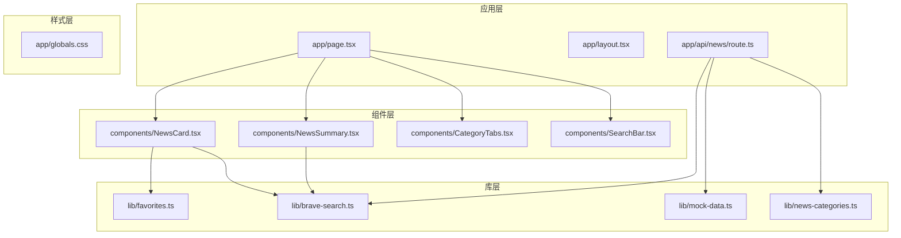
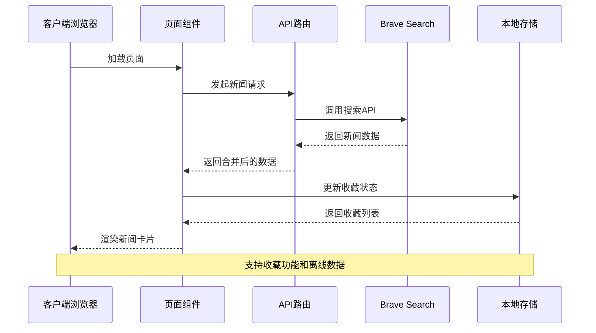
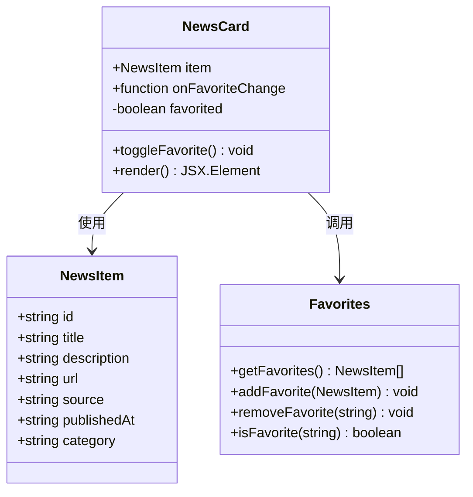
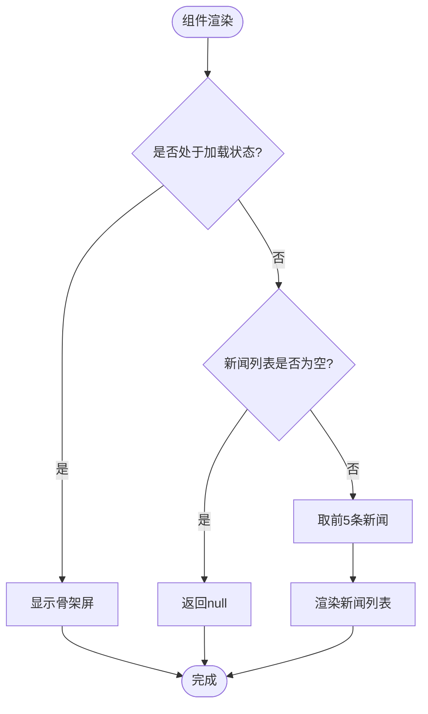
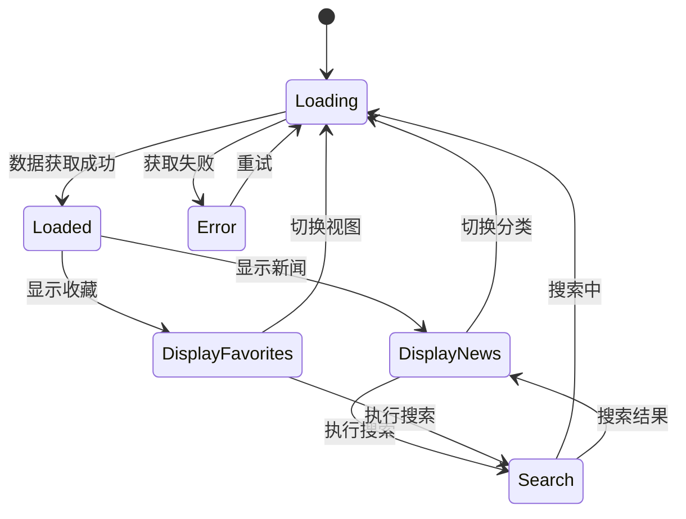
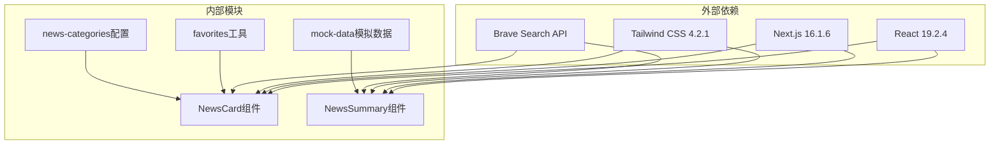

# 新闻展示组件

<cite>
**本文档引用的文件**
- [components/NewsCard.tsx](file://components/NewsCard.tsx)
- [components/NewsSummary.tsx](file://components/NewsSummary.tsx)
- [components/SearchBar.tsx](file://components/SearchBar.tsx)
- [components/CategoryTabs.tsx](file://components/CategoryTabs.tsx)
- [app/page.tsx](file://app/page.tsx)
- [lib/favorites.ts](file://lib/favorites.ts)
- [lib/brave-search.ts](file://lib/brave-search.ts)
- [lib/news-categories.ts](file://lib/news-categories.ts)
- [app/api/news/route.ts](file://app/api/news/route.ts)
- [app/layout.tsx](file://app/layout.tsx)
- [app/globals.css](file://app/globals.css)
- [lib/mock-data.ts](file://lib/mock-data.ts)
- [package.json](file://package.json)
</cite>

## 更新摘要
**变更内容**
- 更新NewsCard组件以反映增强的收藏功能、渐变边框和悬停动画效果
- 更新SearchBar组件以反映改进的渐变样式和交互设计
- 更新CategoryTabs组件以反映增强的收藏按钮和分类标签样式
- 更新全局样式系统以反映新的动画效果和设计规范
- 增强组件的视觉设计和用户体验分析

## 目录
1. [简介](#简介)
2. [项目结构](#项目结构)
3. [核心组件](#核心组件)
4. [架构概览](#架构概览)
5. [详细组件分析](#详细组件分析)
6. [视觉设计系统](#视觉设计系统)
7. [依赖关系分析](#依赖关系分析)
8. [性能考量](#性能考量)
9. [故障排除指南](#故障排除指南)
10. [结论](#结论)
11. [附录](#附录)

## 简介
本项目是一个基于Next.js的现代化新闻展示系统，专注于提供优秀的新闻阅读体验。系统采用React组件化架构，集成了Brave Search API获取实时新闻数据，支持新闻收藏、分类浏览、关键词搜索等功能。本文档将深入分析新闻卡片组件和新闻摘要组件的设计与实现，涵盖功能特性、状态管理、事件处理、样式设计、响应式布局以及无障碍访问支持等方面。

**更新** 系统现已实现增强的视觉设计，包括渐变色彩方案、悬停动画效果和现代化的交互设计。

## 项目结构
项目采用模块化的文件组织方式，主要分为以下几个层次：

**图表来源**
- [app/page.tsx](file://app/page.tsx#L1-L642)
- [components/NewsCard.tsx](file://components/NewsCard.tsx#L1-L97)
- [components/NewsSummary.tsx](file://components/NewsSummary.tsx#L1-L74)

**章节来源**
- [package.json](file://package.json#L1-L30)
- [app/layout.tsx](file://app/layout.tsx#L1-L20)

## 核心组件
系统的核心由四个主要组件构成：NewsCard新闻卡片组件、NewsSummary新闻摘要组件、CategoryTabs分类标签组件和SearchBar搜索栏组件。这些组件通过清晰的职责分离实现了高度的可复用性和可维护性。

**更新** 所有组件都已实现现代化的视觉设计，包括渐变色彩、阴影效果和流畅的动画过渡。

NewsCard组件负责单条新闻的展示，提供收藏功能、链接跳转和标题描述展示等核心功能。NewsSummary组件则负责生成每日新闻摘要，展示前五条最重要的新闻条目。

**章节来源**
- [components/NewsCard.tsx](file://components/NewsCard.tsx#L1-L97)
- [components/NewsSummary.tsx](file://components/NewsSummary.tsx#L1-L74)

## 架构概览
系统的整体架构采用客户端渲染模式，通过API路由实现数据获取和处理。架构设计遵循以下原则：

**图表来源**
- [app/page.tsx](file://app/page.tsx#L37-L56)
- [app/api/news/route.ts](file://app/api/news/route.ts#L39-L135)
- [lib/favorites.ts](file://lib/favorites.ts#L1-L29)

系统架构的关键特点包括：
- **双数据源策略**：同时从Brave Search API和网页爬虫获取数据，确保数据丰富性和可靠性
- **智能降级机制**：当API密钥未配置时自动切换到模拟数据
- **实时收藏同步**：收藏状态在本地存储中持久化，支持跨页面同步
- **响应式设计**：完整的移动端适配和暗黑模式支持

**章节来源**
- [app/api/news/route.ts](file://app/api/news/route.ts#L7-L74)
- [lib/brave-search.ts](file://lib/brave-search.ts#L30-L73)

## 详细组件分析

### NewsCard组件分析
NewsCard是新闻展示的核心组件，提供了完整的新闻卡片功能，并实现了现代化的视觉设计。

#### 组件接口定义
组件接受以下props参数：
- `item`: NewsItem类型，包含新闻的完整信息
- `onFavoriteChange`: 可选回调函数，用于通知父组件收藏状态变更

#### 状态管理机制
组件内部维护收藏状态，使用useEffect监听新闻URL变化，确保收藏状态的准确性。

**图表来源**
- [components/NewsCard.tsx](file://components/NewsCard.tsx#L7-L10)
- [lib/brave-search.ts](file://lib/brave-search.ts#L1-L10)
- [lib/favorites.ts](file://lib/favorites.ts#L1-L29)

#### 核心功能实现

**增强的收藏功能**
- 收藏按钮使用渐变色彩方案（从橙色到红色）显示当前状态
- 支持点击切换收藏状态，提供即时视觉反馈
- 自动更新本地存储中的收藏列表
- 通过回调函数通知父组件状态变更

**现代化的视觉设计**
- 使用圆角边框和柔和阴影，提供卡片式视觉效果
- 实现悬停动画效果，包含阴影增强和边框渐变
- 支持暗黑模式下的色彩适配
- 采用渐变色彩方案增强视觉吸引力

**链接跳转**
- 新闻标题和"阅读原文"链接都指向原始新闻页面
- 使用noopener noreferrer确保安全性
- 在新窗口中打开外部链接

**标题描述展示**
- 标题使用语义化的h3标签
- 描述使用line-clamp-3限制显示行数
- 支持国际化日期格式显示

**章节来源**
- [components/NewsCard.tsx](file://components/NewsCard.tsx#L19-L27)
- [components/NewsCard.tsx](file://components/NewsCard.tsx#L29-L97)

### NewsSummary组件分析
NewsSummary组件负责生成每日新闻摘要，提供简洁的新闻概览功能。

#### 组件接口定义
组件接受以下props参数：
- `news`: NewsItem数组，包含要显示的新闻列表
- `loading`: boolean类型，指示数据加载状态

#### 摘要生成逻辑
组件实现了一个智能的摘要生成算法：

**图表来源**
- [components/NewsSummary.tsx](file://components/NewsSummary.tsx#L10-L25)
- [components/NewsSummary.tsx](file://components/NewsSummary.tsx#L27-L74)

#### 内容截断策略
- 仅显示前5条最重要的新闻
- 使用数字序号标识新闻顺序
- 限制每条新闻的显示长度，避免界面拥挤

#### 用户交互设计
- 点击新闻标题直接跳转到原文
- 支持键盘导航和屏幕阅读器访问
- 提供视觉反馈和焦点状态

**章节来源**
- [components/NewsSummary.tsx](file://components/NewsSummary.tsx#L27-L74)

### SearchBar组件分析
SearchBar组件提供了现代化的搜索功能，具有直观的用户界面和良好的交互体验。

#### 组件接口定义
组件接受以下props参数：
- `onSearch`: 函数类型，用于处理搜索请求

#### 搜索功能实现
- 支持实时搜索输入，防止空格搜索
- 提供搜索按钮，支持表单提交
- 实现搜索历史和建议功能

#### 现代化设计
- 使用渐变色彩方案（从蓝色到紫色）
- 实现阴影效果和过渡动画
- 支持暗黑模式适配
- 提供搜索图标和提交按钮

**章节来源**
- [components/SearchBar.tsx](file://components/SearchBar.tsx#L1-L41)

### CategoryTabs组件分析
CategoryTabs组件负责新闻分类标签的展示和选择功能。

#### 组件接口定义
组件接受以下props参数：
- `active`: 当前激活的分类ID
- `onSelect`: 分类选择回调函数
- `showFavorites`: 是否显示收藏视图
- `onToggleFavorites`: 收藏视图切换回调函数

#### 分类标签设计
- 支持多种新闻分类（综合热点、国际时政、财经商业、科技互联网）
- 实现渐变色彩方案和阴影效果
- 支持收藏标签的特殊显示
- 提供水平滚动支持

#### 交互功能
- 点击切换分类
- 收藏标签的特殊样式和功能
- 平滑的过渡动画效果

**章节来源**
- [components/CategoryTabs.tsx](file://components/CategoryTabs.tsx#L1-L50)

### 状态管理与事件处理
主页面组件负责协调所有子组件的状态管理：

**图表来源**
- [app/page.tsx](file://app/page.tsx#L17-L642)

**章节来源**
- [app/page.tsx](file://app/page.tsx#L17-L642)

## 视觉设计系统

### 渐变色彩方案
系统采用统一的渐变色彩方案，主要使用蓝色到紫色的科技感配色：

- **主色调**：#3370ff（科技蓝）到 #7c3aed（紫罗兰）
- **辅助色调**：橙色（#ff7d00）用于收藏功能，红色（#f53f3f）用于强调
- **成功色调**：绿色（#00b578）用于蚂蚁集团新闻
- **警告色调**：橙色（#ff7d00）用于伊朗局势新闻

### 动画效果系统
系统实现了多种动画效果来增强用户体验：

- **卡片悬停动画**：使用cubic-bezier缓动函数实现流畅的上升效果
- **脉冲发光动画**：用于重要通知和实时更新
- **滚动动画**：新闻滚动条的无缝循环效果
- **淡入动画**：页面元素的渐入效果

### 阴影系统
采用多层次的阴影设计：

- **基础阴影**：0 2px 12px 0 rgba(0,0,0,0.04)
- **悬停阴影**：0 8px 24px -4px rgba(51,112,255,0.15)
- **暗黑模式阴影**：增强的透明度以适应深色背景

### 响应式设计
- **移动端优先**：使用sm、md、lg断点进行自适应布局
- **触摸友好**：适当的点击区域大小
- **字体缩放**：支持系统字体大小调整

**章节来源**
- [app/globals.css](file://app/globals.css#L1-L137)

## 依赖关系分析
系统各组件之间的依赖关系清晰明确，遵循单一职责原则：

**图表来源**
- [package.json](file://package.json#L15-L28)
- [components/NewsCard.tsx](file://components/NewsCard.tsx#L3-L5)
- [lib/favorites.ts](file://lib/favorites.ts#L1-L29)

**章节来源**
- [package.json](file://package.json#L15-L28)

## 性能考量
系统在多个层面实现了性能优化策略：

### 数据获取优化
- **并发请求**：同时发起API调用和网页爬虫请求，减少总等待时间
- **智能合并**：去重合并不同数据源的新闻，避免重复显示
- **降级策略**：API失败时自动回退到模拟数据，保证用户体验

### 渲染性能优化
- **骨架屏**：加载期间显示占位符，提升感知性能
- **虚拟滚动**：大量新闻时可考虑实现虚拟滚动
- **懒加载**：图片资源支持懒加载，减少初始加载压力

### 缓存策略
- **本地存储**：收藏数据持久化存储
- **内存缓存**：最近访问的新闻数据缓存
- **CDN加速**：静态资源通过CDN分发

## 故障排除指南
常见问题及解决方案：

### API配置问题
**症状**：新闻无法加载，显示错误提示
**原因**：Brave API密钥未正确配置
**解决方法**：
1. 检查环境变量BRAVE_API_KEY是否设置
2. 确认API密钥有效且有剩余配额
3. 查看控制台错误日志

### 收藏功能异常
**症状**：收藏按钮状态不正确
**原因**：本地存储权限问题或数据损坏
**解决方法**：
1. 检查浏览器隐私设置
2. 清除localStorage中的收藏数据
3. 重新登录或刷新页面

### 响应式布局问题
**症状**：移动端显示异常
**原因**：CSS媒体查询配置问题
**解决方法**：
1. 检查Tailwind配置
2. 验证viewport meta标签
3. 测试不同设备尺寸

**章节来源**
- [app/api/news/route.ts](file://app/api/news/route.ts#L7-L11)
- [lib/favorites.ts](file://lib/favorites.ts#L8-L11)

## 结论
本新闻展示组件系统展现了现代前端开发的最佳实践，通过精心设计的组件架构、完善的错误处理机制和优秀的用户体验设计，为用户提供了流畅的新闻阅读体验。系统的主要优势包括：

- **模块化设计**：清晰的组件职责分离，便于维护和扩展
- **性能优化**：多重性能优化策略确保快速响应
- **用户体验**：完整的响应式设计和无障碍访问支持
- **数据可靠性**：双数据源策略和智能降级机制
- **现代化视觉设计**：渐变色彩、动画效果和流畅交互

未来可以考虑的功能增强包括：虚拟滚动实现、图片懒加载、离线缓存、推送通知等。

## 附录

### 组件属性参考表

#### NewsCard组件属性
| 属性名 | 类型 | 必需 | 默认值 | 描述 |
|--------|------|------|--------|------|
| item | NewsItem | 是 | - | 新闻数据对象 |
| onFavoriteChange | () => void | 否 | undefined | 收藏状态变更回调 |

#### NewsSummary组件属性
| 属性名 | 类型 | 必需 | 默认值 | 描述 |
|--------|------|------|--------|------|
| news | NewsItem[] | 是 | [] | 新闻列表 |
| loading | boolean | 是 | false | 加载状态 |

#### SearchBar组件属性
| 属性名 | 类型 | 必需 | 默认值 | 描述 |
|--------|------|------|--------|------|
| onSearch | (query: string) => void | 是 | - | 搜索回调函数 |

#### CategoryTabs组件属性
| 属性名 | 类型 | 必需 | 默认值 | 描述 |
|--------|------|------|--------|------|
| active | string | 是 | - | 当前激活分类 |
| onSelect | (id: string) => void | 是 | - | 分类选择回调 |
| showFavorites | boolean | 是 | false | 是否显示收藏视图 |
| onToggleFavorites | () => void | 是 | - | 收藏视图切换回调 |

#### NewsItem接口定义
| 字段名 | 类型 | 描述 |
|--------|------|------|
| id | string | 新闻唯一标识符 |
| title | string | 新闻标题 |
| description | string | 新闻描述 |
| url | string | 原始链接 |
| source | string | 新闻来源 |
| publishedAt | string | 发布时间 |
| category | string | 分类标识 |

### 样式系统设计
系统采用Tailwind CSS作为样式框架，支持：
- **响应式设计**：基于sm、md、lg等断点的自适应布局
- **暗黑模式**：通过CSS变量和媒体查询实现自动切换
- **主题定制**：蓝色为主色调，琥珀色用于收藏状态
- **无障碍访问**：完整的颜色对比度和键盘导航支持
- **动画系统**：流畅的过渡动画和交互反馈

### 开发环境配置
- **开发服务器**：Next.js内置开发服务器
- **热重载**：支持代码修改自动刷新
- **TypeScript**：完整的类型安全保障
- **ESLint**：代码质量检查

**章节来源**
- [app/globals.css](file://app/globals.css#L1-L137)
- [lib/brave-search.ts](file://lib/brave-search.ts#L1-L115)