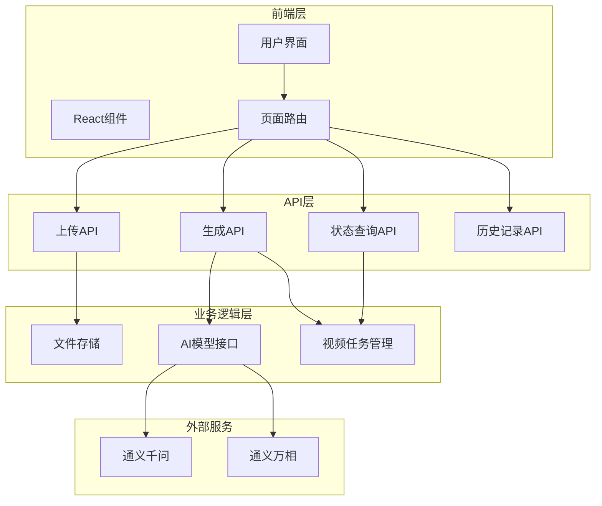
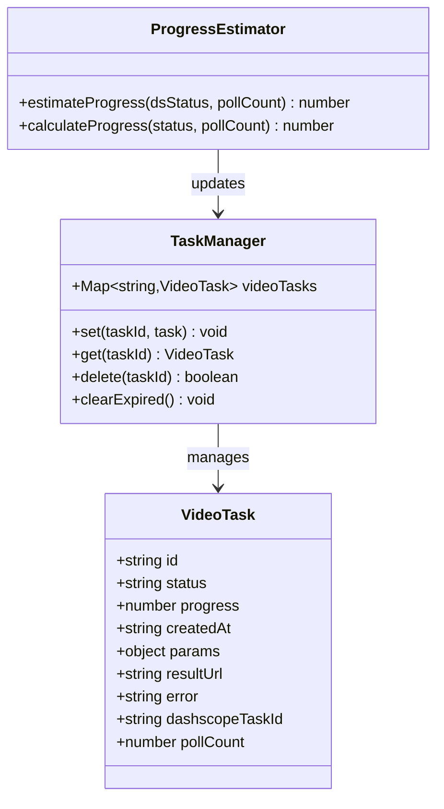
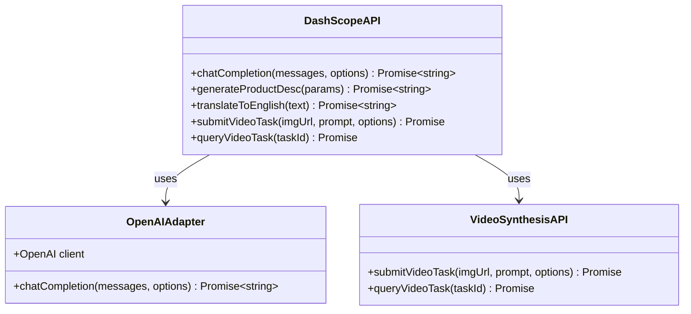
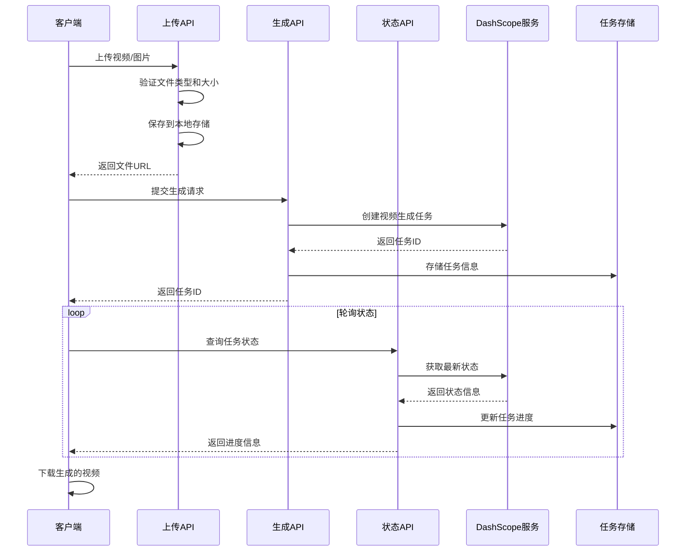
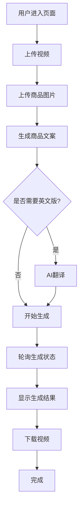
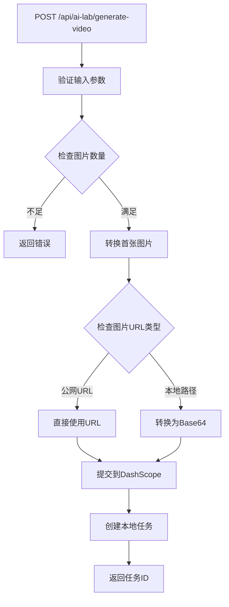
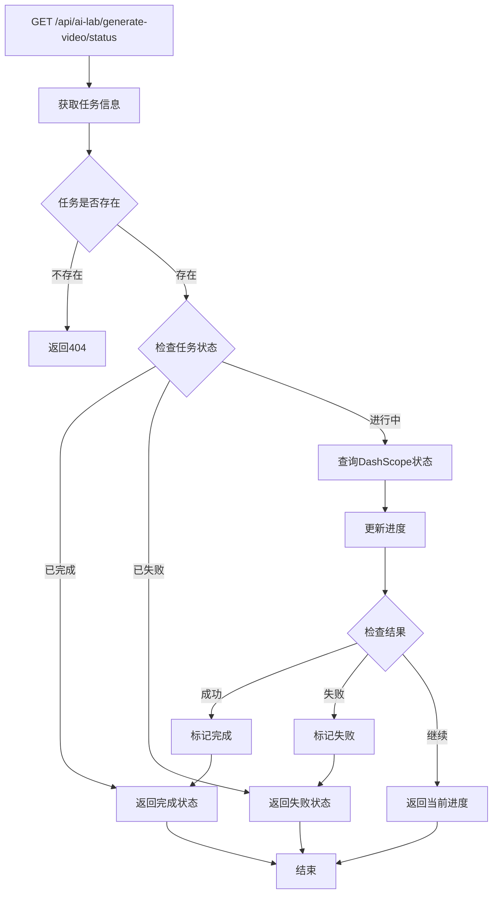
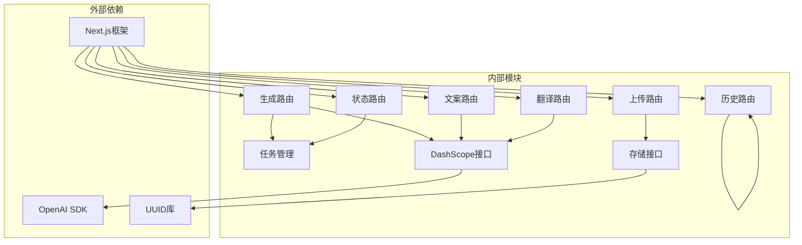
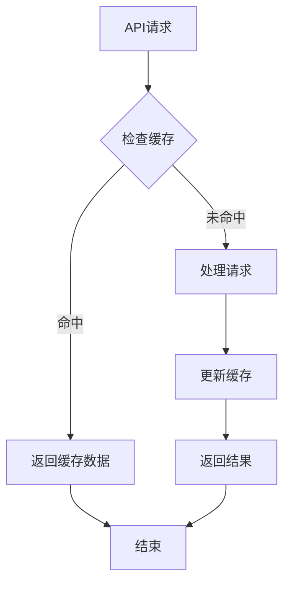

# 视频生成管道

<cite>
**本文档引用的文件**
- [app/api/ai-lab/generate-video/route.ts](file://app/api/ai-lab/generate-video/route.ts)
- [app/api/ai-lab/generate-video/status/route.ts](file://app/api/ai-lab/generate-video/status/route.ts)
- [lib/video-tasks.ts](file://lib/video-tasks.ts)
- [lib/aliyun/dashscope.ts](file://lib/aliyun/dashscope.ts)
- [lib/aliyun/storage.ts](file://lib/aliyun/storage.ts)
- [app/api/ai-lab/upload/route.ts](file://app/api/ai-lab/upload/route.ts)
- [app/api/ai-lab/generate-desc/route.ts](file://app/api/ai-lab/generate-desc/route.ts)
- [app/api/ai-lab/translate/route.ts](file://app/api/ai-lab/translate/route.ts)
- [app/api/ai-lab/history/route.ts](file://app/api/ai-lab/history/route.ts)
- [app/ai-lab/product-swap/page.tsx](file://app/ai-lab/product-swap/page.tsx)
- [package.json](file://package.json)
- [next.config.mjs](file://next.config.mjs)
</cite>

## 目录
1. [简介](#简介)
2. [项目结构](#项目结构)
3. [核心组件](#核心组件)
4. [架构概览](#架构概览)
5. [详细组件分析](#详细组件分析)
6. [依赖关系分析](#依赖关系分析)
7. [性能考虑](#性能考虑)
8. [故障排除指南](#故障排除指南)
9. [结论](#结论)

## 简介

这是一个基于Next.js构建的AI视频生成管道系统，专注于电商内容创作。该系统提供了完整的视频生成工作流程，包括素材上传、AI文案生成、视频合成以及结果管理等功能。

系统的核心特性包括：
- 多媒体素材处理（视频和图片上传）
- AI驱动的商品文案生成
- 通义万相图生视频功能
- 实时进度监控和状态查询
- 历史记录管理和分享功能

## 项目结构

该项目采用Next.js应用结构，主要分为以下几个核心部分：

**图表来源**
- [app/ai-lab/product-swap/page.tsx:1-687](file://app/ai-lab/product-swap/page.tsx#L1-L687)
- [app/api/ai-lab/generate-video/route.ts:1-88](file://app/api/ai-lab/generate-video/route.ts#L1-L88)

**章节来源**
- [package.json:1-33](file://package.json#L1-L33)
- [next.config.mjs:1-11](file://next.config.mjs#L1-L11)

## 核心组件

### 视频生成任务管理器

视频任务管理系统是整个管道的核心，负责协调各个组件之间的交互。

**图表来源**
- [lib/video-tasks.ts:1-35](file://lib/video-tasks.ts#L1-L35)

### AI模型集成层

系统集成了多个AI服务，通过统一的接口进行管理：

**图表来源**
- [lib/aliyun/dashscope.ts:1-191](file://lib/aliyun/dashscope.ts#L1-L191)

**章节来源**
- [lib/video-tasks.ts:1-35](file://lib/video-tasks.ts#L1-L35)
- [lib/aliyun/dashscope.ts:1-191](file://lib/aliyun/dashscope.ts#L1-L191)

## 架构概览

整个视频生成管道采用异步处理架构，实现了完整的端到端工作流程：

**图表来源**
- [app/api/ai-lab/generate-video/route.ts:30-88](file://app/api/ai-lab/generate-video/route.ts#L30-L88)
- [app/api/ai-lab/generate-video/status/route.ts:16-88](file://app/api/ai-lab/generate-video/status/route.ts#L16-L88)

## 详细组件分析

### 前端用户界面组件

前端采用React构建，提供了直观的用户交互界面：

**图表来源**
- [app/ai-lab/product-swap/page.tsx:78-116](file://app/ai-lab/product-swap/page.tsx#L78-L116)

#### 用户界面状态管理

前端组件通过状态管理实现了复杂的用户交互流程：

| 状态 | 描述 | 触发条件 |
|------|------|----------|
| `uploadingVideo` | 视频上传中 | 用户选择视频文件 |
| `uploadingImages` | 图片上传中 | 用户选择图片文件 |
| `generating` | 视频生成中 | 用户点击生成按钮 |
| `resultReady` | 生成完成 | 任务状态变为completed |
| `showHistory` | 显示历史记录 | 用户点击历史按钮 |

**章节来源**
- [app/ai-lab/product-swap/page.tsx:37-687](file://app/ai-lab/product-swap/page.tsx#L37-L687)

### 后端API服务组件

#### 视频生成API

视频生成API是整个系统的核心，负责处理用户的生成请求：

**图表来源**
- [app/api/ai-lab/generate-video/route.ts:30-88](file://app/api/ai-lab/generate-video/route.ts#L30-L88)

#### 任务状态查询API

状态查询API实现了智能的进度估算和状态跟踪：

**图表来源**
- [app/api/ai-lab/generate-video/status/route.ts:16-88](file://app/api/ai-lab/generate-video/status/route.ts#L16-L88)

**章节来源**
- [app/api/ai-lab/generate-video/route.ts:1-88](file://app/api/ai-lab/generate-video/route.ts#L1-L88)
- [app/api/ai-lab/generate-video/status/route.ts:1-88](file://app/api/ai-lab/generate-video/status/route.ts#L1-L88)

### AI服务集成组件

#### 文案生成服务

系统集成了多种AI服务来提供完整的功能：

| 服务类型 | 功能描述 | 使用场景 |
|----------|----------|----------|
| 通义千问 | 文本生成和对话 | 商品文案生成、翻译服务 |
| 通义万相 | 图生视频 | 视频合成和生成 |
| 本地存储 | 文件上传和管理 | 用户素材存储 |

**章节来源**
- [lib/aliyun/dashscope.ts:32-94](file://lib/aliyun/dashscope.ts#L32-L94)
- [lib/aliyun/dashscope.ts:112-191](file://lib/aliyun/dashscope.ts#L112-L191)

## 依赖关系分析

系统采用了模块化的依赖设计，各组件之间通过清晰的接口进行通信：

**图表来源**
- [package.json:15-22](file://package.json#L15-L22)

**章节来源**
- [package.json:1-33](file://package.json#L1-L33)

## 性能考虑

### 异步处理优化

系统采用了异步处理机制来提高响应性能：

1. **非阻塞I/O操作**：所有文件操作都使用异步方法
2. **内存存储优化**：使用Map数据结构存储任务状态
3. **智能轮询策略**：根据任务状态动态调整轮询频率

### 缓存策略

### 错误处理机制

系统实现了多层次的错误处理机制：

1. **输入验证**：在API层进行严格的参数验证
2. **异常捕获**：使用try-catch处理异步操作异常
3. **状态回滚**：在失败情况下自动回滚到安全状态

## 故障排除指南

### 常见问题及解决方案

| 问题类型 | 症状 | 可能原因 | 解决方案 |
|----------|------|----------|----------|
| 上传失败 | 文件无法上传 | 文件类型不支持 | 检查文件格式和大小限制 |
| 生成失败 | 视频生成任务失败 | API密钥配置错误 | 验证DashScope API密钥 |
| 进度停滞 | 状态查询无响应 | 网络连接问题 | 检查网络连接和防火墙设置 |
| 内存泄漏 | 内存使用持续增长 | 任务清理机制失效 | 检查任务过期清理逻辑 |

### 调试工具和方法

1. **日志监控**：系统在关键节点记录详细日志
2. **状态检查**：通过状态API检查任务执行情况
3. **性能分析**：使用浏览器开发者工具分析前端性能

**章节来源**
- [app/api/ai-lab/generate-video/route.ts:80-86](file://app/api/ai-lab/generate-video/route.ts#L80-L86)
- [app/api/ai-lab/generate-video/status/route.ts:76-86](file://app/api/ai-lab/generate-video/status/route.ts#L76-L86)

## 结论

这个视频生成管道系统展现了现代AI应用开发的最佳实践，具有以下特点：

1. **模块化设计**：清晰的组件分离和接口定义
2. **异步处理**：高效的异步任务管理和状态跟踪
3. **用户体验**：直观的界面设计和流畅的交互流程
4. **扩展性**：良好的架构设计便于功能扩展
5. **可靠性**：完善的错误处理和监控机制

系统为电商内容创作者提供了完整的解决方案，从素材准备到最终发布的全流程自动化，大大提高了内容创作的效率和质量。