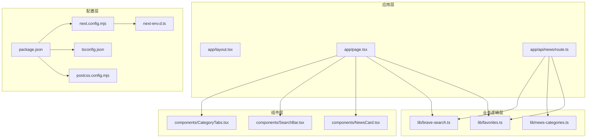
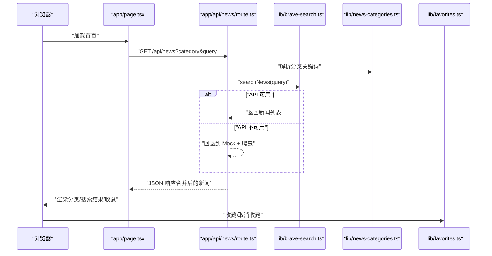
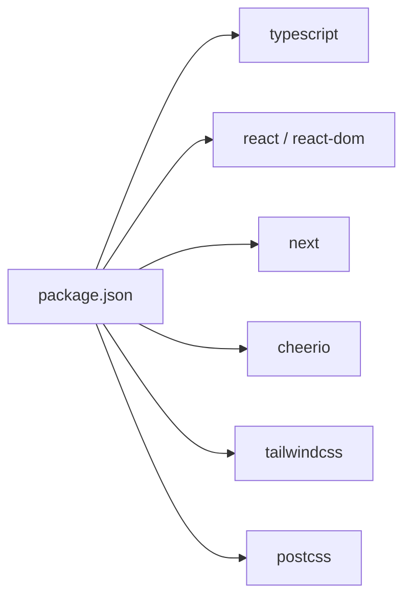

# 开发工具链

<cite>
**本文引用的文件**
- [package.json](file://package.json)
- [tsconfig.json](file://tsconfig.json)
- [next.config.mjs](file://next.config.mjs)
- [postcss.config.mjs](file://postcss.config.mjs)
- [next-env.d.ts](file://next-env.d.ts)
- [README.md](file://README.md)
- [app/layout.tsx](file://app/layout.tsx)
- [app/page.tsx](file://app/page.tsx)
- [app/api/news/route.ts](file://app/api/news/route.ts)
- [lib/brave-search.ts](file://lib/brave-search.ts)
- [lib/news-categories.ts](file://lib/news-categories.ts)
- [lib/favorites.ts](file://lib/favorites.ts)
- [components/NewsCard.tsx](file://components/NewsCard.tsx)
- [components/SearchBar.tsx](file://components/SearchBar.tsx)
- [components/CategoryTabs.tsx](file://components/CategoryTabs.tsx)
</cite>

## 目录
1. [简介](#简介)
2. [项目结构](#项目结构)
3. [核心组件](#核心组件)
4. [架构总览](#架构总览)
5. [详细组件分析](#详细组件分析)
6. [依赖关系分析](#依赖关系分析)
7. [性能考量](#性能考量)
8. [故障排查指南](#故障排查指南)
9. [结论](#结论)
10. [附录](#附录)

## 简介
本文件系统性梳理该新闻网站的开发工具链与运行机制，覆盖以下方面：
- TypeScript 配置与类型安全
- ESLint 与 Prettier 的集成与使用建议
- 开发服务器、热重载与错误处理
- 代码生成与测试策略
- 性能分析与构建优化
- 开发工作流、版本控制与团队协作规范
- 打包配置与调试技巧

本项目基于 Next.js App Router 构建，采用 React 19、TypeScript 5、TailwindCSS 4，并通过 Brave Search API 获取新闻数据，同时内置爬虫与 Mock 数据作为降级方案。

## 项目结构
项目采用 Next.js App Router 的目录组织方式，关键目录与文件如下：
- app：应用页面与 API 路由
- components：可复用 UI 组件
- lib：业务逻辑与数据源封装
- 根目录配置：package.json、tsconfig.json、next.config.mjs、postcss.config.mjs、next-env.d.ts、vercel.json、Dockerfile 等

图表来源
- [app/layout.tsx](file://app/layout.tsx#L1-L20)
- [app/page.tsx](file://app/page.tsx#L1-L153)
- [app/api/news/route.ts](file://app/api/news/route.ts#L1-L136)
- [components/CategoryTabs.tsx](file://components/CategoryTabs.tsx#L1-L49)
- [components/SearchBar.tsx](file://components/SearchBar.tsx#L1-L37)
- [components/NewsCard.tsx](file://components/NewsCard.tsx#L1-L89)
- [lib/news-categories.ts](file://lib/news-categories.ts#L1-L45)
- [lib/brave-search.ts](file://lib/brave-search.ts#L1-L115)
- [lib/favorites.ts](file://lib/favorites.ts#L1-L29)
- [package.json](file://package.json#L1-L30)
- [tsconfig.json](file://tsconfig.json#L1-L44)
- [next.config.mjs](file://next.config.mjs#L1-L9)
- [postcss.config.mjs](file://postcss.config.mjs#L1-L7)
- [next-env.d.ts](file://next-env.d.ts#L1-L7)

章节来源
- [README.md](file://README.md#L1-L49)
- [package.json](file://package.json#L1-L30)
- [tsconfig.json](file://tsconfig.json#L1-L44)
- [next.config.mjs](file://next.config.mjs#L1-L9)
- [postcss.config.mjs](file://postcss.config.mjs#L1-L7)
- [next-env.d.ts](file://next-env.d.ts#L1-L7)

## 核心组件
- 应用入口与全局样式：app/layout.tsx 提供全局 Metadata 与基础样式引入；app/page.tsx 为首页，负责状态管理、数据获取与渲染。
- API 路由：app/api/news/route.ts 实现新闻聚合与降级策略，支持分类查询、关键词搜索与并发抓取。
- 业务模块：
  - lib/brave-search.ts：封装 Brave Search API 请求与回退到 Web 搜索的逻辑。
  - lib/news-categories.ts：定义新闻分类与关键词映射。
  - lib/favorites.ts：本地收藏持久化与状态同步。
- UI 组件：
  - components/CategoryTabs.tsx：分类切换与收藏模式切换。
  - components/SearchBar.tsx：关键词搜索表单。
  - components/NewsCard.tsx：新闻卡片展示与收藏交互。

章节来源
- [app/layout.tsx](file://app/layout.tsx#L1-L20)
- [app/page.tsx](file://app/page.tsx#L1-L153)
- [app/api/news/route.ts](file://app/api/news/route.ts#L1-L136)
- [lib/brave-search.ts](file://lib/brave-search.ts#L1-L115)
- [lib/news-categories.ts](file://lib/news-categories.ts#L1-L45)
- [lib/favorites.ts](file://lib/favorites.ts#L1-L29)
- [components/CategoryTabs.tsx](file://components/CategoryTabs.tsx#L1-L49)
- [components/SearchBar.tsx](file://components/SearchBar.tsx#L1-L37)
- [components/NewsCard.tsx](file://components/NewsCard.tsx#L1-L89)

## 架构总览
下图展示了从浏览器请求到数据返回的关键路径，包括 API 路由、数据合并与前端渲染：

图表来源
- [app/page.tsx](file://app/page.tsx#L19-L63)
- [app/api/news/route.ts](file://app/api/news/route.ts#L39-L135)
- [lib/brave-search.ts](file://lib/brave-search.ts#L30-L73)
- [lib/news-categories.ts](file://lib/news-categories.ts#L42-L44)
- [lib/favorites.ts](file://lib/favorites.ts#L7-L28)

## 详细组件分析

### TypeScript 配置与类型安全
- 编译目标与模块系统：ES2017 目标、esnext 模块与 bundler 解析，配合 isolatedModules 与 noEmit，确保类型检查与增量编译高效。
- JSX 与插件：启用 react-jsx 并集成 Next 插件，提升 App Router 类型推断能力。
- 路径别名：@/* 映射至项目根目录，便于跨层级导入。
- 包含范围：自动包含 .next/types 与开发态类型，保证 SSR/SSG 与 App Router 类型一致性。

章节来源
- [tsconfig.json](file://tsconfig.json#L1-L44)
- [next-env.d.ts](file://next-env.d.ts#L1-L7)

### 开发服务器、热重载与错误处理
- 开发脚本：package.json 中 dev 指向 next dev，Next.js 默认提供热重载与快速刷新。
- 错误处理策略：
  - API 层：当 Brave API 不可用或异常时，回退到 Mock 数据与爬虫数据合并，保证前端稳定显示。
  - 前端层：在 fetch 失败时设置错误状态并提示用户检查网络或 API 密钥。
- 图像优化：next.config.mjs 中 images.unoptimized 为 true，避免图像服务开销，适合静态内容场景。

章节来源
- [package.json](file://package.json#L5-L10)
- [app/api/news/route.ts](file://app/api/news/route.ts#L48-L74)
- [app/api/news/route.ts](file://app/api/news/route.ts#L112-L134)
- [app/page.tsx](file://app/page.tsx#L20-L38)
- [next.config.mjs](file://next.config.mjs#L4-L6)

### 代码质量与格式化（ESLint 与 Prettier）
- 当前仓库未发现 ESLint 与 Prettier 的配置文件与脚本，但已具备 TypeScript 与 TailwindCSS 的基础配置。
- 建议实践（概念性指导，非仓库既有内容）：
  - 使用 @typescript-eslint/eslint-plugin 与 eslint-config-prettier 配置 TS/JSX 规则与格式统一。
  - 在 package.json scripts 中新增 lint 与 format 脚本，CI 中执行以保证提交质量。
  - 集成 husky + lint-staged 在提交前自动格式化与静态检查。

[本节为通用建议，不直接分析具体文件，故无“章节来源”]

### 代码生成与测试策略
- 测试框架：当前仓库未包含测试配置或测试文件。
- 建议实践（概念性指导）：
  - 使用 vitest/jest 进行单元测试，结合 @testing-library/react 测试组件行为。
  - 对 API 路由与工具函数编写快照与边界条件测试。
  - 使用 playwright/cypress 进行端到端测试，覆盖搜索、收藏等关键流程。

[本节为通用建议，不直接分析具体文件，故无“章节来源”]

### 性能分析与构建优化
- 构建输出：next.config.mjs 设置 output 为 standalone，便于容器化部署与最小化运行时体积。
- 图像优化：images.unoptimized 为 true，减少图像服务依赖；如需 CDN 加速可调整为 false 并配置白名单。
- 并发与去重：API 路由中对 API 与爬虫数据进行去重合并，减少重复内容，提升首屏体验。
- 类型检查：tsconfig.json 启用 isolatedModules 与 noEmit，结合 Next 内置类型生成，降低构建时长。

章节来源
- [next.config.mjs](file://next.config.mjs#L3-L7)
- [app/api/news/route.ts](file://app/api/news/route.ts#L14-L37)

### 开发工作流、版本控制与团队协作
- 版本控制：README.md 提供启动说明与功能概览，建议在 .gitignore 中忽略 node_modules、.next、.env.local 等。
- 分支与提交：建议采用 Git Flow，主分支保护，PR 审查 + CI 校验。
- 环境变量：BRAVE_API_KEY 通过 .env.local 注入，避免硬编码与泄露。

章节来源
- [README.md](file://README.md#L24-L33)
- [app/api/news/route.ts](file://app/api/news/route.ts#L7-L11)

### 打包配置与调试技巧
- 打包输出：standalone 输出便于独立运行与容器部署。
- 调试技巧：
  - 使用浏览器 DevTools Network 面板观察 /api/news 请求与响应结构。
  - 在 app/page.tsx 中临时禁用收藏或搜索，定位问题来源。
  - 利用 Next.js 日志与错误边界捕获前端异常。

章节来源
- [next.config.mjs](file://next.config.mjs#L3-L7)
- [app/page.tsx](file://app/page.tsx#L19-L38)

## 依赖关系分析
- 运行时依赖：next、react、react-dom、cheerio（用于网页解析）。
- 开发依赖：typescript、@types/*、tailwindcss、postcss、@tailwindcss/postcss。
- 构建与样式：postcss.config.mjs 引入 TailwindCSS 插件，实现原子化样式与响应式设计。

图表来源
- [package.json](file://package.json#L15-L28)
- [postcss.config.mjs](file://postcss.config.mjs#L1-L7)

章节来源
- [package.json](file://package.json#L15-L28)
- [postcss.config.mjs](file://postcss.config.mjs#L1-L7)

## 性能考量
- 并发请求：API 路由中同时发起爬虫与 API 请求，缩短首屏等待时间。
- 去重策略：基于标题标准化去重，避免重复新闻影响用户体验。
- 类型与模块：TypeScript 严格模式与 bundler 解析减少运行时错误与打包体积。
- 图像与样式：关闭图像服务以简化部署，Tailwind 原子类减少自定义 CSS 体积。

章节来源
- [app/api/news/route.ts](file://app/api/news/route.ts#L44-L96)
- [app/api/news/route.ts](file://app/api/news/route.ts#L14-L37)
- [tsconfig.json](file://tsconfig.json#L10-L18)
- [next.config.mjs](file://next.config.mjs#L4-L6)

## 故障排查指南
- API 密钥未配置或无效：
  - 现象：API 返回降级数据或错误提示。
  - 处理：在 .env.local 中填写有效 BRAVE_API_KEY，重启开发服务器。
- 网络异常或 API 超时：
  - 现象：前端显示错误提示。
  - 处理：检查网络连通性与 Brave Search 服务状态，必要时启用 Mock 数据路径。
- 收藏功能异常：
  - 现象：收藏/取消收藏无反应。
  - 处理：确认浏览器允许 localStorage，或在隐私模式下验证权限。

章节来源
- [README.md](file://README.md#L26-L33)
- [app/api/news/route.ts](file://app/api/news/route.ts#L7-L11)
- [app/page.tsx](file://app/page.tsx#L30-L32)
- [lib/favorites.ts](file://lib/favorites.ts#L7-L11)

## 结论
本项目采用现代前端技术栈，具备清晰的分层与良好的容错机制。通过 TypeScript 保障类型安全、Next.js 提供高效开发体验、TailwindCSS 实现快速样式迭代。建议后续补充 ESLint/Prettier、测试框架与 CI/CD 流水线，进一步提升代码质量与交付效率。

## 附录
- 启动与访问：参考 README 的启动命令与本地访问地址。
- 项目结构概览：README 提供了目录结构与功能说明，便于新成员快速上手。

章节来源
- [README.md](file://README.md#L5-L11)
- [README.md](file://README.md#L36-L49)