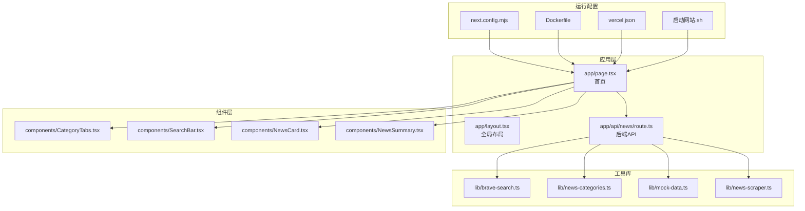
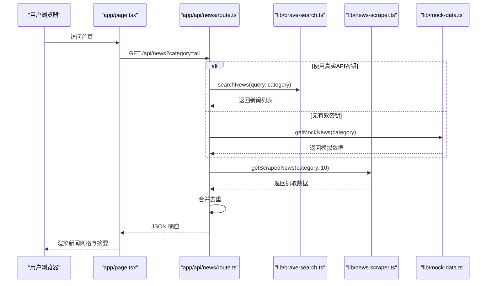
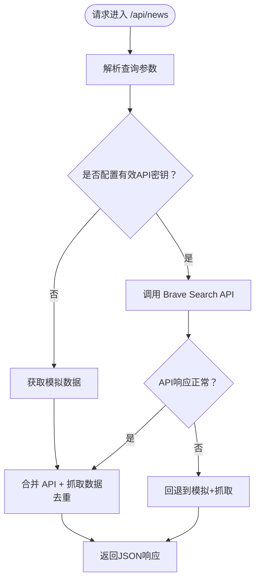
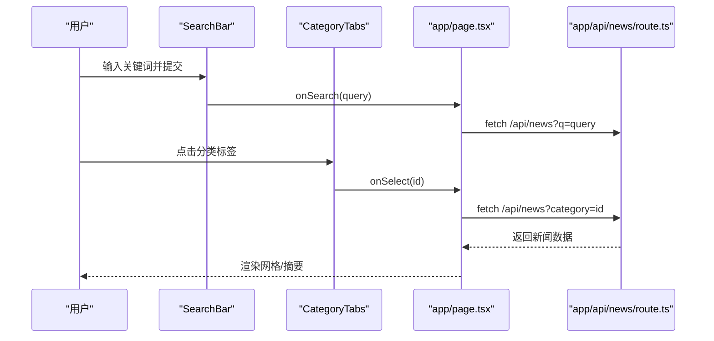
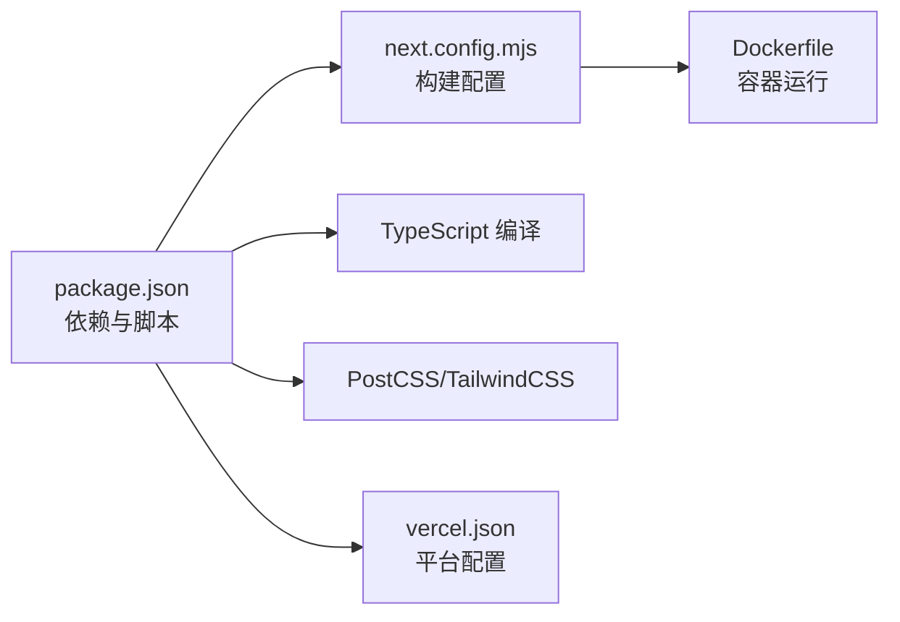

# 快速开始

<cite>
**本文引用的文件**
- [README.md](file://README.md)
- [package.json](file://package.json)
- [next.config.mjs](file://next.config.mjs)
- [启动网站.sh](file://启动网站.sh)
- [网站入口/启动说明.txt](file://网站入口/启动说明.txt)
- [Dockerfile](file://Dockerfile)
- [vercel.json](file://vercel.json)
- [app/layout.tsx](file://app/layout.tsx)
- [app/page.tsx](file://app/page.tsx)
- [app/api/news/route.ts](file://app/api/news/route.ts)
- [lib/brave-search.ts](file://lib/brave-search.ts)
- [lib/news-categories.ts](file://lib/news-categories.ts)
- [lib/mock-data.ts](file://lib/mock-data.ts)
- [lib/news-scraper.ts](file://lib/news-scraper.ts)
- [components/CategoryTabs.tsx](file://components/CategoryTabs.tsx)
- [components/SearchBar.tsx](file://components/SearchBar.tsx)
- [components/NewsCard.tsx](file://components/NewsCard.tsx)
- [components/NewsSummary.tsx](file://components/NewsSummary.tsx)
</cite>

## 目录
1. [简介](#简介)
2. [项目结构](#项目结构)
3. [核心组件](#核心组件)
4. [架构总览](#架构总览)
5. [详细组件分析](#详细组件分析)
6. [依赖关系分析](#依赖关系分析)
7. [性能注意事项](#性能注意事项)
8. [故障排查指南](#故障排查指南)
9. [结论](#结论)
10. [附录](#附录)

## 简介
本指南面向首次接触本新闻网站项目的开发者，帮助你在最短时间内完成环境准备、项目启动、真实数据接入与基础使用。项目基于 Next.js 16，采用 TypeScript，前端组件化设计，后端通过 Next.js App Router 的 API 路由提供数据聚合能力，支持分类浏览、今日摘要、关键词搜索与收藏功能。

## 项目结构
项目采用 Next.js App Router 结构，核心目录与职责如下：
- app：页面、全局样式与 API 路由
- components：UI 组件（分类标签、搜索栏、新闻卡片、摘要）
- lib：工具库（Brave Search API 封装、分类定义、模拟数据、网页抓取）
- 根目录：构建与运行配置（next.config.mjs、Dockerfile、vercel.json、启动脚本）

图表来源
- [app/page.tsx](file://app/page.tsx#L1-L153)
- [app/layout.tsx](file://app/layout.tsx#L1-L20)
- [app/api/news/route.ts](file://app/api/news/route.ts#L1-L136)
- [lib/brave-search.ts](file://lib/brave-search.ts#L1-L115)
- [lib/news-categories.ts](file://lib/news-categories.ts#L1-L45)
- [lib/mock-data.ts](file://lib/mock-data.ts#L1-L197)
- [lib/news-scraper.ts](file://lib/news-scraper.ts#L1-L166)
- [next.config.mjs](file://next.config.mjs#L1-L9)
- [Dockerfile](file://Dockerfile#L1-L16)
- [vercel.json](file://vercel.json#L1-L11)
- [启动网站.sh](file://启动网站.sh#L1-L9)

章节来源
- [README.md](file://README.md#L36-L48)
- [package.json](file://package.json#L1-L30)

## 核心组件
- 页面与布局：全局布局与首页负责渲染导航、搜索、分类、摘要与新闻网格。
- API 路由：统一处理分类与关键词查询，聚合 Brave Search 与网页抓取数据，支持回退到模拟数据。
- 工具库：封装 Brave Search 请求、分类关键词、模拟数据与网页抓取逻辑。
- 前端组件：分类标签、搜索栏、新闻卡片、摘要展示，支持收藏与加载态。

章节来源
- [app/layout.tsx](file://app/layout.tsx#L1-L20)
- [app/page.tsx](file://app/page.tsx#L1-L153)
- [app/api/news/route.ts](file://app/api/news/route.ts#L1-L136)
- [lib/brave-search.ts](file://lib/brave-search.ts#L1-L115)
- [lib/news-categories.ts](file://lib/news-categories.ts#L1-L45)
- [lib/mock-data.ts](file://lib/mock-data.ts#L1-L197)
- [lib/news-scraper.ts](file://lib/news-scraper.ts#L1-L166)
- [components/CategoryTabs.tsx](file://components/CategoryTabs.tsx#L1-L49)
- [components/SearchBar.tsx](file://components/SearchBar.tsx#L1-L37)
- [components/NewsCard.tsx](file://components/NewsCard.tsx#L1-L89)
- [components/NewsSummary.tsx](file://components/NewsSummary.tsx#L1-L54)

## 架构总览
系统采用前后端一体化的 Next.js 架构，API 路由位于服务端，负责数据聚合与错误回退；前端负责交互与展示。

图表来源
- [app/page.tsx](file://app/page.tsx#L19-L74)
- [app/api/news/route.ts](file://app/api/news/route.ts#L39-L135)
- [lib/brave-search.ts](file://lib/brave-search.ts#L30-L73)
- [lib/news-scraper.ts](file://lib/news-scraper.ts#L140-L153)
- [lib/mock-data.ts](file://lib/mock-data.ts#L194-L196)

## 详细组件分析

### 启动与运行
- 开发模式：推荐使用脚本或命令行启动开发服务器，支持热更新与调试。
- 访问地址：默认端口为 3000，若被占用自动切换至 3001/3002。
- 双击启动：Windows 用户可通过“启动网站.sh”所在目录的启动说明文件获取双击运行方式。

章节来源
- [README.md](file://README.md#L5-L11)
- [网站入口/启动说明.txt](file://网站入口/启动说明.txt#L5-L21)
- [启动网站.sh](file://启动网站.sh#L1-L9)

### 环境变量与真实数据接入
- 配置位置：根目录 .env.local 文件。
- 关键变量：BRAVE_API_KEY（Brave Search API 密钥）。
- 申请地址：Brave Search 官方搜索 API（每月免费额度 2000 次）。
- 生效机制：当未配置或使用示例值时，API 路由会回退到模拟数据与网页抓取数据。

章节来源
- [README.md](file://README.md#L24-L32)
- [app/api/news/route.ts](file://app/api/news/route.ts#L7-L11)
- [lib/brave-search.ts](file://lib/brave-search.ts#L27-L37)

### API 路由工作流
- 参数解析：支持 category 与 q（关键词）参数。
- 数据来源：
  - 真实模式：Brave Search API + 网页抓取。
  - 回退模式：模拟数据 + 网页抓取。
- 合并策略：以标题标准化后去重，优先保留 API 数据。
- 错误处理：API 失败时自动回退到模拟+抓取组合。

图表来源
- [app/api/news/route.ts](file://app/api/news/route.ts#L39-L135)

章节来源
- [app/api/news/route.ts](file://app/api/news/route.ts#L1-L136)

### 前端页面与组件交互
- 页面状态：管理新闻列表、加载状态、分类选择、搜索状态与收藏切换。
- 组件职责：
  - 分类标签：切换分类与收藏视图。
  - 搜索栏：提交关键词触发查询。
  - 新闻卡片：展示标题、来源、时间与收藏按钮。
  - 摘要：展示当日 Top 5 新闻。
- 加载与错误：提供骨架屏与错误提示。

图表来源
- [components/SearchBar.tsx](file://components/SearchBar.tsx#L9-L37)
- [components/CategoryTabs.tsx](file://components/CategoryTabs.tsx#L12-L49)
- [app/page.tsx](file://app/page.tsx#L49-L74)
- [app/api/news/route.ts](file://app/api/news/route.ts#L39-L135)

章节来源
- [app/page.tsx](file://app/page.tsx#L1-L153)
- [components/SearchBar.tsx](file://components/SearchBar.tsx#L1-L37)
- [components/CategoryTabs.tsx](file://components/CategoryTabs.tsx#L1-L49)
- [components/NewsCard.tsx](file://components/NewsCard.tsx#L1-L89)
- [components/NewsSummary.tsx](file://components/NewsSummary.tsx#L1-L54)

### 数据来源与抓取策略
- Brave Search：优先使用新闻搜索接口，失败则回退到网页搜索接口。
- 网页抓取：针对 Hacker News 的热门链接进行抓取，按分类返回。
- 模拟数据：在无有效密钥时提供稳定演示数据。

章节来源
- [lib/brave-search.ts](file://lib/brave-search.ts#L30-L115)
- [lib/news-scraper.ts](file://lib/news-scraper.ts#L1-L166)
- [lib/mock-data.ts](file://lib/mock-data.ts#L1-L197)

## 依赖关系分析
- 运行时依赖：Next.js、React、Cheerio（网页解析）。
- 开发依赖：TailwindCSS、PostCSS、TypeScript。
- 构建配置：启用独立输出（standalone），禁用图片优化以适配静态托管。
- 部署配置：Dockerfile 指定端口与运行命令；Vercel 配置框架与环境变量。

图表来源
- [package.json](file://package.json#L1-L30)
- [next.config.mjs](file://next.config.mjs#L1-L9)
- [Dockerfile](file://Dockerfile#L1-L16)
- [vercel.json](file://vercel.json#L1-L11)

章节来源
- [package.json](file://package.json#L1-L30)
- [next.config.mjs](file://next.config.mjs#L1-L9)
- [Dockerfile](file://Dockerfile#L1-L16)
- [vercel.json](file://vercel.json#L1-L11)

## 性能注意事项
- 并发获取：API 路由同时发起 Brave Search 与网页抓取请求，减少等待时间。
- 去重合并：以标题标准化后去重，避免重复新闻显示。
- 图片优化：构建配置禁用 Next.js 图片优化，便于静态部署与 CDN 加速。
- 本地缓存：收藏功能使用本地存储，减少重复请求。
- 端口与资源：开发端口自动切换，避免冲突；生产环境建议固定端口与健康检查。

章节来源
- [app/api/news/route.ts](file://app/api/news/route.ts#L44-L96)
- [lib/brave-search.ts](file://lib/brave-search.ts#L14-L37)
- [next.config.mjs](file://next.config.mjs#L4-L6)

## 故障排查指南
- 无法访问页面
  - 确认开发服务器已启动且端口未被占用。
  - 若端口 3000/3001/3002 被占用，系统会自动切换，查看控制台输出。
- 无新闻数据
  - 检查 .env.local 中 BRAVE_API_KEY 是否正确配置。
  - 若密钥无效或为空，将回退到模拟数据与抓取数据。
- API 请求失败
  - 查看控制台错误日志，确认网络连通与密钥有效性。
  - API 失败时会自动回退到模拟+抓取组合。
- Docker 运行异常
  - 确认镜像构建使用 standalone 输出，容器暴露端口与环境变量一致。
- Vercel 部署问题
  - 确认环境变量 BRAVE_API_KEY 已在平台配置中设置。

章节来源
- [网站入口/启动说明.txt](file://网站入口/启动说明.txt#L14-L21)
- [app/api/news/route.ts](file://app/api/news/route.ts#L7-L11)
- [lib/brave-search.ts](file://lib/brave-search.ts#L35-L37)
- [Dockerfile](file://Dockerfile#L9-L15)
- [vercel.json](file://vercel.json#L7-L9)

## 结论
本项目提供了从开发到生产的完整路径：一键启动、真实数据接入、并发数据聚合与回退策略、组件化 UI 设计与本地收藏功能。按照本指南完成环境准备与配置后，即可快速运行并理解基本使用流程。

## 附录

### 环境要求与安装步骤
- 环境要求
  - Node.js：使用 Node.js 18（容器与部署均采用该版本）。
  - 包管理器：npm（或 yarn）。
- 克隆与安装
  - 在项目根目录执行安装命令以下载依赖。
- 启动开发服务器
  - 方式一：双击“启动网站.sh”所在目录中的启动说明文件提供的双击方式。
  - 方式二：在项目根目录执行开发命令。
- 访问方式
  - 默认访问地址：http://localhost:3000
  - 若端口被占用，自动切换至 http://localhost:3001 或 http://localhost:3002

章节来源
- [启动网站.sh](file://启动网站.sh#L1-L9)
- [网站入口/启动说明.txt](file://网站入口/启动说明.txt#L5-L21)
- [package.json](file://package.json#L5-L10)

### 环境变量配置（Brave Search API 密钥）
- 在项目根目录创建 .env.local 文件，写入以下内容：
  - BRAVE_API_KEY=你的API密钥
- 申请地址：Brave Search 官方搜索 API（每月免费 2000 次调用）
- 生效验证：重启开发服务器后，首页将显示真实新闻数据

章节来源
- [README.md](file://README.md#L24-L32)
- [lib/brave-search.ts](file://lib/brave-search.ts#L27-L37)

### 生产环境部署准备
- Docker 镜像
  - 基于 node:18-alpine，复制 standalone 构建产物与静态资源。
  - 暴露端口 9000，默认运行 node server.js。
- Vercel 部署
  - 框架：Next.js
  - 构建命令：npm run build
  - 开发命令：npm run dev
  - 安装命令：npm install
  - 环境变量：BRAVE_API_KEY（在平台配置）

章节来源
- [Dockerfile](file://Dockerfile#L1-L16)
- [vercel.json](file://vercel.json#L1-L11)