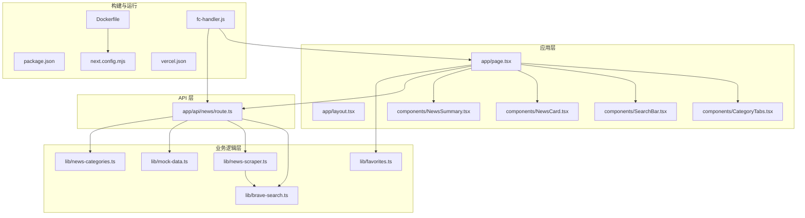
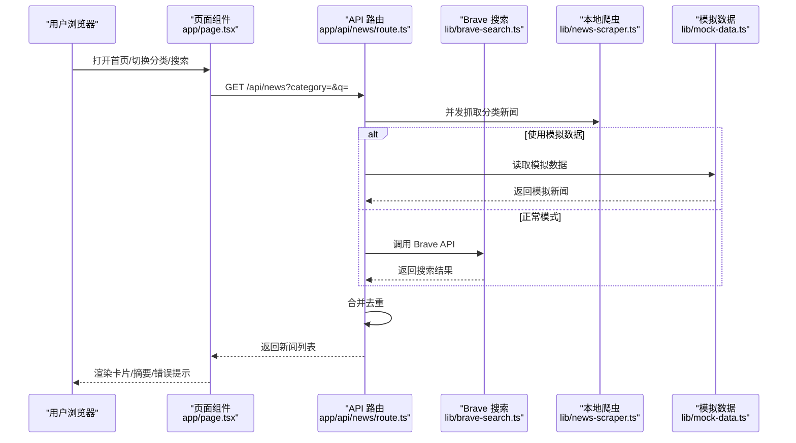
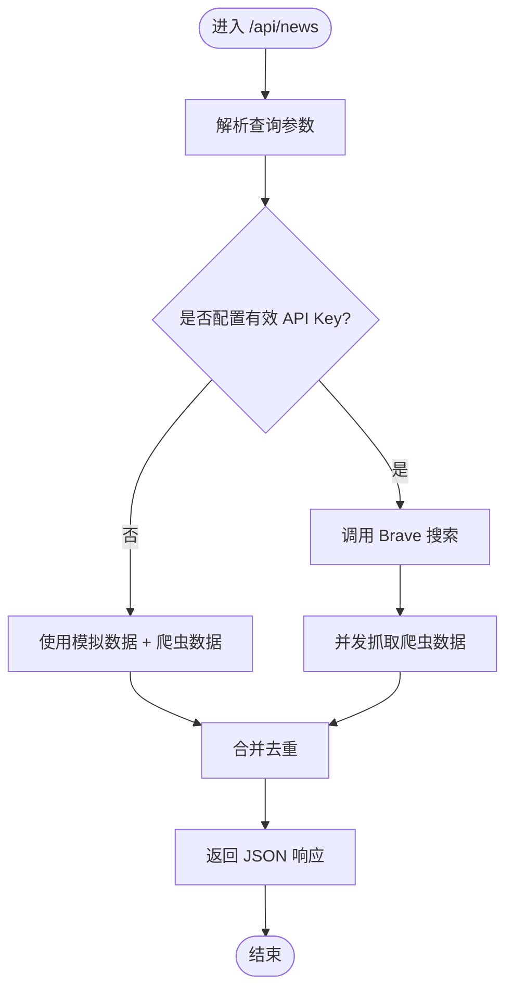
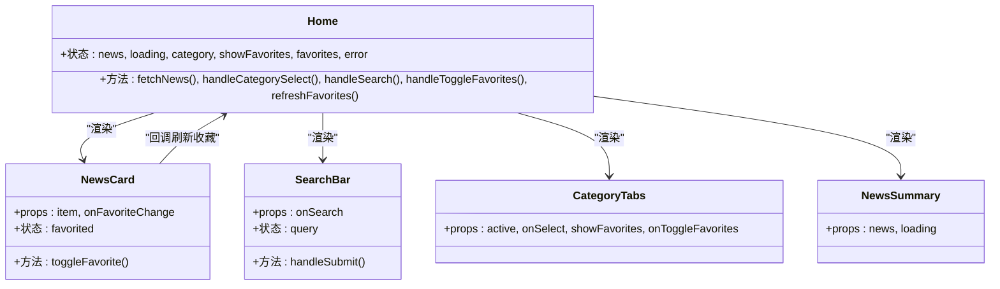
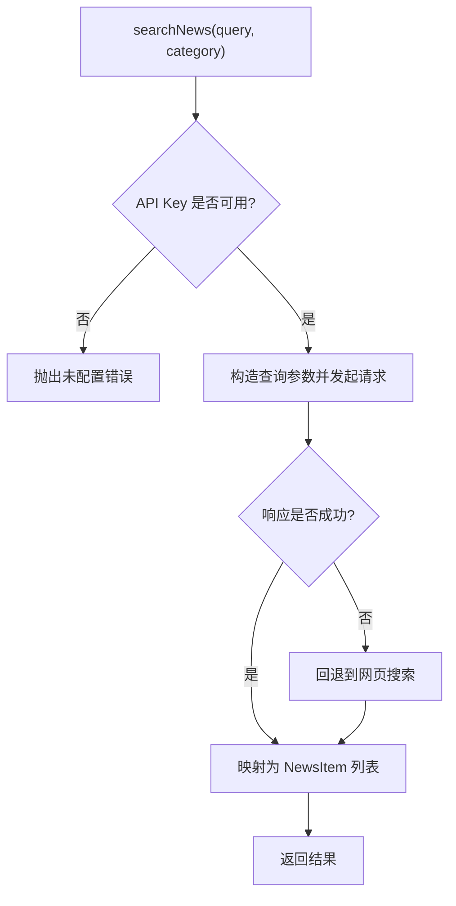
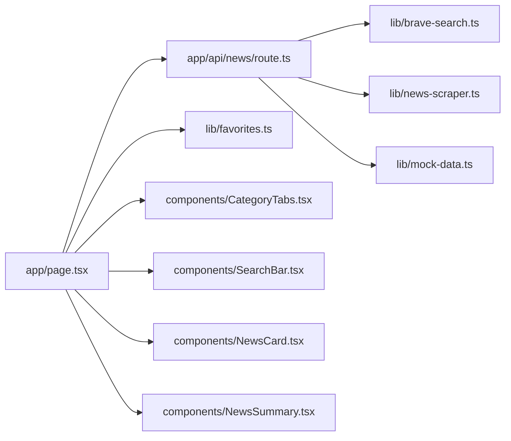

# 性能优化

<cite>
**本文引用的文件**
- [package.json](file://package.json)
- [next.config.mjs](file://next.config.mjs)
- [vercel.json](file://vercel.json)
- [Dockerfile](file://Dockerfile)
- [fc-handler.js](file://fc-handler.js)
- [app/layout.tsx](file://app/layout.tsx)
- [app/page.tsx](file://app/page.tsx)
- [app/api/news/route.ts](file://app/api/news/route.ts)
- [components/NewsCard.tsx](file://components/NewsCard.tsx)
- [components/CategoryTabs.tsx](file://components/CategoryTabs.tsx)
- [components/SearchBar.tsx](file://components/SearchBar.tsx)
- [components/NewsSummary.tsx](file://components/NewsSummary.tsx)
- [lib/brave-search.ts](file://lib/brave-search.ts)
- [lib/news-scraper.ts](file://lib/news-scraper.ts)
- [lib/favorites.ts](file://lib/favorites.ts)
- [lib/mock-data.ts](file://lib/mock-data.ts)
- [lib/news-categories.ts](file://lib/news-categories.ts)
- [app/globals.css](file://app/globals.css)
</cite>

## 目录
1. [引言](#引言)
2. [项目结构](#项目结构)
3. [核心组件](#核心组件)
4. [架构总览](#架构总览)
5. [详细组件分析](#详细组件分析)
6. [依赖关系分析](#依赖关系分析)
7. [性能考量](#性能考量)
8. [故障排查指南](#故障排查指南)
9. [结论](#结论)
10. [附录](#附录)

## 引言
本文件面向新闻网站的性能优化，结合现有代码库，系统梳理并提出可落地的优化策略与最佳实践，涵盖代码分割与懒加载、缓存策略、性能监控、图片优化、资源压缩与 CDN、SSR/CSR 水合优化、内存管理、性能测试与持续优化流程。文档以“渐进加深”的方式组织，既适合非技术读者快速了解，也为工程师提供深入的技术细节与可视化图示。

## 项目结构
该仓库采用 Next.js 应用结构，前端页面位于 app 目录，业务逻辑集中在 lib 与 components，API 路由位于 app/api。构建产物输出为 standalone，便于容器化部署；同时提供函数计算适配层 fc-handler.js 以适配特定运行环境。

图表来源
- [app/layout.tsx](file://app/layout.tsx#L1-L20)
- [app/page.tsx](file://app/page.tsx#L1-L153)
- [components/CategoryTabs.tsx](file://components/CategoryTabs.tsx#L1-L49)
- [components/SearchBar.tsx](file://components/SearchBar.tsx#L1-L37)
- [components/NewsCard.tsx](file://components/NewsCard.tsx#L1-L89)
- [components/NewsSummary.tsx](file://components/NewsSummary.tsx#L1-L54)
- [lib/brave-search.ts](file://lib/brave-search.ts#L1-L115)
- [lib/news-scraper.ts](file://lib/news-scraper.ts#L1-L166)
- [lib/favorites.ts](file://lib/favorites.ts#L1-L29)
- [lib/mock-data.ts](file://lib/mock-data.ts#L1-L197)
- [lib/news-categories.ts](file://lib/news-categories.ts#L1-L45)
- [app/api/news/route.ts](file://app/api/news/route.ts#L1-L136)
- [next.config.mjs](file://next.config.mjs#L1-L9)
- [vercel.json](file://vercel.json#L1-L11)
- [Dockerfile](file://Dockerfile#L1-L16)
- [fc-handler.js](file://fc-handler.js#L1-L125)

章节来源
- [package.json](file://package.json#L1-L30)
- [next.config.mjs](file://next.config.mjs#L1-L9)
- [vercel.json](file://vercel.json#L1-L11)
- [Dockerfile](file://Dockerfile#L1-L16)
- [fc-handler.js](file://fc-handler.js#L1-L125)

## 核心组件
- 页面与布局
  - 根布局负责全局样式与元信息，页面负责新闻列表、搜索、分类与收藏交互。
- 组件
  - 分类标签、搜索栏、新闻卡片、摘要展示等 UI 组件，均标记为客户端组件，便于交互与状态管理。
- 业务逻辑
  - Brave 搜索接口封装、本地爬虫抓取、收藏持久化、模拟数据与分类关键词。
- API 路由
  - 统一聚合 API 与爬虫数据，合并去重，支持查询参数与回退策略。

章节来源
- [app/layout.tsx](file://app/layout.tsx#L1-L20)
- [app/page.tsx](file://app/page.tsx#L1-L153)
- [components/CategoryTabs.tsx](file://components/CategoryTabs.tsx#L1-L49)
- [components/SearchBar.tsx](file://components/SearchBar.tsx#L1-L37)
- [components/NewsCard.tsx](file://components/NewsCard.tsx#L1-L89)
- [components/NewsSummary.tsx](file://components/NewsSummary.tsx#L1-L54)
- [lib/brave-search.ts](file://lib/brave-search.ts#L1-L115)
- [lib/news-scraper.ts](file://lib/news-scraper.ts#L1-L166)
- [lib/favorites.ts](file://lib/favorites.ts#L1-L29)
- [lib/mock-data.ts](file://lib/mock-data.ts#L1-L197)
- [lib/news-categories.ts](file://lib/news-categories.ts#L1-L45)
- [app/api/news/route.ts](file://app/api/news/route.ts#L1-L136)

## 架构总览
整体采用“客户端渲染 + 服务端聚合”的模式：页面通过 API 路由拉取数据，API 路由并发调用外部搜索与本地爬虫，合并结果返回给客户端。构建产物为 standalone，支持容器化部署；函数计算场景通过 fc-handler.js 代理到内部 Next 服务器。

图表来源
- [app/page.tsx](file://app/page.tsx#L19-L42)
- [app/api/news/route.ts](file://app/api/news/route.ts#L39-L135)
- [lib/brave-search.ts](file://lib/brave-search.ts#L30-L73)
- [lib/news-scraper.ts](file://lib/news-scraper.ts#L116-L138)
- [lib/mock-data.ts](file://lib/mock-data.ts#L194-L196)

## 详细组件分析

### API 路由与数据聚合
- 并发策略：同时触发爬虫与外部搜索，缩短首屏等待时间。
- 回退机制：当缺少有效 API Key 或外部接口异常时，回退到模拟数据与爬虫数据合并。
- 去重策略：基于标题标准化后的键集合去重，保证结果质量。
- 错误处理：捕获异常并返回包含回退数据的响应，确保用户体验稳定。

图表来源
- [app/api/news/route.ts](file://app/api/news/route.ts#L7-L135)

章节来源
- [app/api/news/route.ts](file://app/api/news/route.ts#L1-L136)

### 客户端渲染与交互组件
- 页面组件负责状态管理（新闻列表、加载、错误、分类、收藏）、事件处理（搜索、切换分类、收藏切换）与 UI 渲染。
- 新闻卡片组件负责收藏状态同步与回调通知。
- 搜索栏与分类标签提供用户交互入口。
- 摘要组件在加载态与空态下提供占位与提示。

图表来源
- [app/page.tsx](file://app/page.tsx#L11-L152)
- [components/NewsCard.tsx](file://components/NewsCard.tsx#L12-L27)
- [components/SearchBar.tsx](file://components/SearchBar.tsx#L9-L17)
- [components/CategoryTabs.tsx](file://components/CategoryTabs.tsx#L12-L46)
- [components/NewsSummary.tsx](file://components/NewsSummary.tsx#L10-L23)

章节来源
- [app/page.tsx](file://app/page.tsx#L1-L153)
- [components/NewsCard.tsx](file://components/NewsCard.tsx#L1-L89)
- [components/SearchBar.tsx](file://components/SearchBar.tsx#L1-L37)
- [components/CategoryTabs.tsx](file://components/CategoryTabs.tsx#L1-L49)
- [components/NewsSummary.tsx](file://components/NewsSummary.tsx#L1-L54)

### 外部搜索与本地爬虫
- 外部搜索：封装 Brave API 请求，支持回退到网页搜索，自动设置压缩与鉴权头。
- 本地爬虫：针对特定站点选择器解析，统一映射为新闻项结构，支持多分类。

图表来源
- [lib/brave-search.ts](file://lib/brave-search.ts#L30-L114)

章节来源
- [lib/brave-search.ts](file://lib/brave-search.ts#L1-L115)
- [lib/news-scraper.ts](file://lib/news-scraper.ts#L1-L166)

### 收藏与本地存储
- 使用 localStorage 存储收藏列表，避免服务端压力。
- 提供增删查与刷新回调，配合卡片组件实现即时状态更新。

章节来源
- [lib/favorites.ts](file://lib/favorites.ts#L1-L29)
- [components/NewsCard.tsx](file://components/NewsCard.tsx#L19-L27)

### 构建与运行配置
- 构建输出为 standalone，便于容器化部署。
- 函数计算适配层通过本地代理转发请求，预热启动 Next 服务器，减少冷启动延迟。

章节来源
- [next.config.mjs](file://next.config.mjs#L1-L9)
- [Dockerfile](file://Dockerfile#L1-L16)
- [fc-handler.js](file://fc-handler.js#L14-L41)

## 依赖关系分析
- 组件耦合
  - 页面组件与 API 路由强耦合于数据契约；组件间通过 props 与回调解耦。
- 外部依赖
  - Brave Search API 与第三方站点爬取，存在网络抖动与解析稳定性风险。
- 内部依赖
  - API 路由依赖搜索与爬虫模块；页面依赖收藏模块与组件库。

图表来源
- [app/page.tsx](file://app/page.tsx#L1-L153)
- [app/api/news/route.ts](file://app/api/news/route.ts#L1-L136)
- [lib/brave-search.ts](file://lib/brave-search.ts#L1-L115)
- [lib/news-scraper.ts](file://lib/news-scraper.ts#L1-L166)
- [lib/mock-data.ts](file://lib/mock-data.ts#L1-L197)
- [lib/favorites.ts](file://lib/favorites.ts#L1-L29)
- [components/CategoryTabs.tsx](file://components/CategoryTabs.tsx#L1-L49)
- [components/SearchBar.tsx](file://components/SearchBar.tsx#L1-L37)
- [components/NewsCard.tsx](file://components/NewsCard.tsx#L1-L89)
- [components/NewsSummary.tsx](file://components/NewsSummary.tsx#L1-L54)

## 性能考量

### 代码分割与懒加载
- 动态导入路由级组件与重型依赖，减少首屏 JS 体积。
- 将非关键路径的组件（如详情页、评论区）按需加载。
- 对图片与富文本内容采用懒加载策略，降低初始渲染压力。

### 缓存策略设计
- API 缓存
  - 针对分类新闻与搜索结果设置短期缓存（如 1-5 分钟），结合 ETag/Last-Modified 实现条件请求。
  - 对高频访问的分类与关键词建立缓存键空间，避免重复请求。
- 浏览器缓存
  - 静态资源启用长期缓存（immutable），Next 静态文件默认具备良好缓存策略。
- 服务端缓存
  - 在 API 层引入内存缓存（如 LRU），降低外部 API 压力与延迟。
- 回退与降级
  - 当外部 API 不可用时，优先返回缓存数据，再异步刷新。

### 图片优化
- 使用现代格式（WebP/AVIF）与合适的尺寸，按设备像素比选择资源。
- 对缩略图启用懒加载与占位符，避免阻塞主线程。
- 若使用 Next.js Image 组件，建议开启自动优化与无损压缩。

### 资源压缩与 CDN
- 启用 Gzip/Brotli 压缩，确保静态资源与 API 响应体被压缩。
- 使用 CDN 加速静态资源与 API 响应，就近分发降低 RTT。
- 对图片与字体资源进行缓存与压缩，减少带宽占用。

### SSR/CSR 水合优化
- 保持最小水合范围：仅对交互密集区域进行水合，其他区域采用静态 HTML。
- 使用 Suspense 边界包裹异步数据，实现渐进式渲染。
- 控制首屏渲染的节点数量与层级，避免深层嵌套导致的水合成本过高。

### 内存管理策略
- 及时清理定时器、事件监听器与订阅，避免内存泄漏。
- 对长列表采用虚拟滚动或分页加载，控制 DOM 节点规模。
- 使用 React.memo/useMemo/useCallback 降低不必要重渲染。

### 性能监控与指标
- 关键指标
  - FCP/LCP/FID/CLS/TTFB/TTI/INP 等 Web Vitals。
  - API 响应时间、缓存命中率、错误率与回退次数。
- 工具与埋点
  - 使用浏览器原生 Performance API 与 Web Vitals 库采集指标。
  - 在 API 层埋点记录请求耗时、缓存命中与回退路径。
- 报警与看板
  - 设置阈值报警，结合 APM 工具（如自建 Prometheus+Grafana）可视化趋势。

### 瓶颈识别与解决方案
- 瓶颈识别
  - 使用浏览器性能面板定位长任务与阻塞渲染的资源。
  - 通过 API 指标与日志分析慢请求与失败原因。
- 解决方案
  - 优化网络请求（并发合并、缓存、CDN）。
  - 减少首屏 JS 与 DOM 数量，提升渲染效率。
  - 对外部依赖进行降级与容错处理，保障稳定性。

### 性能测试与基准测试
- 自动化测试
  - 使用 Lighthouse/PA11y 进行可访问性与性能自动化检查。
  - 在 CI 中集成 Web Vitals 报告，形成回归基线。
- 基准测试
  - 使用 Browser Studio/Calibre 进行跨设备与网络场景的基准对比。
  - 对关键路径（首屏渲染、搜索响应）设定目标值并持续追踪。
- 持续优化流程
  - 建立“指标监控—问题定位—修复验证—回归基线”的闭环。
  - 定期复盘热点问题与回归风险，迭代优化策略。

## 故障排查指南
- API Key 未配置
  - 现象：返回模拟数据且标记 mock。
  - 排查：确认环境变量 BRAVE_API_KEY 是否正确注入。
- 外部接口异常
  - 现象：API 路由回退到模拟数据与爬虫数据合并。
  - 排查：查看 API 层错误日志与回退分支执行情况。
- 爬虫解析失败
  - 现象：部分分类新闻缺失或为空。
  - 排查：检查目标站点结构变更与选择器有效性。
- 函数计算冷启动
  - 现象：首次请求延迟较高。
  - 排查：确认 fc-handler.js 的预热逻辑与内部服务器就绪检测。

章节来源
- [app/api/news/route.ts](file://app/api/news/route.ts#L7-L135)
- [lib/brave-search.ts](file://lib/brave-search.ts#L35-L37)
- [fc-handler.js](file://fc-handler.js#L14-L41)

## 结论
本项目已具备良好的基础：稳定的客户端渲染、清晰的组件职责与 API 聚合层。后续可在“缓存与回退”“图片与资源优化”“CDN 与压缩”“SSR/水合优化”“监控与测试”等方面持续深化，形成可量化、可回归的性能优化体系，从而在保证体验的同时提升稳定性与可维护性。

## 附录
- 构建与部署
  - 使用 standalone 构建产物，配合 Dockerfile 进行容器化部署。
  - 函数计算场景通过 fc-handler.js 代理，预热启动以降低冷启动。
- 样式与主题
  - 全局样式基于 Tailwind，支持深色模式，注意在暗色背景下对占位动画与低对比度元素的可读性优化。

章节来源
- [next.config.mjs](file://next.config.mjs#L1-L9)
- [Dockerfile](file://Dockerfile#L1-L16)
- [fc-handler.js](file://fc-handler.js#L1-L125)
- [app/globals.css](file://app/globals.css#L1-L22)