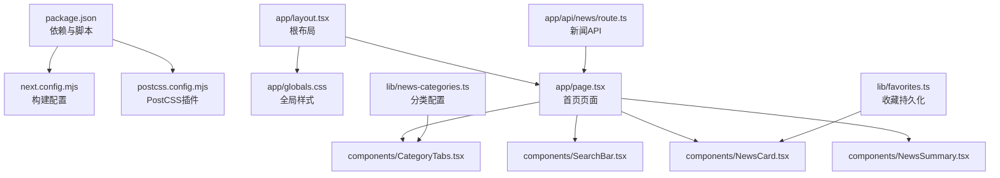
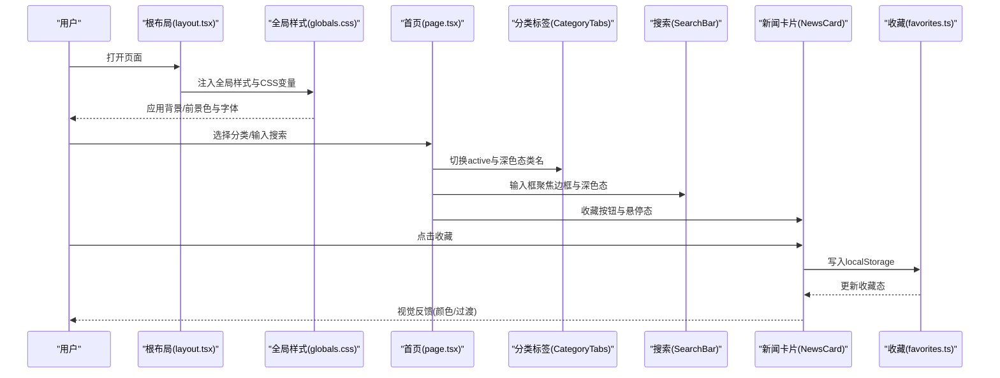
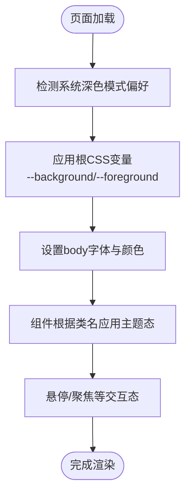
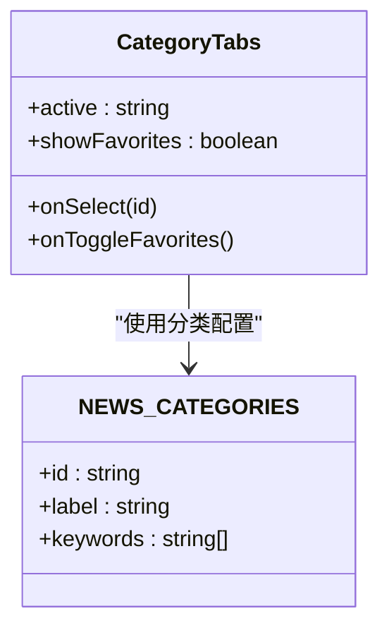
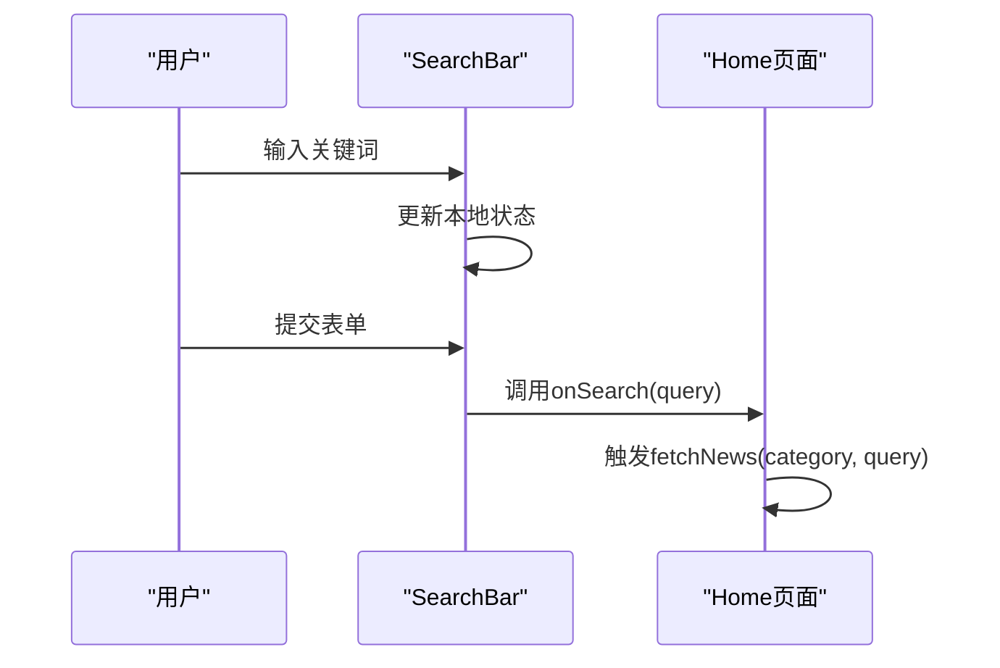
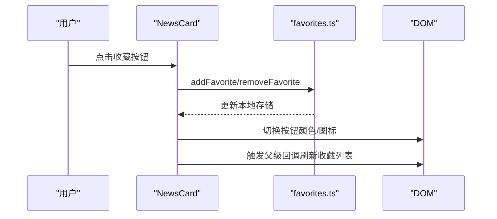
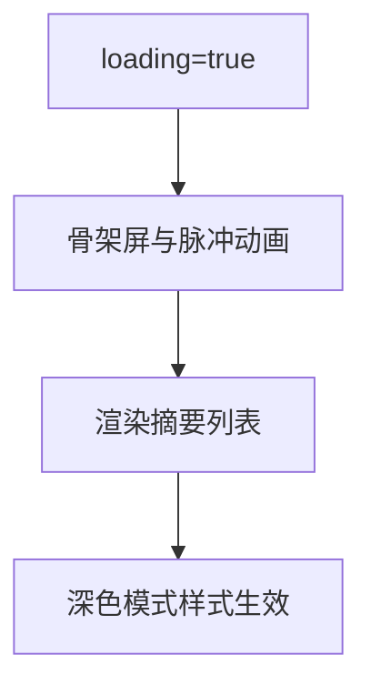
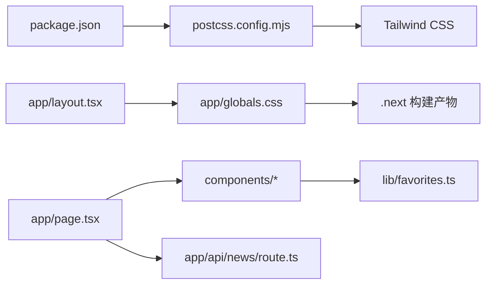

# UI主题定制

<cite>
**本文引用的文件**
- [package.json](file://package.json)
- [next.config.mjs](file://next.config.mjs)
- [postcss.config.mjs](file://postcss.config.mjs)
- [app/globals.css](file://app/globals.css)
- [app/layout.tsx](file://app/layout.tsx)
- [app/page.tsx](file://app/page.tsx)
- [components/NewsCard.tsx](file://components/NewsCard.tsx)
- [components/SearchBar.tsx](file://components/SearchBar.tsx)
- [components/CategoryTabs.tsx](file://components/CategoryTabs.tsx)
- [components/NewsSummary.tsx](file://components/NewsSummary.tsx)
- [lib/favorites.ts](file://lib/favorites.ts)
- [lib/news-categories.ts](file://lib/news-categories.ts)
- [app/api/news/route.ts](file://app/api/news/route.ts)
- [.next/dev/static/chunks/app_globals_71f961d1.css](file://.next/dev/static/chunks/app_globals_71f961d1.css)
</cite>

## 目录
1. [简介](#简介)
2. [项目结构](#项目结构)
3. [核心组件](#核心组件)
4. [架构总览](#架构总览)
5. [详细组件分析](#详细组件分析)
6. [依赖关系分析](#依赖关系分析)
7. [性能考虑](#性能考虑)
8. [故障排除指南](#故障排除指南)
9. [结论](#结论)
10. [附录](#附录)

## 简介
本指南围绕该新闻网站的UI主题定制展开，系统讲解如何基于Tailwind CSS进行主题配置、颜色系统与响应式设计的定制，以及组件样式覆盖、动画与交互状态管理。文档同时涵盖深色模式实现、字体系统与间距系统的定制方法，并解释主题切换机制、用户偏好存储与动态主题加载的最佳实践。为保证可操作性，文中提供可直接定位到源码位置的路径指引，帮助读者快速落地。

## 项目结构
该项目采用Next.js应用结构，使用Tailwind CSS作为原子化样式工具，并通过PostCSS插件链生成最终样式。全局样式在应用入口统一注入，组件层通过类名组合实现主题化外观。

图表来源
- [package.json](file://package.json#L1-L30)
- [next.config.mjs](file://next.config.mjs#L1-L10)
- [postcss.config.mjs](file://postcss.config.mjs#L1-L7)
- [app/layout.tsx](file://app/layout.tsx#L1-L20)
- [app/globals.css](file://app/globals.css#L1-L22)
- [app/page.tsx](file://app/page.tsx#L1-L153)
- [components/CategoryTabs.tsx](file://components/CategoryTabs.tsx#L1-L49)
- [components/SearchBar.tsx](file://components/SearchBar.tsx#L1-L37)
- [components/NewsCard.tsx](file://components/NewsCard.tsx#L1-L89)
- [components/NewsSummary.tsx](file://components/NewsSummary.tsx#L1-L54)
- [lib/favorites.ts](file://lib/favorites.ts#L1-L29)
- [lib/news-categories.ts](file://lib/news-categories.ts#L1-L45)
- [app/api/news/route.ts](file://app/api/news/route.ts#L1-L136)

章节来源
- [package.json](file://package.json#L1-L30)
- [next.config.mjs](file://next.config.mjs#L1-L10)
- [postcss.config.mjs](file://postcss.config.mjs#L1-L7)
- [app/layout.tsx](file://app/layout.tsx#L1-L20)

## 核心组件
- 全局样式与主题变量：通过CSS自定义属性定义背景与前景色，并结合系统深色模式偏好自动切换。
- 组件级主题化：各组件通过Tailwind类名组合实现浅色/深色双态与交互过渡。
- 收藏与分类：收藏状态持久化与分类标签切换驱动页面主题态变化。
- 动画与占位：骨架屏与过渡动画提升加载体验。

章节来源
- [app/globals.css](file://app/globals.css#L1-L22)
- [components/NewsCard.tsx](file://components/NewsCard.tsx#L1-L89)
- [components/SearchBar.tsx](file://components/SearchBar.tsx#L1-L37)
- [components/CategoryTabs.tsx](file://components/CategoryTabs.tsx#L1-L49)
- [components/NewsSummary.tsx](file://components/NewsSummary.tsx#L1-L54)
- [lib/favorites.ts](file://lib/favorites.ts#L1-L29)
- [lib/news-categories.ts](file://lib/news-categories.ts#L1-L45)

## 架构总览
下图展示从页面渲染到组件主题态生效的关键流程，包括深色模式检测、类名切换与动画过渡。

图表来源
- [app/layout.tsx](file://app/layout.tsx#L1-L20)
- [app/globals.css](file://app/globals.css#L1-L22)
- [app/page.tsx](file://app/page.tsx#L1-L153)
- [components/CategoryTabs.tsx](file://components/CategoryTabs.tsx#L1-L49)
- [components/SearchBar.tsx](file://components/SearchBar.tsx#L1-L37)
- [components/NewsCard.tsx](file://components/NewsCard.tsx#L1-L89)
- [lib/favorites.ts](file://lib/favorites.ts#L1-L29)

## 详细组件分析

### 全局样式与深色模式
- CSS变量：在根元素定义背景与前景色变量，配合系统深色模式媒体查询实现自动切换。
- 字体系统：在全局样式中声明中英文字体栈，确保跨平台一致性。
- Tailwind主题层：构建产物包含完整的颜色与间距变量层，支持暗色态下的hover与dark前缀类。

图表来源
- [app/globals.css](file://app/globals.css#L1-L22)
- [.next/dev/static/chunks/app_globals_71f961d1.css](file://.next/dev/static/chunks/app_globals_71f961d1.css#L57-L203)
- [.next/dev/static/chunks/app_globals_71f961d1.css](file://.next/dev/static/chunks/app_globals_71f961d1.css#L1432-L1448)

章节来源
- [app/globals.css](file://app/globals.css#L1-L22)
- [.next/dev/static/chunks/app_globals_71f961d1.css](file://.next/dev/static/chunks/app_globals_71f961d1.css#L57-L203)
- [.next/dev/static/chunks/app_globals_71f961d1.css](file://.next/dev/static/chunks/app_globals_71f961d1.css#L1432-L1448)

### 分类标签组件（CategoryTabs）
- 主题态：当前选中项与非选中项在浅色/深色模式下的背景与文本色不同；收藏按钮在激活时使用琥珀色强调。
- 响应式：使用sm与md断点控制标签滚动与间距。
- 交互：点击切换分类，支持显示收藏列表。

图表来源
- [components/CategoryTabs.tsx](file://components/CategoryTabs.tsx#L1-L49)
- [lib/news-categories.ts](file://lib/news-categories.ts#L1-L45)

章节来源
- [components/CategoryTabs.tsx](file://components/CategoryTabs.tsx#L1-L49)
- [lib/news-categories.ts](file://lib/news-categories.ts#L1-L45)

### 搜索栏组件（SearchBar）
- 主题态：输入框在浅色/深色模式下具备对比度良好的边框与占位符颜色；聚焦时蓝色边框强调。
- 交互：表单提交触发父级搜索逻辑，更新新闻列表。

图表来源
- [components/SearchBar.tsx](file://components/SearchBar.tsx#L1-L37)
- [app/page.tsx](file://app/page.tsx#L49-L52)

章节来源
- [components/SearchBar.tsx](file://components/SearchBar.tsx#L1-L37)
- [app/page.tsx](file://app/page.tsx#L49-L52)

### 新闻卡片组件（NewsCard）
- 收藏交互：按钮根据收藏状态切换星形图标与颜色；点击写入/移除localStorage。
- 主题态：卡片背景与边框在深色模式下变暗；链接与描述在深色模式下保持高对比度。
- 动画与过渡：悬停阴影增强、收藏按钮颜色过渡、标题链接悬停色变。

图表来源
- [components/NewsCard.tsx](file://components/NewsCard.tsx#L1-L89)
- [lib/favorites.ts](file://lib/favorites.ts#L1-L29)
- [app/page.tsx](file://app/page.tsx#L61-L63)

章节来源
- [components/NewsCard.tsx](file://components/NewsCard.tsx#L1-L89)
- [lib/favorites.ts](file://lib/favorites.ts#L1-L29)
- [app/page.tsx](file://app/page.tsx#L61-L63)

### 新闻摘要组件（NewsSummary）
- 占位动画：加载时使用骨架屏与脉冲动画提示内容即将呈现。
- 主题态：容器与文本在深色模式下具备合适的对比度。

图表来源
- [components/NewsSummary.tsx](file://components/NewsSummary.tsx#L1-L54)
- [.next/dev/static/chunks/app_globals_71f961d1.css](file://.next/dev/static/chunks/app_globals_71f961d1.css#L1204-L1239)

章节来源
- [components/NewsSummary.tsx](file://components/NewsSummary.tsx#L1-L54)
- [.next/dev/static/chunks/app_globals_71f961d1.css](file://.next/dev/static/chunks/app_globals_71f961d1.css#L1204-L1239)

### 页面布局与主题集成（Home）
- 布局：头部标题、日期、搜索栏与分类标签；摘要区与新闻网格；页脚。
- 主题态：标题、段落、边框与占位符在深色模式下自动适配。
- 错误提示：错误状态下使用红色系主题态提示。

章节来源
- [app/page.tsx](file://app/page.tsx#L73-L152)
- [.next/dev/static/chunks/app_globals_71f961d1.css](file://.next/dev/static/chunks/app_globals_71f961d1.css#L1281-L1327)

## 依赖关系分析
- 构建链路：package.json声明Tailwind与PostCSS依赖，postcss.config.mjs启用Tailwind插件，next.config.mjs输出独立部署包。
- 样式链路：app/layout.tsx引入app/globals.css，组件通过类名消费Tailwind变量与暗色态类。
- 运行时链路：页面组件调用API路由获取新闻数据，组件内部通过状态与本地存储实现主题态与收藏态联动。

图表来源
- [package.json](file://package.json#L1-L30)
- [postcss.config.mjs](file://postcss.config.mjs#L1-L7)
- [app/layout.tsx](file://app/layout.tsx#L1-L20)
- [app/globals.css](file://app/globals.css#L1-L22)
- [app/page.tsx](file://app/page.tsx#L1-L153)
- [components/NewsCard.tsx](file://components/NewsCard.tsx#L1-L89)
- [lib/favorites.ts](file://lib/favorites.ts#L1-L29)
- [app/api/news/route.ts](file://app/api/news/route.ts#L1-L136)

章节来源
- [package.json](file://package.json#L1-L30)
- [postcss.config.mjs](file://postcss.config.mjs#L1-L7)
- [app/layout.tsx](file://app/layout.tsx#L1-L20)
- [app/globals.css](file://app/globals.css#L1-L22)
- [app/page.tsx](file://app/page.tsx#L1-L153)
- [components/NewsCard.tsx](file://components/NewsCard.tsx#L1-L89)
- [lib/favorites.ts](file://lib/favorites.ts#L1-L29)
- [app/api/news/route.ts](file://app/api/news/route.ts#L1-L136)

## 性能考虑
- 构建优化：next.config.mjs启用独立输出，减少运行时体积与冷启动时间。
- 样式体积：Tailwind按需生成，建议在生产环境开启purge以进一步缩小CSS体积。
- 交互性能：组件内过渡与动画使用原生CSS，避免JavaScript动画阻塞主线程。
- 数据获取：API路由并发抓取多个数据源并合并，失败时回退至模拟数据，保障稳定性。

章节来源
- [next.config.mjs](file://next.config.mjs#L1-L10)
- [app/api/news/route.ts](file://app/api/news/route.ts#L44-L96)

## 故障排除指南
- 深色模式未生效
  - 检查系统深色模式偏好是否正确；确认根CSS变量与媒体查询是否被正确应用。
  - 参考路径：[app/globals.css](file://app/globals.css#L8-L13)、[app/globals.css](file://app/globals.css#L1444-L1448)
- 悬停/聚焦态异常
  - 确认hover与focus类是否在暗色态媒体查询中生效。
  - 参考路径：[app/globals.css](file://app/globals.css#L1-L22)、[.next/dev/static/chunks/app_globals_71f961d1.css](file://.next/dev/static/chunks/app_globals_71f961d1.css#L1204-L1239)
- 收藏状态不更新
  - 检查localStorage键值与写入逻辑；确认组件回调是否触发刷新。
  - 参考路径：[lib/favorites.ts](file://lib/favorites.ts#L5-L24)、[components/NewsCard.tsx](file://components/NewsCard.tsx#L19-L27)
- API请求失败
  - 查看API路由错误回退逻辑与错误提示区域。
  - 参考路径：[app/api/news/route.ts](file://app/api/news/route.ts#L112-L134)、[app/page.tsx](file://app/page.tsx#L108-L112)

章节来源
- [app/globals.css](file://app/globals.css#L8-L13)
- [app/globals.css](file://app/globals.css#L1444-L1448)
- [.next/dev/static/chunks/app_globals_71f961d1.css](file://.next/dev/static/chunks/app_globals_71f961d1.css#L1204-L1239)
- [lib/favorites.ts](file://lib/favorites.ts#L5-L24)
- [components/NewsCard.tsx](file://components/NewsCard.tsx#L19-L27)
- [app/api/news/route.ts](file://app/api/news/route.ts#L112-L134)
- [app/page.tsx](file://app/page.tsx#L108-L112)

## 结论
本项目以Tailwind CSS为核心，结合CSS变量与暗色模式媒体查询实现了简洁而强大的主题系统。组件通过类名组合实现主题态与交互态，API路由提供稳定的数据来源与回退策略。遵循本文档的定制方法，可在不破坏现有结构的前提下扩展颜色体系、字体与间距，并实现更丰富的主题切换与用户偏好存储方案。

## 附录

### 主题定制清单
- 颜色系统定制
  - 在全局样式中新增或覆盖CSS变量，参考：[app/globals.css](file://app/globals.css#L3-L6)
  - 使用Tailwind颜色变量映射，参考构建产物中的颜色层：[app_globals_71f961d1.css](file://.next/dev/static/chunks/app_globals_71f961d1.css#L57-L203)
- 响应式设计调整
  - 使用sm、md等断点类控制布局与间距，参考：[app/page.tsx](file://app/page.tsx#L115-L144)
  - 间距系统基于var(--spacing)变量，参考：[app_globals_71f961d1.css](file://.next/dev/static/chunks/app_globals_71f961d1.css#L495-L581)
- 组件样式覆盖
  - 在组件内通过类名组合覆盖默认样式，参考：[components/NewsCard.tsx](file://components/NewsCard.tsx#L29-L86)
- 动画与交互状态
  - 使用hover与transition类实现过渡，参考：[components/SearchBar.tsx](file://components/SearchBar.tsx#L20-L35)
  - 使用骨架屏与脉冲动画提升加载体验，参考：[components/NewsSummary.tsx](file://components/NewsSummary.tsx#L11-L22)
- 深色模式实现
  - 通过系统偏好与CSS变量实现自动切换，参考：[app/globals.css](file://app/globals.css#L8-L13)
  - 暗色态类在构建产物中广泛存在，参考：[app_globals_71f961d1.css](file://.next/dev/static/chunks/app_globals_71f961d1.css#L1281-L1327)
- 字体系统配置
  - 在全局样式中声明字体栈，参考：[app/globals.css](file://app/globals.css#L18-L21)
- 间距系统定制
  - 基于var(--spacing)的间距类广泛存在于构建产物中，参考：[app_globals_71f961d1.css](file://.next/dev/static/chunks/app_globals_71f961d1.css#L495-L581)
- 主题切换机制与用户偏好
  - 当前使用系统深色模式偏好；如需手动切换，可在根节点上增加用户态类并在全局样式中映射变量。
- 动态主题加载
  - 可在客户端初始化时读取用户偏好并设置根节点类，随后由CSS变量与暗色态媒体查询生效。