# 功能扩展指南

<cite>
**本文档引用的文件**
- [README.md](file://README.md)
- [package.json](file://package.json)
- [app/layout.tsx](file://app/layout.tsx)
- [app/page.tsx](file://app/page.tsx)
- [app/api/news/route.ts](file://app/api/news/route.ts)
- [lib/brave-search.ts](file://lib/brave-search.ts)
- [lib/favorites.ts](file://lib/favorites.ts)
- [lib/news-categories.ts](file://lib/news-categories.ts)
- [lib/mock-data.ts](file://lib/mock-data.ts)
- [components/SearchBar.tsx](file://components/SearchBar.tsx)
- [components/NewsCard.tsx](file://components/NewsCard.tsx)
- [components/CategoryTabs.tsx](file://components/CategoryTabs.tsx)
- [components/NewsSummary.tsx](file://components/NewsSummary.tsx)
- [next.config.mjs](file://next.config.mjs)
- [Dockerfile](file://Dockerfile)
- [vercel.json](file://vercel.json)
</cite>

## 目录
1. [简介](#简介)
2. [项目结构](#项目结构)
3. [核心组件](#核心组件)
4. [架构概览](#架构概览)
5. [详细组件分析](#详细组件分析)
6. [依赖关系分析](#依赖关系分析)
7. [性能考虑](#性能考虑)
8. [故障排除指南](#故障排除指南)
9. [结论](#结论)
10. [附录](#附录)

## 简介

这是一个基于 Next.js 的现代化新闻聚合网站，集成了实时新闻搜索、分类浏览、收藏功能和今日摘要等核心特性。项目采用前后端分离架构，通过 Brave Search API 获取实时新闻数据，并提供了完整的开发、测试和部署流程。

## 项目结构

该项目采用标准的 Next.js 应用程序结构，主要分为以下几个核心目录：

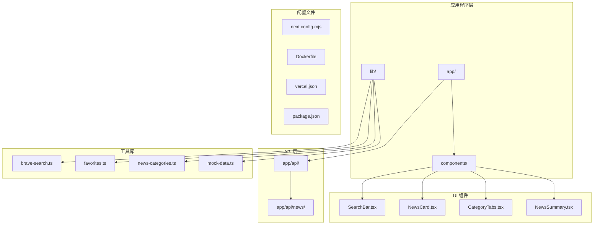

**图表来源**
- [app/layout.tsx](file://app/layout.tsx#L1-L20)
- [components/SearchBar.tsx](file://components/SearchBar.tsx#L1-L37)
- [lib/brave-search.ts](file://lib/brave-search.ts#L1-L115)

**章节来源**
- [README.md](file://README.md#L36-L48)
- [package.json](file://package.json#L1-L30)

## 核心组件

### 状态管理系统

项目采用 React Hooks 进行状态管理，主要状态包括：

- **新闻数据状态**: `news` - 存储从 API 获取的新闻列表
- **加载状态**: `loading` - 控制加载指示器显示
- **分类状态**: `category` - 当前选中的新闻分类
- **收藏状态**: `favorites` - 用户收藏的新闻列表
- **错误状态**: `error` - 错误信息存储

### 数据流架构

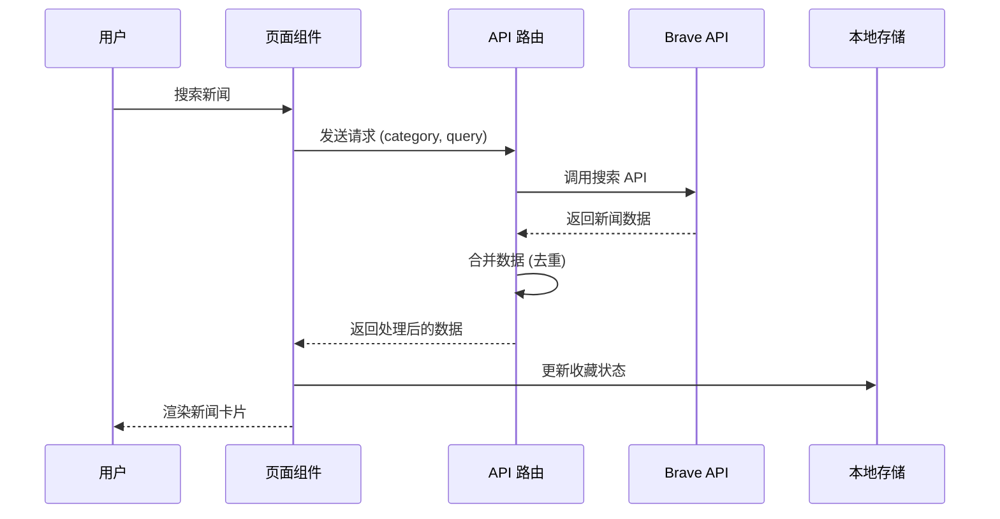

**图表来源**
- [app/page.tsx](file://app/page.tsx#L19-L38)
- [app/api/news/route.ts](file://app/api/news/route.ts#L39-L135)
- [lib/brave-search.ts](file://lib/brave-search.ts#L30-L73)

**章节来源**
- [app/page.tsx](file://app/page.tsx#L11-L72)
- [lib/favorites.ts](file://lib/favorites.ts#L1-L29)

## 架构概览

### 整体架构设计

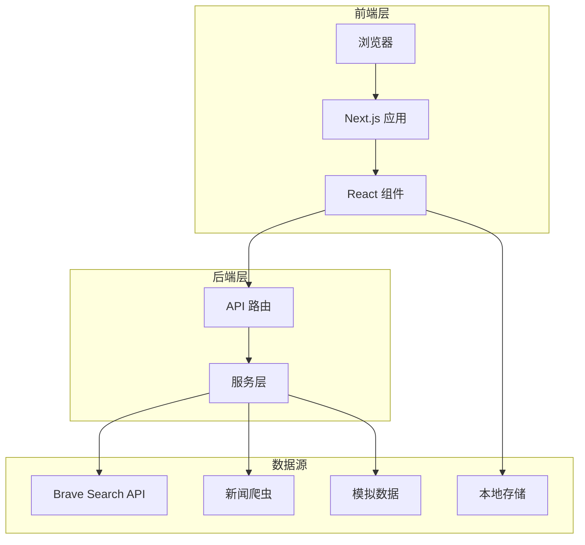

**图表来源**
- [app/api/news/route.ts](file://app/api/news/route.ts#L1-L136)
- [lib/brave-search.ts](file://lib/brave-search.ts#L1-L115)
- [lib/mock-data.ts](file://lib/mock-data.ts#L1-L197)

### 组件关系图

```mermaid
classDiagram
class HomePage {
+useState news
+useState loading
+useState category
+useState favorites
+fetchNews()
+handleSearch()
+handleToggleFavorites()
}
class NewsCard {
+useState favorited
+toggleFavorite()
+addFavorite()
+removeFavorite()
}
class SearchBar {
+useState query
+handleSubmit()
}
class CategoryTabs {
+handleSelect()
+onToggleFavorites()
}
class NewsSummary {
+topHeadlines
}
HomePage --> NewsCard : 使用
HomePage --> SearchBar : 包含
HomePage --> CategoryTabs : 包含
HomePage --> NewsSummary : 条件渲染
NewsCard --> Favorites : 操作
SearchBar --> HomePage : 回调
CategoryTabs --> HomePage : 回调
```

**图表来源**
- [app/page.tsx](file://app/page.tsx#L1-L153)
- [components/NewsCard.tsx](file://components/NewsCard.tsx#L1-L89)
- [components/SearchBar.tsx](file://components/SearchBar.tsx#L1-L37)
- [components/CategoryTabs.tsx](file://components/CategoryTabs.tsx#L1-L49)

## 详细组件分析

### 搜索功能扩展

#### 现有搜索实现分析

当前搜索功能通过以下组件协作实现：

1. **SearchBar 组件**: 提供用户输入界面
2. **页面状态管理**: 处理搜索参数和结果展示
3. **API 路由**: 统一处理搜索请求和数据合并

#### 搜索算法优化方案

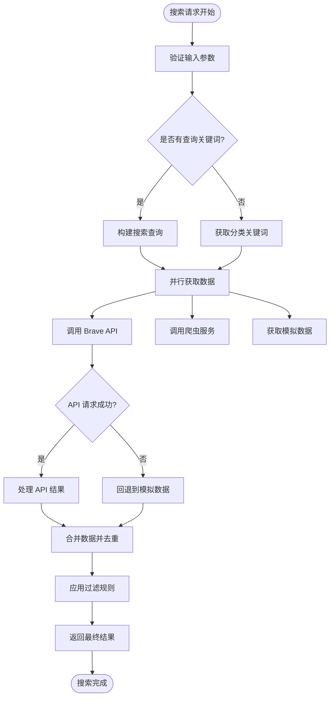

**图表来源**
- [app/api/news/route.ts](file://app/api/news/route.ts#L39-L135)
- [lib/brave-search.ts](file://lib/brave-search.ts#L30-L73)

**章节来源**
- [components/SearchBar.tsx](file://components/SearchBar.tsx#L1-L37)
- [app/page.tsx](file://app/page.tsx#L49-L52)

### 收藏功能扩展

#### 现有收藏机制分析

收藏功能通过本地存储实现，支持以下操作：

- **添加收藏**: `addFavorite()` - 防止重复添加
- **移除收藏**: `removeFavorite()` - 基于 URL 过滤
- **检查收藏**: `isFavorite()` - 快速状态判断
- **获取收藏**: `getFavorites()` - 本地数据读取

#### 收藏功能增强方案

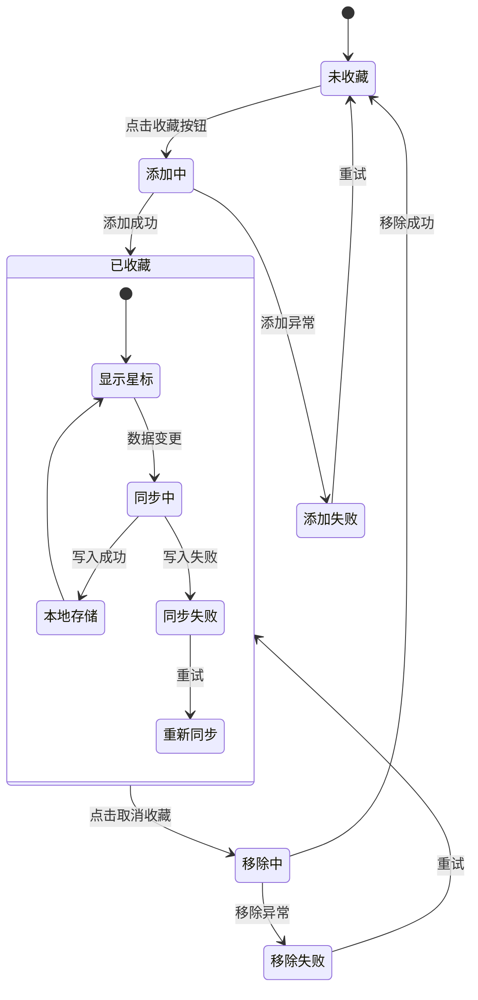

**图表来源**
- [lib/favorites.ts](file://lib/favorites.ts#L13-L24)
- [components/NewsCard.tsx](file://components/NewsCard.tsx#L19-L27)

**章节来源**
- [lib/favorites.ts](file://lib/favorites.ts#L1-L29)
- [components/NewsCard.tsx](file://components/NewsCard.tsx#L1-L89)

### 新组件开发指南

#### 新增组件开发流程

1. **组件设计**: 定义 props 接口和状态需求
2. **文件创建**: 在 `components/` 目录下创建新组件文件
3. **类型定义**: 在 `lib/` 目录下添加相应的 TypeScript 接口
4. **样式集成**: 使用 Tailwind CSS 类名保持一致性
5. **状态管理**: 通过 props 和回调函数与父组件通信
6. **测试验证**: 在页面中集成并测试功能

#### 组件开发最佳实践

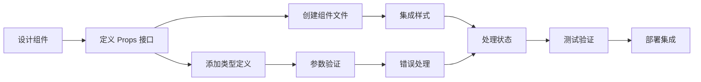

**章节来源**
- [components/CategoryTabs.tsx](file://components/CategoryTabs.tsx#L1-L49)
- [components/NewsSummary.tsx](file://components/NewsSummary.tsx#L1-L54)

### 业务逻辑增强

#### 分类系统扩展

当前分类系统支持四种主要分类，可通过以下方式扩展：

1. **新增分类**: 在 `news-categories.ts` 中添加新的分类项
2. **关键词优化**: 根据搜索效果调整分类关键词
3. **分类权重**: 实现分类重要性排序机制
4. **动态分类**: 支持根据时间动态调整分类内容

#### 数据处理优化

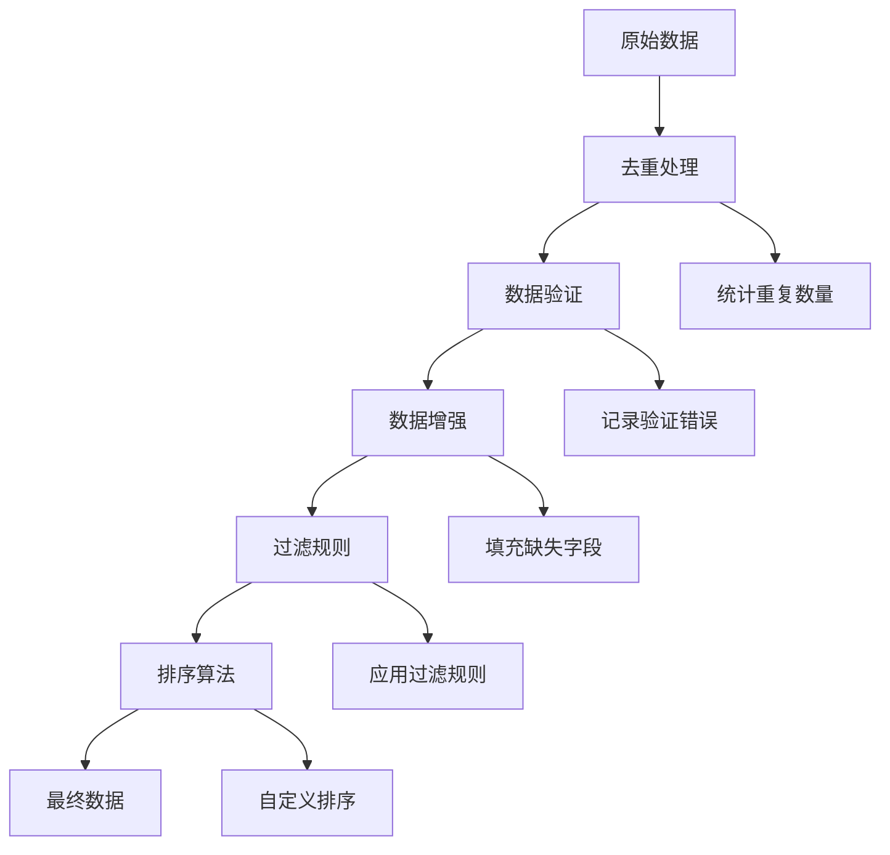

**图表来源**
- [app/api/news/route.ts](file://app/api/news/route.ts#L14-L37)
- [lib/news-categories.ts](file://lib/news-categories.ts#L1-L45)

**章节来源**
- [lib/news-categories.ts](file://lib/news-categories.ts#L1-L45)
- [app/api/news/route.ts](file://app/api/news/route.ts#L1-L136)

## 依赖关系分析

### 外部依赖关系

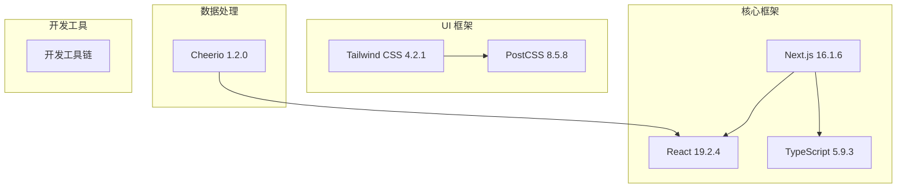

**图表来源**
- [package.json](file://package.json#L15-L28)

### 内部模块依赖

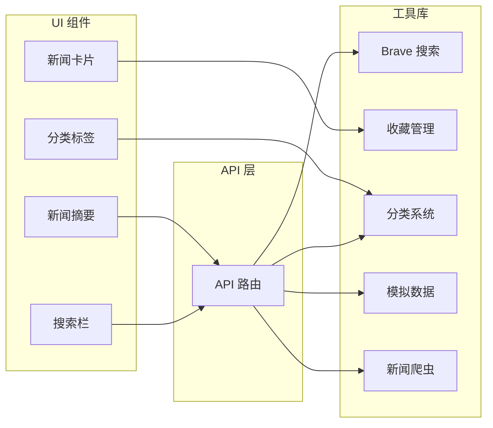

**图表来源**
- [app/api/news/route.ts](file://app/api/news/route.ts#L1-L6)
- [components/SearchBar.tsx](file://components/SearchBar.tsx#L1-L7)
- [components/NewsCard.tsx](file://components/NewsCard.tsx#L1-L10)

**章节来源**
- [package.json](file://package.json#L1-L30)

## 性能考虑

### 性能优化策略

#### 数据加载优化

1. **并行请求**: 使用 `Promise.all()` 并行获取多个数据源
2. **缓存机制**: 实现智能缓存减少重复请求
3. **懒加载**: 对图片和非关键资源实现懒加载
4. **虚拟滚动**: 对大量新闻列表实现虚拟滚动

#### 内存管理

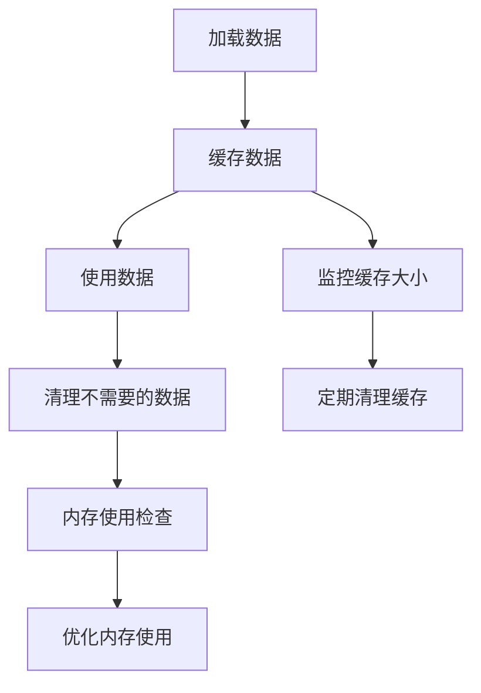

#### 前端性能优化

- **代码分割**: 利用 Next.js 的自动代码分割
- **图像优化**: 使用 `next/image` 组件优化图片加载
- **状态优化**: 合理使用 `useMemo` 和 `useCallback`
- **事件处理**: 实现防抖和节流机制

**章节来源**
- [app/api/news/route.ts](file://app/api/news/route.ts#L44-L96)
- [next.config.mjs](file://next.config.mjs#L1-L10)

## 故障排除指南

### 常见问题及解决方案

#### API 密钥配置问题

**问题**: Brave Search API 密钥未正确配置导致搜索失败

**解决方案**:
1. 检查 `.env.local` 文件是否正确配置
2. 验证 API 密钥格式和有效期
3. 确认网络连接正常
4. 查看控制台错误信息

#### 数据加载失败

**问题**: 新闻数据加载失败或显示为空

**排查步骤**:
1. 检查 API 响应状态码
2. 验证分类 ID 是否有效
3. 确认网络请求是否被阻止
4. 查看浏览器开发者工具中的网络请求

#### 收藏功能异常

**问题**: 收藏状态不同步或数据丢失

**解决方法**:
1. 检查浏览器是否启用本地存储
2. 验证 `localStorage` 权限设置
3. 确认数据序列化/反序列化正确
4. 查看浏览器控制台是否有错误信息

**章节来源**
- [lib/brave-search.ts](file://lib/brave-search.ts#L35-L37)
- [app/api/news/route.ts](file://app/api/news/route.ts#L8-L11)
- [lib/favorites.ts](file://lib/favorites.ts#L8-L10)

## 结论

本项目提供了一个完整的新闻聚合平台基础架构，具有良好的扩展性和可维护性。通过合理的组件设计、状态管理和数据流控制，为后续功能扩展奠定了坚实基础。

主要优势包括：
- 清晰的分层架构便于功能扩展
- 完善的错误处理机制提升稳定性
- 灵活的配置系统支持多种部署环境
- 丰富的开发工具链提高开发效率

## 附录

### 开发流程指南

#### 新功能开发标准流程

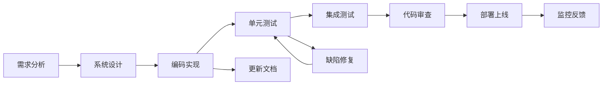

#### 测试策略

1. **单元测试**: 对核心函数和组件进行独立测试
2. **集成测试**: 验证组件间交互和数据流
3. **端到端测试**: 模拟用户操作流程
4. **性能测试**: 评估加载时间和响应速度
5. **兼容性测试**: 确保多浏览器和设备支持

#### 部署配置

**环境变量管理**:
- 开发环境: `.env.local`
- 生产环境: 通过平台环境变量管理
- Docker 环境: 通过 Dockerfile ENV 设置

**容器化部署**:
- 使用 Next.js Standalone 构建模式
- 基于 Alpine Linux 的轻量级镜像
- 支持多端口配置和主机绑定

**章节来源**
- [vercel.json](file://vercel.json#L1-L11)
- [Dockerfile](file://Dockerfile#L1-L16)
- [next.config.mjs](file://next.config.mjs#L1-L10)