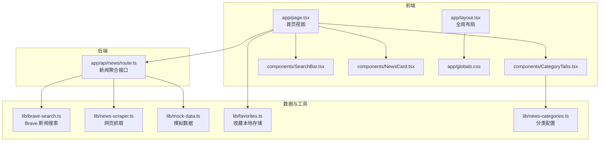
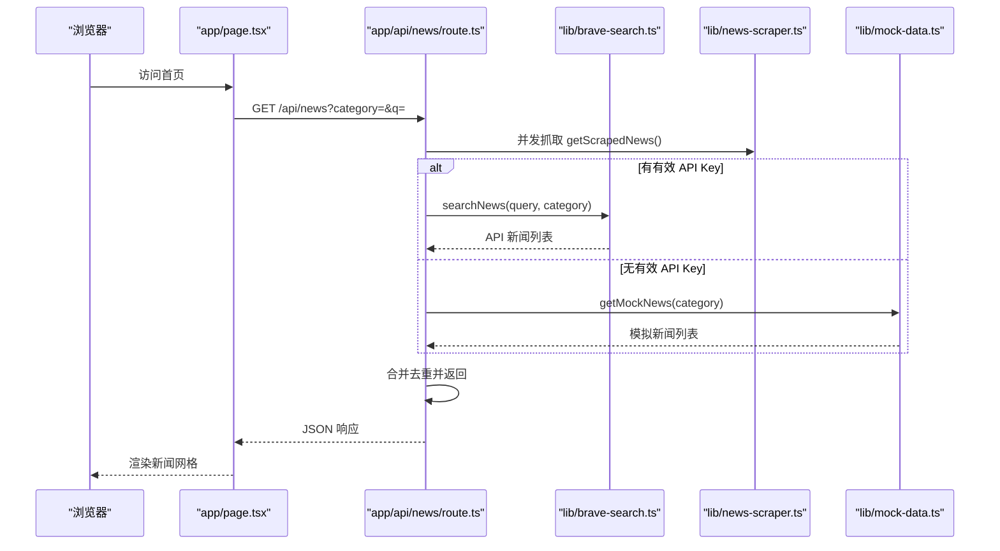
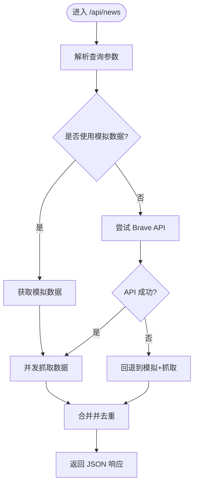
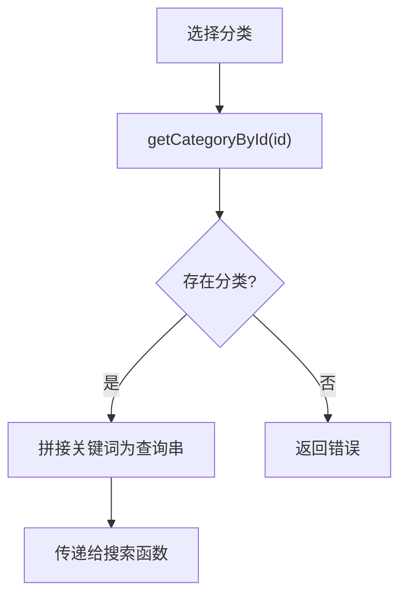
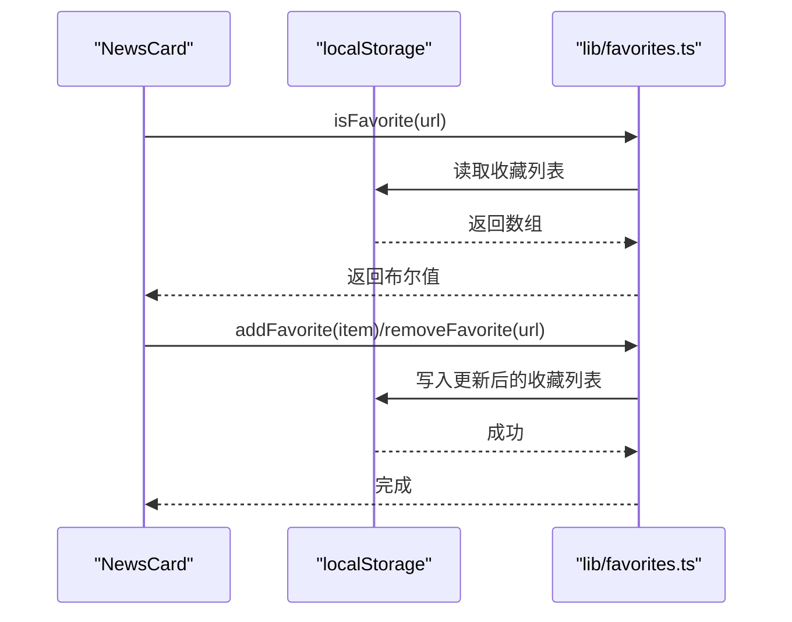
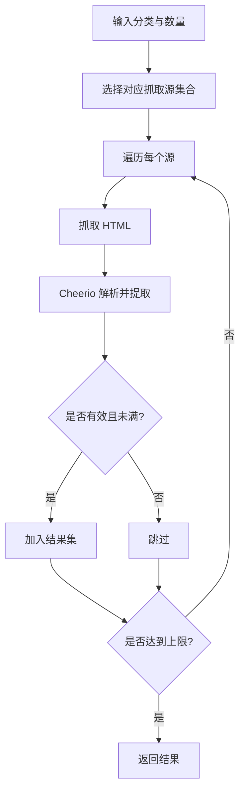
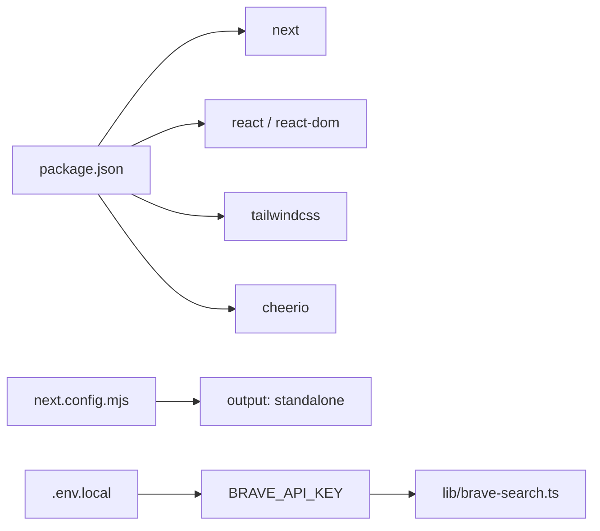

# 扩展和定制

<cite>
**本文引用的文件**
- [README.md](file://README.md)
- [package.json](file://package.json)
- [next.config.mjs](file://next.config.mjs)
- [app/layout.tsx](file://app/layout.tsx)
- [app/page.tsx](file://app/page.tsx)
- [app/api/news/route.ts](file://app/api/news/route.ts)
- [components/CategoryTabs.tsx](file://components/CategoryTabs.tsx)
- [components/SearchBar.tsx](file://components/SearchBar.tsx)
- [components/NewsCard.tsx](file://components/NewsCard.tsx)
- [lib/brave-search.ts](file://lib/brave-search.ts)
- [lib/news-categories.ts](file://lib/news-categories.ts)
- [lib/favorites.ts](file://lib/favorites.ts)
- [lib/mock-data.ts](file://lib/mock-data.ts)
- [lib/news-scraper.ts](file://lib/news-scraper.ts)
- [app/globals.css](file://app/globals.css)
</cite>

## 目录
1. [简介](#简介)
2. [项目结构](#项目结构)
3. [核心组件](#核心组件)
4. [架构总览](#架构总览)
5. [详细组件分析](#详细组件分析)
6. [依赖关系分析](#依赖关系分析)
7. [性能考量](#性能考量)
8. [故障排查指南](#故障排查指南)
9. [结论](#结论)
10. [附录](#附录)

## 简介
本指南面向需要扩展与定制该 AI 新闻网站的开发者，围绕以下目标展开：  
- 插件系统设计思路与扩展点识别  
- 新数据源接入方法（API 与网页抓取）  
- UI 主题与样式定制  
- 新功能开发流程与第三方 API 集成  
- 数据库扩展与持久化方案  
- 配置文件与环境变量扩展  
- 向后兼容性与版本管理、迁移策略  
- 最佳实践与常见扩展场景示例  

## 项目结构
该项目采用 Next.js App Router 结构，前端页面位于 app 目录，UI 组件位于 components 目录，业务逻辑与数据源封装在 lib 目录，全局样式通过 app/globals.css 引入。

图表来源
- [app/page.tsx](file://app/page.tsx#L1-L153)
- [app/layout.tsx](file://app/layout.tsx#L1-L20)
- [app/api/news/route.ts](file://app/api/news/route.ts#L1-L136)
- [lib/brave-search.ts](file://lib/brave-search.ts#L1-L115)
- [lib/news-scraper.ts](file://lib/news-scraper.ts#L1-L166)
- [lib/mock-data.ts](file://lib/mock-data.ts#L1-L197)
- [lib/favorites.ts](file://lib/favorites.ts#L1-L29)
- [lib/news-categories.ts](file://lib/news-categories.ts#L1-L45)
- [app/globals.css](file://app/globals.css#L1-L22)

章节来源
- [README.md](file://README.md#L36-L49)
- [package.json](file://package.json#L1-L30)
- [next.config.mjs](file://next.config.mjs#L1-L10)

## 核心组件
- 页面与交互层：app/page.tsx 负责状态管理、发起请求、渲染分类标签、搜索栏、新闻卡片与摘要；组件层由 CategoryTabs、SearchBar、NewsCard 提供交互与展示。
- 数据聚合层：app/api/news/route.ts 聚合 Brave API 与网页抓取结果，提供统一响应；当 API 密钥缺失或异常时回退到模拟数据与抓取数据。
- 数据源与工具：lib/brave-search.ts 封装 Brave 新闻搜索与网页搜索回退；lib/news-scraper.ts 基于 cheerio 抓取 Hacker News 并按分类解析；lib/mock-data.ts 提供离线模拟数据；lib/favorites.ts 使用 localStorage 实现收藏持久化；lib/news-categories.ts 定义分类与关键词。
- 样式与主题：app/globals.css 通过 CSS 变量与暗色模式适配，Tailwind 用于组件级样式。

章节来源
- [app/page.tsx](file://app/page.tsx#L1-L153)
- [components/CategoryTabs.tsx](file://components/CategoryTabs.tsx#L1-L49)
- [components/SearchBar.tsx](file://components/SearchBar.tsx#L1-L37)
- [components/NewsCard.tsx](file://components/NewsCard.tsx#L1-L89)
- [app/api/news/route.ts](file://app/api/news/route.ts#L1-L136)
- [lib/brave-search.ts](file://lib/brave-search.ts#L1-L115)
- [lib/news-scraper.ts](file://lib/news-scraper.ts#L1-L166)
- [lib/mock-data.ts](file://lib/mock-data.ts#L1-L197)
- [lib/favorites.ts](file://lib/favorites.ts#L1-L29)
- [lib/news-categories.ts](file://lib/news-categories.ts#L1-L45)
- [app/globals.css](file://app/globals.css#L1-L22)

## 架构总览
系统采用“前端页面 + 后端 API 路由 + 多数据源”的分层架构。前端通过 fetch 调用 /api/news，后端并行拉取 API 与抓取数据，合并去重后返回。

图表来源
- [app/page.tsx](file://app/page.tsx#L19-L63)
- [app/api/news/route.ts](file://app/api/news/route.ts#L39-L135)
- [lib/brave-search.ts](file://lib/brave-search.ts#L30-L73)
- [lib/news-scraper.ts](file://lib/news-scraper.ts#L140-L153)
- [lib/mock-data.ts](file://lib/mock-data.ts#L194-L196)

## 详细组件分析

### API 聚合与回退机制
- 并行抓取：同时触发 getScrapedNews 以提升响应速度。
- 回退策略：当 API Key 缺失或无效时，使用模拟数据与抓取数据合并；当 API 请求异常时，同样回退到模拟+抓取组合。
- 合并与去重：以标题标准化为键进行去重，优先保留 API 数据，再追加抓取数据，并标注来源类型。

图表来源
- [app/api/news/route.ts](file://app/api/news/route.ts#L39-L135)

章节来源
- [app/api/news/route.ts](file://app/api/news/route.ts#L1-L136)

### 分类与关键词配置
- 分类定义：通过 NEWS_CATEGORIES 提供分类 ID、显示标签与关键词数组；getCategoryById 根据 ID 获取分类信息。
- 关键词拼接：未提供搜索词时，将分类关键词以 OR 方式拼接为查询串，提高召回率。

图表来源
- [lib/news-categories.ts](file://lib/news-categories.ts#L42-L44)
- [app/api/news/route.ts](file://app/api/news/route.ts#L76-L90)

章节来源
- [lib/news-categories.ts](file://lib/news-categories.ts#L1-L45)
- [app/api/news/route.ts](file://app/api/news/route.ts#L76-L90)

### 收藏功能与本地存储
- 本地存储：使用 localStorage 存储收藏列表，键名固定；提供增删查方法。
- UI 交互：NewsCard 中根据当前条目 URL 判断是否已收藏，点击切换并回调刷新父组件收藏列表。

图表来源
- [components/NewsCard.tsx](file://components/NewsCard.tsx#L12-L27)
- [lib/favorites.ts](file://lib/favorites.ts#L1-L29)

章节来源
- [components/NewsCard.tsx](file://components/NewsCard.tsx#L1-L89)
- [lib/favorites.ts](file://lib/favorites.ts#L1-L29)

### 网页抓取与解析
- 配置驱动：SCRAPER_SOURCES 以分类为键，配置不同站点、选择器与解析器。
- 并发抓取：对每个分类并行抓取，限制数量并过滤无效链接。
- 解析器：针对不同分类返回统一 NewsItem 结构，便于后续合并。

图表来源
- [lib/news-scraper.ts](file://lib/news-scraper.ts#L5-L91)
- [lib/news-scraper.ts](file://lib/news-scraper.ts#L116-L153)

章节来源
- [lib/news-scraper.ts](file://lib/news-scraper.ts#L1-L166)

### UI 主题与样式定制
- 全局样式：app/globals.css 引入 Tailwind，定义 CSS 变量以支持浅色/深色模式切换。
- 组件样式：各组件通过 Tailwind 类实现响应式布局与交互态，如悬停阴影、按钮状态等。
- 扩展建议：新增主题可通过修改 CSS 变量或引入新的 CSS 模块；组件样式变更集中在对应组件文件。

章节来源
- [app/globals.css](file://app/globals.css#L1-L22)
- [components/NewsCard.tsx](file://components/NewsCard.tsx#L29-L87)
- [components/CategoryTabs.tsx](file://components/CategoryTabs.tsx#L18-L46)
- [components/SearchBar.tsx](file://components/SearchBar.tsx#L19-L35)

## 依赖关系分析
- 前端依赖：Next.js、React、TailwindCSS、cheerio。
- 运行配置：next.config.mjs 设置输出为独立包、禁用图片优化等。
- 环境变量：BRAVE_API_KEY 由 .env.local 提供，用于 Brave API 认证。

图表来源
- [package.json](file://package.json#L15-L28)
- [next.config.mjs](file://next.config.mjs#L1-L10)
- [lib/brave-search.ts](file://lib/brave-search.ts#L27-L28)

章节来源
- [package.json](file://package.json#L1-L30)
- [next.config.mjs](file://next.config.mjs#L1-L10)
- [README.md](file://README.md#L24-L32)

## 性能考量
- 并发请求：API 层对抓取与搜索并行执行，减少整体等待时间。
- 去重策略：基于标题标准化去重，避免重复渲染与提升用户体验。
- 回退机制：API 失败时自动回退到模拟+抓取，保障可用性。
- 图片与构建：next.config.mjs 禁用图片优化，适合静态部署场景；生产构建与启动脚本见 package.json。

章节来源
- [app/api/news/route.ts](file://app/api/news/route.ts#L44-L96)
- [lib/brave-search.ts](file://lib/brave-search.ts#L55-L58)
- [next.config.mjs](file://next.config.mjs#L1-L10)
- [package.json](file://package.json#L5-L9)

## 故障排查指南
- API 密钥问题：若未配置或使用占位值，将启用模拟数据；检查 .env.local 是否正确写入 BRAVE_API_KEY。
- 网络异常：Brave API 请求失败时会回退到模拟+抓取；若仍失败，检查网络连通性与密钥有效性。
- 抓取失败：网页抓取可能因目标站点结构变化或反爬策略导致失败；可在 lib/news-scraper.ts 中调整选择器或解析器。
- 收藏异常：localStorage 在隐私模式或受限环境下不可用；可提示用户开启权限或改用服务端存储。
- 分类无效：传入非法分类 ID 时后端返回错误；确保前端传递的分类 ID 来自 lib/news-categories.ts。

章节来源
- [app/api/news/route.ts](file://app/api/news/route.ts#L7-L11)
- [app/api/news/route.ts](file://app/api/news/route.ts#L82-L88)
- [lib/brave-search.ts](file://lib/brave-search.ts#L35-L37)
- [lib/news-scraper.ts](file://lib/news-scraper.ts#L132-L135)
- [lib/favorites.ts](file://lib/favorites.ts#L8-L10)

## 结论
本项目提供了清晰的扩展点与可定制空间：  
- 通过 API 路由可无缝接入新数据源并实现回退与合并；  
- 组件层与样式层分离，便于主题与交互扩展；  
- 分类与关键词配置集中，易于新增分类；  
- 本地收藏与抓取模块可按需替换为服务端存储与更丰富的抓取策略。  
遵循本文档的扩展流程与最佳实践，可安全地实现新功能、第三方集成与长期演进。

## 附录

### 扩展与定制清单
- 新增数据源（API/抓取）：在 app/api/news/route.ts 中合并新源；在 lib/brave-search.ts 或新增文件中封装请求；在 lib/news-scraper.ts 中新增站点配置。
- 新增分类：在 lib/news-categories.ts 中添加分类项，前端 CategoryTabs 会自动渲染。
- UI 主题定制：在 app/globals.css 中调整 CSS 变量与暗色模式规则；组件样式在对应组件文件中维护。
- 第三方 API 集成：在 lib/brave-search.ts 或新增文件中封装请求与回退逻辑；在 app/api/news/route.ts 中调用并合并。
- 数据库扩展：将 localStorage 替换为服务端存储（如数据库），在 lib/favorites.ts 中实现 CRUD；在 NewsCard 中保持调用方式不变。
- 配置文件与环境变量：在 .env.local 中新增键值；在 lib/*.ts 中读取 process.env.*；在 next.config.mjs 中配置构建行为。
- 向后兼容与版本管理：保持接口返回字段稳定；新增字段时保留默认值；对破坏性变更使用版本化路径（如 /api/news/v2）。
- 迁移策略：对现有收藏与抓取数据提供导入脚本；在 API 层对旧字段做映射；逐步替换旧实现。

### 开发流程示例
- 新增分类“健康”：  
  1) 在 lib/news-categories.ts 中添加分类项；  
  2) 在 app/api/news/route.ts 中处理该分类关键词；  
  3) 在 lib/news-scraper.ts 中为该分类配置抓取源；  
  4) 在 app/page.tsx 中确认分类标签渲染正常；  
  5) 如需 API 数据，新增对应数据源封装并在 API 路由中合并。
- 集成第三方新闻 API：  
  1) 在 lib/brave-search.ts 中新增 searchXXXNews 函数；  
  2) 在 app/api/news/route.ts 中调用并合并返回；  
  3) 在 UI 中显示来源标识与跳转链接。
- 数据库存储收藏：  
  1) 设计收藏表结构（用户、URL、标题、描述、时间戳）；  
  2) 在 lib/favorites.ts 中实现服务端 CRUD；  
  3) 在 NewsCard 中保持调用方式一致，UI 不受影响。