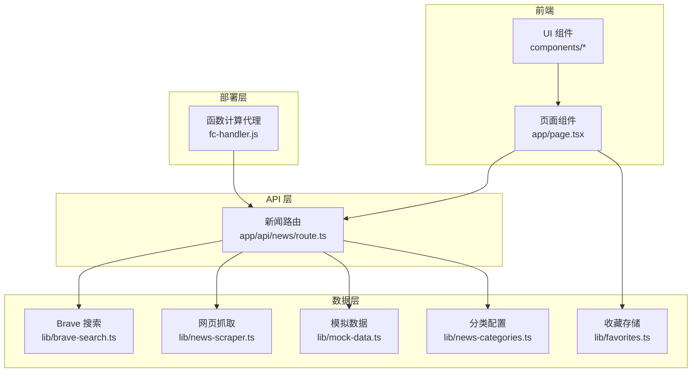
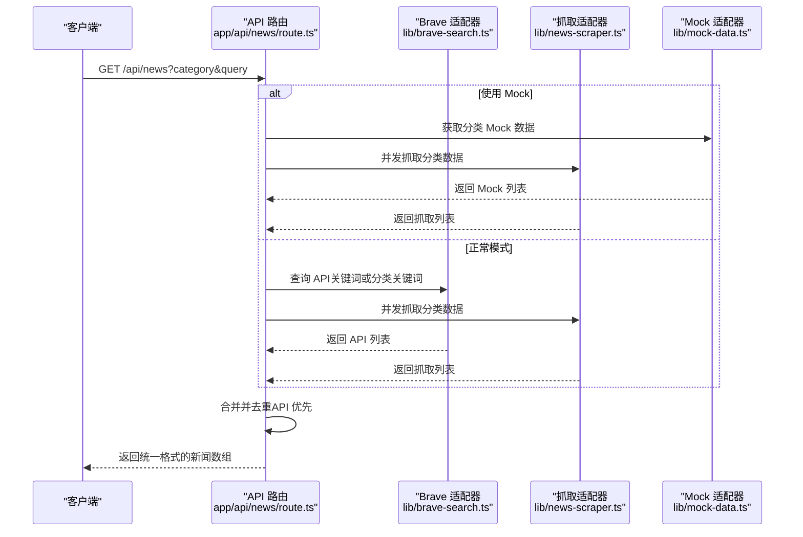
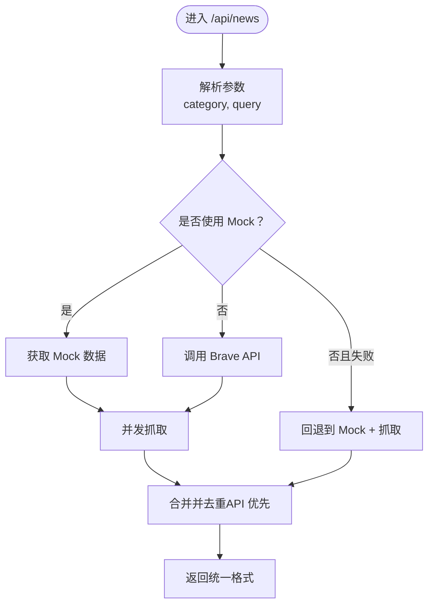
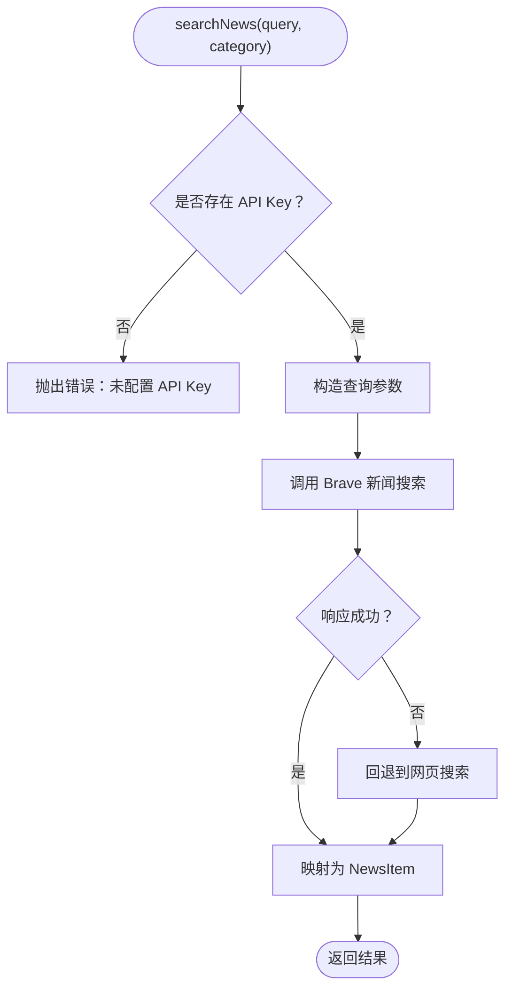
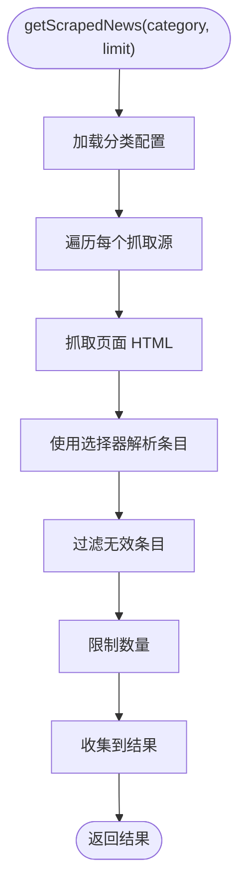
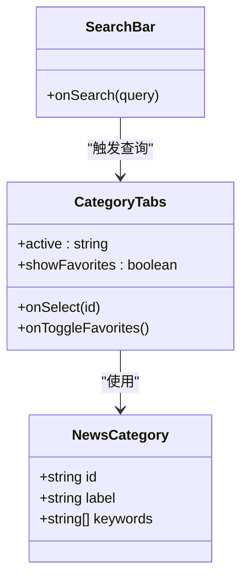
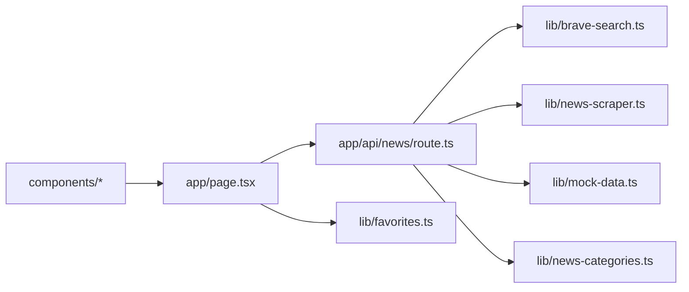

# 插件系统设计

<cite>
**本文档引用的文件**
- [package.json](file://package.json)
- [README.md](file://README.md)
- [app/api/news/route.ts](file://app/api/news/route.ts)
- [lib/brave-search.ts](file://lib/brave-search.ts)
- [lib/news-scraper.ts](file://lib/news-scraper.ts)
- [lib/mock-data.ts](file://lib/mock-data.ts)
- [lib/news-categories.ts](file://lib/news-categories.ts)
- [lib/favorites.ts](file://lib/favorites.ts)
- [fc-handler.js](file://fc-handler.js)
- [app/page.tsx](file://app/page.tsx)
- [components/CategoryTabs.tsx](file://components/CategoryTabs.tsx)
- [components/SearchBar.tsx](file://components/SearchBar.tsx)
- [components/NewsCard.tsx](file://components/NewsCard.tsx)
- [components/NewsSummary.tsx](file://components/NewsSummary.tsx)
</cite>

## 目录
1. [引言](#引言)
2. [项目结构](#项目结构)
3. [核心组件](#核心组件)
4. [架构总览](#架构总览)
5. [详细组件分析](#详细组件分析)
6. [依赖关系分析](#依赖关系分析)
7. [性能考量](#性能考量)
8. [故障排查指南](#故障排查指南)
9. [结论](#结论)
10. [附录](#附录)

## 引言
本设计文档围绕现有新闻网站的“插件化”扩展需求，系统阐述如何以最小侵入的方式扩展新的新闻数据源与API集成。当前项目已具备两类数据源：基于 Brave Search 的官方 API 与基于网页抓取的爬虫数据；同时提供 Mock 数据用于离线演示。本文将定义插件接口规范、适配器模式、扩展点识别、注册与生命周期管理、错误处理策略以及动态加载/卸载机制，并给出新数据源集成流程与最佳实践。

## 项目结构
项目采用 Next.js 应用结构，核心扩展点集中在以下目录与文件：
- API 层：app/api/news/route.ts 提供统一入口，聚合多数据源
- 数据层：lib 下的各类模块负责具体数据获取与转换
- 前端层：app/page.tsx 及 components 子目录负责展示与交互
- 部署层：fc-handler.js 提供函数计算环境下的代理与预热

图表来源
- [app/api/news/route.ts](file://app/api/news/route.ts#L1-L136)
- [lib/brave-search.ts](file://lib/brave-search.ts#L1-L115)
- [lib/news-scraper.ts](file://lib/news-scraper.ts#L1-L166)
- [lib/mock-data.ts](file://lib/mock-data.ts#L1-L197)
- [lib/news-categories.ts](file://lib/news-categories.ts#L1-L45)
- [lib/favorites.ts](file://lib/favorites.ts#L1-L29)
- [fc-handler.js](file://fc-handler.js#L1-L133)

章节来源
- [package.json](file://package.json#L1-L30)
- [README.md](file://README.md#L1-L49)

## 核心组件
- 新闻数据模型：统一的 NewsItem 结构，包含标题、描述、URL、来源、发布时间、缩略图、分类等字段
- 数据源适配器：
  - BraveSearchAdapter：封装 Brave Search API 的查询与回退逻辑
  - ScraperAdapter：封装网页抓取逻辑与分类解析
  - MockAdapter：提供离线演示用的静态数据
- 聚合器：合并多源数据，去重并标注来源类型
- 分类系统：集中管理分类 ID、标签与关键词
- 收藏系统：基于浏览器本地存储的用户偏好管理
- API 路由：统一入口，根据环境变量与参数选择数据源与回退策略

章节来源
- [lib/brave-search.ts](file://lib/brave-search.ts#L1-L115)
- [lib/news-scraper.ts](file://lib/news-scraper.ts#L1-L166)
- [lib/mock-data.ts](file://lib/mock-data.ts#L1-L197)
- [lib/news-categories.ts](file://lib/news-categories.ts#L1-L45)
- [lib/favorites.ts](file://lib/favorites.ts#L1-L29)
- [app/api/news/route.ts](file://app/api/news/route.ts#L1-L136)

## 架构总览
整体架构采用“适配器 + 聚合器”的模式，API 路由作为控制中心，按需并发拉取各数据源，并在异常时自动回退到可用数据源。前端通过标准 REST 接口消费统一格式的数据。

图表来源
- [app/api/news/route.ts](file://app/api/news/route.ts#L39-L135)
- [lib/brave-search.ts](file://lib/brave-search.ts#L30-L73)
- [lib/news-scraper.ts](file://lib/news-scraper.ts#L140-L153)
- [lib/mock-data.ts](file://lib/mock-data.ts#L194-L196)

## 详细组件分析

### 组件 A：API 路由与聚合器
- 控制流要点
  - 参数解析：从查询字符串读取分类与关键词
  - Mock 判定：当未配置有效 API Key 时，强制使用 Mock + 抓取数据
  - 并发执行：API 查询与抓取并行，提升响应速度
  - 错误回退：API 失败时回退到 Mock + 抓取
  - 数据合并：优先保留 API 条目，再追加抓取条目，避免重复
- 扩展点
  - 在 Mock 判定与错误回退处插入新的数据源适配器
  - 在并发执行与合并逻辑中接入新适配器
- 生命周期
  - 初始化：读取环境变量与分类配置
  - 请求期：按需加载数据源，返回统一结果
  - 错误期：触发回退策略，保证可用性

图表来源
- [app/api/news/route.ts](file://app/api/news/route.ts#L39-L135)

章节来源
- [app/api/news/route.ts](file://app/api/news/route.ts#L1-L136)

### 组件 B：Brave Search 适配器
- 职责
  - 将关键词或分类映射为查询参数
  - 调用 Brave Search API 获取新闻结果
  - 当新闻搜索不可用时，回退到网页搜索
  - 统一输出 NewsItem 数组
- 错误处理
  - 缺失 API Key：抛出明确错误
  - HTTP 失败：回退到网页搜索；若仍失败则抛出错误
- 性能特性
  - 单次请求返回固定数量的结果
  - 使用压缩与精简参数减少带宽

图表来源
- [lib/brave-search.ts](file://lib/brave-search.ts#L30-L114)

章节来源
- [lib/brave-search.ts](file://lib/brave-search.ts#L1-L115)

### 组件 C：网页抓取适配器
- 职责
  - 针对不同分类配置抓取源与选择器
  - 解析 HTML 并提取新闻条目
  - 限制每类抓取数量，保证性能
- 扩展点
  - 新增分类配置项，即可接入新的新闻站点
  - 自定义解析器，适配不同站点结构
- 错误处理
  - 单站点失败不影响其他站点
  - 抓取异常被吞并并记录日志，保证整体可用性

图表来源
- [lib/news-scraper.ts](file://lib/news-scraper.ts#L116-L153)

章节来源
- [lib/news-scraper.ts](file://lib/news-scraper.ts#L1-L166)

### 组件 D：Mock 数据适配器
- 职责
  - 提供各分类的静态示例数据
  - 用于开发、演示与离线场景
- 使用场景
  - API Key 未配置或不可用时的默认数据源
  - 单元测试与前端联调

章节来源
- [lib/mock-data.ts](file://lib/mock-data.ts#L1-L197)

### 组件 E：分类系统与前端交互
- 分类系统
  - 定义分类 ID、显示标签与关键词集合
  - 提供按 ID 查询分类的工具方法
- 前端交互
  - 顶部分类标签切换
  - 搜索栏关键词查询
  - 收藏切换与本地存储

图表来源
- [lib/news-categories.ts](file://lib/news-categories.ts#L1-L45)
- [components/CategoryTabs.tsx](file://components/CategoryTabs.tsx#L1-L49)
- [components/SearchBar.tsx](file://components/SearchBar.tsx#L1-L37)

章节来源
- [lib/news-categories.ts](file://lib/news-categories.ts#L1-L45)
- [components/CategoryTabs.tsx](file://components/CategoryTabs.tsx#L1-L49)
- [components/SearchBar.tsx](file://components/SearchBar.tsx#L1-L37)

### 组件 F：收藏系统
- 职责
  - 基于浏览器本地存储管理用户收藏
  - 提供添加、移除、查询与读取收藏的方法
- 与前端集成
  - 在新闻卡片中提供收藏按钮
  - 在首页切换“我的收藏”视图

章节来源
- [lib/favorites.ts](file://lib/favorites.ts#L1-L29)
- [components/NewsCard.tsx](file://components/NewsCard.tsx#L1-L89)
- [app/page.tsx](file://app/page.tsx#L1-L153)

### 组件 G：部署与代理
- 职责
  - 在函数计算环境中启动并代理 Next.js 服务
  - 预热内部服务器，轮询等待就绪
  - 代理请求与响应，设置必要头部，处理超时与错误
- 生命周期
  - 初始化：启动内部服务器并等待就绪
  - 请求期：代理到内部服务，流式转发响应
  - 错误期：返回标准错误码与提示信息

章节来源
- [fc-handler.js](file://fc-handler.js#L1-L133)

## 依赖关系分析
- 模块耦合
  - API 路由依赖数据层适配器，但不直接依赖具体实现细节
  - 数据层适配器之间相互独立，便于替换与扩展
  - 前端仅依赖统一的 REST 接口，不关心后端数据源细节
- 外部依赖
  - Brave Search API：需要有效的订阅密钥
  - cheerio：用于网页解析
- 循环依赖
  - 未发现循环导入；各模块职责清晰

图表来源
- [app/api/news/route.ts](file://app/api/news/route.ts#L1-L136)
- [lib/brave-search.ts](file://lib/brave-search.ts#L1-L115)
- [lib/news-scraper.ts](file://lib/news-scraper.ts#L1-L166)
- [lib/mock-data.ts](file://lib/mock-data.ts#L1-L197)
- [lib/news-categories.ts](file://lib/news-categories.ts#L1-L45)
- [lib/favorites.ts](file://lib/favorites.ts#L1-L29)
- [app/page.tsx](file://app/page.tsx#L1-L153)
- [components/CategoryTabs.tsx](file://components/CategoryTabs.tsx#L1-L49)
- [components/SearchBar.tsx](file://components/SearchBar.tsx#L1-L37)
- [components/NewsCard.tsx](file://components/NewsCard.tsx#L1-L89)
- [components/NewsSummary.tsx](file://components/NewsSummary.tsx#L1-L54)

## 性能考量
- 并发优化：API 查询与抓取并行执行，缩短首字节时间
- 去重策略：以标题标准化为键进行去重，避免重复展示
- 限流与缓存：当前未实现缓存，建议在适配器层引入轻量缓存与 TTL
- 网络健壮性：API 失败自动回退到 Mock + 抓取，保障可用性
- 前端渲染：骨架屏与懒加载提升用户体验

## 故障排查指南
- API Key 未配置或无效
  - 现象：强制使用 Mock 数据，或 API 调用失败
  - 排查：确认环境变量与配置文件
  - 参考路径：[app/api/news/route.ts](file://app/api/news/route.ts#L7-L11)，[lib/brave-search.ts](file://lib/brave-search.ts#L27-L37)
- Brave API 响应异常
  - 现象：API 失败，触发回退
  - 排查：检查网络连通性与订阅状态
  - 参考路径：[lib/brave-search.ts](file://lib/brave-search.ts#L55-L58)，[app/api/news/route.ts](file://app/api/news/route.ts#L112-L134)
- 抓取失败
  - 现象：抓取站点不可用或解析失败
  - 排查：查看日志与站点结构变化
  - 参考路径：[lib/news-scraper.ts](file://lib/news-scraper.ts#L132-L135)
- 前端无法获取数据
  - 现象：页面空白或错误提示
  - 排查：检查网络面板与 API 返回
  - 参考路径：[app/page.tsx](file://app/page.tsx#L19-L38)

章节来源
- [app/api/news/route.ts](file://app/api/news/route.ts#L7-L11)
- [lib/brave-search.ts](file://lib/brave-search.ts#L27-L37)
- [lib/brave-search.ts](file://lib/brave-search.ts#L55-L58)
- [lib/news-scraper.ts](file://lib/news-scraper.ts#L132-L135)
- [app/page.tsx](file://app/page.tsx#L19-L38)

## 结论
当前项目已具备良好的扩展基础：统一的数据模型、清晰的适配器边界与聚合器控制流。通过定义插件接口规范与适配器模式，可以低成本地接入新的数据源（如 RSS、第三方聚合平台、自建 API），并在运行时动态选择与回退，确保系统稳定性与可维护性。

## 附录

### 插件接口规范（建议）
- 适配器接口
  - 输入：查询关键词、分类标识、数量限制
  - 输出：NewsItem[]，包含统一字段
  - 异常：抛出可识别的错误类型
- 注册机制
  - 在路由层维护适配器注册表，按名称或类别选择
  - 支持动态启用/禁用与优先级排序
- 生命周期
  - 初始化：读取配置与认证信息
  - 请求期：执行查询与转换
  - 销毁：释放资源（如连接池、缓存）
- 错误处理
  - 区分网络错误、解析错误与业务错误
  - 提供回退策略与熔断保护

### 新数据源集成流程（步骤）
- 定义适配器
  - 实现统一接口，封装查询与转换逻辑
  - 处理鉴权与参数构造
- 配置扩展点
  - 在路由层注册适配器
  - 配置分类映射与回退策略
- 测试与验证
  - 单元测试覆盖正常与异常路径
  - 端到端验证聚合与去重效果
- 部署与监控
  - 部署后观察延迟、成功率与错误日志
  - 设置告警阈值与自动回退

### 最佳实践
- 保持数据模型稳定，新增字段使用可选属性
- 为每个适配器实现独立的超时与重试策略
- 在适配器层做幂等与去重，避免上游重复
- 使用环境变量与配置文件管理密钥与开关
- 对外部依赖做健康检查与熔断降级