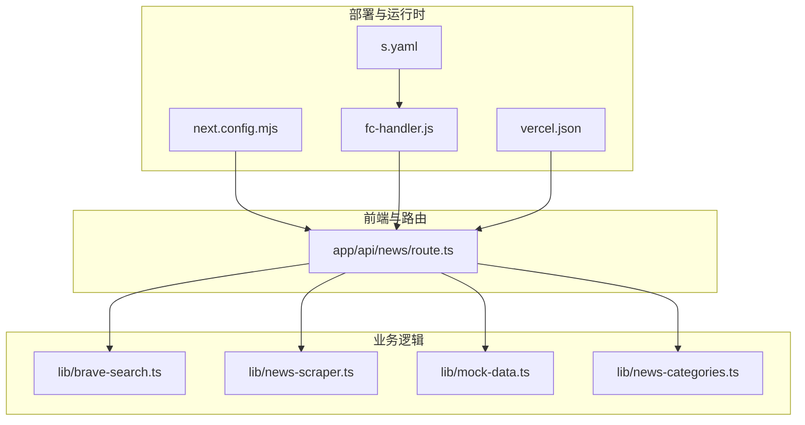
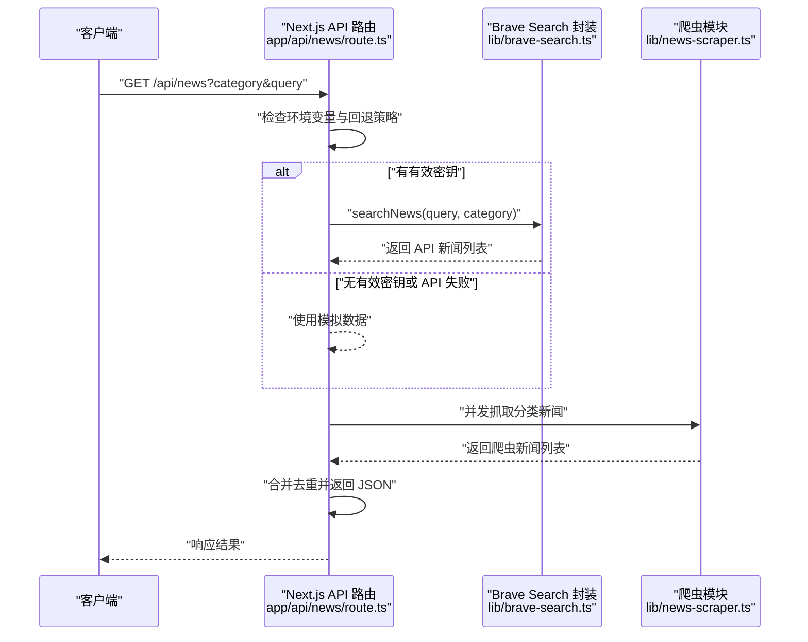
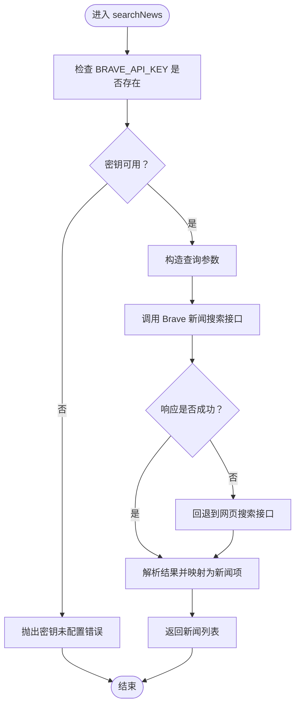
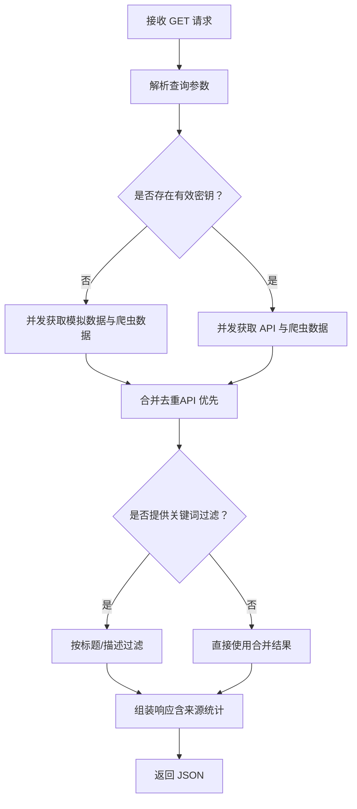
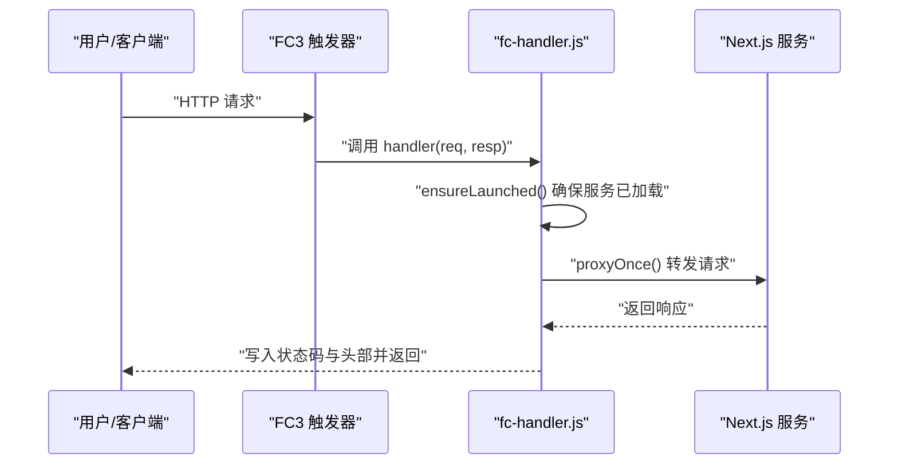
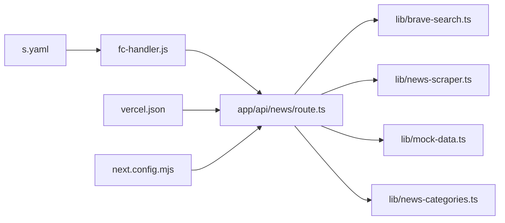

# 第三方集成

<cite>
**本文引用的文件**
- [README.md](file://README.md)
- [package.json](file://package.json)
- [fc-handler.js](file://fc-handler.js)
- [s.yaml](file://s.yaml)
- [vercel.json](file://vercel.json)
- [next.config.mjs](file://next.config.mjs)
- [lib/brave-search.ts](file://lib/brave-search.ts)
- [app/api/news/route.ts](file://app/api/news/route.ts)
- [lib/news-scraper.ts](file://lib/news-scraper.ts)
- [lib/mock-data.ts](file://lib/mock-data.ts)
- [lib/news-categories.ts](file://lib/news-categories.ts)
</cite>

## 目录
1. [简介](#简介)
2. [项目结构](#项目结构)
3. [核心组件](#核心组件)
4. [架构总览](#架构总览)
5. [详细组件分析](#详细组件分析)
6. [依赖关系分析](#依赖关系分析)
7. [性能考量](#性能考量)
8. [故障排查指南](#故障排查指南)
9. [结论](#结论)
10. [附录](#附录)

## 简介
本文件面向需要在现有系统基础上集成第三方服务（尤其是外部 API）的团队，围绕以下主题提供系统化说明：
- 如何接入外部 API（以 Brave Search 为例），包括 API 密钥管理、认证机制与请求限流处理
- 云函数集成（阿里云 FC3）、CDN/域名配置与部署
- 监控系统对接建议
- 支付网关、社交媒体分享与分析工具的集成思路
- 数据同步策略、缓存机制与故障转移方案
- 安全考虑、性能优化与成本控制建议

本项目当前已实现：
- 使用 Brave Search 提供的新闻检索能力，并在无有效密钥或失败时自动回退到爬虫与模拟数据
- 通过 Next.js API 路由统一聚合 API 与本地爬取的数据
- 通过云函数（FC3）与平台（Vercel）两种方式部署
- 通过环境变量注入 API 密钥，支持本地与云端配置

## 项目结构
项目采用 Next.js 应用结构，第三方集成相关的关键位置如下：
- API 层：app/api/news/route.ts 聚合外部 API 与本地爬虫数据
- 外部 API 封装：lib/brave-search.ts 对 Brave Search 的封装与回退逻辑
- 爬虫层：lib/news-scraper.ts 抓取指定站点内容
- 模拟数据：lib/mock-data.ts 用于无密钥或异常时的回退
- 分类配置：lib/news-categories.ts 提供关键词与分类映射
- 部署与运行时：
  - 云函数适配器：fc-handler.js 适配 FC3 HTTP 触发器
  - 阿里云资源定义：s.yaml
  - Vercel 平台配置：vercel.json
  - Next 构建输出：next.config.mjs

图表来源
- [app/api/news/route.ts](file://app/api/news/route.ts#L1-L136)
- [lib/brave-search.ts](file://lib/brave-search.ts#L1-L115)
- [lib/news-scraper.ts](file://lib/news-scraper.ts#L1-L166)
- [lib/mock-data.ts](file://lib/mock-data.ts#L1-L197)
- [lib/news-categories.ts](file://lib/news-categories.ts#L1-L45)
- [next.config.mjs](file://next.config.mjs#L1-L10)
- [fc-handler.js](file://fc-handler.js#L1-L114)
- [s.yaml](file://s.yaml#L1-L38)
- [vercel.json](file://vercel.json#L1-L11)

章节来源
- [README.md](file://README.md#L1-L49)
- [package.json](file://package.json#L1-L30)
- [next.config.mjs](file://next.config.mjs#L1-L10)

## 核心组件
- 外部 API 封装（Brave Search）
  - 负责构造查询参数、设置认证头、发起请求、解析结果并提供回退逻辑
  - 当新闻接口不可用时自动回退到网页搜索接口
- 爬虫模块
  - 基于 Cheerio 解析 HTML，按分类抓取指定站点的新闻条目
- API 路由聚合
  - 同时拉取 API 与爬虫数据，合并去重，支持关键词过滤与分类关键词拼接
  - 在无有效密钥或外部 API 异常时，回退到模拟数据与爬虫数据
- 云函数适配器
  - 将 FC3 HTTP 触发器请求转发给本地 Next.js 服务，处理启动等待与错误响应
- 部署配置
  - Next.js 输出为独立包，便于在 FC3 与 Vercel 上部署
  - 通过环境变量注入 API 密钥，支持本地与平台托管

章节来源
- [lib/brave-search.ts](file://lib/brave-search.ts#L1-L115)
- [lib/news-scraper.ts](file://lib/news-scraper.ts#L1-L166)
- [app/api/news/route.ts](file://app/api/news/route.ts#L1-L136)
- [fc-handler.js](file://fc-handler.js#L1-L114)
- [s.yaml](file://s.yaml#L1-L38)
- [vercel.json](file://vercel.json#L1-L11)
- [next.config.mjs](file://next.config.mjs#L1-L10)

## 架构总览
系统通过 Next.js API 路由统一对外提供新闻聚合服务，内部同时调用外部 API 与本地爬虫，最终返回合并后的结果。部署层面可在云函数（FC3）与平台（Vercel）之间切换。

图表来源
- [app/api/news/route.ts](file://app/api/news/route.ts#L39-L135)
- [lib/brave-search.ts](file://lib/brave-search.ts#L30-L73)
- [lib/news-scraper.ts](file://lib/news-scraper.ts#L140-L153)

## 详细组件分析

### 外部 API 封装（Brave Search）
- 认证机制
  - 通过请求头携带订阅令牌进行认证
  - 从环境变量读取密钥，若未配置则抛出错误
- 请求与回退
  - 优先尝试新闻搜索接口；当响应非 OK 时，自动回退到网页搜索接口
  - 返回标准化的新闻项结构，包含标题、描述、链接、来源、发布时间等
- 限流与稳定性
  - 项目未内置显式的速率限制或重试策略
  - 可通过外部服务配置与平台限流策略缓解

图表来源
- [lib/brave-search.ts](file://lib/brave-search.ts#L30-L73)
- [lib/brave-search.ts](file://lib/brave-search.ts#L75-L114)

章节来源
- [lib/brave-search.ts](file://lib/brave-search.ts#L1-L115)

### API 路由聚合（app/api/news/route.ts）
- 输入参数
  - category：分类标识
  - q：关键词查询
- 并发策略
  - 同时发起外部 API 搜索与本地爬虫抓取，提升整体响应速度
- 合并与去重
  - 以标题（小写与去空白）为键进行去重，优先保留 API 来源
- 回退策略
  - 无有效密钥时：使用模拟数据与爬虫数据合并
  - 外部 API 异常时：同样回退到模拟数据与爬虫数据
- 错误处理
  - 捕获异常并返回包含回退标记的响应，便于前端识别

图表来源
- [app/api/news/route.ts](file://app/api/news/route.ts#L39-L135)

章节来源
- [app/api/news/route.ts](file://app/api/news/route.ts#L1-L136)

### 爬虫模块（lib/news-scraper.ts）
- 配置与抓取
  - 针对不同分类配置不同的站点与选择器
  - 使用 Cheerio 加载 HTML 并提取标题、链接等信息
- 错误处理
  - 单站点抓取失败不影响其他站点；整体返回空数组或部分结果
- 性能
  - 串行遍历多个来源，可通过并发优化（见“性能考量”）

章节来源
- [lib/news-scraper.ts](file://lib/news-scraper.ts#L1-L166)

### 模拟数据与分类配置（lib/mock-data.ts、lib/news-categories.ts）
- 模拟数据
  - 提供多分类的示例新闻，用于无密钥或异常时的快速回退
- 分类关键词
  - 为每个分类提供一组关键词，用于拼接查询语句

章节来源
- [lib/mock-data.ts](file://lib/mock-data.ts#L1-L197)
- [lib/news-categories.ts](file://lib/news-categories.ts#L1-L45)

### 云函数集成（fc-handler.js 与 s.yaml）
- 云函数适配器
  - 将 FC3 HTTP 触发器请求转发给本地服务，处理启动等待与错误响应
  - 设置超时与头部过滤，避免不兼容字段导致的错误
- 资源定义
  - 指定运行时、CPU/内存、超时、环境变量、触发器方法与自定义域名路径

图表来源
- [fc-handler.js](file://fc-handler.js#L60-L113)
- [s.yaml](file://s.yaml#L8-L38)

章节来源
- [fc-handler.js](file://fc-handler.js#L1-L114)
- [s.yaml](file://s.yaml#L1-L38)

### 平台部署（Vercel）
- 平台配置
  - 指定构建命令、开发命令与框架类型
  - 通过平台变量注入 API 密钥，便于在托管环境中安全配置

章节来源
- [vercel.json](file://vercel.json#L1-L11)

### 构建与输出（Next.js）
- 独立包输出
  - 将 Next.js 构建产物输出为独立包，便于在 FC3 与 Vercel 上部署
- 图片优化
  - 关闭图片优化以简化部署流程

章节来源
- [next.config.mjs](file://next.config.mjs#L1-L10)

## 依赖关系分析
- 组件耦合
  - API 路由依赖外部 API 封装与爬虫模块；在无密钥或异常时依赖模拟数据
  - 云函数适配器与部署配置独立于业务逻辑，便于替换运行时
- 外部依赖
  - Brave Search API（订阅令牌认证）
  - 第三方站点（Hacker News）用于爬虫

图表来源
- [app/api/news/route.ts](file://app/api/news/route.ts#L1-L6)
- [lib/brave-search.ts](file://lib/brave-search.ts#L1-L28)
- [lib/news-scraper.ts](file://lib/news-scraper.ts#L1-L3)
- [lib/mock-data.ts](file://lib/mock-data.ts#L1-L1)
- [lib/news-categories.ts](file://lib/news-categories.ts#L1-L5)
- [fc-handler.js](file://fc-handler.js#L1-L21)
- [s.yaml](file://s.yaml#L1-L22)
- [vercel.json](file://vercel.json#L1-L11)
- [next.config.mjs](file://next.config.mjs#L1-L10)

章节来源
- [package.json](file://package.json#L15-L20)

## 性能考量
- 并发与去重
  - API 路由已采用并发策略获取 API 与爬虫数据；建议在爬虫模块中引入并发抓取以进一步缩短延迟
- 缓存策略
  - 建议对 API 响应与爬虫结果进行短期缓存（如 Redis 或 CDN），并为不同分类设置独立 TTL
  - 对高频查询（如首页）可预热缓存
- 限流与熔断
  - 在外部 API 层引入指数退避与熔断（如连续失败超过阈值暂停请求）
  - 对 FC3 与平台触发器设置合理的超时与并发上限
- 资源优化
  - 使用独立包输出与静态图片处理减少冷启动与构建体积
  - 对响应启用压缩（Gzip/Brotli）与 CDN 边缘缓存

## 故障排查指南
- API 密钥问题
  - 症状：抛出“密钥未配置”错误或外部 API 响应非 OK
  - 处理：检查环境变量配置；确认订阅令牌有效且未过期
- 外部站点不可用
  - 症状：爬虫抓取失败或返回空结果
  - 处理：查看日志定位失败站点；确保网络可达与 UA/Headers 合法
- 云函数启动慢
  - 症状：首次请求返回“服务启动中”
  - 处理：等待服务就绪；检查适配器中的等待循环与超时设置
- 平台部署差异
  - 症状：本地与平台行为不一致
  - 处理：核对平台变量与本地 .env.local 的差异；确认构建与运行时版本一致

章节来源
- [lib/brave-search.ts](file://lib/brave-search.ts#L35-L37)
- [app/api/news/route.ts](file://app/api/news/route.ts#L112-L134)
- [fc-handler.js](file://fc-handler.js#L80-L98)

## 结论
本项目已具备完整的第三方服务集成基础：通过外部 API 封装与回退策略、爬虫模块与模拟数据，实现了高可用的新闻聚合能力；并通过云函数与平台两种部署方式满足不同场景需求。后续可在缓存、限流、监控与成本控制方面进一步完善，以支撑更高并发与更稳定的线上运行。

## 附录

### API 密钥管理与认证
- 存储位置
  - 本地：通过 .env.local 注入
  - 云函数：通过 s.yaml 的 environmentVariables 注入
  - 平台：通过 vercel.json 的 env 注入
- 安全建议
  - 不在客户端暴露密钥；仅在服务端读取
  - 使用平台提供的密钥管理服务或环境变量加密
  - 定期轮换密钥并限制访问范围

章节来源
- [README.md](file://README.md#L24-L32)
- [s.yaml](file://s.yaml#L19-L21)
- [vercel.json](file://vercel.json#L7-L9)

### 请求限流与故障转移
- 限流
  - 在外部 API 层引入令牌桶/漏桶算法或基于平台的限流策略
  - 对不同端点设置差异化限流阈值
- 故障转移
  - 外部 API 失败时自动回退到爬虫与模拟数据
  - 爬虫失败不影响主流程，确保系统可用性

章节来源
- [lib/brave-search.ts](file://lib/brave-search.ts#L55-L58)
- [app/api/news/route.ts](file://app/api/news/route.ts#L48-L74)
- [app/api/news/route.ts](file://app/api/news/route.ts#L112-L134)

### 云函数与 CDN/域名配置
- 云函数
  - 指定运行时、CPU/内存、超时与环境变量
  - 配置 HTTP 触发器方法与自定义域名路径
- CDN/域名
  - 通过自定义域名将流量分发至云函数或平台托管
  - 在 CDN 层开启缓存与压缩，降低后端压力

章节来源
- [s.yaml](file://s.yaml#L8-L38)

### 监控系统对接
- 建议指标
  - API 调用成功率与延迟、错误率
  - 爬虫抓取成功率与耗时
  - 云函数冷启动次数与平均响应时间
- 建议工具
  - 平台自带监控（如阿里云 CloudMonitor、Vercel Analytics）
  - 自建埋点上报与告警（如 Prometheus + Grafana）

### 支付网关、社交分享与分析工具集成
- 支付网关
  - 在 API 层新增支付相关路由，调用第三方支付 SDK
  - 使用签名与回调校验保障安全性
- 社交分享
  - 在前端组件中集成分享按钮，调用平台分享 API 或第三方 SDK
- 分析工具
  - 埋点上报与事件追踪，结合平台分析工具进行归因与效果评估

### 数据同步策略与缓存机制
- 同步策略
  - 定时任务拉取最新数据，增量更新至缓存
  - 对热点分类优先同步，非热点分类采用延迟策略
- 缓存机制
  - L1：进程内缓存（短期热点）
  - L2：Redis/内存缓存（跨实例共享）
  - L3：CDN 缓存（静态与弱动态内容）
- 故障转移
  - 缓存失效时回退到后端实时拉取
  - 多级缓存逐级降级，保证服务可用

### 安全考虑
- 传输安全
  - 使用 HTTPS 与 TLS 1.3
- 认证与授权
  - 严格限制 API 密钥权限范围；对敏感接口增加鉴权
- 输入校验
  - 对查询参数与用户输入进行白名单与长度限制
- 日志与审计
  - 记录关键操作与异常，避免泄露敏感信息

### 成本控制建议
- 资源优化
  - 合理设置云函数 CPU/内存与超时，避免过度配置
  - 利用缓存与 CDN 减少后端请求
- 流量治理
  - 对外部 API 设置配额与限流，防止突发流量导致成本飙升
- 监控与告警
  - 建立成本阈值告警，及时发现异常增长