# API调试

<cite>
**本文档引用的文件**
- [app/api/news/route.ts](file://app/api/news/route.ts)
- [lib/brave-search.ts](file://lib/brave-search.ts)
- [lib/news-categories.ts](file://lib/news-categories.ts)
- [lib/mock-data.ts](file://lib/mock-data.ts)
- [lib/news-scraper.ts](file://lib/news-scraper.ts)
- [app/page.tsx](file://app/page.tsx)
- [components/SearchBar.tsx](file://components/SearchBar.tsx)
- [README.md](file://README.md)
- [package.json](file://package.json)
</cite>

## 目录
1. [简介](#简介)
2. [项目结构](#项目结构)
3. [核心组件](#核心组件)
4. [架构概览](#架构概览)
5. [详细组件分析](#详细组件分析)
6. [依赖关系分析](#依赖关系分析)
7. [性能考虑](#性能考虑)
8. [故障排除指南](#故障排除指南)
9. [结论](#结论)
10. [附录](#附录)

## 简介

本指南专注于新闻API接口的调试和问题诊断，特别是GET /api/news接口的完整调试流程。该系统集成了Brave Search API，提供了多种数据源（API、爬虫、模拟数据）以确保服务的可靠性和容错能力。

## 项目结构

该项目采用Next.js框架构建，API路由位于`app/api/news/route.ts`，核心业务逻辑分布在`lib/`目录下的各个模块中。

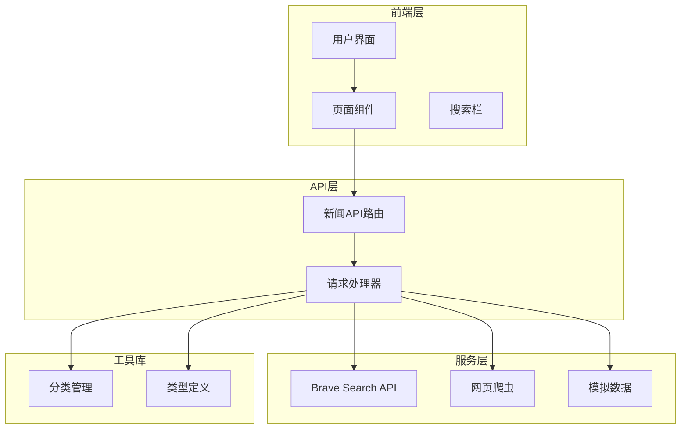

**图表来源**
- [app/api/news/route.ts](file://app/api/news/route.ts#L1-L136)
- [lib/brave-search.ts](file://lib/brave-search.ts#L1-L115)
- [lib/news-scraper.ts](file://lib/news-scraper.ts#L1-L166)

**章节来源**
- [README.md](file://README.md#L1-L49)
- [package.json](file://package.json#L1-L30)

## 核心组件

### API路由组件

GET /api/news接口是整个系统的入口点，负责处理新闻数据的获取、合并和返回。

**章节来源**
- [app/api/news/route.ts](file://app/api/news/route.ts#L39-L135)

### 数据源组件

系统实现了三种数据源策略：
1. **Brave Search API** - 主要数据源
2. **网页爬虫** - 备用数据源
3. **模拟数据** - 开发环境回退方案

**章节来源**
- [lib/brave-search.ts](file://lib/brave-search.ts#L30-L73)
- [lib/news-scraper.ts](file://lib/news-scraper.ts#L141-L153)
- [lib/mock-data.ts](file://lib/mock-data.ts#L194-L196)

## 架构概览

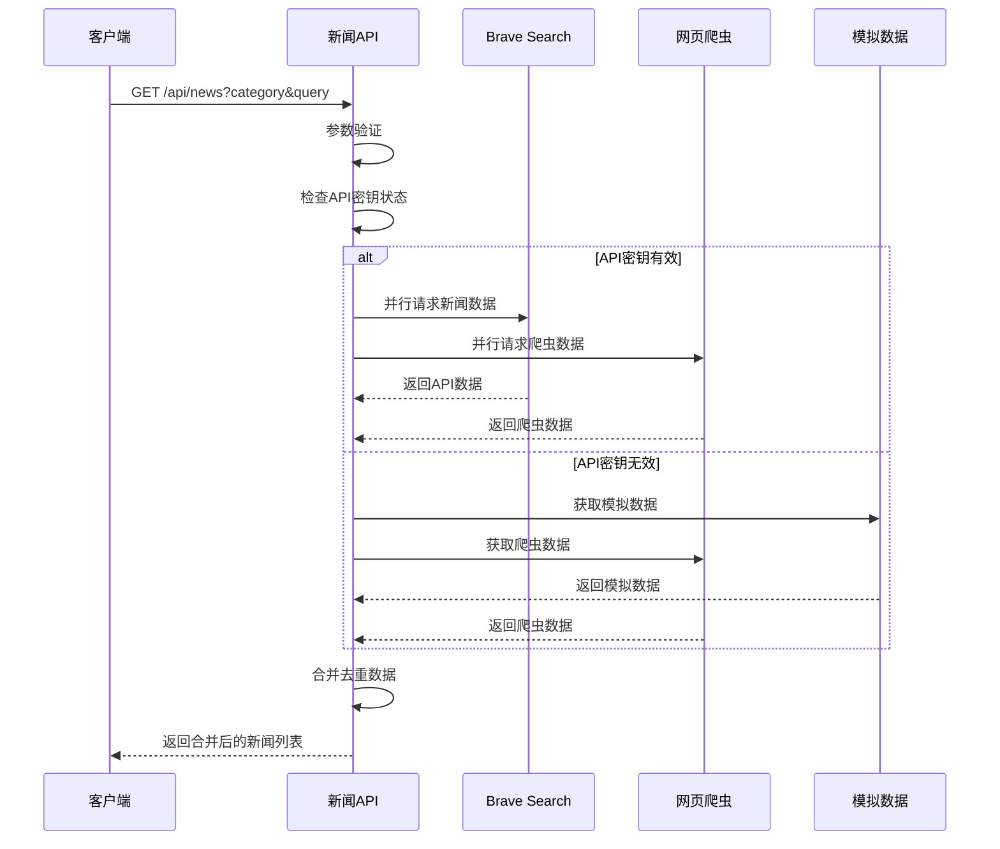

**图表来源**
- [app/api/news/route.ts](file://app/api/news/route.ts#L44-L96)
- [lib/brave-search.ts](file://lib/brave-search.ts#L30-L73)

## 详细组件分析

### GET /api/news 接口分析

#### 请求参数验证

接口接受两个主要参数：
- `category`: 新闻分类，默认值为"all"
- `q`: 搜索关键词，可选参数

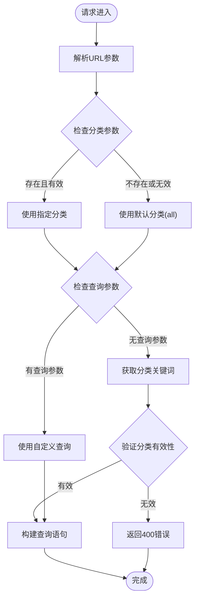

**图表来源**
- [app/api/news/route.ts](file://app/api/news/route.ts#L40-L90)

#### 请求处理流程

系统采用并行处理策略来优化响应时间：

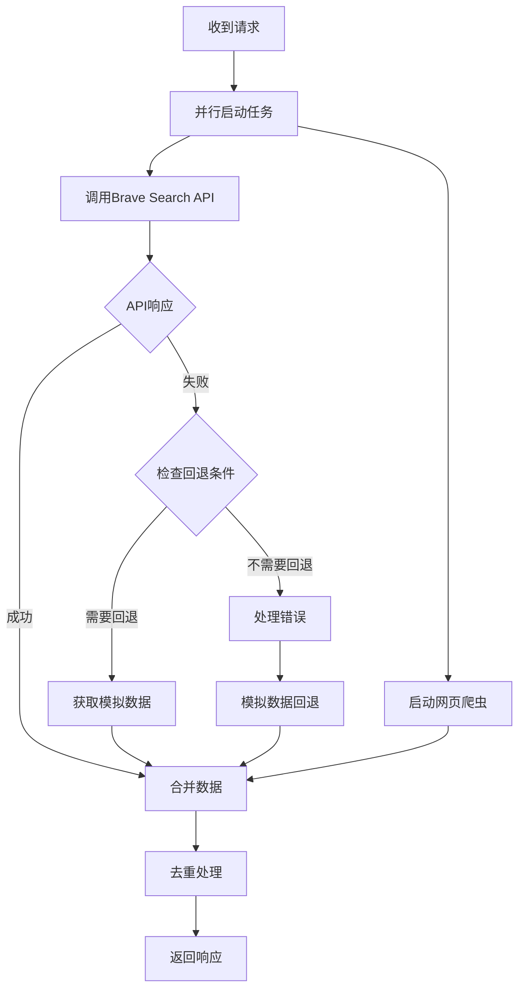

**图表来源**
- [app/api/news/route.ts](file://app/api/news/route.ts#L76-L134)

#### 响应格式检查

API返回统一的JSON格式，包含以下字段：

| 字段名 | 类型 | 描述 | 必需 |
|--------|------|------|------|
| news | Array | 新闻项目数组 | 是 |
| category | String | 当前分类 | 是 |
| query | String | 实际使用的查询词 | 是 |
| timestamp | String | ISO时间戳 | 是 |
| mock | Boolean | 是否使用模拟数据 | 否 |
| sources | Object | 数据源统计信息 | 是 |

**章节来源**
- [app/api/news/route.ts](file://app/api/news/route.ts#L101-L111)

### Brave Search API 集成

#### API密钥验证

系统实现了智能的API密钥检测机制：

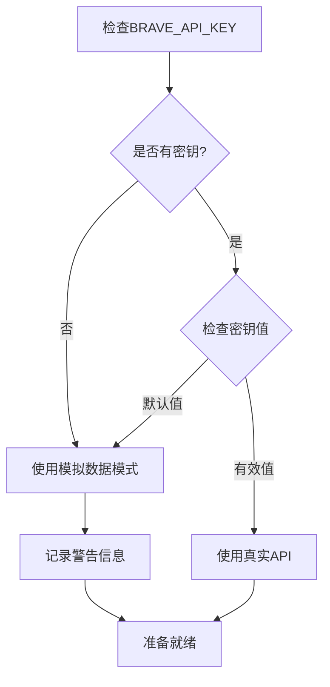

**图表来源**
- [app/api/news/route.ts](file://app/api/news/route.ts#L7-L11)

#### 错误响应处理

Brave Search API提供了完整的错误处理机制：

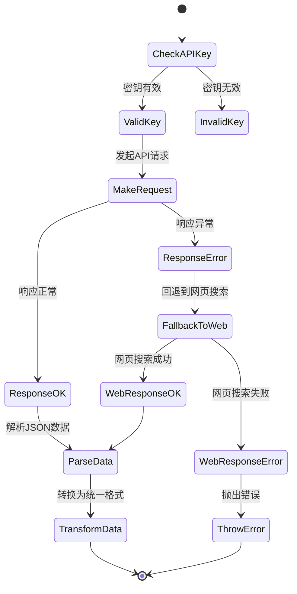

**图表来源**
- [lib/brave-search.ts](file://lib/brave-search.ts#L55-L58)
- [lib/brave-search.ts](file://lib/brave-search.ts#L97-L99)

**章节来源**
- [lib/brave-search.ts](file://lib/brave-search.ts#L30-L115)

### 网页爬虫组件

#### 爬虫配置

系统针对不同分类配置了专门的爬虫源：

| 分类 | 爬虫源 | 选择器 | 特殊处理 |
|------|--------|--------|----------|
| all | Hacker News | .titleline > a | 过滤技术帖子 |
| tech | Hacker News | .titleline > a | 标记为科技资讯 |
| business | Hacker News | .titleline > a | 标记为商业资讯 |
| politics | Hacker News | .titleline > a | 标记为国际资讯 |

**章节来源**
- [lib/news-scraper.ts](file://lib/news-scraper.ts#L6-L91)

#### 数据提取流程

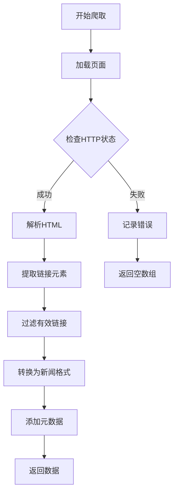

**图表来源**
- [lib/news-scraper.ts](file://lib/news-scraper.ts#L116-L138)

**章节来源**
- [lib/news-scraper.ts](file://lib/news-scraper.ts#L94-L153)

## 依赖关系分析

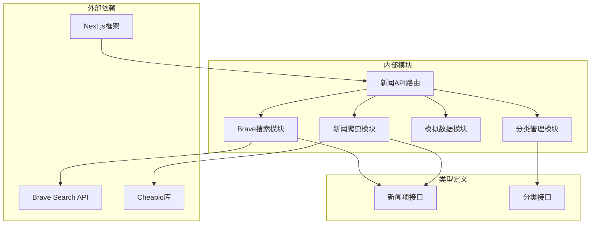

**图表来源**
- [app/api/news/route.ts](file://app/api/news/route.ts#L1-L6)
- [lib/brave-search.ts](file://lib/brave-search.ts#L1-L10)
- [lib/news-scraper.ts](file://lib/news-scraper.ts#L1-L3)

**章节来源**
- [package.json](file://package.json#L15-L28)

## 性能考虑

### 并行处理优化

系统通过Promise.all实现并行数据获取，显著提升响应速度：

```mermaid
gantt
title 并行处理性能对比
dateFormat X
axisFormat %s
section API调用
并行调用 :0, 200ms
串行调用 :0, 400ms
section 数据处理
并行处理 :200ms, 150ms
串行处理 :400ms, 150ms
section 合并去重
并行合并 :350ms, 100ms
串行合并 :550ms, 100ms
```

### 缓存策略

系统实现了多层次的数据缓存机制：
1. **内存缓存** - 临时存储最近请求的数据
2. **本地存储** - 用户收藏数据持久化
3. **浏览器缓存** - 前端静态资源缓存

### 错误恢复机制

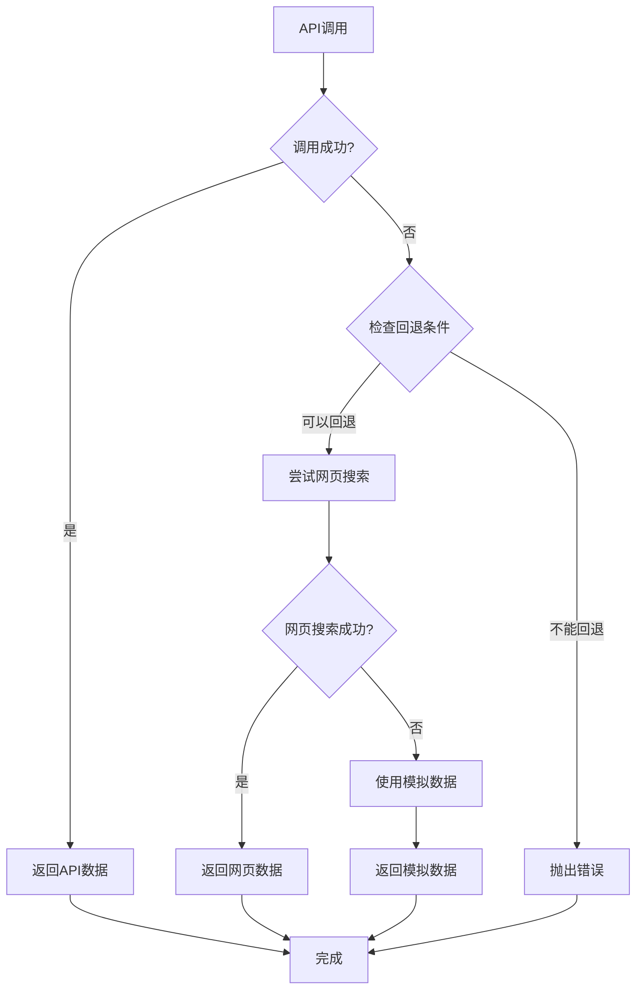

**图表来源**
- [lib/brave-search.ts](file://lib/brave-search.ts#L55-L58)
- [app/api/news/route.ts](file://app/api/news/route.ts#L112-L134)

## 故障排除指南

### 常见错误代码及解决方案

#### 400错误 - 无效分类

**症状表现**：
- API返回400状态码
- 错误消息："Invalid category"

**诊断步骤**：
1. 检查请求URL中的category参数
2. 验证分类ID是否在支持列表中
3. 确认参数编码正确

**解决方案**：
```bash
# 正确的分类参数
curl "http://localhost:3000/api/news?category=all"
curl "http://localhost:3000/api/news?category=tech"
curl "http://localhost:3000/api/news?category=business"
curl "http://localhost:3000/api/news?category=politics"
```

**章节来源**
- [app/api/news/route.ts](file://app/api/news/route.ts#L84-L87)

#### 500错误 - 服务器内部错误

**症状表现**：
- API返回500状态码
- 控制台显示错误日志

**诊断步骤**：
1. 查看服务器控制台输出
2. 检查Brave Search API密钥配置
3. 验证网络连接状态

**解决方案**：
1. 检查`.env.local`文件中的API密钥
2. 确认Brave Search服务可用性
3. 验证防火墙设置

#### 网络超时处理

**症状表现**：
- 请求长时间无响应
- 浏览器显示超时错误

**诊断步骤**：
1. 使用curl测试API响应时间
2. 检查网络延迟
3. 验证API服务状态

**章节来源**
- [lib/brave-search.ts](file://lib/brave-search.ts#L47-L53)

### API密钥验证调试

#### 配置检查清单

1. **环境变量设置**
   ```bash
   # 检查环境变量
   echo $BRAVE_API_KEY
   
   # 在.env.local文件中设置
   echo "BRAVE_API_KEY=your_actual_api_key" >> .env.local
   ```

2. **API密钥有效性测试**
   ```bash
   curl -H "X-Subscription-Token: YOUR_API_KEY" \
        -H "Accept: application/json" \
        "https://api.search.brave.com/res/v1/news/search?q=test&count=1"
   ```

3. **回退机制验证**
   - 设置无效API密钥验证模拟数据模式
   - 检查错误日志中关于API密钥的警告信息

### 网络请求拦截

#### 浏览器开发者工具

1. **Network面板监控**
   - 打开开发者工具(F12)
   - 切换到Network标签
   - 刷新页面观察API请求

2. **请求详情分析**
   - 查看请求头中的`X-Subscription-Token`
   - 检查响应状态码和响应时间
   - 分析请求参数是否正确

#### Postman调试技巧

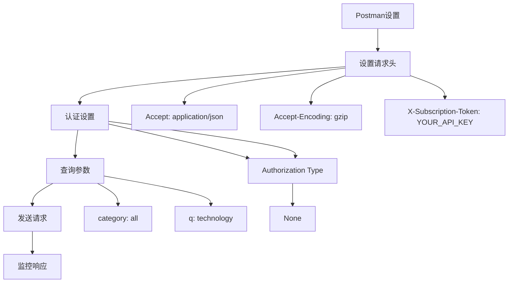

**图表来源**
- [lib/brave-search.ts](file://lib/brave-search.ts#L47-L53)

### curl命令示例

#### 基础请求
```bash
# 获取所有新闻
curl "http://localhost:3000/api/news"

# 指定分类
curl "http://localhost:3000/api/news?category=tech"

# 关键词搜索
curl "http://localhost:3000/api/news?q=artificial+intelligence"

# 组合参数
curl "http://localhost:3000/api/news?category=tech&q=AI"
```

#### 调试选项
```bash
# 显示详细响应头
curl -v "http://localhost:3000/api/news"

# 指定超时时间
curl --max-time 30 "http://localhost:3000/api/news"

# 保存响应到文件
curl -o response.json "http://localhost:3000/api/news"
```

### 响应时间监控

#### 性能指标监控

1. **响应时间测量**
   ```bash
   # 使用curl测量响应时间
   curl -w "@curl-format.txt" -o /dev/null -s "http://localhost:3000/api/news"
   ```

2. **响应时间格式**
   ```
   time_namelookup: %{time_namelookup}\n
   time_connect: %{time_connect}\n
   time_appconnect: %{time_appconnect}\n
   time_pretransfer: %{time_pretransfer}\n
   time_redirect: %{time_redirect}\n
   time_starttransfer: %{time_starttransfer}\n
   time_total: %{time_total}\n
   ```

3. **性能基准测试**
   ```bash
   # 压力测试
   ab -n 100 -c 10 "http://localhost:3000/api/news?category=all"
   ```

### 数据格式验证

#### JSON响应验证

1. **响应结构验证**
   ```javascript
   // 验证必需字段
   const requiredFields = ['news', 'category', 'query', 'timestamp', 'sources'];
   const hasAllFields = requiredFields.every(field => response.hasOwnProperty(field));
   ```

2. **数据类型验证**
   ```javascript
   // 验证news数组
   assert(Array.isArray(response.news), 'news必须是数组');
   
   // 验证每个新闻项
   response.news.forEach(item => {
       assert(typeof item.id === 'string', 'id必须是字符串');
       assert(typeof item.title === 'string', 'title必须是字符串');
       assert(typeof item.url === 'string', 'url必须是字符串');
   });
   ```

3. **分类有效性验证**
   ```javascript
   const validCategories = ['all', 'politics', 'business', 'tech'];
   const isValidCategory = validCategories.includes(response.category);
   ```

### 错误处理最佳实践

#### 前端错误处理

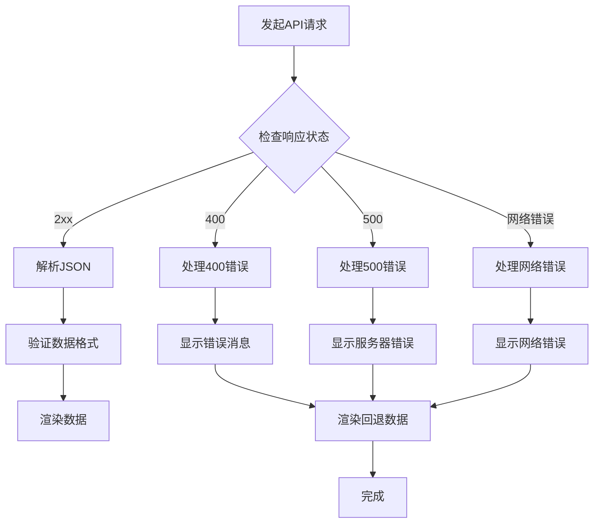

**图表来源**
- [app/page.tsx](file://app/page.tsx#L19-L38)

#### 后端错误处理

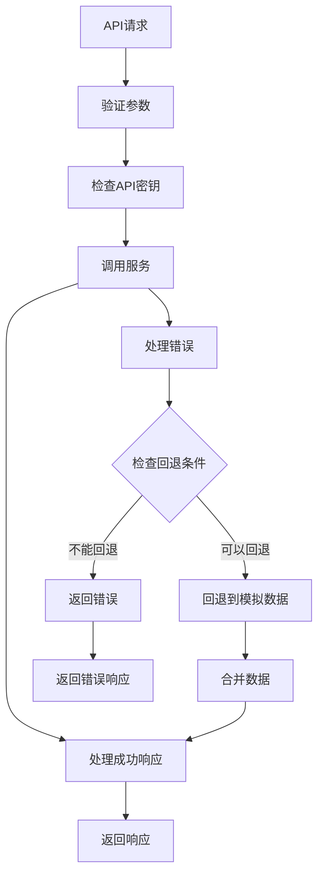

**图表来源**
- [app/api/news/route.ts](file://app/api/news/route.ts#L112-L134)

**章节来源**
- [app/page.tsx](file://app/page.tsx#L23-L35)

## 结论

本API调试指南涵盖了新闻API接口的完整调试流程，包括参数验证、请求处理、响应格式检查和错误处理。通过理解系统的多数据源架构和智能回退机制，开发者可以更有效地诊断和解决各种API相关问题。

关键要点：
1. **多数据源策略**确保了服务的高可用性
2. **并行处理**优化了响应性能
3. **智能回退**提供了良好的用户体验
4. **完整的错误处理**便于问题诊断

建议在开发过程中：
- 始终验证API密钥配置
- 监控响应时间和错误率
- 使用curl和Postman进行手动测试
- 实施适当的日志记录和监控

## 附录

### API端点规范

#### GET /api/news

**请求参数**

| 参数名 | 类型 | 必需 | 默认值 | 描述 |
|--------|------|------|--------|------|
| category | String | 否 | "all" | 新闻分类 |
| q | String | 否 | "" | 搜索关键词 |

**响应示例**
```json
{
  "news": [
    {
      "id": "string",
      "title": "string",
      "description": "string",
      "url": "string",
      "source": "string",
      "publishedAt": "string",
      "thumbnail": "string",
      "category": "string"
    }
  ],
  "category": "string",
  "query": "string",
  "timestamp": "string",
  "mock": true,
  "sources": {
    "api": 0,
    "scraped": 0,
    "total": 0
  }
}
```

**状态码**
- 200: 成功
- 400: 无效参数
- 500: 服务器错误

### 环境配置

#### 必需环境变量

| 变量名 | 类型 | 必需 | 描述 |
|--------|------|------|------|
| BRAVE_API_KEY | String | 是 | Brave Search API密钥 |

#### 开发环境配置

```bash
# 创建.env.local文件
echo "BRAVE_API_KEY=your_brave_api_key_here" > .env.local

# 验证配置
cat .env.local
```