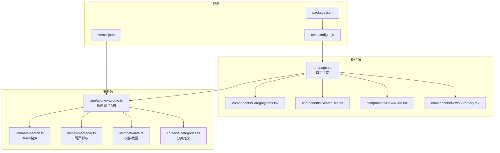
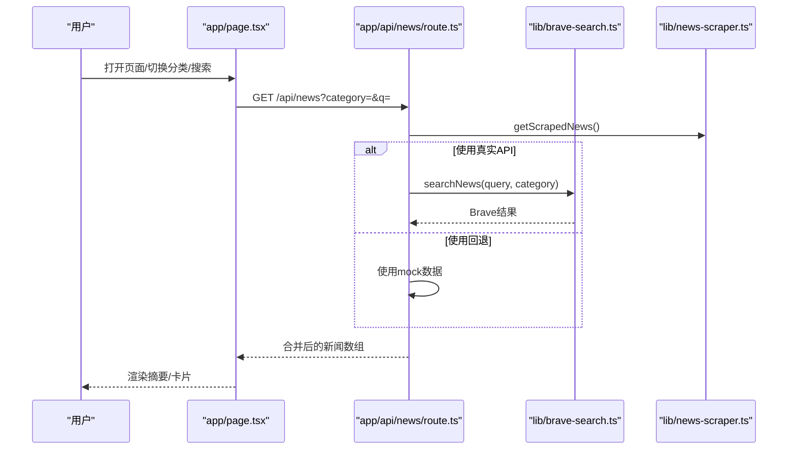
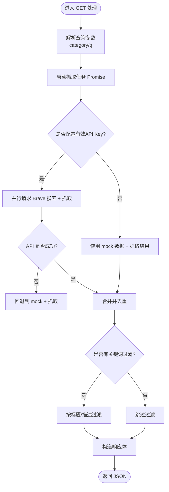
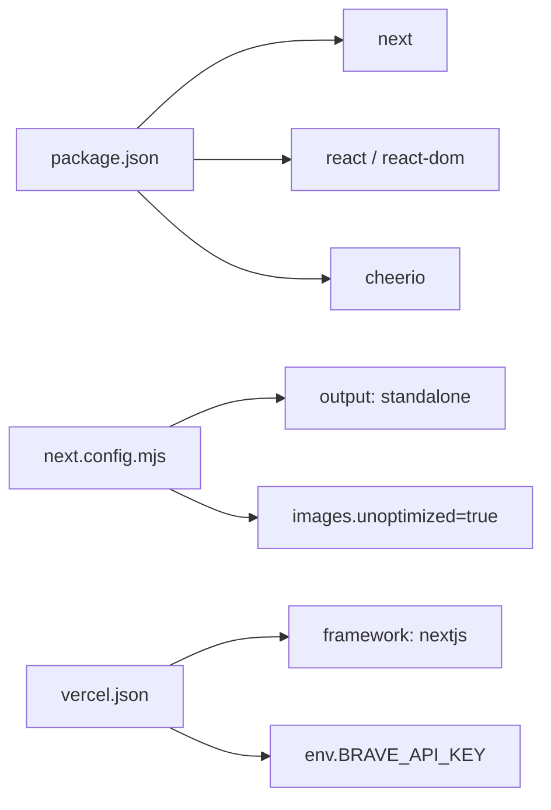

# 性能调试

<cite>
**本文引用的文件**
- [package.json](file://package.json)
- [next.config.mjs](file://next.config.mjs)
- [app/api/news/route.ts](file://app/api/news/route.ts)
- [lib/brave-search.ts](file://lib/brave-search.ts)
- [lib/news-scraper.ts](file://lib/news-scraper.ts)
- [lib/mock-data.ts](file://lib/mock-data.ts)
- [lib/news-categories.ts](file://lib/news-categories.ts)
- [app/page.tsx](file://app/page.tsx)
- [components/NewsCard.tsx](file://components/NewsCard.tsx)
- [components/NewsSummary.tsx](file://components/NewsSummary.tsx)
- [components/CategoryTabs.tsx](file://components/CategoryTabs.tsx)
- [components/SearchBar.tsx](file://components/SearchBar.tsx)
- [lib/favorites.ts](file://lib/favorites.ts)
- [README.md](file://README.md)
- [vercel.json](file://vercel.json)
</cite>

## 目录
1. [简介](#简介)
2. [项目结构](#项目结构)
3. [核心组件](#核心组件)
4. [架构总览](#架构总览)
5. [详细组件分析](#详细组件分析)
6. [依赖关系分析](#依赖关系分析)
7. [性能考量](#性能考量)
8. [故障排查指南](#故障排查指南)
9. [结论](#结论)
10. [附录](#附录)

## 简介
本指南面向新闻网站的性能调试与优化，聚焦以下目标：
- API 响应时间监控与并发请求处理
- 内存使用与资源竞争问题排查
- Promise.all 并发处理的调试技巧与性能瓶颈识别
- Next.js 应用的性能优化策略（代码分割、懒加载、缓存）
- 性能指标监控、内存泄漏检测与 CPU 使用率分析
- 开发与生产环境的性能对比与优化建议

## 项目结构
该仓库采用 Next.js App Router 结构，前端页面位于 app 目录，API 路由位于 app/api 下，业务逻辑集中在 lib 目录，UI 组件位于 components 目录。

图表来源
- [app/page.tsx](file://app/page.tsx#L1-L153)
- [app/api/news/route.ts](file://app/api/news/route.ts#L1-L136)
- [lib/brave-search.ts](file://lib/brave-search.ts#L1-L115)
- [lib/news-scraper.ts](file://lib/news-scraper.ts#L1-L166)
- [lib/mock-data.ts](file://lib/mock-data.ts#L1-L197)
- [lib/news-categories.ts](file://lib/news-categories.ts#L1-L45)
- [next.config.mjs](file://next.config.mjs#L1-L10)
- [vercel.json](file://vercel.json#L1-L11)
- [package.json](file://package.json#L1-L30)

章节来源
- [README.md](file://README.md#L36-L49)
- [package.json](file://package.json#L1-L30)
- [next.config.mjs](file://next.config.mjs#L1-L10)
- [vercel.json](file://vercel.json#L1-L11)

## 核心组件
- API 聚合层：app/api/news/route.ts 负责并发拉取 Brave 搜索与网页抓取结果，合并去重并返回统一格式。
- 数据源层：lib/brave-search.ts 提供 Brave API 搜索；lib/news-scraper.ts 提供基于 Cheerio 的网页抓取；lib/mock-data.ts 提供开发/回退场景的数据。
- 页面与交互：app/page.tsx 负责发起请求、展示加载状态与错误提示；组件 NewsCard、NewsSummary、CategoryTabs、SearchBar 负责 UI 与用户交互。
- 分类与收藏：lib/news-categories.ts 定义分类；lib/favorites.ts 提供本地收藏持久化。

章节来源
- [app/api/news/route.ts](file://app/api/news/route.ts#L1-L136)
- [lib/brave-search.ts](file://lib/brave-search.ts#L1-L115)
- [lib/news-scraper.ts](file://lib/news-scraper.ts#L1-L166)
- [lib/mock-data.ts](file://lib/mock-data.ts#L1-L197)
- [lib/news-categories.ts](file://lib/news-categories.ts#L1-L45)
- [app/page.tsx](file://app/page.tsx#L1-L153)
- [components/NewsCard.tsx](file://components/NewsCard.tsx#L1-L89)
- [components/NewsSummary.tsx](file://components/NewsSummary.tsx#L1-L54)
- [components/CategoryTabs.tsx](file://components/CategoryTabs.tsx#L1-L49)
- [components/SearchBar.tsx](file://components/SearchBar.tsx#L1-L37)
- [lib/favorites.ts](file://lib/favorites.ts#L1-L29)

## 架构总览
新闻请求从浏览器进入 app/page.tsx，通过 fetch 触发 app/api/news/route.ts。API 层并行执行 Brave 搜索与网页抓取，随后合并去重并返回。页面根据返回数据渲染摘要、卡片与分页。

图表来源
- [app/page.tsx](file://app/page.tsx#L19-L38)
- [app/api/news/route.ts](file://app/api/news/route.ts#L39-L135)
- [lib/brave-search.ts](file://lib/brave-search.ts#L30-L73)
- [lib/news-scraper.ts](file://lib/news-scraper.ts#L140-L153)

## 详细组件分析

### API 聚合与并发处理（app/api/news/route.ts）
- 并发策略：使用 Promise.all 并行获取 Brave 搜索与网页抓取结果，缩短整体等待时间。
- 回退机制：当未配置有效 API Key 时，使用 mock 数据与抓取结果合并；当 API 请求异常时，同样回退到 mock+抓取。
- 合并与去重：以标题标准化为键进行去重，优先保留 API 来源，再补充抓取来源。
- 查询参数：支持按分类或关键词查询；若无关键词则从分类映射中拼接布尔查询串。

图表来源
- [app/api/news/route.ts](file://app/api/news/route.ts#L39-L135)

章节来源
- [app/api/news/route.ts](file://app/api/news/route.ts#L1-L136)

### Brave 搜索接口（lib/brave-search.ts）
- 请求参数：包含关键词、数量、新鲜度、语言等，启用 gzip 传输压缩。
- 错误处理：当新闻搜索失败时回退到网页搜索接口，保证可用性。
- 结果映射：将响应字段映射为统一的 NewsItem 结构，包含来源、发布时间、缩略图等。

章节来源
- [lib/brave-search.ts](file://lib/brave-search.ts#L1-L115)

### 网页抓取（lib/news-scraper.ts）
- 抓取策略：针对不同分类配置对应站点与选择器，使用 Cheerio 解析 HTML。
- 并发与容错：逐个源抓取并捕获异常，避免单个源失败影响整体流程。
- 输出：返回标准化的 NewsItem 列表，用于与 API 结果合并。

章节来源
- [lib/news-scraper.ts](file://lib/news-scraper.ts#L1-L166)

### 模拟数据（lib/mock-data.ts）
- 用途：在无有效 API Key 或抓取失败时提供稳定回退数据。
- 数据规模：按分类预置若干条示例新闻，便于开发与演示。

章节来源
- [lib/mock-data.ts](file://lib/mock-data.ts#L1-L197)

### 页面与组件（app/page.tsx 及组件）
- 请求触发：useEffect 在分类变化时自动拉取数据；SearchBar 支持关键词搜索。
- 加载与错误：统一 loading/error 状态管理，提升用户体验。
- 交互：NewsCard 支持收藏/取消收藏，更新本地存储并回调刷新。

章节来源
- [app/page.tsx](file://app/page.tsx#L1-L153)
- [components/NewsCard.tsx](file://components/NewsCard.tsx#L1-L89)
- [components/NewsSummary.tsx](file://components/NewsSummary.tsx#L1-L54)
- [components/CategoryTabs.tsx](file://components/CategoryTabs.tsx#L1-L49)
- [components/SearchBar.tsx](file://components/SearchBar.tsx#L1-L37)
- [lib/favorites.ts](file://lib/favorites.ts#L1-L29)

## 依赖关系分析
- 运行时依赖：Next.js、React、Cheerio。
- 构建与运行：next.config.mjs 设置输出模式与图片优化；vercel.json 配置部署框架与环境变量绑定。
- 包管理：package.json 定义脚本与依赖版本。

图表来源
- [package.json](file://package.json#L15-L28)
- [next.config.mjs](file://next.config.mjs#L1-L10)
- [vercel.json](file://vercel.json#L1-L11)

章节来源
- [package.json](file://package.json#L1-L30)
- [next.config.mjs](file://next.config.mjs#L1-L10)
- [vercel.json](file://vercel.json#L1-L11)

## 性能考量

### API 响应时间监控
- 指标采集
  - 端到端延迟：在 app/page.tsx 中记录请求开始与结束时间，计算 fetch 响应耗时。
  - 分段耗时：在 app/api/news/route.ts 记录 Promise.all 并发阶段、合并去重阶段、过滤阶段的时间点。
  - 外部依赖：分别统计 Brave 搜索与网页抓取的耗时，定位瓶颈来源。
- 可视化建议
  - 将耗时指标写入自定义埋点或日志系统，结合时间序列图表观察趋势。
  - 对比不同分类与关键词下的延迟分布，识别异常峰值。

章节来源
- [app/page.tsx](file://app/page.tsx#L19-L38)
- [app/api/news/route.ts](file://app/api/news/route.ts#L39-L135)
- [lib/brave-search.ts](file://lib/brave-search.ts#L30-L73)
- [lib/news-scraper.ts](file://lib/news-scraper.ts#L140-L153)

### 并发请求处理与 Promise.all 调试
- 并发策略
  - 使用 Promise.all 并行请求 Brave 搜索与抓取，减少总等待时间。
  - 若某分支失败，立即回退到 mock+抓取，确保快速返回。
- 调试技巧
  - 为每个分支设置独立计时与错误日志，区分是网络超时还是解析失败。
  - 在抓取阶段增加超时控制与重试策略，避免单个源阻塞整体。
  - 对抓取结果进行采样与限流，防止过度并发导致外部站点限流或被封禁。

章节来源
- [app/api/news/route.ts](file://app/api/news/route.ts#L44-L96)
- [lib/news-scraper.ts](file://lib/news-scraper.ts#L94-L138)

### 内存使用与资源竞争
- 内存热点
  - 合并去重：mergeNews 使用 Set 存储标题键，注意键的规范化与内存占用。
  - 抓取解析：Cheerio 加载 HTML 会占用内存，建议限制抓取数量与结果集大小。
  - 本地存储：favorites 使用 localStorage，需关注字符串化对象的体积与序列化成本。
- 优化建议
  - 对抓取结果进行分页与上限控制，避免一次性加载过多节点。
  - 合并阶段仅保留必要字段，减少对象体积。
  - 对高频访问的分类与关键词建立缓存（见“缓存机制”）。

章节来源
- [app/api/news/route.ts](file://app/api/news/route.ts#L14-L37)
- [lib/news-scraper.ts](file://lib/news-scraper.ts#L116-L138)
- [lib/favorites.ts](file://lib/favorites.ts#L1-L29)

### Next.js 性能优化策略
- 代码分割与懒加载
  - 将重型组件（如新闻卡片详情）按需加载，减少初始包体积。
  - 使用 React.lazy 与 Suspense 包裹非首屏组件。
- 缓存机制
  - API 层：对相同查询参数的结果进行短期缓存，降低重复请求与外部依赖压力。
  - 构建缓存：利用 Next.js 构建缓存与增量编译，缩短开发与生产构建时间。
- 图片优化
  - 当前配置 images.unoptimized=true，建议在生产启用优化并使用现代格式（如 WebP）。
- SSR/ISR（如适用）
  - 对静态内容可考虑 ISR 预渲染，降低冷启动与首字节时间。

章节来源
- [next.config.mjs](file://next.config.mjs#L1-L10)
- [app/api/news/route.ts](file://app/api/news/route.ts#L39-L135)

### 性能指标监控
- 关键指标
  - TTFB（首字节时间）、FCP（首屏内容）、LCP（最大内容绘制）、CLS（累积布局偏移）。
  - API 延迟分布（P50/P90/P95）、错误率、回退比例。
- 工具建议
  - 浏览器开发者工具 Performance/Network 面板。
  - APM 工具（如自建埋点或第三方平台）收集服务端与客户端指标。

章节来源
- [app/page.tsx](file://app/page.tsx#L19-L38)
- [app/api/news/route.ts](file://app/api/news/route.ts#L39-L135)

### 内存泄漏检测与 CPU 分析
- 内存泄漏
  - 检查组件卸载时是否清理定时器、事件监听器与订阅。
  - localStorage 使用频繁时，定期清理过期数据，避免无限增长。
- CPU 分析
  - 使用浏览器 Performance 面板录制渲染与脚本执行，定位长任务与重绘热点。
  - 对合并去重与抓取解析逻辑进行微基准测试，识别热点路径。

章节来源
- [lib/favorites.ts](file://lib/favorites.ts#L1-L29)
- [lib/news-scraper.ts](file://lib/news-scraper.ts#L116-L138)

### 开发与生产环境对比
- 开发环境
  - 使用 mock 数据与本地抓取，便于快速迭代；开启严格模式与类型检查。
- 生产环境
  - 配置真实 API Key，启用图片优化与构建产物最小化。
  - 引入缓存与限流策略，监控外部依赖可用性与延迟。

章节来源
- [vercel.json](file://vercel.json#L1-L11)
- [lib/mock-data.ts](file://lib/mock-data.ts#L1-L197)
- [lib/brave-search.ts](file://lib/brave-search.ts#L27-L37)

## 故障排查指南

### API 并发与回退问题
- 现象：请求缓慢或失败。
- 排查步骤
  - 检查 BRAVE_API_KEY 是否配置且有效。
  - 查看 API 层错误日志与回退路径，确认是否进入 mock+抓取分支。
  - 对抓取源进行逐一验证，排除个别站点异常。
- 修复建议
  - 为外部依赖设置超时与重试；对抓取结果进行限流与采样。

章节来源
- [app/api/news/route.ts](file://app/api/news/route.ts#L7-L11)
- [app/api/news/route.ts](file://app/api/news/route.ts#L112-L134)
- [lib/news-scraper.ts](file://lib/news-scraper.ts#L94-L138)

### 合并与去重异常
- 现象：重复新闻或缺失新闻。
- 排查步骤
  - 检查标题标准化规则（大小写、空白字符）是否一致。
  - 确认优先级顺序：API 优先于抓取，避免覆盖。
- 修复建议
  - 明确去重键策略并记录日志，便于审计。

章节来源
- [app/api/news/route.ts](file://app/api/news/route.ts#L14-L37)

### 页面加载与渲染卡顿
- 现象：首屏慢、滚动卡顿。
- 排查步骤
  - 使用 Performance 面板分析长任务与重绘。
  - 检查组件树深度与不必要的重渲染。
- 修复建议
  - 对重型组件进行懒加载；优化样式与图片；减少不必要的状态更新。

章节来源
- [app/page.tsx](file://app/page.tsx#L115-L144)
- [components/NewsCard.tsx](file://components/NewsCard.tsx#L1-L89)

### 收藏功能异常
- 现象：收藏无法保存或丢失。
- 排查步骤
  - 检查 localStorage 可用性与容量限制。
  - 确认序列化/反序列化过程无异常。
- 修复建议
  - 增加容量检查与清理策略；对异常进行降级处理。

章节来源
- [lib/favorites.ts](file://lib/favorites.ts#L1-L29)

## 结论
本项目通过 Promise.all 并发与回退机制实现了稳定的新闻聚合能力。建议在现有基础上引入更细粒度的监控与缓存策略，配合 Next.js 的代码分割与构建优化，在开发与生产环境中实现更优的性能表现与用户体验。

## 附录

### 快速检查清单
- API Key 配置正确且可用
- 并发请求有超时与重试
- 合并与去重逻辑清晰可审计
- 首屏与交互关键路径已监控
- 组件懒加载与图片优化已启用
- 本地存储容量与序列化安全