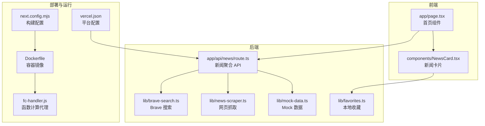
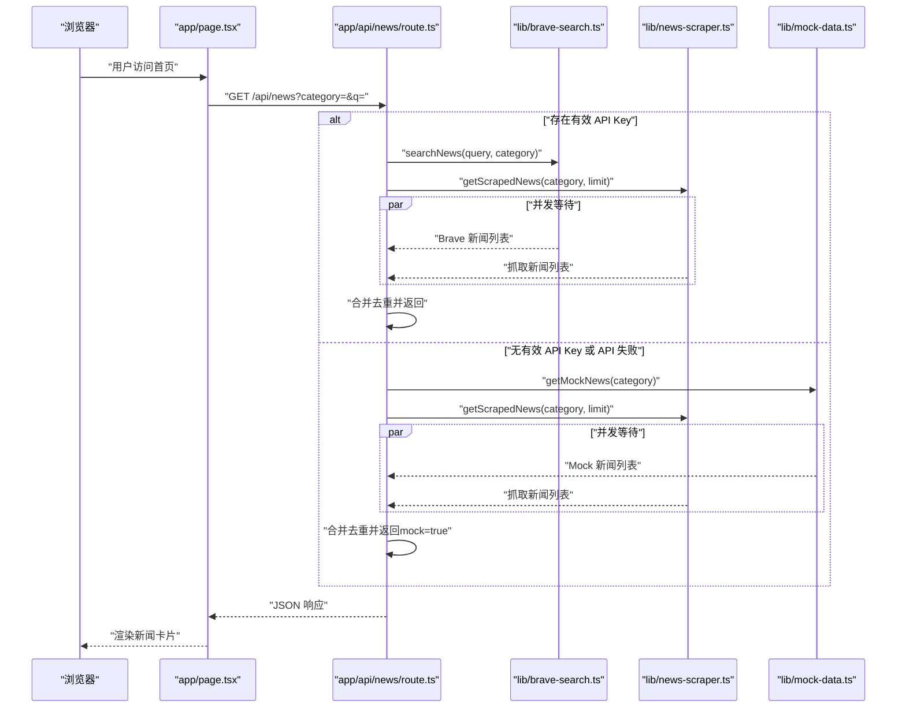
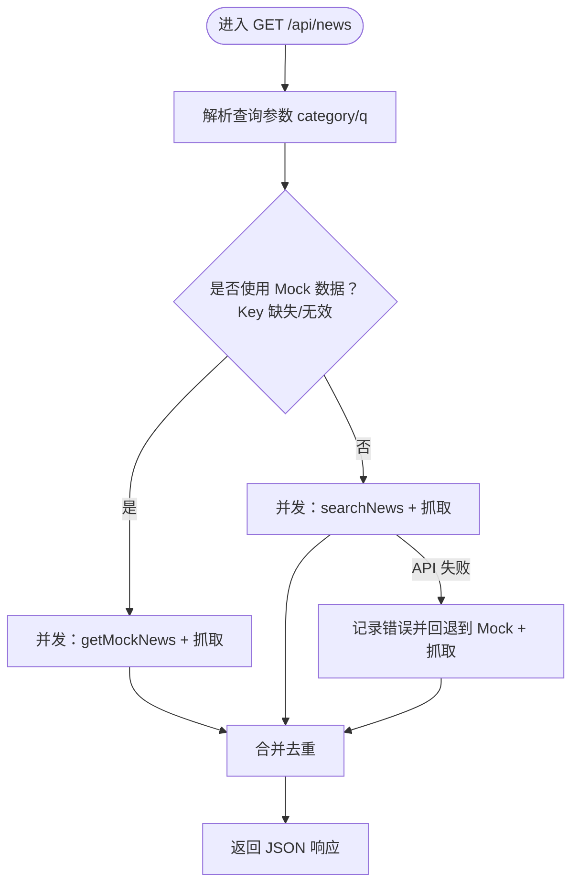
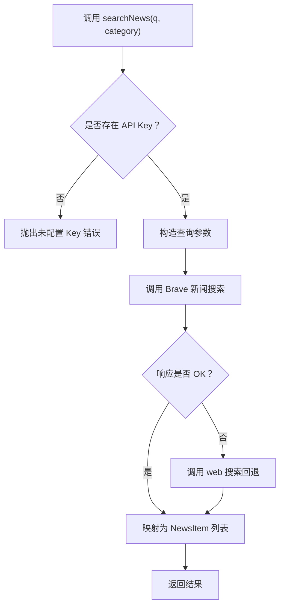
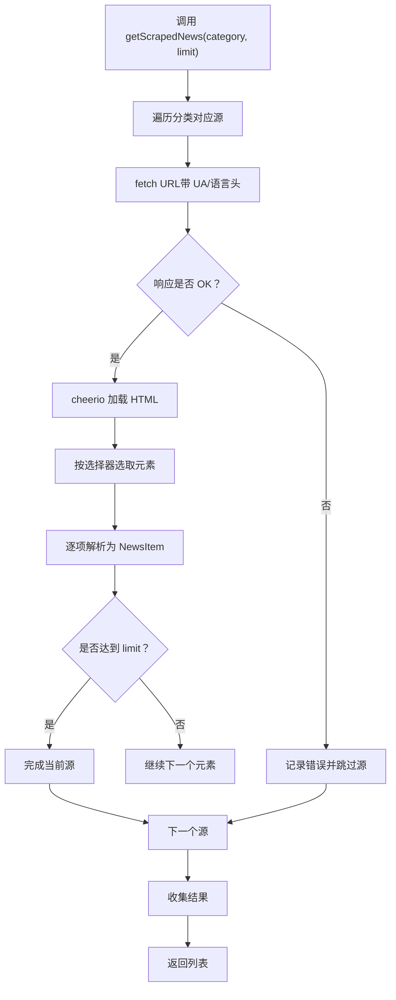
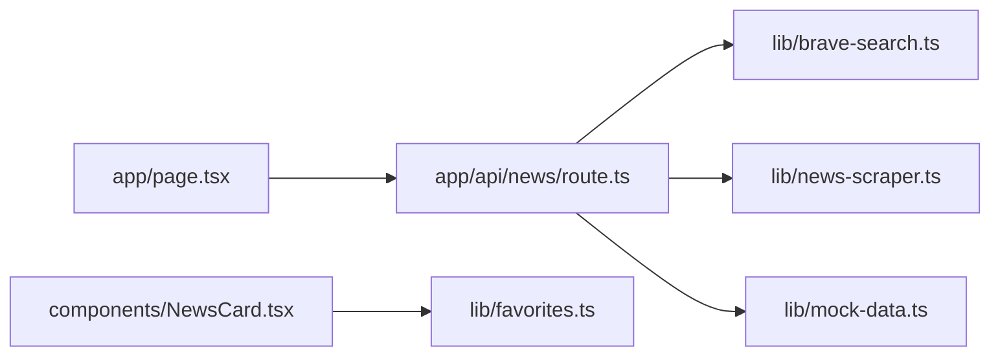

# 故障排除和调试

<cite>
**本文引用的文件**
- [README.md](file://README.md)
- [package.json](file://package.json)
- [app/api/news/route.ts](file://app/api/news/route.ts)
- [lib/brave-search.ts](file://lib/brave-search.ts)
- [lib/news-scraper.ts](file://lib/news-scraper.ts)
- [lib/mock-data.ts](file://lib/mock-data.ts)
- [lib/favorites.ts](file://lib/favorites.ts)
- [app/page.tsx](file://app/page.tsx)
- [components/NewsCard.tsx](file://components/NewsCard.tsx)
- [next.config.mjs](file://next.config.mjs)
- [vercel.json](file://vercel.json)
- [Dockerfile](file://Dockerfile)
- [fc-handler.js](file://fc-handler.js)
</cite>

## 目录
1. [简介](#简介)
2. [项目结构](#项目结构)
3. [核心组件](#核心组件)
4. [架构总览](#架构总览)
5. [详细组件分析](#详细组件分析)
6. [依赖关系分析](#依赖关系分析)
7. [性能考量](#性能考量)
8. [故障排除指南](#故障排除指南)
9. [结论](#结论)
10. [附录](#附录)

## 简介
本指南面向开发者，系统化梳理该新闻网站项目的故障排除与调试方法，覆盖以下主题：
- API 错误处理与回退机制
- 网络请求调试（Brave Search API、网页抓取）
- 数据获取问题诊断（合并去重、Mock 回退）
- 性能问题诊断与优化建议
- 内存泄漏检测要点
- 运行时错误排查与日志分析
- 开发与生产环境差异化的调试策略
- 常见错误代码与解决方案、预防措施
- 调试工具与监控策略

## 项目结构
该项目基于 Next.js App Router，采用前后端一体化设计：
- 前端页面与交互逻辑位于 app/ 与 components/ 中
- 后端 API 路由位于 app/api/news/route.ts
- 数据源与业务逻辑位于 lib/（Brave Search、网页抓取、Mock 数据、收藏）
- 构建与部署相关配置位于 next.config.mjs、Dockerfile、vercel.json
- Serverless 场景下的 HTTP 代理适配器位于 fc-handler.js

图表来源
- [app/page.tsx](file://app/page.tsx#L1-L153)
- [components/NewsCard.tsx](file://components/NewsCard.tsx#L1-L89)
- [app/api/news/route.ts](file://app/api/news/route.ts#L1-L136)
- [lib/brave-search.ts](file://lib/brave-search.ts#L1-L115)
- [lib/news-scraper.ts](file://lib/news-scraper.ts#L1-L166)
- [lib/mock-data.ts](file://lib/mock-data.ts#L1-L197)
- [lib/favorites.ts](file://lib/favorites.ts#L1-L29)
- [next.config.mjs](file://next.config.mjs#L1-L10)
- [Dockerfile](file://Dockerfile#L1-L16)
- [vercel.json](file://vercel.json#L1-L11)
- [fc-handler.js](file://fc-handler.js#L1-L125)

章节来源
- [README.md](file://README.md#L1-L49)
- [package.json](file://package.json#L1-L30)
- [next.config.mjs](file://next.config.mjs#L1-L10)
- [Dockerfile](file://Dockerfile#L1-L16)
- [vercel.json](file://vercel.json#L1-L11)

## 核心组件
- 新闻聚合 API（GET /api/news）：根据查询参数 category 与 q，同时拉取 Brave Search 与网页抓取结果，合并去重；在 API 不可用时回退到 Mock 数据与抓取数据的合并。
- Brave Search 客户端：封装 Brave Search API 请求，若新闻搜索失败则回退到网页搜索接口；对响应进行标准化映射。
- 网页抓取模块：针对特定站点与选择器解析新闻条目，统一输出 NewsItem 结构；异常时记录日志并返回空数组。
- Mock 数据模块：提供各分类的示例数据，用于开发与测试。
- 前端页面与组件：负责发起请求、展示加载状态、错误提示、收藏切换与渲染。
- 本地收藏：基于浏览器 localStorage 的简单 CRUD。
- 部署与运行：Next.js standalone 构建、Docker 容器化、Vercel 平台配置、函数计算代理适配。

章节来源
- [app/api/news/route.ts](file://app/api/news/route.ts#L1-L136)
- [lib/brave-search.ts](file://lib/brave-search.ts#L1-L115)
- [lib/news-scraper.ts](file://lib/news-scraper.ts#L1-L166)
- [lib/mock-data.ts](file://lib/mock-data.ts#L1-L197)
- [app/page.tsx](file://app/page.tsx#L1-L153)
- [components/NewsCard.tsx](file://components/NewsCard.tsx#L1-L89)
- [lib/favorites.ts](file://lib/favorites.ts#L1-L29)
- [next.config.mjs](file://next.config.mjs#L1-L10)
- [Dockerfile](file://Dockerfile#L1-L16)
- [vercel.json](file://vercel.json#L1-L11)
- [fc-handler.js](file://fc-handler.js#L1-L125)

## 架构总览
下图展示了从浏览器到后端 API、再到外部服务与本地数据源的整体调用链路与回退策略。

图表来源
- [app/page.tsx](file://app/page.tsx#L19-L38)
- [app/api/news/route.ts](file://app/api/news/route.ts#L39-L135)
- [lib/brave-search.ts](file://lib/brave-search.ts#L30-L73)
- [lib/news-scraper.ts](file://lib/news-scraper.ts#L140-L153)
- [lib/mock-data.ts](file://lib/mock-data.ts#L194-L196)

## 详细组件分析

### API 路由（/api/news）
- 输入参数：category（默认 all）、q（可选关键词）
- 并发策略：同时触发网页抓取与 API 搜索，提升响应速度
- 合并去重：以标题小写去空白为键，优先保留 API 来源，再追加抓取结果
- 错误处理与回退：
  - 当 API 返回非 OK 状态时，记录错误并回退到 Mock + 抓取数据
  - 当 API Key 缺失或无效时，直接走 Mock + 抓取路径
- 响应字段：news 列表、category、query、timestamp、sources（统计）、mock 标记

图表来源
- [app/api/news/route.ts](file://app/api/news/route.ts#L39-L135)

章节来源
- [app/api/news/route.ts](file://app/api/news/route.ts#L1-L136)

### Brave Search 客户端
- 必要条件：BRAVE_API_KEY 必须配置，否则抛出错误
- 请求参数：q、count、freshness、text_decorations、search_lang
- 响应回退：当 news 搜索失败时，自动回退到 web 搜索接口
- 输出映射：统一为 NewsItem 结构，包含 id、title、description、url、source、publishedAt、thumbnail、category

图表来源
- [lib/brave-search.ts](file://lib/brave-search.ts#L30-L114)

章节来源
- [lib/brave-search.ts](file://lib/brave-search.ts#L1-L115)

### 网页抓取模块
- 配置：按分类映射站点 URL、选择器与解析器
- 抓取流程：对每个源 fetch HTML，使用 cheerio 解析，按 limit 截断
- 异常处理：单个源失败不影响整体，记录错误并继续
- 输出：统一为 NewsItem 列表；错误时返回空数组

图表来源
- [lib/news-scraper.ts](file://lib/news-scraper.ts#L94-L153)

章节来源
- [lib/news-scraper.ts](file://lib/news-scraper.ts#L1-L166)

### Mock 数据模块
- 提供 all、politics、business、tech 四类示例数据
- 通过 getMockNews(category) 获取对应分类或 all 默认

章节来源
- [lib/mock-data.ts](file://lib/mock-data.ts#L1-L197)

### 前端页面与组件
- 页面：发起 /api/news 请求，处理 loading/error/state，渲染新闻网格
- 组件：新闻卡片支持收藏切换，更新本地收藏并回调刷新

章节来源
- [app/page.tsx](file://app/page.tsx#L1-L153)
- [components/NewsCard.tsx](file://components/NewsCard.tsx#L1-L89)
- [lib/favorites.ts](file://lib/favorites.ts#L1-L29)

### 部署与运行
- Next.js standalone 构建与 Docker 容器化
- Vercel 平台配置，环境变量 BRAVE_API_KEY 通过平台 Secret 注入
- 函数计算代理（fc-handler.js）：在本地或云函数环境中以 HTTP 代理方式转发请求到内部 Next.js 服务器

章节来源
- [next.config.mjs](file://next.config.mjs#L1-L10)
- [Dockerfile](file://Dockerfile#L1-L16)
- [vercel.json](file://vercel.json#L1-L11)
- [fc-handler.js](file://fc-handler.js#L1-L125)

## 依赖关系分析
- 组件耦合与职责分离：
  - app/api/news/route.ts 是聚合层，依赖 lib/brave-search.ts 与 lib/news-scraper.ts；在无 API Key 或 API 失败时依赖 lib/mock-data.ts
  - app/page.tsx 仅通过 /api/news 与后端交互，不直接依赖外部服务
  - components/NewsCard.tsx 依赖 lib/favorites.ts 实现收藏功能
- 外部依赖：
  - Brave Search API（必须配置 Key）
  - 外网站点（网页抓取）
- 内部依赖：
  - 合并去重算法依赖 Set 去重，避免重复条目

图表来源
- [app/api/news/route.ts](file://app/api/news/route.ts#L1-L136)
- [lib/brave-search.ts](file://lib/brave-search.ts#L1-L115)
- [lib/news-scraper.ts](file://lib/news-scraper.ts#L1-L166)
- [lib/mock-data.ts](file://lib/mock-data.ts#L1-L197)
- [app/page.tsx](file://app/page.tsx#L1-L153)
- [components/NewsCard.tsx](file://components/NewsCard.tsx#L1-L89)
- [lib/favorites.ts](file://lib/favorites.ts#L1-L29)

章节来源
- [app/api/news/route.ts](file://app/api/news/route.ts#L1-L136)
- [lib/brave-search.ts](file://lib/brave-search.ts#L1-L115)
- [lib/news-scraper.ts](file://lib/news-scraper.ts#L1-L166)
- [lib/mock-data.ts](file://lib/mock-data.ts#L1-L197)
- [app/page.tsx](file://app/page.tsx#L1-L153)
- [components/NewsCard.tsx](file://components/NewsCard.tsx#L1-L89)
- [lib/favorites.ts](file://lib/favorites.ts#L1-L29)

## 性能考量
- 并发优化：API 与抓取并行执行，减少总等待时间
- 合并去重：以标题标准化为键，避免重复显示
- Mock 回退：在 API 不可用时快速返回数据，保证用户体验
- 图片与静态资源：Next.js standalone 构建与 images 优化配置
- 容器化与冷启动：函数计算代理在首次请求前预热内部服务器，避免冷启动抖动

章节来源
- [app/api/news/route.ts](file://app/api/news/route.ts#L44-L96)
- [lib/brave-search.ts](file://lib/brave-search.ts#L30-L73)
- [lib/news-scraper.ts](file://lib/news-scraper.ts#L116-L153)
- [next.config.mjs](file://next.config.mjs#L1-L10)
- [fc-handler.js](file://fc-handler.js#L14-L41)

## 故障排除指南

### 一、API 错误处理与回退
- 现象
  - /api/news 返回错误或为空
  - 前端显示“获取新闻失败”
- 可能原因
  - Brave API Key 未配置或无效
  - Brave API 返回非 OK 状态
  - 外网不可达或限流
- 排查步骤
  - 检查环境变量 BRAVE_API_KEY 是否正确注入（Vercel Secret 或本地 .env.local）
  - 在浏览器控制台查看 /api/news 的响应与状态码
  - 查看后端日志（本地 dev 输出与平台日志）
- 解决方案
  - 补充或更换有效 API Key
  - 使用 Mock 回退路径验证前端逻辑（无 Key 时自动走 Mock）
  - 适当增加重试与超时配置（当前实现已包含基础超时）

章节来源
- [app/api/news/route.ts](file://app/api/news/route.ts#L7-L11)
- [app/api/news/route.ts](file://app/api/news/route.ts#L112-L134)
- [lib/brave-search.ts](file://lib/brave-search.ts#L35-L37)
- [lib/brave-search.ts](file://lib/brave-search.ts#L55-L58)
- [vercel.json](file://vercel.json#L7-L9)
- [README.md](file://README.md#L24-L32)

### 二、网络请求调试
- Brave Search API
  - 使用浏览器 DevTools Network 面板观察 /api/news 的上游请求
  - 关注 X-Subscription-Token 头是否携带 Key
  - 若返回非 OK，检查 Freshness、语言参数与计费配额
- 网页抓取
  - 检查目标站点是否可达、robots 规则与反爬策略
  - 关注 User-Agent 与 Accept 头是否被站点识别
  - 抓取失败不会阻塞整体，但会记录错误日志

章节来源
- [lib/brave-search.ts](file://lib/brave-search.ts#L47-L53)
- [lib/news-scraper.ts](file://lib/news-scraper.ts#L94-L113)

### 三、数据获取问题诊断
- 现象
  - 新闻列表为空或数量异常
  - 搜索关键词无效或返回为空
- 可能原因
  - 分类 ID 无效导致返回错误
  - 搜索关键词为空时依赖分类关键字，若分类关键字缺失则失败
  - 合并去重导致部分条目被过滤
- 排查步骤
  - 检查 category 参数是否为 all/tech/business/politics
  - 在无 q 时确认分类关键字是否可用
  - 对比 sources 字段中的 api/scraped/total 数量
- 解决方案
  - 使用有效分类 ID
  - 显式传入 q 关键词
  - 检查合并去重逻辑，必要时放宽去重键

章节来源
- [app/api/news/route.ts](file://app/api/news/route.ts#L82-L90)
- [app/api/news/route.ts](file://app/api/news/route.ts#L98-L111)

### 四、性能问题诊断
- 现象
  - 页面加载缓慢、白屏时间长
  - 首次请求响应慢（冷启动）
- 可能原因
  - 外部 API 延迟或限流
  - 抓取站点响应慢或不稳定
  - 容器冷启动或函数计算预热不足
- 排查步骤
  - 使用浏览器 Performance 面板分析首屏渲染
  - 查看 /api/news 的耗时与并发情况
  - 在函数计算代理中观察首次请求等待时间
- 优化建议
  - 缓存常用分类结果（短期缓存）
  - 限制抓取数量与并发度
  - 预热内部服务器（已有预热逻辑）

章节来源
- [app/api/news/route.ts](file://app/api/news/route.ts#L44-L96)
- [fc-handler.js](file://fc-handler.js#L14-L41)

### 五、内存泄漏检测
- 关注点
  - 抓取过程中大量 Cheerio DOM 解析与字符串拼接
  - 合并去重使用 Set 存储标题键，注意键的生命周期
  - 前端组件未清理的定时器或订阅（本项目未发现明显泄漏点）
- 建议
  - 使用浏览器 Memory 面板定期采样
  - 对大规模抓取任务分批处理
  - 合理释放 DOM 与中间对象引用

章节来源
- [lib/news-scraper.ts](file://lib/news-scraper.ts#L116-L153)
- [app/api/news/route.ts](file://app/api/news/route.ts#L14-L37)

### 六、运行时错误排查
- 常见错误类型
  - HTTP 错误：抓取站点返回非 OK
  - API Key 未配置：Brave Search 抛错
  - 网络超时：代理或上游服务超时
- 日志与监控
  - 后端控制台日志：Brave 搜索错误、抓取错误、合并日志
  - 前端错误提示：统一的“获取新闻失败”提示
  - 平台日志：Vercel 或云函数平台日志
- 调试工具
  - 浏览器 DevTools：Network、Console、Performance
  - curl/wget：直接调用 /api/news 验证响应
  - 本地与生产环境日志对比

章节来源
- [lib/brave-search.ts](file://lib/brave-search.ts#L104-L114)
- [lib/news-scraper.ts](file://lib/news-scraper.ts#L104-L112)
- [app/api/news/route.ts](file://app/api/news/route.ts#L112-L114)
- [app/page.tsx](file://app/page.tsx#L26-L35)

### 七、开发与生产环境调试方法
- 开发环境（next dev）
  - 直接访问 http://localhost:3000 或 3001
  - 控制台输出详细日志，便于定位 API 与抓取错误
- 生产环境（Docker/Vercel/函数计算）
  - Docker：容器暴露 9000 端口，可通过宿主机访问
  - Vercel：通过平台日志查看 API Key 注入与运行时错误
  - 函数计算：fc-handler.js 代理内部 Next.js，关注 502/504 超时与代理错误

章节来源
- [README.md](file://README.md#L5-L11)
- [Dockerfile](file://Dockerfile#L9-L15)
- [vercel.json](file://vercel.json#L1-L11)
- [fc-handler.js](file://fc-handler.js#L1-L125)

### 八、常见错误代码与含义
- 400（无效分类）：当分类 ID 不存在时返回
- 502（Bad Gateway）：代理上游失败（函数计算代理）
- 504（Gateway Timeout）：上游请求超时（函数计算代理）
- 其他 HTTP 非 OK：Brave Search 返回的错误状态

章节来源
- [app/api/news/route.ts](file://app/api/news/route.ts#L84-L87)
- [lib/brave-search.ts](file://lib/brave-search.ts#L97-L99)
- [fc-handler.js](file://fc-handler.js#L103-L119)

### 九、解决方案与预防措施
- 解决方案
  - 配置有效 API Key 并确保网络可达
  - 在无 Key 或 API 失败时依赖 Mock 回退
  - 为抓取失败设置容错与降级
- 预防措施
  - 增加重试与指数退避
  - 限制并发与批量大小
  - 前端增加更细粒度的错误提示与重试按钮
  - 平台侧配置健康检查与告警

章节来源
- [app/api/news/route.ts](file://app/api/news/route.ts#L48-L74)
- [app/api/news/route.ts](file://app/api/news/route.ts#L112-L134)
- [lib/brave-search.ts](file://lib/brave-search.ts#L55-L58)

## 结论
本项目通过“并发拉取 + 合并去重 + 多级回退”的架构，实现了在外部服务不稳定时的稳健运行。调试重点在于：
- 正确配置与注入 API Key
- 区分开发与生产环境的差异
- 利用 Mock 回退快速验证前端逻辑
- 通过日志与平台监控定位问题根因
- 在性能与稳定性之间平衡并发与降级策略

## 附录

### A. 调试清单
- 环境变量：BRAVE_API_KEY 是否存在且有效
- 网络连通性：Brave API 与抓取站点是否可达
- 响应状态：/api/news 的状态码与 sources 统计
- 日志输出：后端控制台与平台日志
- 前端体验：loading、错误提示、收藏功能

### B. 常用命令与入口
- 本地开发：npm run dev，访问 http://localhost:3000
- 构建与运行：npm run build、npm start
- Docker 运行：基于 .next/standalone 构建镜像并运行
- 平台部署：Vercel 配置与 Secret 注入

章节来源
- [README.md](file://README.md#L5-L11)
- [package.json](file://package.json#L5-L9)
- [next.config.mjs](file://next.config.mjs#L1-L10)
- [Dockerfile](file://Dockerfile#L1-L16)
- [vercel.json](file://vercel.json#L1-L11)