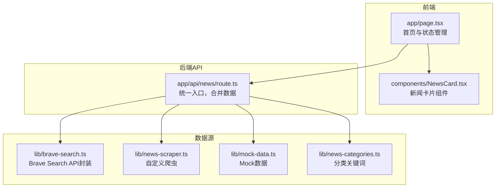
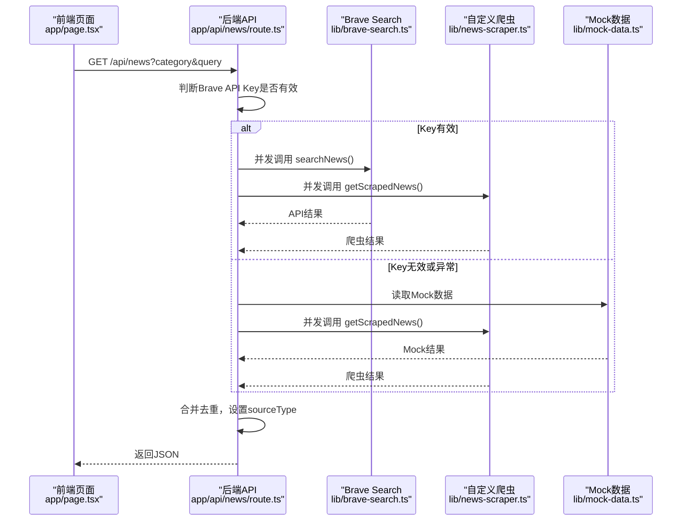
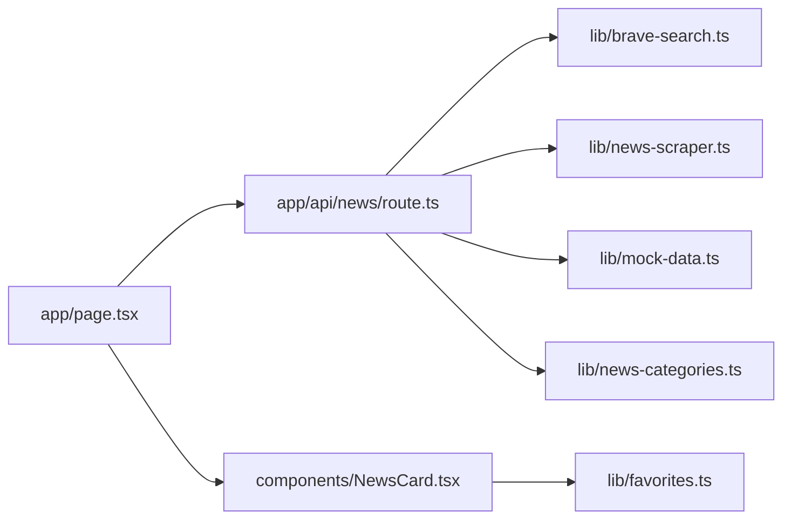

# 数据源调试

<cite>
**本文引用的文件**
- [lib/news-scraper.ts](file://lib/news-scraper.ts)
- [lib/mock-data.ts](file://lib/mock-data.ts)
- [app/api/news/route.ts](file://app/api/news/route.ts)
- [lib/brave-search.ts](file://lib/brave-search.ts)
- [lib/news-categories.ts](file://lib/news-categories.ts)
- [lib/favorites.ts](file://lib/favorites.ts)
- [app/page.tsx](file://app/page.tsx)
- [components/NewsCard.tsx](file://components/NewsCard.tsx)
- [README.md](file://README.md)
- [package.json](file://package.json)
</cite>

## 目录
1. [简介](#简介)
2. [项目结构](#项目结构)
3. [核心组件](#核心组件)
4. [架构总览](#架构总览)
5. [组件详解与调试要点](#组件详解与调试要点)
6. [依赖关系分析](#依赖关系分析)
7. [性能与监控建议](#性能与监控建议)
8. [故障排查指南](#故障排查指南)
9. [结论](#结论)
10. [附录](#附录)

## 简介
本指南面向“新闻爬虫系统与模拟数据”的调试工作，覆盖以下主题：
- 自定义爬虫的数据获取流程与HTML解析错误诊断
- 数据提取失败的定位与修复
- 反爬虫机制应对策略
- 数据源可用性检查
- Mock数据系统的调试技巧（数据结构验证、模拟数据生成、一致性检查）
- 网络请求调试、HTML解析错误与数据转换问题的解决方案
- 性能监控与数据质量评估方法

## 项目结构
该系统采用Next.js App Router架构，数据流由前端页面发起请求，后端API聚合Brave Search API与自建爬虫数据，并通过Mock数据进行降级与对比验证。

图表来源
- [app/page.tsx](file://app/page.tsx#L1-L153)
- [components/NewsCard.tsx](file://components/NewsCard.tsx#L1-L89)
- [app/api/news/route.ts](file://app/api/news/route.ts#L1-L136)
- [lib/brave-search.ts](file://lib/brave-search.ts#L1-L115)
- [lib/news-scraper.ts](file://lib/news-scraper.ts#L1-L166)
- [lib/mock-data.ts](file://lib/mock-data.ts#L1-L197)
- [lib/news-categories.ts](file://lib/news-categories.ts#L1-L45)

章节来源
- [README.md](file://README.md#L1-L49)
- [package.json](file://package.json#L1-L30)

## 核心组件
- 数据聚合与降级逻辑：后端API根据Brave API Key是否有效，自动切换到Mock数据或爬虫数据，并进行去重合并。
- 爬虫模块：基于Cheerio解析Hacker News页面，按分类抽取标题、链接等字段。
- Mock数据模块：提供全量分类的静态数据，便于开发与回归测试。
- Brave Search封装：统一请求参数、错误处理与回退策略（新闻搜索失败时回退到网页搜索）。
- 分类关键词：为分类提供查询关键词集合，用于API查询构造。
- 前端页面与组件：负责发起请求、展示加载状态、错误提示与收藏交互。

章节来源
- [app/api/news/route.ts](file://app/api/news/route.ts#L1-L136)
- [lib/news-scraper.ts](file://lib/news-scraper.ts#L1-L166)
- [lib/mock-data.ts](file://lib/mock-data.ts#L1-L197)
- [lib/brave-search.ts](file://lib/brave-search.ts#L1-L115)
- [lib/news-categories.ts](file://lib/news-categories.ts#L1-L45)
- [app/page.tsx](file://app/page.tsx#L1-L153)
- [components/NewsCard.tsx](file://components/NewsCard.tsx#L1-L89)

## 架构总览
后端API的请求处理流程如下：

图表来源
- [app/api/news/route.ts](file://app/api/news/route.ts#L39-L135)
- [lib/brave-search.ts](file://lib/brave-search.ts#L30-L73)
- [lib/news-scraper.ts](file://lib/news-scraper.ts#L140-L153)
- [lib/mock-data.ts](file://lib/mock-data.ts#L194-L196)

## 组件详解与调试要点

### 后端API：数据聚合与降级
- 关键点
  - 使用环境变量判断是否启用Mock：当API Key为空或为占位值时，强制走Mock路径。
  - 并发获取Brave与爬虫数据，提升响应速度。
  - 去重策略：以标题小写去重，优先保留API数据，再追加爬虫数据。
  - 错误回退：API调用失败时，回退到Mock+爬虫组合，保证可用性。
- 调试建议
  - 在本地设置无效或空的API Key，验证Mock路径是否生效。
  - 观察返回体中的sources统计，确认各数据源贡献数量。
  - 对于查询参数，确认是否正确传入category或q，以及关键词构造逻辑。

章节来源
- [app/api/news/route.ts](file://app/api/news/route.ts#L7-L135)

### Brave Search封装：网络请求与回退
- 关键点
  - 请求参数：q、count、freshness、text_decorations、search_lang等。
  - 头部认证：X-Subscription-Token为API Key。
  - 回退策略：新闻搜索失败时自动回退到网页搜索接口。
  - 结果映射：将外部结果映射为统一的NewsItem结构。
- 调试建议
  - 确认环境变量BRAVE_API_KEY已正确配置。
  - 当API返回非2xx时，检查回退逻辑是否触发网页搜索。
  - 若出现字段缺失（如age/page_age），检查映射逻辑与默认值设置。

章节来源
- [lib/brave-search.ts](file://lib/brave-search.ts#L27-L115)

### 自定义爬虫：HTML解析与数据提取
- 关键点
  - 配置：按分类维护URL、CSS选择器与解析器。
  - 解析：使用Cheerio加载HTML，按selector选取元素，逐条调用parser生成NewsItem。
  - 过滤：排除无效链接（如评论页），确保数据有效性。
  - 错误处理：单个源失败不影响整体结果，但需关注日志。
- 调试建议
  - HTML解析错误：检查selector是否匹配当前站点结构；必要时更新选择器。
  - 数据提取失败：打印元素文本与属性，确认字段存在且未被JS渲染。
  - 反爬虫：为fetch设置合理的User-Agent与Accept头，避免403/429。

章节来源
- [lib/news-scraper.ts](file://lib/news-scraper.ts#L6-L91)
- [lib/news-scraper.ts](file://lib/news-scraper.ts#L94-L138)
- [lib/news-scraper.ts](file://lib/news-scraper.ts#L140-L166)

### Mock数据：结构验证与一致性检查
- 关键点
  - 提供all、politics、business、tech四类静态数据。
  - getMockNews按分类返回对应数组，不存在时回退到all。
- 调试建议
  - 数据结构验证：确保每个NewsItem包含id、title、description、url、source、publishedAt、category等字段。
  - 一致性检查：与Brave与爬虫输出的字段结构保持一致，避免前端渲染差异。
  - 生成策略：新增分类时，同步补充Mock数据，保证覆盖率。

章节来源
- [lib/mock-data.ts](file://lib/mock-data.ts#L3-L196)

### 分类关键词：查询构造与回退
- 关键点
  - NEWS_CATEGORIES提供分类与关键词集合。
  - getCategoryById用于根据id查找关键词，若无q则拼接关键词作为查询串。
- 调试建议
  - 当category无效时，API返回400并提示错误。
  - 确认关键词拼接逻辑（OR连接）与API支持的语法兼容。

章节来源
- [lib/news-categories.ts](file://lib/news-categories.ts#L7-L44)

### 前端页面与组件：请求、状态与收藏
- 关键点
  - 页面发起GET /api/news，处理loading、error与空数据场景。
  - 组件NewsCard负责收藏状态与UI展示。
  - 收藏使用localStorage持久化。
- 调试建议
  - 检查网络面板，确认请求参数与响应体结构。
  - 收藏功能异常时，检查localStorage可用性与序列化/反序列化。

章节来源
- [app/page.tsx](file://app/page.tsx#L19-L63)
- [components/NewsCard.tsx](file://components/NewsCard.tsx#L12-L27)
- [lib/favorites.ts](file://lib/favorites.ts#L7-L28)

## 依赖关系分析
- 组件耦合
  - API层依赖Brave封装、爬虫模块与Mock模块，形成“数据源聚合”。
  - 前端仅依赖API层，不直接依赖具体数据源，便于替换与扩展。
- 外部依赖
  - Brave Search API：认证与网络稳定性直接影响数据可用性。
  - cheerio：HTML解析稳定性与选择器健壮性决定爬虫成功率。
- 循环依赖
  - 未发现循环导入；模块职责清晰。

图表来源
- [app/page.tsx](file://app/page.tsx#L1-L153)
- [components/NewsCard.tsx](file://components/NewsCard.tsx#L1-L89)
- [app/api/news/route.ts](file://app/api/news/route.ts#L1-L136)
- [lib/brave-search.ts](file://lib/brave-search.ts#L1-L115)
- [lib/news-scraper.ts](file://lib/news-scraper.ts#L1-L166)
- [lib/mock-data.ts](file://lib/mock-data.ts#L1-L197)
- [lib/news-categories.ts](file://lib/news-categories.ts#L1-L45)
- [lib/favorites.ts](file://lib/favorites.ts#L1-L29)

## 性能与监控建议
- 并发优化
  - API层已并发调用Brave与爬虫，建议保持此策略，减少总等待时间。
- 缓存策略
  - 对Brave搜索结果进行短期缓存（如1-5分钟），降低API调用频率。
  - 爬虫结果可按分类缓存，结合时间戳控制新鲜度。
- 日志与指标
  - 记录各数据源的成功率、耗时与错误码，便于趋势分析。
  - 在前端埋点请求耗时与错误类型，辅助用户体验优化。
- 资源限制
  - 控制单次请求的limit，避免一次性拉取过多导致内存压力。
  - 对HTML解析设置超时与最大字节数限制，防止异常站点阻塞。

[本节为通用建议，无需特定文件来源]

## 故障排查指南

### 1) 数据源可用性检查
- Brave API Key配置
  - 确认环境变量BRAVE_API_KEY已设置且非占位值。
  - 若为空或为占位值，API将强制走Mock路径。
- API可达性
  - 检查网络连通性与代理设置。
  - 观察API返回状态码与错误信息，必要时开启抓包工具分析请求/响应。
- 爬虫站点可用性
  - 访问目标站点，确认页面结构未发生重大变更。
  - 若selector失效，需更新选择器与解析器。

章节来源
- [app/api/news/route.ts](file://app/api/news/route.ts#L7-L11)
- [lib/brave-search.ts](file://lib/brave-search.ts#L27-L53)
- [lib/news-scraper.ts](file://lib/news-scraper.ts#L94-L113)

### 2) HTML解析错误与数据提取失败
- 常见症状
  - cheerio选择器无法命中元素；解析后字段为空。
- 诊断步骤
  - 打印原始HTML片段与选择器匹配结果，确认元素是否存在。
  - 检查目标站点是否使用JS动态渲染，若是，则需要服务端渲染或替代方案。
  - 校验parser逻辑，确保对空值与异常格式有兜底处理。
- 修复建议
  - 更新selector以适配最新页面结构。
  - 为解析器增加更严格的字段校验与默认值设置。
  - 对于部分不可靠字段，考虑降级或移除。

章节来源
- [lib/news-scraper.ts](file://lib/news-scraper.ts#L120-L131)

### 3) 反爬虫机制应对策略
- 行为特征
  - 403 Forbidden、429 Too Many Requests、IP被封禁。
- 应对策略
  - 设置合理的User-Agent与Accept头，模拟常见浏览器。
  - 控制请求频率，增加随机延时，避免高频抓取。
  - 使用代理池轮换IP，降低单一IP压力。
  - 对于需要登录的站点，考虑服务端登录态维护与会话复用。
  - 将解析逻辑迁移至服务端，减少客户端指纹暴露。

章节来源
- [lib/news-scraper.ts](file://lib/news-scraper.ts#L94-L113)

### 4) 网络请求调试
- Brave Search
  - 检查X-Subscription-Token是否正确传递。
  - 关注回退逻辑：新闻搜索失败时自动切换到网页搜索。
- 爬虫
  - 使用浏览器开发者工具或curl验证目标URL可访问性。
  - 检查响应编码与Content-Type，确保cheerio正确加载。
- 前端
  - 检查fetch错误与网络面板，确认参数拼接正确。

章节来源
- [lib/brave-search.ts](file://lib/brave-search.ts#L47-L58)
- [lib/brave-search.ts](file://lib/brave-search.ts#L88-L99)
- [app/page.tsx](file://app/page.tsx#L24-L36)

### 5) 数据转换与一致性检查
- 字段映射
  - 确保Brave与爬虫输出的NewsItem字段一致（id、title、description、url、source、publishedAt、category等）。
- 去重与排序
  - 去重键应稳定且唯一，避免大小写与空白字符差异导致误判。
  - 合并顺序应优先保留API数据，再追加爬虫数据。
- Mock一致性
  - Mock数据应覆盖所有分类，字段与类型与真实数据一致，便于回归测试。

章节来源
- [app/api/news/route.ts](file://app/api/news/route.ts#L14-L37)
- [lib/brave-search.ts](file://lib/brave-search.ts#L63-L72)
- [lib/news-scraper.ts](file://lib/news-scraper.ts#L14-L28)
- [lib/mock-data.ts](file://lib/mock-data.ts#L3-L196)

### 6) 数据质量评估
- 指标建议
  - 成功率：API/爬虫/合并后的有效数据比例。
  - 完整性：字段缺失率（description、url、source等）。
  - 时效性：publishedAt字段的合理性与更新频率。
  - 重复率：去重前后的数据量对比。
- 方法
  - 基于返回体的sources统计进行快速评估。
  - 前端埋点记录请求耗时与错误类型，定期生成报表。

章节来源
- [app/api/news/route.ts](file://app/api/news/route.ts#L101-L111)
- [app/api/news/route.ts](file://app/api/news/route.ts#L122-L133)

## 结论
本系统通过“API + 爬虫 + Mock”的三层数据源设计，实现了高可用与可调试性。调试时应重点关注：
- API Key配置与网络可达性
- HTML解析与数据提取的健壮性
- 反爬虫策略与请求频率控制
- 数据结构一致性与去重策略
- 性能与监控指标的建立

通过上述方法，可以快速定位问题、提升数据质量，并保障系统的长期稳定运行。

[本节为总结，无需特定文件来源]

## 附录

### A. 常见问题速查
- API返回400：检查category是否有效，或确认关键词构造逻辑。
- API返回5xx：检查Brave服务状态与网络连通性。
- 爬虫返回空：检查selector与站点结构是否变化。
- Mock未生效：确认BRAVE_API_KEY是否为空或占位值。

章节来源
- [app/api/news/route.ts](file://app/api/news/route.ts#L82-L90)
- [lib/brave-search.ts](file://lib/brave-search.ts#L35-L37)
- [lib/news-scraper.ts](file://lib/news-scraper.ts#L120-L131)
- [app/api/news/route.ts](file://app/api/news/route.ts#L7-L11)

### B. 开发与部署建议
- 开发环境
  - 使用无效API Key验证Mock路径与合并逻辑。
  - 在本地启用严格模式与类型检查，减少运行期错误。
- 生产环境
  - 配置健康检查与告警，监控API Key剩余额度与错误率。
  - 对爬虫设置超时与重试策略，避免单点故障。

章节来源
- [README.md](file://README.md#L24-L33)
- [package.json](file://package.json#L1-L30)