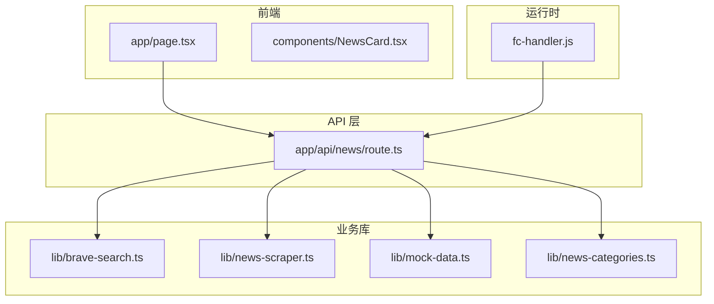
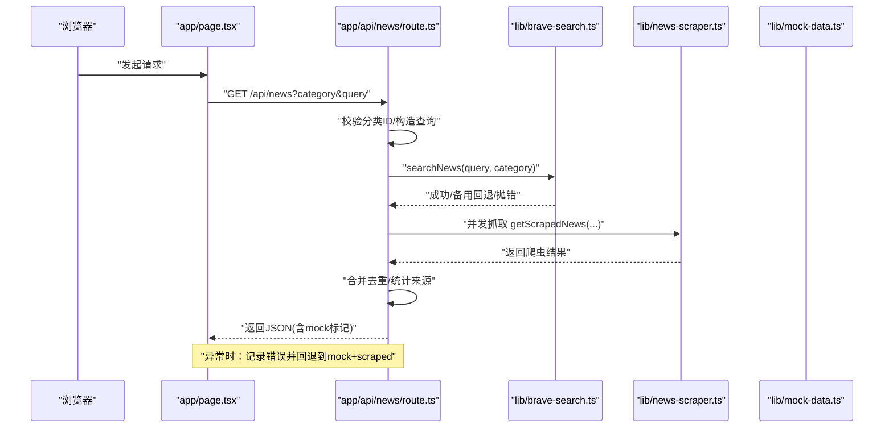
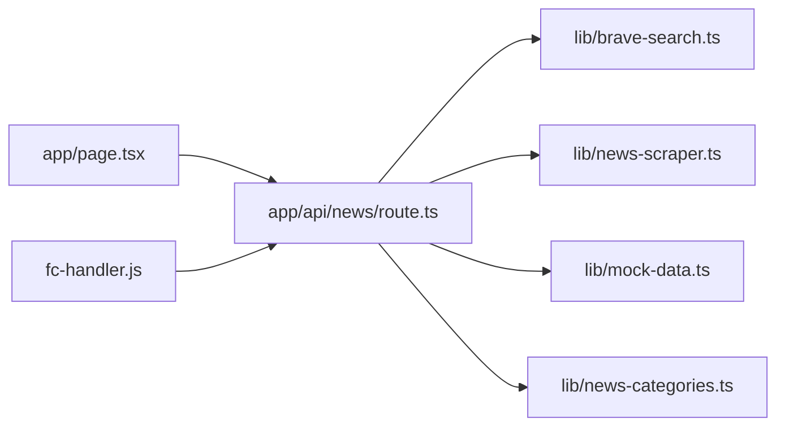
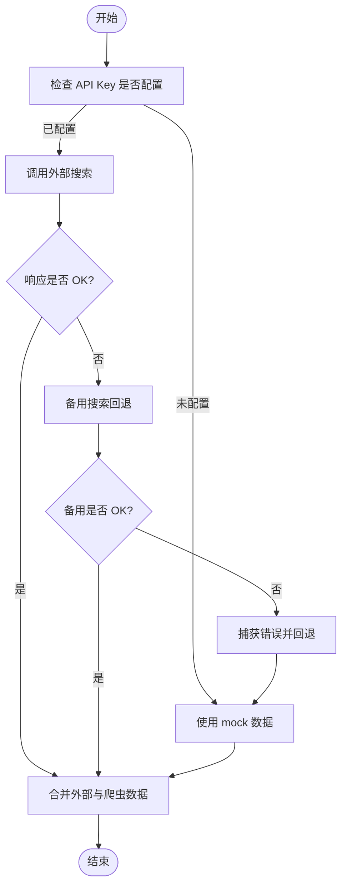

# 错误处理调试

<cite>
**本文引用的文件**
- [app/api/news/route.ts](file://app/api/news/route.ts)
- [lib/brave-search.ts](file://lib/brave-search.ts)
- [lib/news-scraper.ts](file://lib/news-scraper.ts)
- [lib/mock-data.ts](file://lib/mock-data.ts)
- [lib/news-categories.ts](file://lib/news-categories.ts)
- [fc-handler.js](file://fc-handler.js)
- [app/page.tsx](file://app/page.tsx)
- [components/NewsCard.tsx](file://components/NewsCard.tsx)
- [package.json](file://package.json)
- [README.md](file://README.md)
</cite>

## 目录
1. [简介](#简介)
2. [项目结构](#项目结构)
3. [核心组件](#核心组件)
4. [架构总览](#架构总览)
5. [详细组件分析](#详细组件分析)
6. [依赖关系分析](#依赖关系分析)
7. [性能考量](#性能考量)
8. [故障排查指南](#故障排查指南)
9. [结论](#结论)
10. [附录](#附录)

## 简介
本指南围绕“错误处理与调试”主题，系统梳理该 AI 新闻网站在开发与生产环境中的异常捕获、错误分类、降级与回退策略、用户提示设计、日志与监控告警以及自动恢复机制。文档以实际代码为依据，结合 API 调用失败降级、mock 数据回退、网络超时与解析错误处理、分类 ID 校验失败等场景，给出可操作的调试步骤与最佳实践。

## 项目结构
项目采用 Next.js App Router 架构，API 路由位于 app/api/news/route.ts，业务逻辑分布在 lib 目录下的模块中，前端页面与组件位于 app 与 components 目录。整体结构清晰，便于按职责划分错误处理边界。

图表来源
- [app/page.tsx](file://app/page.tsx#L1-L153)
- [app/api/news/route.ts](file://app/api/news/route.ts#L1-L136)
- [lib/brave-search.ts](file://lib/brave-search.ts#L1-L115)
- [lib/news-scraper.ts](file://lib/news-scraper.ts#L1-L166)
- [lib/mock-data.ts](file://lib/mock-data.ts#L1-L197)
- [lib/news-categories.ts](file://lib/news-categories.ts#L1-L45)
- [fc-handler.js](file://fc-handler.js#L1-L114)

章节来源
- [README.md](file://README.md#L36-L49)
- [package.json](file://package.json#L1-L30)

## 核心组件
- API 路由层：负责参数校验、并发拉取外部数据与本地爬虫数据、合并与去重、统一返回格式；在异常时执行降级与回退策略。
- 外部搜索模块：封装 Brave Search API 调用，包含备用 Web 搜索回退与错误抛出。
- 爬虫模块：基于 cheerio 解析网页，包含单站点抓取与分类抓取的错误捕获与降级。
- Mock 数据模块：提供分类维度的静态数据，用于无 API 密钥或 API 失败时的回退。
- 分类配置模块：提供分类 ID 到关键词的映射，用于查询构造与校验。
- 前端页面：负责发起请求、展示加载状态、错误提示与数据渲染。
- 运行时代理：在特定部署环境下代理请求，包含超时与服务未就绪的处理。

章节来源
- [app/api/news/route.ts](file://app/api/news/route.ts#L39-L135)
- [lib/brave-search.ts](file://lib/brave-search.ts#L30-L114)
- [lib/news-scraper.ts](file://lib/news-scraper.ts#L94-L153)
- [lib/mock-data.ts](file://lib/mock-data.ts#L194-L197)
- [lib/news-categories.ts](file://lib/news-categories.ts#L42-L44)
- [app/page.tsx](file://app/page.tsx#L19-L38)
- [fc-handler.js](file://fc-handler.js#L60-L113)

## 架构总览
以下序列图展示了从浏览器到 API、再到外部服务与本地爬虫的数据流与错误降级路径。

图表来源
- [app/page.tsx](file://app/page.tsx#L19-L38)
- [app/api/news/route.ts](file://app/api/news/route.ts#L39-L135)
- [lib/brave-search.ts](file://lib/brave-search.ts#L30-L114)
- [lib/news-scraper.ts](file://lib/news-scraper.ts#L141-L153)
- [lib/mock-data.ts](file://lib/mock-data.ts#L194-L197)

## 详细组件分析

### API 路由层：异常捕获、降级与回退
- 参数与分类校验：当未提供查询词时，根据分类 ID 获取关键词；若分类无效则返回 400。
- 并发拉取：同时调用外部搜索与本地爬虫，提升可用性与鲁棒性。
- 异常捕获：捕获未知错误，记录日志并回退到 mock 数据与爬虫数据的合并结果，同时设置 mock 标记与来源统计。
- 查询过滤：当提供查询词时，对合并后的结果进行标题/描述过滤。
- 使用建议
  - 在 try-catch 中包裹外部调用与复杂逻辑，确保异常可控。
  - 对错误进行分级：如网络错误、解析错误、配置错误等，以便差异化处理。
  - 记录上下文信息（分类、查询词、时间戳）以辅助定位问题。

章节来源
- [app/api/news/route.ts](file://app/api/news/route.ts#L39-L135)

### 外部搜索模块：API 调用失败的降级策略
- 必要条件：若未配置 API Key，则直接抛出错误，避免静默失败。
- 主流程：调用新闻搜索接口，若响应非 OK，尝试回退到 Web 搜索接口。
- 失败处理：Web 搜索仍失败时抛出错误，供上层路由捕获并触发降级。
- 使用建议
  - 对响应状态与 JSON 结构进行严格校验，避免解析空对象导致的后续异常。
  - 在网络层设置合理的超时与重试策略（可在 fetch 层封装）。
  - 对错误进行分类：如 401/403（鉴权）、429（配额/限流）、5xx（服务不可用）。

章节来源
- [lib/brave-search.ts](file://lib/brave-search.ts#L27-L73)
- [lib/brave-search.ts](file://lib/brave-search.ts#L75-L114)

### 爬虫模块：网络超时与解析错误处理
- 单站点抓取：对 HTTP 状态码进行校验，失败时抛出错误并记录日志。
- 分类抓取：遍历多个来源，逐个抓取并解析，单个来源失败不影响整体结果，最终返回已解析的新闻列表。
- 主函数：对外暴露抓取函数，内部捕获异常并返回空数组，保证上层不被中断。
- 使用建议
  - 为每个站点设置独立超时与重试，避免阻塞整体流程。
  - 对选择器与解析逻辑进行健壮性检查，防止空值导致的异常。
  - 记录站点与选择器相关信息，便于快速定位问题。

章节来源
- [lib/news-scraper.ts](file://lib/news-scraper.ts#L94-L113)
- [lib/news-scraper.ts](file://lib/news-scraper.ts#L116-L138)
- [lib/news-scraper.ts](file://lib/news-scraper.ts#L141-L153)

### Mock 数据模块：无 API 时的回退机制
- 提供 all/politics/business/tech 四类静态数据，用于在 API 不可用或密钥未配置时回退。
- 返回值包含 id、title、description、url、source、publishedAt、category 等字段，与外部数据结构一致，便于无缝替换。
- 使用建议
  - 在开发与测试环境中默认启用 mock，确保功能可用性。
  - 在生产环境检测到 API Key 缺失或无效时，主动降级到 mock 并提示用户配置。

章节来源
- [lib/mock-data.ts](file://lib/mock-data.ts#L3-L192)
- [lib/mock-data.ts](file://lib/mock-data.ts#L194-L197)

### 分类 ID 校验：无效分类的处理流程
- 通过分类 ID 查找对应关键词集合；若不存在，返回 400 错误给客户端。
- 使用建议
  - 在路由层明确区分“查询词存在”与“查询词为空”的分支，避免误用无效分类。
  - 对分类 ID 进行白名单校验，防止注入或越权访问。

章节来源
- [lib/news-categories.ts](file://lib/news-categories.ts#L42-L44)
- [app/api/news/route.ts](file://app/api/news/route.ts#L82-L88)

### 前端页面：用户友好的错误提示设计
- 请求前设置 loading 与 error 状态，请求结束后清理状态。
- 当 fetch 返回非 OK 或抛出异常时，设置错误消息并清空新闻列表，确保界面反馈及时。
- 使用建议
  - 错误文案应简洁明确，避免技术术语；必要时提供重试按钮或引导用户检查配置。
  - 对于网络错误与 API 配置错误，区分提示语句，帮助用户快速定位问题。

章节来源
- [app/page.tsx](file://app/page.tsx#L19-L38)
- [app/page.tsx](file://app/page.tsx#L108-L112)

### 运行时代理：服务未就绪与超时处理
- 在特定部署环境下，通过本地代理转发请求；若服务未就绪，等待最多 30 秒并返回“服务启动中”提示。
- 设置请求超时（例如 2 秒），超时即判定失败并返回错误响应。
- 使用建议
  - 在容器启动阶段增加健康检查与预热，减少首次请求的等待时间。
  - 对代理层的错误进行分类记录，便于定位部署与网络问题。

章节来源
- [fc-handler.js](file://fc-handler.js#L60-L113)

## 依赖关系分析
- API 路由依赖外部搜索与本地爬虫模块，同时在异常时依赖 mock 数据模块。
- 外部搜索模块依赖环境变量中的 API Key，若缺失则抛出错误。
- 爬虫模块依赖 cheerio 与外部站点，需关注网络稳定性与解析健壮性。
- 前端页面依赖 API 路由返回的数据结构，需兼容 mock 标记与来源统计字段。

图表来源
- [app/api/news/route.ts](file://app/api/news/route.ts#L1-L12)
- [lib/brave-search.ts](file://lib/brave-search.ts#L27-L28)
- [lib/news-scraper.ts](file://lib/news-scraper.ts#L1-L3)
- [lib/mock-data.ts](file://lib/mock-data.ts#L1-L1)
- [lib/news-categories.ts](file://lib/news-categories.ts#L1-L5)
- [app/page.tsx](file://app/page.tsx#L1-L10)
- [fc-handler.js](file://fc-handler.js#L1-L10)

## 性能考量
- 并发优化：API 层对搜索与爬虫采用并发执行，缩短整体响应时间。
- 去重与合并：通过标题标准化与集合去重，避免重复数据影响用户体验。
- 降级策略：在 API 失败时快速回退到 mock 与爬虫数据，保障服务连续性。
- 建议
  - 对外部 API 增加缓存层（如 Redis/TurboCache）以减少重复请求。
  - 对爬虫设置速率限制与并发上限，避免对目标站点造成压力。
  - 在前端引入骨架屏与渐进式渲染，改善感知性能。

## 故障排查指南

### 异常捕获与错误分类
- 分类 ID 无效
  - 现象：返回 400，提示无效分类。
  - 定位：检查分类 ID 是否在允许列表中，确认传参是否正确。
  - 参考
    - [app/api/news/route.ts](file://app/api/news/route.ts#L82-L88)
    - [lib/news-categories.ts](file://lib/news-categories.ts#L42-L44)
- API Key 未配置或无效
  - 现象：外部搜索直接抛错，路由捕获后回退到 mock+scraped。
  - 定位：检查环境变量是否正确设置，确认 API Key 来源与额度。
  - 参考
    - [lib/brave-search.ts](file://lib/brave-search.ts#L35-L37)
    - [app/api/news/route.ts](file://app/api/news/route.ts#L112-L134)
- 外部搜索响应非 OK
  - 现象：触发备用 Web 搜索；若仍失败则抛错。
  - 定位：检查网络连通性、API 限流与配额、响应结构。
  - 参考
    - [lib/brave-search.ts](file://lib/brave-search.ts#L55-L58)
    - [lib/brave-search.ts](file://lib/brave-search.ts#L97-L99)
- 网络请求超时
  - 现象：代理层设置超时并返回失败；前端显示加载或错误提示。
  - 定位：检查网络延迟、代理超时阈值、上游服务健康状况。
  - 参考
    - [fc-handler.js](file://fc-handler.js#L51-L56)
    - [app/page.tsx](file://app/page.tsx#L23-L35)
- 数据解析错误
  - 现象：响应 JSON 结构异常或字段缺失，导致解析失败。
  - 定位：打印原始响应、检查字段映射与类型转换。
  - 参考
    - [lib/brave-search.ts](file://lib/brave-search.ts#L60-L72)
    - [lib/brave-search.ts](file://lib/brave-search.ts#L101-L113)

### 错误堆栈跟踪与异常信息收集
- 控制台输出：各模块在关键节点输出错误日志，便于快速定位。
- 建议
  - 在生产环境统一接入日志系统（如 ELK/Cloud Logging），采集错误堆栈与上下文。
  - 对关键错误设置采样率与脱敏，保护敏感信息。

### API 调用失败的降级策略
- 优先级：外部搜索 → 备用搜索 → 本地爬虫 → mock 数据。
- 合并与去重：确保返回结果唯一且有序。
- 参考
  - [app/api/news/route.ts](file://app/api/news/route.ts#L14-L37)
  - [lib/brave-search.ts](file://lib/brave-search.ts#L55-L58)
  - [lib/news-scraper.ts](file://lib/news-scraper.ts#L141-L153)
  - [lib/mock-data.ts](file://lib/mock-data.ts#L194-L197)

### 用户友好的错误提示设计
- 前端错误状态管理：在请求失败时设置错误消息并清空数据，避免脏数据污染界面。
- 建议
  - 错误文案应面向普通用户，提供可操作指引（如检查网络、检查配置）。
  - 对可恢复的错误（如网络抖动）提供自动重试或手动重试按钮。

### 错误日志分析、监控告警与自动恢复
- 日志分析
  - 关注错误类型分布（网络、解析、配置、限流）与趋势变化。
  - 结合时间戳与分类/查询词进行关联分析。
- 监控告警
  - 设定阈值：错误率、响应时间、超时比例、API 配额使用率。
  - 告警渠道：邮件/IM/电话，区分严重与一般级别。
- 自动恢复
  - 对瞬时网络错误与上游抖动，启用指数退避重试。
  - 对配置错误，提供自动回退到 mock 的开关与通知。

### 开发调试模式与生产环境最佳实践
- 开发模式
  - 默认启用 mock 数据，便于离线调试与单元测试。
  - 打开详细日志与堆栈输出，便于定位问题。
- 生产环境
  - 严格区分错误等级，避免敏感信息泄露。
  - 对关键路径增加熔断与降级开关，确保系统韧性。
  - 定期演练故障恢复流程，验证降级策略有效性。

## 结论
本项目在 API 路由层实现了完善的异常捕获与降级回退机制，结合外部搜索备用策略、本地爬虫与 mock 数据，有效提升了系统的可用性与用户体验。建议在现有基础上进一步完善日志体系、监控告警与自动恢复策略，形成闭环的错误处理与调试能力。

## 附录

### API 调用失败降级流程图

图表来源
- [lib/brave-search.ts](file://lib/brave-search.ts#L35-L37)
- [lib/brave-search.ts](file://lib/brave-search.ts#L55-L58)
- [lib/brave-search.ts](file://lib/brave-search.ts#L97-L99)
- [app/api/news/route.ts](file://app/api/news/route.ts#L112-L134)
- [lib/news-scraper.ts](file://lib/news-scraper.ts#L141-L153)
- [lib/mock-data.ts](file://lib/mock-data.ts#L194-L197)