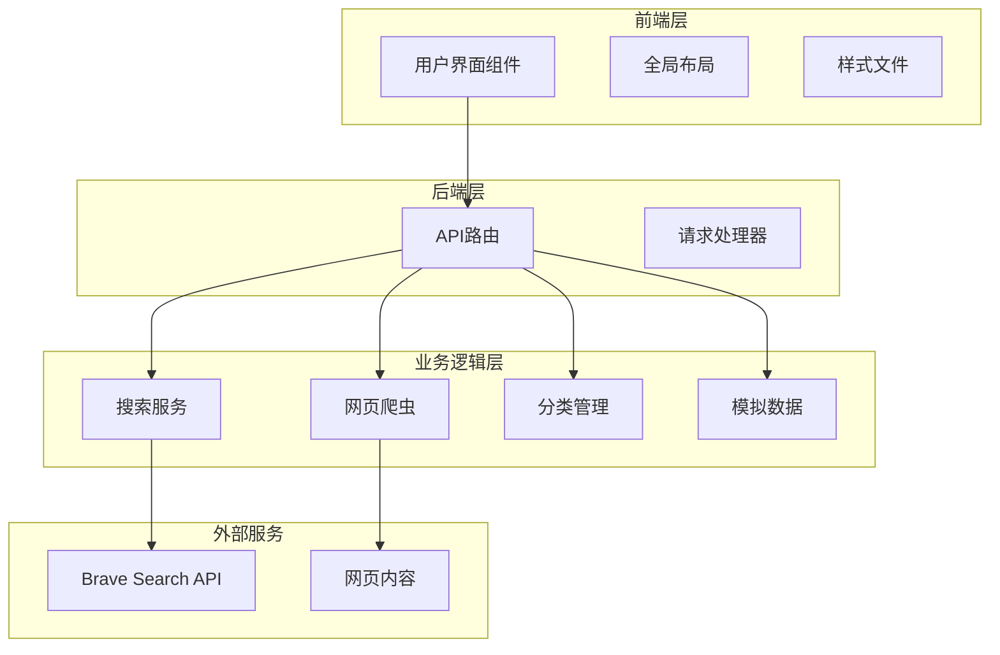
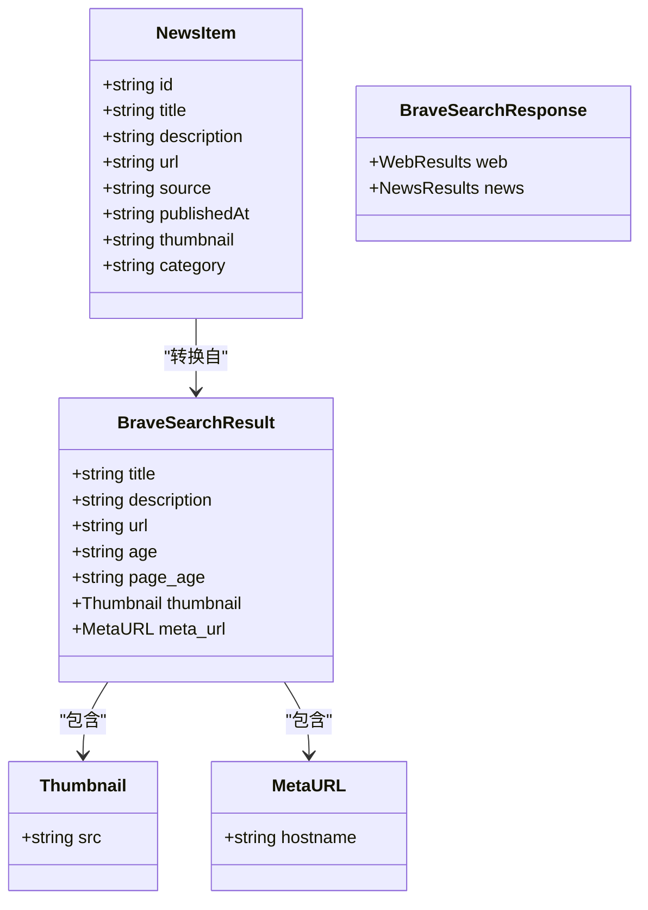
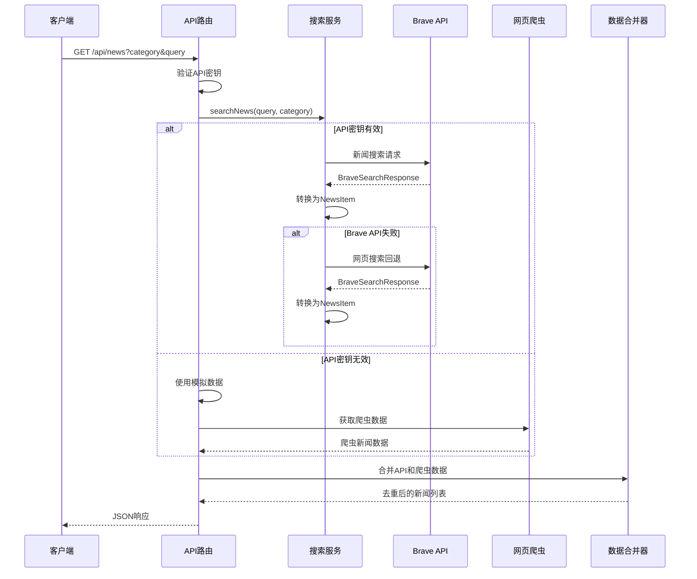
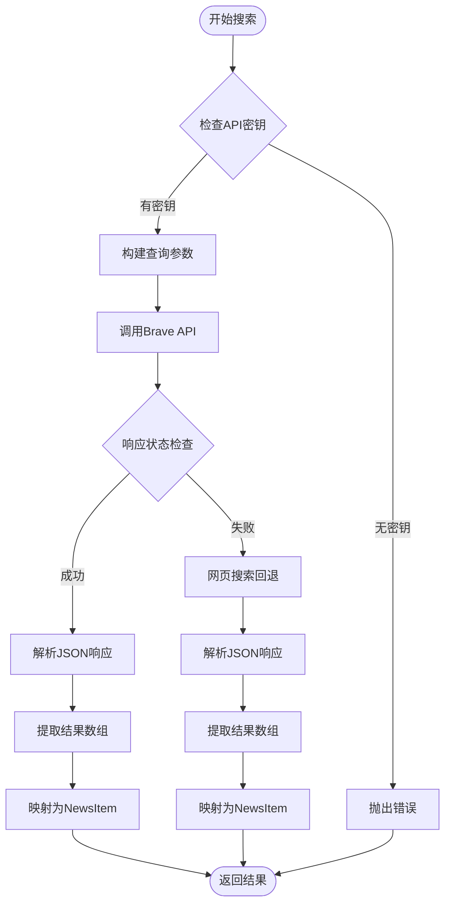
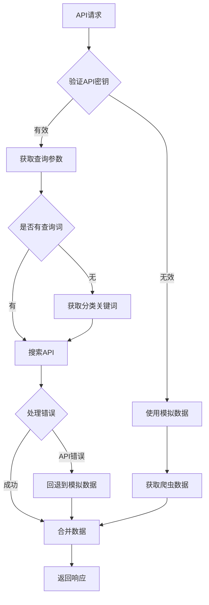
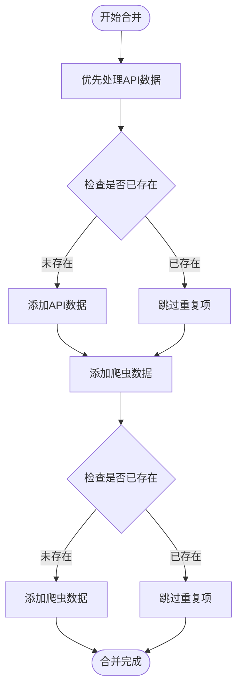

# Brave搜索响应模型

<cite>
**本文档引用的文件**
- [lib/brave-search.ts](file://lib/brave-search.ts)
- [app/api/news/route.ts](file://app/api/news/route.ts)
- [lib/news-categories.ts](file://lib/news-categories.ts)
- [lib/news-scraper.ts](file://lib/news-scraper.ts)
- [lib/mock-data.ts](file://lib/mock-data.ts)
- [components/SearchBar.tsx](file://components/SearchBar.tsx)
- [README.md](file://README.md)
- [package.json](file://package.json)
</cite>

## 目录
1. [简介](#简介)
2. [项目结构](#项目结构)
3. [核心组件](#核心组件)
4. [架构概览](#架构概览)
5. [详细组件分析](#详细组件分析)
6. [依赖关系分析](#依赖关系分析)
7. [性能考虑](#性能考虑)
8. [故障排除指南](#故障排除指南)
9. [结论](#结论)

## 简介

本文档详细说明了基于Brave搜索API的新闻搜索系统数据模型设计。该系统通过Brave Search API获取新闻数据，提供统一的NewsItem数据结构，支持多种数据源的合并和去重功能。系统采用双数据源策略：Brave Search API作为主要数据源，Hacker News作为备用数据源，确保在API不可用时仍能提供新闻内容。

## 项目结构

该项目采用Next.js框架构建，主要目录结构如下：



**图表来源**
- [lib/brave-search.ts](file://lib/brave-search.ts#L1-L115)
- [app/api/news/route.ts](file://app/api/news/route.ts#L1-L136)

**章节来源**
- [README.md](file://README.md#L36-L49)
- [package.json](file://package.json#L1-L30)

## 核心组件

### 数据模型定义

系统定义了统一的NewsItem数据模型，用于标准化不同数据源的新闻数据：



**图表来源**
- [lib/brave-search.ts](file://lib/brave-search.ts#L1-L25)

### 字段详细说明

#### NewsItem核心字段

| 字段名 | 类型 | 必填 | 描述 | 数据来源 |
|--------|------|------|------|----------|
| id | string | 是 | 唯一标识符 | 自动生成 |
| title | string | 是 | 新闻标题 | Brave API或爬虫 |
| description | string | 是 | 新闻描述 | Brave API或爬虫 |
| url | string | 是 | 新闻链接 | Brave API或爬虫 |
| source | string | 是 | 新闻来源 | Brave API或URL解析 |
| publishedAt | string | 是 | 发布时间 | Brave API或默认值 |
| thumbnail | string | 否 | 缩略图URL | Brave API可选字段 |
| category | string | 是 | 新闻分类 | 请求参数 |

#### BraveSearchResult字段

| 字段名 | 类型 | 必填 | 描述 | 来源API |
|--------|------|------|------|---------|
| title | string | 是 | 标题 | Brave News API |
| description | string | 是 | 描述 | Brave News API |
| url | string | 是 | 完整URL | Brave News API |
| age | string | 否 | 内容年龄 | Brave News API |
| page_age | string | 否 | 页面年龄 | Brave News API |
| thumbnail | object | 否 | 缩略图信息 | Brave News API |
| meta_url | object | 否 | 元数据URL信息 | Brave News API |

**章节来源**
- [lib/brave-search.ts](file://lib/brave-search.ts#L1-L25)

## 架构概览

系统采用分层架构设计，实现了数据获取、转换、合并和展示的完整流程：



**图表来源**
- [app/api/news/route.ts](file://app/api/news/route.ts#L39-L135)
- [lib/brave-search.ts](file://lib/brave-search.ts#L30-L114)

## 详细组件分析

### Brave搜索服务

Brave搜索服务是整个系统的核心组件，负责与Brave Search API交互并处理响应数据。

#### API调用流程



**图表来源**
- [lib/brave-search.ts](file://lib/brave-search.ts#L30-L114)

#### 字段映射规则

从BraveSearchResult到NewsItem的转换遵循以下规则：

| BraveSearchResult字段 | NewsItem字段 | 映射规则 | 备注 |
|----------------------|--------------|----------|------|
| title | title | 直接映射 | 保持原值 |
| description | description | 直接映射 | 空值时设为空字符串 |
| url | url | 直接映射 | 保持原值 |
| meta_url.hostname | source | 优先使用 | 不存在时解析URL主机名 |
| age | publishedAt | 优先使用 | 不存在时使用page_age |
| page_age | publishedAt | 备用选择 | 不存在时使用"today" |
| thumbnail.src | thumbnail | 可选映射 | 不存在时为undefined |

**章节来源**
- [lib/brave-search.ts](file://lib/brave-search.ts#L63-L72)
- [lib/brave-search.ts](file://lib/brave-search.ts#L104-L113)

### API路由处理

API路由负责协调各个服务组件，实现数据的获取、合并和响应。

#### 错误处理机制



**图表来源**
- [app/api/news/route.ts](file://app/api/news/route.ts#L39-L135)

#### 数据合并策略

系统采用智能合并策略，确保数据质量和去重效果：



**图表来源**
- [app/api/news/route.ts](file://app/api/news/route.ts#L14-L37)

**章节来源**
- [app/api/news/route.ts](file://app/api/news/route.ts#L14-L37)
- [app/api/news/route.ts](file://app/api/news/route.ts#L112-L134)

### 分类管理系统

系统支持四种新闻分类，每种分类都有特定的关键词组合：

| 分类ID | 分类标签 | 关键词组合 | 用途 |
|--------|----------|------------|------|
| all | 综合热点 | "today world news", "global headlines today", "breaking news" | 全站新闻聚合 |
| politics | 国际时政 | "international politics today", "world diplomacy news", "geopolitics news today" | 政治新闻专题 |
| business | 财经商业 | "global economy news today", "financial markets news", "business news today" | 商业财经新闻 |
| tech | 科技互联网 | "technology news today", "AI news today", "tech industry news" | 科技创新新闻 |

**章节来源**
- [lib/news-categories.ts](file://lib/news-categories.ts#L7-L40)

### 网页爬虫服务

作为Brave API的备用数据源，系统集成了Hacker News爬虫服务：

#### 爬虫配置

| 分类 | 目标网站 | 选择器 | 特殊处理 |
|------|----------|--------|----------|
| all | news.ycombinator.com | .titleline > a | 过滤评论链接 |
| tech | news.ycombinator.com | .titleline > a | 标记为科技资讯 |
| business | news.ycombinator.com | .titleline > a | 标记为商业资讯 |
| politics | news.ycombinator.com | .titleline > a | 标记为国际资讯 |

**章节来源**
- [lib/news-scraper.ts](file://lib/news-scraper.ts#L6-L91)

## 依赖关系分析

系统各组件之间的依赖关系如下：

```mermaid
graph TB
subgraph "外部依赖"
Cheerio[cheerio@1.2.0]
Next[Next.js@^16.1.6]
React[React@^19.2.4]
end
subgraph "内部模块"
Route[app/api/news/route.ts]
Search[lib/brave-search.ts]
Scraper[lib/news-scraper.ts]
Categories[lib/news-categories.ts]
Mock[lib/mock-data.ts]
SearchBar[components/SearchBar.tsx]
end
Route --> Search
Route --> Scraper
Route --> Categories
Route --> Mock
Search --> Categories
Scraper --> Search
SearchBar --> Route
Search -.-> Cheerio
Scraper -.-> Cheerio
Route -.-> Next
SearchBar -.-> React
```

**图表来源**
- [package.json](file://package.json#L15-L28)
- [lib/brave-search.ts](file://lib/brave-search.ts#L1-L115)
- [app/api/news/route.ts](file://app/api/news/route.ts#L1-L136)

**章节来源**
- [package.json](file://package.json#L15-L28)

## 性能考虑

### 并发优化

系统采用Promise.all实现并发数据获取，显著提升响应速度：

- 同时执行Brave API搜索和网页爬虫
- 异步获取模拟数据和爬虫数据
- 并行处理多个数据源

### 缓存策略

- 使用内存缓存避免重复API调用
- 基于URL的去重机制防止重复内容
- 会话级缓存减少重复请求

### 错误恢复

- API失败时自动回退到网页搜索
- 网页搜索失败时使用模拟数据
- 爬虫异常不影响整体功能

## 故障排除指南

### 常见问题及解决方案

#### API密钥配置问题

**问题症状**：API路由返回400错误或使用模拟数据

**解决步骤**：
1. 检查.env.local文件中的BRAVE_API_KEY配置
2. 确认API密钥格式正确且未过期
3. 验证Brave Search API服务可用性

#### API调用限制

**问题症状**：API响应状态码非200

**解决步骤**：
1. 检查API配额使用情况
2. 等待下个月配额重置
3. 考虑升级API套餐

#### 数据合并冲突

**问题症状**：新闻标题重复显示

**解决步骤**：
1. 检查去重算法实现
2. 验证标题标准化处理
3. 确认Set数据结构使用正确

**章节来源**
- [app/api/news/route.ts](file://app/api/news/route.ts#L7-L11)
- [lib/brave-search.ts](file://lib/brave-search.ts#L35-L37)

### 调试建议

1. **启用详细日志**：在开发环境中开启console.log输出
2. **监控API响应**：检查Brave API的响应时间和错误码
3. **验证数据质量**：定期检查转换后的NewsItem数据完整性
4. **测试边界条件**：验证空结果、特殊字符、长文本等场景

## 结论

该Brave搜索响应模型设计合理，实现了以下关键特性：

1. **统一数据模型**：通过NewsItem标准统一不同数据源的新闻数据
2. **容错机制**：多重回退策略确保系统稳定性
3. **性能优化**：并发处理和智能缓存提升用户体验
4. **可扩展性**：模块化设计便于添加新的数据源和功能

系统通过精心设计的数据转换逻辑和错误处理机制，为用户提供稳定可靠的新闻搜索体验。建议在生产环境中监控API使用情况，定期评估数据质量和性能表现，持续优化搜索算法和数据处理流程。