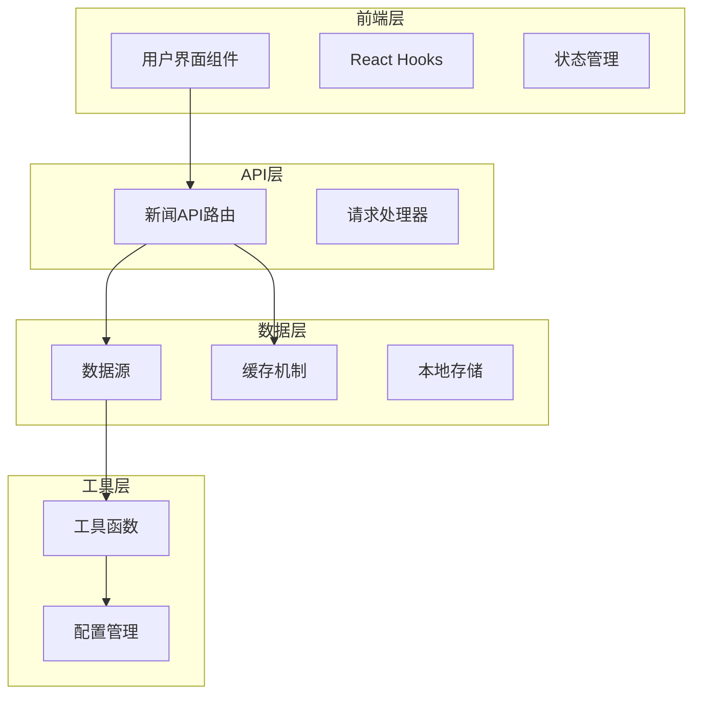
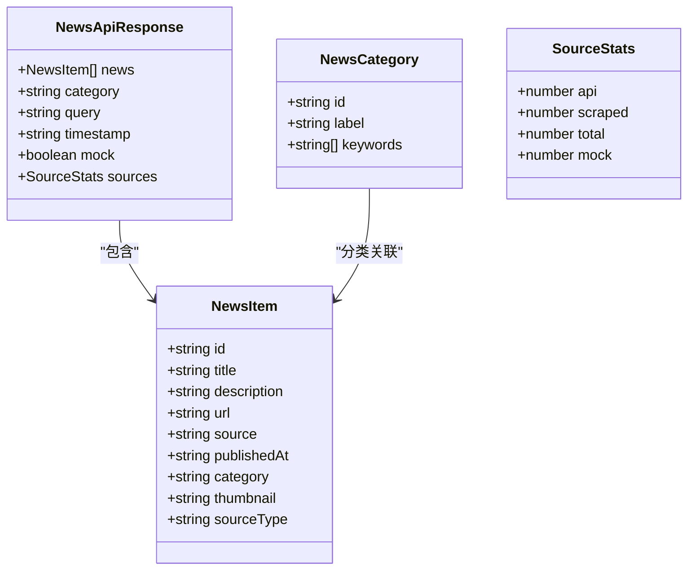
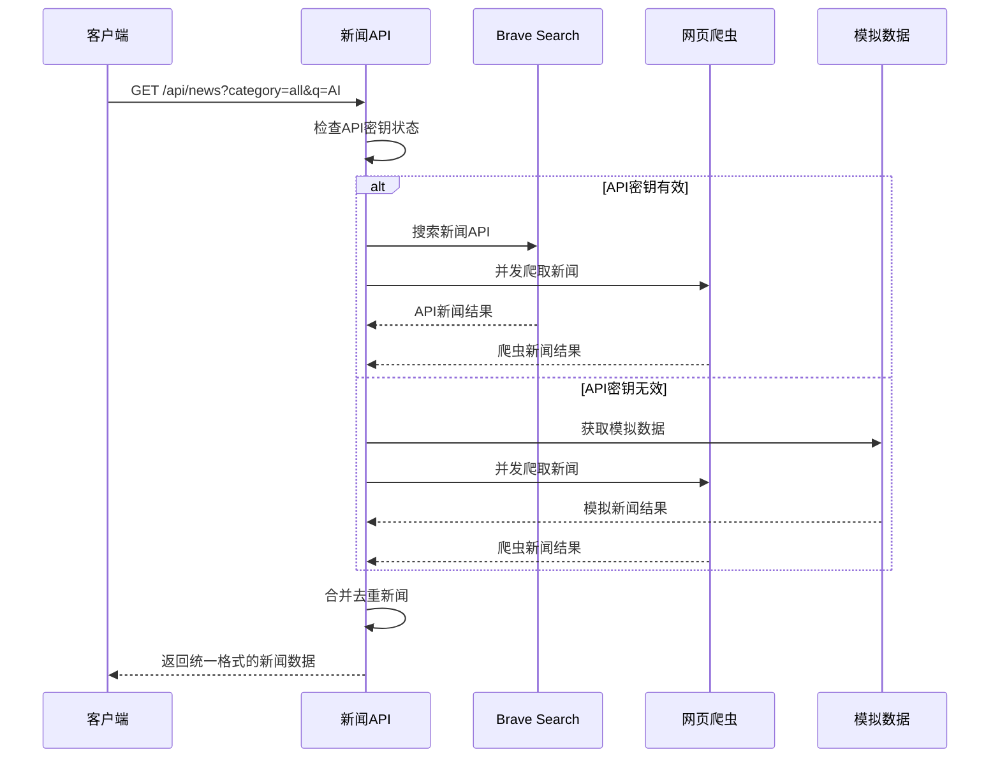
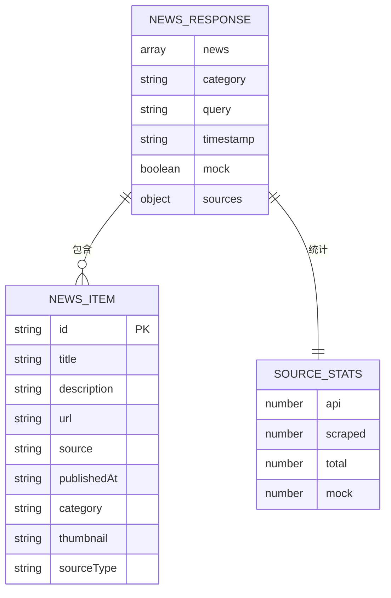
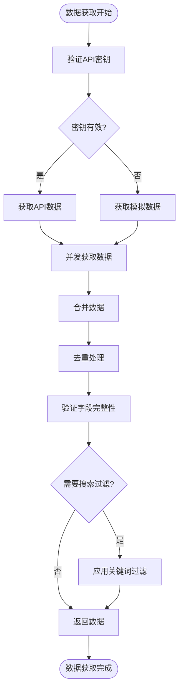
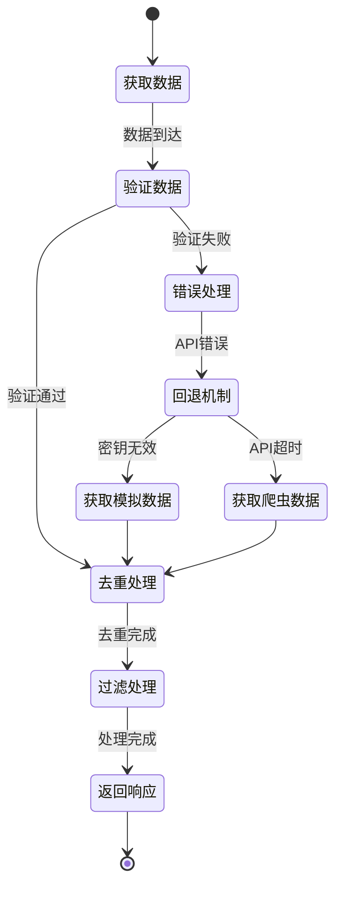
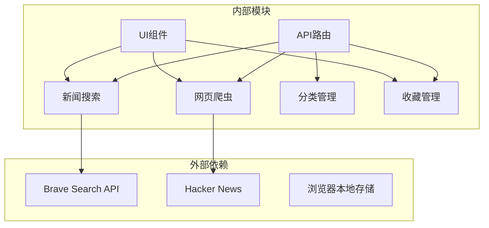
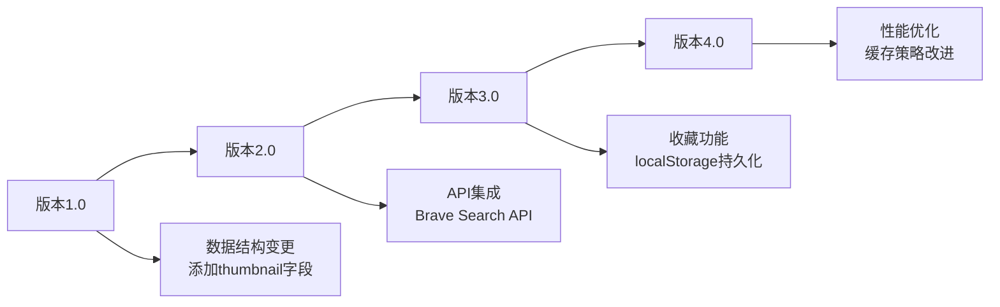

# 数据模型

<cite>
**本文档引用的文件**
- [app/api/news/route.ts](file://app/api/news/route.ts)
- [lib/brave-search.ts](file://lib/brave-search.ts)
- [lib/news-categories.ts](file://lib/news-categories.ts)
- [lib/mock-data.ts](file://lib/mock-data.ts)
- [lib/news-scraper.ts](file://lib/news-scraper.ts)
- [lib/favorites.ts](file://lib/favorites.ts)
- [components/NewsCard.tsx](file://components/NewsCard.tsx)
- [components/NewsSummary.tsx](file://components/NewsSummary.tsx)
- [app/page.tsx](file://app/page.tsx)
- [README.md](file://README.md)
</cite>

## 目录
1. [简介](#简介)
2. [项目结构](#项目结构)
3. [核心数据实体](#核心数据实体)
4. [架构概览](#架构概览)
5. [详细组件分析](#详细组件分析)
6. [依赖关系分析](#依赖关系分析)
7. [性能考虑](#性能考虑)
8. [故障排除指南](#故障排除指南)
9. [结论](#结论)

## 简介

本数据模型文档详细说明了先雄新闻网站涉及的所有数据实体和结构。该系统是一个基于Next.js的现代新闻聚合平台，集成了多种数据源以提供实时新闻内容。系统支持四种主要新闻分类：综合热点、国际时政、财经商业和科技互联网。

## 项目结构

新闻网站采用模块化架构设计，主要分为以下几个核心模块：

**图表来源**
- [app/api/news/route.ts](file://app/api/news/route.ts#L1-L136)
- [lib/brave-search.ts](file://lib/brave-search.ts#L1-L115)
- [lib/news-scraper.ts](file://lib/news-scraper.ts#L1-L166)

**章节来源**
- [README.md](file://README.md#L36-L49)

## 核心数据实体

### NewsItem 接口定义

NewsItem 是系统中最核心的数据结构，用于表示单条新闻信息。

**图表来源**
- [lib/brave-search.ts](file://lib/brave-search.ts#L1-L115)
- [lib/news-categories.ts](file://lib/news-categories.ts#L1-L45)
- [app/api/news/route.ts](file://app/api/news/route.ts#L101-L111)

### 字段定义和数据类型

| 字段名 | 类型 | 必填 | 描述 | 示例值 |
|--------|------|------|------|--------|
| id | string | 是 | 新闻唯一标识符 | "hn-tech-1698753210456-abc123def" |
| title | string | 是 | 新闻标题 | "OpenAI发布新一代多模态模型" |
| description | string | 是 | 新闻描述内容 | "新模型在推理、编程、视觉理解等多个基准测试中刷新记录..." |
| url | string | 是 | 新闻原始链接 | "https://example.com/openai" |
| source | string | 是 | 新闻来源媒体 | "TechCrunch" |
| publishedAt | string | 是 | 发布时间描述 | "2 hours ago" |
| category | string | 是 | 新闻分类标识 | "tech" |
| thumbnail | string | 否 | 缩略图URL | "https://example.com/image.jpg" |
| sourceType | string | 否 | 数据来源类型 | "api" 或 "scraped" |

### NewsCategory 数据结构

新闻分类系统定义了四种主要分类及其关键词：

| 分类ID | 中文标签 | 英文关键词 | 用途 |
|--------|----------|------------|------|
| all | 综合热点 | "today world news", "global headlines today", "breaking news" | 全站新闻聚合 |
| politics | 国际时政 | "international politics today", "world diplomacy news", "geopolitics news today" | 政治新闻专题 |
| business | 财经商业 | "global economy news today", "financial markets news", "business news today" | 商业财经新闻 |
| tech | 科技互联网 | "technology news today", "AI news today", "tech industry news" | 科技创新新闻 |

**章节来源**
- [lib/brave-search.ts](file://lib/brave-search.ts#L1-L115)
- [lib/news-categories.ts](file://lib/news-categories.ts#L1-L45)

## 架构概览

系统采用混合数据源架构，结合了API获取和网页爬虫两种方式：

**图表来源**
- [app/api/news/route.ts](file://app/api/news/route.ts#L39-L135)
- [lib/brave-search.ts](file://lib/brave-search.ts#L30-L73)
- [lib/news-scraper.ts](file://lib/news-scraper.ts#L141-L153)

## 详细组件分析

### API响应格式

系统API返回标准化的JSON响应格式，包含以下核心字段：

**图表来源**
- [app/api/news/route.ts](file://app/api/news/route.ts#L101-L111)

### 数据访问模式

系统实现了多种数据访问模式：

1. **同步访问模式**：直接从API获取数据
2. **异步并发模式**：同时从多个数据源获取数据
3. **回退模式**：API失败时自动切换到备用数据源
4. **缓存模式**：本地存储用户收藏数据

### 数据验证规则

系统实施了多层次的数据验证：

**图表来源**
- [app/api/news/route.ts](file://app/api/news/route.ts#L14-L37)
- [app/api/news/route.ts](file://app/api/news/route.ts#L58-L67)

**章节来源**
- [app/api/news/route.ts](file://app/api/news/route.ts#L1-L136)

### 业务规则

系统遵循以下业务规则：

1. **数据去重规则**：基于新闻标题的大小写不敏感匹配
2. **优先级规则**：API数据优先于爬虫数据
3. **分类规则**：每个新闻必须属于有效的分类之一
4. **时间规则**：使用相对时间格式而非绝对时间戳
5. **来源标记规则**：自动标记数据来源类型

### 数据生命周期管理

**图表来源**
- [app/api/news/route.ts](file://app/api/news/route.ts#L76-L134)

**章节来源**
- [lib/news-scraper.ts](file://lib/news-scraper.ts#L1-L166)

## 依赖关系分析

系统各组件之间的依赖关系如下：

**图表来源**
- [app/api/news/route.ts](file://app/api/news/route.ts#L1-L11)
- [lib/brave-search.ts](file://lib/brave-search.ts#L27-L28)
- [lib/news-scraper.ts](file://lib/news-scraper.ts#L12-L13)

**章节来源**
- [lib/brave-search.ts](file://lib/brave-search.ts#L1-L115)
- [lib/news-scraper.ts](file://lib/news-scraper.ts#L1-L166)

## 性能考虑

### 缓存策略

系统实现了多层次的缓存策略：

1. **API缓存**：利用Brave Search API的内置缓存机制
2. **本地缓存**：浏览器localStorage存储用户偏好设置
3. **组件缓存**：React组件级别的状态缓存
4. **网络缓存**：浏览器HTTP缓存头控制

### 性能优化建议

1. **并发请求**：同时发起多个数据源请求以减少总等待时间
2. **数据预加载**：在页面加载时预获取常用分类数据
3. **懒加载**：实现无限滚动和按需加载
4. **图片优化**：使用现代图片格式和适当的尺寸

### 数据迁移路径

**章节来源**
- [lib/favorites.ts](file://lib/favorites.ts#L1-L29)

## 故障排除指南

### 常见问题及解决方案

1. **API密钥配置错误**
   - 检查 `.env.local` 文件中的 `BRAVE_API_KEY` 设置
   - 确认API密钥格式正确且未过期

2. **网络请求失败**
   - 检查网络连接状态
   - 验证目标网站可访问性
   - 查看浏览器开发者工具中的网络面板

3. **数据重复问题**
   - 确认去重逻辑正常工作
   - 检查新闻标题的标准化处理

4. **收藏功能异常**
   - 验证浏览器localStorage权限
   - 检查浏览器隐私设置

**章节来源**
- [app/api/news/route.ts](file://app/api/news/route.ts#L7-L11)
- [lib/favorites.ts](file://lib/favorites.ts#L1-L29)

## 结论

本数据模型文档详细阐述了先雄新闻网站的核心数据结构、API响应格式和业务逻辑。系统通过混合数据源架构实现了高可用性和良好的用户体验。NewsItem接口提供了统一的数据表示，而NewsCategory结构确保了内容的有效组织。

系统的架构设计充分考虑了性能、可扩展性和用户体验，为未来的功能扩展和数据迁移奠定了坚实的基础。通过实施多层次的数据验证和错误处理机制，系统能够稳定地处理各种异常情况，确保用户获得一致的服务体验。