# 新闻爬虫数据模型

<cite>
**本文档引用的文件**
- [news-scraper.ts](file://lib/news-scraper.ts)
- [brave-search.ts](file://lib/brave-search.ts)
- [route.ts](file://app/api/news/route.ts)
- [mock-data.ts](file://lib/mock-data.ts)
- [news-categories.ts](file://lib/news-categories.ts)
- [NewsCard.tsx](file://components/NewsCard.tsx)
- [NewsSummary.tsx](file://components/NewsSummary.tsx)
- [package.json](file://package.json)
- [README.md](file://README.md)
</cite>

## 目录
1. [简介](#简介)
2. [项目结构](#项目结构)
3. [核心数据模型](#核心数据模型)
4. [架构概览](#架构概览)
5. [详细组件分析](#详细组件分析)
6. [数据流分析](#数据流分析)
7. [性能考虑](#性能考虑)
8. [故障排除指南](#故障排除指南)
9. [结论](#结论)

## 简介

本项目是一个基于Next.js的新闻聚合平台，集成了多种新闻数据源，包括Hacker News爬虫、Brave Search API和模拟数据。该系统的核心目标是为用户提供统一的新闻浏览体验，支持分类浏览、关键词搜索和收藏功能。

系统采用现代化的前端架构，使用React组件和TypeScript类型安全，后端通过Next.js API路由提供RESTful接口。数据模型设计遵循统一的NewsItem标准，确保不同数据源的数据能够无缝整合。

## 项目结构

项目采用模块化组织方式，主要分为以下几个核心部分：

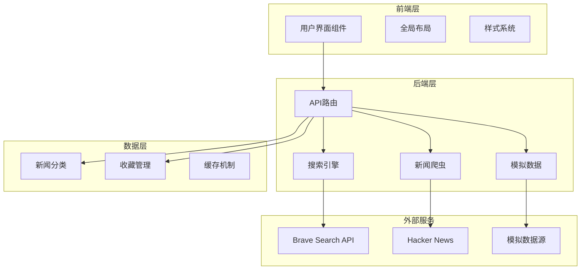

**图表来源**
- [route.ts](file://app/api/news/route.ts#L1-L136)
- [news-scraper.ts](file://lib/news-scraper.ts#L1-L166)
- [brave-search.ts](file://lib/brave-search.ts#L1-L115)

**章节来源**
- [README.md](file://README.md#L36-L49)
- [package.json](file://package.json#L1-L30)

## 核心数据模型

### NewsItem接口定义

系统的核心数据模型是NewsItem接口，它定义了所有新闻项目的标准化结构：

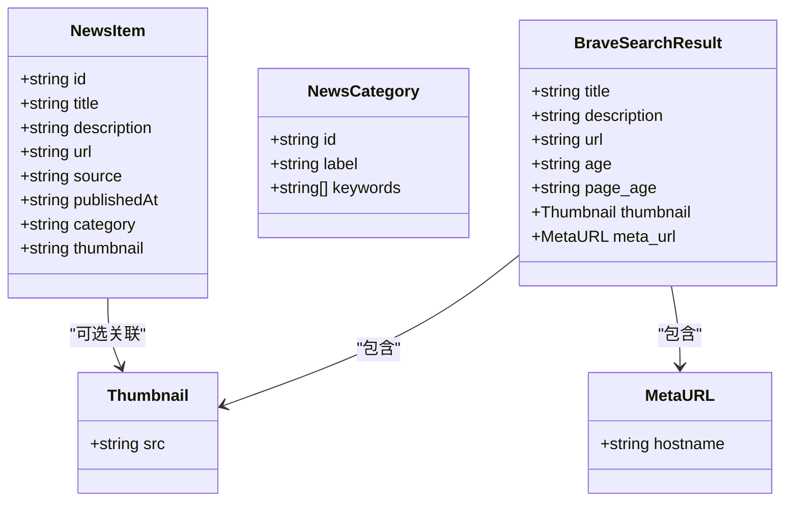

**图表来源**
- [brave-search.ts](file://lib/brave-search.ts#L1-L115)
- [news-categories.ts](file://lib/news-categories.ts#L1-L45)

### 字段详细说明

| 字段名 | 类型 | 必需 | 描述 | 默认值 |
|--------|------|------|------|--------|
| id | string | 是 | 唯一标识符 | 自动生成 |
| title | string | 是 | 新闻标题 | 空字符串 |
| description | string | 是 | 新闻描述 | 空字符串 |
| url | string | 是 | 原文链接 | 空字符串 |
| source | string | 是 | 新闻来源 | 空字符串 |
| publishedAt | string | 是 | 发布时间 | "today" |
| category | string | 是 | 新闻分类 | "all" |
| thumbnail | string | 否 | 缩略图URL | undefined |

**章节来源**
- [brave-search.ts](file://lib/brave-search.ts#L1-L115)

## 架构概览

系统采用混合架构模式，结合了API搜索、网页爬虫和模拟数据三种数据获取方式：

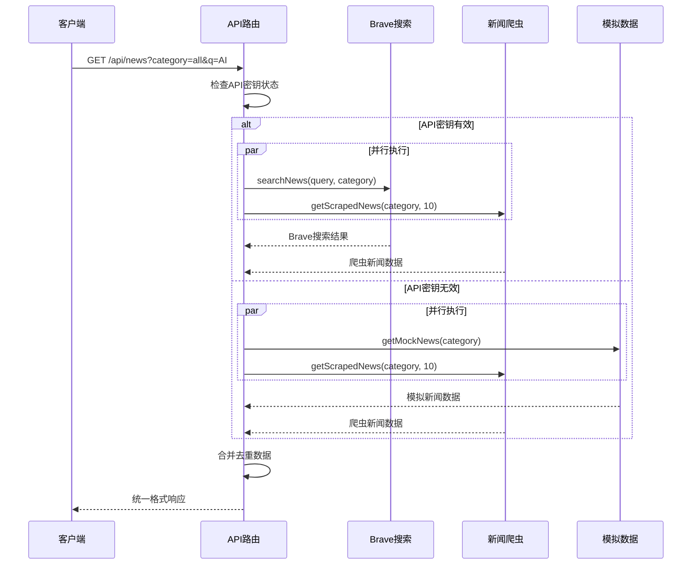

**图表来源**
- [route.ts](file://app/api/news/route.ts#L39-L135)
- [brave-search.ts](file://lib/brave-search.ts#L30-L73)

**章节来源**
- [route.ts](file://app/api/news/route.ts#L1-L136)

## 详细组件分析

### 新闻爬虫组件

新闻爬虫组件负责从Hacker News等数据源抓取新闻数据，实现了灵活的配置化爬取机制：

#### 爬虫配置系统

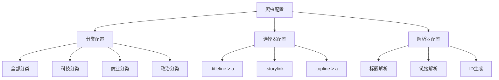

**图表来源**
- [news-scraper.ts](file://lib/news-scraper.ts#L6-L91)

#### HTML解析规则

爬虫使用Cheerio库进行HTML解析，针对Hacker News的特定结构制定了精确的选择器：

| 选择器 | 目标元素 | 解析逻辑 |
|--------|----------|----------|
| `.titleline > a` | 新闻标题链接 | 提取文本内容和href属性 |
| `.score` | 用户评分 | 过滤非新闻内容 |
| `.subtext` | 作者信息 | 提取作者和时间信息 |

#### 数据提取逻辑

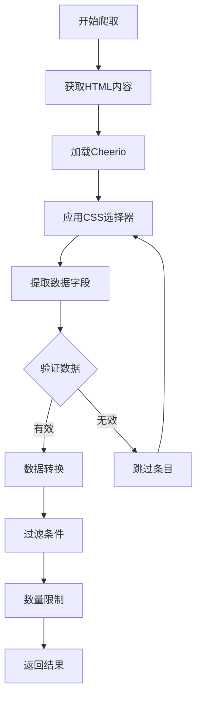

**图表来源**
- [news-scraper.ts](file://lib/news-scraper.ts#L116-L138)

**章节来源**
- [news-scraper.ts](file://lib/news-scraper.ts#L1-L166)

### Brave搜索组件

Brave搜索组件提供了专业的新闻搜索API集成，支持多种搜索参数和错误处理：

#### 搜索参数配置

| 参数名 | 类型 | 描述 | 默认值 |
|--------|------|------|--------|
| q | string | 搜索查询词 | 必需 |
| count | number | 返回结果数量 | 20 |
| freshness | string | 时间范围 | "pd" (过去一天) |
| search_lang | string | 搜索语言 | "en" |
| text_decorations | boolean | 是否包含装饰 | false |

#### 错误处理机制

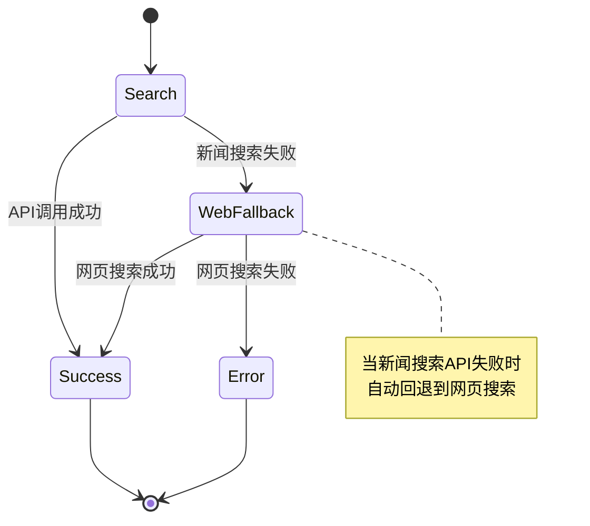

**图表来源**
- [brave-search.ts](file://lib/brave-search.ts#L55-L58)

**章节来源**
- [brave-search.ts](file://lib/brave-search.ts#L1-L115)

### 数据合并与去重

API路由实现了智能的数据合并机制，确保来自不同数据源的新闻能够正确整合：

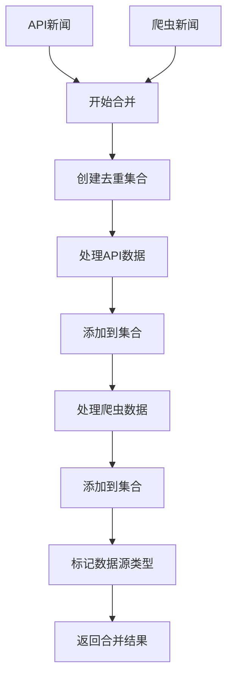

**图表来源**
- [route.ts](file://app/api/news/route.ts#L14-L37)

**章节来源**
- [route.ts](file://app/api/news/route.ts#L1-L136)

### 模拟数据系统

模拟数据系统提供了完整的开发和测试支持，包含四个分类的预定义新闻数据：

| 分类 | 新闻数量 | 数据用途 |
|------|----------|----------|
| all | 6条 | 综合新闻展示 |
| politics | 4条 | 国际时政内容 |
| business | 4条 | 财经商业信息 |
| tech | 4条 | 科技互联网动态 |

**章节来源**
- [mock-data.ts](file://lib/mock-data.ts#L1-L197)

## 数据流分析

### 请求处理流程

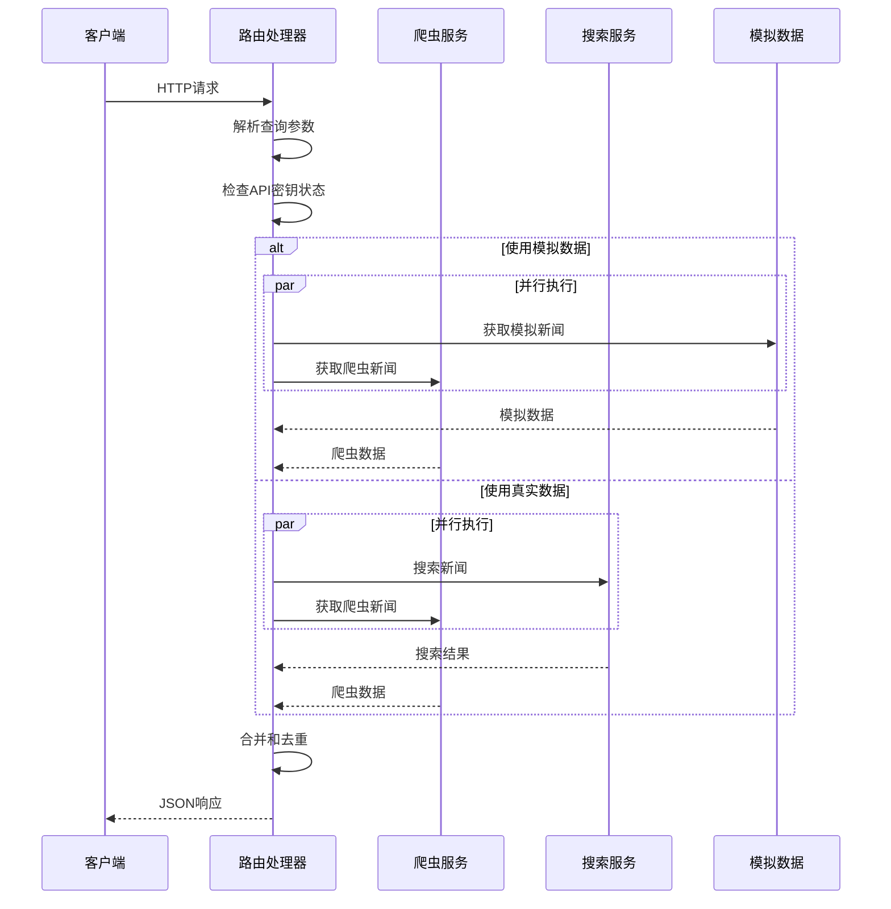

**图表来源**
- [route.ts](file://app/api/news/route.ts#L39-L135)

### 数据转换过程

系统实现了从原始数据到标准NewsItem格式的完整转换链路：

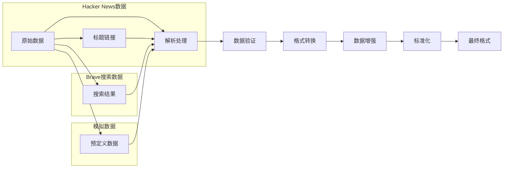

**图表来源**
- [news-scraper.ts](file://lib/news-scraper.ts#L14-L28)
- [brave-search.ts](file://lib/brave-search.ts#L63-L72)

**章节来源**
- [news-scraper.ts](file://lib/news-scraper.ts#L1-L166)
- [brave-search.ts](file://lib/brave-search.ts#L1-L115)

## 性能考虑

### 并发优化

系统采用了Promise.all并行处理策略，显著提升了数据获取效率：

- **并发数据源**：同时从Brave搜索和Hacker News爬虫获取数据
- **并行处理**：使用Promise.all等待所有异步操作完成
- **超时控制**：合理设置请求超时时间避免阻塞

### 内存管理

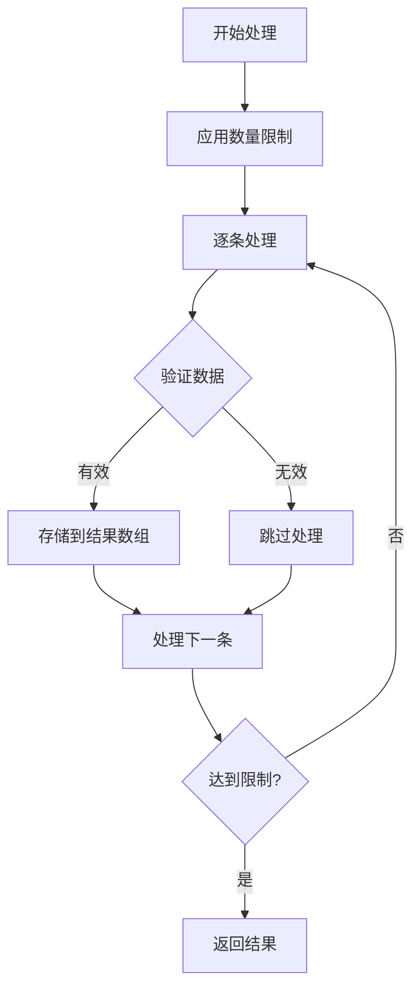

**图表来源**
- [news-scraper.ts](file://lib/news-scraper.ts#L124-L131)

### 缓存策略

系统实现了多层次的缓存机制：

1. **API缓存**：利用Brave Search API的缓存能力
2. **内存缓存**：在应用内存中缓存最近的新闻数据
3. **浏览器缓存**：客户端自动缓存页面内容

**章节来源**
- [route.ts](file://app/api/news/route.ts#L45-L96)

## 故障排除指南

### 常见问题及解决方案

| 问题类型 | 症状 | 可能原因 | 解决方案 |
|----------|------|----------|----------|
| API密钥错误 | 401未授权 | BRAVE_API_KEY未配置或无效 | 在.env.local中配置正确的API密钥 |
| 网络连接失败 | 请求超时 | 网络不稳定或服务器不可达 | 检查网络连接，稍后重试 |
| 数据解析错误 | 页面显示空白 | HTML结构变更导致选择器失效 | 更新CSS选择器或解析逻辑 |
| 性能问题 | 页面加载缓慢 | 数据量过大或并发过多 | 调整limit参数，启用缓存 |

### 错误处理机制

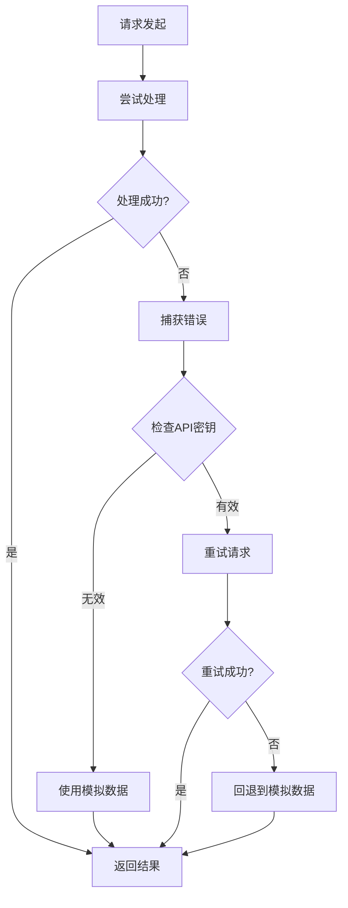

**图表来源**
- [route.ts](file://app/api/news/route.ts#L76-L134)

**章节来源**
- [route.ts](file://app/api/news/route.ts#L1-L136)

### 调试技巧

1. **日志监控**：查看控制台输出的错误信息
2. **网络调试**：使用浏览器开发者工具检查API响应
3. **数据验证**：确认返回的数据格式符合NewsItem接口定义
4. **性能分析**：监控请求耗时和内存使用情况

## 结论

本新闻爬虫系统通过精心设计的数据模型和架构，成功实现了多数据源的统一新闻聚合。系统的主要优势包括：

1. **标准化数据模型**：统一的NewsItem接口确保了数据的一致性和可扩展性
2. **灵活的爬取机制**：配置化的爬虫系统支持多种数据源和解析规则
3. **智能数据合并**：高效的去重算法保证了数据质量
4. **容错处理**：完善的错误处理和回退机制提升了系统稳定性
5. **性能优化**：并行处理和缓存策略确保了良好的用户体验

未来可以考虑的功能改进包括：增加更多数据源支持、实现更精细的缓存策略、添加数据质量评估机制、以及提供更丰富的搜索和过滤选项。