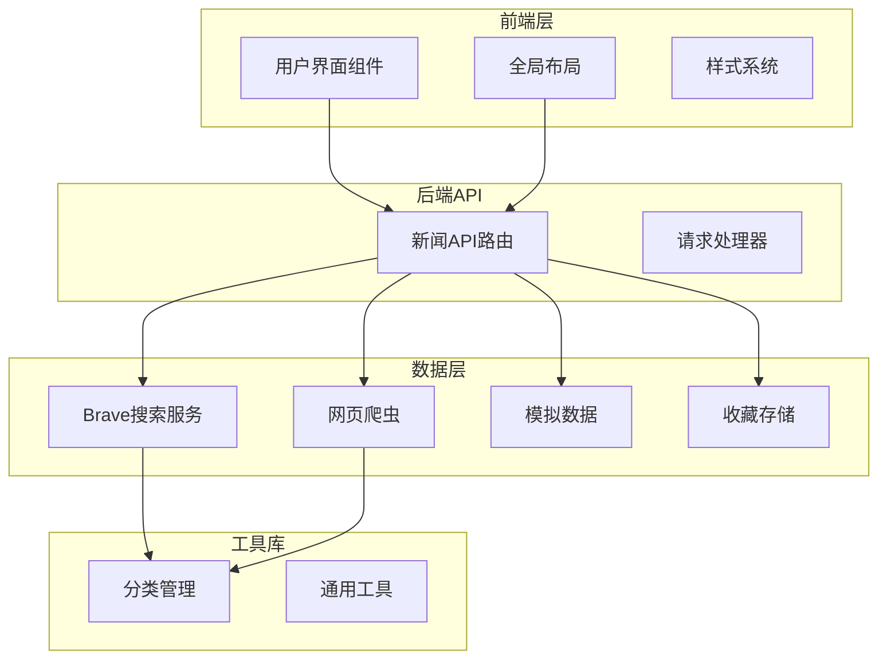
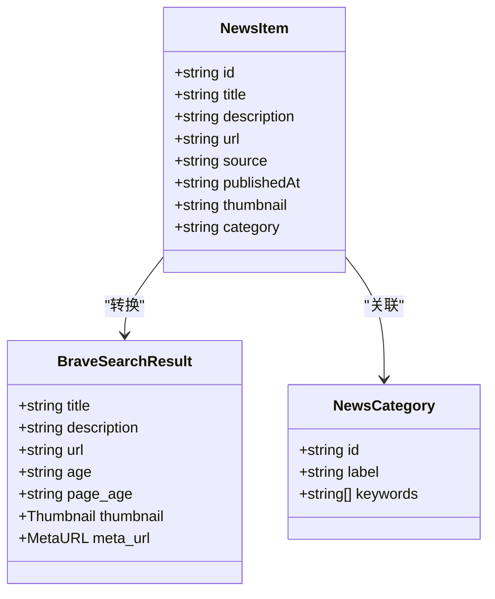
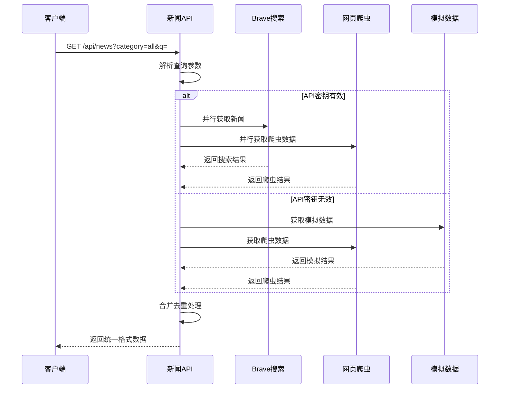
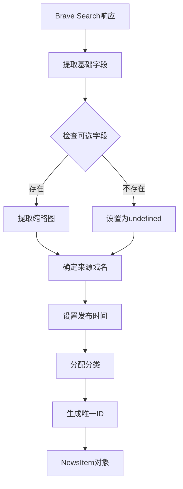
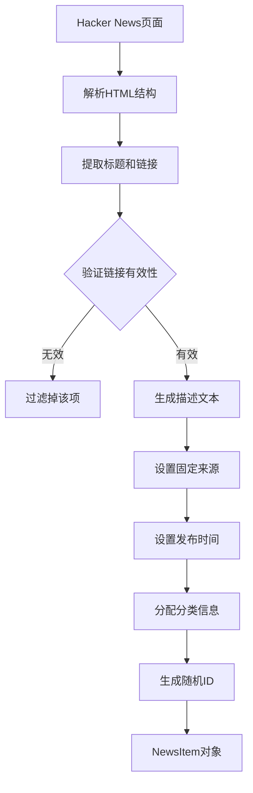
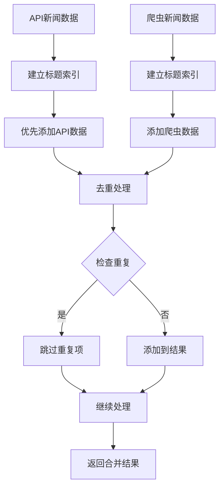
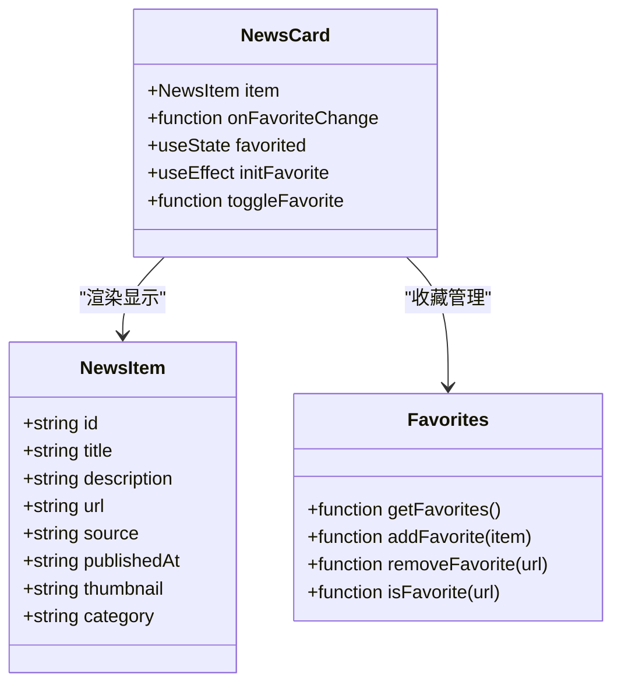
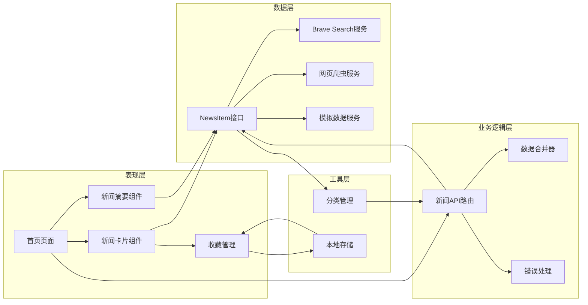
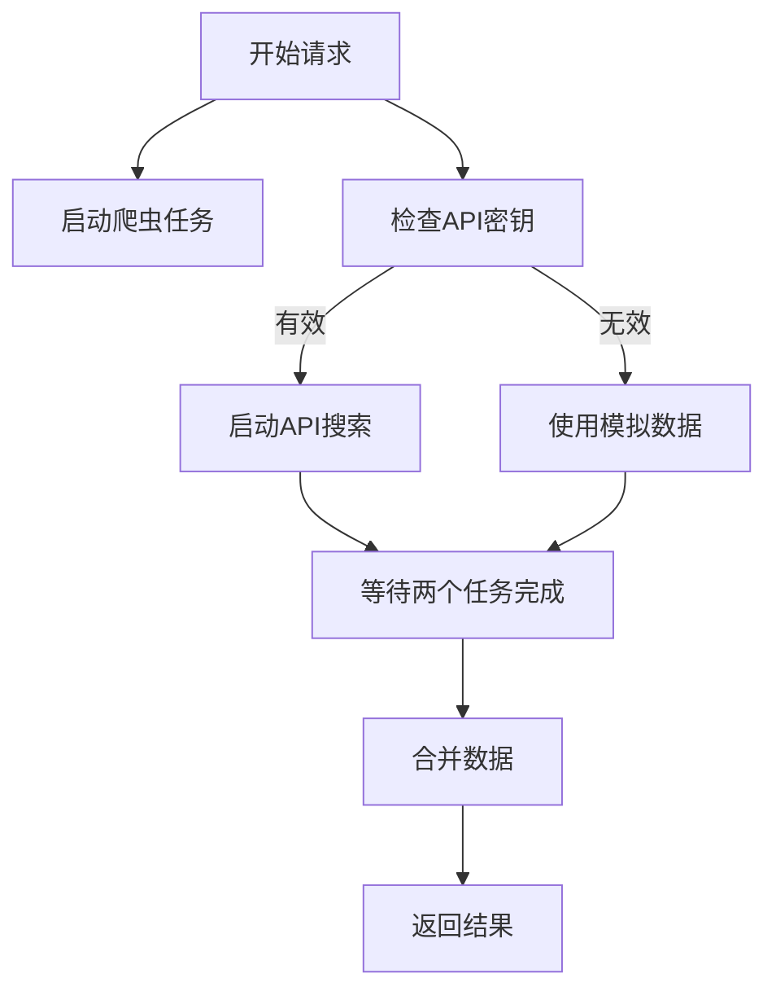
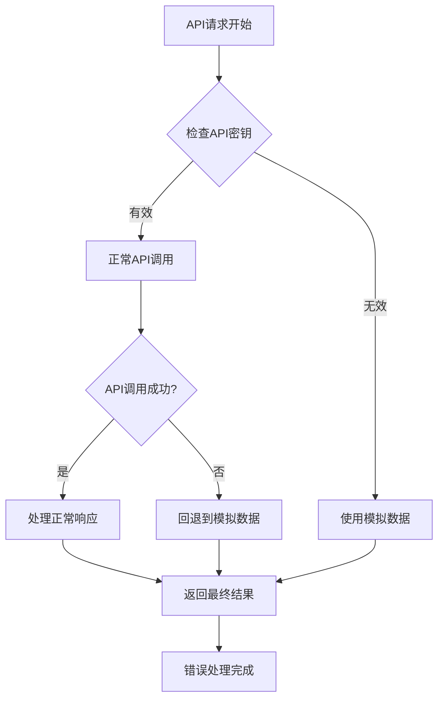

# 新闻项数据结构

<cite>
**本文档引用的文件**
- [app/api/news/route.ts](file://app/api/news/route.ts)
- [lib/brave-search.ts](file://lib/brave-search.ts)
- [lib/news-scraper.ts](file://lib/news-scraper.ts)
- [lib/mock-data.ts](file://lib/mock-data.ts)
- [lib/favorites.ts](file://lib/favorites.ts)
- [components/NewsCard.tsx](file://components/NewsCard.tsx)
- [components/NewsSummary.tsx](file://components/NewsSummary.tsx)
- [app/page.tsx](file://app/page.tsx)
- [lib/news-categories.ts](file://lib/news-categories.ts)
- [README.md](file://README.md)
</cite>

## 目录
1. [简介](#简介)
2. [项目结构](#项目结构)
3. [核心组件](#核心组件)
4. [架构概览](#架构概览)
5. [详细组件分析](#详细组件分析)
6. [依赖分析](#依赖分析)
7. [性能考虑](#性能考虑)
8. [故障排除指南](#故障排除指南)
9. [结论](#结论)

## 简介

本文档详细说明了新闻项数据结构的设计和实现，重点分析NewsItem接口的各个方面。该新闻网站项目采用现代化的Next.js框架构建，集成了Brave Search API和自定义网页爬虫，为用户提供多源新闻聚合服务。

## 项目结构

该项目采用模块化设计，主要分为以下几个核心部分：

**图表来源**
- [app/api/news/route.ts](file://app/api/news/route.ts#L1-L136)
- [lib/brave-search.ts](file://lib/brave-search.ts#L1-L115)
- [lib/news-scraper.ts](file://lib/news-scraper.ts#L1-L166)

**章节来源**
- [README.md](file://README.md#L36-L49)

## 核心组件

### NewsItem接口定义

NewsItem是整个新闻系统的核心数据结构，定义了统一的新闻项标准格式：

**图表来源**
- [lib/brave-search.ts](file://lib/brave-search.ts#L1-L115)
- [lib/news-categories.ts](file://lib/news-categories.ts#L1-L45)

### 字段详细说明

#### 基础字段

| 字段名 | 类型 | 必填 | 默认值 | 描述 |
|--------|------|------|--------|------|
| id | string | 是 | 无 | 新闻项唯一标识符，用于去重和状态管理 |
| title | string | 是 | 无 | 新闻标题，显示在卡片顶部 |
| description | string | 是 | 空字符串 | 新闻描述内容，限制3行显示 |
| url | string | 是 | 无 | 新闻链接，点击跳转到原文 |
| source | string | 是 | 无 | 新闻来源媒体名称 |
| publishedAt | string | 是 | "today" | 发布时间，支持相对时间格式 |

#### 可选字段

| 字段名 | 类型 | 必填 | 默认值 | 描述 |
|--------|------|------|--------|------|
| thumbnail | string | 否 | undefined | 缩略图URL，用于卡片图片展示 |
| category | string | 是 | 无 | 新闻分类标识符 |

**章节来源**
- [lib/brave-search.ts](file://lib/brave-search.ts#L1-L115)

## 架构概览

系统采用双数据源架构，确保新闻数据的丰富性和可靠性：

**图表来源**
- [app/api/news/route.ts](file://app/api/news/route.ts#L39-L136)

**章节来源**
- [app/api/news/route.ts](file://app/api/news/route.ts#L7-L136)

## 详细组件分析

### 数据源转换机制

#### Brave Search API转换

Brave Search API返回的数据需要转换为NewsItem格式：

**图表来源**
- [lib/brave-search.ts](file://lib/brave-search.ts#L63-L72)

#### 网页爬虫转换

Hacker News爬虫的数据转换流程：

**图表来源**
- [lib/news-scraper.ts](file://lib/news-scraper.ts#L14-L28)

**章节来源**
- [lib/brave-search.ts](file://lib/brave-search.ts#L30-L115)
- [lib/news-scraper.ts](file://lib/news-scraper.ts#L116-L153)

### 数据合并策略

系统采用智能合并策略确保数据质量和去重：

**图表来源**
- [app/api/news/route.ts](file://app/api/news/route.ts#L14-L37)

**章节来源**
- [app/api/news/route.ts](file://app/api/news/route.ts#L14-L37)

### 前端组件集成

#### 新闻卡片组件

NewsCard组件展示了NewsItem数据的完整使用方式：

**图表来源**
- [components/NewsCard.tsx](file://components/NewsCard.tsx#L1-L89)
- [lib/favorites.ts](file://lib/favorites.ts#L1-L29)

**章节来源**
- [components/NewsCard.tsx](file://components/NewsCard.tsx#L12-L27)
- [lib/favorites.ts](file://lib/favorites.ts#L13-L28)

### 搜索和过滤功能

系统支持多种搜索模式：

| 搜索模式 | 参数 | 处理逻辑 | 使用场景 |
|----------|------|----------|----------|
| 分类搜索 | category | 使用分类关键词 | 浏览特定领域新闻 |
| 关键词搜索 | q | 直接搜索关键词 | 精确查找特定主题 |
| 组合搜索 | category + q | 同时应用分类和关键词 | 精细化筛选 |
| 模拟搜索 | 无参数 | 返回模拟数据 | 开发调试环境 |

**章节来源**
- [app/api/news/route.ts](file://app/api/news/route.ts#L39-L74)

## 依赖分析

### 组件间依赖关系

**图表来源**
- [lib/brave-search.ts](file://lib/brave-search.ts#L1-L115)
- [lib/news-scraper.ts](file://lib/news-scraper.ts#L1-L166)
- [app/api/news/route.ts](file://app/api/news/route.ts#L1-L136)

### 外部依赖

| 依赖包 | 版本 | 用途 | 重要性 |
|--------|------|------|--------|
| next | ^16.1.6 | Web框架 | 核心依赖 |
| react | ^19.2.4 | UI框架 | 核心依赖 |
| react-dom | ^19.2.4 | DOM渲染 | 核心依赖 |
| cheerio | ^1.2.0 | HTML解析 | 爬虫功能 |
| tailwindcss | ^4.2.1 | 样式框架 | UI组件 |

**章节来源**
- [package.json](file://package.json#L15-L28)

## 性能考虑

### 并行数据获取

系统采用Promise.all实现并行数据获取，提升响应速度：

**图表来源**
- [app/api/news/route.ts](file://app/api/news/route.ts#L44-L96)

### 内存优化策略

1. **延迟加载**: 新闻卡片组件按需渲染
2. **缓存机制**: 收藏数据本地存储
3. **去重算法**: 使用Set进行高效去重
4. **分页加载**: 支持无限滚动的懒加载

### 错误处理机制

系统实现了多层次的错误处理：

**图表来源**
- [app/api/news/route.ts](file://app/api/news/route.ts#L76-L134)

**章节来源**
- [app/api/news/route.ts](file://app/api/news/route.ts#L8-L136)

## 故障排除指南

### 常见问题及解决方案

#### API密钥配置问题

**问题**: 获取新闻失败，提示API密钥未配置
**解决方案**: 
1. 在`.env.local`文件中添加Brave Search API密钥
2. 确认API密钥格式正确
3. 检查网络连接是否正常

#### 数据格式不匹配

**问题**: 新闻数据显示异常或缺少字段
**解决方案**:
1. 检查Brave Search API响应格式
2. 验证数据转换逻辑
3. 确认NewsItem接口定义

#### 性能问题

**问题**: 页面加载缓慢
**解决方案**:
1. 检查网络请求是否超时
2. 优化数据合并算法
3. 实施适当的缓存策略

**章节来源**
- [README.md](file://README.md#L24-L33)

### 调试技巧

1. **开发模式**: 使用`npm run dev`启动开发服务器
2. **控制台日志**: 利用浏览器开发者工具查看网络请求
3. **数据验证**: 在组件中添加数据验证逻辑
4. **错误边界**: 实现React错误边界捕获组件错误

## 结论

该新闻项数据结构设计充分体现了现代Web应用的最佳实践：

1. **标准化接口**: NewsItem接口提供了统一的数据格式
2. **多源数据**: 支持API和爬虫两种数据源，提高数据丰富性
3. **智能合并**: 通过去重和优先级策略确保数据质量
4. **性能优化**: 并行处理和缓存机制提升用户体验
5. **错误处理**: 完善的错误处理和回退机制保证系统稳定性

该设计为后续的功能扩展奠定了良好的基础，包括个性化推荐、全文搜索、离线缓存等功能都可以基于现有的NewsItem接口进行扩展。