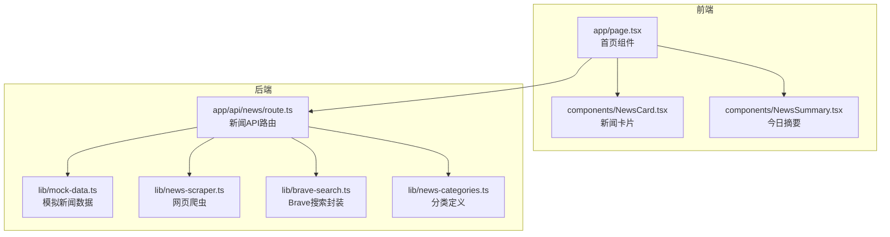
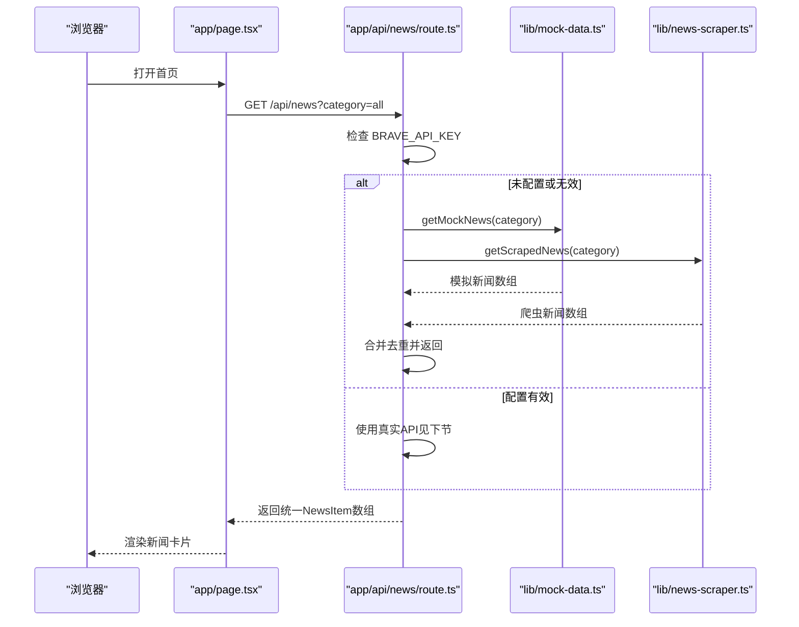
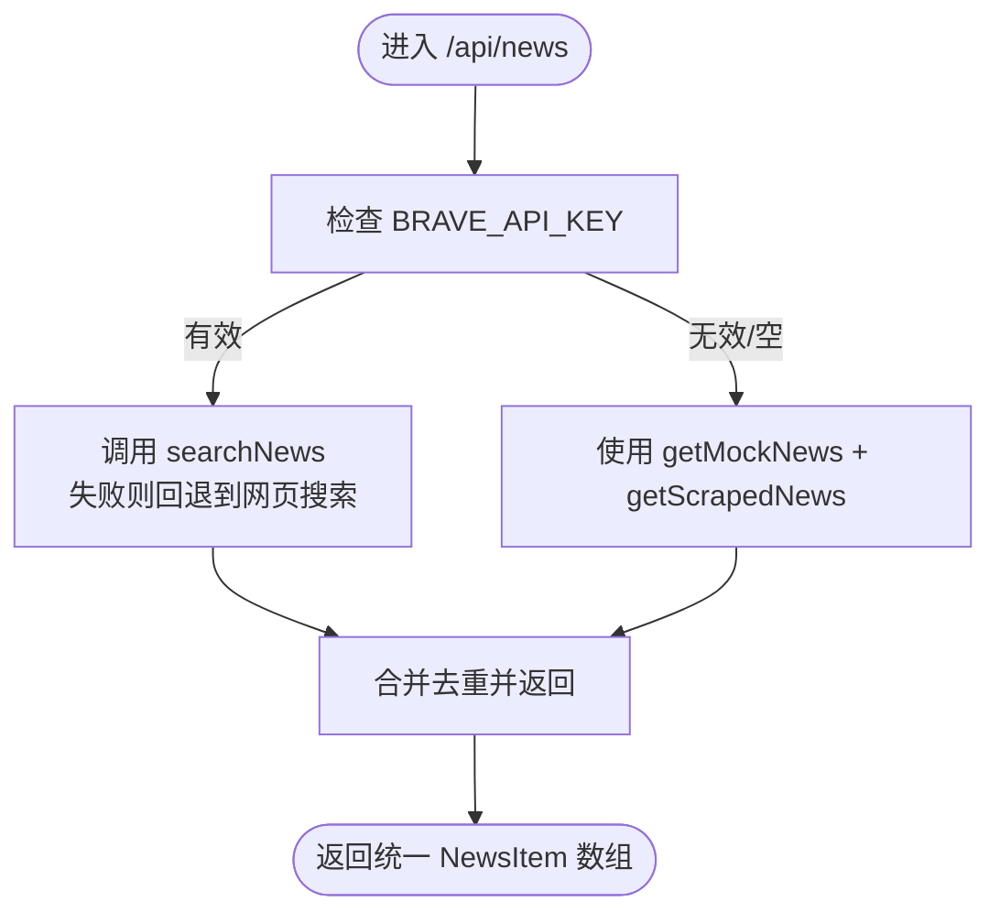
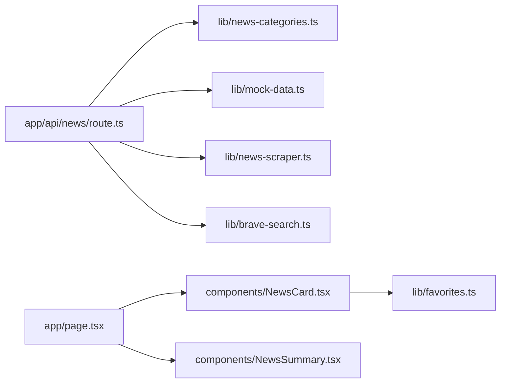

# 模拟数据模型

<cite>
**本文引用的文件**
- [lib/mock-data.ts](file://lib/mock-data.ts)
- [app/api/news/route.ts](file://app/api/news/route.ts)
- [lib/brave-search.ts](file://lib/brave-search.ts)
- [lib/news-scraper.ts](file://lib/news-scraper.ts)
- [lib/news-categories.ts](file://lib/news-categories.ts)
- [components/NewsCard.tsx](file://components/NewsCard.tsx)
- [components/NewsSummary.tsx](file://components/NewsSummary.tsx)
- [app/page.tsx](file://app/page.tsx)
- [lib/favorites.ts](file://lib/favorites.ts)
- [README.md](file://README.md)
</cite>

## 目录
1. [简介](#简介)
2. [项目结构](#项目结构)
3. [核心组件](#核心组件)
4. [架构总览](#架构总览)
5. [详细组件分析](#详细组件分析)
6. [依赖关系分析](#依赖关系分析)
7. [性能考量](#性能考量)
8. [故障排查指南](#故障排查指南)
9. [结论](#结论)
10. [附录](#附录)

## 简介
本文件面向开发与测试环境，系统化阐述模拟数据（Mock Data）在新闻网站中的数据模型与使用方式。重点包括：
- 模拟数据的生成规则与数据格式
- 字段定义与类型约束
- 在开发测试、UI原型验证、API接口测试等场景中的用途
- 配置选项、自定义规则与扩展方法
- 维护与更新策略，以适配不同测试需求

## 项目结构
该项目采用 Next.js App Router 架构，前端组件通过 App Router 的 API 路由获取数据。模拟数据位于 lib/mock-data.ts 中，供 API 路由在未配置真实 API 密钥或 API 失败时回退使用。

图表来源
- [app/page.tsx](file://app/page.tsx#L1-L153)
- [app/api/news/route.ts](file://app/api/news/route.ts#L1-L136)
- [lib/mock-data.ts](file://lib/mock-data.ts#L1-L197)
- [lib/news-scraper.ts](file://lib/news-scraper.ts#L1-L166)
- [lib/brave-search.ts](file://lib/brave-search.ts#L1-L115)
- [lib/news-categories.ts](file://lib/news-categories.ts#L1-L45)

章节来源
- [README.md](file://README.md#L36-L49)

## 核心组件
- 模拟新闻数据模块：提供按分类组织的虚拟新闻数组，用于在无真实 API 密钥或 API 失败时回退。
- API 路由：根据环境变量决定是否使用模拟数据；同时并发抓取爬虫数据，合并去重后返回统一格式。
- 分类定义：提供分类 ID、标签与关键词，驱动 API 查询与页面展示。
- 前端组件：消费统一的 NewsItem 结构，渲染卡片、摘要与收藏交互。

章节来源
- [lib/mock-data.ts](file://lib/mock-data.ts#L1-L197)
- [app/api/news/route.ts](file://app/api/news/route.ts#L1-L136)
- [lib/news-categories.ts](file://lib/news-categories.ts#L1-L45)
- [components/NewsCard.tsx](file://components/NewsCard.tsx#L1-L89)
- [components/NewsSummary.tsx](file://components/NewsSummary.tsx#L1-L54)

## 架构总览
模拟数据在整体架构中的位置如下：当检测到未配置有效 API Key 或 API 请求异常时，API 路由自动切换为“模拟数据 + 爬虫数据”的混合模式，保证前端始终能获得稳定的数据流。

图表来源
- [app/api/news/route.ts](file://app/api/news/route.ts#L8-L74)
- [lib/mock-data.ts](file://lib/mock-data.ts#L194-L197)
- [lib/news-scraper.ts](file://lib/news-scraper.ts#L140-L153)

## 详细组件分析

### 模拟数据模型与字段定义
- 数据结构：Record<string, NewsItem[]>，键为分类 ID（如 all、politics、business、tech），值为该分类下的新闻数组。
- 单条新闻字段（NewsItem）：
  - id: 字符串，唯一标识
  - title: 字符串，标题
  - description: 字符串，描述
  - url: 字符串，原文链接
  - source: 字符串，来源媒体
  - publishedAt: 字符串，发布时间（相对时间）
  - category: 字符串，所属分类
  - thumbnail?: 可选字符串，缩略图URL
- 生成规则：
  - 按分类组织，每个分类至少包含若干条示例新闻，确保 UI 原型与测试场景有足够数据。
  - 模拟数据不包含真实来源域名，仅用于演示与测试。
  - 当 API Key 未配置或无效时，API 路由直接返回模拟数据，并与爬虫数据合并。

章节来源
- [lib/mock-data.ts](file://lib/mock-data.ts#L3-L192)
- [lib/brave-search.ts](file://lib/brave-search.ts#L1-L10)

### API 路由中的模拟数据使用
- 环境变量判断：当 BRAVE_API_KEY 为空或为占位符时，启用模拟数据回退。
- 并发获取：同时触发 getScrapedNews，避免等待单一数据源。
- 合并策略：优先保留 API 新闻，再追加爬虫新闻，去重逻辑基于标题标准化后的键集合。
- 搜索过滤：若请求携带查询参数，则对合并后的结果进行关键词过滤。
- 返回结构：包含 news 数组、当前分类、查询关键字、时间戳、来源统计与 mock 标记。

章节来源
- [app/api/news/route.ts](file://app/api/news/route.ts#L8-L74)
- [app/api/news/route.ts](file://app/api/news/route.ts#L14-L37)
- [app/api/news/route.ts](file://app/api/news/route.ts#L57-L73)

### 分类体系与关键词映射
- 分类定义：提供分类 ID、中文标签与关键词数组，用于驱动真实 API 查询或页面导航。
- 页面交互：CategoryTabs 组件展示分类标签，用户点击切换分类；Home 组件通过 /api/news?category=... 获取对应数据。

章节来源
- [lib/news-categories.ts](file://lib/news-categories.ts#L7-L40)
- [components/CategoryTabs.tsx](file://components/CategoryTabs.tsx#L12-L47)
- [app/page.tsx](file://app/page.tsx#L44-L47)

### 前端消费与展示
- 统一数据模型：NewsCard 与 NewsSummary 消费相同的 NewsItem 结构，确保组件复用与一致性。
- 加载状态：NewsSummary 提供加载骨架屏，提升用户体验。
- 收藏功能：favorites 模块提供本地存储的收藏管理，与新闻卡片收藏按钮联动。

章节来源
- [components/NewsCard.tsx](file://components/NewsCard.tsx#L12-L27)
- [components/NewsSummary.tsx](file://components/NewsSummary.tsx#L10-L23)
- [lib/favorites.ts](file://lib/favorites.ts#L1-L29)

### 真实 API 与回退流程对比
- 真实 API 流程：当 API Key 有效时，API 路由调用 searchNews，若新闻搜索失败则回退到网页搜索；随后与爬虫数据合并返回。
- 回退流程：当 API Key 无效或缺失时，直接使用模拟数据与爬虫数据合并返回。

图表来源
- [app/api/news/route.ts](file://app/api/news/route.ts#L7-L134)
- [lib/brave-search.ts](file://lib/brave-search.ts#L30-L73)

## 依赖关系分析
- API 路由依赖：
  - 分类定义：用于将分类 ID 映射为关键词，驱动真实 API 查询。
  - 模拟数据：在回退路径中提供稳定数据。
  - 爬虫模块：补充更多样化的新闻来源，增强测试覆盖面。
  - Brave 搜索封装：提供真实新闻数据与错误回退机制。
- 前端组件依赖：
  - 统一的 NewsItem 类型，确保组件间数据契约一致。
  - 收藏模块：提供本地持久化能力，增强用户交互体验。

图表来源
- [app/api/news/route.ts](file://app/api/news/route.ts#L1-L6)
- [lib/news-categories.ts](file://lib/news-categories.ts#L1-L45)
- [lib/mock-data.ts](file://lib/mock-data.ts#L1-L197)
- [lib/news-scraper.ts](file://lib/news-scraper.ts#L1-L166)
- [lib/brave-search.ts](file://lib/brave-search.ts#L1-L115)
- [app/page.tsx](file://app/page.tsx#L1-L153)
- [components/NewsCard.tsx](file://components/NewsCard.tsx#L1-L89)
- [components/NewsSummary.tsx](file://components/NewsSummary.tsx#L1-L54)
- [lib/favorites.ts](file://lib/favorites.ts#L1-L29)

## 性能考量
- 并发策略：API 路由在回退路径中并发获取模拟数据与爬虫数据，减少总等待时间。
- 去重策略：基于标题标准化键集合进行去重，避免重复新闻影响用户体验。
- 缓存建议：前端可对分类与查询结果进行轻量缓存，减少重复请求。
- 爬虫稳定性：爬虫模块对单个源失败进行容错处理，不影响整体返回。

章节来源
- [app/api/news/route.ts](file://app/api/news/route.ts#L44-L52)
- [app/api/news/route.ts](file://app/api/news/route.ts#L14-L37)
- [lib/news-scraper.ts](file://lib/news-scraper.ts#L132-L135)

## 故障排查指南
- API Key 未配置或无效
  - 现象：返回数据中包含 mock 标记，且来源统计显示 mock 条目数量。
  - 处理：在 .env.local 中填写有效的 BRAVE_API_KEY。
- API 请求异常
  - 现象：捕获错误后回退到“模拟数据 + 爬虫数据”组合。
  - 处理：检查网络连通性与 API Key 有效性；必要时清理缓存或稍后重试。
- 爬虫数据为空
  - 现象：来源统计中 scraped 为 0，但 mock 数据仍可用。
  - 处理：检查目标站点可访问性与选择器匹配情况；可适当放宽限制或更换源。
- 前端无法渲染
  - 现象：加载状态长时间存在或报错。
  - 处理：确认 /api/news 返回的 news 字段为数组；检查组件对 NewsItem 字段的使用是否与实际一致。

章节来源
- [app/api/news/route.ts](file://app/api/news/route.ts#L8-L11)
- [app/api/news/route.ts](file://app/api/news/route.ts#L112-L134)
- [lib/news-scraper.ts](file://lib/news-scraper.ts#L145-L152)
- [app/page.tsx](file://app/page.tsx#L19-L38)

## 结论
模拟数据系统通过统一的 NewsItem 模型与清晰的回退策略，在开发测试、UI 原型验证与 API 接口测试中提供了稳定可靠的数据支撑。其设计兼顾易用性与扩展性，便于在不同测试场景中灵活配置与维护。

## 附录

### 模拟数据用途说明
- 开发测试：在本地或 CI 环境中无需真实 API 密钥即可运行，保障开发效率。
- UI 原型验证：提供稳定的分类与数据量，便于快速迭代界面与交互。
- API 接口测试：统一数据结构与字段，便于编写自动化测试与集成测试。

### 配置选项与环境变量
- BRAVE_API_KEY：控制是否启用真实 API 与回退逻辑。
- 查询参数：category（分类）、q（关键词），用于筛选与搜索。

章节来源
- [app/api/news/route.ts](file://app/api/news/route.ts#L7-L42)
- [README.md](file://README.md#L24-L32)

### 自定义规则与扩展方法
- 扩展分类：在 news-categories 中新增分类定义，配合 mock-data.ts 增加对应分类的示例数据。
- 修改字段：如需新增 thumbnail 或其他字段，需同步更新 Brave 搜索封装与模拟数据生成逻辑。
- 定制回退策略：可在 API 路由中调整合并顺序、去重策略或搜索过滤逻辑。
- 爬虫扩展：在 news-scraper.ts 中新增源与解析器，丰富数据多样性。

章节来源
- [lib/news-categories.ts](file://lib/news-categories.ts#L7-L40)
- [lib/mock-data.ts](file://lib/mock-data.ts#L3-L192)
- [lib/brave-search.ts](file://lib/brave-search.ts#L63-L72)
- [lib/news-scraper.ts](file://lib/news-scraper.ts#L5-L91)

### 维护与更新策略
- 版本化管理：将 mock-data.ts 作为版本化资源，随功能迭代同步更新。
- 数据质量：定期校验模拟数据的时效性与代表性，必要时替换为更贴近真实场景的内容。
- 测试覆盖：在回归测试中加入对 mock 数据路径的验证，确保 UI 与交互不受影响。
- 文档同步：保持 README 与 mock-data 注释的一致性，便于新成员快速上手。