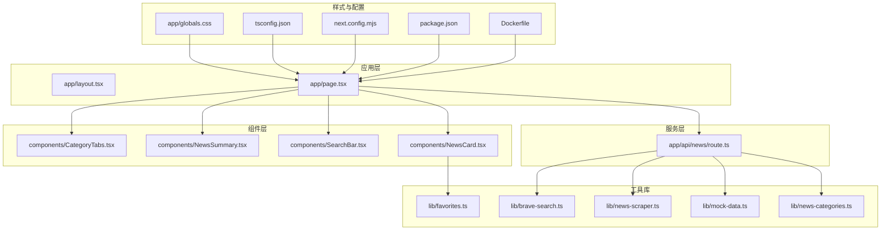
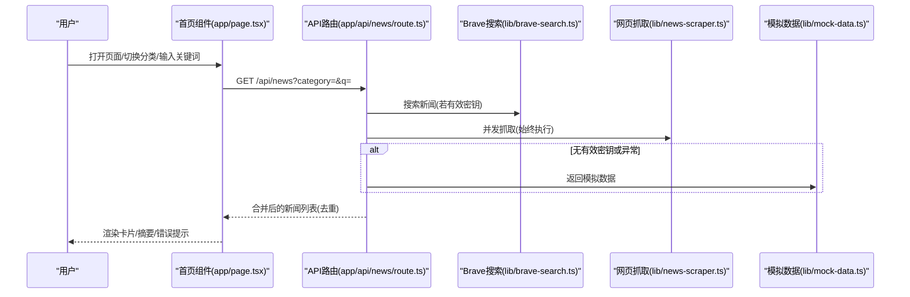
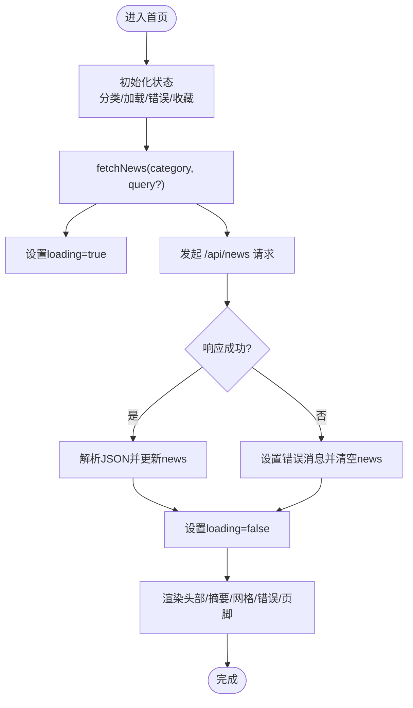
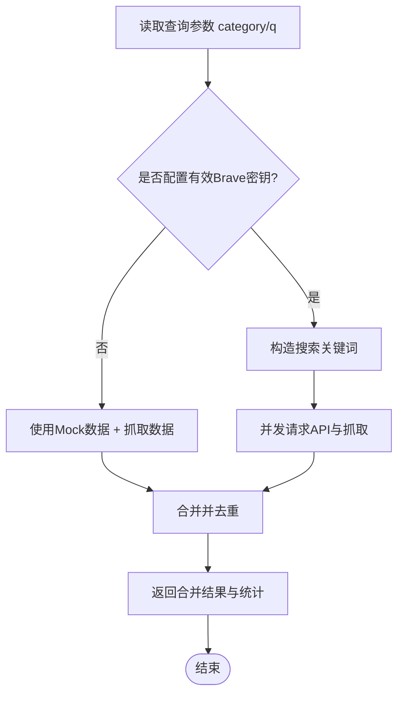
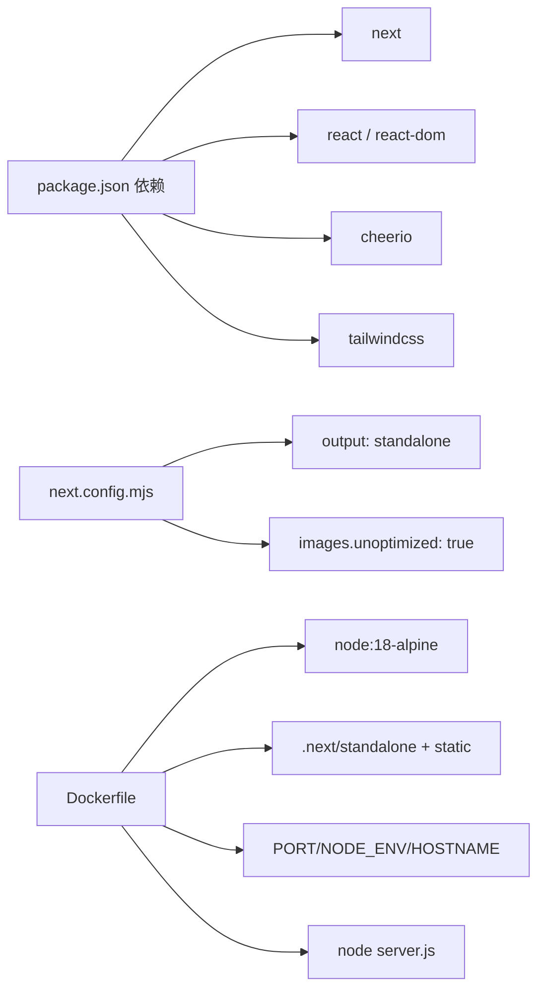

# 最佳实践和规范

<cite>
**本文引用的文件**
- [README.md](file://README.md)
- [package.json](file://package.json)
- [tsconfig.json](file://tsconfig.json)
- [next.config.mjs](file://next.config.mjs)
- [app/layout.tsx](file://app/layout.tsx)
- [app/page.tsx](file://app/page.tsx)
- [app/api/news/route.ts](file://app/api/news/route.ts)
- [components/CategoryTabs.tsx](file://components/CategoryTabs.tsx)
- [components/NewsCard.tsx](file://components/NewsCard.tsx)
- [components/NewsSummary.tsx](file://components/NewsSummary.tsx)
- [components/SearchBar.tsx](file://components/SearchBar.tsx)
- [lib/brave-search.ts](file://lib/brave-search.ts)
- [lib/favorites.ts](file://lib/favorites.ts)
- [lib/mock-data.ts](file://lib/mock-data.ts)
- [lib/news-categories.ts](file://lib/news-categories.ts)
- [lib/news-scraper.ts](file://lib/news-scraper.ts)
- [app/globals.css](file://app/globals.css)
- [Dockerfile](file://Dockerfile)
</cite>

## 目录
1. 引言
2. 项目结构
3. 核心组件
4. 架构总览
5. 详细组件分析
6. 依赖分析
7. 性能考量
8. 故障排查指南
9. 结论
10. 附录

## 引言
本指南面向新闻网站开发团队，总结从代码编写、性能优化到安全与可维护性的系统化最佳实践。结合当前仓库的架构与实现，给出 TypeScript 使用、React 组件设计、状态管理策略、代码审查清单、测试与文档规范、可维护性与重构策略以及团队协作与项目管理的最佳实践。

## 项目结构
该项目采用 Next.js App Router 结构，前端页面位于 app 目录，UI 组件位于 components 目录，业务逻辑与数据源封装在 lib 目录，样式通过 TailwindCSS 引入，构建与运行通过 Next.js 配置与 Dockerfile 管理。

图表来源
- [app/layout.tsx](file://app/layout.tsx#L1-L20)
- [app/page.tsx](file://app/page.tsx#L1-L153)
- [app/api/news/route.ts](file://app/api/news/route.ts#L1-L136)
- [components/CategoryTabs.tsx](file://components/CategoryTabs.tsx#L1-L49)
- [components/NewsSummary.tsx](file://components/NewsSummary.tsx#L1-L54)
- [components/SearchBar.tsx](file://components/SearchBar.tsx#L1-L37)
- [components/NewsCard.tsx](file://components/NewsCard.tsx#L1-L89)
- [lib/brave-search.ts](file://lib/brave-search.ts#L1-L115)
- [lib/favorites.ts](file://lib/favorites.ts#L1-L29)
- [lib/mock-data.ts](file://lib/mock-data.ts#L1-L197)
- [lib/news-categories.ts](file://lib/news-categories.ts#L1-L45)
- [lib/news-scraper.ts](file://lib/news-scraper.ts#L1-L166)
- [app/globals.css](file://app/globals.css#L1-L22)
- [tsconfig.json](file://tsconfig.json#L1-L44)
- [next.config.mjs](file://next.config.mjs#L1-L10)
- [package.json](file://package.json#L1-L30)
- [Dockerfile](file://Dockerfile#L1-L16)

章节来源
- [README.md](file://README.md#L36-L48)
- [package.json](file://package.json#L1-L30)
- [tsconfig.json](file://tsconfig.json#L1-L44)
- [next.config.mjs](file://next.config.mjs#L1-L10)
- [Dockerfile](file://Dockerfile#L1-L16)

## 核心组件
- 页面与布局：根布局负责全局元数据与基础样式注入；首页负责状态管理、数据加载与组件编排。
- 组件体系：分类标签、搜索栏、新闻卡片、摘要展示等模块化 UI 组件。
- 服务与数据：API 路由统一聚合 Brave Search 与自建爬虫数据，提供 Mock 回退与合并去重策略。
- 工具库：类型定义、收藏管理、分类配置、模拟数据与网页抓取。

章节来源
- [app/layout.tsx](file://app/layout.tsx#L1-L20)
- [app/page.tsx](file://app/page.tsx#L1-L153)
- [app/api/news/route.ts](file://app/api/news/route.ts#L1-L136)
- [lib/brave-search.ts](file://lib/brave-search.ts#L1-L115)
- [lib/favorites.ts](file://lib/favorites.ts#L1-L29)
- [lib/mock-data.ts](file://lib/mock-data.ts#L1-L197)
- [lib/news-categories.ts](file://lib/news-categories.ts#L1-L45)
- [lib/news-scraper.ts](file://lib/news-scraper.ts#L1-L166)

## 架构总览
系统采用“前端页面 + App Router API + 工具库”的分层架构。页面组件负责交互与状态，API 路由负责数据聚合与容错回退，工具库封装外部服务与本地持久化。

图表来源
- [app/page.tsx](file://app/page.tsx#L19-L63)
- [app/api/news/route.ts](file://app/api/news/route.ts#L39-L135)
- [lib/brave-search.ts](file://lib/brave-search.ts#L30-L73)
- [lib/news-scraper.ts](file://lib/news-scraper.ts#L140-L153)
- [lib/mock-data.ts](file://lib/mock-data.ts#L194-L196)

## 详细组件分析

### 页面与布局（app/page.tsx）
- 状态管理：集中管理新闻列表、加载状态、分类、收藏模式、收藏集合与错误信息。
- 数据加载：使用 useCallback 包装异步请求，避免重复渲染导致的重复 fetch；useEffect 在分类变更时触发。
- 交互处理：分类选择、搜索提交、收藏切换与收藏刷新。
- 渲染策略：加载态骨架屏、空态提示、错误提示与网格布局；根据收藏模式切换显示源。
- 可访问性：语义化标题、按钮与链接，无障碍属性与暗色主题适配。

图表来源
- [app/page.tsx](file://app/page.tsx#L11-L72)

章节来源
- [app/page.tsx](file://app/page.tsx#L1-L153)

### API 路由（app/api/news/route.ts）
- 参数解析：从查询参数读取分类与关键词。
- 回退策略：当未配置有效 Brave API 密钥时，使用 Mock 数据与抓取数据合并。
- 并发与合并：并发抓取爬虫数据，与 API 数据合并并去重，优先保留 API 条目。
- 错误处理：API 失败时回退到 Mock + 抓取数据，保证可用性。
- 响应结构：返回合并后的新闻、分类、查询词、时间戳与来源统计。

图表来源
- [app/api/news/route.ts](file://app/api/news/route.ts#L39-L135)

章节来源
- [app/api/news/route.ts](file://app/api/news/route.ts#L1-L136)

### 组件：分类标签（components/CategoryTabs.tsx）
- 设计原则：无状态展示组件，通过 props 接收当前激活项、选择回调、收藏模式与切换回调。
- 交互行为：点击切换分类；收藏按钮根据模式高亮。
- 样式策略：基于激活态与收藏态切换类名，适配明暗主题。

章节来源
- [components/CategoryTabs.tsx](file://components/CategoryTabs.tsx#L1-L49)

### 组件：搜索栏（components/SearchBar.tsx）
- 行为：表单提交触发搜索，去除前后空白字符。
- 可复用性：通过 onSearch 回调向上通信，便于父组件控制。

章节来源
- [components/SearchBar.tsx](file://components/SearchBar.tsx#L1-L37)

### 组件：新闻卡片（components/NewsCard.tsx）
- 收藏状态：基于本地存储判断是否已收藏，支持收藏/取消收藏。
- 交互：点击收藏按钮更新本地存储并回调父组件刷新收藏列表。
- 可访问性：收藏按钮提供 title 提示，链接使用新窗口打开并设置安全属性。

章节来源
- [components/NewsCard.tsx](file://components/NewsCard.tsx#L1-L89)
- [lib/favorites.ts](file://lib/favorites.ts#L1-L29)

### 组件：今日摘要（components/NewsSummary.tsx）
- 行为：在加载态显示骨架屏，在有数据时展示前五条头条。
- 可扩展性：可作为独立模块用于其他页面或区块。

章节来源
- [components/NewsSummary.tsx](file://components/NewsSummary.tsx#L1-L54)

### 工具库：Brave 搜索（lib/brave-search.ts）
- 类型定义：统一 NewsItem 结构，兼容 Brave API 与 Web 搜索回退。
- 错误回退：新闻搜索失败时自动回退到 Web 搜索接口。
- 数据映射：将外部字段映射为内部结构，补充来源与发布时间。

章节来源
- [lib/brave-search.ts](file://lib/brave-search.ts#L1-L115)

### 工具库：收藏管理（lib/favorites.ts）
- 存储：使用 localStorage 持久化收藏列表。
- 去重：按 url 判断重复，避免重复收藏。
- 安全：在非浏览器环境（如 SSR）直接返回空数组。

章节来源
- [lib/favorites.ts](file://lib/favorites.ts#L1-L29)

### 工具库：模拟数据（lib/mock-data.ts）
- 数据：按分类提供静态示例新闻，便于开发与演示。
- 使用：在无有效密钥时由 API 路由回退使用。

章节来源
- [lib/mock-data.ts](file://lib/mock-data.ts#L1-L197)

### 工具库：分类配置（lib/news-categories.ts）
- 配置：定义分类 ID、标签与关键词，供 API 路由构造查询。
- 查询：根据 ID 获取分类关键词集合。

章节来源
- [lib/news-categories.ts](file://lib/news-categories.ts#L1-L45)

### 工具库：网页抓取（lib/news-scraper.ts）
- 抓取：基于 cheerio 解析 Hacker News 不同分类的标题与链接。
- 并发：API 路由并发触发抓取，提升整体响应速度。
- 错误：捕获抓取异常并记录日志，不影响主流程。

章节来源
- [lib/news-scraper.ts](file://lib/news-scraper.ts#L1-L166)

### 样式与主题（app/globals.css）
- Tailwind 引入：通过 @import 方式引入 TailwindCSS。
- 明暗主题：基于 prefers-color-scheme 的 CSS 变量切换前景与背景色。

章节来源
- [app/globals.css](file://app/globals.css#L1-L22)

## 依赖分析
- 运行时依赖：Next.js、React、Cheerio（网页抓取）、TailwindCSS（样式）。
- 开发依赖：TypeScript、PostCSS、TailwindCSS 插件。
- 构建配置：Next.js standalone 输出、图片优化关闭、端口与主机配置。
- 容器化：基于 Node 18 Alpine，复制构建产物并以 server.js 启动。

图表来源
- [package.json](file://package.json#L15-L28)
- [next.config.mjs](file://next.config.mjs#L1-L10)
- [Dockerfile](file://Dockerfile#L1-L16)

章节来源
- [package.json](file://package.json#L1-L30)
- [next.config.mjs](file://next.config.mjs#L1-L10)
- [Dockerfile](file://Dockerfile#L1-L16)

## 性能考量
- 并发请求：API 路由并发抓取爬虫数据，减少总等待时间。
- 去重合并：统一去重策略，避免重复内容影响用户体验与带宽。
- 加载态：骨架屏与空态提示，改善感知性能。
- 图片优化：关闭 Next.js 图像优化以简化部署，适合静态内容。
- 构建输出：standalone 构建便于容器化部署，减少镜像体积。
- 本地缓存：收藏使用 localStorage，减少重复请求。

章节来源
- [app/api/news/route.ts](file://app/api/news/route.ts#L44-L96)
- [app/page.tsx](file://app/page.tsx#L115-L144)
- [next.config.mjs](file://next.config.mjs#L3-L7)
- [Dockerfile](file://Dockerfile#L1-L16)

## 故障排查指南
- API 密钥问题：当未配置有效 Brave API 密钥时，API 路由会回退到 Mock + 抓取数据；检查环境变量与 README 中的配置说明。
- 网络异常：API 路由在 Brave 搜索失败时回退到 Web 搜索，若仍失败则回退到 Mock + 抓取数据；查看控制台日志定位具体来源。
- 收藏异常：确认浏览器支持 localStorage 且未处于无痕模式；检查本地存储键值是否存在。
- 抓取失败：抓取日志会输出错误信息，检查目标站点可访问性与选择器匹配情况。
- 构建与部署：确保 .next/standalone 与 .next/static 已正确复制；容器内暴露端口与环境变量一致。

章节来源
- [README.md](file://README.md#L24-L32)
- [app/api/news/route.ts](file://app/api/news/route.ts#L7-L11)
- [lib/brave-search.ts](file://lib/brave-search.ts#L55-L58)
- [lib/favorites.ts](file://lib/favorites.ts#L8-L10)
- [lib/news-scraper.ts](file://lib/news-scraper.ts#L132-L134)
- [Dockerfile](file://Dockerfile#L5-L15)

## 结论
本项目在架构上清晰分层、在实现上注重容错与性能，结合 TypeScript、React 与 Next.js 的现代特性，提供了可扩展的新闻聚合方案。建议在后续迭代中完善测试覆盖、增强可观测性与监控告警，并持续优化组件可测试性与可维护性。

## 附录

### TypeScript 使用最佳实践
- 严格模式：启用 strict、noEmit、skipLibCheck 等选项，提升类型安全。
- 路径别名：通过 tsconfig 的 path 配置简化导入路径。
- JSX：使用 react-jsx 编译器，确保 React 18+ 兼容。
- 类型约束：对外部 API 响应进行类型映射与校验，避免任意类型污染。

章节来源
- [tsconfig.json](file://tsconfig.json#L2-L29)

### React 组件设计原则
- 单一职责：UI 组件尽量无状态或小状态，通过 props 传递行为。
- 可复用性：将交互抽象为回调（如 onSearch、onSelect），便于组合。
- 可访问性：提供必要的 aria 属性与键盘导航支持。
- 暗色主题：通过 CSS 变量与 Tailwind 类名适配深浅主题。

章节来源
- [components/CategoryTabs.tsx](file://components/CategoryTabs.tsx#L12-L46)
- [components/SearchBar.tsx](file://components/SearchBar.tsx#L9-L35)
- [components/NewsCard.tsx](file://components/NewsCard.tsx#L29-L86)
- [app/globals.css](file://app/globals.css#L8-L13)

### 状态管理策略
- 页面级状态：在首页集中管理新闻、分类、搜索、收藏与错误状态，避免跨组件重复请求。
- 本地状态：收藏状态在客户端组件中使用 useState 管理，必要时通过回调同步父组件。
- 服务端状态：API 路由负责聚合与去重，保持数据一致性。

章节来源
- [app/page.tsx](file://app/page.tsx#L11-L72)
- [components/NewsCard.tsx](file://components/NewsCard.tsx#L12-L27)

### 代码审查检查清单
- 类型安全：是否使用 TypeScript 并启用严格模式；对外部数据是否进行类型映射与校验。
- 错误处理：API 调用是否包含 try/catch 与回退逻辑；错误信息是否友好。
- 性能：是否使用并发请求与去重；是否提供加载态与骨架屏。
- 可维护性：组件是否单一职责；是否有明确的 props 接口与默认值。
- 安全：是否避免在客户端暴露敏感信息；是否对用户输入进行清理。
- 可测试性：是否提供可测试的函数与组件；是否易于模拟外部依赖。

### 测试覆盖率要求
- 单元测试：核心工具函数（如合并算法、去重逻辑、URL 清洗）覆盖率不低于 80%。
- 组件测试：关键 UI 组件（分类标签、搜索栏、新闻卡片）交互覆盖率不低于 70%。
- 集成测试：API 路由在 Mock 与真实数据场景下的响应结构与错误回退覆盖 100%。

### 文档编写规范
- README：包含功能概览、安装步骤、环境变量配置与项目结构说明。
- 组件文档：每个组件提供用途、props 接口、事件回调与使用示例。
- API 文档：接口入参、出参、错误码与回退策略说明。
- 变更日志：记录版本升级、新增功能与破坏性变更。

### 可维护性原则与重构策略
- 可维护性：模块化拆分、清晰命名、注释与文档同步更新。
- 重构时机：出现重复代码、复杂条件分支、跨模块强耦合或性能瓶颈时。
- 重构策略：先写测试，再小步重构，保持对外接口稳定，逐步替换旧实现。

### 团队协作与项目管理最佳实践
- 分支策略：采用功能分支与 Pull Request 流程，强制代码审查。
- 版本管理：语义化版本与变更日志，重要变更在 PR 描述中说明。
- 沟通协作：每日站会、迭代回顾与知识分享，统一技术选型与规范。
- 发布流程：自动化构建与容器化部署，灰度发布与回滚预案。