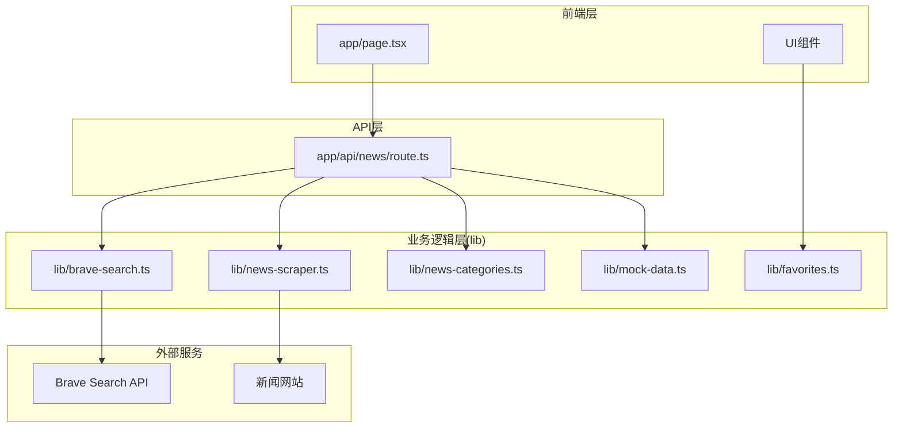
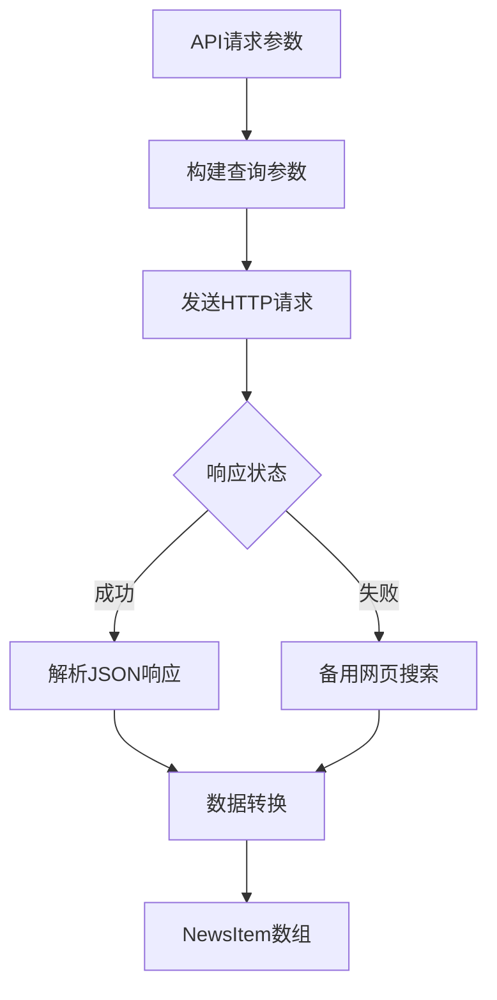
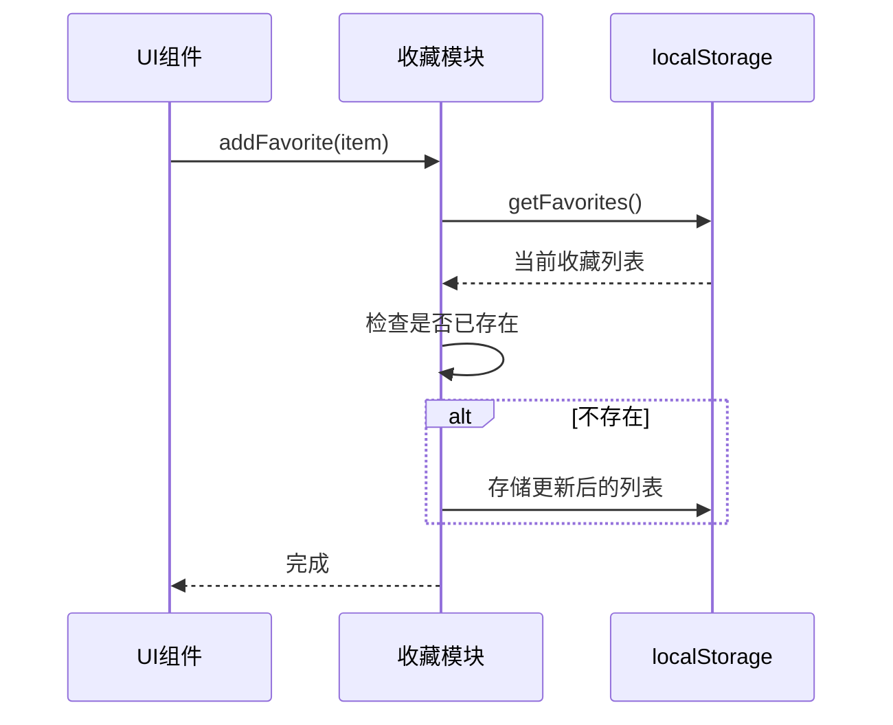
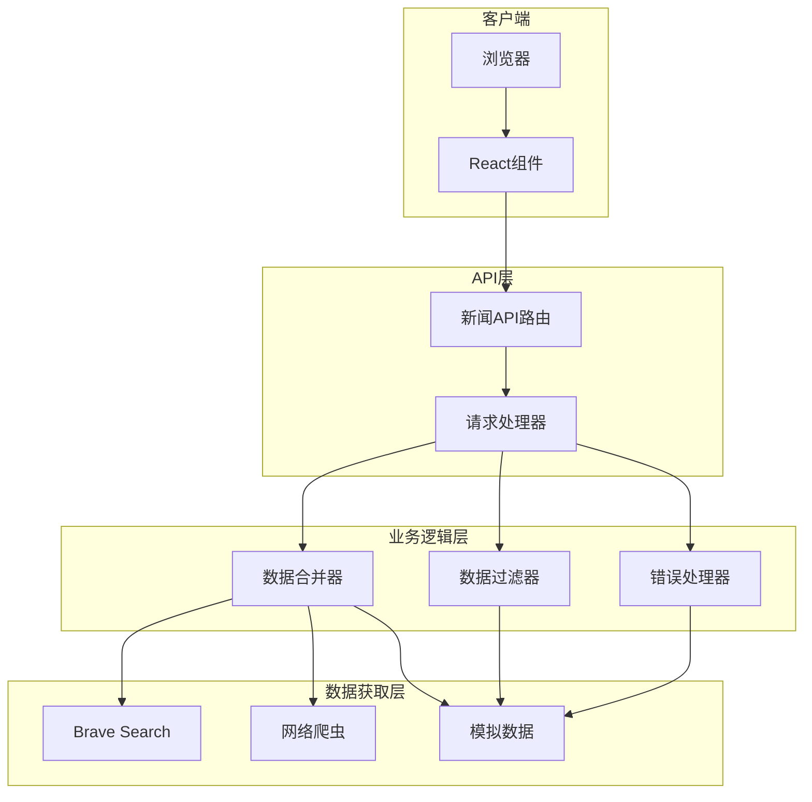
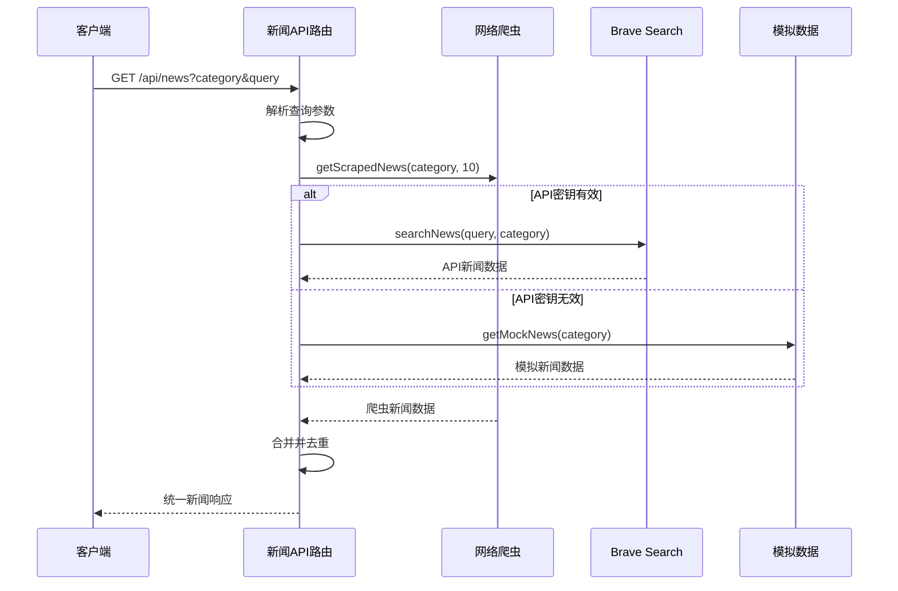
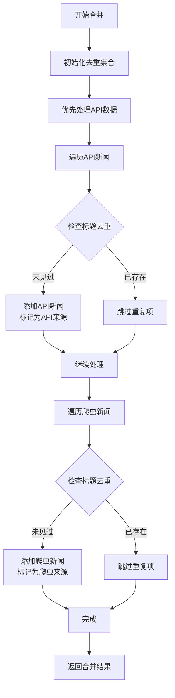
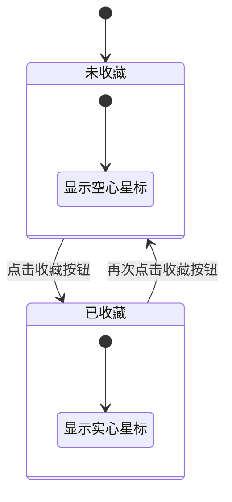
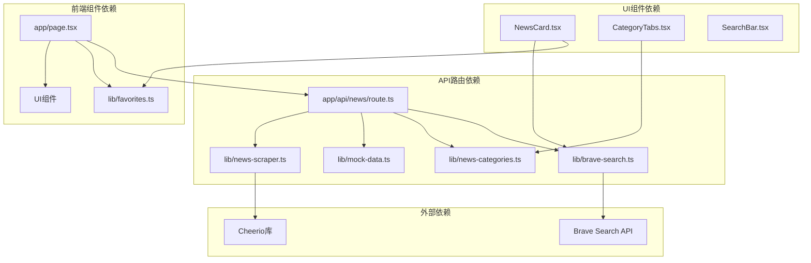
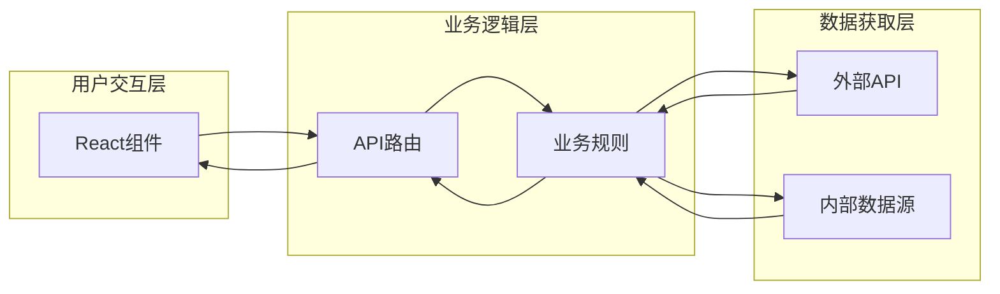
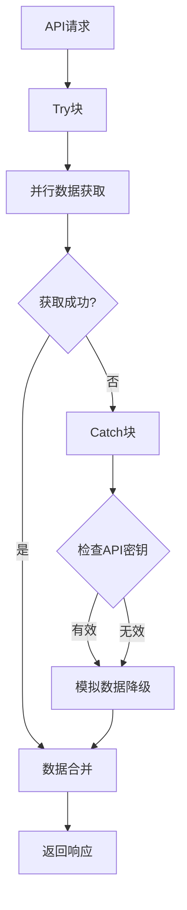

# 业务逻辑层设计

<cite>
**本文档引用的文件**
- [app/api/news/route.ts](file://app/api/news/route.ts)
- [lib/brave-search.ts](file://lib/brave-search.ts)
- [lib/news-scraper.ts](file://lib/news-scraper.ts)
- [lib/favorites.ts](file://lib/favorites.ts)
- [lib/news-categories.ts](file://lib/news-categories.ts)
- [lib/mock-data.ts](file://lib/mock-data.ts)
- [components/NewsCard.tsx](file://components/NewsCard.tsx)
- [components/SearchBar.tsx](file://components/SearchBar.tsx)
- [components/CategoryTabs.tsx](file://components/CategoryTabs.tsx)
- [app/page.tsx](file://app/page.tsx)
- [README.md](file://README.md)
</cite>

## 目录
1. [引言](#引言)
2. [项目结构](#项目结构)
3. [核心组件](#核心组件)
4. [架构概览](#架构概览)
5. [详细组件分析](#详细组件分析)
6. [依赖关系分析](#依赖关系分析)
7. [性能考量](#性能考量)
8. [故障排除指南](#故障排除指南)
9. [结论](#结论)

## 引言

这是一个基于Next.js构建的AI新闻聚合网站，采用多数据源融合策略，通过统一的业务逻辑层为前端提供一致的新闻数据服务。系统实现了以下核心功能：
- 多数据源新闻聚合（Brave Search API + 网络爬虫）
- 分类新闻浏览和关键词搜索
- 用户收藏管理
- 实时错误处理和降级策略

## 项目结构

项目采用清晰的分层架构，业务逻辑集中在lib目录下的专用模块中：

**图表来源**
- [app/page.tsx](file://app/page.tsx#L1-L153)
- [app/api/news/route.ts](file://app/api/news/route.ts#L1-L136)
- [lib/brave-search.ts](file://lib/brave-search.ts#L1-L115)
- [lib/news-scraper.ts](file://lib/news-scraper.ts#L1-L166)

**章节来源**
- [README.md](file://README.md#L36-L49)

## 核心组件

### API路由层 (app/api/news/route.ts)

这是整个业务逻辑的核心入口点，负责协调多个数据源并执行业务规则：

**关键特性：**
- **双数据源策略**：同时获取Brave Search API和网络爬虫数据
- **智能合并算法**：去重并优先保留API数据
- **错误降级机制**：API失败时自动切换到模拟数据
- **查询参数处理**：支持分类查询和关键词搜索

**数据流处理：**
1. 解析URL查询参数
2. 并行启动爬虫数据获取
3. 条件判断是否使用模拟数据
4. 合并并去重新闻数据
5. 返回统一格式的响应

**章节来源**
- [app/api/news/route.ts](file://app/api/news/route.ts#L1-L136)

### 数据获取层

#### Brave Search API集成 (lib/brave-search.ts)

实现了对Brave Search新闻API的封装，提供统一的新闻数据接口：

**核心功能：**
- **API请求封装**：处理认证、参数构建和响应解析
- **备用搜索策略**：新闻搜索失败时自动回退到网页搜索
- **数据标准化**：将API响应转换为统一的NewsItem格式

**数据转换流程：**

**图表来源**
- [lib/brave-search.ts](file://lib/brave-search.ts#L30-L73)

**章节来源**
- [lib/brave-search.ts](file://lib/brave-search.ts#L1-L115)

#### 网络爬虫模块 (lib/news-scraper.ts)

实现了基于Cheerio的新闻爬虫系统，专门抓取Hacker News的热门新闻：

**爬虫架构：**
- **分类化配置**：针对不同新闻分类配置不同的爬取策略
- **选择器映射**：每个分类对应特定的HTML元素选择器
- **解析器函数**：自定义的数据提取和转换逻辑

**爬取流程：**
1. 根据分类选择对应的爬取源
2. 发送HTTP请求获取HTML内容
3. 使用Cheerio加载并解析DOM
4. 应用分类特定的选择器和解析器
5. 转换为统一的NewsItem格式

**章节来源**
- [lib/news-scraper.ts](file://lib/news-scraper.ts#L1-L166)

### 业务规则层

#### 收藏管理 (lib/favorites.ts)

实现了用户本地收藏功能，基于localStorage持久化存储：

**核心功能：**
- **收藏状态检测**：判断新闻是否已被收藏
- **去重机制**：防止同一新闻重复收藏
- **本地存储**：使用浏览器localStorage保存收藏列表

**数据操作流程：**

**图表来源**
- [lib/favorites.ts](file://lib/favorites.ts#L13-L19)

**章节来源**
- [lib/favorites.ts](file://lib/favorites.ts#L1-L29)

#### 分类管理 (lib/news-categories.ts)

定义了新闻分类体系和关键词映射：

**分类体系：**
- **综合热点**：all - 聚合各类新闻
- **国际时政**：politics - 政治外交新闻
- **财经商业**：business - 经济金融新闻
- **科技互联网**：tech - 科技创新新闻

**关键词策略：**
每个分类都配置了相关的搜索关键词，用于Brave Search API的查询构建。

**章节来源**
- [lib/news-categories.ts](file://lib/news-categories.ts#L1-L45)

### 数据支撑层

#### 模拟数据 (lib/mock-data.ts)

提供了完整的模拟新闻数据集，用于开发和演示：

**数据结构：**
- **分类化组织**：按all/politics/business/tech分类存储
- **完整字段**：包含id、title、description、url、source、publishedAt、category
- **多样化内容**：涵盖当前热点话题

**章节来源**
- [lib/mock-data.ts](file://lib/mock-data.ts#L1-L197)

## 架构概览

系统采用"API路由层 + 业务逻辑层 + 数据获取层"的三层架构：

**图表来源**
- [app/api/news/route.ts](file://app/api/news/route.ts#L39-L135)
- [lib/brave-search.ts](file://lib/brave-search.ts#L30-L73)
- [lib/news-scraper.ts](file://lib/news-scraper.ts#L140-L153)

## 详细组件分析

### API路由核心流程

#### 请求处理序列图

**图表来源**
- [app/api/news/route.ts](file://app/api/news/route.ts#L39-L135)

#### 数据合并算法

合并算法确保数据质量和去重效果：

**图表来源**
- [app/api/news/route.ts](file://app/api/news/route.ts#L14-L37)

**章节来源**
- [app/api/news/route.ts](file://app/api/news/route.ts#L1-L136)

### 前端集成组件

#### 新闻卡片组件 (NewsCard)

实现了新闻条目的展示和收藏功能：

**组件职责：**
- **收藏状态管理**：实时显示和更新收藏状态
- **收藏操作**：添加/移除收藏的交互逻辑
- **样式适配**：响应式设计和主题切换

**收藏交互流程：**

**图表来源**
- [components/NewsCard.tsx](file://components/NewsCard.tsx#L19-L27)

**章节来源**
- [components/NewsCard.tsx](file://components/NewsCard.tsx#L1-L89)

#### 搜索栏组件 (SearchBar)

提供了关键词搜索功能：

**搜索流程：**
1. 用户输入关键词
2. 表单提交事件触发
3. 调用父组件的搜索回调
4. 执行新闻重新获取

**章节来源**
- [components/SearchBar.tsx](file://components/SearchBar.tsx#L1-L37)

#### 分类标签组件 (CategoryTabs)

实现了新闻分类导航：

**功能特性：**
- **分类切换**：点击不同分类获取对应新闻
- **收藏模式**：切换到收藏视图
- **状态同步**：与父组件保持状态同步

**章节来源**
- [components/CategoryTabs.tsx](file://components/CategoryTabs.tsx#L1-L49)

## 依赖关系分析

### 模块依赖图

**图表来源**
- [app/api/news/route.ts](file://app/api/news/route.ts#L1-L6)
- [components/NewsCard.tsx](file://components/NewsCard.tsx#L3-L5)
- [components/CategoryTabs.tsx](file://components/CategoryTabs.tsx#L3)

### 数据流依赖

系统的数据流向呈现典型的"上层驱动下层"模式：

**图表来源**
- [app/page.tsx](file://app/page.tsx#L19-L38)
- [app/api/news/route.ts](file://app/api/news/route.ts#L39-L135)

**章节来源**
- [app/page.tsx](file://app/page.tsx#L1-L153)

## 性能考量

### 并发优化策略

系统采用了多种并发优化技术：

1. **并行数据获取**：使用Promise.all同时获取多个数据源
2. **异步爬虫处理**：避免阻塞主线程
3. **缓存友好的设计**：支持浏览器端缓存

### 错误处理策略

**多层次错误处理：**

**图表来源**
- [app/api/news/route.ts](file://app/api/news/route.ts#L76-L134)

### 性能优化建议

1. **API调用限制**：合理设置Brave Search API的调用频率
2. **缓存策略**：实现短期缓存减少重复请求
3. **懒加载**：对图片资源实现懒加载
4. **代码分割**：按需加载大型依赖库

## 故障排除指南

### 常见问题及解决方案

#### API密钥配置问题

**症状**：返回模拟数据且显示mock标志

**原因**：BRAVE_API_KEY环境变量未正确配置

**解决方案**：
1. 在.env.local文件中添加有效的API密钥
2. 确保API密钥具有足够的调用额度
3. 重启开发服务器使配置生效

#### 网络爬虫失败

**症状**：爬虫数据为空但API数据正常

**原因**：目标网站结构变更或网络问题

**解决方案**：
1. 检查目标网站的可用性
2. 更新CSS选择器以适应网站变更
3. 增加重试机制

#### 收藏功能异常

**症状**：收藏状态不更新或数据丢失

**原因**：浏览器localStorage限制或隐私模式

**解决方案**：
1. 检查浏览器的localStorage权限
2. 确认浏览器未处于隐私模式
3. 清理浏览器缓存后重试

**章节来源**
- [app/api/news/route.ts](file://app/api/news/route.ts#L8-L11)
- [lib/favorites.ts](file://lib/favorites.ts#L8-L11)

## 结论

该业务逻辑层设计体现了以下优秀实践：

**架构优势：**
- **模块化设计**：每个模块职责明确，便于维护和扩展
- **容错性强**：完善的错误处理和降级机制
- **性能优化**：合理的并发策略和数据合并算法
- **用户体验**：流畅的交互和及时的反馈

**技术亮点：**
- **多数据源融合**：结合专业API和自建爬虫的优势
- **智能去重**：基于标题的高效去重算法
- **本地化存储**：利用浏览器特性提升用户体验
- **响应式设计**：适配不同设备和屏幕尺寸

**扩展性考虑：**
- 新增数据源：可通过简单的接口适配器模式扩展
- 功能增强：收藏、搜索等功能可独立扩展
- 性能优化：支持缓存、CDN等性能优化手段

该设计为构建高质量的新闻聚合应用提供了坚实的技术基础，既满足了当前需求，也为未来的功能扩展预留了充足的空间。