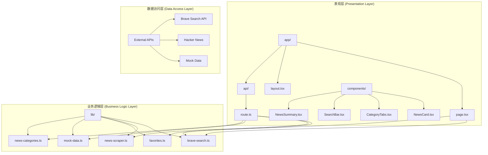
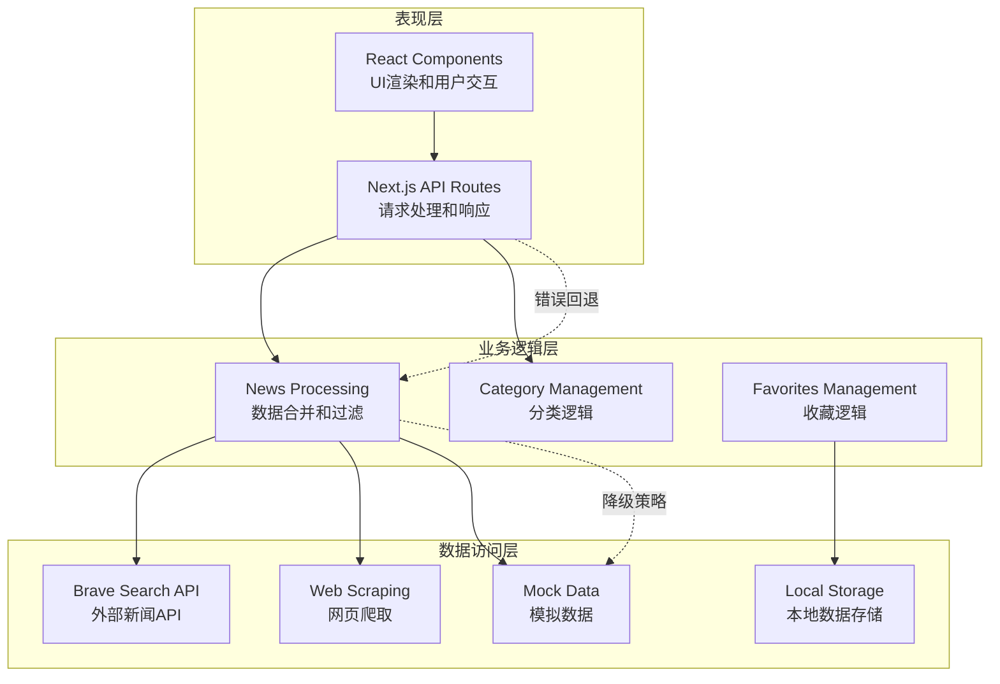
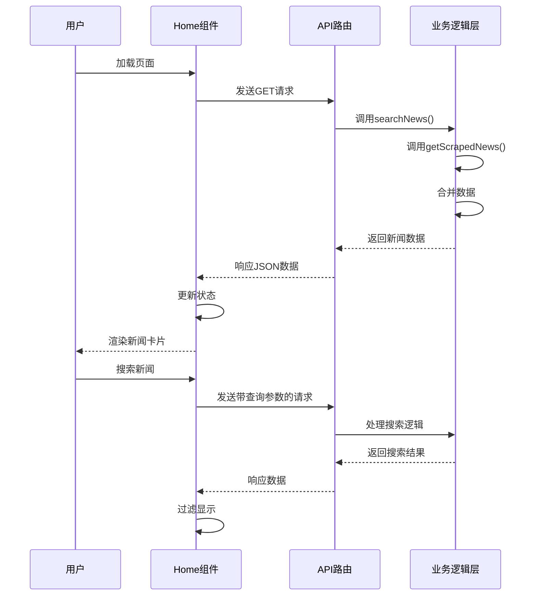
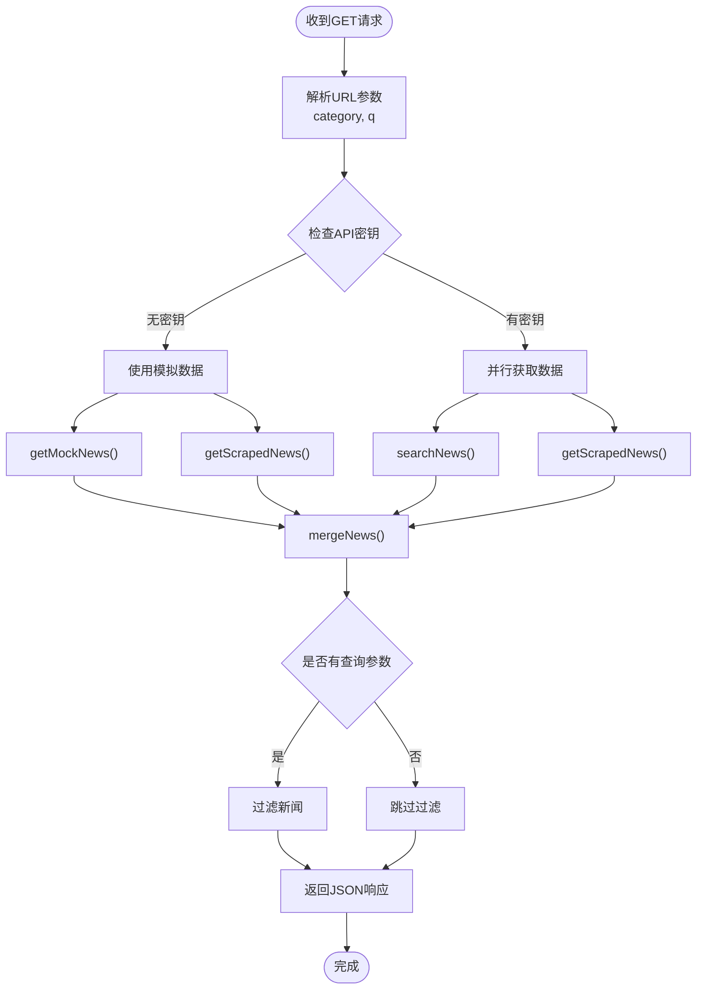
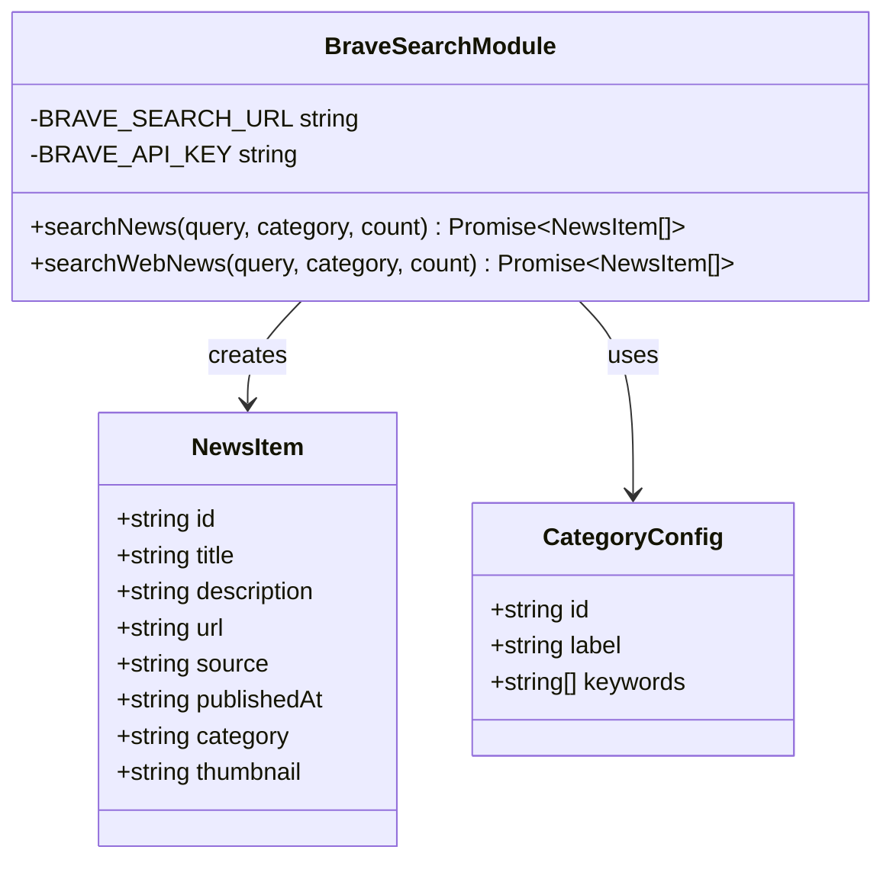
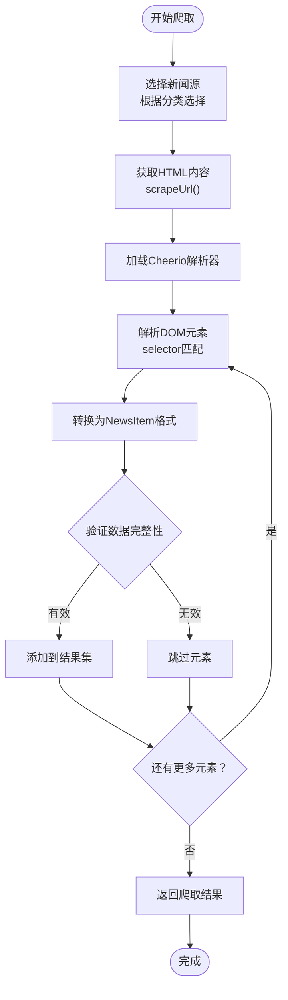
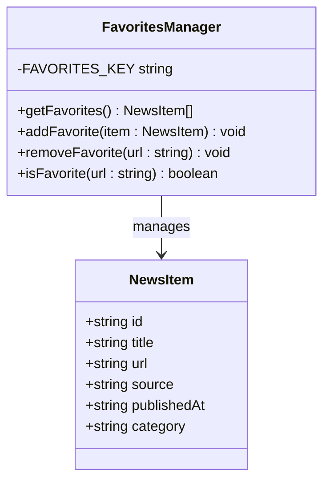
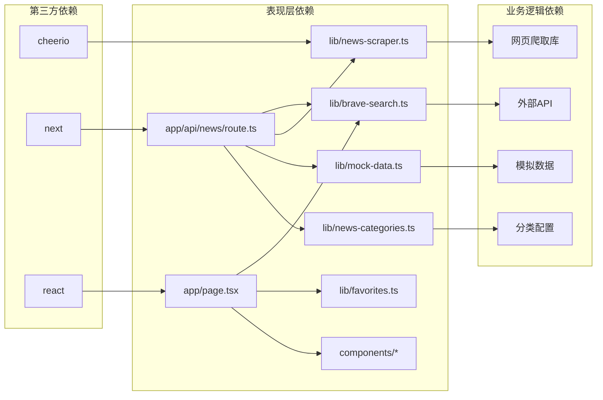

# 分层架构设计

<cite>
**本文档引用的文件**
- [app/page.tsx](file://app/page.tsx)
- [app/api/news/route.ts](file://app/api/news/route.ts)
- [lib/brave-search.ts](file://lib/brave-search.ts)
- [lib/news-scraper.ts](file://lib/news-scraper.ts)
- [lib/favorites.ts](file://lib/favorites.ts)
- [lib/mock-data.ts](file://lib/mock-data.ts)
- [lib/news-categories.ts](file://lib/news-categories.ts)
- [components/NewsCard.tsx](file://components/NewsCard.tsx)
- [components/CategoryTabs.tsx](file://components/CategoryTabs.tsx)
- [components/SearchBar.tsx](file://components/SearchBar.tsx)
- [components/NewsSummary.tsx](file://components/NewsSummary.tsx)
- [app/layout.tsx](file://app/layout.tsx)
- [package.json](file://package.json)
</cite>

## 目录
1. [引言](#引言)
2. [项目结构](#项目结构)
3. [核心组件](#核心组件)
4. [架构概览](#架构概览)
5. [详细组件分析](#详细组件分析)
6. [依赖关系分析](#依赖关系分析)
7. [性能考虑](#性能考虑)
8. [故障排除指南](#故障排除指南)
9. [结论](#结论)

## 引言

本项目是一个基于Next.js的新闻聚合网站，采用经典的三层架构设计模式。该架构清晰地分离了关注点，实现了表现层、业务逻辑层和数据访问层的职责划分，为用户提供了一个现代化的新闻浏览体验。

## 项目结构

项目采用基于功能的组织方式，按照三层架构进行文件组织：

**图表来源**
- [app/page.tsx](file://app/page.tsx#L1-L153)
- [app/api/news/route.ts](file://app/api/news/route.ts#L1-L136)
- [lib/brave-search.ts](file://lib/brave-search.ts#L1-L115)

**章节来源**
- [app/page.tsx](file://app/page.tsx#L1-L153)
- [app/layout.tsx](file://app/layout.tsx#L1-L20)
- [package.json](file://package.json#L1-L30)

## 核心组件

### 表现层组件

表现层主要由React组件构成，负责用户界面渲染和用户交互处理：

- **Home页面组件** (`app/page.tsx`): 应用的主要入口，管理新闻数据状态、分类切换、搜索功能和收藏管理
- **新闻卡片组件** (`components/NewsCard.tsx`): 展示单条新闻信息，支持收藏功能
- **分类标签组件** (`components/CategoryTabs.tsx`): 提供新闻分类导航
- **搜索栏组件** (`components/SearchBar.tsx`): 实现关键词搜索功能
- **新闻摘要组件** (`components/NewsSummary.tsx`): 显示今日新闻摘要

### 业务逻辑层组件

业务逻辑层封装核心业务规则和数据处理逻辑：

- **Brave搜索模块** (`lib/brave-search.ts`): 处理Brave Search API的新闻搜索和数据转换
- **新闻爬虫模块** (`lib/news-scraper.ts`): 实现Hacker News等新闻源的网页爬取和数据解析
- **收藏管理模块** (`lib/favorites.ts`): 管理用户的收藏新闻数据
- **模拟数据模块** (`lib/mock-data.ts`): 提供开发和测试用的模拟新闻数据
- **新闻分类模块** (`lib/news-categories.ts`): 定义新闻分类体系和关键词映射

**章节来源**
- [components/NewsCard.tsx](file://components/NewsCard.tsx#L1-L89)
- [components/CategoryTabs.tsx](file://components/CategoryTabs.tsx#L1-L49)
- [components/SearchBar.tsx](file://components/SearchBar.tsx#L1-L37)
- [components/NewsSummary.tsx](file://components/NewsSummary.tsx#L1-L54)

## 架构概览

系统采用分层架构设计，各层之间通过明确定义的接口进行通信：

**图表来源**
- [app/page.tsx](file://app/page.tsx#L19-L38)
- [app/api/news/route.ts](file://app/api/news/route.ts#L39-L135)
- [lib/brave-search.ts](file://lib/brave-search.ts#L30-L73)
- [lib/news-scraper.ts](file://lib/news-scraper.ts#L140-L153)

### 数据流分析

系统的核心数据流遵循以下模式：

1. **用户请求流程**: 用户操作触发UI组件更新 → API路由接收请求 → 业务逻辑处理 → 数据访问层获取数据 → 返回响应
2. **异步数据获取**: 使用Promise.all并行获取多个数据源，提高响应速度
3. **数据合并策略**: 统一处理来自不同数据源的新闻数据，确保去重和格式一致性

**章节来源**
- [app/api/news/route.ts](file://app/api/news/route.ts#L44-L96)
- [lib/brave-search.ts](file://lib/brave-search.ts#L30-L73)

## 详细组件分析

### 表现层分析

#### Home页面组件

Home页面是表现层的核心组件，实现了完整的新闻展示功能：

**图表来源**
- [app/page.tsx](file://app/page.tsx#L19-L38)
- [app/api/news/route.ts](file://app/api/news/route.ts#L39-L135)

**组件职责**:
- 管理新闻数据状态和加载状态
- 处理用户交互事件（分类切换、搜索、收藏）
- 协调组件间的通信
- 实现错误处理和用户体验优化

**章节来源**
- [app/page.tsx](file://app/page.tsx#L11-L153)

#### API路由组件

API路由组件负责处理客户端请求并协调各个业务逻辑模块：

**图表来源**
- [app/api/news/route.ts](file://app/api/news/route.ts#L39-L135)

**错误处理机制**:
- API密钥验证和降级策略
- 并行任务的错误隔离
- 回退到模拟数据的容错机制

**章节来源**
- [app/api/news/route.ts](file://app/api/news/route.ts#L1-L136)

### 业务逻辑层分析

#### Brave搜索模块

Brave搜索模块实现了对外部新闻API的封装：

**图表来源**
- [lib/brave-search.ts](file://lib/brave-search.ts#L1-L115)
- [lib/news-categories.ts](file://lib/news-categories.ts#L1-L45)

**核心特性**:
- 支持新闻搜索和网页搜索双重模式
- 自动API密钥验证和错误处理
- 统一的数据格式转换
- 友好的降级策略（当新闻API不可用时自动切换到网页搜索）

**章节来源**
- [lib/brave-search.ts](file://lib/brave-search.ts#L30-L115)

#### 新闻爬虫模块

新闻爬虫模块实现了网页数据抓取和解析功能：

**图表来源**
- [lib/news-scraper.ts](file://lib/news-scraper.ts#L116-L153)

**设计特点**:
- 基于分类的新闻源配置
- 灵活的选择器和解析器模式
- 错误处理和数据验证
- 并发爬取优化

**章节来源**
- [lib/news-scraper.ts](file://lib/news-scraper.ts#L1-L166)

#### 收藏管理模块

收藏管理模块提供了本地化的数据持久化功能：

**图表来源**
- [lib/favorites.ts](file://lib/favorites.ts#L1-L29)

**功能特性**:
- 基于localStorage的本地存储
- 去重机制防止重复收藏
- 简洁的API接口设计
- 客户端侧数据管理

**章节来源**
- [lib/favorites.ts](file://lib/favorites.ts#L1-L29)

### 数据访问层分析

#### 外部API集成

数据访问层主要负责与外部服务的交互：

1. **Brave Search API**: 提供高质量的新闻搜索服务
2. **Hacker News爬取**: 免费获取技术类新闻内容
3. **本地存储**: 提供用户个性化数据持久化

#### 模拟数据层

模拟数据层为开发和测试提供稳定的数据源：

- 完整的新闻分类覆盖
- 丰富的新闻内容示例
- 一致的数据格式结构
- 支持多种场景的测试数据

**章节来源**
- [lib/mock-data.ts](file://lib/mock-data.ts#L1-L197)

## 依赖关系分析

系统采用松耦合的设计原则，各层之间的依赖关系清晰明确：

**图表来源**
- [app/page.tsx](file://app/page.tsx#L3-L9)
- [app/api/news/route.ts](file://app/api/news/route.ts#L1-L6)
- [package.json](file://package.json#L15-L28)

### 依赖注入和接口设计

系统通过模块化设计实现了良好的依赖管理：

- **接口统一**: 所有数据源都返回标准化的`NewsItem`格式
- **错误隔离**: 各个数据源的错误不会相互影响
- **可替换性**: 可以轻松替换或添加新的数据源
- **测试友好**: 模拟数据便于单元测试和集成测试

**章节来源**
- [lib/brave-search.ts](file://lib/brave-search.ts#L1-L115)
- [lib/news-scraper.ts](file://lib/news-scraper.ts#L1-L166)

## 性能考虑

### 并行数据获取

系统采用了多项性能优化策略：

1. **并发请求**: 使用`Promise.all()`并行获取多个数据源
2. **缓存策略**: 利用浏览器缓存和服务器端缓存减少重复请求
3. **懒加载**: 组件按需加载，减少初始包大小
4. **虚拟滚动**: 大量新闻数据的高效渲染

### 错误处理和降级

系统实现了多层次的错误处理机制：

- **API密钥验证**: 自动检测和处理API配置问题
- **回退机制**: 当主数据源不可用时自动切换到备用方案
- **容错设计**: 单个数据源的失败不影响整体功能
- **用户反馈**: 提供清晰的错误信息和恢复建议

## 故障排除指南

### 常见问题及解决方案

#### API密钥配置问题

**问题症状**: 页面显示"获取新闻失败，请检查网络连接或API密钥配置"

**解决步骤**:
1. 检查环境变量`BRAVE_API_KEY`是否正确设置
2. 验证API密钥的有效性和配额
3. 确认网络连接正常
4. 查看浏览器开发者工具中的网络请求

#### 数据加载缓慢

**优化建议**:
1. 检查网络连接质量
2. 减少同时请求的数据量
3. 考虑启用缓存机制
4. 优化前端渲染性能

#### 收藏功能异常

**排查步骤**:
1. 检查浏览器是否支持localStorage
2. 验证数据格式的正确性
3. 查看控制台是否有JavaScript错误
4. 确认用户已授权本地存储权限

**章节来源**
- [app/page.tsx](file://app/page.tsx#L30-L32)
- [lib/favorites.ts](file://lib/favorites.ts#L1-L29)

## 结论

本项目成功实现了基于三层架构的新闻聚合系统，展现了清晰的职责分离和良好的软件工程实践。通过表现层、业务逻辑层和数据访问层的合理分工，系统实现了：

1. **清晰的架构层次**: 每一层都有明确的职责和边界
2. **良好的可维护性**: 模块化设计便于代码维护和扩展
3. **强大的容错能力**: 多层次的错误处理和降级策略
4. **优秀的用户体验**: 响应式设计和流畅的交互体验

该架构设计为类似的信息聚合类应用提供了良好的参考模板，既保证了系统的稳定性，又为未来的功能扩展奠定了坚实的基础。