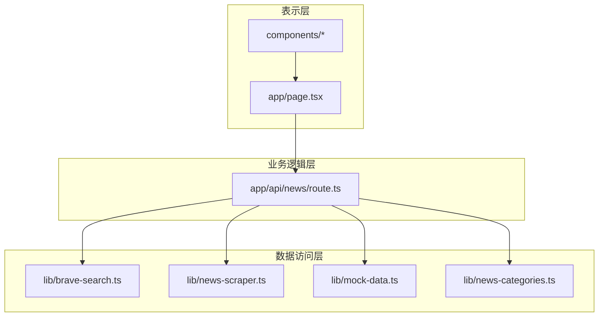
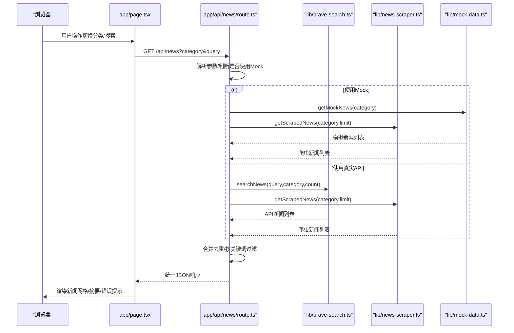
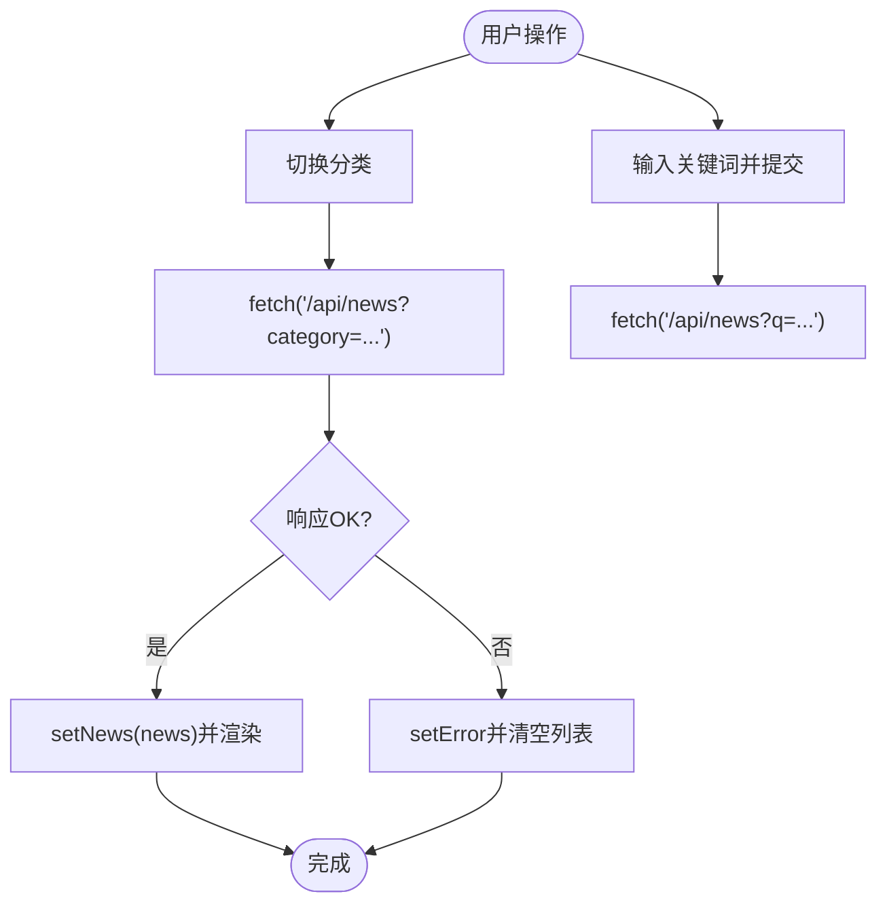
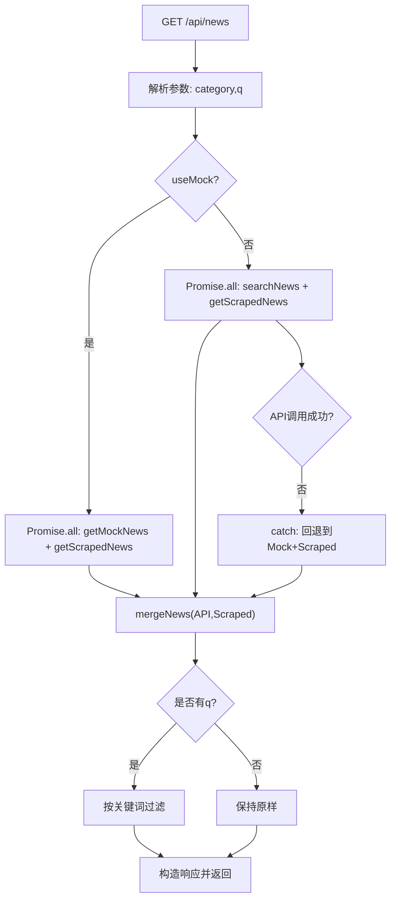
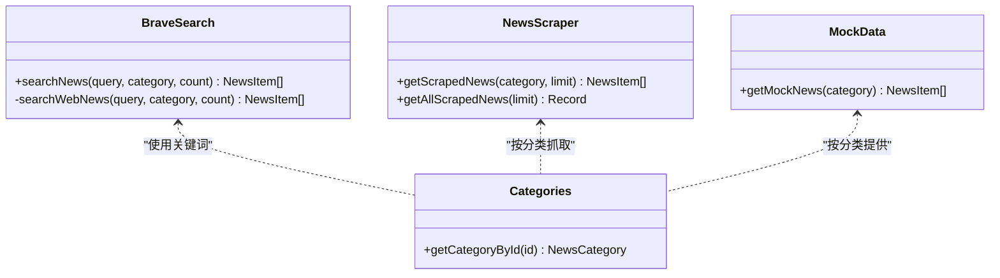
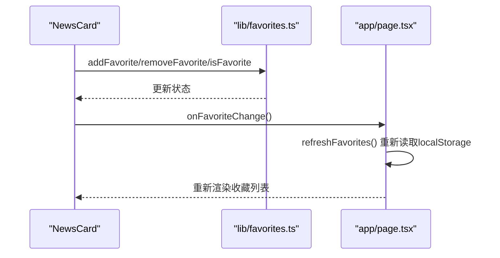
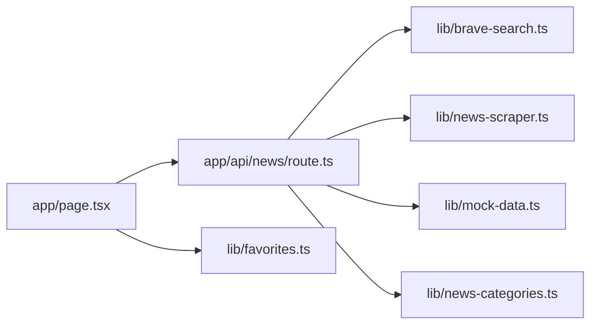

# 层间交互机制

<cite>
**本文引用的文件**
- [app/api/news/route.ts](file://app/api/news/route.ts)
- [lib/brave-search.ts](file://lib/brave-search.ts)
- [lib/news-scraper.ts](file://lib/news-scraper.ts)
- [lib/mock-data.ts](file://lib/mock-data.ts)
- [lib/news-categories.ts](file://lib/news-categories.ts)
- [lib/favorites.ts](file://lib/favorites.ts)
- [app/page.tsx](file://app/page.tsx)
- [components/CategoryTabs.tsx](file://components/CategoryTabs.tsx)
- [components/NewsCard.tsx](file://components/NewsCard.tsx)
- [components/SearchBar.tsx](file://components/SearchBar.tsx)
- [components/NewsSummary.tsx](file://components/NewsSummary.tsx)
- [package.json](file://package.json)
- [README.md](file://README.md)
</cite>

## 目录
1. [引言](#引言)
2. [项目结构](#项目结构)
3. [核心组件](#核心组件)
4. [架构总览](#架构总览)
5. [详细组件分析](#详细组件分析)
6. [依赖分析](#依赖分析)
7. [性能考量](#性能考量)
8. [故障排查指南](#故障排查指南)
9. [结论](#结论)
10. [附录](#附录)

## 引言
本文件系统化梳理该新闻网站的三层架构（表示层、业务逻辑层、数据访问层）之间的交互机制，重点阐释：
- 表示层如何通过 Next.js App Router 的 API 路由访问业务逻辑层；
- 业务逻辑层如何协调数据访问层（外部 API 与本地爬虫）获取数据；
- 数据在各层间的传递方式、状态管理与错误传播；
- 异步数据流的处理模式（Promise 并发、回退策略）、错误处理策略；
- 层间依赖注入与接口设计原则；
- 提供完整的调用链路图与具体代码示例路径，帮助读者快速定位实现细节。

## 项目结构
该项目采用 Next.js App Router 结构，前端页面位于 app/，API 路由位于 app/api/，工具库位于 lib/，UI 组件位于 components/。整体呈现清晰的分层组织：
- 表示层：app/page.tsx 及其子组件（CategoryTabs、SearchBar、NewsCard、NewsSummary）
- 业务逻辑层：app/api/news/route.ts（封装查询参数解析、并发请求、合并与回退逻辑）
- 数据访问层：lib/brave-search.ts（Brave Search API）、lib/news-scraper.ts（本地爬虫）、lib/mock-data.ts（模拟数据）

图表来源
- [app/page.tsx](file://app/page.tsx#L1-L153)
- [app/api/news/route.ts](file://app/api/news/route.ts#L1-L136)
- [lib/brave-search.ts](file://lib/brave-search.ts#L1-L115)
- [lib/news-scraper.ts](file://lib/news-scraper.ts#L1-L166)
- [lib/mock-data.ts](file://lib/mock-data.ts#L1-L197)
- [lib/news-categories.ts](file://lib/news-categories.ts#L1-L45)

章节来源
- [README.md](file://README.md#L36-L49)
- [package.json](file://package.json#L1-L30)

## 核心组件
- 表示层组件
  - 页面组件：负责状态管理、发起请求、渲染新闻卡片与摘要、处理用户交互（分类切换、搜索、收藏）。
  - 子组件：分类标签、搜索栏、新闻卡片、摘要展示。
- 业务逻辑层
  - API 路由：解析查询参数、并发拉取外部 API 与本地爬虫数据、合并去重、按需过滤、错误回退、返回统一响应。
- 数据访问层
  - 外部 API：Brave Search 新闻搜索与网页搜索回退。
  - 本地爬虫：基于 Cheerio 解析 Hacker News 的分类新闻。
  - 模拟数据：用于无 API 密钥时的回退数据。
  - 分类配置：提供分类 ID 到关键词的映射。

章节来源
- [app/page.tsx](file://app/page.tsx#L1-L153)
- [components/CategoryTabs.tsx](file://components/CategoryTabs.tsx#L1-L49)
- [components/SearchBar.tsx](file://components/SearchBar.tsx#L1-L37)
- [components/NewsCard.tsx](file://components/NewsCard.tsx#L1-L89)
- [components/NewsSummary.tsx](file://components/NewsSummary.tsx#L1-L54)
- [app/api/news/route.ts](file://app/api/news/route.ts#L1-L136)
- [lib/brave-search.ts](file://lib/brave-search.ts#L1-L115)
- [lib/news-scraper.ts](file://lib/news-scraper.ts#L1-L166)
- [lib/mock-data.ts](file://lib/mock-data.ts#L1-L197)
- [lib/news-categories.ts](file://lib/news-categories.ts#L1-L45)

## 架构总览
本项目采用“表示层-业务逻辑层-数据访问层”的三层架构，结合异步并发与回退策略，确保在多种环境下稳定提供新闻数据。

图表来源
- [app/page.tsx](file://app/page.tsx#L19-L38)
- [app/api/news/route.ts](file://app/api/news/route.ts#L39-L135)
- [lib/brave-search.ts](file://lib/brave-search.ts#L30-L73)
- [lib/news-scraper.ts](file://lib/news-scraper.ts#L140-L153)
- [lib/mock-data.ts](file://lib/mock-data.ts#L194-L196)

## 详细组件分析

### 表示层：页面与组件
- 页面组件职责
  - 状态管理：新闻列表、加载状态、当前分类、搜索关键词、收藏状态、错误信息。
  - 请求发起：通过 fetch 调用 /api/news，根据分类与关键词拼接查询参数。
  - 错误处理：捕获网络异常与非 OK 响应，设置错误提示并清空新闻列表。
  - 渲染控制：根据 loading、favorites、error 控制骨架屏、网格或占位文案。
- 子组件职责
  - 分类标签：触发分类选择回调，更新页面状态。
  - 搜索栏：提交表单，触发搜索回调。
  - 新闻卡片：收藏/取消收藏，触发收藏变更回调以刷新收藏视图。
  - 摘要组件：在加载态显示骨架屏，在有数据时展示前五条摘要。

图表来源
- [app/page.tsx](file://app/page.tsx#L19-L38)
- [components/CategoryTabs.tsx](file://components/CategoryTabs.tsx#L12-L48)
- [components/SearchBar.tsx](file://components/SearchBar.tsx#L9-L37)
- [components/NewsCard.tsx](file://components/NewsCard.tsx#L12-L27)
- [components/NewsSummary.tsx](file://components/NewsSummary.tsx#L10-L53)

章节来源
- [app/page.tsx](file://app/page.tsx#L1-L153)
- [components/CategoryTabs.tsx](file://components/CategoryTabs.tsx#L1-L49)
- [components/SearchBar.tsx](file://components/SearchBar.tsx#L1-L37)
- [components/NewsCard.tsx](file://components/NewsCard.tsx#L1-L89)
- [components/NewsSummary.tsx](file://components/NewsSummary.tsx#L1-L54)

### 业务逻辑层：API 路由
- 参数解析与环境判断
  - 从 URL 查询参数提取 category 与 q；根据 BRAVE_API_KEY 是否有效决定是否使用 Mock 数据。
- 并发与回退策略
  - 同时启动本地爬虫任务，避免串行等待。
  - 使用 Promise.all 并发获取 API 与爬虫数据；若 API 失败则回退到 Mock + 爬虫组合。
- 数据合并与去重
  - 以标题小写去空白为键，优先保留 API 来源，再追加爬虫来源，避免重复。
- 过滤与响应
  - 若存在 q，则对合并后的结果按标题或描述包含关键词进行过滤。
  - 返回统一结构：包含 news、category、query、timestamp、sources 等字段，便于前端渲染。

图表来源
- [app/api/news/route.ts](file://app/api/news/route.ts#L39-L135)
- [lib/brave-search.ts](file://lib/brave-search.ts#L30-L73)
- [lib/news-scraper.ts](file://lib/news-scraper.ts#L140-L153)
- [lib/mock-data.ts](file://lib/mock-data.ts#L194-L196)

章节来源
- [app/api/news/route.ts](file://app/api/news/route.ts#L1-L136)

### 数据访问层：外部 API 与本地爬虫
- 外部 API（Brave Search）
  - searchNews：调用 Brave 新闻搜索接口，必要时回退到网页搜索接口；将结果映射为统一的 NewsItem 结构。
  - 错误处理：当新闻搜索失败时回退到网页搜索；若网页搜索也失败则抛出错误。
- 本地爬虫（Hacker News）
  - getScrapedNews：按分类抓取标题与链接，解析为 NewsItem；异常时记录日志并返回空数组。
  - getAllScrapedNews：批量抓取多分类数据，便于后续聚合。
- 模拟数据
  - getMockNews：按分类返回预置的 mock 数据，用于无 API 密钥时的回退。
- 分类配置
  - 提供分类 ID 到关键词集合的映射，用于在无 q 时生成查询词组。

图表来源
- [lib/brave-search.ts](file://lib/brave-search.ts#L30-L114)
- [lib/news-scraper.ts](file://lib/news-scraper.ts#L140-L165)
- [lib/mock-data.ts](file://lib/mock-data.ts#L194-L196)
- [lib/news-categories.ts](file://lib/news-categories.ts#L42-L44)

章节来源
- [lib/brave-search.ts](file://lib/brave-search.ts#L1-L115)
- [lib/news-scraper.ts](file://lib/news-scraper.ts#L1-L166)
- [lib/mock-data.ts](file://lib/mock-data.ts#L1-L197)
- [lib/news-categories.ts](file://lib/news-categories.ts#L1-L45)

### 收藏功能与状态管理
- 客户端存储：通过 localStorage 实现收藏持久化，避免刷新丢失。
- 交互流程：点击收藏按钮切换状态，更新本地存储并触发父组件刷新收藏视图。
- 与表示层联动：首页支持“我的收藏”视图，直接从本地读取并渲染。

图表来源
- [components/NewsCard.tsx](file://components/NewsCard.tsx#L12-L27)
- [lib/favorites.ts](file://lib/favorites.ts#L1-L29)
- [app/page.tsx](file://app/page.tsx#L54-L63)

章节来源
- [lib/favorites.ts](file://lib/favorites.ts#L1-L29)
- [components/NewsCard.tsx](file://components/NewsCard.tsx#L1-L89)
- [app/page.tsx](file://app/page.tsx#L1-L153)

## 依赖分析
- 模块耦合与内聚
  - API 路由集中处理参数、并发、合并与回退，内聚度高，对外暴露单一入口。
  - 数据访问层通过明确的函数接口（searchNews、getScrapedNews、getMockNews）解耦外部依赖。
- 直接与间接依赖
  - 表示层仅依赖 API 路由与本地存储，不直接依赖外部服务。
  - API 路由依赖数据访问层与分类配置，形成清晰的依赖方向。
- 外部依赖与集成点
  - Brave Search API 作为主要数据源，失败时回退到网页搜索与本地爬虫。
  - Cheerio 用于本地爬虫解析，异常时记录日志并优雅降级。
- 循环依赖
  - 未发现循环依赖迹象，模块间依赖方向单一。

图表来源
- [app/page.tsx](file://app/page.tsx#L1-L153)
- [app/api/news/route.ts](file://app/api/news/route.ts#L1-L136)
- [lib/brave-search.ts](file://lib/brave-search.ts#L1-L115)
- [lib/news-scraper.ts](file://lib/news-scraper.ts#L1-L166)
- [lib/mock-data.ts](file://lib/mock-data.ts#L1-L197)
- [lib/news-categories.ts](file://lib/news-categories.ts#L1-L45)
- [lib/favorites.ts](file://lib/favorites.ts#L1-L29)

章节来源
- [app/api/news/route.ts](file://app/api/news/route.ts#L1-L136)
- [lib/brave-search.ts](file://lib/brave-search.ts#L1-L115)
- [lib/news-scraper.ts](file://lib/news-scraper.ts#L1-L166)
- [lib/mock-data.ts](file://lib/mock-data.ts#L1-L197)
- [lib/news-categories.ts](file://lib/news-categories.ts#L1-L45)
- [lib/favorites.ts](file://lib/favorites.ts#L1-L29)
- [app/page.tsx](file://app/page.tsx#L1-L153)

## 性能考量
- 并发优化
  - 使用 Promise.all 并发拉取 API 与爬虫数据，减少总等待时间。
  - 爬虫任务在 API 调用前即启动，充分利用空闲时间。
- 去重与过滤
  - 合并时以标题标准化为键去重，避免重复渲染与带宽浪费。
  - 按关键词过滤在合并后执行，减少不必要的前端渲染。
- 回退策略
  - API 失败时立即回退到 Mock + 爬虫，保证用户体验连续性。
- 资源与缓存
  - 本地收藏使用 localStorage，避免重复网络请求。
  - 加载态骨架屏提升感知性能。

## 故障排查指南
- API 密钥未配置或无效
  - 现象：返回 Mock 数据且标记 mock: true。
  - 排查：确认 .env.local 中 BRAVE_API_KEY 已正确填写。
- Brave Search API 调用失败
  - 现象：catch 分支触发，回退到 Mock + 爬虫。
  - 排查：检查网络连通性、API 配额、响应状态码。
- 爬虫解析异常
  - 现象：控制台输出错误日志，但不影响整体返回。
  - 排查：检查目标站点结构变化、User-Agent 设置、网络超时。
- 前端请求失败
  - 现象：页面显示错误提示并清空新闻列表。
  - 排查：检查 /api/news 路由可用性、Next.js 构建产物、浏览器网络面板。

章节来源
- [app/api/news/route.ts](file://app/api/news/route.ts#L7-L11)
- [app/api/news/route.ts](file://app/api/news/route.ts#L112-L134)
- [lib/brave-search.ts](file://lib/brave-search.ts#L55-L58)
- [lib/news-scraper.ts](file://lib/news-scraper.ts#L132-L135)
- [app/page.tsx](file://app/page.tsx#L26-L32)

## 结论
本项目通过清晰的三层架构实现了稳定的新闻数据获取与展示：
- 表示层专注于用户体验与状态管理；
- 业务逻辑层统一处理参数、并发、合并与回退；
- 数据访问层抽象外部 API 与本地爬虫，提供一致的数据接口。
配合 Promise 并发与完善的错误回退策略，系统在多种环境下均能提供可靠的服务。建议未来可进一步引入缓存层与更细粒度的错误分类，以提升稳定性与可观测性。

## 附录
- 代码示例路径（不含具体代码内容）
  - API 路由入口与参数解析：[app/api/news/route.ts](file://app/api/news/route.ts#L39-L42)
  - 并发获取与回退策略：[app/api/news/route.ts](file://app/api/news/route.ts#L44-L96)
  - 合并与去重逻辑：[app/api/news/route.ts](file://app/api/news/route.ts#L14-L37)
  - Brave Search 调用与回退：[lib/brave-search.ts](file://lib/brave-search.ts#L30-L73)
  - 本地爬虫抓取与异常处理：[lib/news-scraper.ts](file://lib/news-scraper.ts#L140-L153)
  - 模拟数据提供：[lib/mock-data.ts](file://lib/mock-data.ts#L194-L196)
  - 分类关键词映射：[lib/news-categories.ts](file://lib/news-categories.ts#L42-L44)
  - 页面请求与错误处理：[app/page.tsx](file://app/page.tsx#L19-L38)
  - 收藏功能与本地存储：[lib/favorites.ts](file://lib/favorites.ts#L1-L29)