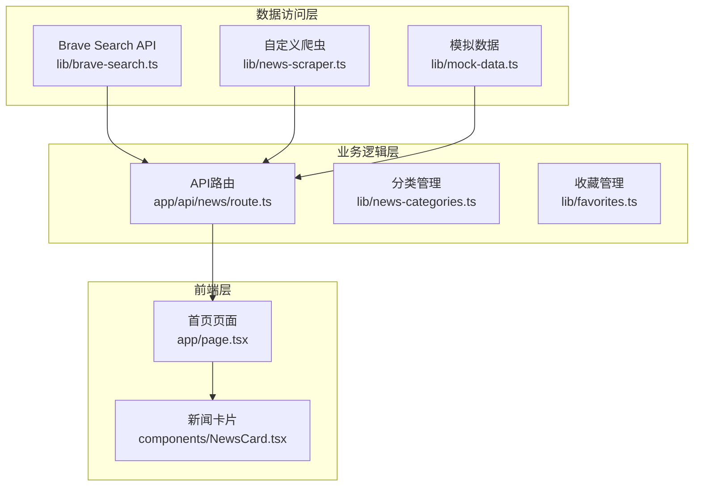
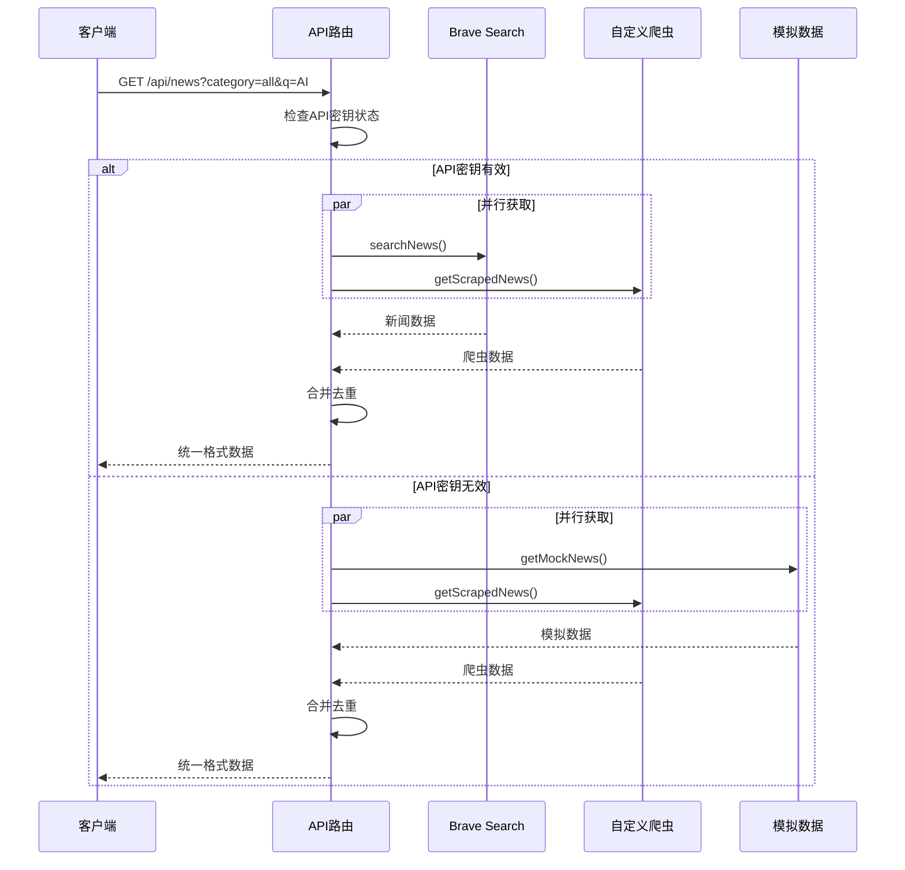
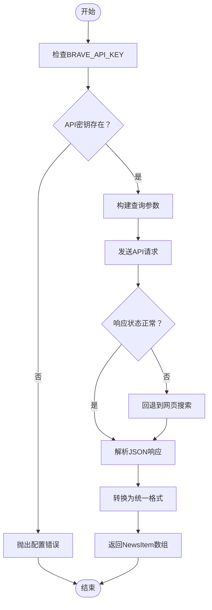
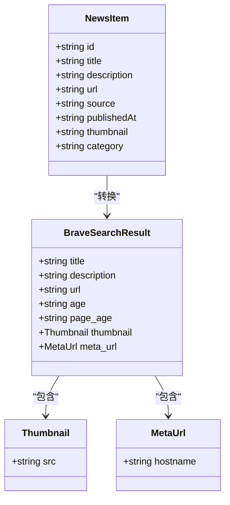
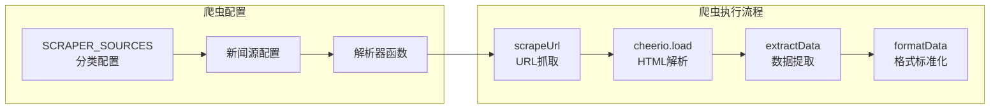
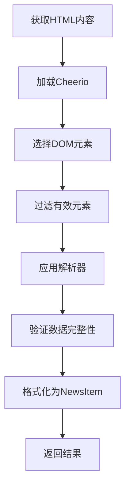
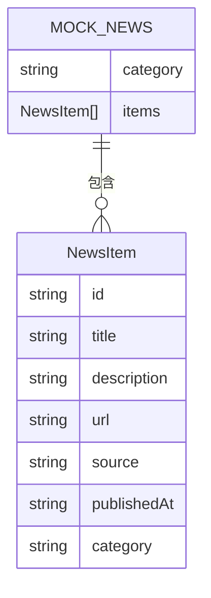
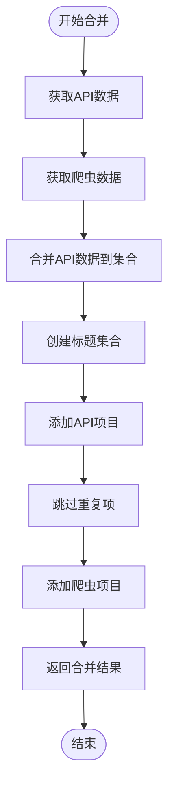
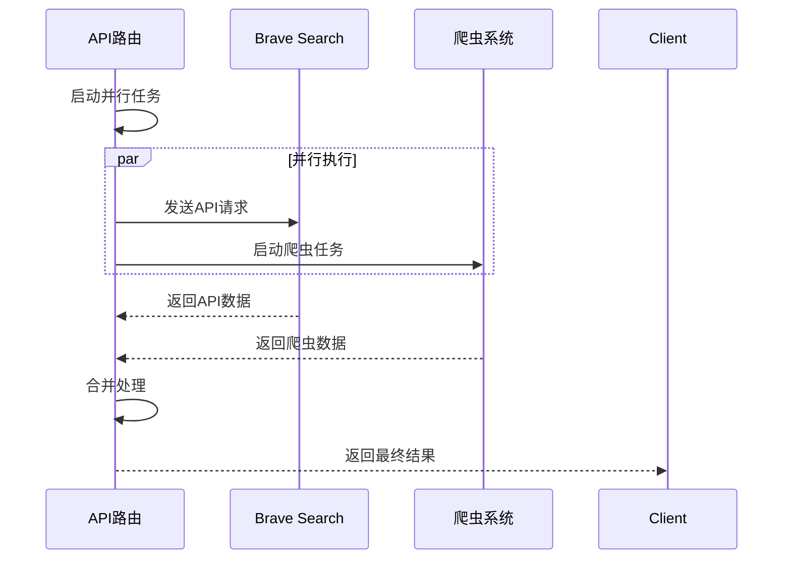

# 数据访问层设计

<cite>
**本文档引用的文件**
- [lib/brave-search.ts](file://lib/brave-search.ts)
- [lib/news-scraper.ts](file://lib/news-scraper.ts)
- [lib/mock-data.ts](file://lib/mock-data.ts)
- [app/api/news/route.ts](file://app/api/news/route.ts)
- [lib/news-categories.ts](file://lib/news-categories.ts)
- [lib/favorites.ts](file://lib/favorites.ts)
- [components/NewsCard.tsx](file://components/NewsCard.tsx)
- [app/page.tsx](file://app/page.tsx)
- [package.json](file://package.json)
- [README.md](file://README.md)
</cite>

## 目录
1. [简介](#简介)
2. [项目结构](#项目结构)
3. [核心组件](#核心组件)
4. [架构概览](#架构概览)
5. [详细组件分析](#详细组件分析)
6. [依赖关系分析](#依赖关系分析)
7. [性能考虑](#性能考虑)
8. [故障排除指南](#故障排除指南)
9. [结论](#结论)

## 简介

本项目是一个基于Next.js的AI新闻网站，采用混合数据访问策略，结合外部API集成和自定义爬虫系统，为用户提供多源新闻聚合服务。数据访问层设计的核心目标是提供可靠、高效且容错的数据获取机制，支持多种数据源的统一管理和错误恢复。

## 项目结构

项目采用模块化架构，数据访问层主要集中在`lib/`目录中，包含三个核心模块：



**图表来源**
- [lib/brave-search.ts](file://lib/brave-search.ts#L1-L115)
- [lib/news-scraper.ts](file://lib/news-scraper.ts#L1-L166)
- [lib/mock-data.ts](file://lib/mock-data.ts#L1-L197)
- [app/api/news/route.ts](file://app/api/news/route.ts#L1-L136)

**章节来源**
- [package.json](file://package.json#L1-L30)
- [README.md](file://README.md#L1-L49)

## 核心组件

### 外部API集成模块

**章节来源**
- [lib/brave-search.ts](file://lib/brave-search.ts#L1-L115)

### 自定义爬虫系统

**章节来源**
- [lib/news-scraper.ts](file://lib/news-scraper.ts#L1-L166)

### 开发环境模拟数据

**章节来源**
- [lib/mock-data.ts](file://lib/mock-data.ts#L1-L197)

## 架构概览

数据访问层采用"主从备份"策略，通过API路由统一协调多个数据源：



**图表来源**
- [app/api/news/route.ts](file://app/api/news/route.ts#L39-L135)

## 详细组件分析

### Brave Search API集成

Brave Search API集成模块提供了专业的新闻搜索能力，支持精确的关键词查询和分类筛选。

#### API认证机制



**图表来源**
- [lib/brave-search.ts](file://lib/brave-search.ts#L30-L73)

#### 请求参数处理

API请求参数采用URLSearchParams构建，确保参数编码正确：

| 参数名 | 值 | 说明 |
|--------|-----|------|
| q | 查询字符串 | 用户输入的搜索关键词 |
| count | 20 | 返回结果数量限制 |
| freshness | pd | 时间范围：过去一天 |
| text_decorations | false | 不包含文本装饰 |
| search_lang | en | 搜索语言 |

#### 响应数据转换



**图表来源**
- [lib/brave-search.ts](file://lib/brave-search.ts#L1-L25)

**章节来源**
- [lib/brave-search.ts](file://lib/brave-search.ts#L27-L73)

### 自定义爬虫系统

自定义爬虫系统专门针对Hacker News实现了高效的新闻抓取机制。

#### 爬虫架构设计



**图表来源**
- [lib/news-scraper.ts](file://lib/news-scraper.ts#L5-L91)

#### HTML解析与数据提取

爬虫系统使用Cheerio库进行高效的HTML解析：



**图表来源**
- [lib/news-scraper.ts](file://lib/news-scraper.ts#L116-L138)

#### 错误处理机制

爬虫系统实现了多层次的错误处理：

**章节来源**
- [lib/news-scraper.ts](file://lib/news-scraper.ts#L94-L113)

### 模拟数据系统

模拟数据系统为开发和测试环境提供稳定的数据源。

#### 数据结构设计



**图表来源**
- [lib/mock-data.ts](file://lib/mock-data.ts#L3-L192)

#### 分类数据组织

系统支持四种分类的数据模拟：

| 分类 | 数据项数量 | 特点 |
|------|------------|------|
| all | 6条 | 综合新闻内容 |
| politics | 4条 | 国际政治新闻 |
| business | 4条 | 财经商业新闻 |
| tech | 4条 | 科技互联网新闻 |

**章节来源**
- [lib/mock-data.ts](file://lib/mock-data.ts#L194-L196)

### API路由协调器

API路由负责协调多个数据源，实现统一的数据获取和错误恢复。

#### 数据合并策略



**图表来源**
- [app/api/news/route.ts](file://app/api/news/route.ts#L14-L37)

#### 错误恢复机制

API路由实现了智能的错误恢复策略：

**章节来源**
- [app/api/news/route.ts](file://app/api/news/route.ts#L112-L134)

## 依赖关系分析

数据访问层的依赖关系呈现清晰的分层结构：

```mermaid
graph TD
subgraph "外部依赖"
Cheerio[cheerio@^1.2.0]
Next[Next.js@^16.1.6]
React[React@^19.2.4]
end
subgraph "内部模块"
Brave[brave-search.ts]
Scraper[news-scraper.ts]
Mock[mock-data.ts]
Route[news/route.ts]
Categories[news-categories.ts]
Favorites[favorites.ts]
end
subgraph "UI组件"
Page[page.tsx]
NewsCard[NewsCard.tsx]
end
Cheerio --> Scraper
Next --> Route
React --> Page
Brave --> Route
Scraper --> Route
Mock --> Route
Categories --> Route
Favorites --> Page
Route --> Page
Page --> NewsCard
```

**图表来源**
- [package.json](file://package.json#L15-L28)
- [lib/brave-search.ts](file://lib/brave-search.ts#L1)
- [lib/news-scraper.ts](file://lib/news-scraper.ts#L1)

**章节来源**
- [package.json](file://package.json#L15-L28)

## 性能考虑

### 并行数据获取

系统采用Promise.all实现并行数据获取，显著提升响应速度：



**图表来源**
- [app/api/news/route.ts](file://app/api/news/route.ts#L93-L96)

### 缓存策略

当前实现采用内存级缓存策略：

1. **浏览器缓存**：由Next.js自动管理
2. **服务器端缓存**：API响应的短期缓存
3. **客户端缓存**：用户收藏数据的本地存储

### 错误处理与重试

系统实现了多层次的错误处理机制：

**章节来源**
- [app/api/news/route.ts](file://app/api/news/route.ts#L48-L74)

## 故障排除指南

### API密钥配置问题

**问题症状**：返回模拟数据而非真实新闻

**解决方案**：
1. 检查`.env.local`文件中的API密钥配置
2. 确认API密钥的有效性和配额
3. 验证网络连接和防火墙设置

**章节来源**
- [app/api/news/route.ts](file://app/api/news/route.ts#L7-L11)

### 爬虫数据获取失败

**问题症状**：部分或全部新闻数据缺失

**排查步骤**：
1. 检查目标网站的可达性
2. 验证Hacker News的HTML结构是否发生变化
3. 查看控制台错误日志

**章节来源**
- [lib/news-scraper.ts](file://lib/news-scraper.ts#L132-L135)

### 数据合并冲突

**问题症状**：新闻重复显示或数据丢失

**解决方法**：
1. 检查标题去重逻辑
2. 验证NewsItem的唯一标识符生成
3. 确认数据类型转换的准确性

**章节来源**
- [app/api/news/route.ts](file://app/api/news/route.ts#L14-L37)

## 结论

本数据访问层设计成功实现了以下目标：

1. **多源数据集成**：统一协调API、爬虫和模拟数据源
2. **容错机制**：完善的错误处理和回退策略
3. **性能优化**：并行数据获取和智能缓存
4. **开发友好**：灵活的配置选项和调试支持

通过合理的架构设计和错误处理机制，系统能够在各种环境下稳定运行，为用户提供可靠的新闻聚合服务。建议后续可以考虑实现更高级的缓存策略和监控机制，以进一步提升系统的可用性和可观测性。