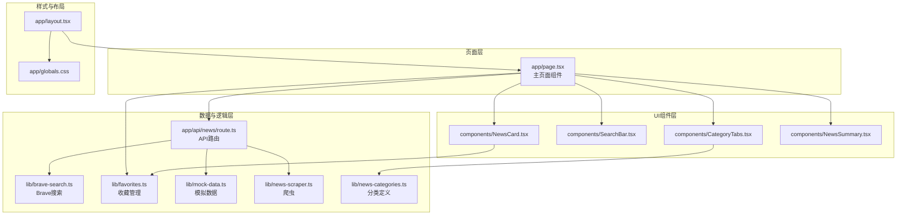
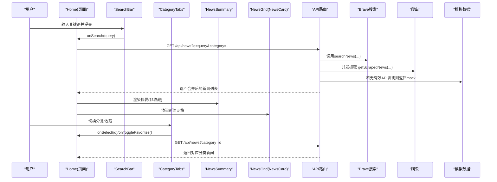
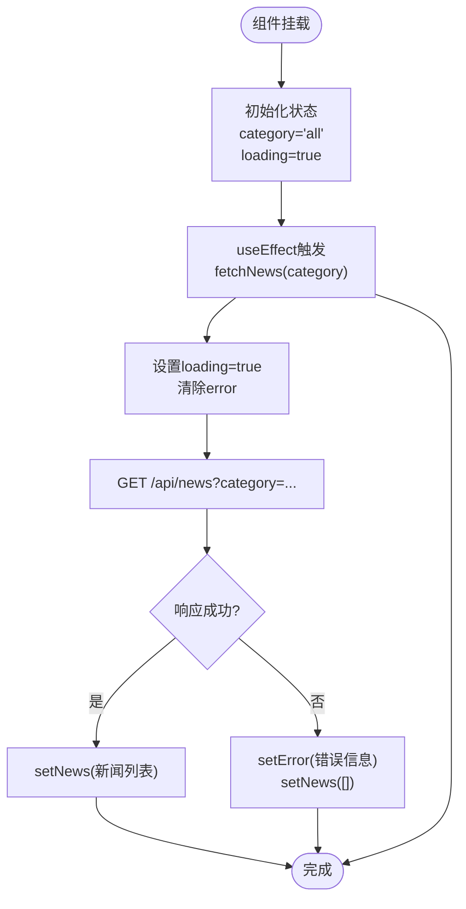
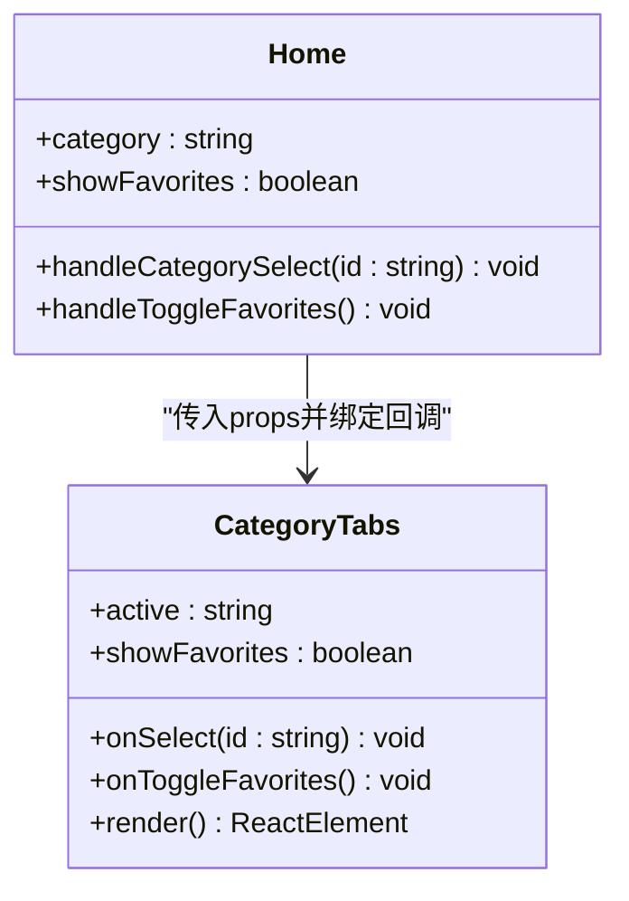
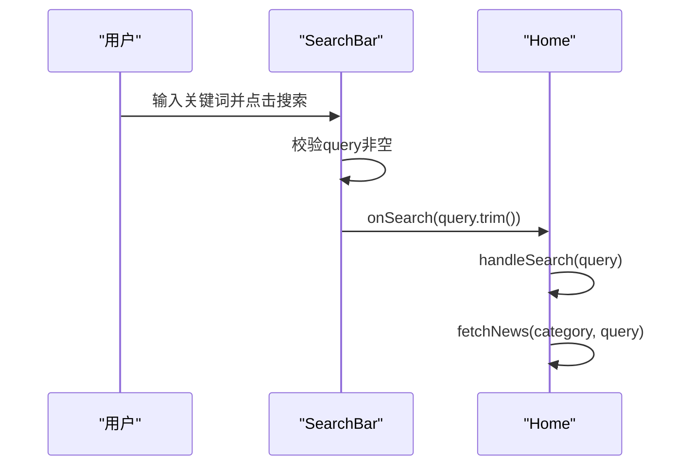
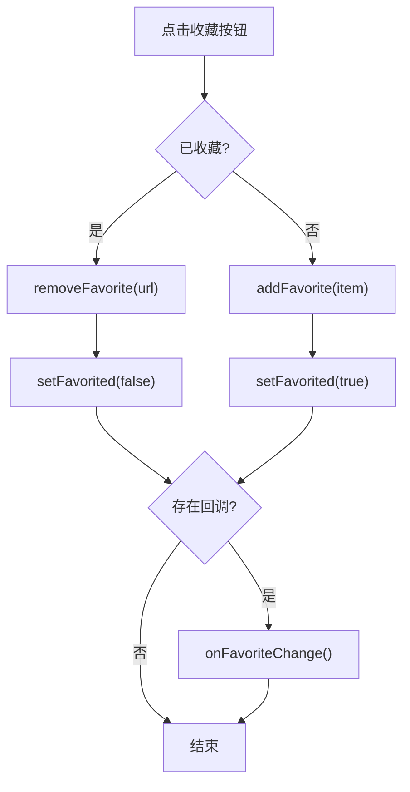
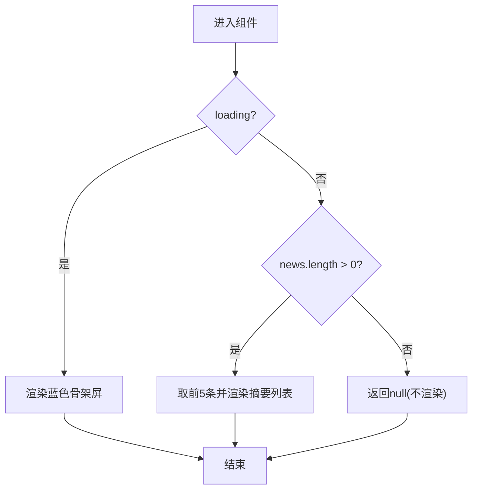
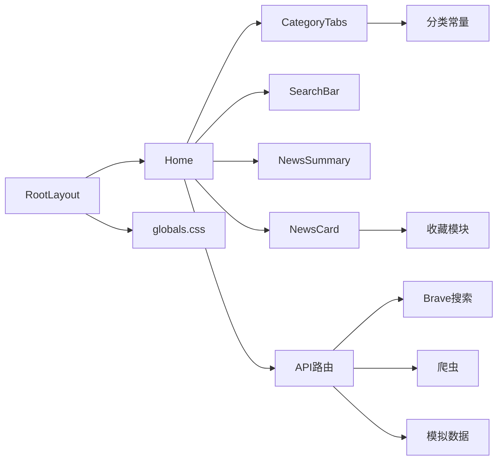

# 表示层设计

<cite>
**本文引用的文件**
- [app/page.tsx](file://app/page.tsx)
- [components/CategoryTabs.tsx](file://components/CategoryTabs.tsx)
- [components/SearchBar.tsx](file://components/SearchBar.tsx)
- [components/NewsCard.tsx](file://components/NewsCard.tsx)
- [components/NewsSummary.tsx](file://components/NewsSummary.tsx)
- [lib/news-categories.ts](file://lib/news-categories.ts)
- [lib/brave-search.ts](file://lib/brave-search.ts)
- [lib/favorites.ts](file://lib/favorites.ts)
- [app/api/news/route.ts](file://app/api/news/route.ts)
- [lib/mock-data.ts](file://lib/mock-data.ts)
- [lib/news-scraper.ts](file://lib/news-scraper.ts)
- [app/layout.tsx](file://app/layout.tsx)
- [app/globals.css](file://app/globals.css)
</cite>

## 目录
1. [引言](#引言)
2. [项目结构](#项目结构)
3. [核心组件](#核心组件)
4. [架构总览](#架构总览)
5. [组件详细分析](#组件详细分析)
6. [依赖关系分析](#依赖关系分析)
7. [性能考量](#性能考量)
8. [故障排查指南](#故障排查指南)
9. [结论](#结论)

## 引言
本设计文档聚焦于Next.js应用的表示层架构，系统阐述app/page.tsx主页面如何作为客户端组件管理状态与用户交互，以及各UI组件（CategoryTabs、SearchBar、NewsCard、NewsSummary）的设计模式与职责分工。文档还解释组件间通信机制、props传递与事件处理方式，总结状态提升与局部状态的最佳实践，并通过可视化图示展示关键流程与数据流。

## 项目结构
该应用采用Next.js App Router目录结构，页面组件位于app目录，UI组件位于components目录，业务逻辑与数据访问位于lib目录，API路由位于app/api路径。整体采用“页面即客户端组件”的模式，配合服务端API路由实现数据聚合与去重。

图表来源
- [app/page.tsx](file://app/page.tsx#L1-L153)
- [components/CategoryTabs.tsx](file://components/CategoryTabs.tsx#L1-L49)
- [components/SearchBar.tsx](file://components/SearchBar.tsx#L1-L37)
- [components/NewsCard.tsx](file://components/NewsCard.tsx#L1-L89)
- [components/NewsSummary.tsx](file://components/NewsSummary.tsx#L1-L54)
- [app/api/news/route.ts](file://app/api/news/route.ts#L1-L136)
- [lib/brave-search.ts](file://lib/brave-search.ts#L1-L115)
- [lib/favorites.ts](file://lib/favorites.ts#L1-L29)
- [lib/mock-data.ts](file://lib/mock-data.ts#L1-L197)
- [lib/news-scraper.ts](file://lib/news-scraper.ts#L1-L166)
- [lib/news-categories.ts](file://lib/news-categories.ts#L1-L45)
- [app/layout.tsx](file://app/layout.tsx#L1-L20)
- [app/globals.css](file://app/globals.css#L1-L22)

章节来源
- [app/page.tsx](file://app/page.tsx#L1-L153)
- [app/layout.tsx](file://app/layout.tsx#L1-L20)
- [app/globals.css](file://app/globals.css#L1-L22)

## 核心组件
- 主页面组件（app/page.tsx）：作为客户端组件，负责管理全局状态（新闻列表、加载状态、分类、收藏、错误信息），协调子组件交互，并调用API路由获取数据。
- 分类标签组件（components/CategoryTabs.tsx）：渲染分类按钮与“我的收藏”切换按钮，接收父组件传入的active状态与回调。
- 搜索栏组件（components/SearchBar.tsx）：本地维护输入框状态，提交表单时触发父组件的搜索回调。
- 新闻卡片组件（components/NewsCard.tsx）：展示单条新闻，内部维护收藏状态，支持收藏/取消收藏，并通过回调通知父组件更新收藏列表。
- 新闻摘要组件（components/NewsSummary.tsx）：在加载态显示骨架屏，在有数据时展示前五条头条摘要。

章节来源
- [app/page.tsx](file://app/page.tsx#L11-L153)
- [components/CategoryTabs.tsx](file://components/CategoryTabs.tsx#L12-L48)
- [components/SearchBar.tsx](file://components/SearchBar.tsx#L9-L36)
- [components/NewsCard.tsx](file://components/NewsCard.tsx#L12-L88)
- [components/NewsSummary.tsx](file://components/NewsSummary.tsx#L10-L53)

## 架构总览
页面组件通过useEffect在分类变更时自动拉取数据；用户通过SearchBar发起搜索，CategoryTabs切换分类或进入收藏视图；NewsSummary在非收藏模式下展示摘要；NewsCard负责单项展示与收藏操作。API路由统一聚合Brave搜索、爬虫与模拟数据，实现去重与合并。

图表来源
- [app/page.tsx](file://app/page.tsx#L19-L63)
- [components/SearchBar.tsx](file://components/SearchBar.tsx#L12-L17)
- [components/CategoryTabs.tsx](file://components/CategoryTabs.tsx#L23-L45)
- [components/NewsSummary.tsx](file://components/NewsSummary.tsx#L10-L53)
- [components/NewsCard.tsx](file://components/NewsCard.tsx#L12-L27)
- [app/api/news/route.ts](file://app/api/news/route.ts#L39-L135)
- [lib/brave-search.ts](file://lib/brave-search.ts#L30-L73)
- [lib/news-scraper.ts](file://lib/news-scraper.ts#L141-L153)
- [lib/mock-data.ts](file://lib/mock-data.ts#L194-L196)

## 组件详细分析

### 页面组件（Home）状态与生命周期
- 状态管理
  - 全局状态：news（新闻列表）、loading（加载态）、category（当前分类）、showFavorites（是否显示收藏）、favorites（收藏列表）、error（错误信息）。
  - 局部状态：fetchNews使用useCallback缓存，避免每次渲染都重新创建；useEffect在category或fetchNews变化时触发数据拉取。
- 生命周期与副作用
  - 初始化：首次渲染后根据当前category调用fetchNews。
  - 更新：分类切换或搜索时，通过handleCategorySelect与handleSearch更新状态并触发数据请求。
  - 收藏切换：handleToggleFavorites控制收藏视图与收藏列表加载；refreshFavorites用于刷新收藏列表。
- 数据流
  - displayNews根据showFavorites选择显示收藏或普通新闻。
  - 错误处理：API失败时设置错误提示并清空新闻列表。
  - 加载态：非收藏模式下显示骨架屏网格，收藏模式下不显示骨架屏。
- 事件处理
  - SearchBar.onSearch -> handleSearch
  - CategoryTabs.onSelect -> handleCategorySelect
  - CategoryTabs.onToggleFavorites -> handleToggleFavorites
  - NewsCard.onFavoriteChange -> refreshFavorites（仅在收藏模式下）

图表来源
- [app/page.tsx](file://app/page.tsx#L19-L63)

章节来源
- [app/page.tsx](file://app/page.tsx#L11-L153)

### 分类标签组件（CategoryTabs）
- 设计模式：展示型组件，接收active状态与回调，不直接管理状态。
- 职责分工：
  - 渲染分类按钮，根据active与showFavorites决定选中态样式。
  - 提供“我的收藏”按钮，点击触发onToggleFavorites。
- props传递：
  - active: 当前激活分类ID
  - onSelect: 切换分类回调
  - showFavorites: 是否处于收藏视图
  - onToggleFavorites: 切换收藏视图回调
- 事件处理：点击分类按钮调用onSelect；点击收藏按钮调用onToggleFavorites。

图表来源
- [components/CategoryTabs.tsx](file://components/CategoryTabs.tsx#L5-L17)
- [app/page.tsx](file://app/page.tsx#L44-L59)

章节来源
- [components/CategoryTabs.tsx](file://components/CategoryTabs.tsx#L12-L48)
- [lib/news-categories.ts](file://lib/news-categories.ts#L1-L45)

### 搜索栏组件（SearchBar）
- 设计模式：本地状态组件，内部维护查询词，提交时通过回调通知父组件。
- 职责分工：
  - 管理输入框本地状态query
  - 处理表单提交，校验非空后调用onSearch
- props传递：
  - onSearch: 接收查询字符串的回调
- 事件处理：onSubmit -> handleSubmit -> onSearch(query.trim())

图表来源
- [components/SearchBar.tsx](file://components/SearchBar.tsx#L12-L17)
- [app/page.tsx](file://app/page.tsx#L49-L52)

章节来源
- [components/SearchBar.tsx](file://components/SearchBar.tsx#L9-L36)
- [app/page.tsx](file://app/page.tsx#L49-L52)

### 新闻卡片组件（NewsCard）
- 设计模式：局部状态组件，内部维护收藏状态，支持收藏/取消收藏。
- 职责分工：
  - 展示新闻标题、描述、来源、发布时间
  - 提供收藏按钮，点击切换收藏状态
  - 通过onFavoriteChange回调通知父组件刷新收藏列表
- props传递：
  - item: 新闻对象
  - onFavoriteChange?: 可选回调
- 事件处理：toggleFavorite -> add/remove favorite -> setFavorited -> onFavoriteChange()

图表来源
- [components/NewsCard.tsx](file://components/NewsCard.tsx#L19-L27)
- [lib/favorites.ts](file://lib/favorites.ts#L13-L28)

章节来源
- [components/NewsCard.tsx](file://components/NewsCard.tsx#L12-L88)
- [lib/favorites.ts](file://lib/favorites.ts#L1-L29)

### 新闻摘要组件（NewsSummary）
- 设计模式：条件渲染组件，根据loading与数据长度决定显示内容。
- 职责分工：
  - loading时显示蓝色主题骨架屏
  - 有数据时展示前5条头条摘要
  - 无数据时不渲染
- props传递：
  - news: 新闻数组
  - loading: 加载状态
- 事件处理：无交互，纯展示

图表来源
- [components/NewsSummary.tsx](file://components/NewsSummary.tsx#L10-L53)

章节来源
- [components/NewsSummary.tsx](file://components/NewsSummary.tsx#L10-L53)

## 依赖关系分析
- 组件耦合
  - Home与子组件通过props与回调解耦，遵循自上而下的数据流。
  - CategoryTabs依赖分类常量定义，保持UI与数据的一致性。
  - NewsCard依赖收藏模块，实现本地持久化。
- 外部依赖
  - API路由聚合Brave搜索、爬虫与模拟数据，实现容错与去重。
  - 布局与样式通过layout与globals.css统一管理。
- 循环依赖
  - 未发现循环依赖；组件间为单向数据流。

图表来源
- [app/page.tsx](file://app/page.tsx#L6-L9)
- [components/CategoryTabs.tsx](file://components/CategoryTabs.tsx#L3)
- [components/NewsCard.tsx](file://components/NewsCard.tsx#L5)
- [app/api/news/route.ts](file://app/api/news/route.ts#L2-L5)
- [app/layout.tsx](file://app/layout.tsx#L9-L19)
- [app/globals.css](file://app/globals.css#L1-L22)

章节来源
- [app/page.tsx](file://app/page.tsx#L1-L153)
- [app/api/news/route.ts](file://app/api/news/route.ts#L1-L136)

## 性能考量
- 并发数据获取：API路由同时调用Brave搜索与爬虫，减少总等待时间。
- 去重与合并：合并API与爬虫结果，避免重复新闻，提升用户体验。
- 骨架屏优化：加载态使用动画骨架屏，改善感知性能。
- 回调驱动刷新：收藏变更通过回调触发局部刷新，避免全量重渲染。
- 缓存策略：useCallback缓存fetchNews，避免不必要的函数重建。

## 故障排查指南
- API密钥问题
  - 现象：返回mock数据或错误提示
  - 排查：确认环境变量BRAVE_API_KEY配置正确
  - 参考路径：[app/api/news/route.ts](file://app/api/news/route.ts#L7-L11)
- 网络异常
  - 现象：错误提示框出现，新闻列表为空
  - 排查：检查网络连通性与API可用性
  - 参考路径：[app/page.tsx](file://app/page.tsx#L30-L35)
- 收藏持久化
  - 现象：刷新后收藏丢失
  - 排查：确认浏览器localStorage可用
  - 参考路径：[lib/favorites.ts](file://lib/favorites.ts#L8-L10)
- 爬虫失败
  - 现象：部分数据缺失
  - 排查：检查目标站点可访问性与解析规则
  - 参考路径：[lib/news-scraper.ts](file://lib/news-scraper.ts#L94-L113)

章节来源
- [app/api/news/route.ts](file://app/api/news/route.ts#L7-L11)
- [app/page.tsx](file://app/page.tsx#L30-L35)
- [lib/favorites.ts](file://lib/favorites.ts#L8-L10)
- [lib/news-scraper.ts](file://lib/news-scraper.ts#L94-L113)

## 结论
本应用的表示层以页面组件为核心，通过清晰的props与回调机制实现组件间通信，结合本地状态与服务端API路由实现高效的数据获取与展示。分类标签、搜索栏、新闻卡片与摘要组件各司其职，形成高内聚低耦合的UI体系。推荐在复杂场景中继续坚持状态提升与局部状态分离的原则，确保数据流清晰、可维护性强。