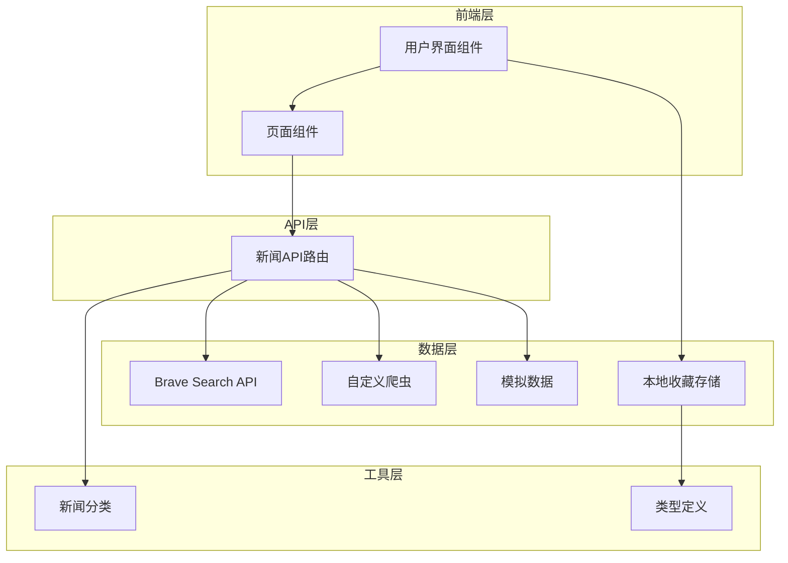
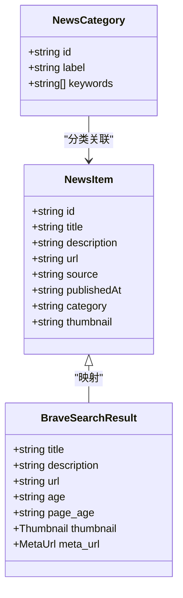
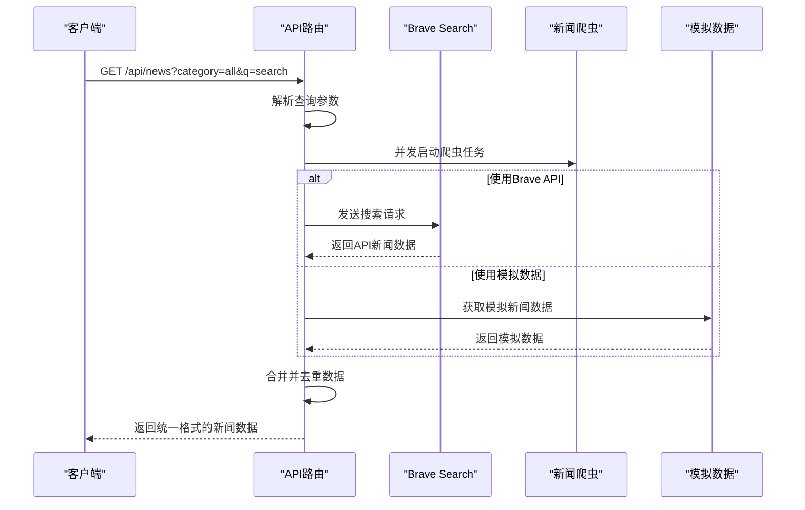
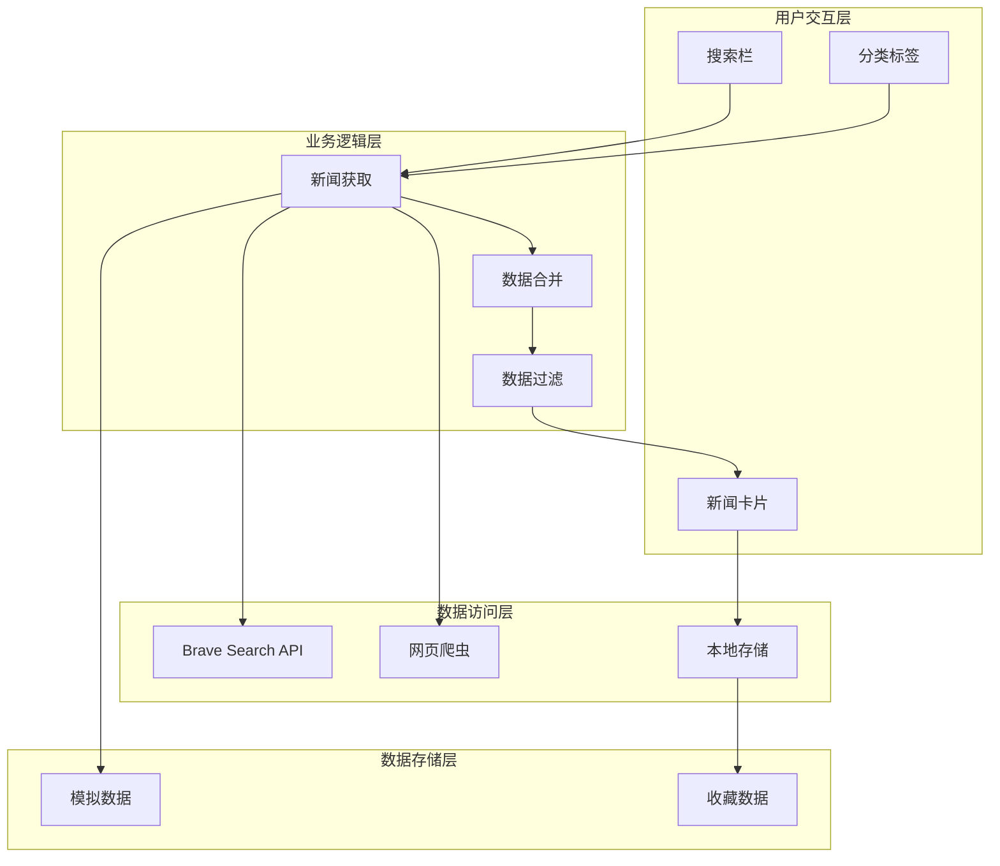
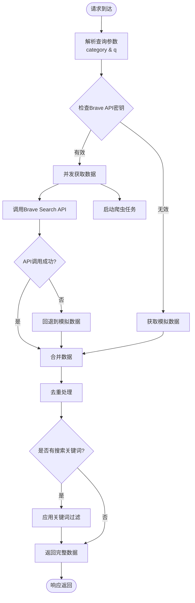
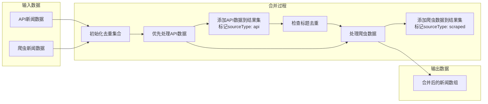
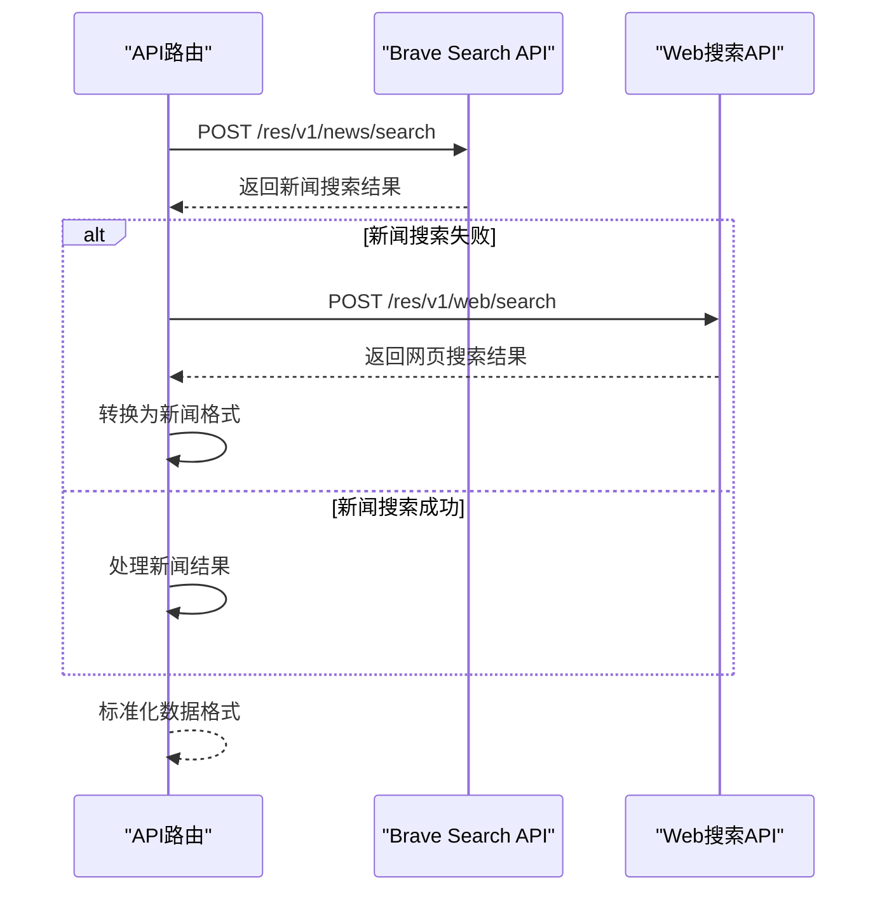
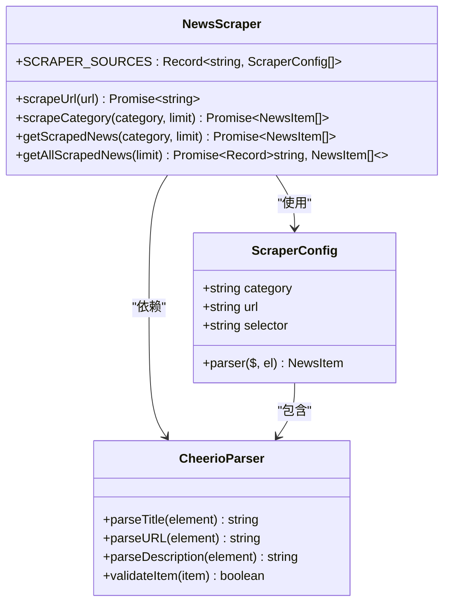
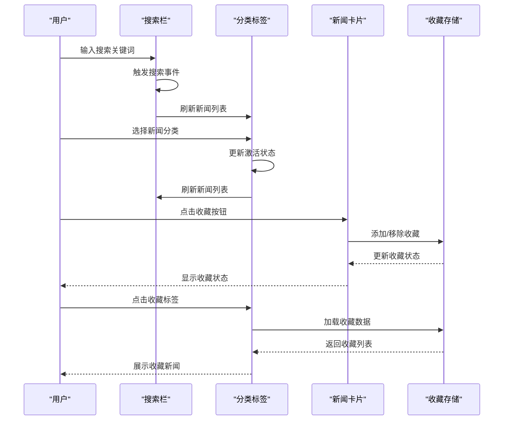

# 数据流设计

<cite>
**本文档引用的文件**
- [app/api/news/route.ts](file://app/api/news/route.ts)
- [lib/brave-search.ts](file://lib/brave-search.ts)
- [lib/news-scraper.ts](file://lib/news-scraper.ts)
- [lib/favorites.ts](file://lib/favorites.ts)
- [app/page.tsx](file://app/page.tsx)
- [lib/mock-data.ts](file://lib/mock-data.ts)
- [lib/news-categories.ts](file://lib/news-categories.ts)
- [components/NewsCard.tsx](file://components/NewsCard.tsx)
- [components/SearchBar.tsx](file://components/SearchBar.tsx)
- [components/CategoryTabs.tsx](file://components/CategoryTabs.tsx)
- [components/NewsSummary.tsx](file://components/NewsSummary.tsx)
</cite>

## 目录
1. [引言](#引言)
2. [项目结构](#项目结构)
3. [核心组件](#核心组件)
4. [架构概览](#架构概览)
5. [详细组件分析](#详细组件分析)
6. [依赖关系分析](#依赖关系分析)
7. [性能考虑](#性能考虑)
8. [故障排除指南](#故障排除指南)
9. [结论](#结论)

## 引言

本数据流设计文档全面描述了AI新闻网站系统中数据的产生、传输和处理过程。该系统通过整合Brave Search API和自定义爬虫技术，为用户提供实时的全球新闻聚合服务。文档详细解释了从用户请求到数据返回的完整数据流路径，包括API路由如何整合多种数据源、数据合并去重逻辑、以及收藏数据的本地存储机制。

## 项目结构

系统采用Next.js框架构建，采用模块化设计，将功能按职责分离到不同的模块中：



**图表来源**
- [app/page.tsx](file://app/page.tsx#L1-L153)
- [app/api/news/route.ts](file://app/api/news/route.ts#L1-L136)
- [lib/brave-search.ts](file://lib/brave-search.ts#L1-L115)
- [lib/news-scraper.ts](file://lib/news-scraper.ts#L1-L166)

**章节来源**
- [package.json](file://package.json#L1-L30)
- [app/page.tsx](file://app/page.tsx#L1-L153)

## 核心组件

### 数据模型定义

系统使用统一的新闻项数据模型，确保不同数据源的数据格式一致性：



**图表来源**
- [lib/brave-search.ts](file://lib/brave-search.ts#L1-L115)
- [lib/news-categories.ts](file://lib/news-categories.ts#L1-L45)

### API路由组件

API路由是整个数据流的核心，负责协调多个数据源并提供统一的响应格式：



**图表来源**
- [app/api/news/route.ts](file://app/api/news/route.ts#L39-L135)

**章节来源**
- [app/api/news/route.ts](file://app/api/news/route.ts#L1-L136)

## 架构概览

系统采用分层架构设计，实现了数据获取、处理和展示的清晰分离：



**图表来源**
- [app/page.tsx](file://app/page.tsx#L19-L63)
- [lib/favorites.ts](file://lib/favorites.ts#L1-L29)

## 详细组件分析

### API路由数据流

API路由实现了智能的数据获取策略，根据配置自动选择最佳的数据源：

#### 数据获取流程



**图表来源**
- [app/api/news/route.ts](file://app/api/news/route.ts#L39-L135)

#### 数据合并算法

数据合并过程确保了API数据和爬虫数据的高质量整合：



**图表来源**
- [app/api/news/route.ts](file://app/api/news/route.ts#L14-L37)

**章节来源**
- [app/api/news/route.ts](file://app/api/news/route.ts#L1-L136)

### Brave Search API集成

Brave Search API提供了高质量的新闻搜索服务，具有自动回退机制：

#### API调用流程



**图表来源**
- [lib/brave-search.ts](file://lib/brave-search.ts#L30-L115)

**章节来源**
- [lib/brave-search.ts](file://lib/brave-search.ts#L1-L115)

### 自定义爬虫系统

爬虫系统专门针对Hacker News进行优化，实现了灵活的配置和强大的数据提取能力：

#### 爬虫架构设计



**图表来源**
- [lib/news-scraper.ts](file://lib/news-scraper.ts#L6-L91)

**章节来源**
- [lib/news-scraper.ts](file://lib/news-scraper.ts#L1-L166)

### 收藏数据管理系统

收藏功能基于浏览器本地存储实现，提供了完整的CRUD操作：

#### 本地存储架构

```mermaid
flowchart TD
subgraph "收藏管理"
GET[获取收藏]
ADD[添加收藏]
REMOVE[删除收藏]
CHECK[检查收藏状态]
end
subgraph "存储机制"
LOCAL[localStorage]
KEY[FAVORITES_KEY]
JSON[JSON序列化]
end
subgraph "数据结构"
ARRAY[NewsItem[]]
UNIQUE[URL唯一性]
end
GET --> LOCAL
ADD --> LOCAL
REMOVE --> LOCAL
CHECK --> LOCAL
LOCAL --> KEY
LOCAL --> JSON
JSON --> ARRAY
ARRAY --> UNIQUE
```

**图表来源**
- [lib/favorites.ts](file://lib/favorites.ts#L1-L29)

**章节来源**
- [lib/favorites.ts](file://lib/favorites.ts#L1-L29)

### 前端数据展示层

前端组件实现了响应式的数据展示和用户交互：

#### 组件交互流程



**图表来源**
- [app/page.tsx](file://app/page.tsx#L19-L63)
- [components/NewsCard.tsx](file://components/NewsCard.tsx#L19-L27)

**章节来源**
- [app/page.tsx](file://app/page.tsx#L1-L153)
- [components/NewsCard.tsx](file://components/NewsCard.tsx#L1-L89)

## 依赖关系分析

系统各组件之间的依赖关系体现了清晰的分层架构：

```mermaid
graph TB
subgraph "外部依赖"
Cheerio[cheerio@1.2.0]
Next[Next.js@^16.1.6]
React[React@^19.2.4]
end
subgraph "内部模块"
Route[API路由]
Brave[Brave搜索]
Scraper[新闻爬虫]
Favorites[收藏管理]
Mock[模拟数据]
Categories[新闻分类]
Components[UI组件]
end
subgraph "类型定义"
Types[新闻类型]
Interfaces[接口定义]
end
Cheerio --> Scraper
Next --> Route
React --> Components
Route --> Brave
Route --> Scraper
Route --> Mock
Route --> Categories
Scraper --> Types
Brave --> Types
Favorites --> Types
Components --> Types
Types --> Interfaces
```

**图表来源**
- [package.json](file://package.json#L15-L28)
- [lib/brave-search.ts](file://lib/brave-search.ts#L1-L10)
- [lib/news-scraper.ts](file://lib/news-scraper.ts#L1-L3)

**章节来源**
- [package.json](file://package.json#L1-L30)

## 性能考虑

系统在设计时充分考虑了性能优化，采用了多种策略来提升用户体验：

### 并发数据获取

系统通过Promise.all实现并发数据获取，显著减少了总等待时间：

- **并发策略**：同时启动Brave API调用和爬虫任务
- **错误隔离**：单个数据源失败不影响其他数据源
- **资源利用**：充分利用网络带宽和CPU资源

### 缓存和去重机制

- **内存缓存**：去重集合使用Set数据结构，提供O(1)查找性能
- **数据去重**：基于标题标准化的去重算法，避免重复内容
- **优先级处理**：API数据优先于爬虫数据，保证信息时效性

### 前端性能优化

- **懒加载**：新闻卡片组件按需渲染
- **状态管理**：合理的状态更新策略，避免不必要的重渲染
- **本地存储**：收藏数据本地缓存，减少网络请求

## 故障排除指南

### 常见问题及解决方案

#### API密钥配置问题

**问题症状**：
- 返回模拟数据而非真实新闻
- 控制台出现API密钥相关错误

**解决步骤**：
1. 检查环境变量配置
2. 验证Brave API密钥有效性
3. 确认API配额充足

#### 网络连接问题

**问题症状**：
- 新闻获取超时
- 页面显示加载状态

**解决步骤**：
1. 检查网络连接稳定性
2. 验证API域名可达性
3. 查看防火墙设置

#### 数据解析错误

**问题症状**：
- 收藏功能异常
- 新闻列表显示空白

**解决步骤**：
1. 检查localStorage可用性
2. 清理浏览器缓存
3. 验证数据格式正确性

**章节来源**
- [app/api/news/route.ts](file://app/api/news/route.ts#L76-L134)
- [lib/favorites.ts](file://lib/favorites.ts#L8-L11)

## 结论

本数据流设计文档全面展示了AI新闻网站系统的数据处理架构。系统通过智能的数据源选择、高效的并发处理和完善的错误恢复机制，为用户提供了稳定可靠的新闻聚合服务。

### 设计亮点

1. **多源数据融合**：Brave API与自定义爬虫的有机结合
2. **智能去重算法**：确保数据质量和用户体验
3. **本地化存储**：提供离线访问和个性化体验
4. **响应式架构**：良好的扩展性和维护性

### 技术优势

- **高可用性**：多重回退机制确保服务稳定性
- **高性能**：并发处理和缓存策略优化响应速度
- **易维护性**：模块化设计便于功能扩展和bug修复
- **用户体验**：流畅的交互和及时的反馈机制

该系统为构建类似的数据聚合平台提供了完整的参考架构，其设计理念和技术实现值得在相关项目中借鉴和应用。