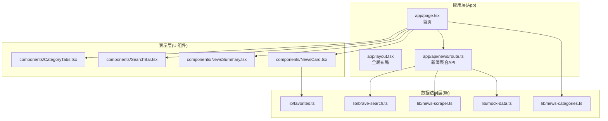
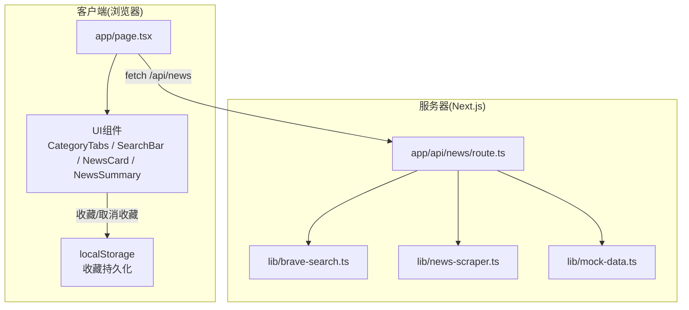
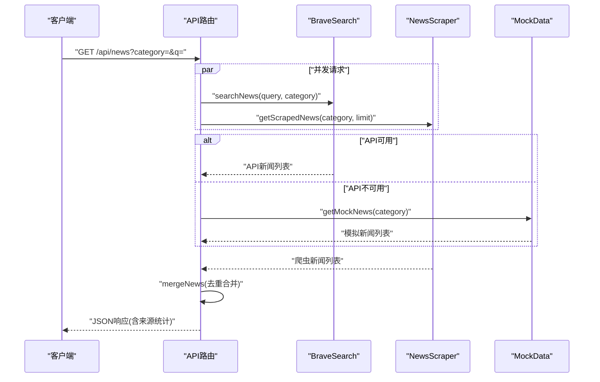
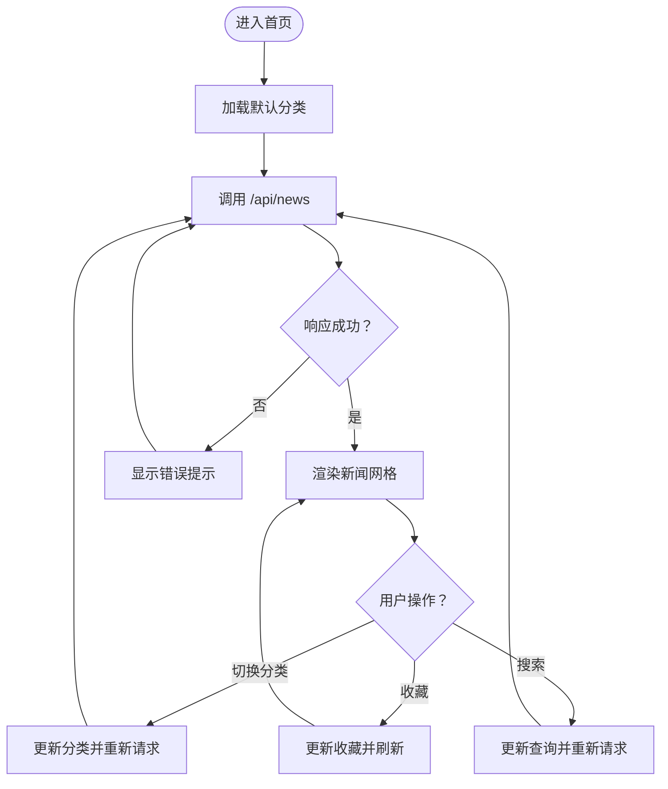
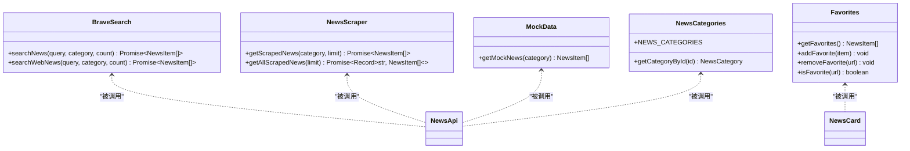
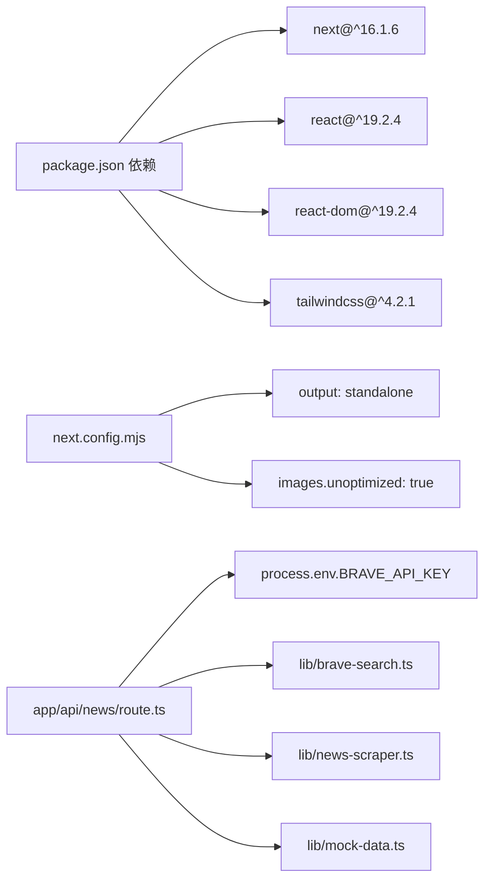

# 整体架构概览

<cite>
**本文档引用的文件**
- [README.md](file://README.md)
- [package.json](file://package.json)
- [next.config.mjs](file://next.config.mjs)
- [app/layout.tsx](file://app/layout.tsx)
- [app/page.tsx](file://app/page.tsx)
- [app/api/news/route.ts](file://app/api/news/route.ts)
- [components/CategoryTabs.tsx](file://components/CategoryTabs.tsx)
- [components/NewsCard.tsx](file://components/NewsCard.tsx)
- [components/SearchBar.tsx](file://components/SearchBar.tsx)
- [components/NewsSummary.tsx](file://components/NewsSummary.tsx)
- [lib/brave-search.ts](file://lib/brave-search.ts)
- [lib/favorites.ts](file://lib/favorites.ts)
- [lib/news-categories.ts](file://lib/news-categories.ts)
- [lib/mock-data.ts](file://lib/mock-data.ts)
- [lib/news-scraper.ts](file://lib/news-scraper.ts)
</cite>

## 目录
1. [简介](#简介)
2. [项目结构](#项目结构)
3. [核心组件](#核心组件)
4. [架构总览](#架构总览)
5. [详细组件分析](#详细组件分析)
6. [依赖关系分析](#依赖关系分析)
7. [性能考量](#性能考量)
8. [故障排查指南](#故障排查指南)
9. [结论](#结论)

## 简介
本项目是一个基于 Next.js 16.1.6 的新闻聚合网站，采用 App Router 架构，结合客户端渲染与服务器端渲染实现“混合渲染”体验。系统通过统一的 API 路由聚合来自 Brave Search API 与网页爬虫的数据，提供分类浏览、今日摘要、搜索与收藏等功能。项目以模块化方式组织，分为表示层（UI 组件）、业务逻辑层（API 路由）、数据访问层（数据获取模块），并通过清晰的职责划分实现可维护与可扩展的架构。

## 项目结构
项目采用 Next.js App Router 的目录约定，核心目录与职责如下：
- app：应用入口与页面，包含全局布局、首页以及 API 路由
- components：可复用 UI 组件
- lib：数据访问与工具模块（搜索、爬虫、分类、收藏、模拟数据）

图表来源
- [app/layout.tsx](file://app/layout.tsx#L1-L20)
- [app/page.tsx](file://app/page.tsx#L1-L153)
- [app/api/news/route.ts](file://app/api/news/route.ts#L1-L136)
- [components/CategoryTabs.tsx](file://components/CategoryTabs.tsx#L1-L49)
- [components/SearchBar.tsx](file://components/SearchBar.tsx#L1-L37)
- [components/NewsSummary.tsx](file://components/NewsSummary.tsx#L1-L54)
- [components/NewsCard.tsx](file://components/NewsCard.tsx#L1-L89)
- [lib/brave-search.ts](file://lib/brave-search.ts#L1-L115)
- [lib/news-scraper.ts](file://lib/news-scraper.ts#L1-L166)
- [lib/mock-data.ts](file://lib/mock-data.ts#L1-L197)
- [lib/favorites.ts](file://lib/favorites.ts#L1-L29)
- [lib/news-categories.ts](file://lib/news-categories.ts#L1-L45)

章节来源
- [README.md](file://README.md#L36-L49)
- [package.json](file://package.json#L1-L30)
- [next.config.mjs](file://next.config.mjs#L1-L10)

## 核心组件
- 表示层（UI 组件）：负责用户交互与展示，如分类标签、搜索栏、新闻卡片、摘要等，均标记为客户端组件，便于状态管理与交互。
- 业务逻辑层（API 路由）：app/api/news/route.ts 作为单一入口，协调数据源、合并结果、错误回退与响应格式化。
- 数据访问层（lib）：封装具体数据源访问逻辑，包括 Brave Search API、网页爬虫、模拟数据、收藏持久化与分类配置。

章节来源
- [app/page.tsx](file://app/page.tsx#L1-L153)
- [app/api/news/route.ts](file://app/api/news/route.ts#L1-L136)
- [lib/brave-search.ts](file://lib/brave-search.ts#L1-L115)
- [lib/news-scraper.ts](file://lib/news-scraper.ts#L1-L166)
- [lib/mock-data.ts](file://lib/mock-data.ts#L1-L197)
- [lib/favorites.ts](file://lib/favorites.ts#L1-L29)
- [lib/news-categories.ts](file://lib/news-categories.ts#L1-L45)

## 架构总览
系统采用“混合渲染”架构：
- 客户端渲染（CSR）：首页与交互组件在浏览器侧运行，支持状态切换（分类、搜索、收藏）与即时反馈。
- 服务器端渲染（SSR）：API 路由在服务器端执行，集中处理数据聚合与错误回退，返回标准化 JSON 响应。
- 模块化组织：表示层、业务逻辑层、数据访问层职责清晰，通过明确的接口耦合，提升可维护性与可测试性。

图表来源
- [app/page.tsx](file://app/page.tsx#L1-L153)
- [app/api/news/route.ts](file://app/api/news/route.ts#L1-L136)
- [lib/brave-search.ts](file://lib/brave-search.ts#L1-L115)
- [lib/news-scraper.ts](file://lib/news-scraper.ts#L1-L166)
- [lib/mock-data.ts](file://lib/mock-data.ts#L1-L197)
- [lib/favorites.ts](file://lib/favorites.ts#L1-L29)

## 详细组件分析

### API 路由：新闻聚合与回退策略
- 输入参数：category（分类）、q（关键词）
- 并发策略：同时发起爬虫与外部 API 请求，缩短响应时间
- 合并策略：优先保留 API 来源，再追加爬虫来源，避免重复
- 回退策略：当 API 密钥缺失或调用失败时，自动回退到 mock 数据与爬虫数据的组合
- 错误处理：捕获异常并返回包含来源统计的回退响应，保证前端稳定显示

图表来源
- [app/api/news/route.ts](file://app/api/news/route.ts#L39-L135)
- [lib/brave-search.ts](file://lib/brave-search.ts#L30-L73)
- [lib/news-scraper.ts](file://lib/news-scraper.ts#L140-L153)
- [lib/mock-data.ts](file://lib/mock-data.ts#L194-L196)

章节来源
- [app/api/news/route.ts](file://app/api/news/route.ts#L1-L136)

### 表示层：组件职责与交互
- CategoryTabs：分类选择与收藏切换
- SearchBar：关键词输入与提交
- NewsCard：新闻条目展示与收藏操作
- NewsSummary：加载态占位与前五条摘要
- Home 页面：状态管理、错误处理、加载控制与渲染分支

图表来源
- [app/page.tsx](file://app/page.tsx#L19-L63)
- [components/CategoryTabs.tsx](file://components/CategoryTabs.tsx#L12-L46)
- [components/SearchBar.tsx](file://components/SearchBar.tsx#L9-L36)
- [components/NewsCard.tsx](file://components/NewsCard.tsx#L12-L27)

章节来源
- [app/page.tsx](file://app/page.tsx#L1-L153)
- [components/CategoryTabs.tsx](file://components/CategoryTabs.tsx#L1-L49)
- [components/SearchBar.tsx](file://components/SearchBar.tsx#L1-L37)
- [components/NewsSummary.tsx](file://components/NewsSummary.tsx#L1-L54)
- [components/NewsCard.tsx](file://components/NewsCard.tsx#L1-L89)

### 数据访问层：多源聚合与容错
- Brave Search：优先使用新闻搜索接口；若失败则回退到网页搜索接口
- 网页爬虫：基于 Cheerio 解析 Hacker News，按分类提取标题与链接
- 模拟数据：在 API 密钥缺失时提供稳定的演示数据
- 收藏持久化：基于 localStorage 的简单 CRUD
- 分类配置：集中定义分类 ID、标签与关键词

图表来源
- [lib/brave-search.ts](file://lib/brave-search.ts#L30-L115)
- [lib/news-scraper.ts](file://lib/news-scraper.ts#L140-L166)
- [lib/mock-data.ts](file://lib/mock-data.ts#L194-L196)
- [lib/favorites.ts](file://lib/favorites.ts#L1-L29)
- [lib/news-categories.ts](file://lib/news-categories.ts#L1-L45)

章节来源
- [lib/brave-search.ts](file://lib/brave-search.ts#L1-L115)
- [lib/news-scraper.ts](file://lib/news-scraper.ts#L1-L166)
- [lib/mock-data.ts](file://lib/mock-data.ts#L1-L197)
- [lib/favorites.ts](file://lib/favorites.ts#L1-L29)
- [lib/news-categories.ts](file://lib/news-categories.ts#L1-L45)

## 依赖关系分析
- 应用依赖：Next.js 16.1.6、React 19、TailwindCSS 4.2.1
- 运行配置：standalone 输出、图片优化关闭（便于部署）
- 外部服务：Brave Search API（需配置密钥），否则回退到模拟数据与爬虫
- 内聚与耦合：API 路由集中协调数据源，UI 组件仅关注展示与交互，耦合度低、内聚性高

图表来源
- [package.json](file://package.json#L15-L28)
- [next.config.mjs](file://next.config.mjs#L1-L10)
- [app/api/news/route.ts](file://app/api/news/route.ts#L7-L11)
- [lib/brave-search.ts](file://lib/brave-search.ts#L27-L37)

章节来源
- [package.json](file://package.json#L1-L30)
- [next.config.mjs](file://next.config.mjs#L1-L10)
- [app/api/news/route.ts](file://app/api/news/route.ts#L1-L136)

## 性能考量
- 并发请求：API 路由同时拉取外部 API 与爬虫数据，减少总等待时间
- 去重合并：统一标题规范化后去重，避免重复内容干扰用户体验
- 回退策略：在 API 不可用时快速切换到模拟数据与爬虫数据，保障稳定性
- 图片优化：关闭图片优化以简化部署流程，适合静态站点或容器化部署场景
- 客户端懒加载：新闻网格与摘要组件在加载时提供占位符，改善感知性能

## 故障排查指南
- API 密钥未配置或无效
  - 现象：返回 mock 数据与来源统计字段
  - 处理：在环境变量中设置有效的 Brave Search API Key
- Brave Search API 调用失败
  - 现象：回退到 mock + 爬虫数据
  - 处理：检查网络连通性与配额限制
- 爬虫抓取异常
  - 现象：部分分类新闻为空或数量不足
  - 处理：确认目标站点可访问与选择器匹配
- 收藏无法保存
  - 现象：刷新后收藏丢失
  - 处理：确保浏览器允许 localStorage，或检查隐私模式限制

章节来源
- [app/api/news/route.ts](file://app/api/news/route.ts#L48-L74)
- [app/api/news/route.ts](file://app/api/news/route.ts#L112-L134)
- [lib/brave-search.ts](file://lib/brave-search.ts#L35-L37)
- [lib/news-scraper.ts](file://lib/news-scraper.ts#L94-L113)
- [lib/favorites.ts](file://lib/favorites.ts#L8-L10)

## 结论
本项目以 Next.js App Router 为基础，采用“混合渲染 + 模块化分层”的架构设计，实现了从多源数据聚合到用户界面展示的完整闭环。通过清晰的职责划分与稳健的回退策略，系统在功能完整性与运行稳定性之间取得了良好平衡。建议后续可进一步引入缓存层与更细粒度的错误边界，以提升性能与可观测性。