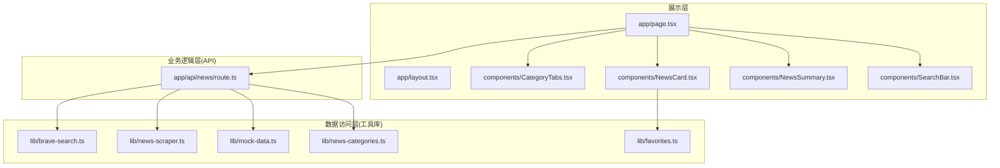
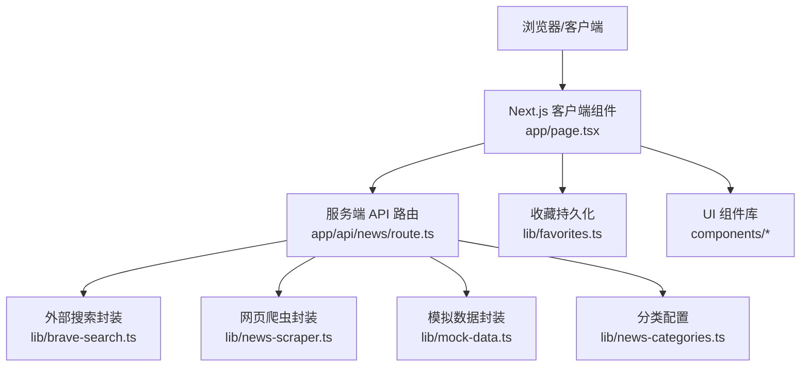
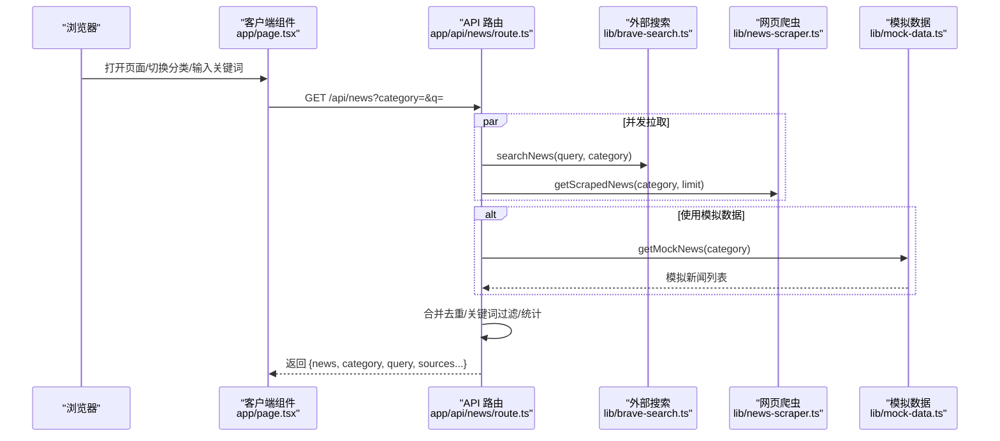
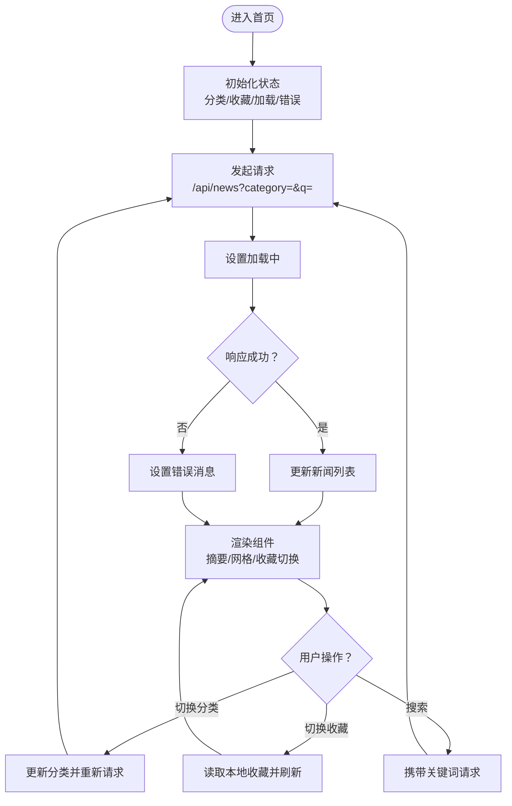
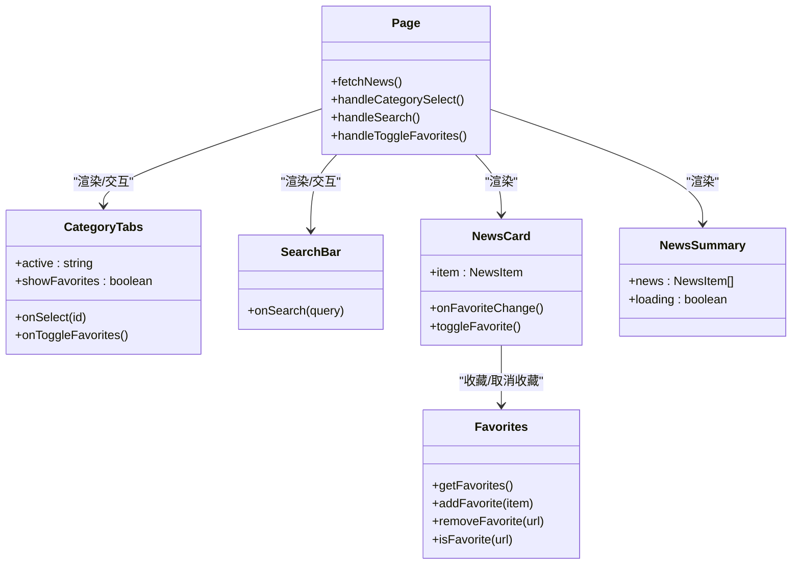
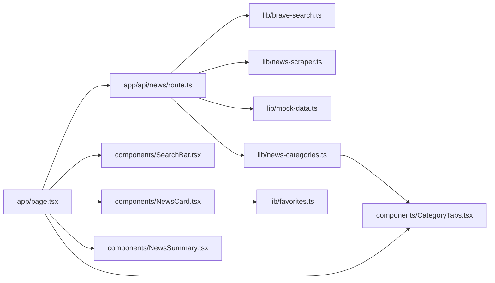

# 架构设计

<cite>
**本文引用的文件**
- [README.md](file://README.md)
- [package.json](file://package.json)
- [next.config.mjs](file://next.config.mjs)
- [app/layout.tsx](file://app/layout.tsx)
- [app/page.tsx](file://app/page.tsx)
- [app/api/news/route.ts](file://app/api/news/route.ts)
- [components/CategoryTabs.tsx](file://components/CategoryTabs.tsx)
- [components/NewsCard.tsx](file://components/NewsCard.tsx)
- [components/NewsSummary.tsx](file://components/NewsSummary.tsx)
- [components/SearchBar.tsx](file://components/SearchBar.tsx)
- [lib/brave-search.ts](file://lib/brave-search.ts)
- [lib/favorites.ts](file://lib/favorites.ts)
- [lib/mock-data.ts](file://lib/mock-data.ts)
- [lib/news-categories.ts](file://lib/news-categories.ts)
- [lib/news-scraper.ts](file://lib/news-scraper.ts)
</cite>

## 目录
1. [简介](#简介)
2. [项目结构](#项目结构)
3. [核心组件](#核心组件)
4. [架构总览](#架构总览)
5. [详细组件分析](#详细组件分析)
6. [依赖分析](#依赖分析)
7. [性能考量](#性能考量)
8. [故障排查指南](#故障排查指南)
9. [结论](#结论)
10. [附录](#附录)

## 简介
本项目为“先雄的新闻网站”，采用 Next.js App Router 构建，围绕“展示层-业务逻辑层-数据访问层”的分层架构组织代码。系统通过客户端组件负责用户交互与状态管理，服务端 API 路由承担业务编排与数据聚合，底层分别对接外部新闻搜索服务与本地爬虫，实现“真实数据 + 模拟数据 + 本地缓存”的混合数据流。项目强调组件化与微服务思想在 API 路由中的应用：每个 API 路由方法聚焦单一职责，内部通过并行任务与合并策略实现高可用与高性能。

## 项目结构
- 展示层（UI）：位于 app/ 与 components/，以 React 客户端组件为主，负责页面布局、交互与状态驱动渲染。
- 业务逻辑层（API）：位于 app/api/news/route.ts，封装查询参数解析、并发数据拉取、数据合并与错误回退策略。
- 数据访问层（工具库）：位于 lib/，包含外部搜索接口、本地模拟数据、分类配置、收藏持久化与网页爬虫。
- 基础设施与构建：next.config.mjs 控制输出模式与图片优化；package.json 管理依赖与脚本；README.md 提供运行说明与接入指引。

图表来源
- [app/layout.tsx](file://app/layout.tsx#L1-L20)
- [app/page.tsx](file://app/page.tsx#L1-L153)
- [components/CategoryTabs.tsx](file://components/CategoryTabs.tsx#L1-L49)
- [components/NewsCard.tsx](file://components/NewsCard.tsx#L1-L89)
- [components/NewsSummary.tsx](file://components/NewsSummary.tsx#L1-L54)
- [components/SearchBar.tsx](file://components/SearchBar.tsx#L1-L37)
- [app/api/news/route.ts](file://app/api/news/route.ts#L1-L136)
- [lib/brave-search.ts](file://lib/brave-search.ts#L1-L115)
- [lib/news-scraper.ts](file://lib/news-scraper.ts#L1-L166)
- [lib/mock-data.ts](file://lib/mock-data.ts#L1-L197)
- [lib/news-categories.ts](file://lib/news-categories.ts#L1-L45)
- [lib/favorites.ts](file://lib/favorites.ts#L1-L29)

章节来源
- [README.md](file://README.md#L1-L49)
- [package.json](file://package.json#L1-L30)
- [next.config.mjs](file://next.config.mjs#L1-L9)

## 核心组件
- 页面与布局：根布局定义全局元数据与基础样式；首页负责状态管理、分类切换、搜索触发与收藏切换。
- API 路由：统一处理 GET 请求，解析查询参数，按需选择真实搜索或模拟数据，同时并发抓取爬虫数据并去重合并，最终返回结构化结果。
- 组件体系：分类标签、搜索框、新闻卡片、摘要展示，均以 props 驱动，组件间通过回调解耦。
- 工具库：新闻模型定义、Brave 搜索封装、分类映射、收藏持久化、模拟数据与网页爬虫。

章节来源
- [app/layout.tsx](file://app/layout.tsx#L1-L20)
- [app/page.tsx](file://app/page.tsx#L1-L153)
- [app/api/news/route.ts](file://app/api/news/route.ts#L1-L136)
- [components/CategoryTabs.tsx](file://components/CategoryTabs.tsx#L1-L49)
- [components/NewsCard.tsx](file://components/NewsCard.tsx#L1-L89)
- [components/NewsSummary.tsx](file://components/NewsSummary.tsx#L1-L54)
- [components/SearchBar.tsx](file://components/SearchBar.tsx#L1-L37)
- [lib/brave-search.ts](file://lib/brave-search.ts#L1-L115)
- [lib/favorites.ts](file://lib/favorites.ts#L1-L29)
- [lib/mock-data.ts](file://lib/mock-data.ts#L1-L197)
- [lib/news-categories.ts](file://lib/news-categories.ts#L1-L45)
- [lib/news-scraper.ts](file://lib/news-scraper.ts#L1-L166)

## 架构总览
系统采用“前端组件 + 服务端路由 + 多数据源”的三层架构：
- 表示层：React 客户端组件负责渲染与交互，通过 fetch 调用服务端 API。
- 业务逻辑层：Next.js App Router 的 API 路由集中处理请求、并发拉取与合并数据、错误回退与统计信息。
- 数据访问层：外部搜索（Brave）、本地模拟数据与网页爬虫，三者并行执行，优先去重合并，确保数据丰富与稳定性。

图表来源
- [app/page.tsx](file://app/page.tsx#L1-L153)
- [app/api/news/route.ts](file://app/api/news/route.ts#L1-L136)
- [lib/brave-search.ts](file://lib/brave-search.ts#L1-L115)
- [lib/news-scraper.ts](file://lib/news-scraper.ts#L1-L166)
- [lib/mock-data.ts](file://lib/mock-data.ts#L1-L197)
- [lib/news-categories.ts](file://lib/news-categories.ts#L1-L45)
- [lib/favorites.ts](file://lib/favorites.ts#L1-L29)
- [components/CategoryTabs.tsx](file://components/CategoryTabs.tsx#L1-L49)
- [components/NewsCard.tsx](file://components/NewsCard.tsx#L1-L89)
- [components/NewsSummary.tsx](file://components/NewsSummary.tsx#L1-L54)
- [components/SearchBar.tsx](file://components/SearchBar.tsx#L1-L37)

## 详细组件分析

### API 路由（数据聚合与错误回退）
- 职责：解析查询参数、并发拉取外部搜索与本地爬虫数据、合并去重、按关键词过滤、返回结构化响应。
- 并发策略：使用 Promise.all 并行获取外部搜索与爬虫数据，提升响应速度。
- 错误回退：当外部 API 异常时，自动回退到模拟数据与爬虫数据的合并结果，保证可用性。
- 数据合并：优先保留外部搜索结果，再追加爬虫数据，避免重复；支持按标题去重。
- 查询策略：若带关键词则直接在合并结果中过滤；否则根据分类映射生成关键词集合。

图表来源
- [app/page.tsx](file://app/page.tsx#L19-L63)
- [app/api/news/route.ts](file://app/api/news/route.ts#L39-L135)
- [lib/brave-search.ts](file://lib/brave-search.ts#L30-L73)
- [lib/news-scraper.ts](file://lib/news-scraper.ts#L140-L153)
- [lib/mock-data.ts](file://lib/mock-data.ts#L194-L196)

章节来源
- [app/api/news/route.ts](file://app/api/news/route.ts#L1-L136)
- [lib/brave-search.ts](file://lib/brave-search.ts#L1-L115)
- [lib/news-scraper.ts](file://lib/news-scraper.ts#L1-L166)
- [lib/mock-data.ts](file://lib/mock-data.ts#L1-L197)

### 客户端页面与组件交互
- 页面状态：维护新闻列表、加载状态、当前分类、是否显示收藏、错误提示等。
- 交互流程：分类切换、搜索提交、收藏切换均通过回调更新状态；收藏切换时从本地存储读取并刷新。
- 渲染策略：加载态显示骨架屏；空状态提示；新闻摘要展示前五条；卡片支持收藏切换并回调刷新。

图表来源
- [app/page.tsx](file://app/page.tsx#L11-L153)
- [components/CategoryTabs.tsx](file://components/CategoryTabs.tsx#L12-L48)
- [components/SearchBar.tsx](file://components/SearchBar.tsx#L9-L36)
- [components/NewsCard.tsx](file://components/NewsCard.tsx#L12-L88)
- [components/NewsSummary.tsx](file://components/NewsSummary.tsx#L10-L53)
- [lib/favorites.ts](file://lib/favorites.ts#L7-L28)

章节来源
- [app/page.tsx](file://app/page.tsx#L1-L153)
- [components/CategoryTabs.tsx](file://components/CategoryTabs.tsx#L1-L49)
- [components/SearchBar.tsx](file://components/SearchBar.tsx#L1-L37)
- [components/NewsCard.tsx](file://components/NewsCard.tsx#L1-L89)
- [components/NewsSummary.tsx](file://components/NewsSummary.tsx#L1-L54)
- [lib/favorites.ts](file://lib/favorites.ts#L1-L29)

### 组件类图（职责与依赖）

图表来源
- [components/CategoryTabs.tsx](file://components/CategoryTabs.tsx#L1-L49)
- [components/SearchBar.tsx](file://components/SearchBar.tsx#L1-L37)
- [components/NewsCard.tsx](file://components/NewsCard.tsx#L1-L89)
- [components/NewsSummary.tsx](file://components/NewsSummary.tsx#L1-L54)
- [app/page.tsx](file://app/page.tsx#L1-L153)
- [lib/favorites.ts](file://lib/favorites.ts#L1-L29)

章节来源
- [components/CategoryTabs.tsx](file://components/CategoryTabs.tsx#L1-L49)
- [components/SearchBar.tsx](file://components/SearchBar.tsx#L1-L37)
- [components/NewsCard.tsx](file://components/NewsCard.tsx#L1-L89)
- [components/NewsSummary.tsx](file://components/NewsSummary.tsx#L1-L54)
- [app/page.tsx](file://app/page.tsx#L1-L153)
- [lib/favorites.ts](file://lib/favorites.ts#L1-L29)

## 依赖分析
- 外部依赖：Next.js、React、cheerio（网页解析）。
- 内部模块耦合：API 路由对工具库存在直接依赖；页面组件仅通过 API 路由间接依赖工具库，保持低耦合。
- 可能的循环依赖：未发现直接循环导入；各模块职责清晰，遵循单向依赖。
- 外部集成点：Brave Search API（需配置密钥），网页爬虫访问第三方站点。

图表来源
- [app/page.tsx](file://app/page.tsx#L1-L153)
- [app/api/news/route.ts](file://app/api/news/route.ts#L1-L136)
- [lib/brave-search.ts](file://lib/brave-search.ts#L1-L115)
- [lib/news-scraper.ts](file://lib/news-scraper.ts#L1-L166)
- [lib/mock-data.ts](file://lib/mock-data.ts#L1-L197)
- [lib/news-categories.ts](file://lib/news-categories.ts#L1-L45)
- [lib/favorites.ts](file://lib/favorites.ts#L1-L29)
- [components/CategoryTabs.tsx](file://components/CategoryTabs.tsx#L1-L49)
- [components/SearchBar.tsx](file://components/SearchBar.tsx#L1-L37)
- [components/NewsCard.tsx](file://components/NewsCard.tsx#L1-L89)
- [components/NewsSummary.tsx](file://components/NewsSummary.tsx#L1-L54)

章节来源
- [package.json](file://package.json#L15-L28)
- [app/api/news/route.ts](file://app/api/news/route.ts#L1-L136)

## 性能考量
- 并发与去重：API 路由并发拉取外部搜索与爬虫数据，合并时按标题去重，减少重复渲染与带宽浪费。
- 缓存与回退：在 API 失败时回退到模拟数据与爬虫数据，保障可用性；模拟数据可减少对外部依赖的瞬时压力。
- 图片与构建：构建输出为独立模式，关闭图片优化以简化部署；生产环境建议启用 CDN 与缓存策略。
- 前端渲染：组件按需渲染，骨架屏提升感知性能；收藏读取在客户端完成，避免额外网络请求。

## 故障排查指南
- API 密钥问题：若未配置或使用默认占位符，系统将自动切换到模拟数据模式；检查环境变量配置与网络连通性。
- 外部 API 失败：API 路由已内置回退逻辑，若外部搜索失败则合并模拟数据与爬虫数据；可在日志中查看错误详情。
- 爬虫异常：网页爬虫对目标站点的结构变更敏感，若抓取失败会记录错误并返回空结果；可检查目标站点结构或放宽选择器。
- 收藏异常：收藏依赖浏览器本地存储，若禁用或清理可能导致数据丢失；确认浏览器隐私设置与存储权限。

章节来源
- [app/api/news/route.ts](file://app/api/news/route.ts#L7-L135)
- [lib/brave-search.ts](file://lib/brave-search.ts#L35-L58)
- [lib/news-scraper.ts](file://lib/news-scraper.ts#L94-L153)
- [lib/favorites.ts](file://lib/favorites.ts#L8-L10)

## 结论
本项目以 Next.js App Router 为核心，采用“展示层-业务逻辑层-数据访问层”的清晰分层，结合组件化与微服务思想在 API 路由中的实践，实现了高可用、可扩展且易维护的新闻聚合系统。通过并发数据拉取、智能合并与错误回退机制，系统在真实数据与本地数据之间取得平衡，满足不同场景下的性能与稳定性需求。

## 附录
- 技术栈与版本：Next.js、React、cheerio、TailwindCSS、TypeScript。
- 运行与构建：开发模式、构建产物独立输出、图片优化关闭。
- 部署建议：容器化镜像（Dockerfile 存在）、边缘部署（Vercel 配置存在）、CDN 加速与缓存策略。

章节来源
- [README.md](file://README.md#L1-L49)
- [package.json](file://package.json#L1-L30)
- [next.config.mjs](file://next.config.mjs#L1-L9)