# 组件关系设计

<cite>
**本文档引用的文件**
- [app/page.tsx](file://app/page.tsx)
- [components/NewsCard.tsx](file://components/NewsCard.tsx)
- [components/CategoryTabs.tsx](file://components/CategoryTabs.tsx)
- [components/SearchBar.tsx](file://components/SearchBar.tsx)
- [components/NewsSummary.tsx](file://components/NewsSummary.tsx)
- [lib/news-categories.ts](file://lib/news-categories.ts)
- [lib/brave-search.ts](file://lib/brave-search.ts)
- [lib/favorites.ts](file://lib/favorites.ts)
- [app/api/news/route.ts](file://app/api/news/route.ts)
- [app/layout.tsx](file://app/layout.tsx)
- [package.json](file://package.json)
- [README.md](file://README.md)
</cite>

## 目录
1. [简介](#简介)
2. [项目结构](#项目结构)
3. [核心组件](#核心组件)
4. [架构概览](#架构概览)
5. [详细组件分析](#详细组件分析)
6. [依赖关系分析](#依赖关系分析)
7. [性能考虑](#性能考虑)
8. [故障排除指南](#故障排除指南)
9. [结论](#结论)

## 简介

这是一个基于Next.js构建的现代化新闻聚合网站，采用React客户端组件架构。项目实现了完整的新闻浏览、搜索、分类和收藏功能，通过组件化设计实现了清晰的数据流和用户交互模式。

## 项目结构

项目采用模块化的文件组织方式，主要分为以下几个层次：

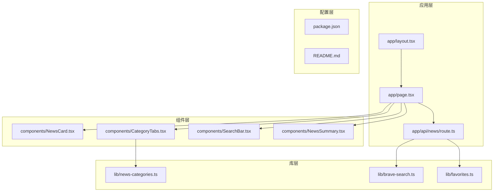

**图表来源**
- [app/page.tsx](file://app/page.tsx#L1-L153)
- [components/NewsCard.tsx](file://components/NewsCard.tsx#L1-L89)
- [components/CategoryTabs.tsx](file://components/CategoryTabs.tsx#L1-L49)
- [components/SearchBar.tsx](file://components/SearchBar.tsx#L1-L37)
- [components/NewsSummary.tsx](file://components/NewsSummary.tsx#L1-L54)
- [lib/news-categories.ts](file://lib/news-categories.ts#L1-L45)
- [lib/brave-search.ts](file://lib/brave-search.ts#L1-L115)
- [lib/favorites.ts](file://lib/favorites.ts#L1-L29)
- [app/api/news/route.ts](file://app/api/news/route.ts#L1-L136)

**章节来源**
- [package.json](file://package.json#L1-L30)
- [README.md](file://README.md#L36-L49)

## 核心组件

### 主页面组件 (Home)

主页面组件是整个应用的核心协调者，负责管理全局状态和组件间的数据传递。它实现了以下关键功能：

- **状态管理**: 统一管理新闻数据、加载状态、分类选择、收藏状态等
- **数据获取**: 通过API路由获取新闻数据，支持分类和搜索
- **组件协调**: 协调各个子组件的工作，确保数据流的一致性
- **错误处理**: 提供统一的错误处理和用户反馈机制

### 新闻卡片组件 (NewsCard)

新闻卡片组件负责展示单条新闻的详细信息，实现用户与新闻内容的交互：

- **收藏功能**: 支持新闻的收藏和取消收藏操作
- **外部链接**: 提供安全的外部链接跳转
- **视觉反馈**: 通过样式变化提供良好的用户体验

### 分类标签组件 (CategoryTabs)

分类标签组件提供新闻分类浏览功能：

- **分类导航**: 展示可用的新闻分类选项
- **收藏切换**: 支持在普通新闻和收藏新闻之间切换
- **状态同步**: 与主页面组件保持状态同步

### 搜索栏组件 (SearchBar)

搜索栏组件提供关键词搜索功能：

- **输入处理**: 处理用户的搜索请求
- **表单验证**: 确保搜索查询的有效性
- **事件传递**: 将搜索结果传递给父组件

**章节来源**
- [app/page.tsx](file://app/page.tsx#L11-L153)
- [components/NewsCard.tsx](file://components/NewsCard.tsx#L12-L89)
- [components/CategoryTabs.tsx](file://components/CategoryTabs.tsx#L12-L49)
- [components/SearchBar.tsx](file://components/SearchBar.tsx#L9-L37)

## 架构概览

系统采用分层架构设计，实现了清晰的关注点分离：

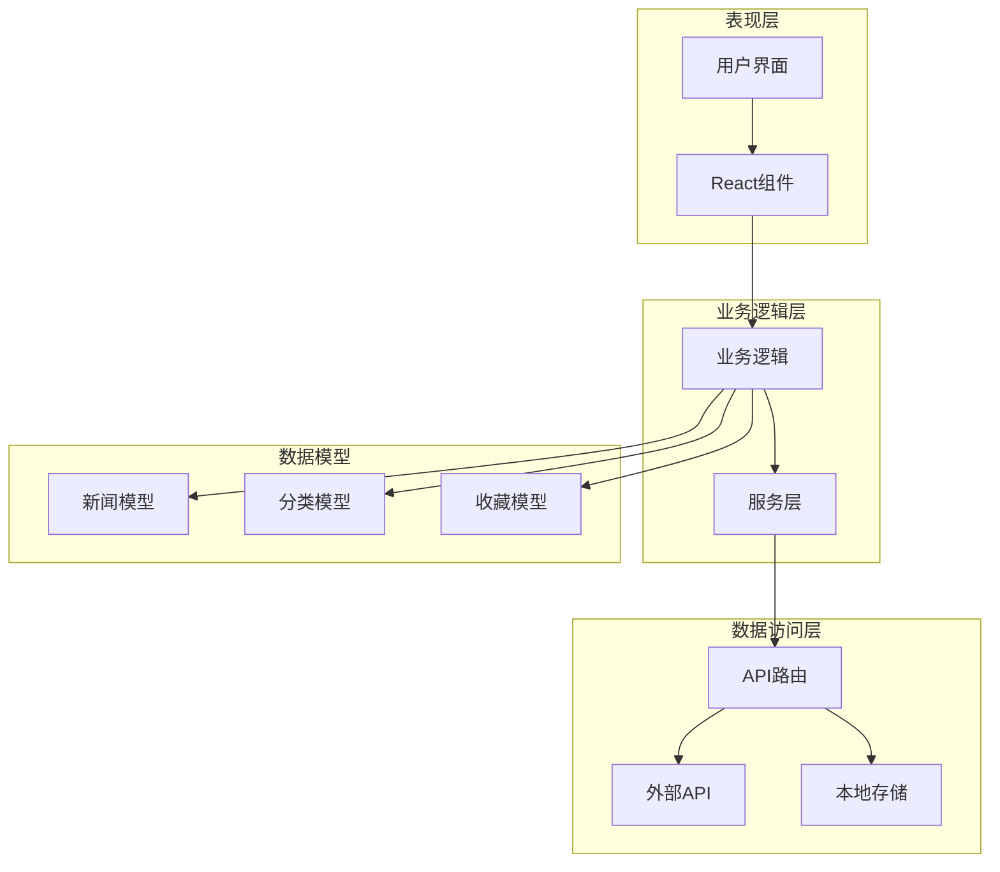

**图表来源**
- [app/page.tsx](file://app/page.tsx#L19-L63)
- [app/api/news/route.ts](file://app/api/news/route.ts#L39-L135)
- [lib/brave-search.ts](file://lib/brave-search.ts#L30-L115)
- [lib/favorites.ts](file://lib/favorites.ts#L7-L28)

### 组件树结构图

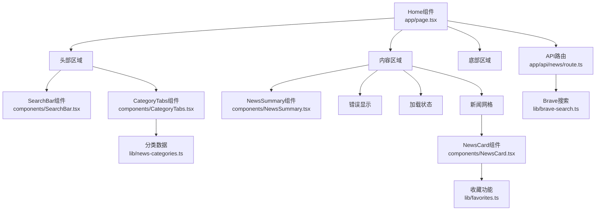

**图表来源**
- [app/page.tsx](file://app/page.tsx#L73-L152)
- [components/NewsCard.tsx](file://components/NewsCard.tsx#L29-L87)
- [components/CategoryTabs.tsx](file://components/CategoryTabs.tsx#L18-L47)
- [components/SearchBar.tsx](file://components/SearchBar.tsx#L19-L35)
- [components/NewsSummary.tsx](file://components/NewsSummary.tsx#L10-L53)

## 详细组件分析

### 主页面组件 (Home) 详细分析

主页面组件实现了复杂的状态管理和数据流控制：

#### 状态管理机制

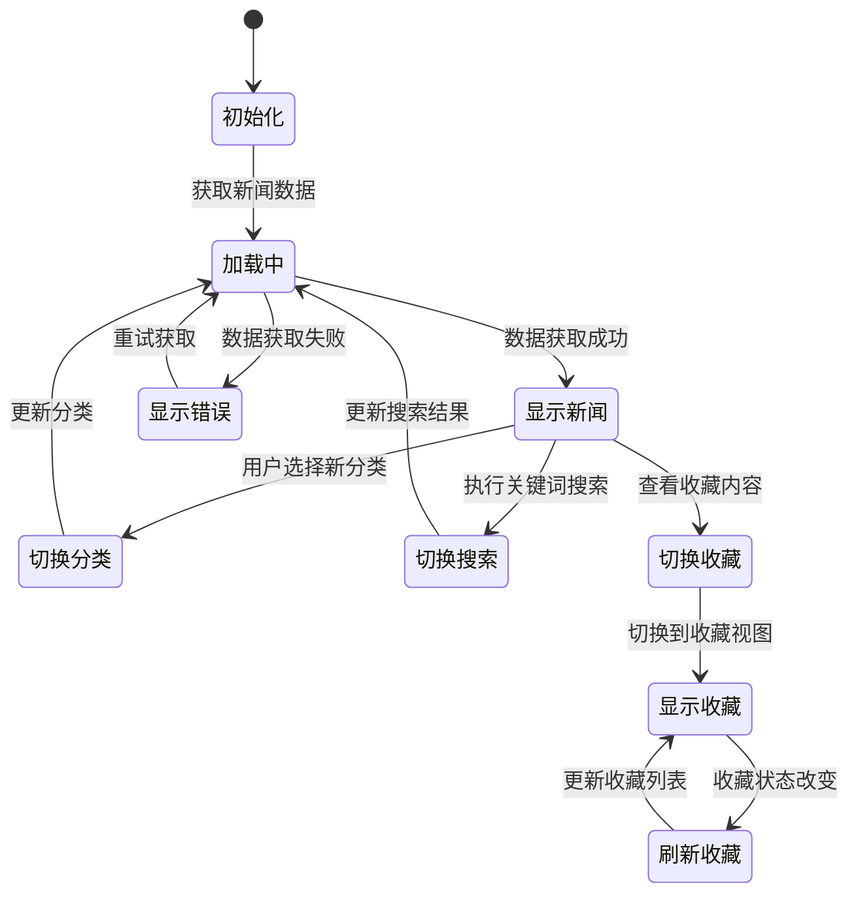

**图表来源**
- [app/page.tsx](file://app/page.tsx#L19-L63)

#### 数据获取流程

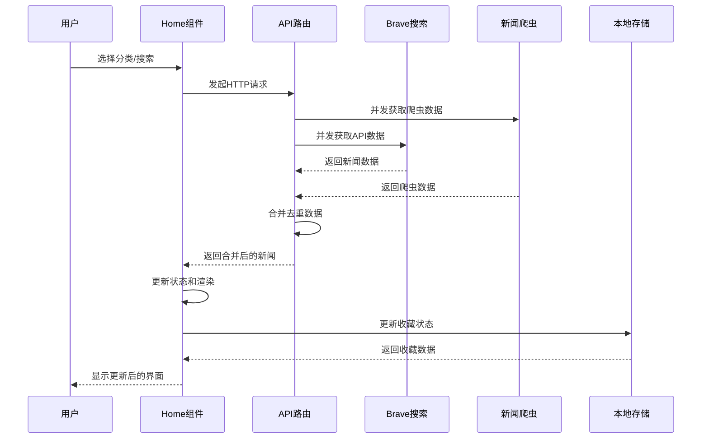

**图表来源**
- [app/page.tsx](file://app/page.tsx#L19-L42)
- [app/api/news/route.ts](file://app/api/news/route.ts#L39-L135)

**章节来源**
- [app/page.tsx](file://app/page.tsx#L11-L153)

### NewsCard 组件分析

NewsCard组件实现了独立的收藏功能，采用本地状态管理：

#### 收藏状态管理

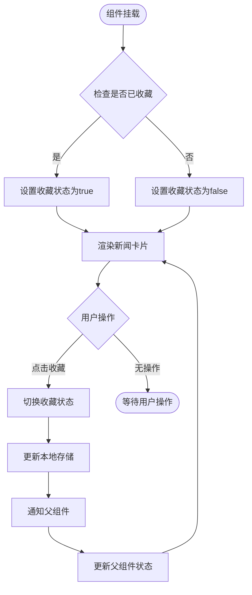

**图表来源**
- [components/NewsCard.tsx](file://components/NewsCard.tsx#L15-L27)

**章节来源**
- [components/NewsCard.tsx](file://components/NewsCard.tsx#L12-L89)
- [lib/favorites.ts](file://lib/favorites.ts#L13-L28)

### CategoryTabs 组件分析

CategoryTabs组件提供了分类导航和收藏切换功能：

#### 交互流程

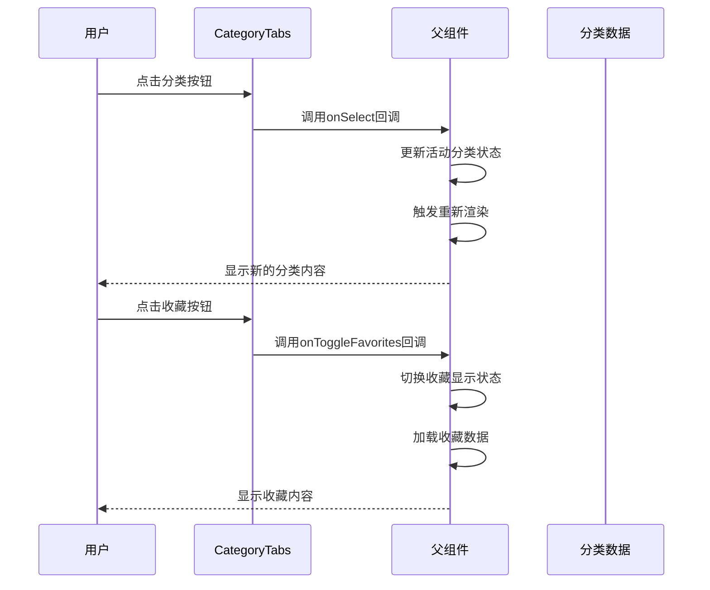

**图表来源**
- [components/CategoryTabs.tsx](file://components/CategoryTabs.tsx#L23-L45)
- [lib/news-categories.ts](file://lib/news-categories.ts#L7-L44)

**章节来源**
- [components/CategoryTabs.tsx](file://components/CategoryTabs.tsx#L12-L49)
- [lib/news-categories.ts](file://lib/news-categories.ts#L1-L45)

### SearchBar 组件分析

SearchBar组件实现了简洁的搜索功能：

#### 表单处理流程

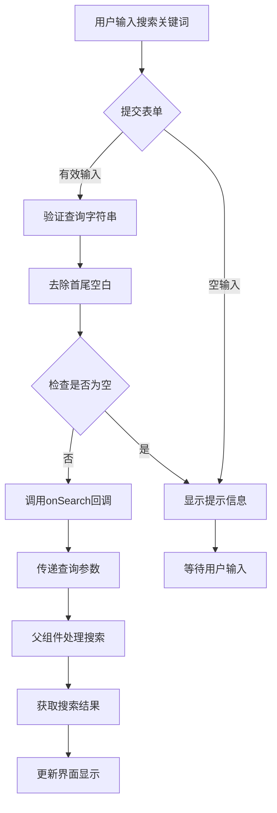

**图表来源**
- [components/SearchBar.tsx](file://components/SearchBar.tsx#L12-L17)

**章节来源**
- [components/SearchBar.tsx](file://components/SearchBar.tsx#L9-L37)

### 数据流向图

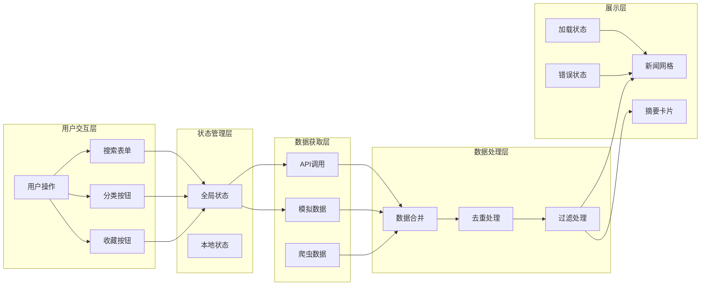

**图表来源**
- [app/page.tsx](file://app/page.tsx#L19-L65)
- [app/api/news/route.ts](file://app/api/news/route.ts#L13-L37)
- [lib/brave-search.ts](file://lib/brave-search.ts#L30-L73)

## 依赖关系分析

### 组件依赖图

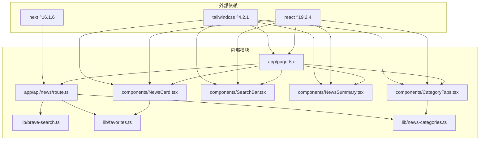

**图表来源**
- [package.json](file://package.json#L15-L28)
- [app/page.tsx](file://app/page.tsx#L6-L8)
- [components/NewsCard.tsx](file://components/NewsCard.tsx#L5)
- [components/CategoryTabs.tsx](file://components/CategoryTabs.tsx#L3)
- [components/SearchBar.tsx](file://components/SearchBar.tsx#L3)
- [components/NewsSummary.tsx](file://components/NewsSummary.tsx#L3)
- [app/api/news/route.ts](file://app/api/news/route.ts#L2-L5)
- [lib/brave-search.ts](file://lib/brave-search.ts#L27-L28)
- [lib/favorites.ts](file://lib/favorites.ts#L5)
- [lib/news-categories.ts](file://lib/news-categories.ts#L1-L5)

### 数据模型关系

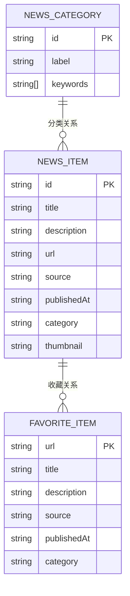

**图表来源**
- [lib/brave-search.ts](file://lib/brave-search.ts#L1-L10)
- [lib/news-categories.ts](file://lib/news-categories.ts#L1-L5)
- [lib/favorites.ts](file://lib/favorites.ts#L3-L11)

**章节来源**
- [package.json](file://package.json#L15-L28)

## 性能考虑

### 并发数据获取

系统采用了并发数据获取策略来优化性能：

- **并行API调用**: 使用Promise.all同时获取Brave搜索API和新闻爬虫数据
- **缓存策略**: 利用浏览器缓存和React状态缓存减少重复请求
- **懒加载**: 新闻卡片组件按需渲染，避免一次性渲染大量DOM元素

### 内存管理

- **状态提升**: 将共享状态提升到Home组件，避免重复状态管理
- **组件卸载**: 正确处理组件卸载时的状态清理
- **事件监听**: 在useEffect中正确清理事件监听器

### 渲染优化

- **条件渲染**: 根据状态选择性渲染组件，避免不必要的DOM操作
- **虚拟滚动**: 对于大量新闻数据，可考虑实现虚拟滚动
- **防抖处理**: 搜索功能使用防抖技术减少频繁的API调用

## 故障排除指南

### 常见问题及解决方案

#### API密钥配置问题

**问题**: 获取新闻失败，显示API密钥配置错误

**原因**: 
- BRAVE_API_KEY环境变量未正确设置
- API密钥无效或过期
- 网络连接问题

**解决方案**:
1. 检查.env.local文件中的API密钥配置
2. 确认API密钥具有足够的权限
3. 验证网络连接是否正常
4. 查看浏览器开发者工具的网络面板

#### 数据获取超时

**问题**: 新闻数据加载缓慢或超时

**原因**:
- Brave API响应时间过长
- 网络延迟
- 服务器负载过高

**解决方案**:
1. 实现请求超时机制
2. 添加重试逻辑
3. 使用缓存策略
4. 降级到模拟数据

#### 收藏功能异常

**问题**: 收藏或取消收藏操作失败

**原因**:
- 本地存储不可用
- URL匹配逻辑错误
- 状态更新不及时

**解决方案**:
1. 检查浏览器的本地存储设置
2. 验证URL格式和唯一性
3. 确保状态更新回调正确执行
4. 添加错误边界处理

**章节来源**
- [app/api/news/route.ts](file://app/api/news/route.ts#L7-L11)
- [app/page.tsx](file://app/page.tsx#L30-L35)
- [lib/favorites.ts](file://lib/favorites.ts#L8-L11)

## 结论

本项目展示了现代React应用的优秀实践，通过清晰的组件分层和合理的状态管理实现了功能完整、性能优良的新闻聚合网站。

### 设计优势

1. **模块化设计**: 组件职责明确，易于维护和扩展
2. **状态管理**: 采用状态提升和事件回调的组合模式
3. **数据流**: 单向数据流确保了数据的一致性和可预测性
4. **错误处理**: 完善的错误处理机制提升了用户体验
5. **性能优化**: 并发数据获取和条件渲染优化了应用性能

### 改进建议

1. **类型安全**: 可以进一步增强TypeScript类型定义
2. **测试覆盖**: 添加单元测试和集成测试
3. **国际化**: 支持多语言界面
4. **SEO优化**: 添加meta标签和结构化数据
5. **离线支持**: 实现Service Worker进行离线缓存

该组件关系设计文档为开发者提供了全面的技术参考，有助于理解系统的架构设计和组件间的协作关系。