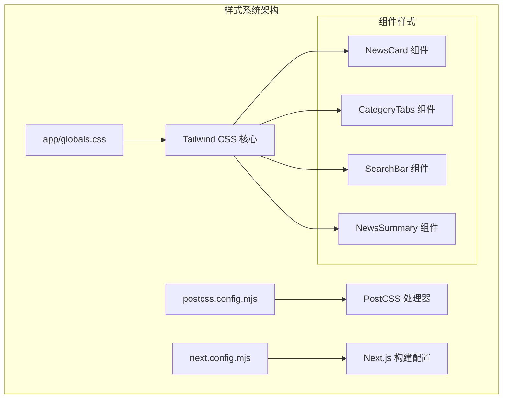
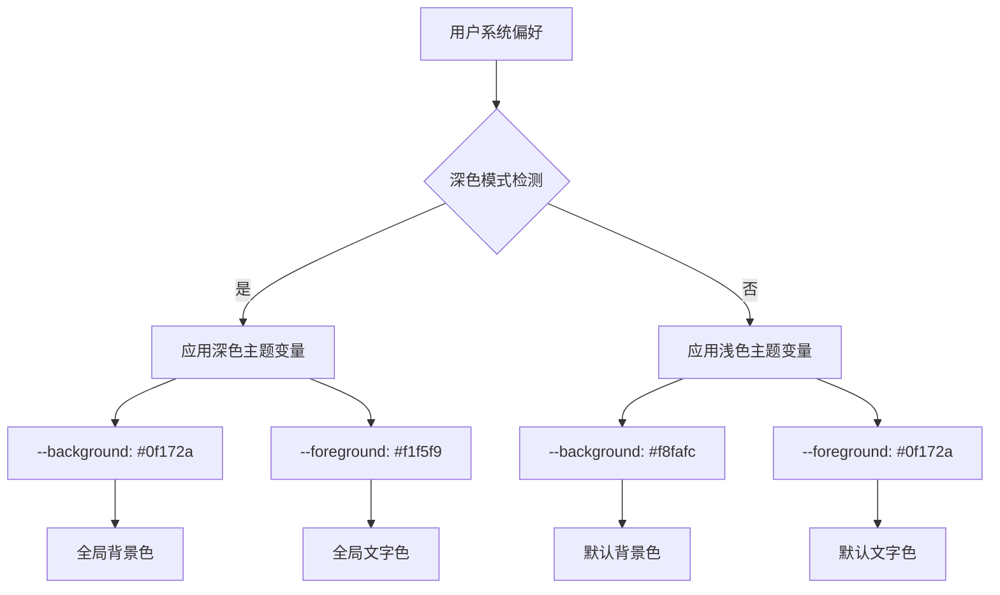
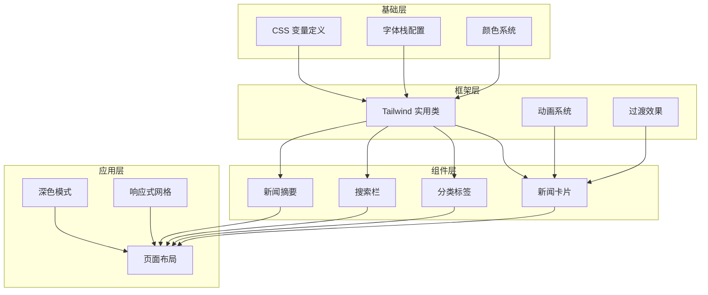
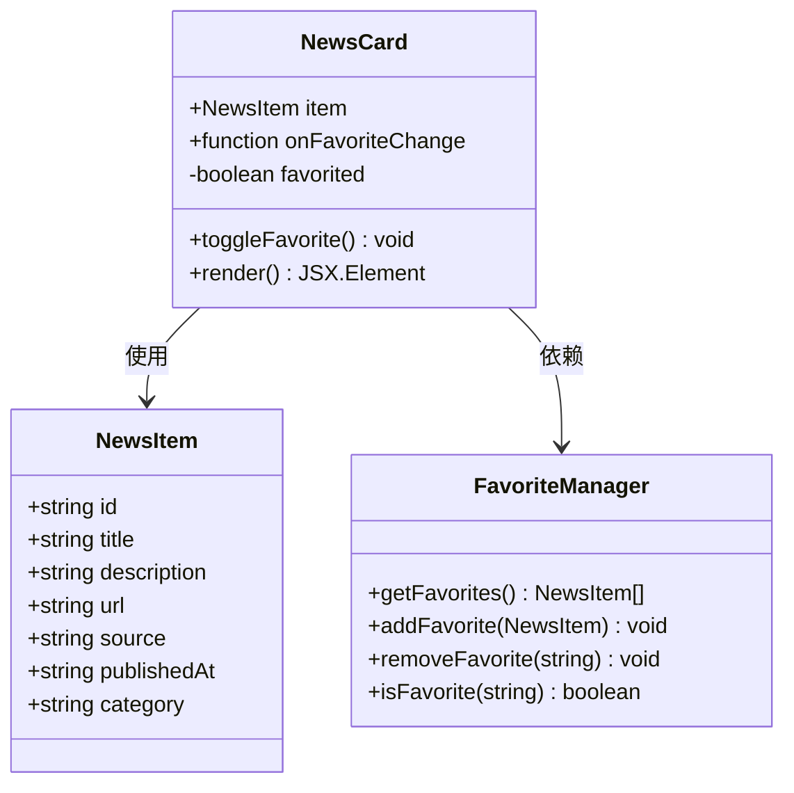
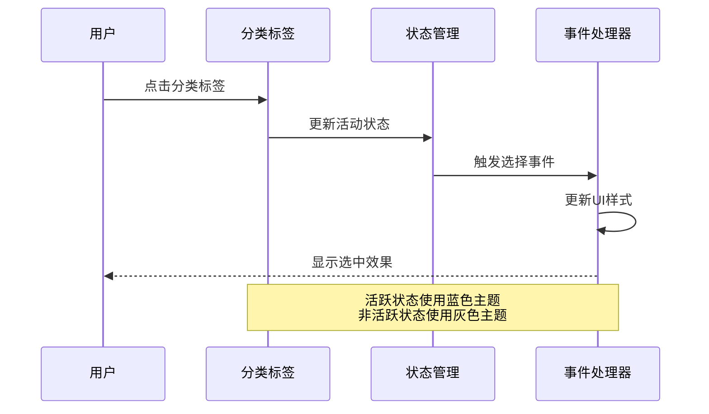
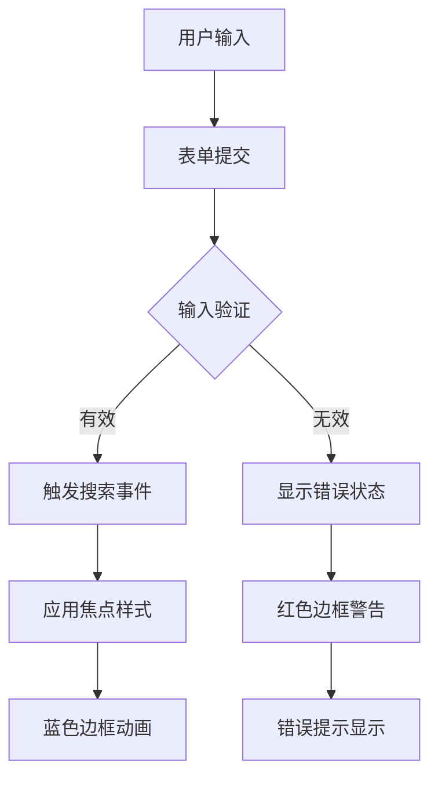
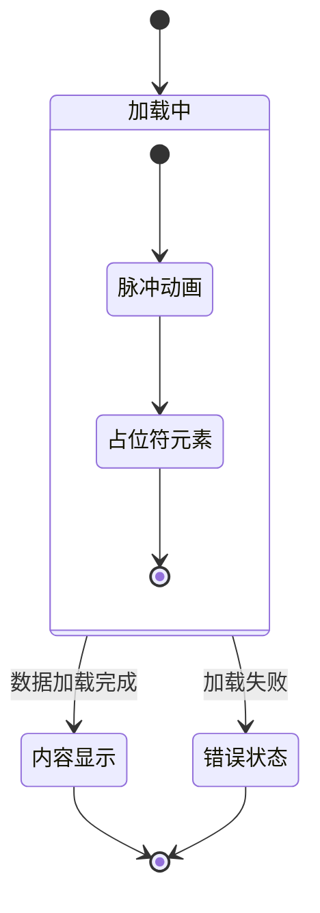
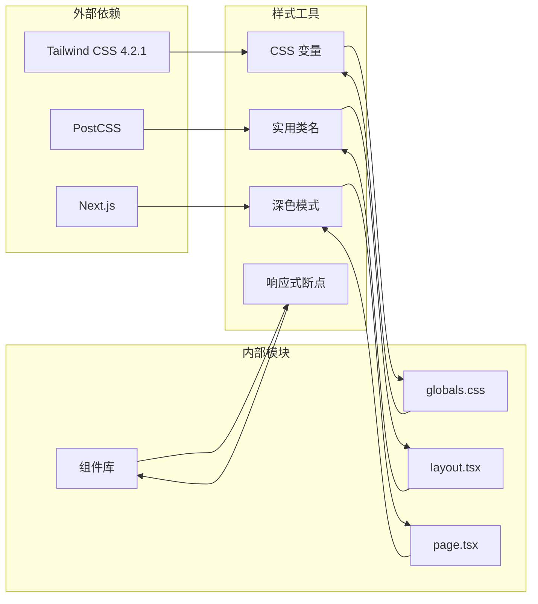

# 样式和主题系统

<cite>
**本文档引用的文件**
- [app/globals.css](file://app/globals.css)
- [next.config.mjs](file://next.config.mjs)
- [postcss.config.mjs](file://postcss.config.mjs)
- [package.json](file://package.json)
- [app/layout.tsx](file://app/layout.tsx)
- [app/page.tsx](file://app/page.tsx)
- [components/NewsCard.tsx](file://components/NewsCard.tsx)
- [components/CategoryTabs.tsx](file://components/CategoryTabs.tsx)
- [components/SearchBar.tsx](file://components/SearchBar.tsx)
- [components/NewsSummary.tsx](file://components/NewsSummary.tsx)
- [lib/brave-search.ts](file://lib/brave-search.ts)
- [lib/favorites.ts](file://lib/favorites.ts)
- [lib/news-categories.ts](file://lib/news-categories.ts)
</cite>

## 目录
1. [简介](#简介)
2. [项目结构](#项目结构)
3. [核心组件](#核心组件)
4. [架构概览](#架构概览)
5. [详细组件分析](#详细组件分析)
6. [依赖关系分析](#依赖关系分析)
7. [性能考虑](#性能考虑)
8. [故障排除指南](#故障排除指南)
9. [结论](#结论)

## 简介

本项目采用现代化的样式和主题系统，基于 Tailwind CSS 构建，实现了完整的响应式设计和深色模式支持。系统通过 CSS 变量管理主题色彩，结合 Tailwind 的实用类名系统，为新闻网站提供了统一且可扩展的视觉设计解决方案。

## 项目结构

项目采用 Next.js 应用程序目录结构，样式系统主要分布在以下位置：

**图表来源**
- [app/globals.css](file://app/globals.css#L1-L22)
- [postcss.config.mjs](file://postcss.config.mjs#L1-L7)
- [next.config.mjs](file://next.config.mjs#L1-L9)

**章节来源**
- [app/globals.css](file://app/globals.css#L1-L22)
- [postcss.config.mjs](file://postcss.config.mjs#L1-L7)
- [next.config.mjs](file://next.config.mjs#L1-L9)

## 核心组件

### Tailwind CSS 配置系统

项目使用 Tailwind CSS 4.2.1 版本，通过 PostCSS 插件进行构建处理。配置文件定义了标准的 Tailwind 工作流程，包括基础样式导入、组件样式生成和实用类名系统。

### CSS 变量主题系统

系统采用 CSS 自定义属性实现主题管理，支持自动深色模式检测：

**图表来源**
- [app/globals.css](file://app/globals.css#L3-L13)

### 响应式设计原则

系统遵循移动优先的设计理念，通过 Tailwind 的响应式前缀实现多设备适配：

- 移动设备：基础网格布局，单列显示
- 平板设备：双列网格布局
- 桌面设备：三列网格布局

**章节来源**
- [app/globals.css](file://app/globals.css#L15-L21)
- [app/layout.tsx](file://app/layout.tsx#L16-L16)
- [app/page.tsx](file://app/page.tsx#L115-L139)

## 架构概览

样式系统采用分层架构，从底层的基础样式到上层的组件样式形成完整的层次结构：

**图表来源**
- [app/globals.css](file://app/globals.css#L1-L22)
- [components/NewsCard.tsx](file://components/NewsCard.tsx#L29-L86)
- [components/CategoryTabs.tsx](file://components/CategoryTabs.tsx#L18-L46)

## 详细组件分析

### 新闻卡片组件 (NewsCard)

新闻卡片组件展示了完整的样式实现模式，包括状态管理和交互效果：

**图表来源**
- [components/NewsCard.tsx](file://components/NewsCard.tsx#L7-L27)
- [lib/brave-search.ts](file://lib/brave-search.ts#L1-L10)
- [lib/favorites.ts](file://lib/favorites.ts#L1-L29)

组件特性：
- **收藏功能**：使用状态管理实现收藏切换
- **深色模式支持**：通过 `dark:` 前缀类实现主题适配
- **悬停效果**：利用 `hover:` 类实现交互反馈
- **过渡动画**：使用 `transition-*` 类实现平滑动画

### 分类标签组件 (CategoryTabs)

分类标签组件实现了动态样式切换和用户交互：

**图表来源**
- [components/CategoryTabs.tsx](file://components/CategoryTabs.tsx#L18-L46)

**章节来源**
- [components/NewsCard.tsx](file://components/NewsCard.tsx#L1-L89)
- [components/CategoryTabs.tsx](file://components/CategoryTabs.tsx#L1-L49)

### 搜索栏组件 (SearchBar)

搜索栏组件展示了表单控件的完整样式实现：

**图表来源**
- [components/SearchBar.tsx](file://components/SearchBar.tsx#L12-L17)

**章节来源**
- [components/SearchBar.tsx](file://components/SearchBar.tsx#L1-L37)

### 新闻摘要组件 (NewsSummary)

新闻摘要组件实现了加载状态的视觉反馈：

**图表来源**
- [components/NewsSummary.tsx](file://components/NewsSummary.tsx#L11-L23)

**章节来源**
- [components/NewsSummary.tsx](file://components/NewsSummary.tsx#L1-L54)

## 依赖关系分析

样式系统的依赖关系形成了清晰的层次结构：

**图表来源**
- [package.json](file://package.json#L15-L29)
- [postcss.config.mjs](file://postcss.config.mjs#L1-L7)

**章节来源**
- [package.json](file://package.json#L1-L30)
- [postcss.config.mjs](file://postcss.config.mjs#L1-L7)

## 性能考虑

### 样式优化策略

1. **按需加载**：通过 Next.js 的自动代码分割，确保样式只在需要时加载
2. **CSS 变量缓存**：使用 CSS 自定义属性减少重复计算
3. **动画性能**：优先使用 transform 和 opacity 属性实现硬件加速
4. **响应式优化**：合理使用媒体查询，避免过度嵌套

### 构建优化

- **Tree Shaking**：移除未使用的样式类
- **压缩优化**：生产环境自动压缩 CSS 文件
- **缓存策略**：利用浏览器缓存机制提升加载速度

## 故障排除指南

### 常见问题及解决方案

1. **深色模式不生效**
   - 检查系统偏好设置中的深色模式选项
   - 确认 CSS 变量正确配置
   - 验证 `dark:` 前缀类的使用

2. **响应式布局异常**
   - 检查断点设置是否正确
   - 确认容器宽度配置
   - 验证网格系统的使用

3. **动画效果卡顿**
   - 检查动画属性的性能影响
   - 优化动画持续时间和缓动函数
   - 避免频繁的重排重绘

**章节来源**
- [app/globals.css](file://app/globals.css#L8-L13)
- [app/page.tsx](file://app/page.tsx#L115-L139)

## 结论

本样式和主题系统通过 Tailwind CSS 的实用类名系统和 CSS 变量的结合，实现了高度可定制和响应式的视觉设计。系统支持自动深色模式检测，提供了完整的组件样式隔离方案，并通过合理的性能优化确保了良好的用户体验。

系统的主要优势包括：
- 统一的主题管理机制
- 完整的响应式设计支持
- 高效的组件样式隔离
- 良好的性能表现
- 易于维护和扩展的架构