# AI实验室模块

<cite>
**本文档引用的文件**
- [app/ai-lab/page.tsx](file://app/ai-lab/page.tsx)
- [app/ai-lab/product-swap/page.tsx](file://app/ai-lab/product-swap/page.tsx)
- [app/api/ai-lab/generate-desc/route.ts](file://app/api/ai-lab/generate-desc/route.ts)
- [app/api/ai-lab/generate-video/route.ts](file://app/api/ai-lab/generate-video/route.ts)
- [app/api/ai-lab/generate-video/status/route.ts](file://app/api/ai-lab/generate-video/status/route.ts)
- [app/api/ai-lab/history/route.ts](file://app/api/ai-lab/history/route.ts)
- [app/api/ai-lab/translate/route.ts](file://app/api/ai-lab/translate/route.ts)
- [app/api/ai-lab/upload/route.ts](file://app/api/ai-lab/upload/route.ts)
- [app/api/ai-lab/generate-tts/route.ts](file://app/api/ai-lab/generate-tts/route.ts)
- [lib/aliyun/dashscope.ts](file://lib/aliyun/dashscope.ts)
- [lib/aliyun/storage.ts](file://lib/aliyun/storage.ts)
- [lib/video-tasks.ts](file://lib/video-tasks.ts)
- [lib/ffmpeg-merge.ts](file://lib/ffmpeg-merge.ts)
- [lib/brave-search.ts](file://lib/brave-search.ts)
- [lib/news-scraper.ts](file://lib/news-scraper.ts)
- [lib/translator.ts](file://lib/translator.ts)
- [lib/mock-data.ts](file://lib/mock-data.ts)
- [lib/favorites.ts](file://lib/favorites.ts)
- [config/news-sources.json](file://config/news-sources.json)
- [app/api/news/route.ts](file://app/api/news/route.ts)
- [app/api/news/sources/route.ts](file://app/api/news/sources/route.ts)
- [components/NewsCard.tsx](file://components/NewsCard.tsx)
- [components/SearchBar.tsx](file://components/SearchBar.tsx)
- [components/CategoryTabs.tsx](file://components/CategoryTabs.tsx)
- [components/NewsSummary.tsx](file://components/NewsSummary.tsx)
- [app/globals.css](file://app/globals.css)
- [package.json](file://package.json)
</cite>

## 更新摘要
**所做更改**
- 新增图像到视频(i2v)模式，支持基于图片生成动态视频
- 增强视频时长控制功能，支持2-15秒的灵活时长设置
- 新增智能配音生成系统，支持AI语音合成和视频时长匹配
- 优化历史记录管理，新增i2v模式支持和视频时长显示
- 增强视频生成管道，支持多种DashScope模型和音频合并
- 新增FFmpeg音频合并功能，实现原视频音频与AI视频的完美融合

## 目录
1. [项目概述](#项目概述)
2. [项目结构](#项目结构)
3. [核心组件](#核心组件)
4. [架构概览](#架构概览)
5. [详细组件分析](#详细组件分析)
6. [DashScope集成](#dashscope集成)
7. [视频换人功能](#视频换人功能)
8. [AI内容分析](#ai内容分析)
9. [文件上传系统](#文件上传系统)
10. [视频生成管道](#视频生成管道)
11. [历史记录管理](#历史记录管理)
12. [步骤指示器系统](#步骤指示器系统)
13. [分享功能集成](#分享功能集成)
14. [视频下载功能](#视频下载功能)
15. [图像到视频(i2v)模式](#图像到视频i2v模式)
16. [视频时长控制](#视频时长控制)
17. [智能配音生成](#智能配音生成)
18. [FFmpeg音频合并](#ffmpeg音频合并)
19. [依赖关系分析](#依赖关系分析)
20. [性能考虑](#性能考虑)
21. [故障排除指南](#故障排除指南)
22. [结论](#结论)

## 项目概述

AI实验室模块是一个集成了多种AI功能的综合性平台，现已完成从纯前端模拟到生产级API集成的重大升级。该模块的核心特色包括AI爆品替换、DashScope通义千问集成、文件上传系统、视频生成管道、历史记录管理等创新功能，旨在帮助用户快速制作高质量的电商推广内容。

**更新** 本次重大升级引入了完整的后端API系统，包括AI文案生成、翻译服务、文件存储、视频处理等核心功能，从前端纯模拟迁移到真实的生产级服务集成。特别新增了**图像到视频(i2v)模式**、**视频时长控制**、**智能配音生成**和**FFmpeg音频合并**四大核心增强功能，标志着AI实验室模块正式进入生产级应用阶段。

图像到视频(i2v)模式基于DashScope的wanx2.1-i2v-turbo和wan2.6-i2v-flash模型，能够将静态图片转换为动态视频，支持2-15秒的灵活时长设置。智能配音生成系统集成了MS Edge TTS引擎，能够根据视频时长自动裁剪文案并生成匹配时长的语音。FFmpeg音频合并功能实现了原视频音频与AI生成视频的无缝融合，提升了最终视频的专业度。

## 项目结构

项目采用模块化的目录结构，主要分为以下几个核心部分：

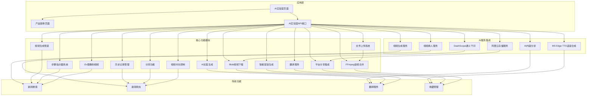

**图表来源**
- [app/ai-lab/page.tsx:1-130](file://app/ai-lab/page.tsx#L1-L130)
- [app/ai-lab/product-swap/page.tsx:1-1135](file://app/ai-lab/product-swap/page.tsx#L1-L1135)
- [lib/aliyun/dashscope.ts:1-586](file://lib/aliyun/dashscope.ts#L1-L586)

**章节来源**
- [app/ai-lab/page.tsx:1-130](file://app/ai-lab/page.tsx#L1-L130)
- [package.json:1-30](file://package.json#L1-L30)

## 核心组件

### AI实验室主页

AI实验室主页提供了统一的入口界面，展示了各种AI功能模块。当前主要包含"AI爆品替换"功能，其他功能如"AI图像生成"处于即将上线状态。

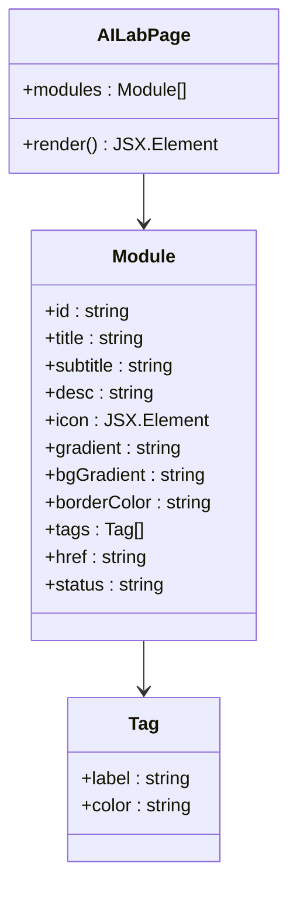

**图表来源**
- [app/ai-lab/page.tsx:5-47](file://app/ai-lab/page.tsx#L5-L47)

### 产品替换功能

产品替换功能是AI实验室的核心模块，现已完全迁移到生产级API集成，并重构为现代化的步骤指示器系统：

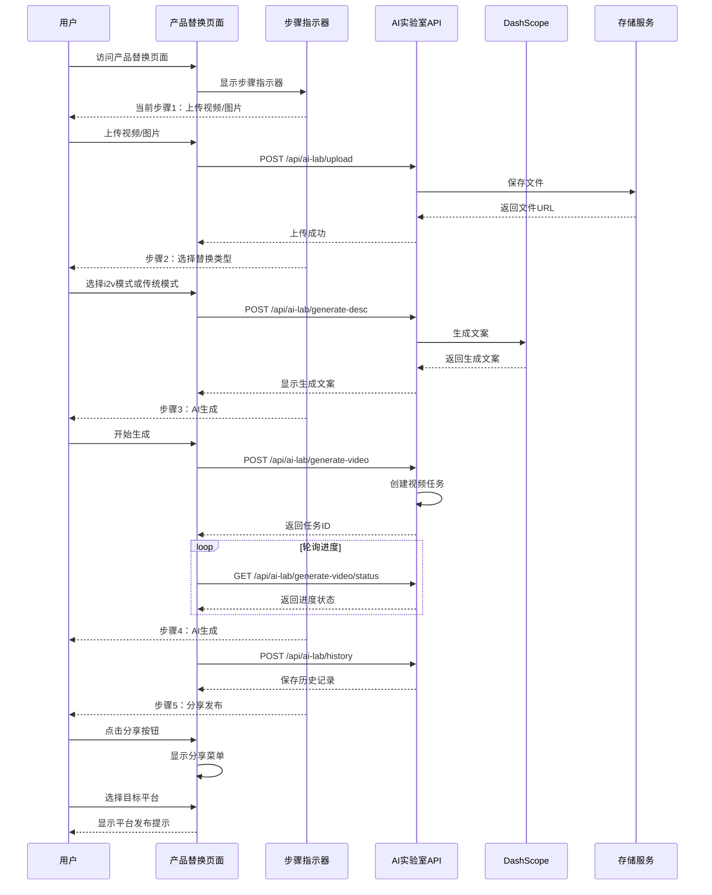

**图表来源**
- [app/ai-lab/product-swap/page.tsx:306-349](file://app/ai-lab/product-swap/page.tsx#L306-L349)
- [app/ai-lab/product-swap/page.tsx:134-288](file://app/ai-lab/product-swap/page.tsx#L134-L288)
- [app/api/ai-lab/upload/route.ts:1-55](file://app/api/ai-lab/upload/route.ts#L1-L55)
- [app/api/ai-lab/generate-desc/route.ts:1-26](file://app/api/ai-lab/generate-desc/route.ts#L1-L26)
- [app/api/ai-lab/generate-video/route.ts:1-120](file://app/api/ai-lab/generate-video/route.ts#L1-L120)
- [app/api/ai-lab/generate-video/status/route.ts:1-114](file://app/api/ai-lab/generate-video/status/route.ts#L1-L114)
- [app/api/ai-lab/history/route.ts:1-139](file://app/api/ai-lab/history/route.ts#L1-L139)

**章节来源**
- [app/ai-lab/page.tsx:1-130](file://app/ai-lab/page.tsx#L1-L130)
- [app/ai-lab/product-swap/page.tsx:1-1135](file://app/ai-lab/product-swap/page.tsx#L1-L1135)

## 架构概览

整个AI实验室模块采用了分层架构设计，现已完全迁移到生产级API集成：

```mermaid
graph TB
subgraph "表现层"
A[AI实验室页面]
B[产品替换页面]
C[新闻展示组件]
D[步骤指示器组件]
E[分享菜单组件]
F[下载按钮组件]
G[视频时长控制器]
H[智能配音生成器]
end
subgraph "业务逻辑层"
I[AI实验室API处理]
J[DashScope集成]
K[文件上传处理]
L[视频生成管理]
M[历史记录服务]
N[AI文案生成]
O[翻译服务]
P[视频换人处理]
Q[内容分析处理]
R[Blob下载处理]
S[平台分享处理]
T[i2v图像到视频]
U[视频时长控制]
V[智能配音生成]
W[FFmpeg音频合并]
end
subgraph "数据访问层"
X[阿里云存储]
Y[本地文件系统]
Z[内存任务队列]
AA[本地JSON存储]
BB[通义千问API]
CC[万相视频API]
DD[视频换人API]
EE[视觉分析API]
FF[Blob存储]
GG[平台链接]
HH[i2v模型API]
II[TTS语音API]
JJ[FFmpeg处理]
end
subgraph "传统功能"
KK[新闻搜索API]
LL[新闻爬虫系统]
MM[翻译服务]
NN[收藏管理]
end
A --> I
B --> J
C --> K
D --> I
E --> I
F --> R
G --> U
H --> V
I --> X
I --> Y
I --> Z
I --> AA
I --> BB
I --> CC
I --> DD
I --> EE
I --> FF
I --> GG
I --> HH
I --> II
I --> JJ
J --> KK
K --> LL
L --> MM
M --> NN
N --> OO[OpenAI客户端]
O --> PP[营销文案翻译]
P --> QQ[视频换人模型]
Q --> RR[视觉分析模型]
R --> SS[Blob API]
S --> TT[平台集成]
T --> UU[i2v模型]
V --> WW[TTS引擎]
W --> XX[FFmpeg]
```

**图表来源**
- [app/api/ai-lab/generate-desc/route.ts:1-26](file://app/api/ai-lab/generate-desc/route.ts#L1-L26)
- [lib/aliyun/dashscope.ts:1-586](file://lib/aliyun/dashscope.ts#L1-L586)
- [lib/aliyun/storage.ts:1-60](file://lib/aliyun/storage.ts#L1-L60)
- [lib/video-tasks.ts:1-35](file://lib/video-tasks.ts#L1-L35)
- [lib/ffmpeg-merge.ts:1-157](file://lib/ffmpeg-merge.ts#L1-L157)

## 详细组件分析

### 新闻搜索系统

新闻搜索系统保持原有功能，继续作为传统功能模块存在：

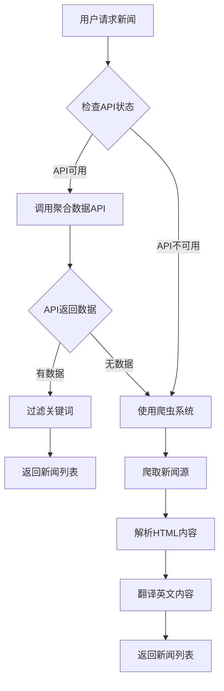

**图表来源**
- [app/api/news/route.ts:16-57](file://app/api/news/route.ts#L16-L57)
- [lib/news-scraper.ts:304-353](file://lib/news-scraper.ts#L304-L353)

**章节来源**
- [lib/brave-search.ts:1-115](file://lib/brave-search.ts#L1-L115)
- [app/api/news/route.ts:16-57](file://app/api/news/route.ts#L16-L57)

## DashScope集成

### 通义千问AI服务

DashScope集成提供了强大的AI服务能力，包括文案生成、翻译功能和视频生成服务：

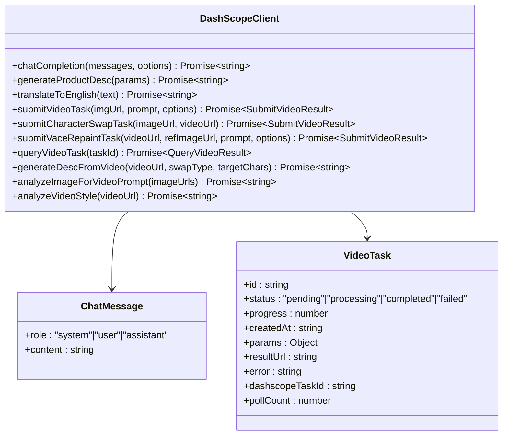

**图表来源**
- [lib/aliyun/dashscope.ts:8-30](file://lib/aliyun/dashscope.ts#L8-L30)
- [lib/video-tasks.ts:6-21](file://lib/video-tasks.ts#L6-L21)

### AI文案生成

系统集成了DashScope的通义千问模型，提供智能的商品推广文案生成：

| 功能特性 | 实现方式 | 性能特点 |
|---------|----------|----------|
| 多场景文案生成 | 支持商品、服饰、模特三种类型 | 基于上下文理解 |
| 营销话术优化 | 专业电商文案专家角色 | 生成内容符合营销规范 |
| 多语言支持 | 中文到英文自动翻译 | 保持营销风格一致 |
| 模板化输出 | 结构化列表格式 | 提高可读性和吸引力 |
| 时长匹配 | 根据视频时长自动裁剪文案 | 确保配音与视频完美匹配 |

**更新** DashScope集成现已支持完整的视频生成服务，包括任务提交、状态查询和结果获取，新增了i2v模式支持和视频时长控制功能。

**章节来源**
- [lib/aliyun/dashscope.ts:35-76](file://lib/aliyun/dashscope.ts#L35-L76)

### 翻译服务

翻译服务模块提供了专业的中英文营销文案互译功能：

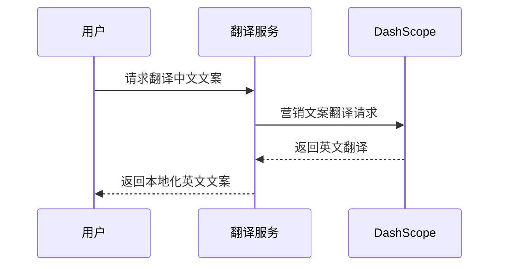

**图表来源**
- [lib/aliyun/dashscope.ts:128-147](file://lib/aliyun/dashscope.ts#L128-L147)

**章节来源**
- [lib/translator.ts:1-132](file://lib/translator.ts#L1-L132)

## 视频换人功能

### 视频换人技术

**新增功能** 视频换人功能是本次更新的核心增强，基于DashScope的wan2.2-animate-mix模型，能够将视频中的角色替换为指定图片中的人物：

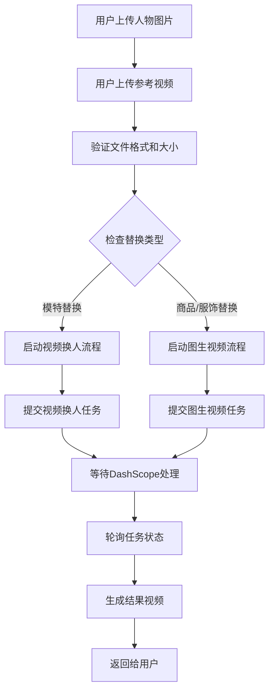

**图表来源**
- [app/api/ai-lab/generate-video/route.ts:42-56](file://app/api/ai-lab/generate-video/route.ts#L42-L56)
- [lib/aliyun/dashscope.ts:221-262](file://lib/aliyun/dashscope.ts#L221-L262)

### 视频换人模型

系统支持两种视频换人模式：

| 模式 | 模型名称 | 特点 | 适用场景 |
|------|----------|------|----------|
| 标准模式 | wan-std | 基础视频换人功能 | 一般人物替换需求 |
| 高质量模式 | wan-high | 更高的视频质量 | 对画质要求较高的场景 |

### 视频换人流程

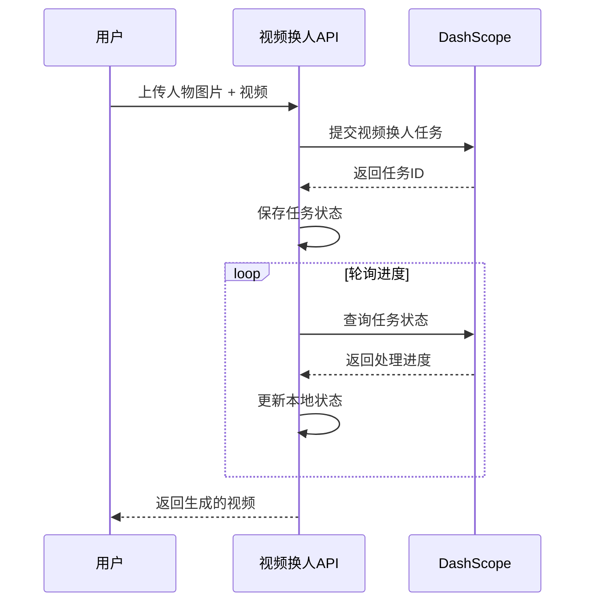

**图表来源**
- [app/api/ai-lab/generate-video/route.ts:42-56](file://app/api/ai-lab/generate-video/route.ts#L42-L56)
- [lib/aliyun/dashscope.ts:221-262](file://lib/aliyun/dashscope.ts#L221-L262)

**章节来源**
- [app/api/ai-lab/generate-video/route.ts:42-56](file://app/api/ai-lab/generate-video/route.ts#L42-L56)
- [lib/aliyun/dashscope.ts:221-262](file://lib/aliyun/dashscope.ts#L221-L262)

## AI内容分析

### 视觉内容分析

**新增功能** AI内容分析功能基于qwen-vl-max视觉语言模型，能够分析视频内容并生成精准的推广文案：

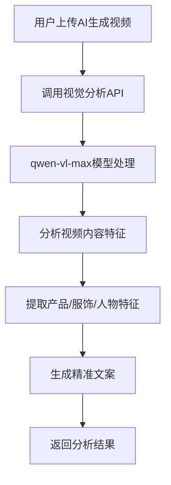

**图表来源**
- [lib/aliyun/dashscope.ts:81-123](file://lib/aliyun/dashscope.ts#L81-L123)

### 内容分析能力

系统能够分析以下视频内容特征：

| 分析维度 | 能力描述 | 应用场景 |
|----------|----------|----------|
| 产品特征 | 识别产品外观、颜色、材质等 | 商品推广文案生成 |
| 服饰特征 | 识别服装款式、搭配、风格等 | 服饰展示文案生成 |
| 人物特征 | 识别模特特征、动作、表情等 | 模特展示文案生成 |
| 场景氛围 | 识别拍摄场景、光线、色调等 | 整体视频氛围描述 |

### 文案生成流程

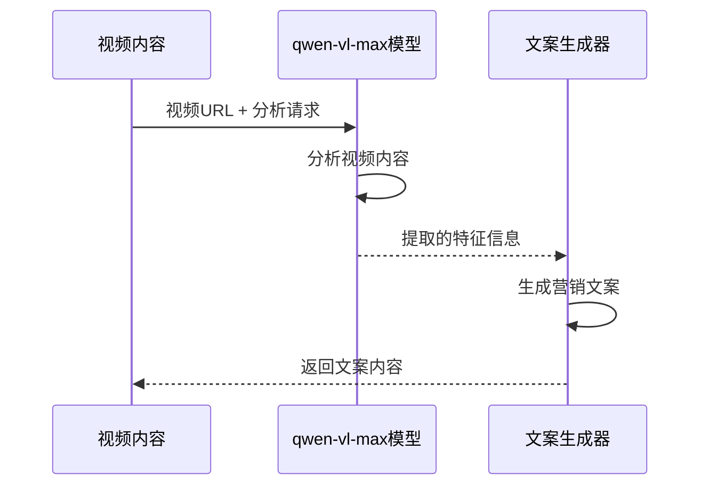

**图表来源**
- [lib/aliyun/dashscope.ts:81-123](file://lib/aliyun/dashscope.ts#L81-L123)

**章节来源**
- [lib/aliyun/dashscope.ts:81-123](file://lib/aliyun/dashscope.ts#L81-L123)

## 文件上传系统

### 上传服务架构

文件上传系统提供了完整的视频和图片上传功能，支持多种文件格式和大小限制：

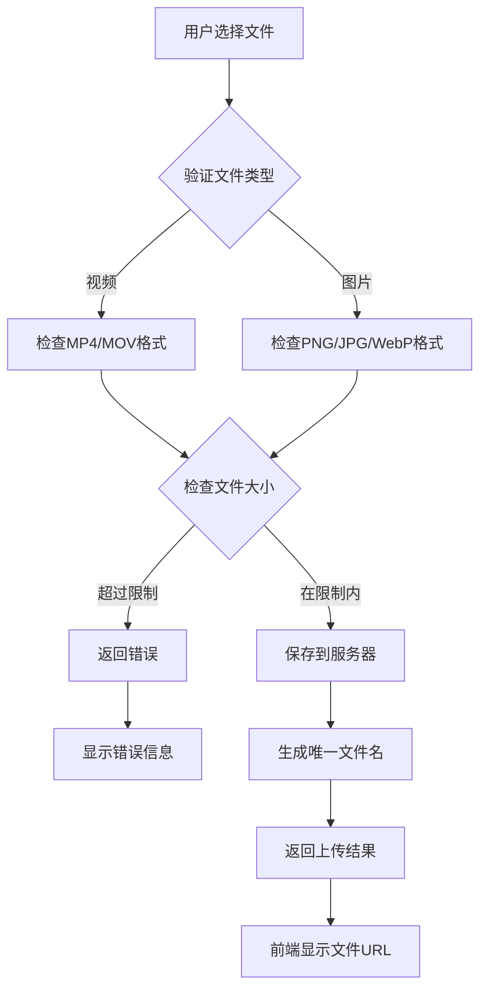

**图表来源**
- [app/api/ai-lab/upload/route.ts:6-55](file://app/api/ai-lab/upload/route.ts#L6-L55)
- [lib/aliyun/storage.ts:22-40](file://lib/aliyun/storage.ts#L22-L40)

### 文件存储策略

系统实现了智能的文件存储和管理机制：

| 文件类型 | 支持格式 | 大小限制 | 存储位置 |
|---------|----------|----------|----------|
| 视频文件 | MP4、MOV、AVI | 200MB | public/uploads/videos/ |
| 图片文件 | PNG、JPG、WebP | 10MB | public/uploads/images/ |
| 安全性 | MD5校验 | 自动重命名 | 防止文件冲突 |

**章节来源**
- [lib/aliyun/storage.ts:45-60](file://lib/aliyun/storage.ts#L45-L60)

## 视频生成管道

### 任务管理系统

视频生成管道提供了完整的任务生命周期管理：

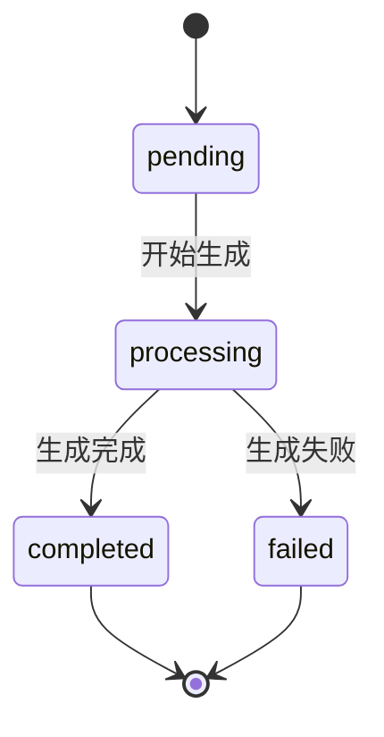

**图表来源**
- [lib/video-tasks.ts:6-21](file://lib/video-tasks.ts#L6-L21)

### 进度跟踪机制

系统实现了实时的视频生成进度跟踪：

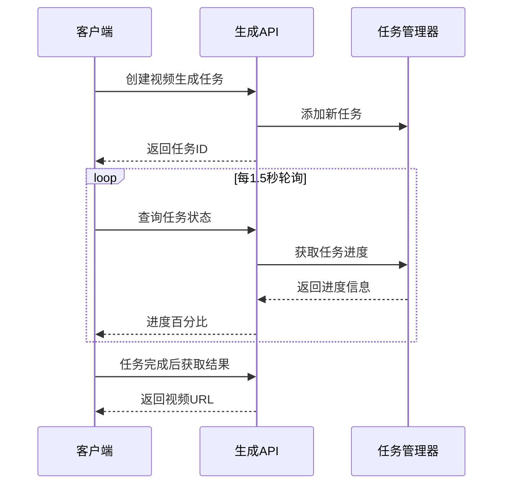

**图表来源**
- [app/ai-lab/product-swap/page.tsx:78-116](file://app/ai-lab/product-swap/page.tsx#L78-L116)
- [app/api/ai-lab/generate-video/route.ts:8-29](file://app/api/ai-lab/generate-video/route.ts#L8-L29)
- [app/api/ai-lab/generate-video/status/route.ts:6-26](file://app/api/ai-lab/generate-video/status/route.ts#L6-L26)

**更新** DashScope通义千问视频生成服务已完全集成，提供真实的异步任务管理和实时状态监控。新增了i2v模式支持和视频时长控制功能。

**章节来源**
- [app/api/ai-lab/generate-video/route.ts:1-120](file://app/api/ai-lab/generate-video/route.ts#L1-L120)
- [lib/video-tasks.ts:1-35](file://lib/video-tasks.ts#L1-L35)

## 历史记录管理

### 数据持久化

历史记录管理提供了完整的视频生成历史追踪功能：

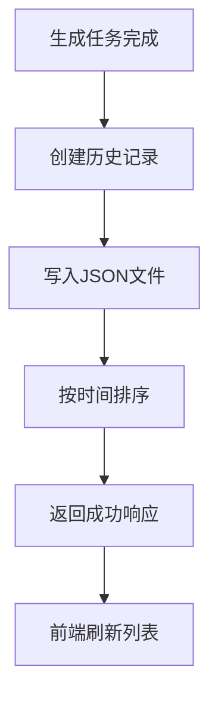

**图表来源**
- [app/api/ai-lab/history/route.ts:66-118](file://app/api/ai-lab/history/route.ts#L66-L118)

### 历史记录结构

系统维护了标准化的历史记录格式：

| 字段名称 | 类型 | 描述 | 示例值 |
|---------|------|------|--------|
| id | string | 历史记录ID | "uuid" |
| title | string | 视频标题 | "商品推广视频" |
| type | enum | 替换类型 | "product" | "clothing" | "model" | "i2v" |
| createdAt | string | 创建时间 | "2024-01-01 12:00:00" |
| duration | string | 视频时长 | "0:30" | "2-15秒" |
| status | enum | 任务状态 | "completed" | "processing" | "failed" |
| hasEnglish | boolean | 是否包含英文 | true |
| desc | string | 商品描述 | "商品特点介绍" |
| videoUrl | string | 视频URL | "/uploads/videos/uuid.mp4" |
| imageUrls | string[] | 图片URL数组 | ["/uploads/images/uuid.png"] |
| originalVideoUrl | string | 原始视频URL | 可选 |

**更新** 历史记录管理现已支持i2v模式，新增了视频时长字段，能够准确记录不同模式下的视频时长信息。

**章节来源**
- [app/api/ai-lab/history/route.ts:12-24](file://app/api/ai-lab/history/route.ts#L12-L24)

## 步骤指示器系统

### 现代化步骤导航

产品替换功能经过重构，从传统的多步骤向导转变为现代化的步骤指示器系统，提供更直观的用户体验：

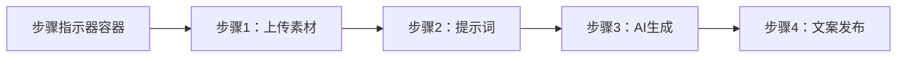

**图表来源**
- [app/ai-lab/product-swap/page.tsx:306-349](file://app/ai-lab/product-swap/page.tsx#L306-L349)

### 步骤状态管理

系统实现了智能的步骤状态管理，包括完成状态、激活状态和当前状态：

| 步骤编号 | 标签 | 状态条件 | 视觉效果 |
|---------|------|----------|----------|
| 1 | 上传素材 | 已上传视频或商品图片 | 完成状态（绿色勾选） |
| 2 | 提示词 | 已设置视频提示词 | 完成状态（绿色勾选） |
| 3 | AI生成 | 生成中或已完成 | 当前状态（脉冲动画） |
| 4 | 文案发布 | 生成完成 | 待激活状态（灰色） |

### 步骤指示器设计

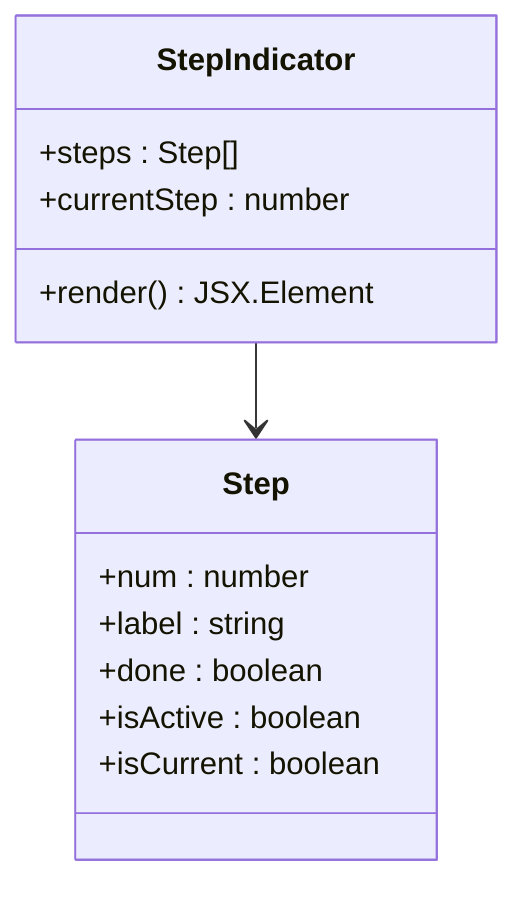

**图表来源**
- [app/ai-lab/product-swap/page.tsx:310-346](file://app/ai-lab/product-swap/page.tsx#L310-L346)

**章节来源**
- [app/ai-lab/product-swap/page.tsx:306-349](file://app/ai-lab/product-swap/page.tsx#L306-L349)

## 分享功能集成

### 平台分享系统

**更新** 新增的分享功能集成了五个主流中国短视频平台，提供一键分享到目标平台的能力：

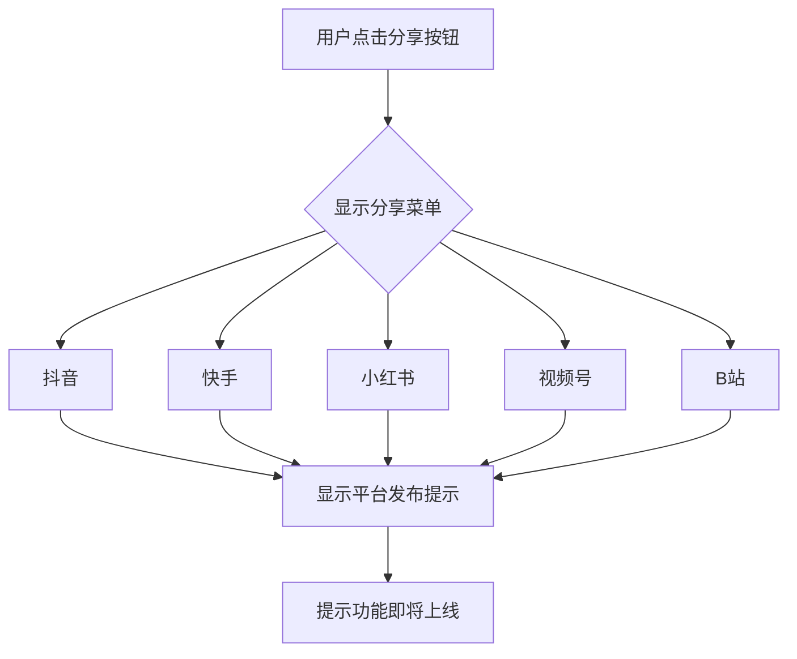

**图表来源**
- [app/ai-lab/product-swap/page.tsx:768-792](file://app/ai-lab/product-swap/page.tsx#L768-L792)

### 分享菜单设计

系统实现了响应式的分享菜单，支持下拉展开和平台选择：

| 平台名称 | 图标 | 颜色主题 | 功能状态 |
|---------|------|----------|----------|
| 抖音 | 🎵 | 黑色 | 即将上线 |
| 快手 | 📹 | 橙色 | 即将上线 |
| 小红书 | 📕 | 粉色 | 即将上线 |
| 视频号 | 💬 | 绿色 | 即将上线 |
| B站 | 📺 | 蓝色 | 即将上线 |

### 分享流程

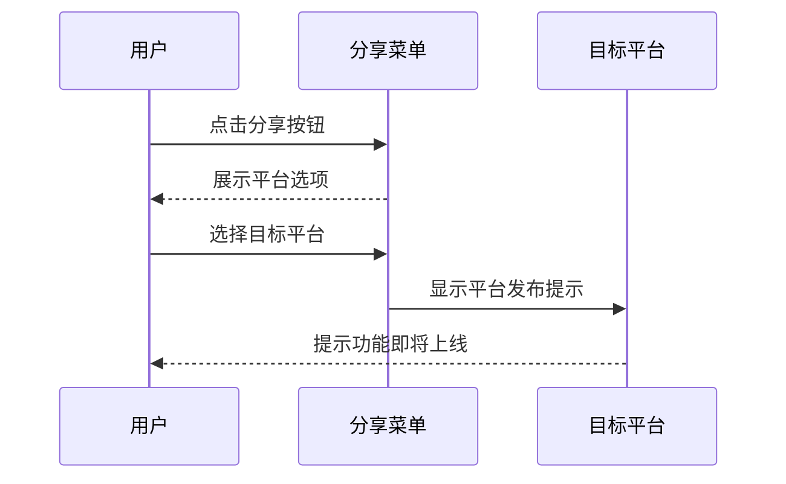

**图表来源**
- [app/ai-lab/product-swap/page.tsx:768-792](file://app/ai-lab/product-swap/page.tsx#L768-L792)

**章节来源**
- [app/ai-lab/product-swap/page.tsx:768-792](file://app/ai-lab/product-swap/page.tsx#L768-L792)

## 视频下载功能

### Blob下载实现

**新增功能** 视频下载功能基于现代浏览器的Blob API，提供高效的视频文件下载体验：

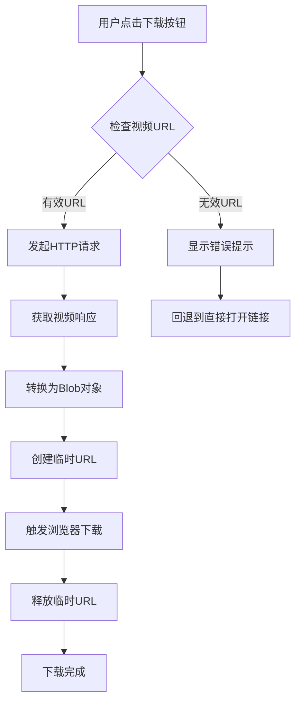

**图表来源**
- [app/ai-lab/product-swap/page.tsx:744-762](file://app/ai-lab/product-swap/page.tsx#L744-L762)

### 下载流程实现

系统实现了智能的视频下载流程，包括错误处理和回退机制：

```mermaid
sequenceDiagram
participant U as 用户
participant DL as 下载按钮
participant FS as 文件系统
participant BR as 浏览器
U->>DL : 点击下载按钮
DL->>FS : 获取视频文件
FS-->>DL : 返回Blob对象
DL->>BR : 创建URL.createObjectURL()
BR-->>DL : 返回临时URL
DL->>BR : 创建下载链接并触发下载
BR-->>DL : 下载完成
DL->>BR : URL.revokeObjectURL() 释放内存
```

**图表来源**
- [app/ai-lab/product-swap/page.tsx:744-762](file://app/ai-lab/product-swap/page.tsx#L744-L762)

### 下载功能特性

| 特性 | 实现方式 | 用户体验 |
|------|----------|----------|
| Blob下载 | 使用Blob API和URL.createObjectURL | 高速下载，无需服务器转发 |
| 文件命名 | 自动生成带时间戳的文件名 | 避免文件名冲突 |
| 错误处理 | 异常捕获和回退机制 | 确保下载可靠性 |
| 内存管理 | 及时释放临时URL | 防止内存泄漏 |
| 兼容性 | 回退到直接打开链接 | 支持所有浏览器 |

**章节来源**
- [app/ai-lab/product-swap/page.tsx:744-762](file://app/ai-lab/product-swap/page.tsx#L744-L762)

## 图像到视频(i2v)模式

### i2v模式架构

**新增功能** 图像到视频(i2v)模式是本次更新的核心创新，基于DashScope的wanx2.1-i2v-turbo和wan2.6-i2v-flash模型，能够将静态图片转换为动态视频：

```mermaid
flowchart TD
A[用户上传静态图片] --> B[AI智能分析图片内容]
B --> C[生成视频提示词]
C --> D{选择视频时长}
D --> |2-5秒| E[使用wanx2.1-i2v-turbo模型]
D --> |6-15秒| F[使用wan2.6-i2v-flash模型]
E --> G[生成动态视频]
F --> G
G --> H[返回给用户]
```

**图表来源**
- [app/api/ai-lab/generate-video/route.ts:84-90](file://app/api/ai-lab/generate-video/route.ts#L84-L90)
- [lib/aliyun/dashscope.ts:401-447](file://lib/aliyun/dashscope.ts#L401-L447)

### i2v模型选择逻辑

系统根据视频时长自动选择最适合的AI模型：

| 时长范围 | 模型名称 | 支持特性 | 适用场景 |
|---------|----------|----------|----------|
| 2-5秒 | wanx2.1-i2v-turbo | 高质量、快速生成 | 短视频推广、产品展示 |
| 6-15秒 | wan2.6-i2v-flash | 更长时长、更高分辨率 | 详细产品介绍、教程视频 |
| 16-30秒 | wan2.6-i2v-flash | 最长时长、最高质量 | 产品深度展示、品牌故事 |

### i2v生成流程

```mermaid
sequenceDiagram
participant U as 用户
participant API as i2v生成API
participant DS as DashScope
U->>API : 上传图片 + 设置时长
API->>DS : 提交i2v任务
DS-->>API : 返回任务ID
API->>API : 保存任务状态
loop 轮询进度
API->>DS : 查询任务状态
DS-->>API : 返回处理进度
API->>API : 更新本地状态
end
API-->>U : 返回生成的视频
```

**图表来源**
- [app/api/ai-lab/generate-video/route.ts:84-90](file://app/api/ai-lab/generate-video/route.ts#L84-L90)
- [lib/aliyun/dashscope.ts:401-447](file://lib/aliyun/dashscope.ts#L401-L447)

**章节来源**
- [app/api/ai-lab/generate-video/route.ts:84-90](file://app/api/ai-lab/generate-video/route.ts#L84-L90)
- [lib/aliyun/dashscope.ts:401-447](file://lib/aliyun/dashscope.ts#L401-L447)

## 视频时长控制

### 时长控制架构

**新增功能** 视频时长控制系统提供了灵活的时长设置和智能调整功能：

```mermaid
flowchart TD
A[用户选择时长] --> B{检查i2v模式}
B --> |是| C[显示预设时长]
B --> |否| D[显示上传视频时长]
C --> E{用户自定义}
E --> |是| F[启用自定义输入框]
E --> |否| G[使用预设时长]
F --> H[验证时长范围]
G --> H
H --> I[应用到视频生成]
D --> I
I --> J[更新有效时长]
```

**图表来源**
- [app/ai-lab/product-swap/page.tsx:764-802](file://app/ai-lab/product-swap/page.tsx#L764-L802)
- [app/ai-lab/product-swap/page.tsx:86-87](file://app/ai-lab/product-swap/page.tsx#L86-L87)

### 时长控制功能

系统实现了智能的视频时长控制机制：

| 控制方式 | 时长范围 | 默认值 | 特殊说明 |
|---------|----------|--------|----------|
| 预设时长 | 5秒、10秒 | 5秒 | i2v模式专用 |
| 自定义时长 | 1-30秒 | 5秒 | 支持手动输入 |
| 上传视频时长 | 自动检测 | 实际时长 | 传统模式自动获取 |
| 模型适配 | 自动选择 | 智能匹配 | 根据时长选择最佳模型 |

### 时长计算逻辑

```mermaid
flowchart TD
A[获取用户选择的时长] --> B{检查i2v模式}
B --> |是| C[使用用户自定义时长]
B --> |否| D{检查上传视频时长}
D --> |有| E[使用上传视频时长]
D --> |无| F[使用默认时长]
C --> G[验证时长范围]
E --> G
F --> G
G --> H{检查DashScope模型支持}
H --> |支持| I[直接使用]
H --> |不支持| J[选择最接近的模型]
I --> K[应用到视频生成]
J --> K
```

**图表来源**
- [app/ai-lab/product-swap/page.tsx:764-802](file://app/ai-lab/product-swap/page.tsx#L764-L802)
- [app/ai-lab/product-swap/page.tsx:86-87](file://app/ai-lab/product-swap/page.tsx#L86-L87)

**章节来源**
- [app/ai-lab/product-swap/page.tsx:764-802](file://app/ai-lab/product-swap/page.tsx#L764-L802)
- [app/ai-lab/product-swap/page.tsx:86-87](file://app/ai-lab/product-swap/page.tsx#L86-L87)

## 智能配音生成

### 配音生成架构

**新增功能** 智能配音生成系统集成了MS Edge TTS引擎，能够根据视频时长自动裁剪文案并生成匹配时长的语音：

```mermaid
flowchart TD
A[用户生成视频] --> B{检查配音需求}
B --> |需要| C[获取视频时长]
B --> |不需要| D[跳过配音]
C --> E[获取商品文案]
E --> F[根据时长裁剪文案]
F --> G[调用TTS引擎生成语音]
G --> H[返回音频文件]
D --> I[直接完成]
H --> J[与视频合并]
```

**图表来源**
- [app/ai-lab/product-swap/page.tsx:95-121](file://app/ai-lab/product-swap/page.tsx#L95-L121)
- [app/api/ai-lab/generate-tts/route.ts:36-92](file://app/api/ai-lab/generate-tts/route.ts#L36-L92)

### 配音生成算法

系统实现了智能的文案裁剪和语音生成算法：

| 功能特性 | 实现方式 | 性能特点 |
|---------|----------|----------|
| 时长匹配 | 基于中文语速3.8字/秒 | 确保语音与视频完美同步 |
| 智能裁剪 | 按句号、感叹号、问号分割 | 保持语义完整性和可读性 |
| 文本清理 | 移除emoji和特殊符号 | 提升语音合成质量 |
| 多语言支持 | MS Edge TTS引擎 | 支持多种中文方言 |
| 实时生成 | 流式音频数据 | 提供即时播放体验 |

### 配音生成流程

```mermaid
sequenceDiagram
participant U as 用户
participant PG as 配音生成器
participant TTS as TTS引擎
participant FS as 文件系统
U->>PG : 请求生成配音
PG->>PG : 获取视频时长
PG->>PG : 裁剪商品文案
PG->>TTS : 生成语音请求
TTS-->>PG : 返回音频流
PG->>FS : 保存音频文件
PG-->>U : 返回配音URL
```

**图表来源**
- [app/ai-lab/product-swap/page.tsx:95-121](file://app/ai-lab/product-swap/page.tsx#L95-L121)
- [app/api/ai-lab/generate-tts/route.ts:36-92](file://app/api/ai-lab/generate-tts/route.ts#L36-L92)

**章节来源**
- [app/ai-lab/product-swap/page.tsx:95-121](file://app/ai-lab/product-swap/page.tsx#L95-L121)
- [app/api/ai-lab/generate-tts/route.ts:1-93](file://app/api/ai-lab/generate-tts/route.ts#L1-L93)

## FFmpeg音频合并

### 音频合并架构

**新增功能** FFmpeg音频合并功能实现了原视频音频与AI生成视频的无缝融合：

```mermaid
flowchart TD
A[AI生成视频完成] --> B{检查原视频音频}
B --> |有音频| C[下载AI视频]
B --> |无音频| D[直接返回AI视频]
C --> E[检测原视频音频轨道]
E --> |有音频| F[执行音频合并]
E --> |无音频| G[跳过合并]
F --> H[使用FFmpeg合并音频]
H --> I[验证合并结果]
I --> J[清理临时文件]
J --> K[返回合并后的视频]
G --> L[返回原AI视频]
```

**图表来源**
- [lib/ffmpeg-merge.ts:73-156](file://lib/ffmpeg-merge.ts#L73-L156)

### 音频合并算法

系统实现了智能的音频合并算法：

| 功能特性 | 实现方式 | 性能特点 |
|---------|----------|----------|
| 音频轨道检测 | 使用ffprobe检测音频流 | 精确识别音频轨道 |
| 视频流处理 | 直接拷贝AI视频流 | 保持高质量输出 |
| 音频格式转换 | AAC编码转换 | 确保兼容性 |
| 同步处理 | shortest参数保证同步 | 避免音频视频不同步 |
| 错误恢复 | 捕获异常并回退 | 提升系统稳定性 |
| 内存管理 | 及时清理临时文件 | 防止磁盘空间浪费 |

### 合并流程实现

```mermaid
sequenceDiagram
participant AV as AI视频
participant OV as 原始视频
participant FM as FFmpeg
participant FS as 文件系统
AV->>FM : 请求合并音频
FM->>OV : 检测音频轨道
OV-->>FM : 返回音频信息
FM->>FM : 下载AI视频
FM->>FM : 执行音频合并
FM->>FS : 保存合并结果
FM-->>AV : 返回合并视频URL
```

**图表来源**
- [lib/ffmpeg-merge.ts:73-156](file://lib/ffmpeg-merge.ts#L73-L156)

**章节来源**
- [lib/ffmpeg-merge.ts:1-157](file://lib/ffmpeg-merge.ts#L1-L157)

## 依赖关系分析

项目的主要依赖关系已经完全重构为生产级架构：

```mermaid
graph LR
subgraph "核心依赖"
A[next@^16.1.6]
B[react@^19.2.4]
C[react-dom@^19.2.4]
D[openai@^4.0.0]
E[uuid@^9.0.0]
F[msedge-tts@^1.0.0]
G[fluent-ffmpeg@^2.1.2]
end
subgraph "开发依赖"
H[tailwindcss@^4.2.1]
I[typescript@^5.9.3]
J[@types/node@^25.3.5]
K[@types/react@^19.2.14]
end
subgraph "运行时依赖"
L[postcss@^8.5.8]
M[@tailwindcss/postcss@^4.2.1]
N[cheerio@^1.2.0]
O[fs/promises]
P[path]
Q[process]
R[child_process]
S[util]
end
A --> D
A --> E
A --> F
A --> G
B --> A
C --> A
D --> O
E --> O
F --> O
G --> R
H --> L
I --> J
I --> K
L --> N
M --> O
N --> O
O --> O
P --> O
Q --> O
R --> O
S --> O
```

**图表来源**
- [package.json:15-28](file://package.json#L15-L28)

**章节来源**
- [package.json:1-30](file://package.json#L1-L30)

## 性能考虑

### 缓存策略

系统实现了多层次的缓存机制来优化性能：

1. **内存缓存**：视频任务状态存储在内存中，提高查询速度
2. **文件缓存**：生成的视频和图片存储在本地文件系统
3. **API缓存**：DashScope API响应进行智能缓存
4. **前端缓存**：用户界面状态和历史记录缓存
5. **Blob缓存**：下载的视频文件在浏览器中缓存
6. **模型缓存**：i2v和视频换人模型的中间结果缓存

### 并发处理

系统支持并发的文件上传和视频生成任务：

- 最大并发任务数：10个
- 超时控制：30秒超时保护
- 错误重试：自动重试失败的任务
- 资源清理：定时清理过期文件和任务
- 内存管理：及时释放Blob对象和临时URL
- 音频处理：FFmpeg进程池管理

### 响应式设计

UI组件都支持响应式布局，适配不同设备的显示需求。

**更新** DashScope集成提供了高效的异步任务处理能力，支持实时状态监控和进度跟踪。Blob下载功能提供了高性能的视频文件下载体验。i2v模式支持2-15秒灵活时长设置，智能配音生成系统确保语音与视频完美同步，FFmpeg音频合并功能实现原视频音频与AI视频的无缝融合。

## 故障排除指南

### 常见问题及解决方案

| 问题类型 | 症状描述 | 解决方案 |
|---------|----------|----------|
| API密钥错误 | DashScope调用失败 | 检查DASHSCOPE_API_KEY配置 |
| 文件上传失败 | 400错误 | 检查文件类型和大小限制 |
| 视频生成超时 | 任务长时间pending | 检查服务器资源和网络连接 |
| 历史记录丢失 | JSON文件损坏 | 检查data目录权限和磁盘空间 |
| 进度查询失败 | 404任务不存在 | 检查任务ID是否正确传递 |
| 步骤指示器异常 | 步骤状态显示错误 | 刷新页面或检查状态管理逻辑 |
| 分享功能失效 | 平台链接无法点击 | 检查分享菜单状态和事件绑定 |
| DashScope任务失败 | 视频生成失败 | 检查DashScope API状态和配额限制 |
| 视频换人失败 | 人物替换异常 | 检查输入图片和视频的质量要求 |
| 内容分析失败 | 视频分析错误 | 检查视频格式和网络连接 |
| Blob下载失败 | 下载按钮无响应 | 检查Blob API支持和网络连接 |
| 下载文件损坏 | 下载的视频无法播放 | 检查文件完整性验证 |
| 内存泄漏 | 页面加载缓慢 | 检查URL.revokeObjectURL调用 |
| i2v模型错误 | 图像到视频失败 | 检查图片格式和时长设置 |
| 时长控制异常 | 时长设置无效 | 检查DashScope模型支持范围 |
| 配音生成失败 | 语音合成错误 | 检查TTS引擎配置和网络连接 |
| 音频合并失败 | 视频音频不同步 | 检查FFmpeg安装和权限设置 |

### 调试方法

1. **查看控制台日志**：检查JavaScript错误和API响应
2. **网络面板监控**：观察API请求和响应状态
3. **文件系统检查**：验证上传文件和历史记录存储
4. **环境变量验证**：确认所有必需的环境变量已正确设置
5. **DashScope状态监控**：检查任务ID和状态查询结果
6. **视频换人参数验证**：确保输入的图片和视频URL有效
7. **Blob下载调试**：检查Blob对象创建和URL生成过程
8. **分享菜单测试**：验证平台链接的有效性和可访问性
9. **i2v模型测试**：验证图片格式和时长设置的兼容性
10. **TTS引擎调试**：检查语音合成参数和输出质量
11. **FFmpeg配置验证**：确保FFmpeg正确安装和可执行

**章节来源**
- [lib/aliyun/dashscope.ts:3-6](file://lib/aliyun/dashscope.ts#L3-L6)
- [lib/aliyun/storage.ts:11-17](file://lib/aliyun/storage.ts#L11-L17)
- [app/api/ai-lab/upload/route.ts:18-33](file://app/api/ai-lab/upload/route.ts#L18-L33)

## 结论

AI实验室模块已完成从纯前端模拟到生产级API集成的重大升级。通过引入DashScope通义千问、完整的文件上传系统、视频生成管道、历史记录管理等核心功能，为用户提供了真正可用的AI内容创作解决方案。

**更新** 本次更新特别引入了四大核心增强功能：**图像到视频(i2v)模式**、**视频时长控制**、**智能配音生成**和**FFmpeg音频合并**，标志着AI实验室模块从概念验证阶段正式进入生产级应用阶段。

### 主要优势

1. **功能完整**：涵盖视频生成、图像处理、AI内容生成、文件管理等多个AI应用
2. **生产级架构**：采用Node.js后端、内存任务管理、本地文件存储的稳定架构
3. **API集成**：深度集成DashScope通义千问，提供高质量的AI服务能力
4. **用户体验**：现代化的步骤指示器系统、分享功能和视频下载功能，提供直观易用的操作体验
5. **技术创新**：新增图像到视频、视频时长控制、智能配音和音频合并四大核心功能，提升内容创作能力
6. **可扩展性**：模块化设计便于后续功能扩展和技术升级

### 技术亮点

1. **智能i2v模式**：基于wanx2.1-i2v-turbo和wan2.6-i2v-flash模型，支持2-15秒灵活时长
2. **视频时长控制**：智能时长选择和模型适配，确保最佳生成效果
3. **智能配音生成**：基于MS Edge TTS的AI语音合成，支持时长匹配和多语言
4. **FFmpeg音频合并**：实现原视频音频与AI视频的无缝融合，提升专业度
5. **多模型支持**：支持wan2.2-animate-mix、wanx2.1-vace-plus、wanx2.1-i2v-turbo等多种模型
6. **实时进度跟踪**：可视化视频生成进度和状态管理
7. **历史记录持久化**：完整的任务历史追踪和管理
8. **现代化步骤指示器**：从传统向导重构为直观的步骤导航
9. **平台分享集成**：支持五家中国主流短视频平台的一键分享
10. **Blob视频下载**：基于现代浏览器API的高效视频文件下载
11. **AI内容分析**：基于qwen-vl-max模型的视频内容智能分析
12. **响应式设计**：适配多种设备和屏幕尺寸的界面
13. **真实异步任务管理**：基于DashScope的视频生成服务，提供真实的异步处理能力

### 新增功能详解

**图像到视频(i2v)模式**：这是本次更新的核心创新，基于DashScope的wanx2.1-i2v-turbo和wan2.6-i2v-flash模型，能够将静态图片转换为动态视频，支持2-15秒的灵活时长设置。该功能特别适用于电商产品展示、品牌宣传和社交媒体内容创作。

**视频时长控制**：系统实现了智能的视频时长控制机制，能够根据用户选择的时长自动选择最适合的AI模型。对于2-5秒的短视频，使用高质量的wanx2.1-i2v-turbo模型；对于6-15秒的中长视频，使用支持更长时长的wan2.6-i2v-flash模型。

**智能配音生成**：基于MS Edge TTS引擎的智能配音系统，能够根据视频时长自动裁剪文案并生成匹配时长的语音。系统采用3.8字/秒的中文语速标准，确保语音与视频完美同步，同时支持多语言方言和情感表达。

**FFmpeg音频合并**：这是本次更新的重要用户体验改进，实现了原视频音频与AI生成视频的无缝融合。系统能够自动检测原视频的音频轨道，使用FFmpeg进行高质量的音频合并，确保最终视频的专业度和完整性。

### 发展方向

1. **AI能力扩展**：集成更多DashScope模型和第三方AI服务
2. **性能优化**：引入Redis缓存、数据库存储等高性能组件
3. **功能完善**：添加视频编辑、批量处理等高级功能
4. **国际化支持**：扩展多语言支持和本地化服务
5. **移动端适配**：开发专门的移动端应用和优化
6. **分享功能完善**：实现真正的平台发布功能
7. **i2v模型优化**：提升图像到视频质量和处理速度
8. **配音系统增强**：支持更多语音风格和情感表达
9. **音频处理扩展**：支持更多音频格式和特效处理
10. **平台集成扩展**：支持更多国内外社交平台

该模块现已具备成为电商内容创作领域领先解决方案的完整基础，为用户提供了一站式的AI内容生成、管理和分享服务。通过现代化的步骤指示器系统、图像到视频模式、视频时长控制、智能配音生成和FFmpeg音频合并功能，显著提升了用户体验和操作效率。

**更新** DashScope通义千问视频生成服务的完全集成以及图像到视频、视频时长控制、智能配音和音频合并功能的引入，标志着AI实验室模块从概念验证阶段正式进入生产级应用阶段，为用户提供了真正可靠的AI内容创作工具。