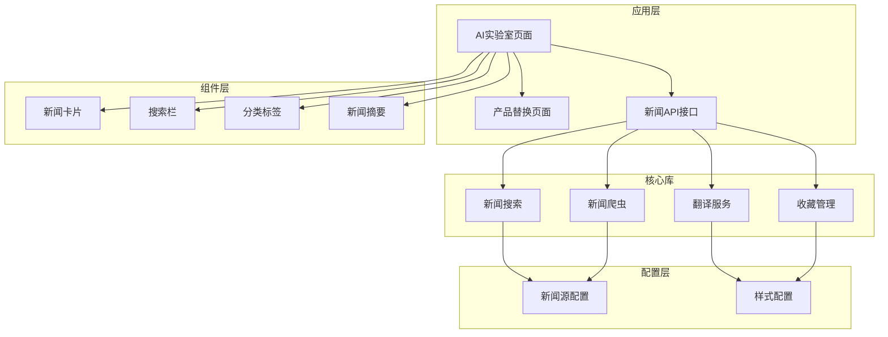
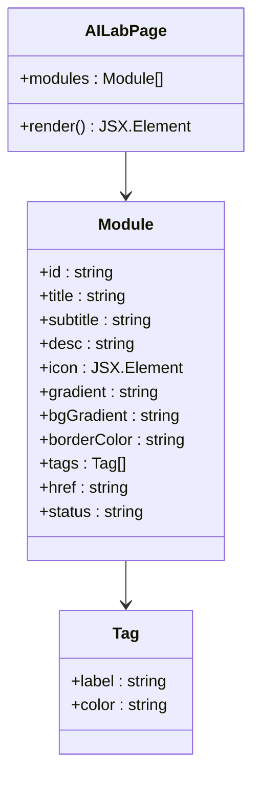
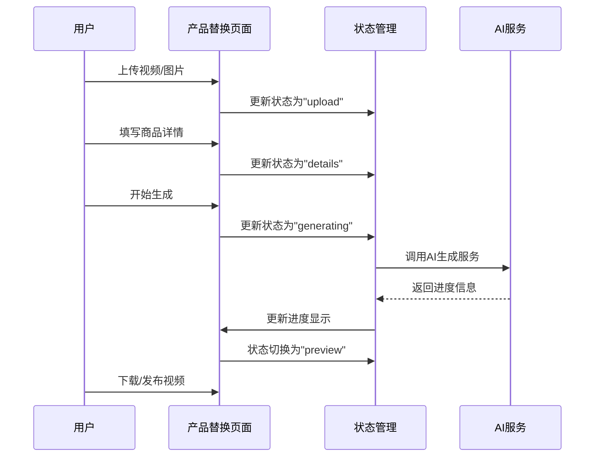
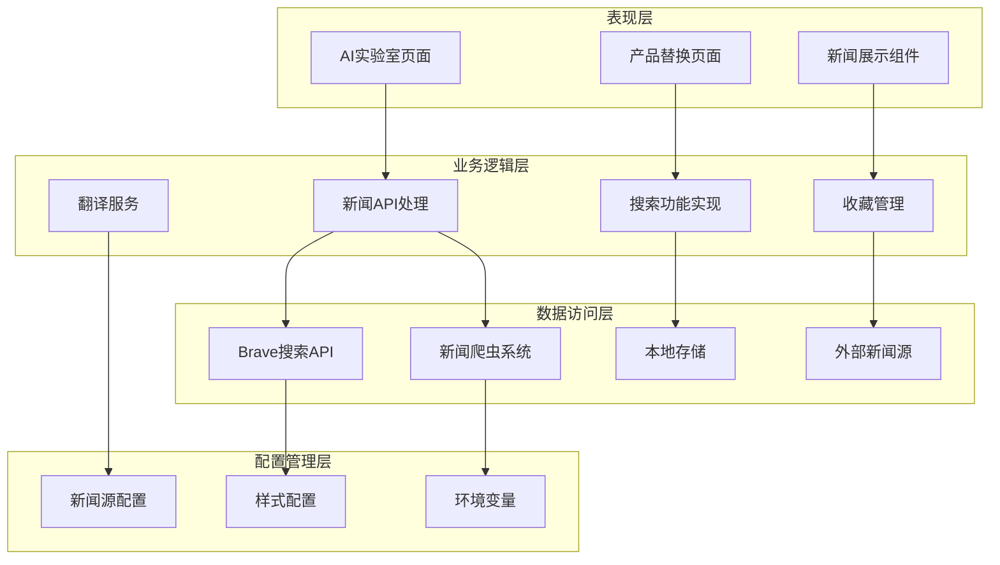
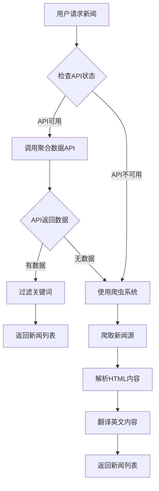
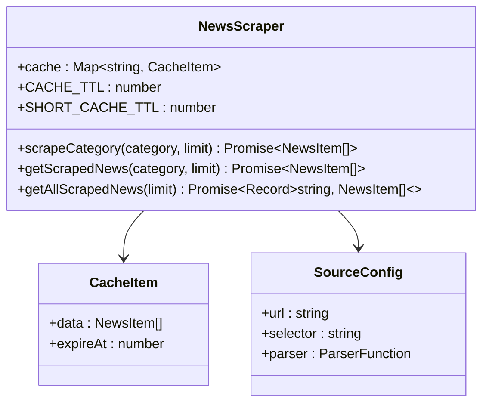
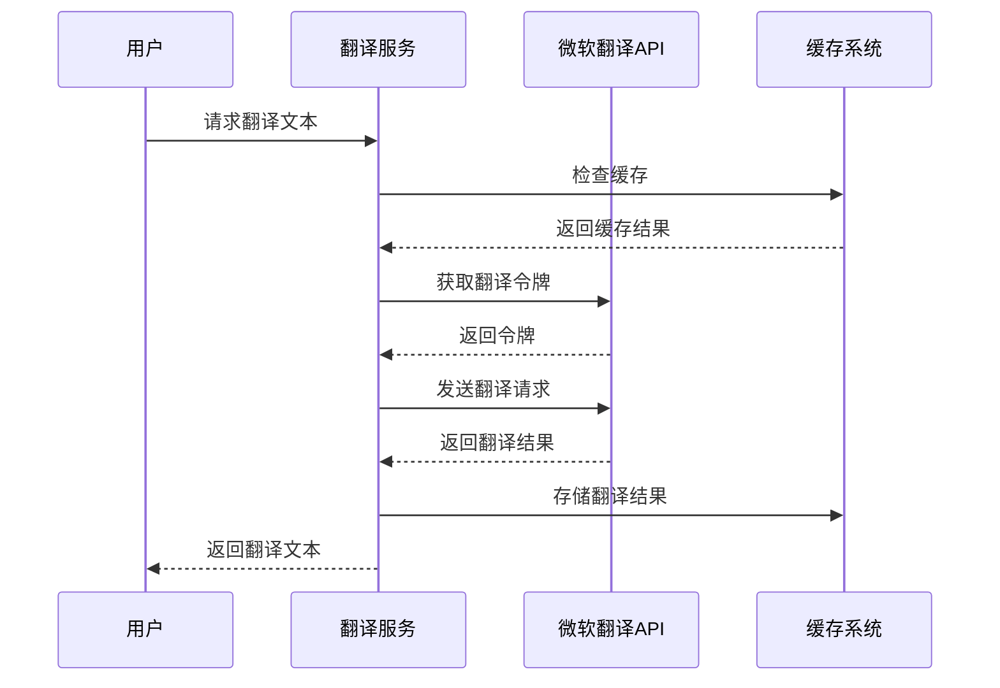
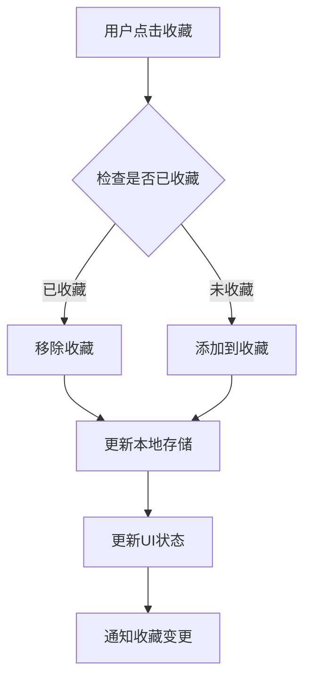

# AI实验室模块

<cite>
**本文档引用的文件**
- [app/ai-lab/page.tsx](file://app/ai-lab/page.tsx)
- [app/ai-lab/product-swap/page.tsx](file://app/ai-lab/product-swap/page.tsx)
- [lib/brave-search.ts](file://lib/brave-search.ts)
- [lib/news-scraper.ts](file://lib/news-scraper.ts)
- [lib/translator.ts](file://lib/translator.ts)
- [lib/mock-data.ts](file://lib/mock-data.ts)
- [lib/favorites.ts](file://lib/favorites.ts)
- [config/news-sources.json](file://config/news-sources.json)
- [app/api/news/route.ts](file://app/api/news/route.ts)
- [app/api/news/sources/route.ts](file://app/api/news/sources/route.ts)
- [components/NewsCard.tsx](file://components/NewsCard.tsx)
- [components/SearchBar.tsx](file://components/SearchBar.tsx)
- [components/CategoryTabs.tsx](file://components/CategoryTabs.tsx)
- [components/NewsSummary.tsx](file://components/NewsSummary.tsx)
- [package.json](file://package.json)
</cite>

## 目录
1. [项目概述](#项目概述)
2. [项目结构](#项目结构)
3. [核心组件](#核心组件)
4. [架构概览](#架构概览)
5. [详细组件分析](#详细组件分析)
6. [依赖关系分析](#依赖关系分析)
7. [性能考虑](#性能考虑)
8. [故障排除指南](#故障排除指南)
9. [结论](#结论)

## 项目概述

AI实验室模块是一个集成了多种AI功能的综合性平台，专注于为电商内容创作者提供智能化的视频生成和内容创作解决方案。该模块的核心特色包括AI爆品替换、AI图像生成等创新功能，旨在帮助用户快速制作高质量的电商推广内容。

该项目采用现代化的React和Next.js技术栈构建，结合了AI搜索引擎、新闻爬虫系统、翻译服务等多重技术组件，形成了一个完整的AI内容创作生态系统。

## 项目结构

项目采用模块化的目录结构，主要分为以下几个核心部分：



**图表来源**
- [app/ai-lab/page.tsx:1-130](file://app/ai-lab/page.tsx#L1-L130)
- [app/ai-lab/product-swap/page.tsx:1-653](file://app/ai-lab/product-swap/page.tsx#L1-L653)
- [lib/news-scraper.ts:1-971](file://lib/news-scraper.ts#L1-L971)

**章节来源**
- [app/ai-lab/page.tsx:1-130](file://app/ai-lab/page.tsx#L1-L130)
- [package.json:1-30](file://package.json#L1-L30)

## 核心组件

### AI实验室主页

AI实验室主页提供了统一的入口界面，展示了各种AI功能模块。当前主要包含"AI爆品替换"功能，其他功能如"AI图像生成"处于即将上线状态。



**图表来源**
- [app/ai-lab/page.tsx:5-47](file://app/ai-lab/page.tsx#L5-L47)

### 产品替换功能

产品替换功能是AI实验室的核心模块，提供了完整的视频内容生成流程：



**图表来源**
- [app/ai-lab/product-swap/page.tsx:35-163](file://app/ai-lab/product-swap/page.tsx#L35-L163)

**章节来源**
- [app/ai-lab/page.tsx:1-130](file://app/ai-lab/page.tsx#L1-L130)
- [app/ai-lab/product-swap/page.tsx:1-653](file://app/ai-lab/product-swap/page.tsx#L1-L653)

## 架构概览

整个AI实验室模块采用了分层架构设计，各层之间职责明确，耦合度低：



**图表来源**
- [app/api/news/route.ts:1-256](file://app/api/news/route.ts#L1-L256)
- [lib/news-scraper.ts:1-971](file://lib/news-scraper.ts#L1-L971)
- [lib/brave-search.ts:1-115](file://lib/brave-search.ts#L1-L115)

## 详细组件分析

### 新闻搜索系统

新闻搜索系统是整个模块的数据核心，提供了多种获取新闻信息的方式：



**图表来源**
- [app/api/news/route.ts:16-57](file://app/api/news/route.ts#L16-L57)
- [lib/news-scraper.ts:304-353](file://lib/news-scraper.ts#L304-L353)

#### Brave搜索集成

系统集成了Brave新闻搜索API，提供了强大的搜索能力：

| 功能特性 | 实现方式 | 性能特点 |
|---------|----------|----------|
| 多语言搜索 | 支持英语搜索 | 高效的API调用 |
| 结果过滤 | 基于关键词匹配 | 实时响应 |
| 错误处理 | 自动回退机制 | 稳定可靠 |
| 缓存策略 | 内存缓存优化 | 减少API调用 |

**章节来源**
- [lib/brave-search.ts:1-115](file://lib/brave-search.ts#L1-L115)
- [app/api/news/route.ts:16-57](file://app/api/news/route.ts#L16-L57)

### 新闻爬虫系统

新闻爬虫系统负责从多个新闻源获取实时信息：



**图表来源**
- [lib/news-scraper.ts:9-37](file://lib/news-scraper.ts#L9-L37)
- [lib/news-scraper.ts:40-273](file://lib/news-scraper.ts#L40-L273)

#### 支持的新闻源

系统支持多个国内外主流新闻源，涵盖不同领域和语言：

| 新闻源类别 | 数量 | 主要特点 | 翻译支持 |
|-----------|------|----------|----------|
| 国内新闻 | 8个 | 覆盖主流中文媒体 | 部分支持 |
| 国际新闻 | 4个 | BBC、路透社等 | 全部支持 |
| 科技媒体 | 6个 | IT之家、少数派等 | 部分支持 |
| 商业媒体 | 5个 | 36氪、钛媒体等 | 部分支持 |

**章节来源**
- [lib/news-scraper.ts:394-415](file://lib/news-scraper.ts#L394-L415)
- [config/news-sources.json:1-21](file://config/news-sources.json#L1-L21)

### 翻译服务

翻译服务模块提供了智能的中英文互译功能：



**图表来源**
- [lib/translator.ts:15-37](file://lib/translator.ts#L15-L37)
- [lib/translator.ts:44-119](file://lib/translator.ts#L44-L119)

**章节来源**
- [lib/translator.ts:1-132](file://lib/translator.ts#L1-L132)

### 收藏管理系统

收藏管理功能允许用户保存感兴趣的新闻内容：



**图表来源**
- [lib/favorites.ts:13-24](file://lib/favorites.ts#L13-L24)

**章节来源**
- [lib/favorites.ts:1-29](file://lib/favorites.ts#L1-L29)

## 依赖关系分析

项目的主要依赖关系如下：

```mermaid
graph LR
subgraph "核心依赖"
A[next@^16.1.6]
B[react@^19.2.4]
C[react-dom@^19.2.4]
D[cheerio@^1.2.0]
end
subgraph "开发依赖"
E[tailwindcss@^4.2.1]
F[typescript@^5.9.3]
G[@types/node@^25.3.5]
H[@types/react@^19.2.14]
end
subgraph "运行时依赖"
I[postcss@^8.5.8]
J[@tailwindcss/postcss@^4.2.1]
end
A --> D
B --> A
C --> A
E --> I
F --> G
F --> H
J --> I
```

**图表来源**
- [package.json:15-28](file://package.json#L15-L28)

**章节来源**
- [package.json:1-30](file://package.json#L1-L30)

## 性能考虑

### 缓存策略

系统实现了多层次的缓存机制来优化性能：

1. **内存缓存**：新闻爬虫使用内存缓存减少重复请求
2. **短期缓存**：针对动态新闻源使用更短的缓存时间
3. **翻译缓存**：避免重复翻译相同的文本内容

### 并发处理

系统支持并发的新闻源抓取，提高了数据获取效率：

- 最大并发请求数：8个
- 超时控制：5秒超时保护
- 错误重试：自动重试失败的请求

### 响应式设计

UI组件都支持响应式布局，适配不同设备的显示需求。

## 故障排除指南

### 常见问题及解决方案

| 问题类型 | 症状描述 | 解决方案 |
|---------|----------|----------|
| API密钥错误 | 新闻无法获取 | 检查BRAVE_API_KEY配置 |
| 网络连接失败 | 页面加载缓慢 | 检查网络连接和防火墙设置 |
| 翻译服务异常 | 文本未翻译 | 检查微软翻译API可用性 |
| 缓存问题 | 数据不更新 | 清除浏览器缓存或等待缓存过期 |

### 调试方法

1. **查看控制台日志**：检查JavaScript错误和API响应
2. **网络面板监控**：观察API请求和响应状态
3. **缓存检查**：验证缓存数据的有效性和过期时间
4. **环境变量验证**：确认所有必需的环境变量已正确设置

**章节来源**
- [lib/brave-search.ts:35-37](file://lib/brave-search.ts#L35-L37)
- [lib/news-scraper.ts:276-295](file://lib/news-scraper.ts#L276-L295)

## 结论

AI实验室模块是一个功能完整、架构清晰的AI内容创作平台。通过集成多种AI技术和新闻获取能力，为用户提供了便捷的电商内容生成解决方案。

### 主要优势

1. **功能丰富**：涵盖视频生成、图像处理、新闻聚合等多个AI应用
2. **技术先进**：采用最新的React和Next.js技术栈
3. **性能优化**：实现了多层次的缓存和并发处理机制
4. **用户体验**：提供了直观易用的界面和流畅的操作体验

### 发展方向

1. **功能扩展**：可以添加更多AI生成工具和模板
2. **性能优化**：进一步优化缓存策略和数据处理效率
3. **国际化支持**：扩展多语言支持和本地化功能
4. **移动端适配**：增强移动设备的兼容性和用户体验

该模块为电商内容创作者提供了一个强大而易用的AI工具箱，有望成为内容创作领域的领先解决方案。