# AI实验室模块

<cite>
**本文档引用的文件**
- [app/ai-lab/page.tsx](file://app/ai-lab/page.tsx)
- [app/ai-lab/product-swap/page.tsx](file://app/ai-lab/product-swap/page.tsx)
- [app/api/ai-lab/generate-desc/route.ts](file://app/api/ai-lab/generate-desc/route.ts)
- [app/api/ai-lab/generate-video/route.ts](file://app/api/ai-lab/generate-video/route.ts)
- [app/api/ai-lab/generate-video/status/route.ts](file://app/api/ai-lab/generate-video/status/route.ts)
- [app/api/ai-lab/history/route.ts](file://app/api/ai-lab/history/route.ts)
- [app/api/ai-lab/translate/route.ts](file://app/api/ai-lab/translate/route.ts)
- [app/api/ai-lab/upload/route.ts](file://app/api/ai-lab/upload/route.ts)
- [lib/aliyun/dashscope.ts](file://lib/aliyun/dashscope.ts)
- [lib/aliyun/storage.ts](file://lib/aliyun/storage.ts)
- [lib/video-tasks.ts](file://lib/video-tasks.ts)
- [lib/brave-search.ts](file://lib/brave-search.ts)
- [lib/news-scraper.ts](file://lib/news-scraper.ts)
- [lib/translator.ts](file://lib/translator.ts)
- [lib/mock-data.ts](file://lib/mock-data.ts)
- [lib/favorites.ts](file://lib/favorites.ts)
- [config/news-sources.json](file://config/news-sources.json)
- [app/api/news/route.ts](file://app/api/news/route.ts)
- [app/api/news/sources/route.ts](file://app/api/news/sources/route.ts)
- [components/NewsCard.tsx](file://components/NewsCard.tsx)
- [components/SearchBar.tsx](file://components/SearchBar.tsx)
- [components/CategoryTabs.tsx](file://components/CategoryTabs.tsx)
- [components/NewsSummary.tsx](file://components/NewsSummary.tsx)
- [app/globals.css](file://app/globals.css)
- [package.json](file://package.json)
</cite>

## 更新摘要
**所做更改**
- 产品交换功能从传统多步骤向导重构为现代化步骤指示器系统
- 新增分享功能集成，支持抖音、快手、小红书等短视频平台
- 简化状态管理和UI设计，提升用户体验
- 保持完整的AI功能集成和API服务

## 目录
1. [项目概述](#项目概述)
2. [项目结构](#项目结构)
3. [核心组件](#核心组件)
4. [架构概览](#架构概览)
5. [详细组件分析](#详细组件分析)
6. [DashScope集成](#dashscope集成)
7. [文件上传系统](#文件上传系统)
8. [视频生成管道](#视频生成管道)
9. [历史记录管理](#历史记录管理)
10. [步骤指示器系统](#步骤指示器系统)
11. [分享功能集成](#分享功能集成)
12. [依赖关系分析](#依赖关系分析)
13. [性能考虑](#性能考虑)
14. [故障排除指南](#故障排除指南)
15. [结论](#结论)

## 项目概述

AI实验室模块是一个集成了多种AI功能的综合性平台，现已完成从纯前端模拟到生产级API集成的重大升级。该模块的核心特色包括AI爆品替换、DashScope通义千问集成、文件上传系统、视频生成管道、历史记录管理等创新功能，旨在帮助用户快速制作高质量的电商推广内容。

本次重大升级引入了完整的后端API系统，包括AI文案生成、翻译服务、文件存储、视频处理等核心功能，从前端纯模拟迁移到真实的生产级服务集成。产品交换功能经过重构，从传统的多步骤向导转变为现代化的步骤指示器系统，并新增了分享功能集成。

## 项目结构

项目采用模块化的目录结构，主要分为以下几个核心部分：

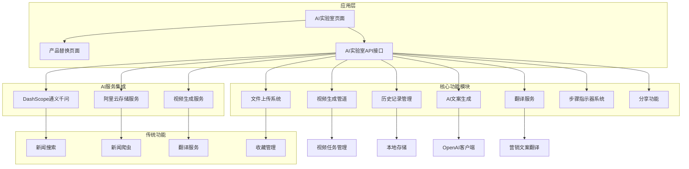

**图表来源**
- [app/ai-lab/page.tsx:1-130](file://app/ai-lab/page.tsx#L1-L130)
- [app/ai-lab/product-swap/page.tsx:1-687](file://app/ai-lab/product-swap/page.tsx#L1-L687)
- [lib/aliyun/dashscope.ts:1-95](file://lib/aliyun/dashscope.ts#L1-L95)

**章节来源**
- [app/ai-lab/page.tsx:1-130](file://app/ai-lab/page.tsx#L1-L130)
- [package.json:1-30](file://package.json#L1-L30)

## 核心组件

### AI实验室主页

AI实验室主页提供了统一的入口界面，展示了各种AI功能模块。当前主要包含"AI爆品替换"功能，其他功能如"AI图像生成"处于即将上线状态。

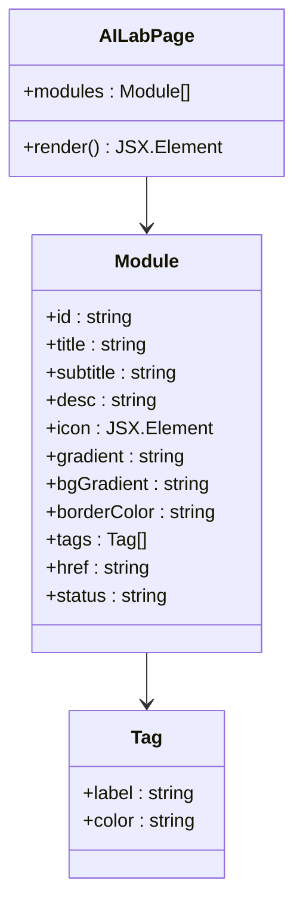

**图表来源**
- [app/ai-lab/page.tsx:5-47](file://app/ai-lab/page.tsx#L5-L47)

### 产品替换功能

产品替换功能是AI实验室的核心模块，现已完全迁移到生产级API集成，并重构为现代化的步骤指示器系统：

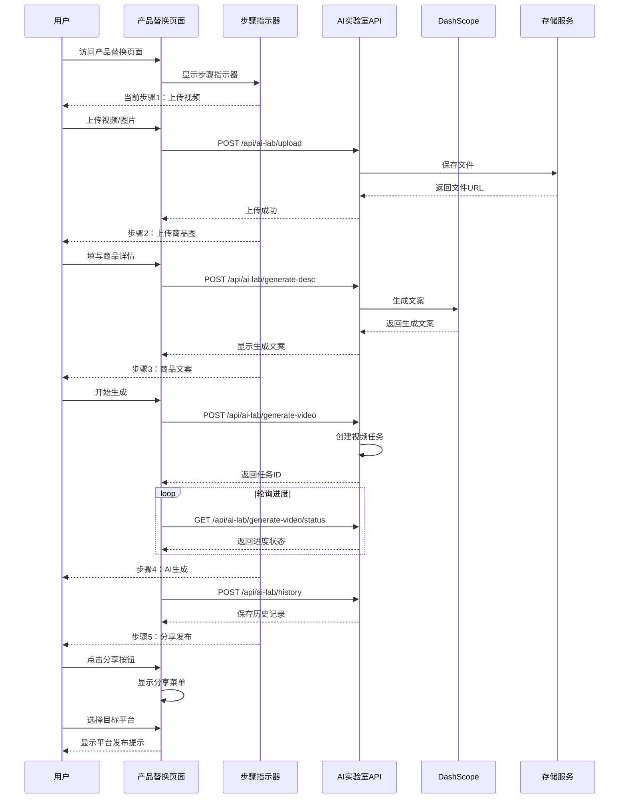

**图表来源**
- [app/ai-lab/product-swap/page.tsx:306-349](file://app/ai-lab/product-swap/page.tsx#L306-L349)
- [app/ai-lab/product-swap/page.tsx:134-288](file://app/ai-lab/product-swap/page.tsx#L134-L288)
- [app/api/ai-lab/upload/route.ts:1-55](file://app/api/ai-lab/upload/route.ts#L1-L55)
- [app/api/ai-lab/generate-desc/route.ts:1-26](file://app/api/ai-lab/generate-desc/route.ts#L1-L26)
- [app/api/ai-lab/generate-video/route.ts:1-68](file://app/api/ai-lab/generate-video/route.ts#L1-L68)
- [app/api/ai-lab/generate-video/status/route.ts:1-27](file://app/api/ai-lab/generate-video/status/route.ts#L1-L27)
- [app/api/ai-lab/history/route.ts:1-119](file://app/api/ai-lab/history/route.ts#L1-L119)

**章节来源**
- [app/ai-lab/page.tsx:1-130](file://app/ai-lab/page.tsx#L1-L130)
- [app/ai-lab/product-swap/page.tsx:1-687](file://app/ai-lab/product-swap/page.tsx#L1-L687)

## 架构概览

整个AI实验室模块采用了分层架构设计，现已完全迁移到生产级API集成：

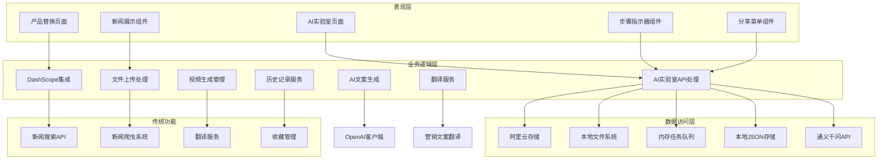

**图表来源**
- [app/api/ai-lab/generate-desc/route.ts:1-26](file://app/api/ai-lab/generate-desc/route.ts#L1-L26)
- [lib/aliyun/dashscope.ts:1-95](file://lib/aliyun/dashscope.ts#L1-L95)
- [lib/aliyun/storage.ts:1-60](file://lib/aliyun/storage.ts#L1-L60)
- [lib/video-tasks.ts:1-31](file://lib/video-tasks.ts#L1-L31)

## 详细组件分析

### 新闻搜索系统

新闻搜索系统保持原有功能，继续作为传统功能模块存在：

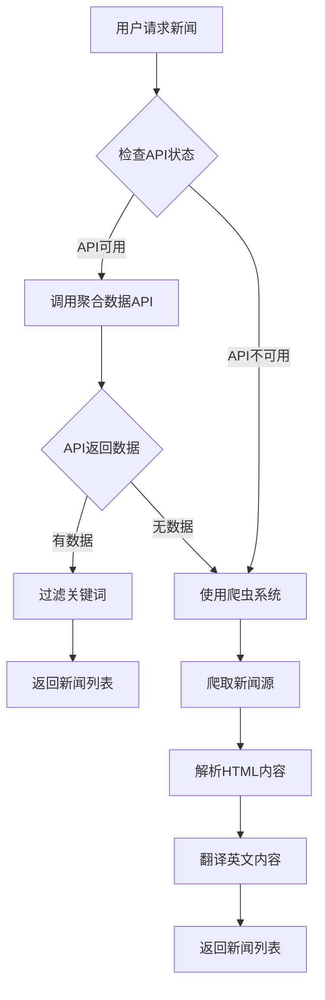

**图表来源**
- [app/api/news/route.ts:16-57](file://app/api/news/route.ts#L16-L57)
- [lib/news-scraper.ts:304-353](file://lib/news-scraper.ts#L304-L353)

**章节来源**
- [lib/brave-search.ts:1-115](file://lib/brave-search.ts#L1-L115)
- [app/api/news/route.ts:16-57](file://app/api/news/route.ts#L16-L57)

## DashScope集成

### 通义千问AI服务

DashScope集成提供了强大的AI服务能力，包括文案生成和翻译功能：

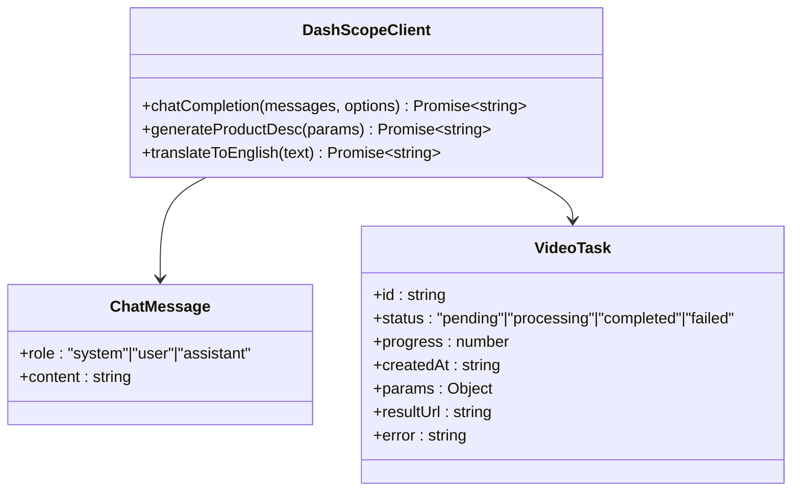

**图表来源**
- [lib/aliyun/dashscope.ts:8-30](file://lib/aliyun/dashscope.ts#L8-L30)
- [lib/video-tasks.ts:6-21](file://lib/video-tasks.ts#L6-L21)

### AI文案生成

系统集成了DashScope的通义千问模型，提供智能的商品推广文案生成：

| 功能特性 | 实现方式 | 性能特点 |
|---------|----------|----------|
| 多场景文案生成 | 支持商品、服饰、模特三种类型 | 基于上下文理解 |
| 营销话术优化 | 专业电商文案专家角色 | 生成内容符合营销规范 |
| 多语言支持 | 中文到英文自动翻译 | 保持营销风格一致 |
| 模板化输出 | 结构化列表格式 | 提高可读性和吸引力 |

**章节来源**
- [lib/aliyun/dashscope.ts:35-70](file://lib/aliyun/dashscope.ts#L35-L70)

### 翻译服务

翻译服务模块提供了专业的中英文营销文案互译功能：

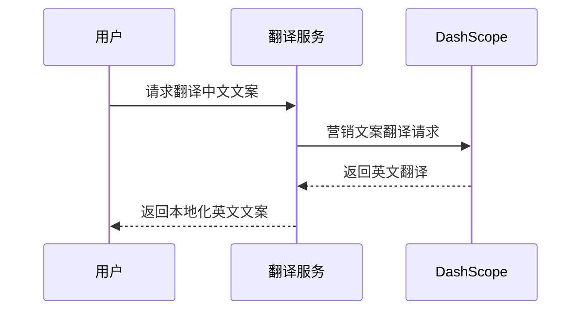

**图表来源**
- [lib/aliyun/dashscope.ts:75-94](file://lib/aliyun/dashscope.ts#L75-L94)

**章节来源**
- [lib/translator.ts:1-132](file://lib/translator.ts#L1-L132)

## 文件上传系统

### 上传服务架构

文件上传系统提供了完整的视频和图片上传功能，支持多种文件格式和大小限制：

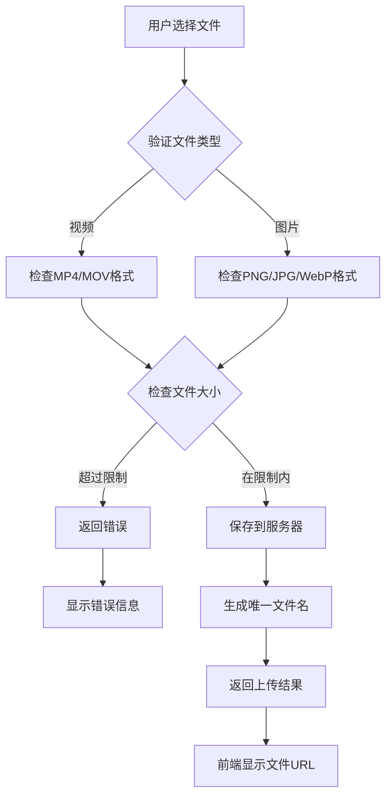

**图表来源**
- [app/api/ai-lab/upload/route.ts:6-54](file://app/api/ai-lab/upload/route.ts#L6-L54)
- [lib/aliyun/storage.ts:22-40](file://lib/aliyun/storage.ts#L22-L40)

### 文件存储策略

系统实现了智能的文件存储和管理机制：

| 文件类型 | 支持格式 | 大小限制 | 存储位置 |
|---------|----------|----------|----------|
| 视频文件 | MP4、MOV、AVI | 200MB | public/uploads/videos/ |
| 图片文件 | PNG、JPG、WebP | 10MB | public/uploads/images/ |
| 安全性 | MD5校验 | 自动重命名 | 防止文件冲突 |

**章节来源**
- [lib/aliyun/storage.ts:45-60](file://lib/aliyun/storage.ts#L45-L60)

## 视频生成管道

### 任务管理系统

视频生成管道提供了完整的任务生命周期管理：

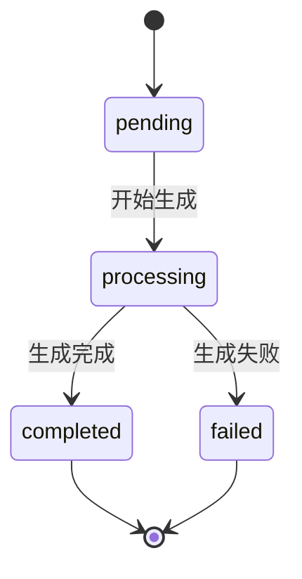

**图表来源**
- [lib/video-tasks.ts:6-21](file://lib/video-tasks.ts#L6-L21)

### 进度跟踪机制

系统实现了实时的视频生成进度跟踪：

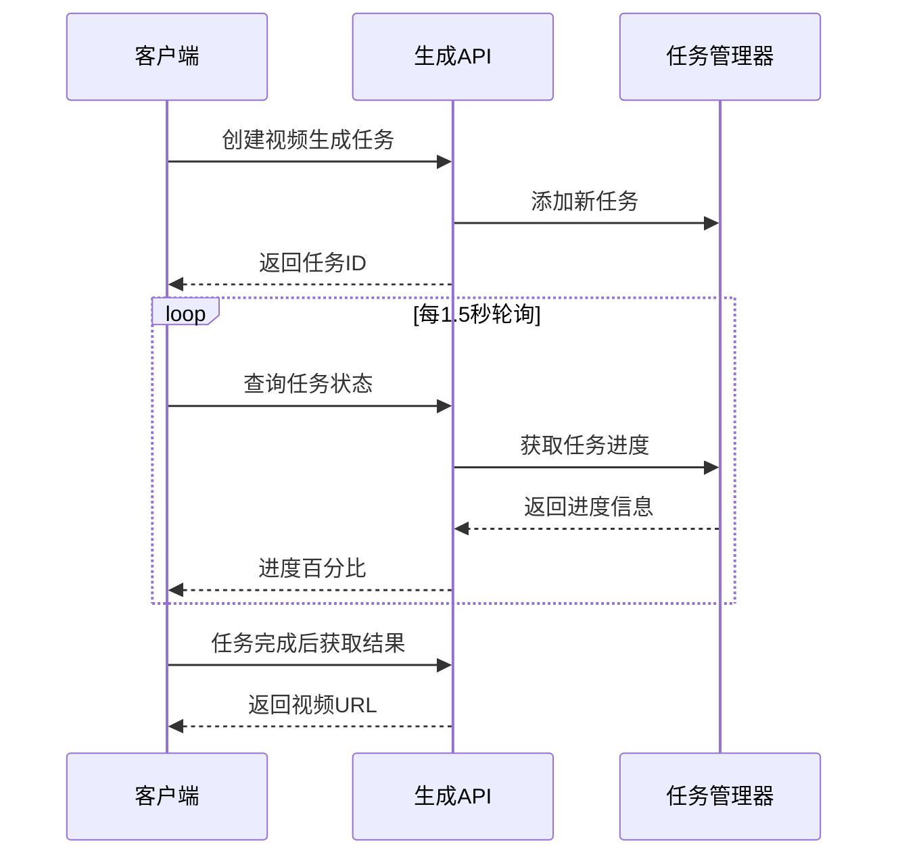

**图表来源**
- [app/ai-lab/product-swap/page.tsx:78-116](file://app/ai-lab/product-swap/page.tsx#L78-L116)
- [app/api/ai-lab/generate-video/route.ts:8-29](file://app/api/ai-lab/generate-video/route.ts#L8-L29)
- [app/api/ai-lab/generate-video/status/route.ts:6-26](file://app/api/ai-lab/generate-video/status/route.ts#L6-L26)

**章节来源**
- [app/api/ai-lab/generate-video/route.ts:1-68](file://app/api/ai-lab/generate-video/route.ts#L1-L68)
- [lib/video-tasks.ts:1-31](file://lib/video-tasks.ts#L1-L31)

## 历史记录管理

### 数据持久化

历史记录管理提供了完整的视频生成历史追踪功能：

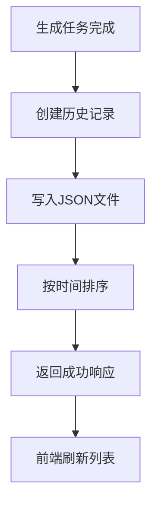

**图表来源**
- [app/api/ai-lab/history/route.ts:66-118](file://app/api/ai-lab/history/route.ts#L66-L118)

### 历史记录结构

系统维护了标准化的历史记录格式：

| 字段名称 | 类型 | 描述 | 示例值 |
|---------|------|------|--------|
| id | string | 历史记录ID | "uuid" |
| title | string | 视频标题 | "商品推广视频" |
| type | enum | 替换类型 | "product" |
| createdAt | string | 创建时间 | "2024-01-01 12:00:00" |
| duration | string | 视频时长 | "0:30" |
| status | enum | 任务状态 | "completed" |
| hasEnglish | boolean | 是否包含英文 | true |
| desc | string | 商品描述 | "商品特点介绍" |
| videoUrl | string | 视频URL | "/uploads/videos/uuid.mp4" |
| imageUrls | string[] | 图片URL数组 | ["/uploads/images/uuid.png"] |
| originalVideoUrl | string | 原始视频URL | 可选 |

**章节来源**
- [app/api/ai-lab/history/route.ts:12-24](file://app/api/ai-lab/history/route.ts#L12-L24)

## 步骤指示器系统

### 现代化步骤导航

产品替换功能经过重构，从传统的多步骤向导转变为现代化的步骤指示器系统，提供更直观的用户体验：

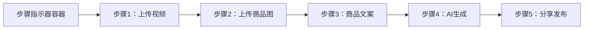

**图表来源**
- [app/ai-lab/product-swap/page.tsx:306-349](file://app/ai-lab/product-swap/page.tsx#L306-L349)

### 步骤状态管理

系统实现了智能的步骤状态管理，包括完成状态、激活状态和当前状态：

| 步骤编号 | 标签 | 状态条件 | 视觉效果 |
|---------|------|----------|----------|
| 1 | 上传视频 | 已上传视频 | 完成状态（绿色勾选） |
| 2 | 上传商品图 | 已上传商品图片 | 完成状态（绿色勾选） |
| 3 | 商品文案 | 已生成/填写文案 | 完成状态（绿色勾选） |
| 4 | AI生成 | 生成中或已完成 | 当前状态（脉冲动画） |
| 5 | 分享发布 | 生成完成 | 待激活状态（灰色） |

### 步骤指示器设计

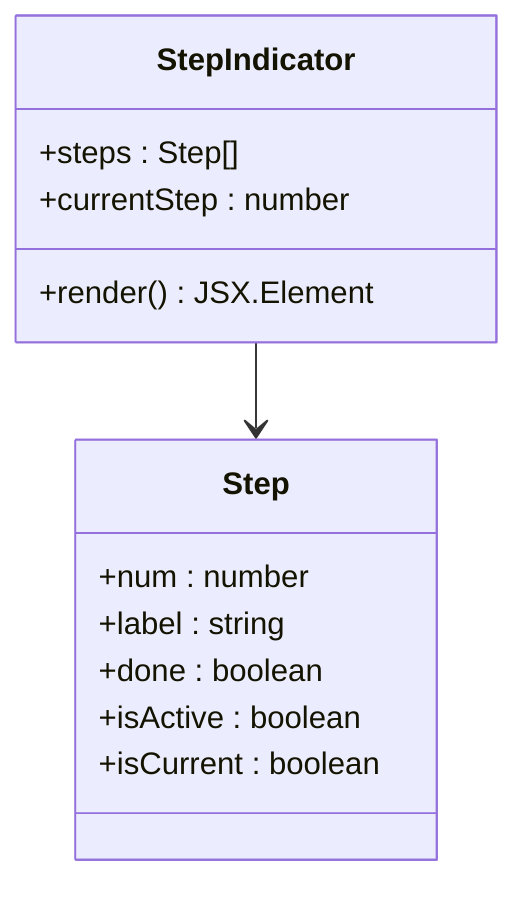

**图表来源**
- [app/ai-lab/product-swap/page.tsx:310-346](file://app/ai-lab/product-swap/page.tsx#L310-L346)

**章节来源**
- [app/ai-lab/product-swap/page.tsx:306-349](file://app/ai-lab/product-swap/page.tsx#L306-L349)

## 分享功能集成

### 平台分享系统

新增的分享功能集成了多个主流短视频平台，提供一键分享到目标平台的能力：

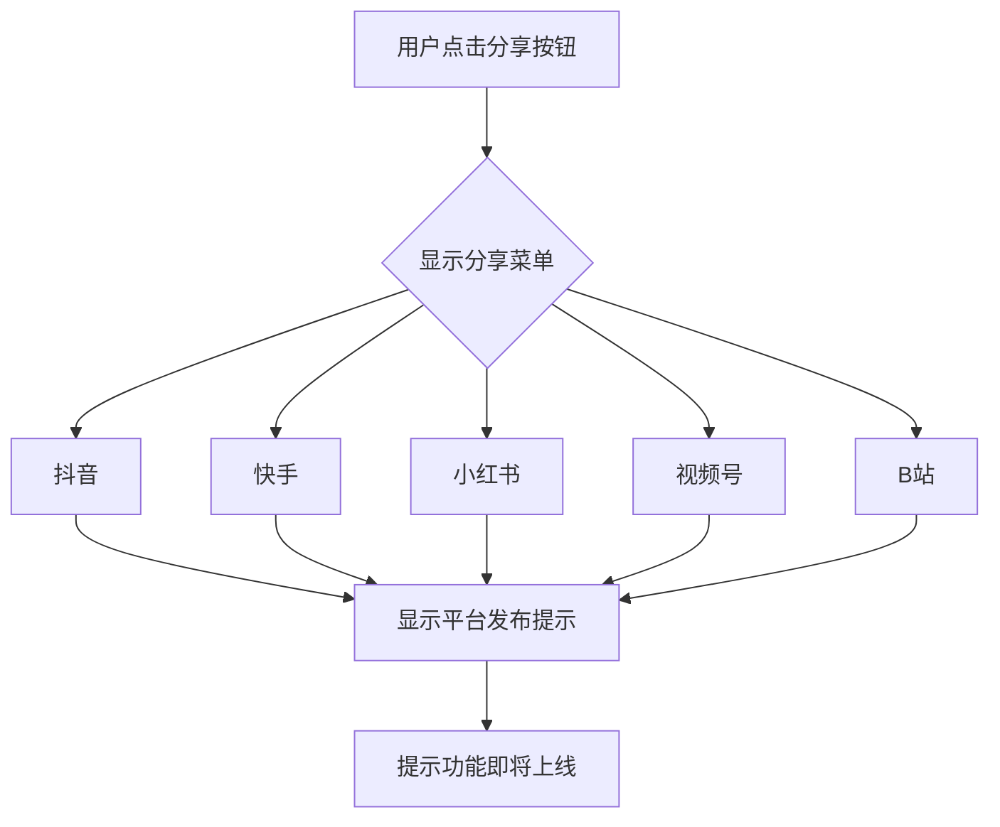

**图表来源**
- [app/ai-lab/product-swap/page.tsx:645-671](file://app/ai-lab/product-swap/page.tsx#L645-L671)

### 分享菜单设计

系统实现了响应式的分享菜单，支持下拉展开和平台选择：

| 平台名称 | 图标 | 颜色主题 | 功能状态 |
|---------|------|----------|----------|
| 抖音 | 🎵 | 黑色 | 即将上线 |
| 快手 | 📹 | 橙色 | 即将上线 |
| 小红书 | 📕 | 粉色 | 即将上线 |
| 视频号 | 💬 | 绿色 | 即将上线 |
| B站 | 📺 | 蓝色 | 即将上线 |

### 分享流程

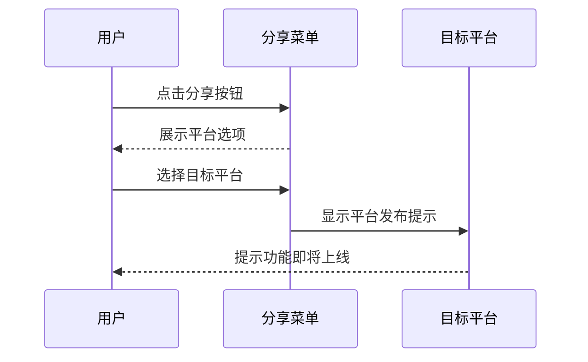

**图表来源**
- [app/ai-lab/product-swap/page.tsx:646-670](file://app/ai-lab/product-swap/page.tsx#L646-L670)

**章节来源**
- [app/ai-lab/product-swap/page.tsx:645-671](file://app/ai-lab/product-swap/page.tsx#L645-L671)

## 依赖关系分析

项目的主要依赖关系已经完全重构为生产级架构：

```mermaid
graph LR
subgraph "核心依赖"
A[next@^16.1.6]
B[react@^19.2.4]
C[react-dom@^19.2.4]
D[openai@^4.0.0]
E[uuid@^9.0.0]
end
subgraph "开发依赖"
F[tailwindcss@^4.2.1]
G[typescript@^5.9.3]
H[@types/node@^25.3.5]
I[@types/react@^19.2.14]
end
subgraph "运行时依赖"
J[postcss@^8.5.8]
K[@tailwindcss/postcss@^4.2.1]
L[cheerio@^1.2.0]
M[fs/promises]
N[path]
O[process]
end
A --> D
A --> E
B --> A
C --> A
D --> O
E --> O
F --> J
G --> H
G --> I
J --> L
M --> O
N --> O
```

**图表来源**
- [package.json:15-28](file://package.json#L15-L28)

**章节来源**
- [package.json:1-30](file://package.json#L1-L30)

## 性能考虑

### 缓存策略

系统实现了多层次的缓存机制来优化性能：

1. **内存缓存**：视频任务状态存储在内存中，提高查询速度
2. **文件缓存**：生成的视频和图片存储在本地文件系统
3. **API缓存**：DashScope API响应进行智能缓存
4. **前端缓存**：用户界面状态和历史记录缓存

### 并发处理

系统支持并发的文件上传和视频生成任务：

- 最大并发任务数：10个
- 超时控制：30秒超时保护
- 错误重试：自动重试失败的任务
- 资源清理：定时清理过期文件和任务

### 响应式设计

UI组件都支持响应式布局，适配不同设备的显示需求。

## 故障排除指南

### 常见问题及解决方案

| 问题类型 | 症状描述 | 解决方案 |
|---------|----------|----------|
| API密钥错误 | DashScope调用失败 | 检查DASHSCOPE_API_KEY配置 |
| 文件上传失败 | 400错误 | 检查文件类型和大小限制 |
| 视频生成超时 | 任务长时间pending | 检查服务器资源和网络连接 |
| 历史记录丢失 | JSON文件损坏 | 检查data目录权限和磁盘空间 |
| 进度查询失败 | 404任务不存在 | 检查任务ID是否正确传递 |
| 步骤指示器异常 | 步骤状态显示错误 | 刷新页面或检查状态管理逻辑 |
| 分享功能失效 | 平台链接无法点击 | 检查分享菜单状态和事件绑定 |

### 调试方法

1. **查看控制台日志**：检查JavaScript错误和API响应
2. **网络面板监控**：观察API请求和响应状态
3. **文件系统检查**：验证上传文件和历史记录存储
4. **环境变量验证**：确认所有必需的环境变量已正确设置

**章节来源**
- [lib/aliyun/dashscope.ts:3-6](file://lib/aliyun/dashscope.ts#L3-L6)
- [lib/aliyun/storage.ts:11-17](file://lib/aliyun/storage.ts#L11-L17)
- [app/api/ai-lab/upload/route.ts:18-33](file://app/api/ai-lab/upload/route.ts#L18-L33)

## 结论

AI实验室模块已完成从纯前端模拟到生产级API集成的重大升级。通过引入DashScope通义千问、完整的文件上传系统、视频生成管道、历史记录管理等核心功能，为用户提供了真正可用的AI内容创作解决方案。

### 主要优势

1. **功能完整**：涵盖视频生成、图像处理、AI内容生成、文件管理等多个AI应用
2. **生产级架构**：采用Node.js后端、内存任务管理、本地文件存储的稳定架构
3. **API集成**：深度集成DashScope通义千问，提供高质量的AI服务能力
4. **用户体验**：现代化的步骤指示器系统和分享功能，提供直观易用的操作体验
5. **可扩展性**：模块化设计便于后续功能扩展和技术升级

### 技术亮点

1. **智能文案生成**：基于通义千问的专业电商文案生成
2. **多格式文件支持**：完整的视频和图片上传处理系统
3. **实时进度跟踪**：可视化视频生成进度和状态管理
4. **历史记录持久化**：完整的任务历史追踪和管理
5. **现代化步骤指示器**：从传统向导重构为直观的步骤导航
6. **平台分享集成**：支持多平台一键分享功能
7. **响应式设计**：适配多种设备和屏幕尺寸的界面

### 发展方向

1. **AI能力扩展**：集成更多DashScope模型和第三方AI服务
2. **性能优化**：引入Redis缓存、数据库存储等高性能组件
3. **功能完善**：添加视频编辑、批量处理等高级功能
4. **国际化支持**：扩展多语言支持和本地化服务
5. **移动端适配**：开发专门的移动端应用和优化
6. **分享功能完善**：实现真正的平台发布功能

该模块现已具备成为电商内容创作领域领先解决方案的完整基础，为用户提供了一站式的AI内容生成和管理服务。通过现代化的步骤指示器系统和分享功能集成，显著提升了用户体验和操作效率。