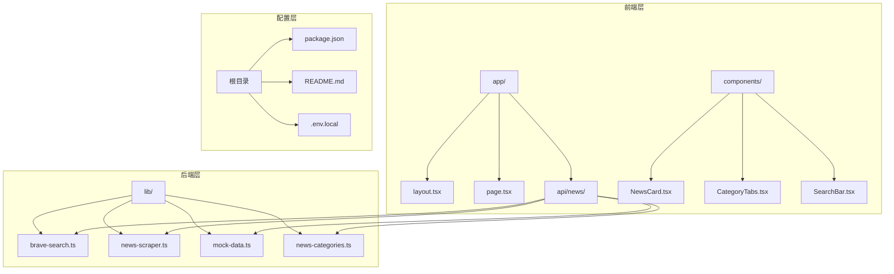
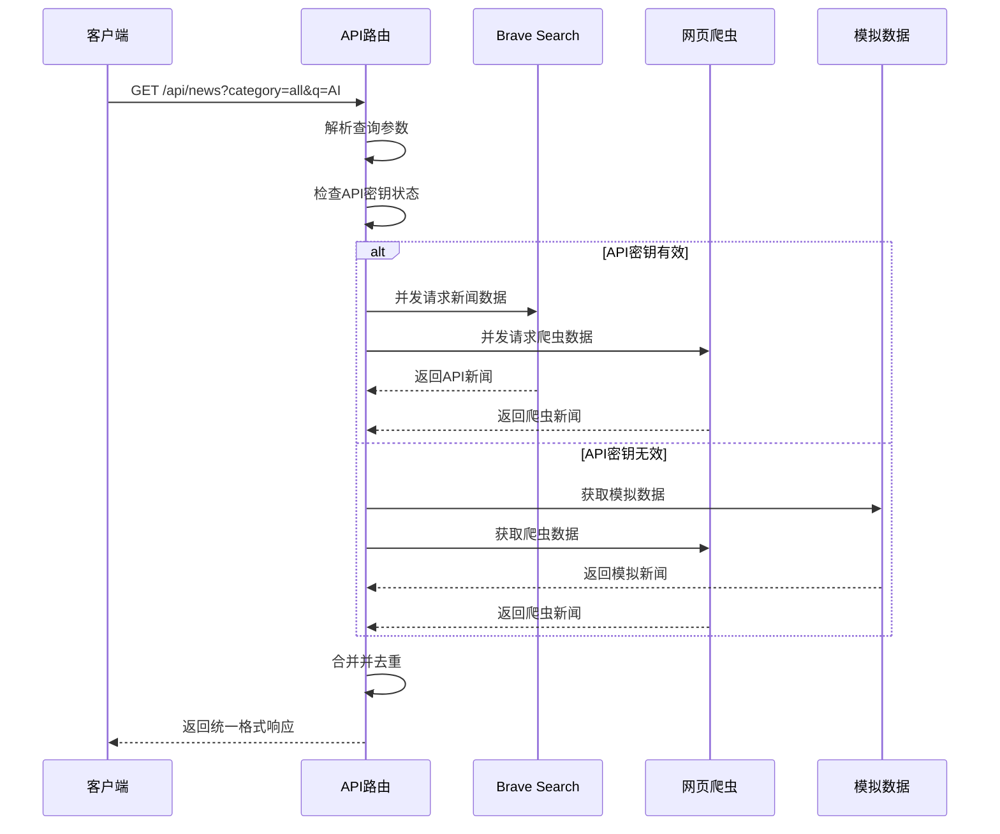
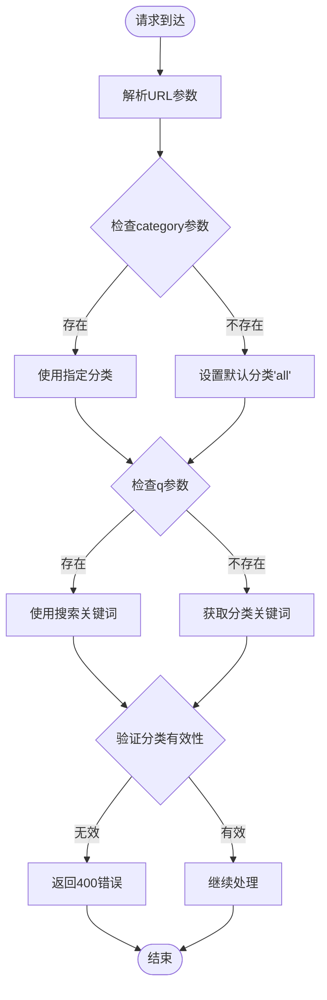
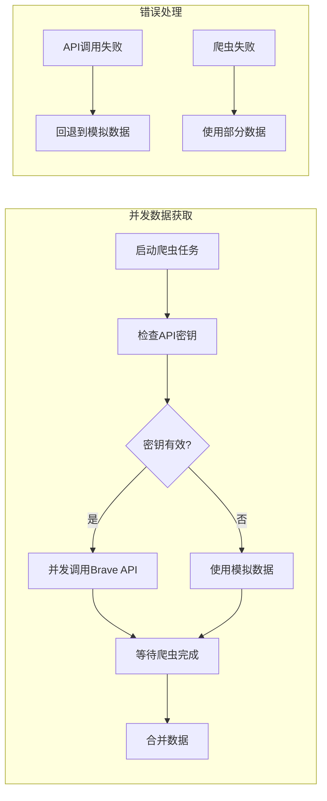
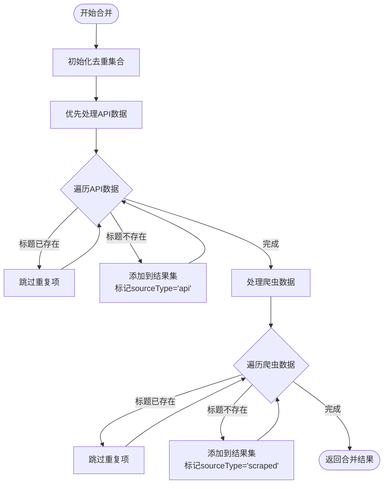
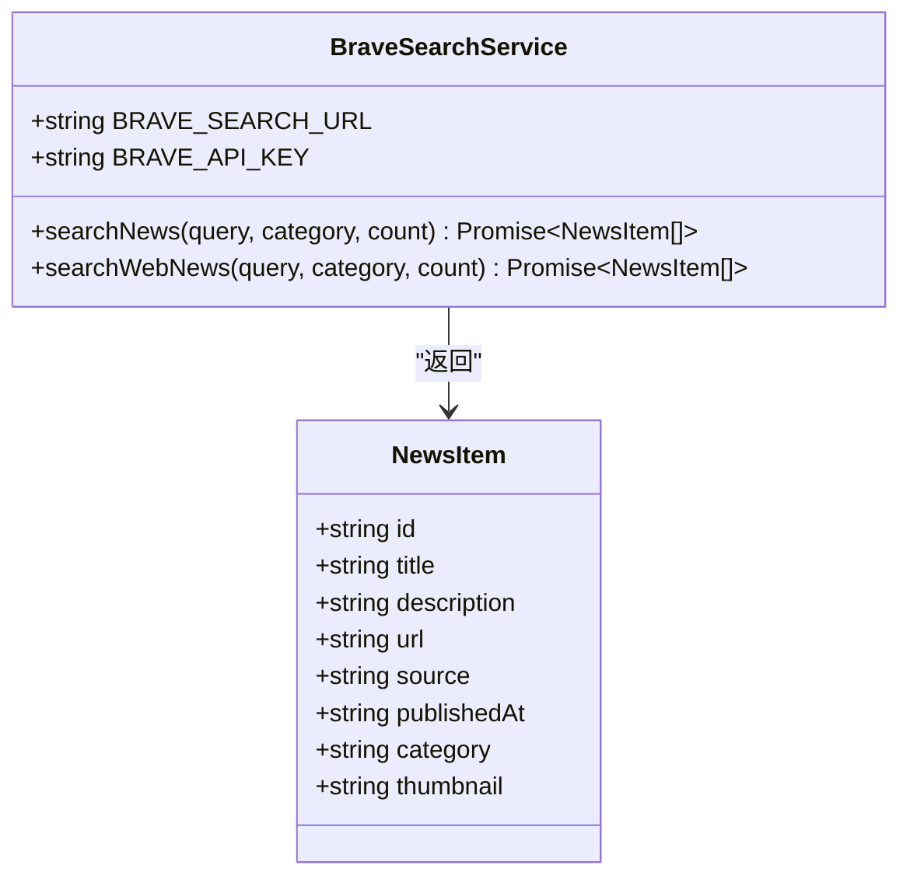
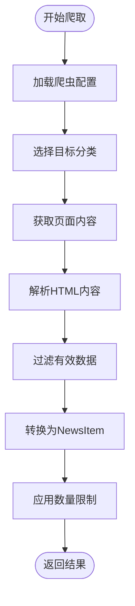
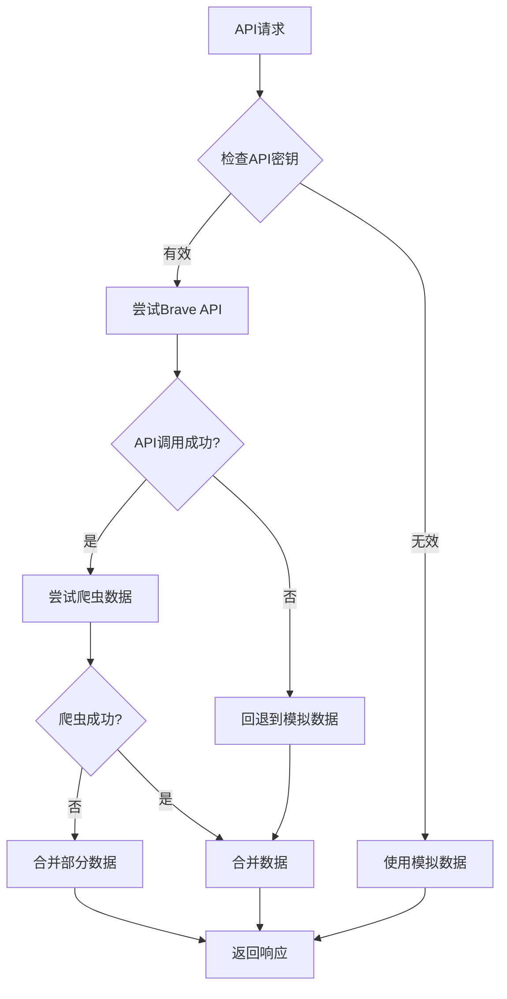
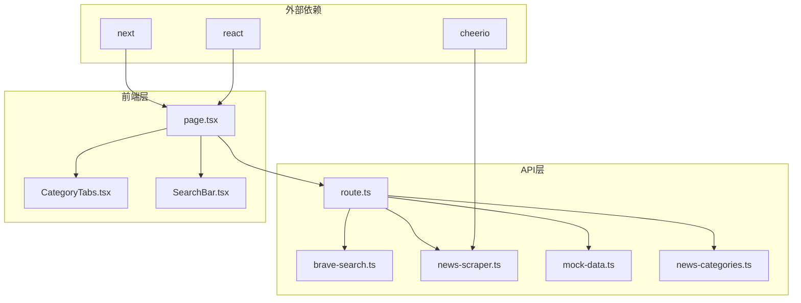

# API接口集成

<cite>
**本文档引用的文件**
- [app/api/news/route.ts](file://app/api/news/route.ts)
- [lib/brave-search.ts](file://lib/brave-search.ts)
- [lib/news-scraper.ts](file://lib/news-scraper.ts)
- [lib/mock-data.ts](file://lib/mock-data.ts)
- [lib/news-categories.ts](file://lib/news-categories.ts)
- [app/page.tsx](file://app/page.tsx)
- [components/CategoryTabs.tsx](file://components/CategoryTabs.tsx)
- [components/SearchBar.tsx](file://components/SearchBar.tsx)
- [README.md](file://README.md)
- [package.json](file://package.json)
</cite>

## 目录
1. [简介](#简介)
2. [项目结构](#项目结构)
3. [核心组件](#核心组件)
4. [架构概览](#架构概览)
5. [详细组件分析](#详细组件分析)
6. [依赖关系分析](#依赖关系分析)
7. [性能考虑](#性能考虑)
8. [故障排除指南](#故障排除指南)
9. [结论](#结论)
10. [附录](#附录)

## 简介

本项目是一个基于Next.js的新闻聚合网站，提供了完整的API接口集成方案。本文档专注于/app/api/news/route.ts中新闻API的实现，详细解释了API路由的设计架构、请求参数处理、数据获取流程、多源数据合并逻辑和去重机制。

该API实现了双数据源架构：通过Brave Search API获取权威新闻数据，同时结合网页爬虫获取补充信息，最终通过智能去重算法提供高质量的新闻聚合服务。

## 项目结构

项目采用模块化设计，主要包含以下核心目录：



**图表来源**
- [app/api/news/route.ts](file://app/api/news/route.ts#L1-L136)
- [lib/brave-search.ts](file://lib/brave-search.ts#L1-L115)
- [lib/news-scraper.ts](file://lib/news-scraper.ts#L1-L166)

**章节来源**
- [package.json](file://package.json#L1-L30)
- [README.md](file://README.md#L36-L49)

## 核心组件

### API路由控制器

`app/api/news/route.ts`是整个新闻API的核心控制器，负责处理HTTP请求、协调数据源、执行业务逻辑和返回标准化响应。

### 数据源模块

系统集成了三种数据源：
- **Brave Search API**：权威新闻搜索服务
- **网页爬虫**：Hacker News等新闻源的数据抓取
- **模拟数据**：开发环境下的备用数据源

### 响应模型

API返回统一的JSON格式，包含新闻列表、元数据和统计信息。

**章节来源**
- [app/api/news/route.ts](file://app/api/news/route.ts#L1-L136)
- [lib/brave-search.ts](file://lib/brave-search.ts#L1-L115)

## 架构概览

系统采用分层架构设计，实现了高可用性和容错能力：



**图表来源**
- [app/api/news/route.ts](file://app/api/news/route.ts#L39-L135)
- [lib/brave-search.ts](file://lib/brave-search.ts#L30-L73)
- [lib/news-scraper.ts](file://lib/news-scraper.ts#L140-L153)

## 详细组件分析

### API路由实现

#### HTTP方法和URL模式
- **HTTP方法**：GET
- **URL模式**：`/api/news`
- **查询参数**：
  - `category`：新闻分类，默认值为"all"
  - `q`：搜索关键词，可选参数

#### 请求参数处理

API路由采用优雅的参数处理机制：



**图表来源**
- [app/api/news/route.ts](file://app/api/news/route.ts#L40-L90)

#### 数据获取流程

API实现了智能的并发数据获取策略：



**图表来源**
- [app/api/news/route.ts](file://app/api/news/route.ts#L44-L96)
- [app/api/news/route.ts](file://app/api/news/route.ts#L112-L134)

#### 多源数据合并逻辑

系统实现了智能的去重和优先级机制：



**图表来源**
- [app/api/news/route.ts](file://app/api/news/route.ts#L14-L37)

#### 响应格式规范

API返回统一的JSON响应结构：

| 字段名 | 类型 | 描述 | 示例 |
|--------|------|------|------|
| `news` | Array | 新闻项目数组 | `[...]` |
| `category` | String | 当前分类 | `"all"` |
| `query` | String | 查询关键词或来源 | `"AI"` |
| `timestamp` | String | ISO时间戳 | `"2024-01-01T00:00:00Z"` |
| `mock` | Boolean | 是否使用模拟数据 | `true` |
| `sources` | Object | 数据源统计信息 | `{}` |

**章节来源**
- [app/api/news/route.ts](file://app/api/news/route.ts#L57-L73)
- [app/api/news/route.ts](file://app/api/news/route.ts#L101-L111)

### 数据源模块

#### Brave Search API集成

`lib/brave-search.ts`提供了完整的Brave Search API封装：



**图表来源**
- [lib/brave-search.ts](file://lib/brave-search.ts#L1-L115)

#### 网页爬虫实现

`lib/news-scraper.ts`实现了灵活的网页爬虫框架：



**图表来源**
- [lib/news-scraper.ts](file://lib/news-scraper.ts#L116-L138)

#### 模拟数据服务

`lib/mock-data.ts`提供了开发和测试用的模拟数据：

| 分类 | 新闻数量 | 数据来源 |
|------|----------|----------|
| `all` | 6条 | 通用新闻 |
| `politics` | 4条 | 国际时政 |
| `business` | 4条 | 财经商业 |
| `tech` | 4条 | 科技互联网 |

**章节来源**
- [lib/brave-search.ts](file://lib/brave-search.ts#L30-L73)
- [lib/news-scraper.ts](file://lib/news-scraper.ts#L140-L153)
- [lib/mock-data.ts](file://lib/mock-data.ts#L194-L196)

### 错误处理策略

系统实现了多层次的错误处理机制：



**图表来源**
- [app/api/news/route.ts](file://app/api/news/route.ts#L48-L74)
- [app/api/news/route.ts](file://app/api/news/route.ts#L112-L134)

**章节来源**
- [app/api/news/route.ts](file://app/api/news/route.ts#L112-L134)

## 依赖关系分析

系统采用了清晰的模块化依赖关系：



**图表来源**
- [app/api/news/route.ts](file://app/api/news/route.ts#L1-L6)
- [app/page.tsx](file://app/page.tsx#L1-L10)

**章节来源**
- [package.json](file://package.json#L15-L28)

## 性能考虑

### 并发优化

API实现了关键的性能优化策略：

1. **并发数据获取**：使用`Promise.all()`同时获取多个数据源
2. **智能缓存**：利用浏览器和服务器端缓存机制
3. **去重优化**：使用Set数据结构实现O(1)查找效率

### 内存管理

- **流式处理**：避免一次性加载大量数据
- **及时释放**：合理管理爬虫过程中的内存占用
- **错误隔离**：单个数据源失败不影响整体性能

### 网络优化

- **HTTP压缩**：启用gzip压缩减少传输体积
- **连接复用**：复用HTTP连接提高效率
- **超时控制**：设置合理的请求超时时间

## 故障排除指南

### 常见问题及解决方案

#### API密钥配置问题

**问题**：API无法正常工作，返回模拟数据
**原因**：BRAVE_API_KEY未正确配置
**解决方案**：
1. 在`.env.local`文件中添加API密钥
2. 确保API密钥格式正确
3. 检查API配额是否耗尽

#### 网络连接问题

**问题**：爬虫数据获取失败
**原因**：网络不稳定或目标网站不可达
**解决方案**：
1. 检查网络连接状态
2. 验证目标网站可访问性
3. 调整爬虫超时设置

#### 数据去重异常

**问题**：新闻重复显示
**原因**：标题标准化处理不当
**解决方案**：
1. 检查标题大小写处理逻辑
2. 验证空白字符清理机制
3. 确认去重算法的健壮性

### 调试技巧

1. **启用详细日志**：在开发环境中开启详细的错误日志
2. **监控API调用**：使用浏览器开发者工具监控网络请求
3. **测试数据源**：分别测试各个数据源的可用性

**章节来源**
- [app/api/news/route.ts](file://app/api/news/route.ts#L7-L11)
- [README.md](file://README.md#L24-L33)

## 结论

本API接口集成了先进的新闻聚合技术，通过多数据源融合和智能去重算法，为用户提供了高质量的新闻信息服务。系统具有以下优势：

1. **高可用性**：多重备份机制确保服务稳定性
2. **高性能**：并发处理和智能缓存提升响应速度
3. **易扩展**：模块化设计便于功能扩展
4. **容错性强**：完善的错误处理机制

建议在生产环境中：
- 配置合适的API密钥和配额
- 监控系统性能指标
- 定期更新爬虫规则以适应目标网站变化
- 实施更严格的输入验证和安全防护

## 附录

### API使用示例

#### curl命令示例

获取全部分类的新闻：
```bash
curl "http://localhost:3000/api/news?category=all"
```

按关键词搜索新闻：
```bash
curl "http://localhost:3000/api/news?q=AI&category=all"
```

获取特定分类的新闻：
```bash
curl "http://localhost:3000/api/news?category=tech"
```

#### JavaScript客户端调用

```javascript
// 基础调用
async function fetchNews(category = 'all', query = '') {
  const params = new URLSearchParams({ category });
  if (query) params.set('q', query);
  
  try {
    const response = await fetch(`/api/news?${params}`);
    if (!response.ok) throw new Error('Network response was not ok');
    
    const data = await response.json();
    return data.news;
  } catch (error) {
    console.error('Error fetching news:', error);
    throw error;
  }
}

// 使用示例
fetchNews('all', 'AI')
  .then(news => console.log('获取到', news.length, '条新闻'))
  .catch(error => console.error('获取失败:', error));
```

### 响应数据结构详解

完整的响应数据包含以下字段：

| 字段 | 类型 | 必需 | 描述 |
|------|------|------|------|
| `news` | Array | 是 | 新闻项目数组 |
| `category` | String | 是 | 当前分类标识符 |
| `query` | String | 是 | 查询关键词或来源类型 |
| `timestamp` | String | 是 | ISO 8601格式的时间戳 |
| `mock` | Boolean | 否 | 标识是否使用模拟数据 |
| `sources` | Object | 是 | 数据源统计信息对象 |

**章节来源**
- [app/page.tsx](file://app/page.tsx#L19-L38)
- [app/api/news/route.ts](file://app/api/news/route.ts#L57-L111)