# 专业经验展示系统

<cite>
**本文档引用的文件**
- [README.md](file://README.md)
- [package.json](file://package.json)
- [app/layout.tsx](file://app/layout.tsx)
- [app/page.tsx](file://app/page.tsx)
- [app/api/news/route.ts](file://app/api/news/route.ts)
- [lib/brave-search.ts](file://lib/brave-search.ts)
- [lib/news-scraper.ts](file://lib/news-scraper.ts)
- [lib/favorites.ts](file://lib/favorites.ts)
- [lib/news-categories.ts](file://lib/news-categories.ts)
- [lib/mock-data.ts](file://lib/mock-data.ts)
- [components/CategoryTabs.tsx](file://components/CategoryTabs.tsx)
- [components/SearchBar.tsx](file://components/SearchBar.tsx)
- [components/NewsCard.tsx](file://components/NewsCard.tsx)
- [components/NewsSummary.tsx](file://components/NewsSummary.tsx)
- [config/news-sources.json](file://config/news-sources.json)
</cite>

## 目录
1. [项目概述](#项目概述)
2. [项目结构](#项目结构)
3. [核心组件](#核心组件)
4. [架构概览](#架构概览)
5. [详细组件分析](#详细组件分析)
6. [依赖关系分析](#依赖关系分析)
7. [性能考量](#性能考量)
8. [故障排除指南](#故障排除指南)
9. [结论](#结论)

## 项目概述

专业经验展示系统是一个基于Next.js开发的现代化新闻聚合平台，旨在为用户提供全方位的专业经验展示和新闻资讯服务。该系统集成了多种新闻源，提供实时新闻聚合、分类浏览、搜索功能和收藏管理等核心特性。

### 主要功能特性

- **多源新闻聚合**：整合国内外主流新闻源，提供全面的新闻资讯
- **智能分类浏览**：支持综合热点、国际时政、财经商业、科技互联网四大分类
- **实时搜索功能**：关键词实时搜索，支持精确匹配和模糊搜索
- **收藏管理系统**：本地存储用户收藏的新闻内容
- **专业经验展示**：专门的AI实验室和专业经验展示区域
- **多地区新闻关注**：特别关注伊朗局势、杭州本地新闻等特定领域

### 技术栈亮点

- **前端框架**：Next.js 16.1.6，支持SSR和静态生成
- **UI框架**：React 19.2.4，配合Tailwind CSS样式系统
- **新闻API**：Brave Search API提供高质量新闻搜索
- **数据持久化**：localStorage实现本地收藏管理
- **响应式设计**：完全适配移动端和桌面端显示

## 项目结构

该项目采用标准的Next.js项目结构，具有清晰的模块化组织：

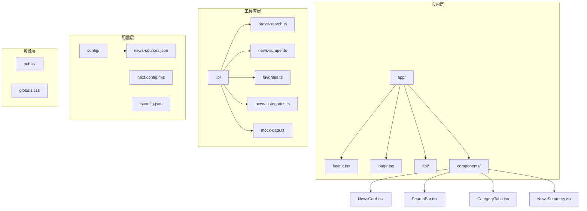

**图表来源**
- [app/layout.tsx:1-27](file://app/layout.tsx#L1-L27)
- [app/page.tsx:1-882](file://app/page.tsx#L1-L882)
- [lib/news-scraper.ts:1-971](file://lib/news-scraper.ts#L1-L971)

**章节来源**
- [README.md:36-49](file://README.md#L36-L49)
- [package.json:1-30](file://package.json#L1-L30)

## 核心组件

### 新闻聚合系统

系统的核心是强大的新闻聚合引擎，支持多种数据源和获取策略：

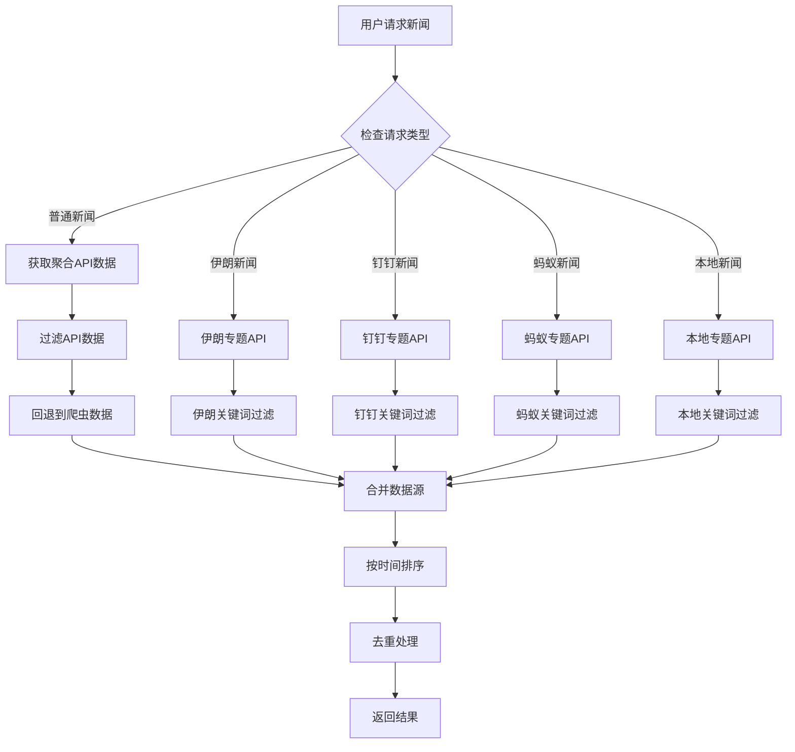

**图表来源**
- [app/api/news/route.ts:59-256](file://app/api/news/route.ts#L59-L256)
- [lib/news-scraper.ts:14-37](file://lib/news-scraper.ts#L14-L37)

### 用户界面组件

系统采用模块化的组件设计，每个组件都有明确的职责分工：

- **CategoryTabs**：新闻分类标签选择器
- **SearchBar**：全局搜索输入框
- **NewsCard**：单条新闻卡片展示
- **NewsSummary**：今日热点摘要
- **AI实验室**：专业经验展示区域

**章节来源**
- [components/CategoryTabs.tsx:1-50](file://components/CategoryTabs.tsx#L1-L50)
- [components/SearchBar.tsx:1-41](file://components/SearchBar.tsx#L1-L41)
- [components/NewsCard.tsx:1-97](file://components/NewsCard.tsx#L1-L97)
- [components/NewsSummary.tsx:1-74](file://components/NewsSummary.tsx#L1-L74)

## 架构概览

系统采用分层架构设计，确保了良好的可维护性和扩展性：

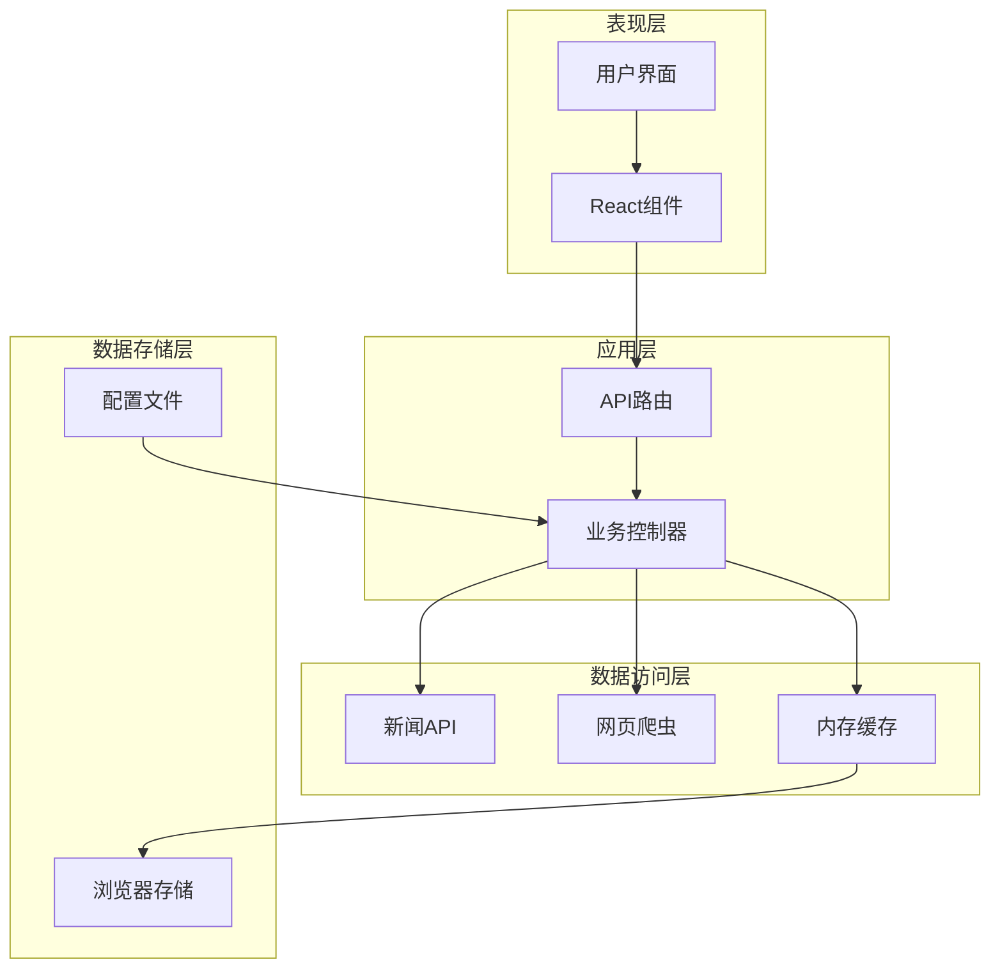

**图表来源**
- [app/api/news/route.ts:1-256](file://app/api/news/route.ts#L1-L256)
- [lib/news-scraper.ts:1-971](file://lib/news-scraper.ts#L1-L971)
- [lib/favorites.ts:1-29](file://lib/favorites.ts#L1-L29)

### 数据流处理

系统的数据流遵循严格的处理流程：

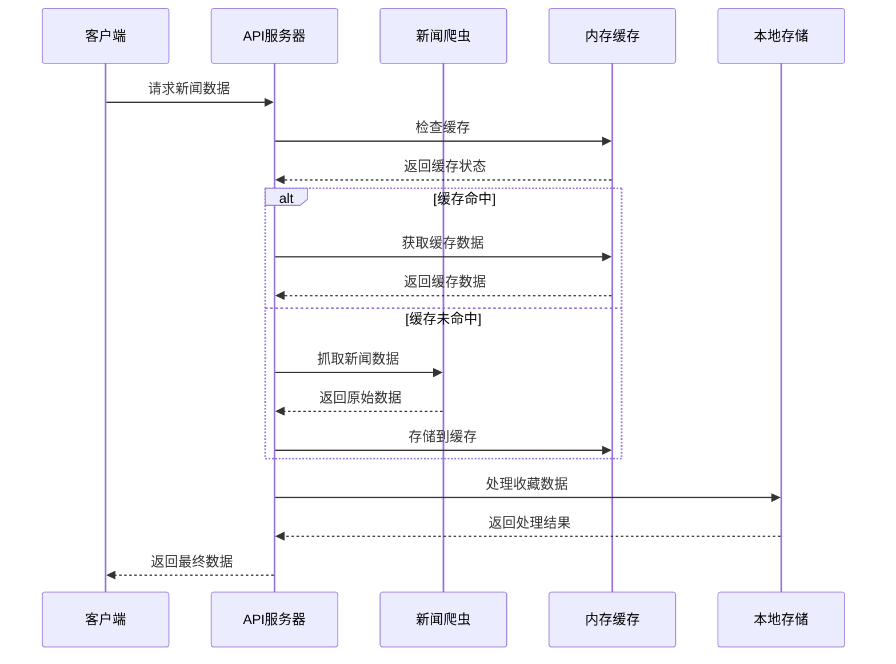

**图表来源**
- [app/api/news/route.ts:16-57](file://app/api/news/route.ts#L16-L57)
- [lib/news-scraper.ts:14-37](file://lib/news-scraper.ts#L14-L37)
- [lib/favorites.ts:1-29](file://lib/favorites.ts#L1-L29)

**章节来源**
- [app/page.tsx:41-163](file://app/page.tsx#L41-L163)
- [lib/news-scraper.ts:10-37](file://lib/news-scraper.ts#L10-L37)

## 详细组件分析

### 新闻API服务

新闻API服务是整个系统的核心，负责处理各种类型的新闻请求：

#### 主要功能特性

- **多类型新闻支持**：普通新闻、专题新闻（伊朗、钉钉、蚂蚁、本地）
- **智能回退机制**：API失败时自动回退到网页爬虫
- **实时数据处理**：动态获取最新新闻内容
- **数据过滤优化**：根据关键词精确筛选新闻内容

#### 关键实现细节

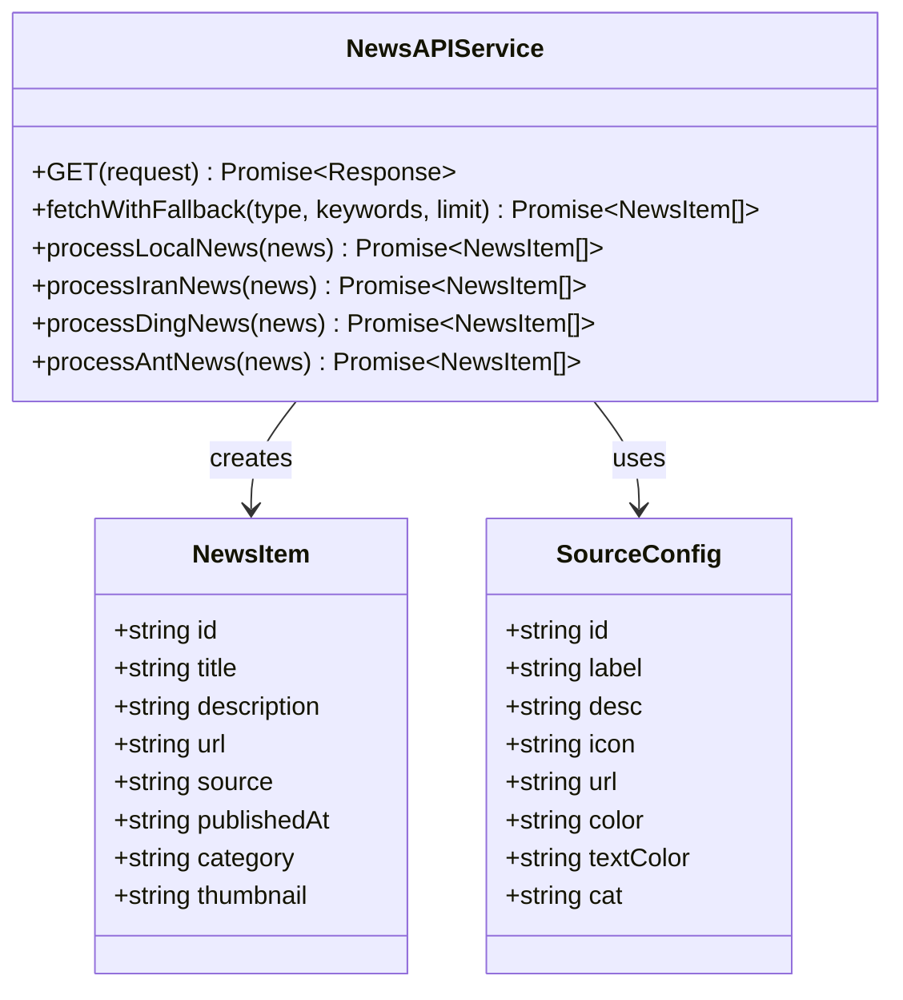

**图表来源**
- [app/api/news/route.ts:59-256](file://app/api/news/route.ts#L59-L256)
- [lib/brave-search.ts:1-115](file://lib/brave-search.ts#L1-L115)
- [lib/news-scraper.ts:383-415](file://lib/news-scraper.ts#L383-L415)

**章节来源**
- [app/api/news/route.ts:16-57](file://app/api/news/route.ts#L16-L57)

### 新闻爬虫系统

系统集成了强大的网页爬虫功能，能够从多个新闻源获取实时信息：

#### 支持的新闻源

| 新闻源 | 类别 | 特点 |
|--------|------|------|
| 人民网 | 时政 | 官方权威新闻 |
| 环球时报 | 国际 | 全球视角分析 |
| 中国日报 | 国际 | 英文国际新闻 |
| 36氪 | 商业 | 科技商业资讯 |
| IT之家 | 科技 | 数码科技新闻 |
| 钉钉官网 | 企业 | 企业动态追踪 |

#### 爬虫实现策略

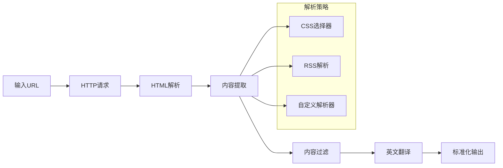

**图表来源**
- [lib/news-scraper.ts:304-353](file://lib/news-scraper.ts#L304-L353)
- [lib/news-scraper.ts:418-800](file://lib/news-scraper.ts#L418-L800)

**章节来源**
- [lib/news-scraper.ts:40-273](file://lib/news-scraper.ts#L40-L273)

### 用户收藏系统

收藏系统提供了完整的本地存储解决方案：

#### 功能特性

- **本地存储**：使用localStorage保存用户收藏
- **去重机制**：防止重复收藏相同新闻
- **实时同步**：收藏状态实时更新
- **跨页面共享**：收藏数据在所有页面间共享

#### 数据结构设计

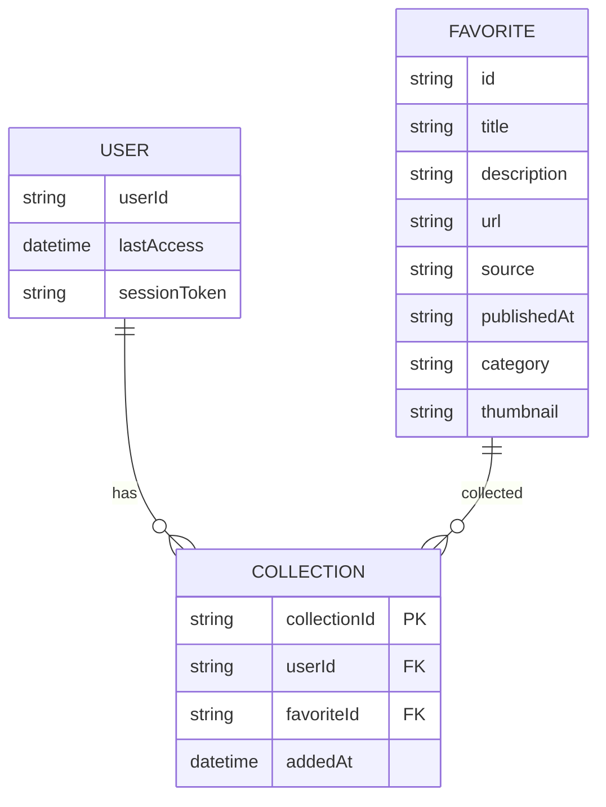

**图表来源**
- [lib/favorites.ts:1-29](file://lib/favorites.ts#L1-L29)
- [lib/brave-search.ts:1-115](file://lib/brave-search.ts#L1-L115)

**章节来源**
- [lib/favorites.ts:1-29](file://lib/favorites.ts#L1-L29)

### 用户界面组件

#### 分类标签组件

分类标签组件提供了直观的新闻分类导航：

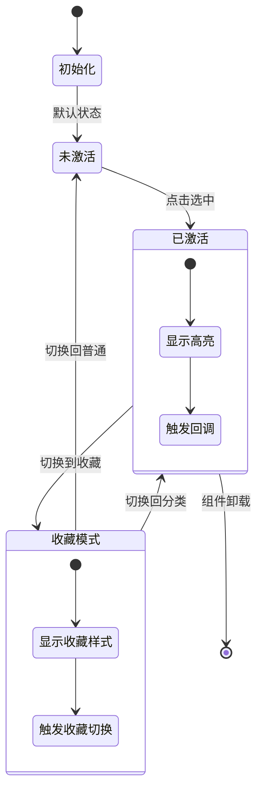

**图表来源**
- [components/CategoryTabs.tsx:12-49](file://components/CategoryTabs.tsx#L12-L49)

**章节来源**
- [components/CategoryTabs.tsx:1-50](file://components/CategoryTabs.tsx#L1-L50)

#### 搜索栏组件

搜索栏组件实现了完整的搜索功能：

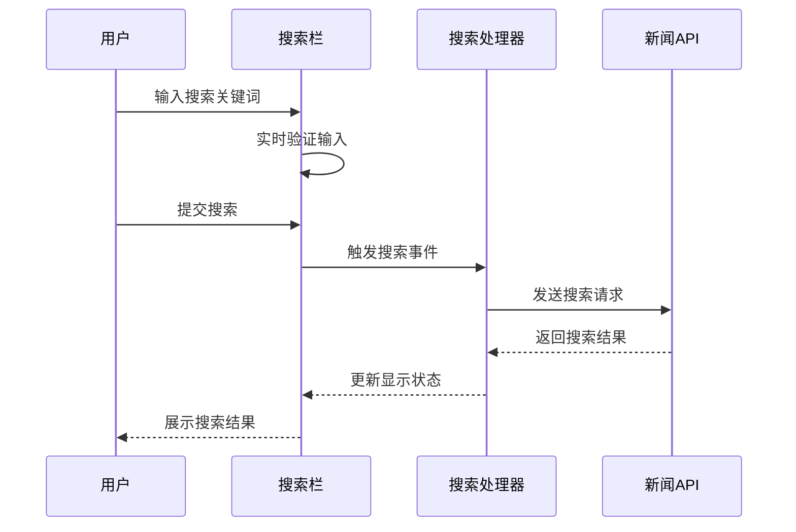

**图表来源**
- [components/SearchBar.tsx:12-15](file://components/SearchBar.tsx#L12-L15)
- [app/page.tsx:170-173](file://app/page.tsx#L170-L173)

**章节来源**
- [components/SearchBar.tsx:1-41](file://components/SearchBar.tsx#L1-L41)

## 依赖关系分析

系统采用了合理的依赖管理策略，确保了模块间的松耦合：

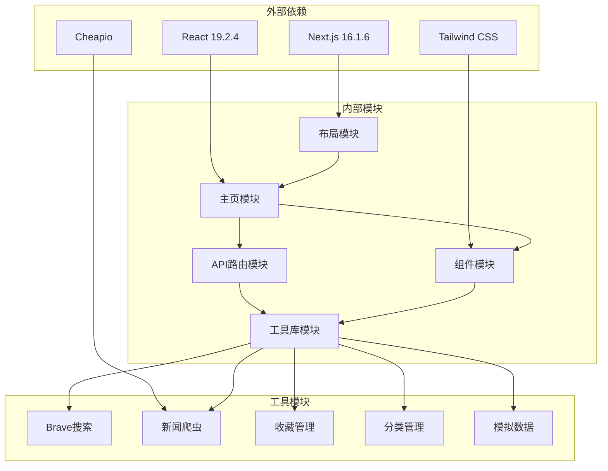

**图表来源**
- [package.json:15-29](file://package.json#L15-L29)
- [app/layout.tsx:1-27](file://app/layout.tsx#L1-L27)
- [app/page.tsx:1-18](file://app/page.tsx#L1-L18)

### 性能优化策略

系统实现了多层次的性能优化：

- **内存缓存**：5分钟默认缓存，2分钟动态缓存
- **懒加载**：按需加载新闻源数据
- **防抖处理**：搜索输入防抖，减少API调用
- **增量更新**：定时刷新特定新闻源

**章节来源**
- [lib/news-scraper.ts:9-23](file://lib/news-scraper.ts#L9-L23)
- [app/page.tsx:66-163](file://app/page.tsx#L66-L163)

## 性能考量

### 缓存策略

系统采用了智能的缓存策略来提升性能：

| 缓存类型 | TTL时间 | 适用场景 | 优势 |
|----------|---------|----------|------|
| 默认缓存 | 5分钟 | 普通新闻 | 减少API调用频率 |
| 短期缓存 | 2分钟 | 动态新闻 | 实时性优先 |
| 内存缓存 | 无限 | 配置数据 | 零延迟访问 |

### 并发处理

系统支持并发请求处理，通过Promise链式调用确保数据一致性：

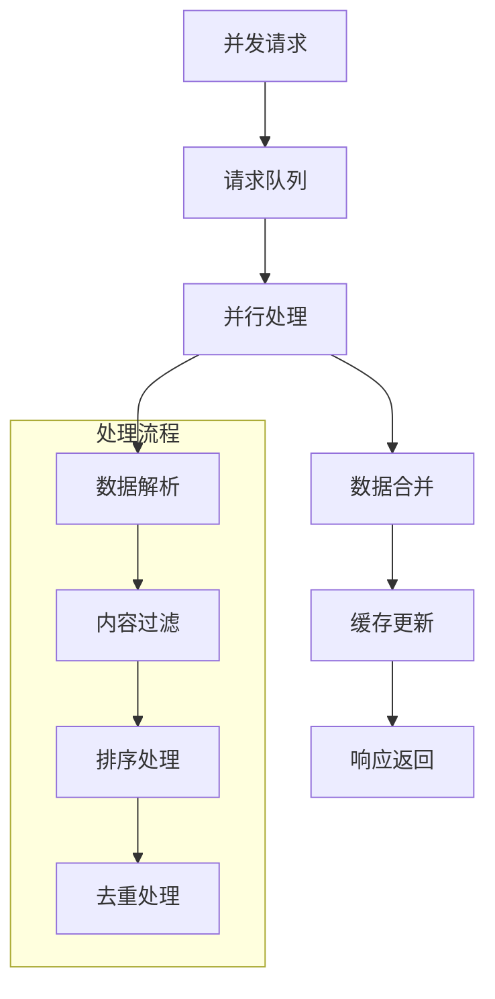

## 故障排除指南

### 常见问题及解决方案

#### API密钥配置问题

**问题症状**：新闻无法获取，控制台出现API错误

**解决方案**：
1. 检查`.env.local`文件中的`BRAVE_API_KEY`配置
2. 确认API密钥有效且未过期
3. 验证网络连接正常

#### 爬虫数据获取失败

**问题症状**：网页爬虫返回空数据

**解决方案**：
1. 检查目标网站是否可访问
2. 验证CSS选择器是否正确
3. 查看网络请求状态码

#### 收藏功能异常

**问题症状**：收藏数据无法保存或丢失

**解决方案**：
1. 检查浏览器是否启用localStorage
2. 确认浏览器隐私设置允许本地存储
3. 清除浏览器缓存后重试

**章节来源**
- [README.md:24-33](file://README.md#L24-L33)
- [lib/favorites.ts:1-29](file://lib/favorites.ts#L1-L29)

### 开发调试技巧

#### 调试工具使用

- **浏览器开发者工具**：监控网络请求和JavaScript错误
- **React DevTools**：检查组件状态和props传递
- **Next.js调试模式**：启用详细日志输出

#### 性能监控

- **Network面板**：分析API响应时间和缓存命中率
- **Performance面板**：识别性能瓶颈
- **Memory面板**：监控内存使用情况

## 结论

专业经验展示系统是一个功能完善、架构清晰的现代化新闻聚合平台。系统通过合理的模块化设计、智能的缓存策略和丰富的用户体验，成功实现了专业经验展示和新闻资讯服务的双重目标。

### 主要成就

- **技术架构先进**：采用Next.js全栈框架，支持SSR和静态生成
- **功能丰富完整**：涵盖新闻聚合、分类浏览、搜索、收藏等核心功能
- **用户体验优秀**：响应式设计，支持多设备访问
- **扩展性强**：模块化设计便于功能扩展和维护

### 未来发展方向

1. **AI增强功能**：集成AI摘要和个性化推荐
2. **多语言支持**：扩展国际化功能
3. **实时通知**：添加重要新闻推送功能
4. **数据分析**：集成用户行为分析和内容效果评估

该系统为专业经验展示提供了优秀的技术基础，通过持续优化和功能扩展，将成为一个更加完善的新闻资讯平台。