# 主页增强

<cite>
**本文档引用的文件**
- [app/page.tsx](file://app/page.tsx)
- [app/layout.tsx](file://app/layout.tsx)
- [components/CategoryTabs.tsx](file://components/CategoryTabs.tsx)
- [components/SearchBar.tsx](file://components/SearchBar.tsx)
- [components/NewsCard.tsx](file://components/NewsCard.tsx)
- [components/NewsSummary.tsx](file://components/NewsSummary.tsx)
- [lib/news-categories.ts](file://lib/news-categories.ts)
- [lib/news-scraper.ts](file://lib/news-scraper.ts)
- [lib/brave-search.ts](file://lib/brave-search.ts)
- [lib/favorites.ts](file://lib/favorites.ts)
- [lib/translator.ts](file://lib/translator.ts)
- [app/api/news/route.ts](file://app/api/news/route.ts)
- [app/api/news/sources/route.ts](file://app/api/news/sources/route.ts)
- [app/ai-lab/page.tsx](file://app/ai-lab/page.tsx)
- [app/ai-lab/product-swap/page.tsx](file://app/ai-lab/product-swap/page.tsx)
- [package.json](file://package.json)
</cite>

## 目录
1. [简介](#简介)
2. [项目结构](#项目结构)
3. [核心组件](#核心组件)
4. [架构概览](#架构概览)
5. [详细组件分析](#详细组件分析)
6. [依赖关系分析](#依赖关系分析)
7. [性能考虑](#性能考虑)
8. [故障排除指南](#故障排除指南)
9. [结论](#结论)

## 简介

这是一个基于Next.js构建的AI新闻网站，专注于主页增强和用户体验优化。该系统集成了多个新闻源、AI实验室功能，并提供了丰富的交互式界面。

主要特性包括：
- 多源新闻聚合（国内外主流媒体）
- 实时新闻滚动展示
- AI实验室功能（商品替换、图像生成等）
- 收藏夹管理
- 搜索功能
- 多主题支持（明暗模式）

## 项目结构

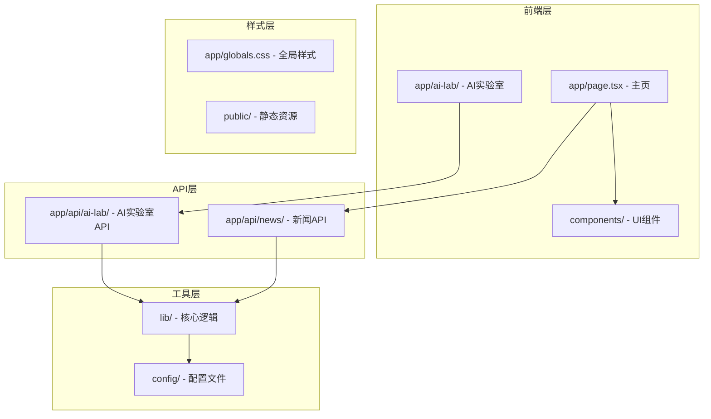

**图表来源**
- [app/page.tsx:1-1029](file://app/page.tsx#L1-L1029)
- [app/ai-lab/page.tsx:1-130](file://app/ai-lab/page.tsx#L1-L130)
- [lib/news-scraper.ts:1-971](file://lib/news-scraper.ts#L1-L971)

**章节来源**
- [app/layout.tsx:1-27](file://app/layout.tsx#L1-L27)
- [package.json:1-34](file://package.json#L1-L34)

## 核心组件

### 主页组件架构

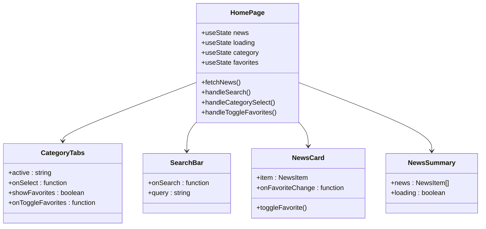

**图表来源**
- [app/page.tsx:18-221](file://app/page.tsx#L18-L221)
- [components/CategoryTabs.tsx:12-49](file://components/CategoryTabs.tsx#L12-L49)
- [components/SearchBar.tsx:9-40](file://components/SearchBar.tsx#L9-L40)
- [components/NewsCard.tsx:12-96](file://components/NewsCard.tsx#L12-L96)
- [components/NewsSummary.tsx:10-73](file://components/NewsSummary.tsx#L10-L73)

### 新闻源管理系统

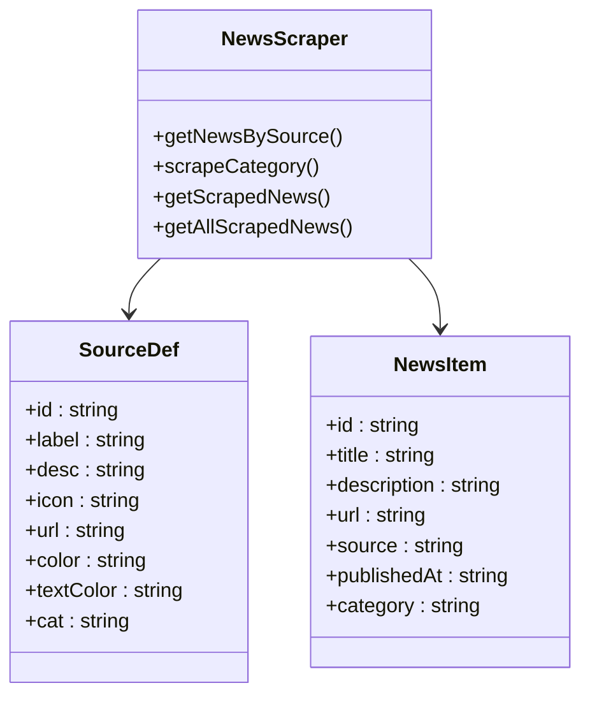

**图表来源**
- [lib/news-scraper.ts:382-415](file://lib/news-scraper.ts#L382-L415)
- [lib/brave-search.ts:1-115](file://lib/brave-search.ts#L1-L115)

**章节来源**
- [lib/news-categories.ts:1-45](file://lib/news-categories.ts#L1-L45)
- [lib/news-scraper.ts:382-415](file://lib/news-scraper.ts#L382-L415)

## 架构概览

### 数据流架构

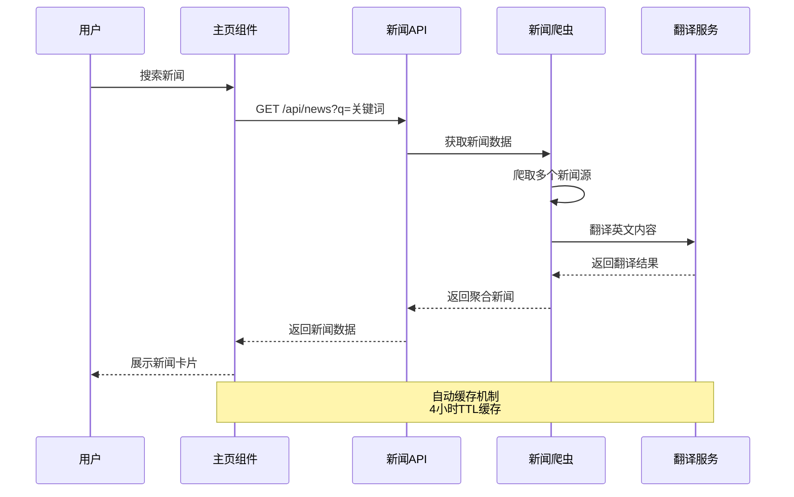

**图表来源**
- [app/page.tsx:48-67](file://app/page.tsx#L48-L67)
- [app/api/news/route.ts:60-276](file://app/api/news/route.ts#L60-L276)
- [lib/news-scraper.ts:304-353](file://lib/news-scraper.ts#L304-L353)

### AI实验室集成

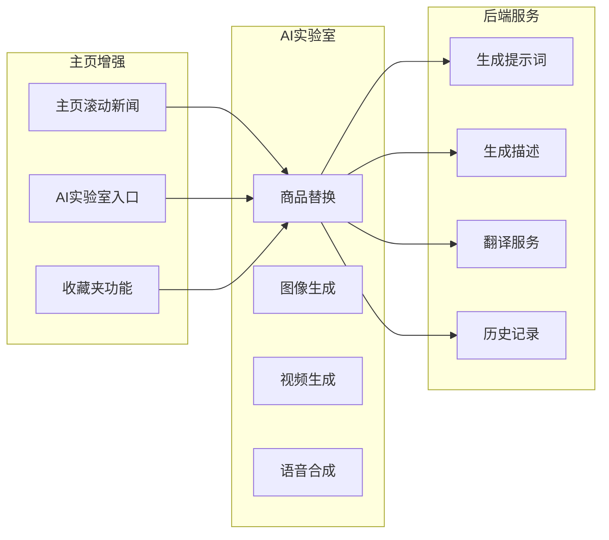

**图表来源**
- [app/ai-lab/page.tsx:49-129](file://app/ai-lab/page.tsx#L49-L129)
- [app/ai-lab/product-swap/page.tsx:53-800](file://app/ai-lab/product-swap/page.tsx#L53-L800)

## 详细组件分析

### 主页增强功能

#### 实时新闻滚动区域

主页包含了多个专门的新闻滚动区域，每个区域都有独特的视觉设计：

```mermaid
flowchart TD
A[主页加载] --> B[获取新闻数据]
B --> C{新闻类型}
C --> |伊朗局势| D[伊朗新闻滚动]
C --> |本地新闻| E[杭州本地新闻]
C --> |钉钉动态| F[钉钉相关新闻]
C --> |蚂蚁集团| G[蚂蚁集团新闻]
C --> |博查热搜| H[热搜新闻]
D --> I[无缝滚动展示]
E --> I
F --> I
G --> I
H --> I
I --> J[定时刷新(4小时)]
```

**图表来源**
- [app/page.tsx:251-554](file://app/page.tsx#L251-L554)

#### AI实验室模块

AI实验室提供了两个主要功能模块：

1. **AI爆品替换** - 图生视频，商品/服饰/模特替换
2. **AI图像生成** - 文字描述生成高质量图片

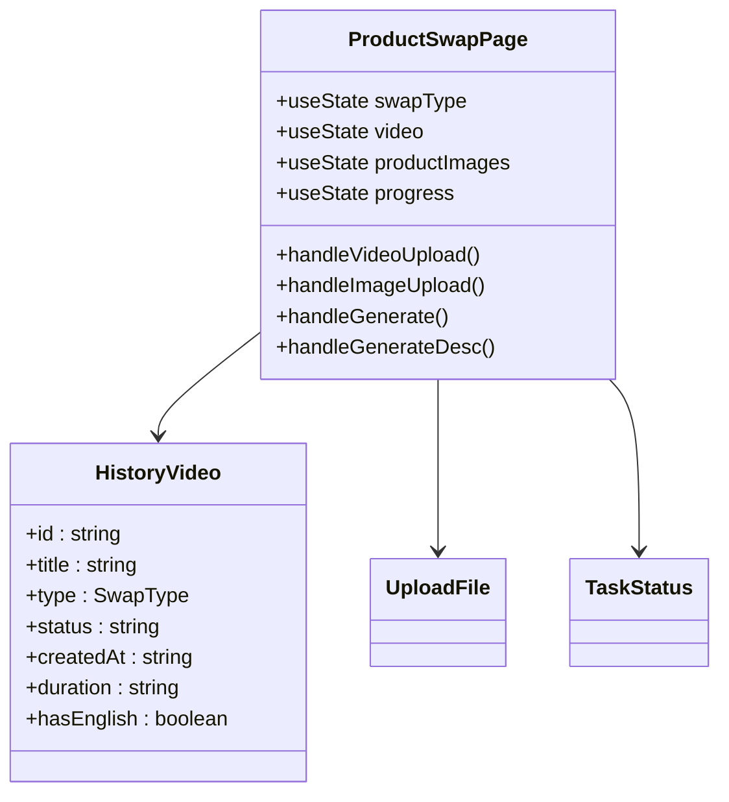

**图表来源**
- [app/ai-lab/product-swap/page.tsx:53-800](file://app/ai-lab/product-swap/page.tsx#L53-L800)

**章节来源**
- [app/ai-lab/page.tsx:1-130](file://app/ai-lab/page.tsx#L1-L130)
- [app/ai-lab/product-swap/page.tsx:1-800](file://app/ai-lab/product-swap/page.tsx#L1-L800)

### 搜索和分类系统

#### 搜索功能实现

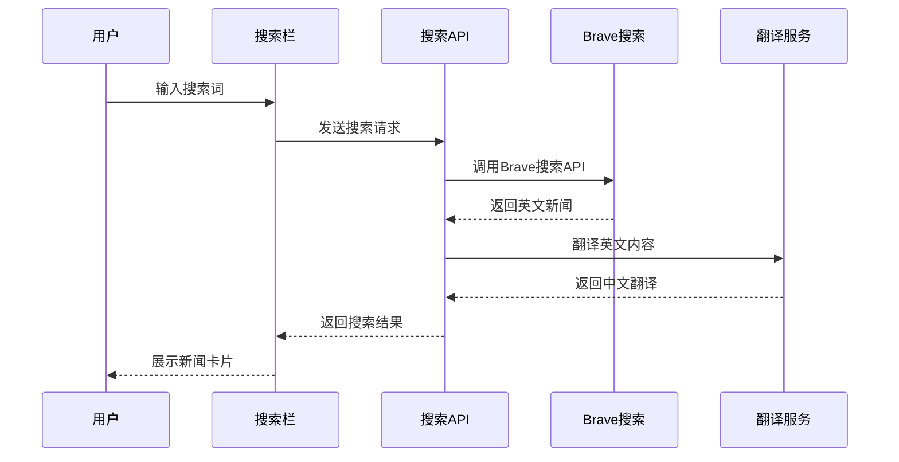

**图表来源**
- [components/SearchBar.tsx:12-15](file://components/SearchBar.tsx#L12-L15)
- [lib/brave-search.ts:30-73](file://lib/brave-search.ts#L30-L73)

#### 分类标签系统

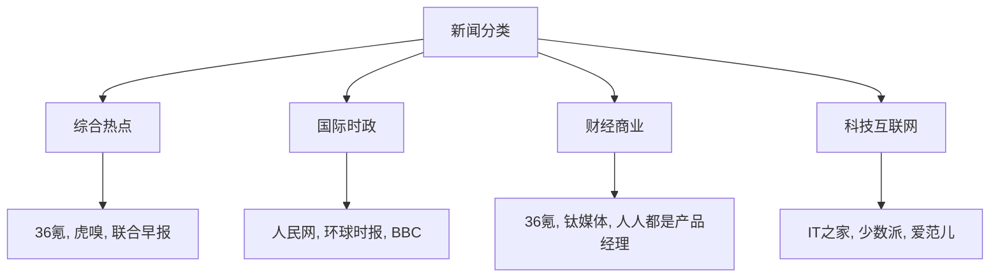

**图表来源**
- [lib/news-categories.ts:7-40](file://lib/news-categories.ts#L7-L40)

**章节来源**
- [components/CategoryTabs.tsx:12-49](file://components/CategoryTabs.tsx#L12-L49)
- [lib/news-categories.ts:1-45](file://lib/news-categories.ts#L1-L45)

### 收藏夹功能

收藏夹功能提供了个性化新闻管理：

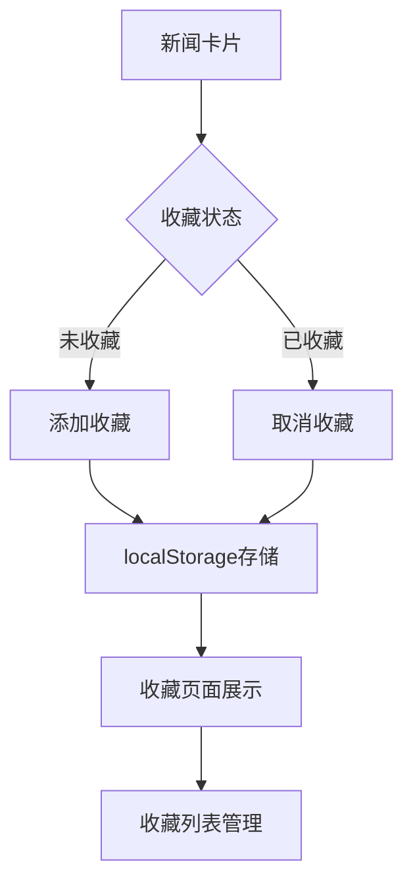

**图表来源**
- [components/NewsCard.tsx:19-27](file://components/NewsCard.tsx#L19-L27)
- [lib/favorites.ts:7-28](file://lib/favorites.ts#L7-L28)

**章节来源**
- [lib/favorites.ts:1-29](file://lib/favorites.ts#L1-L29)

## 依赖关系分析

### 核心依赖关系

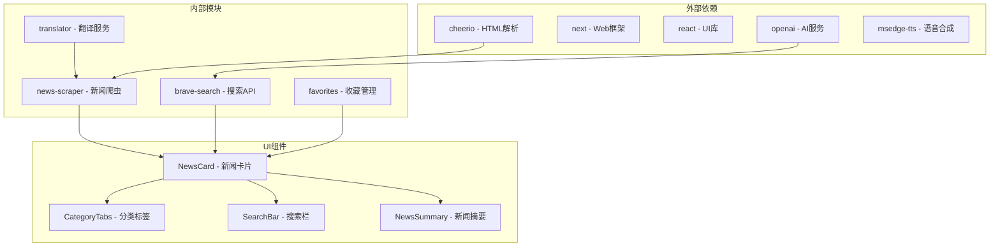

**图表来源**
- [package.json:15-32](file://package.json#L15-L32)
- [lib/news-scraper.ts:1-5](file://lib/news-scraper.ts#L1-L5)
- [lib/brave-search.ts:27-28](file://lib/brave-search.ts#L27-L28)

### API接口设计

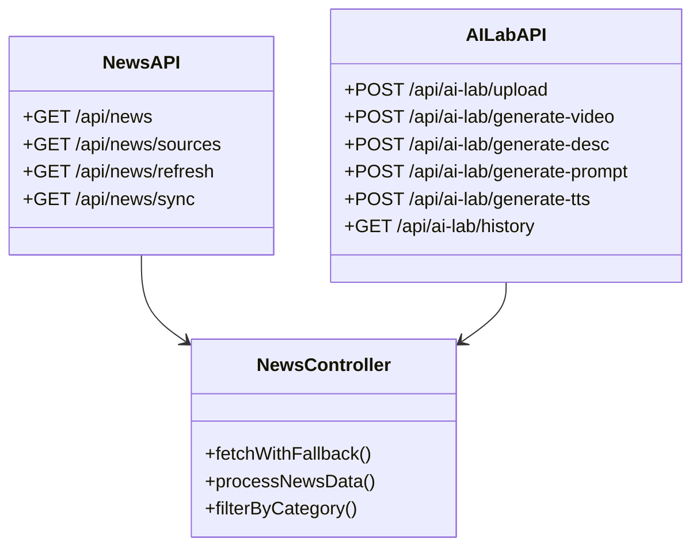

**图表来源**
- [app/api/news/route.ts:60-276](file://app/api/news/route.ts#L60-L276)
- [app/api/news/sources/route.ts:8-39](file://app/api/news/sources/route.ts#L8-L39)

**章节来源**
- [app/api/news/route.ts:1-277](file://app/api/news/route.ts#L1-L277)
- [app/api/news/sources/route.ts:1-40](file://app/api/news/sources/route.ts#L1-L40)

## 性能考虑

### 缓存策略

系统采用了多层次的缓存机制：

1. **内存缓存** - 4小时TTL
2. **API缓存** - 禁用静态缓存
3. **浏览器缓存** - 按需缓存

### 性能优化措施

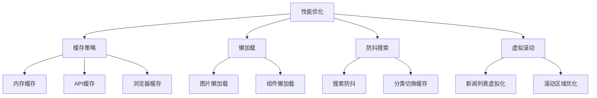

**图表来源**
- [lib/news-scraper.ts:9-37](file://lib/news-scraper.ts#L9-L37)
- [app/page.tsx:74-88](file://app/page.tsx#L74-L88)

## 故障排除指南

### 常见问题及解决方案

| 问题类型 | 症状 | 解决方案 |
|---------|------|----------|
| 新闻加载失败 | 页面空白或错误提示 | 检查API密钥配置，验证网络连接 |
| 搜索无结果 | 搜索框无响应 | 确认Brave API密钥有效，检查搜索关键词 |
| 收藏功能异常 | 收藏按钮无效 | 清除浏览器localStorage，检查浏览器设置 |
| AI功能失效 | AI实验室无法使用 | 检查OpenAI API配置，验证权限设置 |

### 调试工具

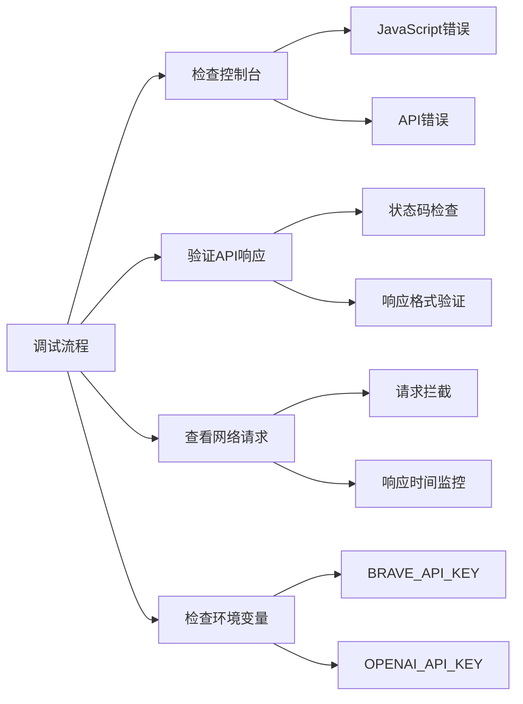

**图表来源**
- [app/api/news/route.ts:269-275](file://app/api/news/route.ts#L269-L275)

**章节来源**
- [lib/brave-search.ts:35-37](file://lib/brave-search.ts#L35-L37)
- [lib/translator.ts:15-37](file://lib/translator.ts#L15-L37)

## 结论

该AI新闻网站通过精心设计的主页增强功能，为用户提供了丰富而直观的新闻浏览体验。系统的主要优势包括：

1. **多源聚合** - 整合国内外主流新闻源，提供全面的信息覆盖
2. **实时更新** - 4小时自动刷新机制，确保信息时效性
3. **个性化体验** - 收藏夹、搜索、分类等功能满足不同用户需求
4. **AI集成** - AI实验室功能扩展了网站的应用场景
5. **性能优化** - 多层次缓存和优化策略保证了良好的用户体验

未来可以考虑的功能增强方向：
- 更智能的推荐算法
- 多语言支持扩展
- 社交分享功能
- 个性化定制选项
- 移动端优化