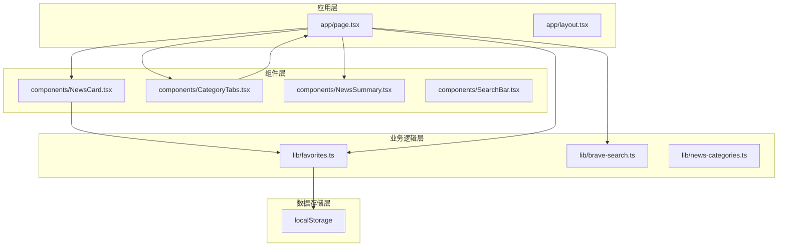
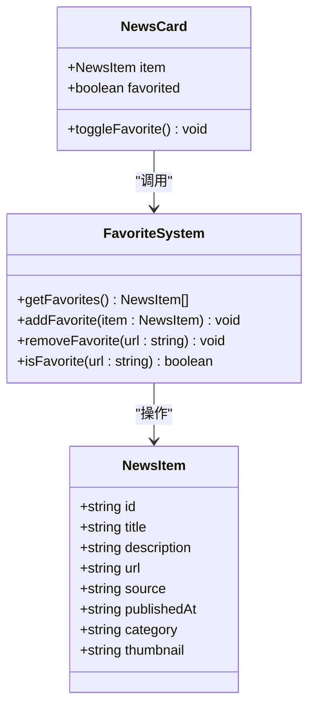
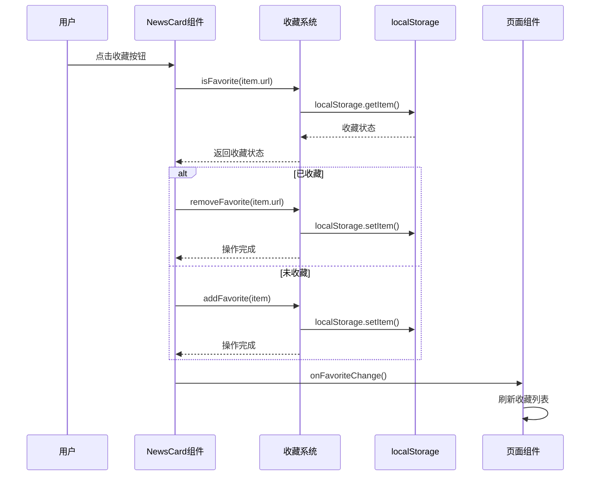
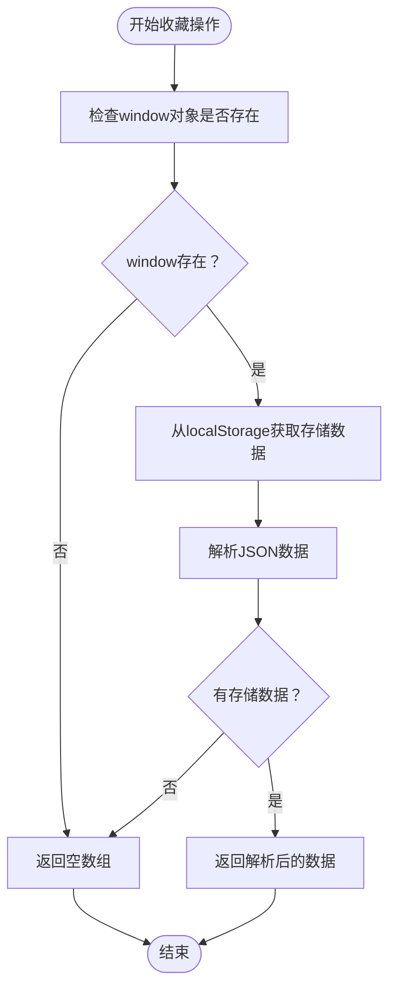
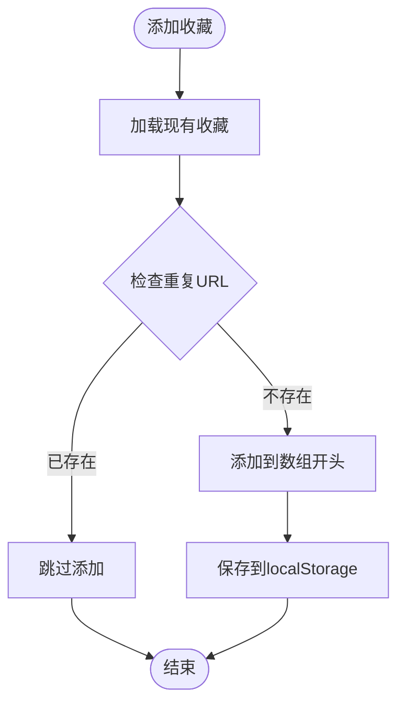
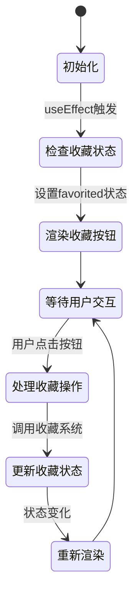
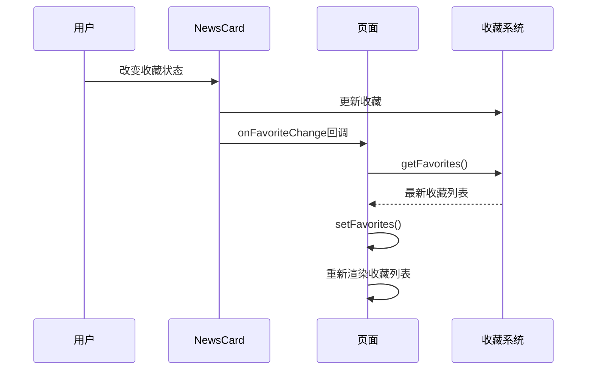
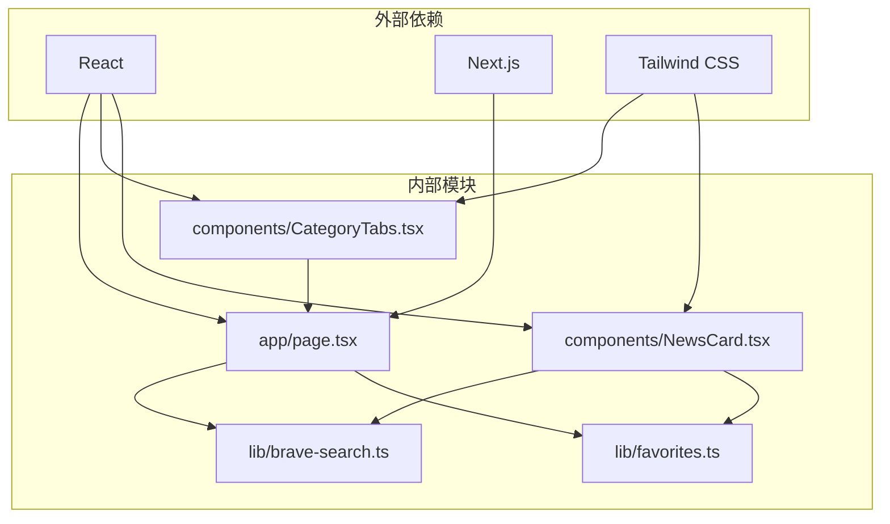

# 收藏管理系统

<cite>
**本文档引用的文件**
- [lib/favorites.ts](file://lib/favorites.ts)
- [components/NewsCard.tsx](file://components/NewsCard.tsx)
- [app/page.tsx](file://app/page.tsx)
- [lib/brave-search.ts](file://lib/brave-search.ts)
- [components/CategoryTabs.tsx](file://components/CategoryTabs.tsx)
- [lib/news-categories.ts](file://lib/news-categories.ts)
- [components/NewsSummary.tsx](file://components/NewsSummary.tsx)
- [README.md](file://README.md)
</cite>

## 目录
1. [简介](#简介)
2. [项目结构](#项目结构)
3. [核心组件](#核心组件)
4. [架构概览](#架构概览)
5. [详细组件分析](#详细组件分析)
6. [依赖关系分析](#依赖关系分析)
7. [性能考虑](#性能考虑)
8. [故障排除指南](#故障排除指南)
9. [结论](#结论)
10. [附录](#附录)

## 简介

本收藏管理系统是一个基于Next.js的新闻网站应用，实现了完整的本地收藏功能。系统通过localStorage实现数据持久化，允许用户收藏感兴趣的新闻文章并在不同页面间共享收藏状态。

该系统的核心特性包括：
- 基于localStorage的本地数据存储
- 实时收藏状态同步
- 跨页面数据共享机制
- 用户友好的收藏状态管理
- 完整的收藏操作接口

## 项目结构

项目采用模块化的组织方式，主要分为以下几个部分：



**图表来源**
- [app/page.tsx](file://app/page.tsx#L1-L153)
- [lib/favorites.ts](file://lib/favorites.ts#L1-L29)
- [components/NewsCard.tsx](file://components/NewsCard.tsx#L1-L89)

**章节来源**
- [README.md](file://README.md#L36-L49)
- [app/page.tsx](file://app/page.tsx#L1-L153)

## 核心组件

### 收藏数据结构

系统定义了标准的新闻数据结构，用于统一管理收藏内容：



**图表来源**
- [lib/brave-search.ts](file://lib/brave-search.ts#L1-L115)
- [lib/favorites.ts](file://lib/favorites.ts#L1-L29)
- [components/NewsCard.tsx](file://components/NewsCard.tsx#L1-L89)

### 收藏系统接口

收藏系统提供了四个核心接口，每个都针对特定的收藏操作：

| 方法名 | 参数类型 | 返回值类型 | 功能描述 |
|--------|----------|------------|----------|
| `getFavorites()` | 无 | `NewsItem[]` | 获取所有收藏的新闻项目 |
| `addFavorite(item)` | `NewsItem` | `void` | 添加单个新闻到收藏列表 |
| `removeFavorite(url)` | `string` | `void` | 从收藏列表中移除指定URL的新闻 |
| `isFavorite(url)` | `string` | `boolean` | 检查指定URL的新闻是否已被收藏 |

**章节来源**
- [lib/favorites.ts](file://lib/favorites.ts#L7-L28)

## 架构概览

系统采用分层架构设计，确保各层职责清晰分离：



**图表来源**
- [components/NewsCard.tsx](file://components/NewsCard.tsx#L19-L27)
- [lib/favorites.ts](file://lib/favorites.ts#L13-L24)
- [app/page.tsx](file://app/page.tsx#L54-L63)

## 详细组件分析

### 收藏系统实现

#### 数据存储机制

收藏系统使用localStorage作为唯一的数据存储介质，具有以下特点：

1. **键值管理**：使用固定的存储键名统一管理所有收藏数据
2. **JSON序列化**：将NewsItem对象转换为JSON字符串进行存储
3. **类型安全**：通过TypeScript接口确保数据结构的一致性

#### 核心算法流程



**图表来源**
- [lib/favorites.ts](file://lib/favorites.ts#L7-L11)

#### 添加收藏流程



**图表来源**
- [lib/favorites.ts](file://lib/favorites.ts#L13-L19)

**章节来源**
- [lib/favorites.ts](file://lib/favorites.ts#L1-L29)

### NewsCard组件集成

#### 状态管理机制

NewsCard组件实现了完整的收藏状态管理，包括：

1. **状态初始化**：组件挂载时检查当前新闻的收藏状态
2. **实时更新**：收藏状态变化时自动更新UI
3. **用户交互**：提供直观的收藏按钮和状态反馈

#### 组件生命周期



**图表来源**
- [components/NewsCard.tsx](file://components/NewsCard.tsx#L13-L27)

#### 用户界面设计

组件使用星形图标表示收藏状态：
- **未收藏**：空心星形（白色/灰色）
- **已收藏**：实心星形（琥珀色）

**章节来源**
- [components/NewsCard.tsx](file://components/NewsCard.tsx#L1-L89)

### 页面级收藏管理

#### 收藏模式切换

首页实现了完整的收藏模式管理：

1. **显示模式控制**：通过`showFavorites`状态切换普通新闻和收藏新闻
2. **数据源切换**：根据模式选择不同的数据源（新闻列表或收藏列表）
3. **状态同步**：收藏状态变化时自动刷新显示

#### 收藏列表刷新机制



**图表来源**
- [app/page.tsx](file://app/page.tsx#L54-L63)
- [components/NewsCard.tsx](file://components/NewsCard.tsx#L9-L10)

**章节来源**
- [app/page.tsx](file://app/page.tsx#L54-L63)

## 依赖关系分析

### 组件依赖图



**图表来源**
- [lib/favorites.ts](file://lib/favorites.ts#L3)
- [components/NewsCard.tsx](file://components/NewsCard.tsx#L4-L5)
- [app/page.tsx](file://app/page.tsx#L3-L9)

### 数据流分析

系统遵循单向数据流原则：

1. **数据获取**：从Brave Search API获取新闻数据
2. **状态管理**：组件内部管理UI状态
3. **数据持久化**：收藏数据通过localStorage持久化
4. **状态同步**：收藏状态变化时通知相关组件

**章节来源**
- [lib/brave-search.ts](file://lib/brave-search.ts#L30-L73)
- [lib/favorites.ts](file://lib/favorites.ts#L1-L29)

## 性能考虑

### 存储优化策略

1. **增量更新**：只在收藏状态发生变化时更新localStorage
2. **批量操作**：避免频繁的读写操作
3. **内存管理**：及时清理不需要的引用

### 用户体验优化

1. **即时反馈**：收藏状态变化立即反映在UI上
2. **状态保持**：页面刷新后收藏状态保持不变
3. **错误处理**：优雅处理localStorage存储失败的情况

## 故障排除指南

### 常见问题及解决方案

#### localStorage存储限制

**问题**：浏览器localStorage容量限制导致收藏数据丢失
**解决方案**：
- 监控存储空间使用情况
- 实现数据压缩和清理机制
- 提供手动清理选项

#### 跨浏览器兼容性

**问题**：不同浏览器对localStorage支持差异
**解决方案**：
- 使用feature detection检测localStorage支持
- 提供降级方案（如使用sessionStorage）
- 实现错误边界处理

#### 数据一致性

**问题**：多个标签页间的收藏状态不一致
**解决方案**：
- 监听storage事件实现跨标签页同步
- 实现乐观锁机制防止数据冲突
- 提供手动刷新功能

**章节来源**
- [lib/favorites.ts](file://lib/favorites.ts#L8-L10)

## 结论

本收藏管理系统成功实现了基于localStorage的本地收藏功能，具有以下优势：

1. **简单可靠**：使用标准的localStorage API，无需额外依赖
2. **用户体验好**：提供即时的收藏状态反馈和跨页面数据共享
3. **扩展性强**：模块化设计便于功能扩展和维护
4. **性能优秀**：最小化存储操作，优化用户体验

系统在保持简洁性的同时，提供了完整的收藏管理功能，为用户提供了流畅的新闻收藏体验。

## 附录

### 使用示例

#### 基本收藏操作

```typescript
// 添加收藏
addFavorite(newsItem);

// 移除收藏
removeFavorite(url);

// 检查收藏状态
const isFav = isFavorite(url);

// 获取所有收藏
const favorites = getFavorites();
```

#### 扩展可能性

1. **云端同步**：集成用户账户系统实现跨设备同步
2. **分类管理**：支持收藏内容的分类和标签管理
3. **导入导出**：提供收藏数据的备份和恢复功能
4. **搜索功能**：实现收藏内容的全文搜索和筛选

### 配置选项

- **存储键名**：可自定义收藏数据的存储键
- **存储策略**：可配置数据过期和清理策略
- **同步机制**：可启用跨标签页数据同步