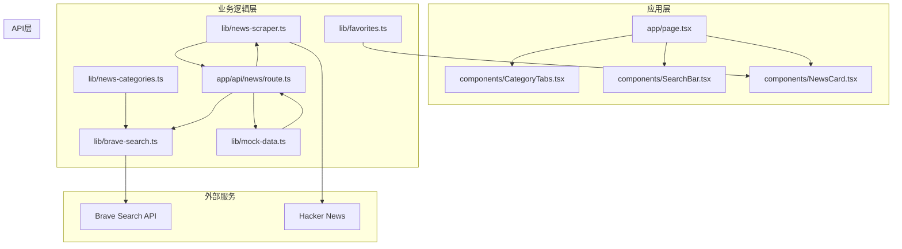
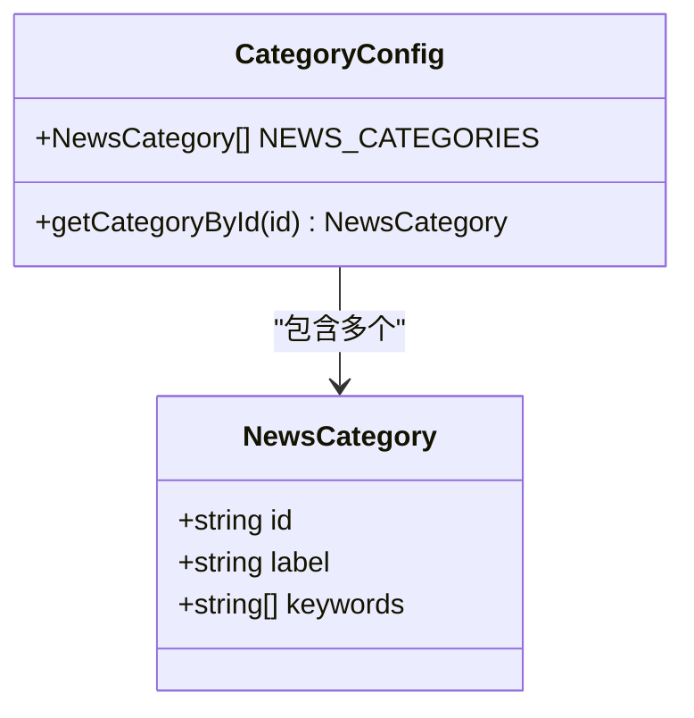
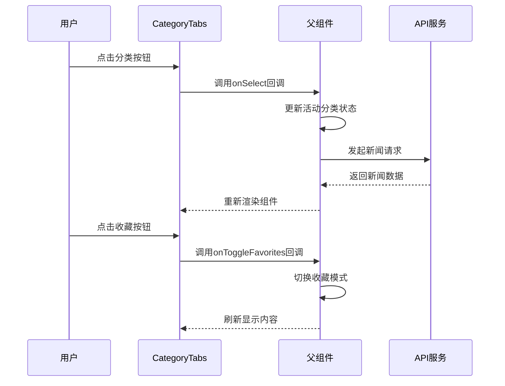
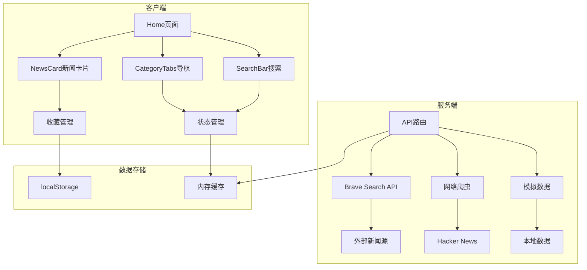
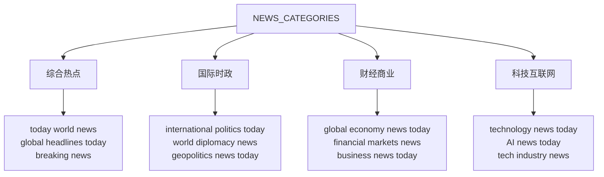
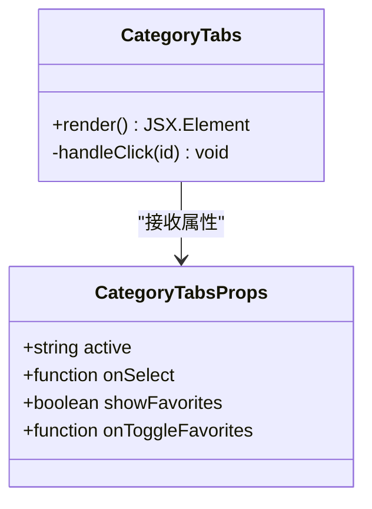
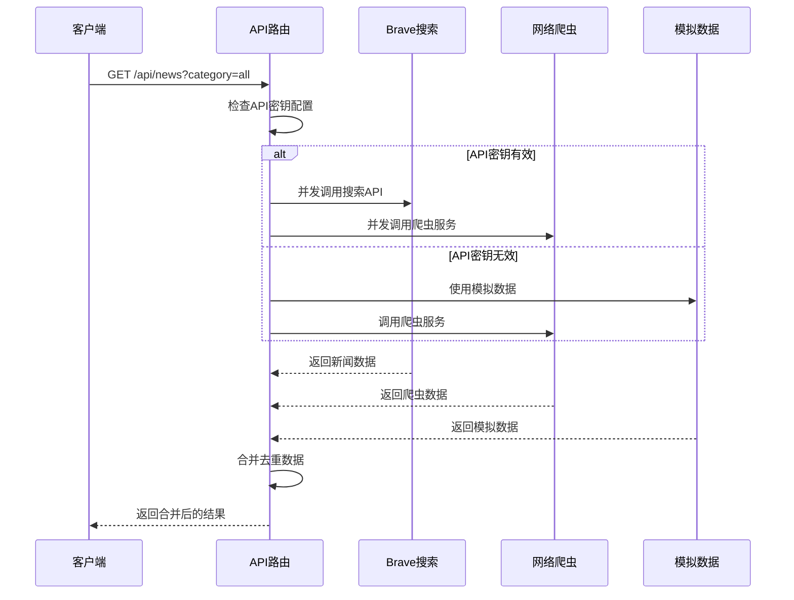
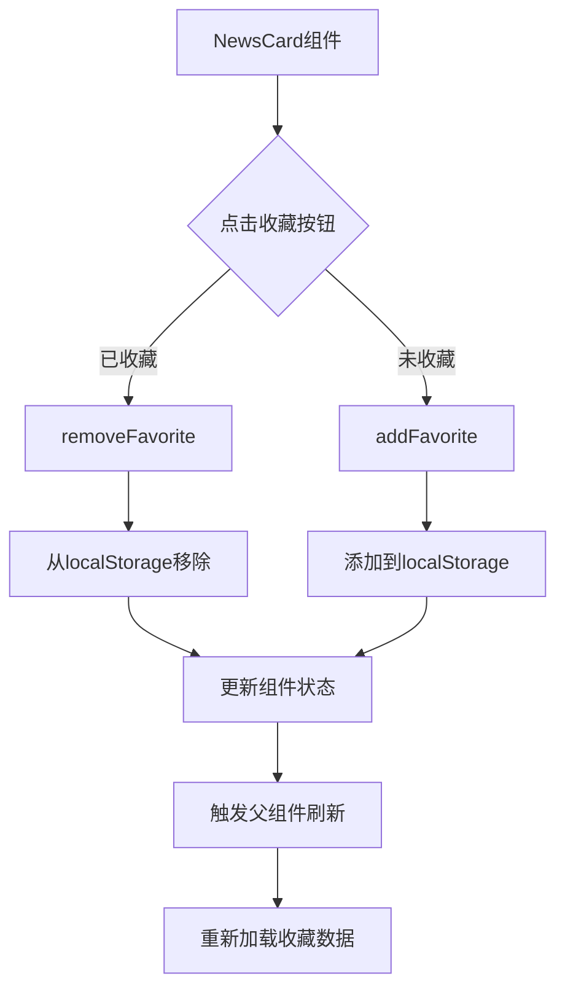
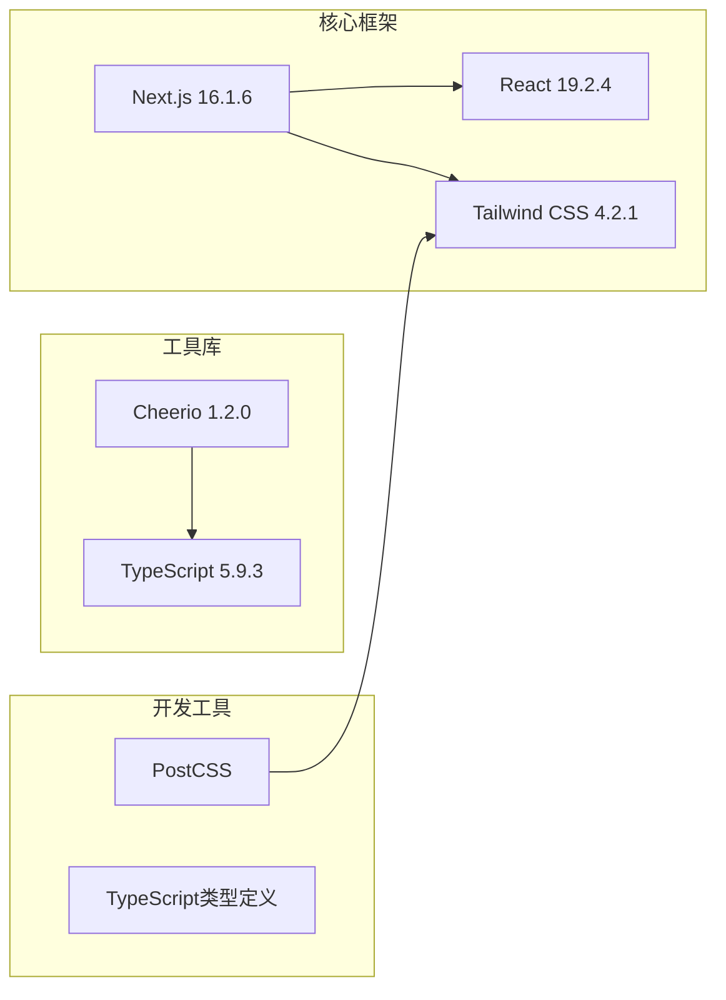
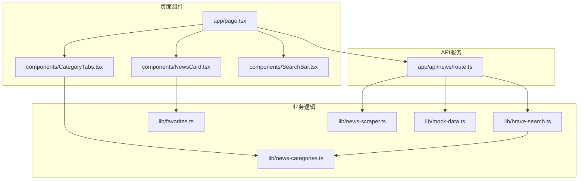

# 新闻分类系统

<cite>
**本文档引用的文件**
- [news-categories.ts](file://lib/news-categories.ts)
- [CategoryTabs.tsx](file://components/CategoryTabs.tsx)
- [page.tsx](file://app/page.tsx)
- [brave-search.ts](file://lib/brave-search.ts)
- [favorites.ts](file://lib/favorites.ts)
- [route.ts](file://app/api/news/route.ts)
- [mock-data.ts](file://lib/mock-data.ts)
- [NewsCard.tsx](file://components/NewsCard.tsx)
- [SearchBar.tsx](file://components/SearchBar.tsx)
- [news-scraper.ts](file://lib/news-scraper.ts)
- [package.json](file://package.json)
</cite>

## 目录
1. [简介](#简介)
2. [项目结构](#项目结构)
3. [核心组件](#核心组件)
4. [架构概览](#架构概览)
5. [详细组件分析](#详细组件分析)
6. [依赖关系分析](#依赖关系分析)
7. [性能考虑](#性能考虑)
8. [故障排除指南](#故障排除指南)
9. [结论](#结论)

## 简介

新闻分类系统是一个基于Next.js构建的现代化新闻聚合平台，集成了多种数据源和智能分类功能。该系统通过Brave Search API获取实时新闻数据，结合本地爬虫技术和模拟数据，为用户提供全面的新闻浏览体验。系统的核心特色包括：

- **智能分类系统**：基于关键词匹配的新闻自动分类
- **多源数据聚合**：Brave Search API + 网络爬虫 + 模拟数据
- **收藏功能**：基于localStorage的个性化新闻收藏
- **响应式设计**：支持移动端和桌面端的自适应布局
- **错误处理**：完善的API降级和错误恢复机制

## 项目结构

系统采用模块化架构设计，主要分为以下几个层次：

**图表来源**
- [page.tsx](file://app/page.tsx#L1-L153)
- [news-categories.ts](file://lib/news-categories.ts#L1-L45)
- [route.ts](file://app/api/news/route.ts#L1-L136)

**章节来源**
- [package.json](file://package.json#L1-L30)
- [page.tsx](file://app/page.tsx#L1-L153)

## 核心组件

### 分类配置系统

新闻分类系统的核心是`news-categories.ts`文件，它定义了完整的分类配置结构：

**图表来源**
- [news-categories.ts](file://lib/news-categories.ts#L1-L45)

每个分类包含三个关键属性：
- **id**: 分类唯一标识符，用于路由和状态管理
- **label**: 用户可见的分类标签文本
- **keywords**: 用于新闻匹配的关键字数组

**章节来源**
- [news-categories.ts](file://lib/news-categories.ts#L1-L45)

### 导航组件

`CategoryTabs.tsx`实现了分类导航功能，提供直观的用户界面：

**图表来源**
- [CategoryTabs.tsx](file://components/CategoryTabs.tsx#L12-L48)
- [page.tsx](file://app/page.tsx#L44-L59)

**章节来源**
- [CategoryTabs.tsx](file://components/CategoryTabs.tsx#L1-L49)
- [page.tsx](file://app/page.tsx#L11-L63)

## 架构概览

系统采用前后端分离的架构模式，结合客户端状态管理和服务器端API处理：

**图表来源**
- [route.ts](file://app/api/news/route.ts#L39-L135)
- [page.tsx](file://app/page.tsx#L19-L63)

## 详细组件分析

### 分类配置结构详解

#### 数据模型定义

新闻分类系统使用TypeScript接口定义清晰的数据结构：

| 字段名 | 类型 | 必需 | 描述 |
|--------|------|------|------|
| id | string | 是 | 分类的唯一标识符，用于程序内部识别 |
| label | string | 是 | 用户界面显示的分类名称 |
| keywords | string[] | 是 | 用于新闻匹配的关键字数组 |

#### 内置分类配置

系统预定义了四个核心分类：

**图表来源**
- [news-categories.ts](file://lib/news-categories.ts#L7-L40)

**章节来源**
- [news-categories.ts](file://lib/news-categories.ts#L1-L45)

### CategoryTabs组件实现

#### 组件接口设计

**图表来源**
- [CategoryTabs.tsx](file://components/CategoryTabs.tsx#L5-L17)

#### 样式和交互逻辑

组件采用Tailwind CSS实现响应式设计，支持深色模式切换：

- **激活状态**: 蓝色背景配白色文字
- **悬停效果**: 浅灰色背景配深色文字
- **收藏按钮**: 金色背景突出显示当前收藏状态
- **滚动支持**: 水平滚动条适配窄屏设备

**章节来源**
- [CategoryTabs.tsx](file://components/CategoryTabs.tsx#L18-L48)

### 新闻获取和处理流程

#### API路由处理机制

**图表来源**
- [route.ts](file://app/api/news/route.ts#L39-L135)

#### 数据合并策略

API路由实现了智能的数据合并机制：

1. **去重算法**: 基于标题的大小写不敏感比较
2. **优先级控制**: API数据优先于爬虫数据
3. **错误恢复**: API失败时自动降级到模拟数据
4. **并发优化**: 使用Promise.all并行处理多个数据源

**章节来源**
- [route.ts](file://app/api/news/route.ts#L13-L37)

### 收藏功能实现

#### 本地存储机制

**图表来源**
- [NewsCard.tsx](file://components/NewsCard.tsx#L19-L27)
- [favorites.ts](file://lib/favorites.ts#L13-L24)

**章节来源**
- [favorites.ts](file://lib/favorites.ts#L1-L29)
- [NewsCard.tsx](file://components/NewsCard.tsx#L1-L89)

## 依赖关系分析

### 外部依赖

系统使用以下关键依赖包：

**图表来源**
- [package.json](file://package.json#L15-L28)

### 内部模块依赖

**图表来源**
- [page.tsx](file://app/page.tsx#L1-L10)
- [route.ts](file://app/api/news/route.ts#L1-L6)

**章节来源**
- [package.json](file://package.json#L1-L30)

## 性能考虑

### 缓存策略

系统实现了多层次的缓存机制：

1. **浏览器缓存**: 使用localStorage存储用户偏好和收藏
2. **内存缓存**: 页面组件内部的状态缓存
3. **API缓存**: 服务器端的并发请求处理

### 并发优化

- **并行数据获取**: API和爬虫服务同时启动，减少总等待时间
- **智能降级**: API失败时自动切换到模拟数据源
- **防抖处理**: 搜索输入的防抖机制避免频繁请求

### 资源优化

- **懒加载**: 新闻卡片组件按需加载
- **图片优化**: 使用现代图片格式和适当的尺寸
- **CSS优化**: Tailwind CSS的原子化样式减少CSS体积

## 故障排除指南

### 常见问题及解决方案

#### API密钥配置问题

**问题**: 获取新闻失败，显示API密钥配置错误

**原因**: BRAVE_API_KEY环境变量未正确设置

**解决方案**:
1. 在`.env.local`文件中添加有效的Brave Search API密钥
2. 确保API密钥具有新闻搜索权限
3. 重启开发服务器使配置生效

#### 网络爬虫失败

**问题**: 爬虫服务无法获取新闻数据

**原因**: 目标网站反爬虫机制或网络连接问题

**解决方案**:
1. 检查目标网站的可用性和反爬虫策略
2. 调整User-Agent头信息
3. 增加请求间隔避免被封禁

#### 收藏功能异常

**问题**: 收藏按钮点击无效或收藏数据丢失

**原因**: localStorage访问权限问题或浏览器隐私设置

**解决方案**:
1. 检查浏览器是否启用了localStorage
2. 确认网站在隐私设置中允许存储数据
3. 尝试清除浏览器缓存后重试

**章节来源**
- [route.ts](file://app/api/news/route.ts#L7-L11)
- [brave-search.ts](file://lib/brave-search.ts#L35-L37)

## 结论

新闻分类系统展现了现代前端开发的最佳实践，通过合理的架构设计和丰富的功能特性，为用户提供了优质的新闻浏览体验。系统的主要优势包括：

1. **模块化设计**: 清晰的组件分离和职责划分
2. **多源数据聚合**: 提供更全面的新闻覆盖
3. **智能降级**: 确保在各种情况下都能正常工作
4. **用户体验优化**: 响应式设计和流畅的交互体验

### 扩展建议

系统为未来的功能扩展预留了良好的基础：

- **新增分类**: 通过修改`news-categories.ts`即可添加新的分类
- **自定义关键词**: 可以根据需求调整现有分类的关键词匹配规则
- **数据源扩展**: 可以轻松集成更多的新闻数据源
- **个性化推荐**: 可以基于用户行为实现智能推荐算法

该系统为构建企业级新闻聚合平台提供了坚实的技术基础和完整的实现参考。