# 新闻数据获取系统

<cite>
**本文档引用的文件**
- [lib/translator.ts](file://lib/translator.ts)
- [lib/brave-search.ts](file://lib/brave-search.ts)
- [lib/bocha-search.ts](file://lib/bocha-search.ts)
- [lib/news-scraper.ts](file://lib/news-scraper.ts)
- [app/api/news/route.ts](file://app/api/news/route.ts)
- [app/api/news/sources/route.ts](file://app/api/news/sources/route.ts)
- [lib/mock-data.ts](file://lib/mock-data.ts)
- [lib/news-categories.ts](file://lib/news-categories.ts)
- [lib/favorites.ts](file://lib/favorites.ts)
- [app/page.tsx](file://app/page.tsx)
- [components/CategoryTabs.tsx](file://components/CategoryTabs.tsx)
- [components/SearchBar.tsx](file://components/SearchBar.tsx)
- [README.md](file://README.md)
- [package.json](file://package.json)
- [ecosystem.config.js](file://ecosystem.config.js)
</cite>

## 更新摘要
**所做更改**
- 新增Bocha AI搜索集成，提供实时热点新闻搜索功能
- 主页增加博查热搜新闻滚动栏显示
- 新增专门的博查热搜API端点：/api/news?bocha=true
- 新增博查缓存机制，支持4小时缓存策略
- 增强实时监控功能，支持博查热搜新闻的定时刷新
- 扩展新闻源配置，新增博查AI搜索数据源

## 目录
1. [简介](#简介)
2. [项目结构](#项目结构)
3. [核心组件](#核心组件)
4. [架构概览](#架构概览)
5. [详细组件分析](#详细组件分析)
6. [依赖关系分析](#依赖关系分析)
7. [性能考虑](#性能考虑)
8. [故障排除指南](#故障排除指南)
9. [结论](#结论)

## 简介

这是一个基于Next.js构建的现代化新闻数据获取系统，集成了Brave Search API、Bocha AI搜索和自定义爬虫系统。该系统现已升级为国际新闻源与国内源并存的混合系统，大幅扩展了新闻覆盖范围，并新增了实时热点新闻搜索功能。系统提供了以下核心功能：

- **国际新闻源集成**：新增BBC、Reuters、NPR、Al Jazeera等国际主流媒体源
- **Bocha AI搜索集成**：通过博查AI搜索API获取实时热点新闻数据
- **Brave Search API集成**：通过官方API获取高质量的新闻数据
- **自定义爬虫系统**：从国内外各类网站抓取新闻内容
- **智能翻译系统**：自动检测并翻译英文新闻内容
- **聚合数据API集成**：新增聚合数据API(fetchJuheNews函数)提供额外新闻源补充
- **企业新闻专用端点**：支持伊朗、钉钉、蚂蚁集团的专门新闻聚合
- **增强的实时监控功能**：定时自动刷新关键新闻源和企业新闻
- **多层缓存机制**：优化性能和用户体验，支持短缓存提升动态新闻实时性
- **双层数据源架构**：API失败时自动降级到爬虫数据
- **Mock数据支持**：开发环境下的模拟数据
- **分类浏览和搜索功能**：支持按类别和关键词搜索新闻
- **实时热点新闻显示**：主页新增博查热搜新闻滚动栏

## 项目结构

项目采用标准的Next.js目录结构，主要分为以下几个部分：

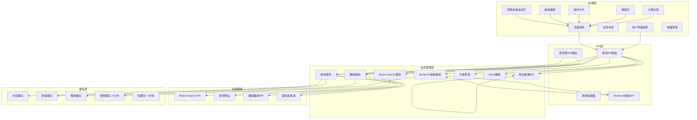

**图表来源**
- [app/api/news/route.ts:1-277](file://app/api/news/route.ts#L1-L277)
- [app/api/news/sources/route.ts:1-40](file://app/api/news/sources/route.ts#L1-L40)
- [lib/brave-search.ts:1-115](file://lib/brave-search.ts#L1-L115)
- [lib/bocha-search.ts:1-129](file://lib/bocha-search.ts#L1-L129)
- [lib/news-scraper.ts:1-971](file://lib/news-scraper.ts#L1-L971)
- [lib/translator.ts:1-132](file://lib/translator.ts#L1-L132)

**章节来源**
- [README.md:36-49](file://README.md#L36-L49)
- [package.json:1-30](file://package.json#L1-L30)

## 核心组件

### Bocha AI搜索集成

系统新增了Bocha AI搜索模块，提供实时热点新闻搜索功能，为用户展示最新的热门话题和趋势。

#### Bocha搜索模块架构

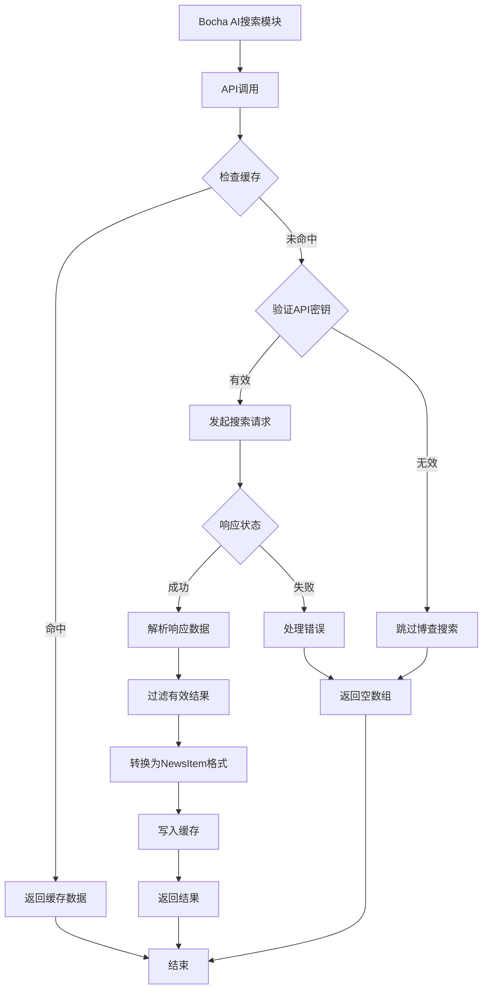

**图表来源**
- [lib/bocha-search.ts:48-114](file://lib/bocha-search.ts#L48-L114)

#### Bocha搜索配置

- **API密钥管理**：支持从环境变量BOCHA_API_KEY读取密钥
- **搜索参数**：默认搜索"今日热点新闻"，返回10条结果
- **新鲜度设置**：使用"oneDay"参数确保获取当日热点
- **摘要生成**：启用summary参数获取内容摘要
- **超时控制**：8秒超时防止请求阻塞
- **缓存策略**：4小时缓存提升性能和减少API调用

#### 数据转换和过滤

系统将Bocha AI搜索的响应转换为统一的NewsItem格式：
- **ID生成**：使用"bocha-"前缀加随机标识符
- **标题过滤**：确保标题长度至少5个字符
- **描述处理**：优先使用snippet，其次使用summary
- **来源标注**：使用siteName或从URL提取域名
- **日期处理**：使用datePublished或当前时间
- **分类标识**：设置category为"bocha"

**章节来源**
- [lib/bocha-search.ts:48-114](file://lib/bocha-search.ts#L48-L114)

### 主页博查热搜新闻显示

系统在主页新增了博查热搜新闻滚动栏，为用户提供实时热点新闻的可视化展示。

#### 博查热搜滚动栏架构

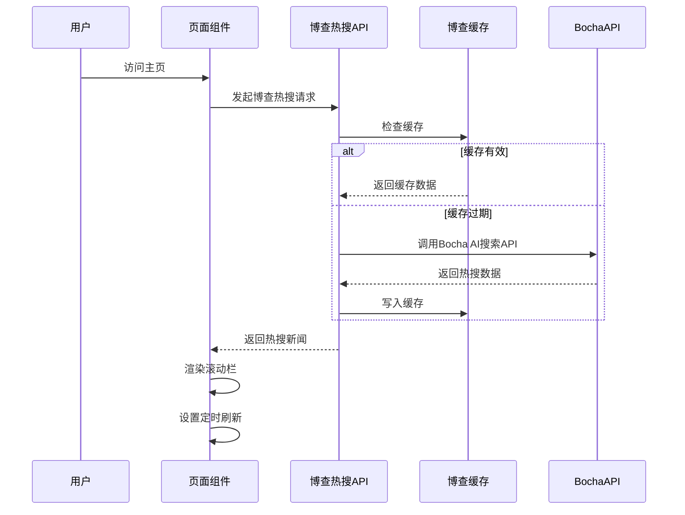

**图表来源**
- [app/page.tsx:172-190](file://app/page.tsx#L172-L190)

#### 滚动栏特性

- **颜色主题**：使用红色渐变(#f53f3f)主题，突出热点新闻
- **刷新机制**：每4小时自动刷新一次，确保数据新鲜度
- **获取时间显示**：显示每次刷新的准确时间
- **加载状态**：显示加载动画和状态指示器
- **无缝滚动**：实现新闻标题的无缝循环播放
- **响应式设计**：适配不同屏幕尺寸的显示效果

#### 数据展示策略

- **显示数量**：最多显示8条热搜新闻
- **标题截断**：超过35字符的标题自动截断
- **交替样式**：使用交替的颜色圆点增强视觉效果
- **外链打开**：点击新闻在新窗口中打开原文链接
- **错误处理**：无数据时显示"暂无热搜新闻"提示

**章节来源**
- [app/page.tsx:495-554](file://app/page.tsx#L495-L554)

### 增强的实时监控功能

系统实现了多维度的实时监控和自动刷新功能，特别针对博查热搜新闻端点进行了优化。

#### 定时刷新机制

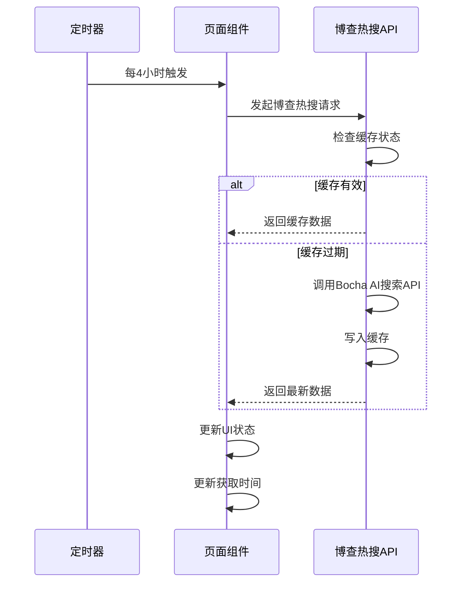

**图表来源**
- [app/page.tsx:172-190](file://app/page.tsx#L172-L190)

#### 实时新闻展示

系统提供了五种实时新闻展示方式，每种都有独立的定时刷新机制：
1. **伊朗局势滚动栏**：展示中东地区重要新闻
2. **本地新闻滚动栏**：展示杭州地区新闻
3. **钉钉动态滚动栏**：展示企业协作工具相关新闻
4. **蚂蚁集团新闻滚动栏**：展示金融科技公司相关新闻
5. **博查热搜滚动栏**：展示实时热点新闻

每种滚动栏都有独立的获取时间显示和加载状态指示。

**章节来源**
- [app/page.tsx:83-163](file://app/page.tsx#L83-L163)
- [app/page.tsx:224-466](file://app/page.tsx#L224-L466)

### 性能优化缓存系统

系统引入了多层缓存机制来显著提升性能，特别针对动态新闻内容优化。

#### 缓存层次结构
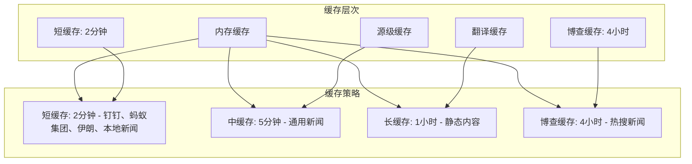

**图表来源**
- [lib/news-scraper.ts:9-23](file://lib/news-scraper.ts#L9-L23)
- [lib/bocha-search.ts:7-8](file://lib/bocha-search.ts#L7-L8)

#### 缓存管理策略

系统实现了智能的缓存管理：
- **动态缓存时间**：根据内容类型设置不同的缓存时间
- **缓存键设计**：合理设计缓存键避免冲突
- **缓存失效机制**：支持按需清除特定缓存
- **内存使用控制**：避免缓存占用过多内存
- **短缓存优化**：针对动态新闻使用2分钟短缓存
- **长缓存策略**：针对博查热搜新闻使用4小时缓存

**章节来源**
- [lib/news-scraper.ts:9-34](file://lib/news-scraper.ts#L9-L34)
- [lib/bocha-search.ts:7-8](file://lib/bocha-search.ts#L7-L8)
- [lib/translator.ts:12-13](file://lib/translator.ts#L12-L13)

### searchNews函数详解

searchNews是系统的核心函数，负责调用Brave Search API获取新闻数据。

#### 函数签名和参数


**图表来源**
- [lib/brave-search.ts:30-73](file://lib/brave-search.ts#L30-L73)

#### 参数配置详解

searchNews函数支持以下参数配置：

| 参数名 | 类型 | 默认值 | 描述 |
|--------|------|--------|------|
| query | string | 必需 | 搜索关键词 |
| category | string | 必需 | 新闻分类标识符 |
| count | number | 20 | 返回结果数量 |

**章节来源**
- [lib/brave-search.ts:30-45](file://lib/brave-search.ts#L30-L45)

#### 响应数据处理

函数将Brave Search的原始响应转换为统一的NewsItem格式：

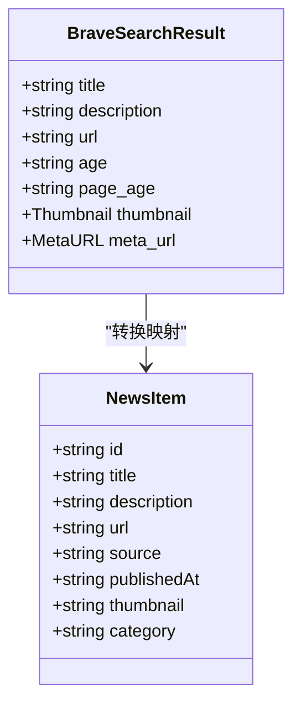

**图表来源**
- [lib/brave-search.ts:1-25](file://lib/brave-search.ts#L1-L25)

#### 错误降级机制

系统实现了多层次的错误处理和降级策略：

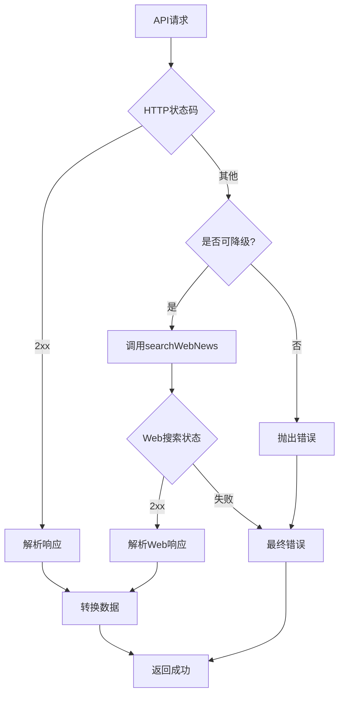

**图表来源**
- [lib/brave-search.ts:55-58](file://lib/brave-search.ts#L55-L58)
- [lib/brave-search.ts:97-99](file://lib/brave-search.ts#L97-L99)

**章节来源**
- [lib/brave-search.ts:55-73](file://lib/brave-search.ts#L55-L73)

### searchWebNews函数分析

searchWebNews作为searchNews的降级方案，提供了Web搜索功能：

#### 实现特点

- **关键词增强**：自动添加" news today"后缀以获取最新新闻
- **参数继承**：复用searchNews的参数配置
- **错误处理**：直接抛出API错误，不进行进一步降级

#### 请求流程

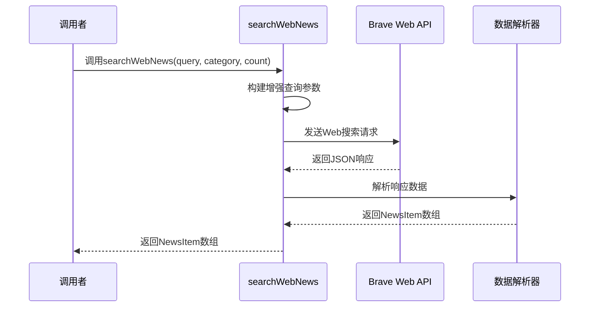

**图表来源**
- [lib/brave-search.ts:75-114](file://lib/brave-search.ts#L75-L114)

**章节来源**
- [lib/brave-search.ts:75-114](file://lib/brave-search.ts#L75-L114)

### 爬虫系统实现

爬虫系统专门用于从各种新闻网站抓取新闻数据，现已集成翻译功能、聚合数据API和Bocha AI搜索。

#### 爬虫配置架构

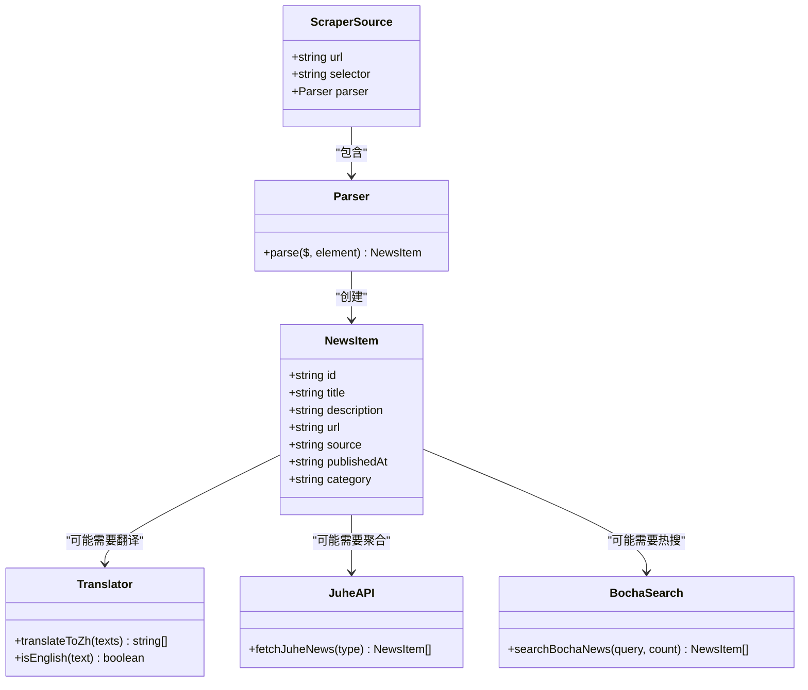

**图表来源**
- [lib/news-scraper.ts:1-8](file://lib/news-scraper.ts#L1-L8)
- [lib/news-scraper.ts:325-339](file://lib/news-scraper.ts#L325-L339)

#### 分类配置

系统为每个分类配置了特定的爬虫规则：

| 分类 | 目标网站 | 选择器 | 特殊处理 |
|------|----------|--------|----------|
| all | 36氪、虎嗅、联合早报 | 多种选择器 | 通用解析 |
| tech | 少数派、36氪科技 | .article-title | 技术类描述 |
| business | 虎嗅、36氪商业 | .article-item | 商业类描述 |
| politics | 澎湃新闻、环球时报 | .small_cardcontent | 时事类描述 |

**章节来源**
- [lib/news-scraper.ts:39-272](file://lib/news-scraper.ts#L39-L272)

#### 数据抓取流程

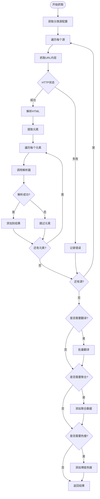

**图表来源**
- [lib/news-scraper.ts:299-349](file://lib/news-scraper.ts#L299-L349)

#### 翻译集成机制

爬虫系统集成了智能翻译功能：
- **英文检测**：自动检测需要翻译的英文内容
- **批量翻译**：对同一源的多个新闻进行批量翻译
- **缓存优化**：翻译结果自动缓存
- **错误处理**：翻译失败不影响整体抓取结果

#### 聚合数据API集成

系统在getNewsBySource函数中集成了聚合数据API：
- **并发获取**：与新闻源抓取并行执行
- **数据合并**：将聚合数据与源数据合并
- **错误隔离**：聚合API失败不影响其他数据源
- **缓存集成**：聚合数据也参与缓存系统

#### Bocha AI搜索集成

系统在getNewsBySource函数中集成了Bocha AI搜索：
- **缓存利用**：复用Bocha模块的缓存机制
- **数据合并**：将博查热搜与源数据合并
- **错误隔离**：博查搜索失败不影响其他数据源
- **性能优化**：4小时缓存减少API调用频率

**章节来源**
- [lib/news-scraper.ts:299-349](file://lib/news-scraper.ts#L299-L349)
- [lib/news-scraper.ts:820-908](file://lib/news-scraper.ts#L820-L908)
- [lib/news-scraper.ts:889-901](file://lib/news-scraper.ts#L889-L901)

### API路由控制器

API路由实现了智能的数据合并和降级策略，现已支持博查热搜新闻端点、企业新闻端点和聚合数据API。

#### 数据合并算法

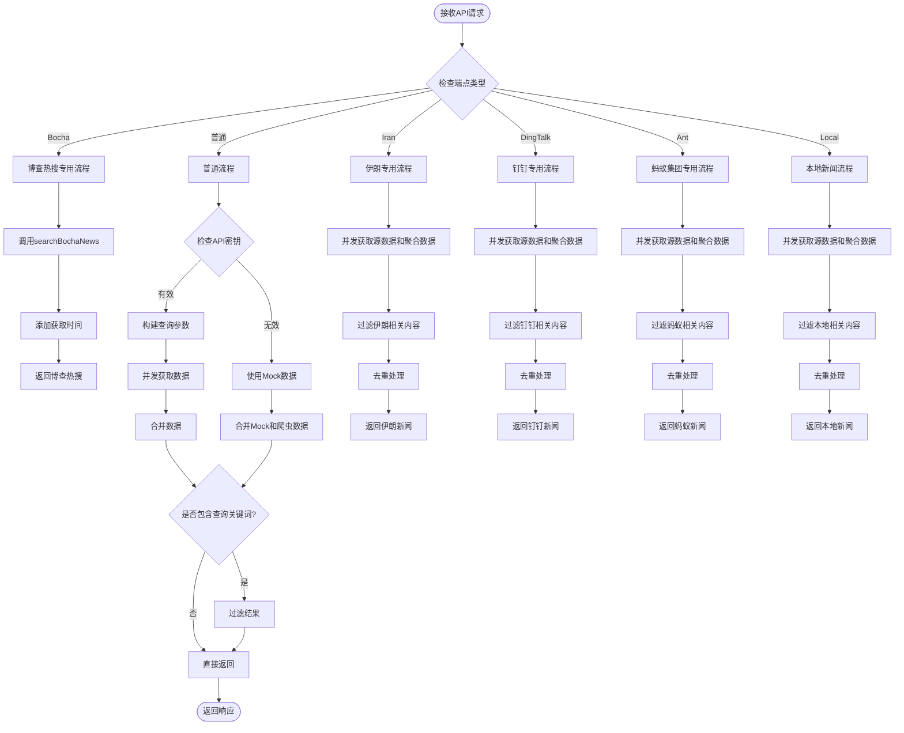

**图表来源**
- [app/api/news/route.ts:5-277](file://app/api/news/route.ts#L5-L277)

#### 错误处理策略

API路由实现了完整的错误处理机制：
1. **API密钥验证**：检查环境变量配置
2. **并发请求**：同时获取API和爬虫数据
3. **降级机制**：API失败时使用Mock数据
4. **数据去重**：避免重复新闻条目
5. **错误日志**：记录详细的错误信息
6. **博查热搜端点**：支持专门的博查热搜聚合
7. **企业新闻端点**：支持专用的企业新闻聚合
8. **聚合数据API集成**：提供额外的数据源补充
9. **本地新闻端点**：支持杭州地区新闻聚合

**章节来源**
- [app/api/news/route.ts:5-277](file://app/api/news/route.ts#L5-L277)

## 依赖关系分析

系统的主要依赖关系如下：

```mermaid
graph TB
subgraph "外部依赖"
Cheerio[cheerio@^1.2.0]
Next[Next.js@^16.1.6]
React[React@^19.2.4]
EdgeAPI[微软翻译API]
BraveAPI[Brave Search API]
BochaAPI[Bocha AI搜索API]
JuheAPI[聚合数据API]
BBC[国际新闻源]
Reuters[国际新闻源]
NPR[国际新闻源]
AlJazeera[国际新闻源]
end
subgraph "内部模块"
NewsAPI[app/api/news/route.ts]
SourcesAPI[app/api/news/sources/route.ts]
Bocha[lib/bocha-search.ts]
Brave[lib/brave-search.ts]
Scraper[lib/news-scraper.ts]
Translator[lib/translator.ts]
Categories[lib/news-categories.ts]
Mock[lib/mock-data.ts]
Favorites[lib/favorites.ts]
end
subgraph "UI组件"
Page[app/page.tsx]
CategoryTabs[components/CategoryTabs.tsx]
SearchBar[components/SearchBar.tsx]
NewsCard[components/NewsCard.tsx]
NewsSummary[components/NewsSummary.tsx]
end
NewsAPI --> Brave
NewsAPI --> Bocha
NewsAPI --> Scraper
NewsAPI --> Translator
NewsAPI --> Categories
NewsAPI --> Mock
NewsAPI --> JuheAPI
SourcesAPI --> Scraper
SourcesAPI --> Translator
Page --> NewsAPI
Page --> Favorites
CategoryTabs --> Page
SearchBar --> Page
NewsCard --> Page
NewsSummary --> Page
Scraper --> Cheerio
NewsAPI --> Next
Page --> React
```

**图表来源**
- [package.json:15-28](file://package.json#L15-L28)
- [app/api/news/route.ts:1-6](file://app/api/news/route.ts#L1-L6)
- [lib/news-scraper.ts:1-4](file://lib/news-scraper.ts#L1-L4)
- [lib/translator.ts:1-4](file://lib/translator.ts#L1-L4)

**章节来源**
- [package.json:15-28](file://package.json#L15-L28)

## 性能考虑

### 多层缓存优化

系统采用了多种缓存优化策略：

1. **内存缓存**：快速访问最近抓取的新闻数据
2. **源级缓存**：按新闻源维度缓存数据
3. **翻译缓存**：缓存翻译结果避免重复请求
4. **博查缓存**：4小时缓存博查热搜新闻
5. **智能过期**：不同内容设置不同的缓存过期时间
6. **缓存清理**：支持按需清理特定源的缓存
7. **短缓存优化**：针对动态新闻使用2分钟短缓存

### 并发优化

系统采用了多种并发优化策略：

1. **并行数据获取**：同时调用API和爬虫系统
2. **Promise.all优化**：使用Promise.all并发执行
3. **批量翻译**：对同一源的多个新闻进行批量翻译
4. **定时刷新**：使用定时器实现自动刷新
5. **聚合数据并发**：与新闻源抓取并行执行
6. **博查缓存复用**：复用Bocha模块的缓存机制

### 网络优化

- **HTTP压缩**：启用gzip压缩传输
- **连接复用**：复用HTTP连接减少延迟
- **超时控制**：设置合理的请求超时时间
- **错误重试**：对临时性错误进行重试
- **API限流**：博查搜索4小时缓存避免频繁调用

### 内存管理

- **数据去重**：使用Set对象避免重复数据
- **流式处理**：爬虫系统使用流式HTML解析
- **垃圾回收**：及时释放不再使用的DOM节点
- **缓存清理**：定期清理过期的缓存数据
- **缓存大小控制**：限制缓存数据量避免内存溢出

## 故障排除指南

### API密钥配置问题

**问题症状**：系统返回Mock数据且显示API密钥配置错误

**解决方案**：
1. 检查.env.local文件中的BRAVE_API_KEY配置
2. 确认API密钥格式正确
3. 验证API配额是否充足

**章节来源**
- [app/api/news/route.ts:7-11](file://app/api/news/route.ts#L7-L11)
- [README.md:24-33](file://README.md#L24-L33)

### Bocha AI搜索API问题

**问题症状**：博查热搜新闻无法获取或显示为空

**解决方案**：
1. 检查.env.local文件中的BOCHA_API_KEY配置
2. 验证Bocha AI搜索API服务可用性
3. 确认API密钥具有搜索权限
4. 检查网络连接状态
5. 验证缓存机制是否正常工作

**章节来源**
- [lib/bocha-search.ts:3-4](file://lib/bocha-search.ts#L3-L4)
- [lib/bocha-search.ts:58-61](file://lib/bocha-search.ts#L58-L61)

### 网络请求失败

**问题症状**：API调用返回HTTP错误状态码

**解决方案**：
1. 检查网络连接状态
2. 验证Brave Search API服务可用性
3. 查看服务器端错误日志

**章节来源**
- [lib/brave-search.ts:55-58](file://lib/brave-search.ts#L55-L58)

### 爬虫系统异常

**问题症状**：爬虫数据为空或部分失败

**解决方案**：
1. 检查目标网站的可访问性
2. 验证CSS选择器是否仍然有效
3. 更新爬虫配置以适应网站变更
4. 检查翻译系统是否正常工作
5. 验证聚合数据API是否正常工作
6. 验证Bocha AI搜索是否正常工作

**章节来源**
- [lib/news-scraper.ts:340-343](file://lib/news-scraper.ts#L340-L343)
- [lib/translator.ts:110-116](file://lib/translator.ts#L110-L116)

### 国际新闻源问题

**问题症状**：BBC、Reuters、NPR、Al Jazeera等国际新闻源无法获取数据

**解决方案**：
1. 检查国际新闻源的RSS订阅地址是否可访问
2. 验证RSS格式是否符合预期
3. 检查网络连接是否支持国际访问
4. 验证翻译系统是否正常处理英文内容
5. 检查缓存机制是否正常工作

**章节来源**
- [lib/news-scraper.ts:790-837](file://lib/news-scraper.ts#L790-L837)

### 聚合数据API问题

**问题症状**：聚合数据API调用失败或返回空数据

**解决方案**：
1. 检查JUHE_API_KEY环境变量配置
2. 验证聚合数据API服务可用性
3. 查看聚合API的错误响应
4. 检查网络连接状态
5. 验证API密钥的有效性

**章节来源**
- [lib/news-scraper.ts:841-872](file://lib/news-scraper.ts#L841-L872)
- [ecosystem.config.js](file://ecosystem.config.js#L12)

### 翻译系统问题

**问题症状**：英文新闻无法翻译或翻译质量差

**解决方案**：
1. 检查网络连接是否正常
2. 验证微软翻译API的可用性
3. 查看翻译缓存是否正常工作
4. 检查英文检测算法的准确性

**章节来源**
- [lib/translator.ts:15-37](file://lib/translator.ts#L15-L37)
- [lib/translator.ts:110-116](file://lib/translator.ts#L110-L116)

### 企业新闻端点问题

**问题症状**：伊朗、钉钉或蚂蚁集团新闻端点返回空数据

**解决方案**：
1. 检查专用新闻源是否正常工作
2. 验证关键词过滤逻辑
3. 确认缓存机制正常运行
4. 检查定时刷新机制
5. 验证聚合数据API是否正常工作

**章节来源**
- [app/api/news/route.ts:112-133](file://app/api/news/route.ts#L112-L133)
- [app/api/news/route.ts:135-157](file://app/api/news/route.ts#L135-L157)
- [app/api/news/route.ts:159-181](file://app/api/news/route.ts#L159-L181)

### 实时监控功能异常

**问题症状**：新闻滚动栏不更新或更新频率异常

**解决方案**：
1. 检查定时器是否正常工作
2. 验证API请求是否成功
3. 确认缓存机制是否正常
4. 检查获取时间显示逻辑
5. 验证企业新闻端点的定时刷新
6. 验证博查热搜端点的定时刷新

**章节来源**
- [app/page.tsx:83-163](file://app/page.tsx#L83-L163)
- [app/page.tsx:172-190](file://app/page.tsx#L172-L190)

### 数据合并冲突

**问题症状**：新闻数据重复或丢失

**解决方案**：
1. 检查标题标准化处理
2. 验证去重算法逻辑
3. 确认数据源优先级设置
4. 检查缓存键的设计
5. 验证聚合数据的过滤逻辑
6. 验证博查热搜数据的合并逻辑

**章节来源**
- [app/api/news/route.ts:41-47](file://app/api/news/route.ts#L41-L47)
- [lib/news-scraper.ts:159-168](file://lib/news-scraper.ts#L159-L168)

## 结论

这个新闻数据获取系统展现了现代Web应用的最佳实践，经过本次Bocha AI搜索集成更新后具备了更强大的功能：

### 技术优势

1. **国际化新闻覆盖**：成功集成BBC、Reuters、NPR、Al Jazeera等国际主流媒体源
2. **实时热点新闻**：新增Bocha AI搜索集成，提供实时热点新闻搜索功能
3. **混合新闻架构**：国际新闻源与国内源并存，大幅扩展新闻覆盖范围
4. **智能翻译功能**：自动检测和翻译英文新闻内容
5. **高可用性架构**：双数据源设计确保服务稳定性
6. **智能降级机制**：API失败时自动切换到备用方案
7. **模块化设计**：清晰的职责分离便于维护
8. **多层缓存优化**：显著提升系统性能
9. **实时监控能力**：支持定时自动刷新关键新闻
10. **企业级功能**：专门的企业新闻聚合端点
11. **聚合数据集成**：提供额外的新闻数据源补充
12. **错误处理完善**：多层次的错误捕获和恢复机制
13. **短缓存优化**：针对动态新闻提升实时性
14. **博查缓存策略**：4小时缓存提升性能和减少API调用

### 扩展建议

1. **监控系统**：添加性能指标和错误追踪
2. **测试覆盖**：增加单元测试和集成测试
3. **国际化支持**：扩展多语言新闻源
4. **缓存持久化**：实现Redis缓存减少API调用
5. **负载均衡**：支持多实例部署
6. **API限流**：为第三方API添加限流保护

### 使用场景

该系统适用于需要国际新闻聚合和实时热点新闻的各种应用场景，包括但不限于：

- 国际新闻门户
- 企业信息平台
- 学术研究工具
- 商业情报系统
- 企业内部通讯系统
- 国际新闻监控平台
- 多语言新闻聚合平台
- 实时热点新闻聚合平台

通过其灵活的架构设计、完善的错误处理机制、智能化的功能特性和强大的国际新闻聚合能力，该系统能够稳定地为用户提供高质量的新闻数据服务，特别是在国际新闻覆盖、智能翻译、企业新闻聚合、实时热点新闻和博查AI搜索方面表现突出。

**更新** 本次更新将系统从纯国内中文新闻源升级为国际新闻源与国内源并存的混合系统，新增了Bocha AI搜索集成提供实时热点新闻搜索功能，主页增加了博查热搜新闻滚动栏显示，大幅提升了系统的实时性和实用性。