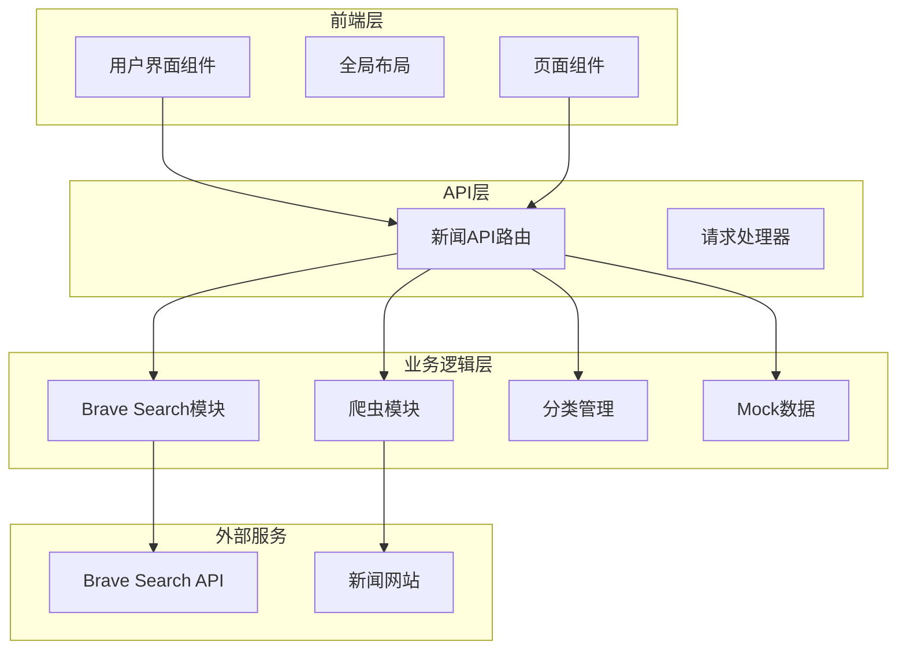
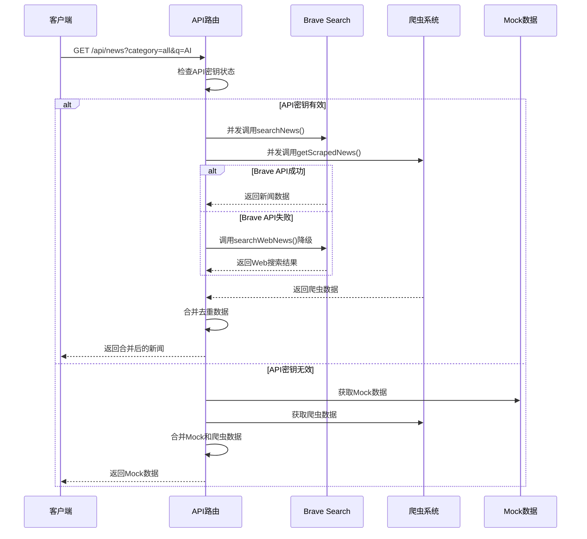
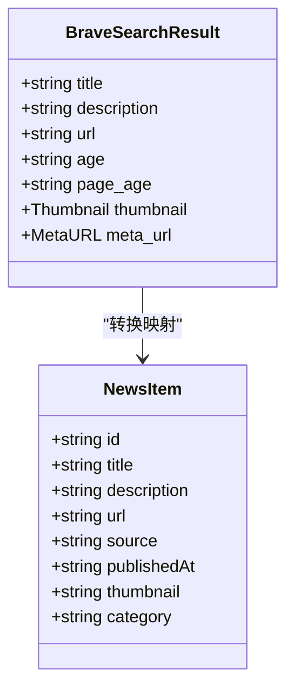
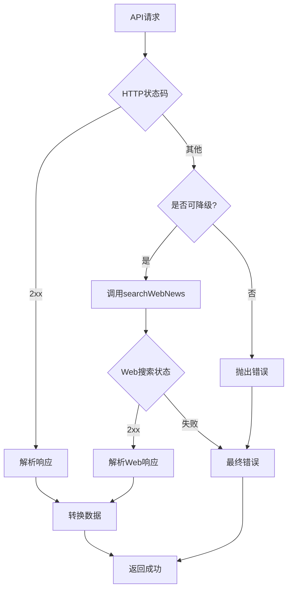
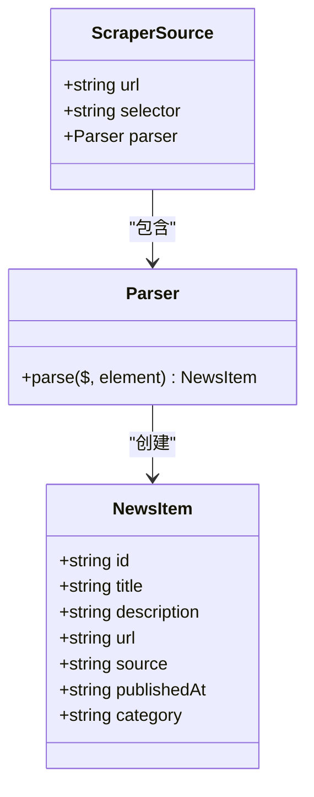
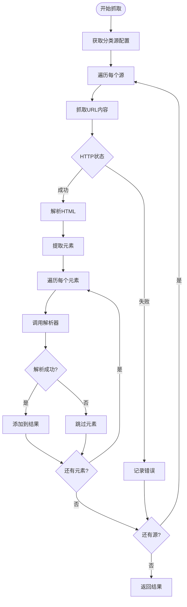
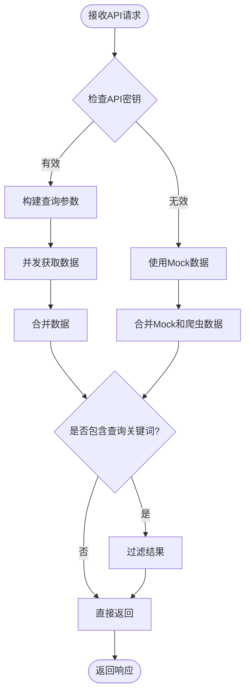

# 新闻数据获取系统

<cite>
**本文档引用的文件**
- [lib/brave-search.ts](file://lib/brave-search.ts)
- [lib/news-scraper.ts](file://lib/news-scraper.ts)
- [app/api/news/route.ts](file://app/api/news/route.ts)
- [lib/mock-data.ts](file://lib/mock-data.ts)
- [lib/news-categories.ts](file://lib/news-categories.ts)
- [app/page.tsx](file://app/page.tsx)
- [components/CategoryTabs.tsx](file://components/CategoryTabs.tsx)
- [components/SearchBar.tsx](file://components/SearchBar.tsx)
- [README.md](file://README.md)
- [package.json](file://package.json)
</cite>

## 目录
1. [简介](#简介)
2. [项目结构](#项目结构)
3. [核心组件](#核心组件)
4. [架构概览](#架构概览)
5. [详细组件分析](#详细组件分析)
6. [依赖关系分析](#依赖关系分析)
7. [性能考虑](#性能考虑)
8. [故障排除指南](#故障排除指南)
9. [结论](#结论)

## 简介

这是一个基于Next.js构建的新闻数据获取系统，集成了Brave Search API和自定义爬虫系统。该系统提供了以下核心功能：

- **Brave Search API集成**：通过官方API获取高质量的新闻数据
- **自定义爬虫系统**：从Hacker News等网站抓取新闻内容
- **双层数据源架构**：API失败时自动降级到爬虫数据
- **Mock数据支持**：开发环境下的模拟数据
- **分类浏览和搜索功能**：支持按类别和关键词搜索新闻

## 项目结构

项目采用标准的Next.js目录结构，主要分为以下几个部分：



**图表来源**
- [app/api/news/route.ts](file://app/api/news/route.ts#L1-L136)
- [lib/brave-search.ts](file://lib/brave-search.ts#L1-L115)
- [lib/news-scraper.ts](file://lib/news-scraper.ts#L1-L166)

**章节来源**
- [README.md](file://README.md#L36-L49)
- [package.json](file://package.json#L1-L30)

## 核心组件

### Brave Search API模块

Brave Search API模块提供了主要的新闻数据获取功能，包含以下关键特性：

- **API密钥验证**：运行时检查Brave API密钥配置
- **参数配置**：支持查询关键词、数量限制、新鲜度过滤
- **错误降级机制**：API失败时自动切换到Web搜索
- **数据格式转换**：统一NewsItem接口格式

### 自定义爬虫系统

爬虫系统实现了对Hacker News的新闻抓取，具有以下特点：

- **多分类支持**：支持all、tech、business、politics四个分类
- **选择器配置**：针对不同分类配置特定的选择器
- **数据解析器**：自定义解析器处理不同类型的新闻内容
- **错误处理**：单个网站失败不影响整体抓取结果

### API路由控制器

API路由负责协调各个数据源，实现智能的数据合并和降级策略。

**章节来源**
- [lib/brave-search.ts](file://lib/brave-search.ts#L30-L73)
- [lib/news-scraper.ts](file://lib/news-scraper.ts#L140-L153)
- [app/api/news/route.ts](file://app/api/news/route.ts#L39-L135)

## 架构概览

系统采用分层架构设计，实现了高可用性和容错能力：



**图表来源**
- [app/api/news/route.ts](file://app/api/news/route.ts#L39-L135)
- [lib/brave-search.ts](file://lib/brave-search.ts#L30-L73)
- [lib/news-scraper.ts](file://lib/news-scraper.ts#L140-L153)

## 详细组件分析

### searchNews函数详解

searchNews是系统的核心函数，负责调用Brave Search API获取新闻数据。

#### 函数签名和参数


**图表来源**
- [lib/brave-search.ts](file://lib/brave-search.ts#L30-L73)

#### 参数配置详解

searchNews函数支持以下参数配置：

| 参数名 | 类型 | 默认值 | 描述 |
|--------|------|--------|------|
| query | string | 必需 | 搜索关键词 |
| category | string | 必需 | 新闻分类标识符 |
| count | number | 20 | 返回结果数量 |

**章节来源**
- [lib/brave-search.ts](file://lib/brave-search.ts#L30-L45)

#### 响应数据处理

函数将Brave Search的原始响应转换为统一的NewsItem格式：



**图表来源**
- [lib/brave-search.ts](file://lib/brave-search.ts#L1-L25)

#### 错误降级机制

系统实现了多层次的错误处理和降级策略：



**图表来源**
- [lib/brave-search.ts](file://lib/brave-search.ts#L55-L58)
- [lib/brave-search.ts](file://lib/brave-search.ts#L97-L99)

**章节来源**
- [lib/brave-search.ts](file://lib/brave-search.ts#L55-L73)

### searchWebNews函数分析

searchWebNews作为searchNews的降级方案，提供了Web搜索功能：

#### 实现特点

- **关键词增强**：自动添加" news today"后缀以获取最新新闻
- **参数继承**：复用searchNews的参数配置
- **错误处理**：直接抛出API错误，不进行进一步降级

#### 请求流程


**图表来源**
- [lib/brave-search.ts](file://lib/brave-search.ts#L75-L114)

**章节来源**
- [lib/brave-search.ts](file://lib/brave-search.ts#L75-L114)

### 爬虫系统实现

爬虫系统专门用于从Hacker News抓取新闻数据：

#### 爬虫配置架构



**图表来源**
- [lib/news-scraper.ts](file://lib/news-scraper.ts#L5-L91)

#### 分类配置

系统为每个分类配置了特定的爬虫规则：

| 分类 | 目标网站 | 选择器 | 特殊处理 |
|------|----------|--------|----------|
| all | Hacker News | .titleline > a | 通用解析 |
| tech | Hacker News | .titleline > a | 技术类描述 |
| business | Hacker News | .titleline > a | 商业类描述 |
| politics | Hacker News | .titleline > a | 政治类描述 |

**章节来源**
- [lib/news-scraper.ts](file://lib/news-scraper.ts#L5-L91)

#### 数据抓取流程



**图表来源**
- [lib/news-scraper.ts](file://lib/news-scraper.ts#L116-L138)

**章节来源**
- [lib/news-scraper.ts](file://lib/news-scraper.ts#L93-L138)

### API路由控制器

API路由实现了智能的数据合并和降级策略：

#### 数据合并算法



**图表来源**
- [app/api/news/route.ts](file://app/api/news/route.ts#L39-L135)

#### 错误处理策略

API路由实现了完整的错误处理机制：

1. **API密钥验证**：检查环境变量配置
2. **并发请求**：同时获取API和爬虫数据
3. **降级机制**：API失败时使用Mock数据
4. **数据去重**：避免重复新闻条目
5. **错误日志**：记录详细的错误信息

**章节来源**
- [app/api/news/route.ts](file://app/api/news/route.ts#L39-L135)

## 依赖关系分析

系统的主要依赖关系如下：

```mermaid
graph TB
subgraph "外部依赖"
Cheerio[cheerio@^1.2.0]
Next[Next.js@^16.1.6]
React[React@^19.2.4]
end
subgraph "内部模块"
Route[app/api/news/route.ts]
Brave[lib/brave-search.ts]
Scraper[lib/news-scraper.ts]
Categories[lib/news-categories.ts]
Mock[lib/mock-data.ts]
end
subgraph "UI组件"
Page[app/page.tsx]
CategoryTabs[components/CategoryTabs.tsx]
SearchBar[components/SearchBar.tsx]
end
Route --> Brave
Route --> Scraper
Route --> Categories
Route --> Mock
Page --> Route
CategoryTabs --> Page
SearchBar --> Page
Scraper --> Cheerio
Route --> Next
Page --> React
```

**图表来源**
- [package.json](file://package.json#L15-L28)
- [app/api/news/route.ts](file://app/api/news/route.ts#L1-L6)
- [lib/news-scraper.ts](file://lib/news-scraper.ts#L1-L3)

**章节来源**
- [package.json](file://package.json#L15-L28)

## 性能考虑

### 并发优化

系统采用了多种并发优化策略：

1. **并行数据获取**：同时调用API和爬虫系统
2. **Promise.all优化**：使用Promise.all并发执行
3. **缓存策略**：利用浏览器缓存减少重复请求

### 内存管理

- **数据去重**：使用Set对象避免重复数据
- **流式处理**：爬虫系统使用流式HTML解析
- **垃圾回收**：及时释放不再使用的DOM节点

### 网络优化

- **HTTP压缩**：启用gzip压缩传输
- **连接复用**：复用HTTP连接减少延迟
- **超时控制**：设置合理的请求超时时间

## 故障排除指南

### API密钥配置问题

**问题症状**：系统返回Mock数据且显示API密钥配置错误

**解决方案**：
1. 检查.env.local文件中的BRAVE_API_KEY配置
2. 确认API密钥格式正确
3. 验证API配额是否充足

**章节来源**
- [app/api/news/route.ts](file://app/api/news/route.ts#L7-L11)
- [README.md](file://README.md#L24-L33)

### 网络请求失败

**问题症状**：API调用返回HTTP错误状态码

**解决方案**：
1. 检查网络连接状态
2. 验证Brave Search API服务可用性
3. 查看服务器端错误日志

**章节来源**
- [lib/brave-search.ts](file://lib/brave-search.ts#L55-L58)

### 爬虫系统异常

**问题症状**：爬虫数据为空或部分失败

**解决方案**：
1. 检查目标网站的可访问性
2. 验证CSS选择器是否仍然有效
3. 更新爬虫配置以适应网站变更

**章节来源**
- [lib/news-scraper.ts](file://lib/news-scraper.ts#L132-L135)

### 数据合并冲突

**问题症状**：新闻数据重复或丢失

**解决方案**：
1. 检查标题标准化处理
2. 验证去重算法逻辑
3. 确认数据源优先级设置

**章节来源**
- [app/api/news/route.ts](file://app/api/news/route.ts#L14-L37)

## 结论

这个新闻数据获取系统展现了现代Web应用的最佳实践：

### 技术优势

1. **高可用性架构**：双数据源设计确保服务稳定性
2. **智能降级机制**：API失败时自动切换到备用方案
3. **模块化设计**：清晰的职责分离便于维护
4. **错误处理完善**：多层次的错误捕获和恢复机制

### 扩展建议

1. **缓存策略**：实现Redis缓存减少API调用
2. **监控系统**：添加性能指标和错误追踪
3. **测试覆盖**：增加单元测试和集成测试
4. **国际化支持**：扩展多语言新闻源

### 使用场景

该系统适用于需要实时新闻聚合的各种应用场景，包括但不限于：

- 新闻门户网站
- 企业信息平台
- 学术研究工具
- 商业情报系统

通过其灵活的架构设计和完善的错误处理机制，该系统能够稳定地为用户提供高质量的新闻数据服务。