# 新闻数据获取系统

<cite>
**本文档引用的文件**
- [lib/translator.ts](file://lib/translator.ts)
- [lib/brave-search.ts](file://lib/brave-search.ts)
- [lib/news-scraper.ts](file://lib/news-scraper.ts)
- [app/api/news/route.ts](file://app/api/news/route.ts)
- [app/api/news/sources/route.ts](file://app/api/news/sources/route.ts)
- [lib/mock-data.ts](file://lib/mock-data.ts)
- [lib/news-categories.ts](file://lib/news-categories.ts)
- [lib/favorites.ts](file://lib/favorites.ts)
- [app/page.tsx](file://app/page.tsx)
- [components/CategoryTabs.tsx](file://components/CategoryTabs.tsx)
- [components/SearchBar.tsx](file://components/SearchBar.tsx)
- [README.md](file://README.md)
- [package.json](file://package.json)
</cite>

## 更新摘要
**所做更改**
- 新增翻译系统集成模块，支持英文新闻自动翻译
- 增强新闻聚合功能，新增Ant Group和DingTalk专用端点
- 实现实时监控功能，支持定时自动刷新
- 优化性能，引入多层缓存机制
- 扩展新闻源配置，支持更多专业领域

## 目录
1. [简介](#简介)
2. [项目结构](#项目结构)
3. [核心组件](#核心组件)
4. [架构概览](#架构概览)
5. [详细组件分析](#详细组件分析)
6. [依赖关系分析](#依赖关系分析)
7. [性能考虑](#性能考虑)
8. [故障排除指南](#故障排除指南)
9. [结论](#结论)

## 简介

这是一个基于Next.js构建的现代化新闻数据获取系统，集成了Brave Search API和自定义爬虫系统。该系统提供了以下核心功能：

- **Brave Search API集成**：通过官方API获取高质量的新闻数据
- **自定义爬虫系统**：从Hacker News等网站抓取新闻内容
- **智能翻译系统**：自动检测并翻译英文新闻内容
- **增强的新闻聚合**：支持Ant Group和DingTalk专用新闻端点
- **实时监控功能**：定时自动刷新关键新闻源
- **多层缓存机制**：优化性能和用户体验
- **双层数据源架构**：API失败时自动降级到爬虫数据
- **Mock数据支持**：开发环境下的模拟数据
- **分类浏览和搜索功能**：支持按类别和关键词搜索新闻

## 项目结构

项目采用标准的Next.js目录结构，主要分为以下几个部分：

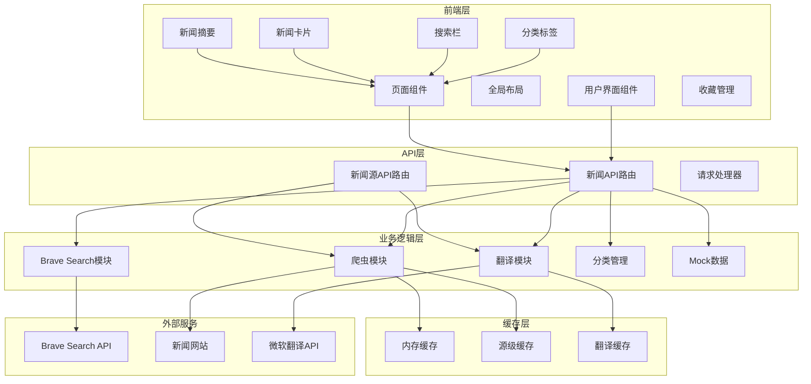

**图表来源**
- [app/api/news/route.ts](file://app/api/news/route.ts#L1-L189)
- [app/api/news/sources/route.ts](file://app/api/news/sources/route.ts#L1-L37)
- [lib/brave-search.ts](file://lib/brave-search.ts#L1-L115)
- [lib/news-scraper.ts](file://lib/news-scraper.ts#L1-L873)
- [lib/translator.ts](file://lib/translator.ts#L1-L132)

**章节来源**
- [README.md](file://README.md#L36-L49)
- [package.json](file://package.json#L1-L30)

## 核心组件

### 翻译系统模块

翻译系统模块提供了智能的英文新闻自动翻译功能，包含以下关键特性：

- **Edge翻译API集成**：使用微软Edge浏览器的公开翻译服务
- **Token缓存机制**：自动管理翻译API的认证令牌
- **批量翻译优化**：支持批量处理多个文本的翻译请求
- **翻译结果缓存**：避免重复翻译相同的文本内容
- **智能英文检测**：自动识别需要翻译的英文内容
- **错误降级处理**：翻译失败时保留原文内容

### 增强的新闻聚合系统

系统新增了专门针对企业新闻的聚合功能：

- **Ant Group专用端点**：支持蚂蚁集团相关新闻的专门抓取
- **DingTalk专用端点**：支持钉钉相关新闻的专门聚合
- **关键词过滤机制**：精确匹配企业相关新闻内容
- **多源数据合并**：结合专用源和通用源的数据
- **实时更新机制**：支持定时自动刷新企业新闻

### 实时监控功能

系统实现了多维度的实时监控和自动刷新：

- **定时刷新机制**：每2分钟自动刷新企业相关新闻
- **获取时间标记**：为每条新闻添加获取时间戳
- **状态指示器**：显示数据加载状态和更新时间
- **滚动新闻栏**：实时展示最新的重要新闻动态

### 性能优化缓存系统

系统引入了多层缓存机制来提升性能：

- **内存缓存**：快速访问最近抓取的新闻数据
- **源级缓存**：按新闻源维度缓存数据
- **翻译缓存**：缓存翻译结果避免重复请求
- **智能过期机制**：不同内容设置不同的缓存过期时间
- **缓存清理功能**：支持按需清理特定源的缓存

**章节来源**
- [lib/translator.ts](file://lib/translator.ts#L1-L132)
- [lib/news-scraper.ts](file://lib/news-scraper.ts#L9-L34)
- [app/page.tsx](file://app/page.tsx#L100-L138)
- [app/api/news/route.ts](file://app/api/news/route.ts#L14-L64)

## 架构概览

系统采用分层架构设计，实现了高可用性和容错能力：

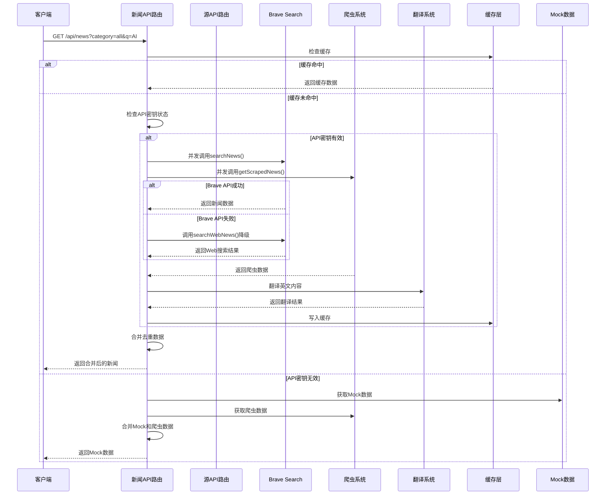

**图表来源**
- [app/api/news/route.ts](file://app/api/news/route.ts#L12-L188)
- [lib/brave-search.ts](file://lib/brave-search.ts#L30-L73)
- [lib/news-scraper.ts](file://lib/news-scraper.ts#L352-L364)
- [lib/translator.ts](file://lib/translator.ts#L44-L119)

## 详细组件分析

### 翻译系统详解

翻译系统是本次更新的核心组件，提供了完整的英文新闻翻译功能。

#### 翻译流程架构

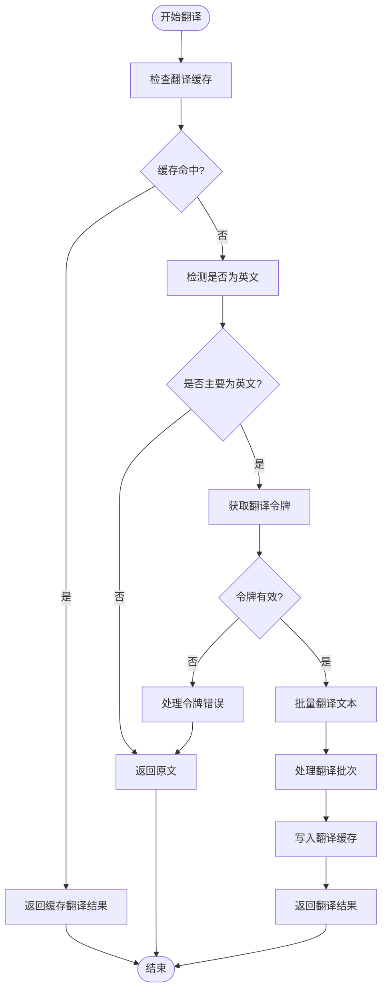

**图表来源**
- [lib/translator.ts](file://lib/translator.ts#L44-L119)

#### Token管理机制

翻译系统实现了智能的令牌管理：

- **自动刷新机制**：令牌有效期9分钟，自动在过期前刷新
- **错误处理**：令牌获取失败时的降级策略
- **并发安全**：避免重复的令牌获取请求
- **超时控制**：8秒超时保护防止长时间阻塞

#### 批量翻译优化

系统支持高效的批量翻译处理：

- **批次大小控制**：每批最多25条文本，符合API限制
- **并行处理**：多个批次可以并行处理
- **错误隔离**：单个批次失败不影响其他批次
- **缓存策略**：翻译结果自动缓存避免重复请求

**章节来源**
- [lib/translator.ts](file://lib/translator.ts#L15-L37)
- [lib/translator.ts](file://lib/translator.ts#L44-L119)
- [lib/translator.ts](file://lib/translator.ts#L124-L131)

### 增强的新闻聚合系统

系统新增了专门的企业新闻聚合功能，支持Ant Group和DingTalk的专用端点。

#### 企业新闻聚合架构

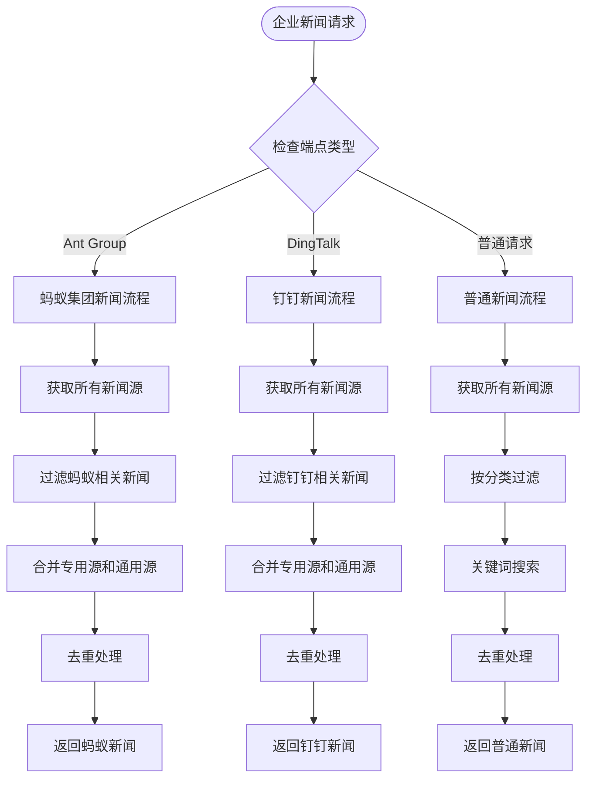

**图表来源**
- [app/api/news/route.ts](file://app/api/news/route.ts#L14-L64)
- [app/api/news/route.ts](file://app/api/news/route.ts#L67-L118)

#### Ant Group专用聚合

蚂蚁集团新闻聚合实现了精确的企业相关新闻筛选：

- **专用源抓取**：直接从蚂蚁相关的新闻源获取数据
- **关键词匹配**：使用20个关键词精确匹配蚂蚁集团相关内容
- **多源数据融合**：结合专用源和通用源的数据
- **智能去重**：避免重复显示相同新闻
- **实时更新**：每2分钟自动刷新数据

#### DingTalk专用聚合

钉钉新闻聚合提供了企业协作工具的专门新闻源：

- **多源专用抓取**：从5个钉钉相关的科技媒体获取数据
- **关键词过滤**：使用13个关键词精确匹配钉钉相关内容
- **动态新闻优化**：使用2分钟短缓存提高实时性
- **数据质量保证**：确保新闻内容的相关性和准确性

**章节来源**
- [app/api/news/route.ts](file://app/api/news/route.ts#L14-L64)
- [app/api/news/route.ts](file://app/api/news/route.ts#L67-L118)
- [lib/news-scraper.ts](file://lib/news-scraper.ts#L390-L406)

### 实时监控功能实现

系统实现了多维度的实时监控和自动刷新功能。

#### 自动刷新机制

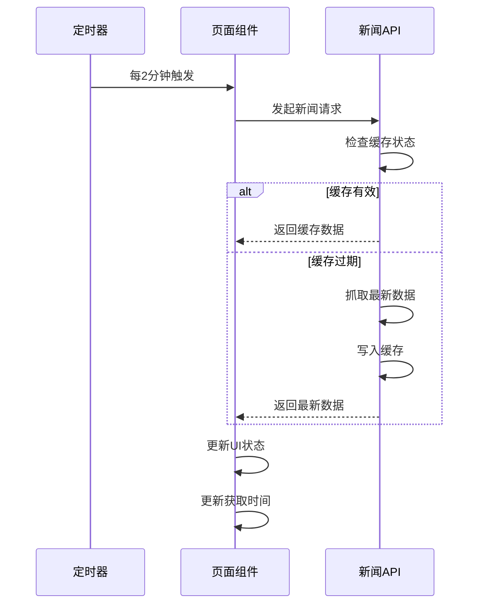

**图表来源**
- [app/page.tsx](file://app/page.tsx#L100-L138)

#### 实时新闻展示

系统提供了三种实时新闻展示方式：

1. **伊朗局势滚动栏**：展示中东地区重要新闻
2. **钉钉动态滚动栏**：展示企业协作工具相关新闻
3. **蚂蚁集团新闻滚动栏**：展示金融科技公司相关新闻

每种滚动栏都有独立的定时刷新机制和获取时间显示。

**章节来源**
- [app/page.tsx](file://app/page.tsx#L100-L138)
- [app/page.tsx](file://app/page.tsx#L200-L377)

### 性能优化缓存系统

系统引入了多层缓存机制来显著提升性能。

#### 缓存层次结构

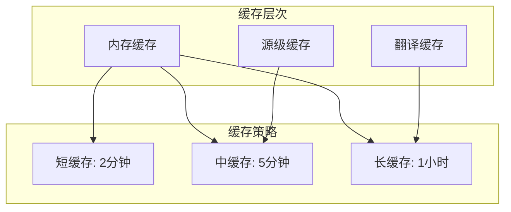

**图表来源**
- [lib/news-scraper.ts](file://lib/news-scraper.ts#L9-L23)

#### 缓存管理策略

系统实现了智能的缓存管理：

- **动态缓存时间**：根据内容类型设置不同的缓存时间
- **缓存键设计**：合理设计缓存键避免冲突
- **缓存失效机制**：支持按需清除特定缓存
- **内存使用控制**：避免缓存占用过多内存

**章节来源**
- [lib/news-scraper.ts](file://lib/news-scraper.ts#L9-L34)
- [lib/translator.ts](file://lib/translator.ts#L12-L13)

### searchNews函数详解

searchNews是系统的核心函数，负责调用Brave Search API获取新闻数据。

#### 函数签名和参数

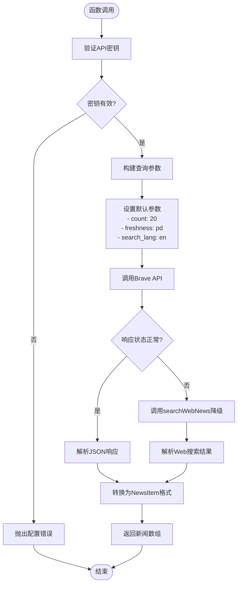

**图表来源**
- [lib/brave-search.ts](file://lib/brave-search.ts#L30-L73)

#### 参数配置详解

searchNews函数支持以下参数配置：

| 参数名 | 类型 | 默认值 | 描述 |
|--------|------|--------|------|
| query | string | 必需 | 搜索关键词 |
| category | string | 必需 | 新闻分类标识符 |
| count | number | 20 | 返回结果数量 |

**章节来源**
- [lib/brave-search.ts](file://lib/brave-search.ts#L30-L45)

#### 响应数据处理

函数将Brave Search的原始响应转换为统一的NewsItem格式：

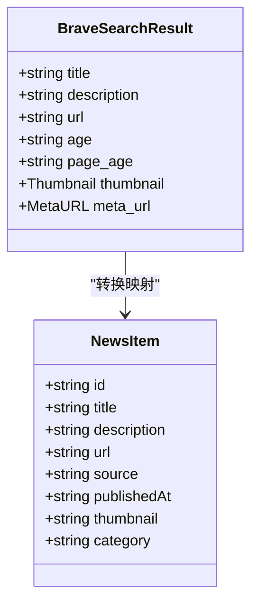

**图表来源**
- [lib/brave-search.ts](file://lib/brave-search.ts#L1-L25)

#### 错误降级机制

系统实现了多层次的错误处理和降级策略：

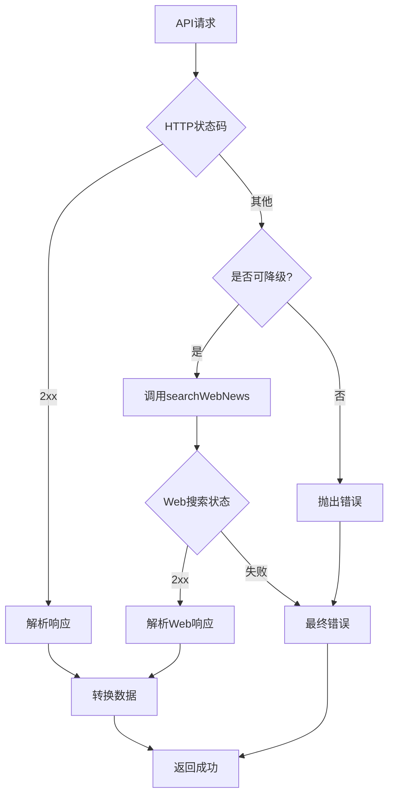

**图表来源**
- [lib/brave-search.ts](file://lib/brave-search.ts#L55-L58)
- [lib/brave-search.ts](file://lib/brave-search.ts#L97-L99)

**章节来源**
- [lib/brave-search.ts](file://lib/brave-search.ts#L55-L73)

### searchWebNews函数分析

searchWebNews作为searchNews的降级方案，提供了Web搜索功能：

#### 实现特点

- **关键词增强**：自动添加" news today"后缀以获取最新新闻
- **参数继承**：复用searchNews的参数配置
- **错误处理**：直接抛出API错误，不进行进一步降级

#### 请求流程


**图表来源**
- [lib/brave-search.ts](file://lib/brave-search.ts#L75-L114)

**章节来源**
- [lib/brave-search.ts](file://lib/brave-search.ts#L75-L114)

### 爬虫系统实现

爬虫系统专门用于从各种新闻网站抓取新闻数据，现已集成翻译功能。

#### 爬虫配置架构

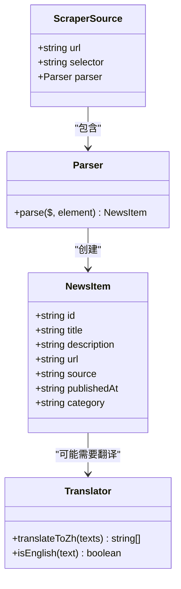

**图表来源**
- [lib/news-scraper.ts](file://lib/news-scraper.ts#L1-L8)
- [lib/news-scraper.ts](file://lib/news-scraper.ts#L325-L339)

#### 分类配置

系统为每个分类配置了特定的爬虫规则：

| 分类 | 目标网站 | 选择器 | 特殊处理 |
|------|----------|--------|----------|
| all | 36氪、虎嗅、联合早报 | 多种选择器 | 通用解析 |
| tech | 少数派、36氪科技 | .article-title | 技术类描述 |
| business | 虎嗅、36氪商业 | .article-item | 商业类描述 |
| politics | 澎湃新闻、环球时报 | .small_cardcontent | 时事类描述 |

**章节来源**
- [lib/news-scraper.ts](file://lib/news-scraper.ts#L37-L269)

#### 数据抓取流程

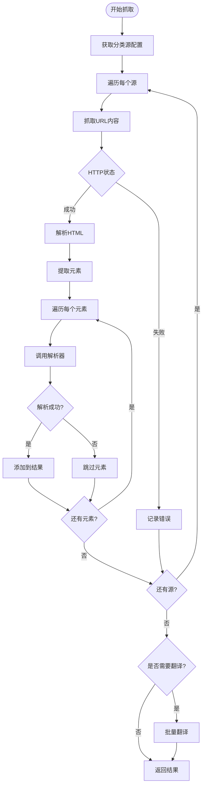

**图表来源**
- [lib/news-scraper.ts](file://lib/news-scraper.ts#L299-L349)

#### 翻译集成机制

爬虫系统集成了智能翻译功能：

- **英文检测**：自动检测需要翻译的英文内容
- **批量翻译**：对同一源的多个新闻进行批量翻译
- **缓存优化**：翻译结果自动缓存
- **错误处理**：翻译失败不影响整体抓取结果

**章节来源**
- [lib/news-scraper.ts](file://lib/news-scraper.ts#L299-L349)
- [lib/news-scraper.ts](file://lib/news-scraper.ts#L827-L854)

### API路由控制器

API路由实现了智能的数据合并和降级策略，现已支持企业新闻端点。

#### 数据合并算法

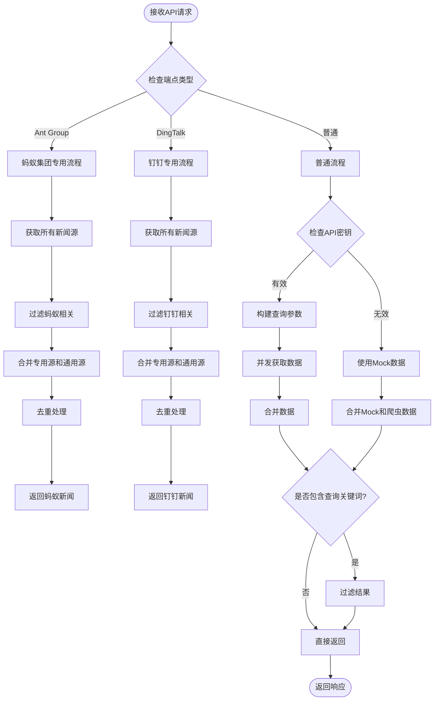

**图表来源**
- [app/api/news/route.ts](file://app/api/news/route.ts#L5-L188)

#### 错误处理策略

API路由实现了完整的错误处理机制：

1. **API密钥验证**：检查环境变量配置
2. **并发请求**：同时获取API和爬虫数据
3. **降级机制**：API失败时使用Mock数据
4. **数据去重**：避免重复新闻条目
5. **错误日志**：记录详细的错误信息
6. **企业新闻端点**：支持专用的企业新闻聚合

**章节来源**
- [app/api/news/route.ts](file://app/api/news/route.ts#L5-L188)

## 依赖关系分析

系统的主要依赖关系如下：

```mermaid
graph TB
subgraph "外部依赖"
Cheerio[cheerio@^1.2.0]
Next[Next.js@^16.1.6]
React[React@^19.2.4]
EdgeAPI[微软翻译API]
BraveAPI[Brave Search API]
end
subgraph "内部模块"
NewsAPI[app/api/news/route.ts]
SourcesAPI[app/api/news/sources/route.ts]
Brave[lib/brave-search.ts]
Scraper[lib/news-scraper.ts]
Translator[lib/translator.ts]
Categories[lib/news-categories.ts]
Mock[lib/mock-data.ts]
Favorites[lib/favorites.ts]
end
subgraph "UI组件"
Page[app/page.tsx]
CategoryTabs[components/CategoryTabs.tsx]
SearchBar[components/SearchBar.tsx]
NewsCard[components/NewsCard.tsx]
NewsSummary[components/NewsSummary.tsx]
end
NewsAPI --> Brave
NewsAPI --> Scraper
NewsAPI --> Translator
NewsAPI --> Categories
NewsAPI --> Mock
SourcesAPI --> Scraper
SourcesAPI --> Translator
Page --> NewsAPI
Page --> Favorites
CategoryTabs --> Page
SearchBar --> Page
NewsCard --> Page
NewsSummary --> Page
Scraper --> Cheerio
NewsAPI --> Next
Page --> React
```

**图表来源**
- [package.json](file://package.json#L15-L28)
- [app/api/news/route.ts](file://app/api/news/route.ts#L1-L6)
- [lib/news-scraper.ts](file://lib/news-scraper.ts#L1-L4)
- [lib/translator.ts](file://lib/translator.ts#L1-L4)

**章节来源**
- [package.json](file://package.json#L15-L28)

## 性能考虑

### 多层缓存优化

系统采用了多种缓存优化策略：

1. **内存缓存**：快速访问最近抓取的新闻数据
2. **源级缓存**：按新闻源维度缓存数据
3. **翻译缓存**：缓存翻译结果避免重复请求
4. **智能过期**：不同内容设置不同的缓存过期时间
5. **缓存清理**：支持按需清理特定源的缓存

### 并发优化

系统采用了多种并发优化策略：

1. **并行数据获取**：同时调用API和爬虫系统
2. **Promise.all优化**：使用Promise.all并发执行
3. **批量翻译**：对同一源的多个新闻进行批量翻译
4. **定时刷新**：使用定时器实现自动刷新

### 网络优化

- **HTTP压缩**：启用gzip压缩传输
- **连接复用**：复用HTTP连接减少延迟
- **超时控制**：设置合理的请求超时时间
- **错误重试**：对临时性错误进行重试

### 内存管理

- **数据去重**：使用Set对象避免重复数据
- **流式处理**：爬虫系统使用流式HTML解析
- **垃圾回收**：及时释放不再使用的DOM节点
- **缓存清理**：定期清理过期的缓存数据

## 故障排除指南

### API密钥配置问题

**问题症状**：系统返回Mock数据且显示API密钥配置错误

**解决方案**：
1. 检查.env.local文件中的BRAVE_API_KEY配置
2. 确认API密钥格式正确
3. 验证API配额是否充足

**章节来源**
- [app/api/news/route.ts](file://app/api/news/route.ts#L7-L11)
- [README.md](file://README.md#L24-L33)

### 网络请求失败

**问题症状**：API调用返回HTTP错误状态码

**解决方案**：
1. 检查网络连接状态
2. 验证Brave Search API服务可用性
3. 查看服务器端错误日志

**章节来源**
- [lib/brave-search.ts](file://lib/brave-search.ts#L55-L58)

### 爬虫系统异常

**问题症状**：爬虫数据为空或部分失败

**解决方案**：
1. 检查目标网站的可访问性
2. 验证CSS选择器是否仍然有效
3. 更新爬虫配置以适应网站变更
4. 检查翻译系统是否正常工作

**章节来源**
- [lib/news-scraper.ts](file://lib/news-scraper.ts#L340-L343)
- [lib/translator.ts](file://lib/translator.ts#L110-L116)

### 翻译系统问题

**问题症状**：英文新闻无法翻译或翻译质量差

**解决方案**：
1. 检查网络连接是否正常
2. 验证微软翻译API的可用性
3. 查看翻译缓存是否正常工作
4. 检查英文检测算法的准确性

**章节来源**
- [lib/translator.ts](file://lib/translator.ts#L15-L37)
- [lib/translator.ts](file://lib/translator.ts#L110-L116)

### 企业新闻端点问题

**问题症状**：Ant Group或DingTalk新闻端点返回空数据

**解决方案**：
1. 检查专用新闻源是否正常工作
2. 验证关键词过滤逻辑
3. 确认缓存机制正常运行
4. 检查定时刷新机制

**章节来源**
- [app/api/news/route.ts](file://app/api/news/route.ts#L14-L64)
- [app/api/news/route.ts](file://app/api/news/route.ts#L67-L118)

### 实时监控功能异常

**问题症状**：新闻滚动栏不更新或更新频率异常

**解决方案**：
1. 检查定时器是否正常工作
2. 验证API请求是否成功
3. 确认缓存机制是否正常
4. 检查获取时间显示逻辑

**章节来源**
- [app/page.tsx](file://app/page.tsx#L100-L138)

### 数据合并冲突

**问题症状**：新闻数据重复或丢失

**解决方案**：
1. 检查标题标准化处理
2. 验证去重算法逻辑
3. 确认数据源优先级设置
4. 检查缓存键的设计

**章节来源**
- [app/api/news/route.ts](file://app/api/news/route.ts#L41-L47)
- [lib/news-scraper.ts](file://lib/news-scraper.ts#L159-L168)

## 结论

这个新闻数据获取系统展现了现代Web应用的最佳实践：

### 技术优势

1. **高可用性架构**：双数据源设计确保服务稳定性
2. **智能降级机制**：API失败时自动切换到备用方案
3. **模块化设计**：清晰的职责分离便于维护
4. **多层缓存优化**：显著提升系统性能
5. **智能翻译功能**：自动处理英文新闻内容
6. **实时监控能力**：支持定时自动刷新关键新闻
7. **企业级功能**：专门的企业新闻聚合端点
8. **错误处理完善**：多层次的错误捕获和恢复机制

### 扩展建议

1. **监控系统**：添加性能指标和错误追踪
2. **测试覆盖**：增加单元测试和集成测试
3. **国际化支持**：扩展多语言新闻源
4. **缓存持久化**：实现Redis缓存减少API调用
5. **负载均衡**：支持多实例部署

### 使用场景

该系统适用于需要实时新闻聚合的各种应用场景，包括但不限于：

- 新闻门户网站
- 企业信息平台
- 学术研究工具
- 商业情报系统
- 企业内部通讯系统

通过其灵活的架构设计、完善的错误处理机制和智能化的功能特性，该系统能够稳定地为用户提供高质量的新闻数据服务，特别是在企业新闻聚合和实时监控方面表现突出。